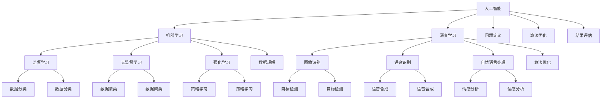

                 

### 1. 背景介绍

在过去的几十年中，人工智能（AI）技术经历了飞速的发展，从最初的规则推理和模式识别，到如今深度学习、强化学习等复杂算法的广泛应用，AI 正在逐渐改变我们的生活方式和社会结构。随着 AI 技术的日益成熟，人类智慧与 AI 的协同作用也成为了研究的热点。本文将探讨 AI 时代下，人类智慧如何成为新的力量，以及这一变革对技术、产业和社会的深远影响。

人类智慧与人工智能的协同关系并非全新概念。早在 20 世纪 50 年代，艾伦·图灵就提出了“机器智能”的概念，试图通过模拟人类思维过程来创造智能机器。随着时间的推移，人们逐渐认识到，单纯依赖机器智能无法达到与人类智慧相媲美的水平。相反，通过将人类智慧与机器智能相结合，可以发挥各自的优势，实现更高效的智能系统。

进入 21 世纪，随着大数据、云计算、神经网络等技术的突破，AI 技术迎来了爆发式增长。在许多领域，如医疗、金融、交通、教育等，AI 都展现出了巨大的潜力。然而，这些领域的成功并非仅仅依靠 AI 本身，而是离不开人类智慧的引导和优化。例如，在医疗领域，AI 可以通过分析大量病例数据，为医生提供诊断建议，但最终的决策仍需医生根据经验和判断进行。

因此，在 AI 时代，人类智慧与 AI 的协同作用愈发重要。一方面，人类智慧可以为 AI 提供指导，帮助其更好地理解和解决问题；另一方面，AI 可以通过模拟和扩展人类智慧，实现更广泛的智能应用。本文将围绕这一主题，深入探讨人类智慧在 AI 时代的新力量，以及其背后的原理和实践。

### 2. 核心概念与联系

要理解人类智慧与 AI 的协同关系，我们需要先了解一些核心概念，包括人工智能、人类智慧、机器学习和深度学习等。以下是这些概念的定义和它们之间的联系：

#### 2.1 人工智能

人工智能（Artificial Intelligence，简称 AI）是指通过计算机程序实现智能行为的技术。这些智能行为包括感知、学习、推理、决策和问题解决等。人工智能的目标是创建能够模拟人类思维过程的系统，使其具备智能解决问题的能力。

#### 2.2 人类智慧

人类智慧是指人类在感知、理解、推理、创造和解决问题等方面表现出来的能力。人类智慧具有以下特点：

- **适应性**：人类智慧能够适应复杂多变的环境和情境。
- **创造性**：人类智慧能够进行创新和创造，提出新颖的想法和解决方案。
- **灵活性**：人类智慧能够灵活运用知识，解决各种未知的问题。
- **情感认知**：人类智慧能够理解和表达情感，进行社会互动。

#### 2.3 机器学习

机器学习（Machine Learning，简称 ML）是人工智能的一个重要分支，它通过数据驱动的方式，使计算机系统能够自动学习和改进。机器学习主要包括监督学习、无监督学习和强化学习等方法。

- **监督学习**：通过已有数据集的训练，使系统学会对新数据进行分类或回归。
- **无监督学习**：通过未标记的数据集，使系统自动发现数据中的模式或结构。
- **强化学习**：通过与环境交互，使系统学会最优策略，以实现特定目标。

#### 2.4 深度学习

深度学习（Deep Learning，简称 DL）是机器学习的一个子领域，它通过多层神经网络，对大量数据进行自动特征提取和模型训练。深度学习在图像识别、语音识别、自然语言处理等领域取得了显著成果。

#### 2.5 核心概念联系

人类智慧与 AI 的协同关系可以从以下几个方面来理解：

- **数据理解**：人类智慧可以通过对数据的感知和理解，为 AI 提供有价值的输入。例如，在医疗领域，医生的经验可以帮助 AI 系统更好地理解和分析病例数据。
- **算法优化**：人类智慧可以指导 AI 算法的优化，使其在特定任务上表现更佳。例如，在图像识别中，人类智慧可以通过调整神经网络的结构和参数，提高识别准确率。
- **问题定义**：人类智慧可以帮助 AI 明确问题的本质和目标，使其更专注于解决关键问题。例如，在自动驾驶领域，人类智慧可以帮助 AI 确定行驶路径和交通规则。
- **结果评估**：人类智慧可以对 AI 的结果进行评估和验证，确保其符合预期和实际需求。例如，在金融风控中，人类智慧可以帮助 AI 识别潜在的风险和异常。

总的来说，人类智慧与 AI 的协同关系是一个相互促进的过程。通过结合人类智慧和机器智能，我们可以构建更强大、更智能的计算机系统，为各个领域的发展提供新动力。

#### 2.6 核心概念原理和架构的 Mermaid 流程图

以下是一个简化的 Mermaid 流程图，展示了人类智慧与 AI 的协同关系及其核心概念：



通过这个流程图，我们可以清晰地看到人类智慧与 AI 各个核心概念之间的联系和相互作用。

### 3. 核心算法原理 & 具体操作步骤

在探讨人类智慧与 AI 的协同关系时，我们不可避免地要涉及到一些核心算法，如深度学习、神经网络和强化学习。这些算法不仅构成了 AI 技术的核心，也为人类智慧与 AI 的协同提供了基础。下面，我们将逐步介绍这些算法的原理和具体操作步骤。

#### 3.1 深度学习原理

深度学习是一种基于多层神经网络的机器学习技术，其核心思想是通过多层非线性变换，自动提取数据中的复杂特征。以下是深度学习的原理和具体操作步骤：

1. **神经网络结构**：深度学习通常由多个层次组成，包括输入层、隐藏层和输出层。每一层都将输入数据通过一系列非线性变换（如卷积、池化、激活函数等）转化为更高级的特征表示。

2. **前向传播**：在前向传播过程中，输入数据从输入层开始，逐层传递到隐藏层和输出层。每个节点（神经元）都接受前一层的输出，通过加权求和和激活函数，产生当前层的输出。

3. **反向传播**：在反向传播过程中，计算输出层到隐藏层，再到输入层的梯度。通过梯度下降等优化算法，调整网络的权重和偏置，使网络的输出更接近期望值。

4. **损失函数**：损失函数用于衡量网络输出与期望输出之间的差距。常用的损失函数包括均方误差（MSE）、交叉熵等。

5. **优化算法**：优化算法用于调整网络参数，以最小化损失函数。常见的优化算法有梯度下降、Adam 等。

#### 3.2 神经网络结构

神经网络是深度学习的基础，其结构直接影响网络的性能。以下是一些常见的神经网络结构：

1. **卷积神经网络（CNN）**：CNN 主要用于图像处理任务，其特点是通过对图像进行卷积和池化操作，提取图像的局部特征。

2. **循环神经网络（RNN）**：RNN 主要用于序列数据建模，其特点是通过对序列数据进行循环处理，捕捉序列中的长期依赖关系。

3. **长短时记忆网络（LSTM）**：LSTM 是 RNN 的一个变种，主要用于解决 RNN 的梯度消失问题，使其能够处理更长的序列。

4. **生成对抗网络（GAN）**：GAN 是一种无监督学习技术，其核心思想是通过生成器和判别器的对抗训练，生成具有真实数据分布的样例。

#### 3.3 强化学习原理

强化学习是一种通过与环境交互，学习最优策略的机器学习技术。其核心思想是通过奖励和惩罚信号，使学习代理（agent）在环境中不断调整行为，以实现特定目标。以下是强化学习的原理和具体操作步骤：

1. **环境与代理**：环境是一个能够接收代理行为并返回状态和奖励的实体。代理是一个能够根据当前状态选择行为的智能体。

2. **状态与动作**：状态是代理在环境中所处的情景描述，动作是代理在特定状态下可以执行的行为。

3. **奖励与惩罚**：奖励用于鼓励代理执行有益的行为，惩罚用于阻止代理执行有害的行为。

4. **策略**：策略是代理在特定状态下选择动作的策略。强化学习的目标是学习一个最优策略，使代理在长期中获取最大的累积奖励。

5. **价值函数**：价值函数用于衡量代理在特定状态下执行特定动作的长期奖励。常见的价值函数包括状态值函数和动作值函数。

6. **策略评估与优化**：策略评估是通过评估不同策略的价值函数，选择最优策略。策略优化是通过更新代理的策略，使其在长期中取得更好的表现。

通过以上介绍，我们可以看到深度学习、神经网络和强化学习在人类智慧与 AI 协同中的作用。这些算法不仅为 AI 技术提供了强大的工具，也为人类智慧与 AI 的协同提供了新的可能性。

### 4. 数学模型和公式 & 详细讲解 & 举例说明

在理解人类智慧与 AI 协同的过程中，数学模型和公式是不可或缺的工具。这些模型和公式帮助我们量化人类智慧与 AI 的交互，并提供了理论基础。以下是几个关键的数学模型和公式，以及它们的详细讲解和举例说明。

#### 4.1 损失函数

损失函数是深度学习中的一个核心概念，用于衡量模型预测值与实际值之间的差距。一个常用的损失函数是均方误差（MSE），其公式如下：

\[ \text{MSE} = \frac{1}{n}\sum_{i=1}^{n}(y_i - \hat{y}_i)^2 \]

其中，\( y_i \) 是实际值，\( \hat{y}_i \) 是预测值，\( n \) 是样本数量。

**举例说明**：

假设我们有一个数据集，包含10个样本，每个样本的实际值和预测值如下：

\[ y_1 = 3, \hat{y}_1 = 2.8 \]
\[ y_2 = 5, \hat{y}_2 = 5.2 \]
\[ \vdots \]
\[ y_{10} = 8, \hat{y}_{10} = 7.9 \]

使用均方误差计算损失：

\[ \text{MSE} = \frac{1}{10}\sum_{i=1}^{10}(y_i - \hat{y}_i)^2 \]
\[ \text{MSE} = \frac{1}{10}((3-2.8)^2 + (5-5.2)^2 + \ldots + (8-7.9)^2) \]
\[ \text{MSE} = 0.06 \]

#### 4.2 梯度下降

梯度下降是优化神经网络参数的一种常用算法，其核心思想是沿着损失函数的负梯度方向更新参数，以最小化损失。梯度下降的公式如下：

\[ \theta_{\text{new}} = \theta_{\text{current}} - \alpha \nabla_{\theta} J(\theta) \]

其中，\( \theta \) 是参数，\( \alpha \) 是学习率，\( \nabla_{\theta} J(\theta) \) 是损失函数 \( J(\theta) \) 对参数 \( \theta \) 的梯度。

**举例说明**：

假设我们有一个简单的线性模型，参数 \( \theta \) 是模型的权重，损失函数是均方误差 \( J(\theta) \)：

\[ \theta = 2 \]
\[ \alpha = 0.01 \]

损失函数 \( J(\theta) \) 对 \( \theta \) 的梯度是：

\[ \nabla_{\theta} J(\theta) = 2(y - \hat{y}) \]

假设当前预测值 \( \hat{y} \) 为 3，实际值 \( y \) 为 2，则梯度为：

\[ \nabla_{\theta} J(\theta) = 2(2 - 3) = -2 \]

使用梯度下降更新参数：

\[ \theta_{\text{new}} = 2 - 0.01 \times (-2) = 2.02 \]

#### 4.3 反向传播

反向传播是深度学习中的一个关键步骤，用于计算损失函数对每个参数的梯度。反向传播的公式如下：

\[ \nabla_{\theta} J(\theta) = \sum_{i=1}^{n} \nabla_{\theta} \hat{y}_i \nabla_{\hat{y}_i} y_i \]

其中，\( n \) 是神经网络的层数，\( \nabla_{\theta} \hat{y}_i \) 是损失函数对预测值的梯度，\( \nabla_{\hat{y}_i} y_i \) 是预测值对实际值的梯度。

**举例说明**：

假设我们有一个单层神经网络，包含一个输入节点、一个隐藏节点和一个输出节点。输入值 \( x \) 为 2，实际值 \( y \) 为 3，预测值 \( \hat{y} \) 为 2.8。损失函数为均方误差 \( J(\theta) \)。

首先，计算损失函数对预测值的梯度：

\[ \nabla_{\hat{y}} J(\theta) = 2(\hat{y} - y) = 2(2.8 - 3) = -0.4 \]

然后，计算预测值对实际值的梯度：

\[ \nabla_{y} \hat{y} = 1 \]

最后，计算损失函数对参数的梯度：

\[ \nabla_{\theta} J(\theta) = \nabla_{\hat{y}} J(\theta) \nabla_{y} \hat{y} = -0.4 \times 1 = -0.4 \]

通过以上数学模型和公式的详细讲解和举例说明，我们可以更好地理解人类智慧与 AI 协同中的核心概念。这些数学工具为 AI 算法的开发和应用提供了坚实的理论基础。

### 5. 项目实践：代码实例和详细解释说明

为了更深入地理解人类智慧与 AI 的协同作用，我们将在本节通过一个实际项目实践来展示这一过程。我们将开发一个简单的图像分类系统，该系统能够利用人类智慧指导 AI，实现更准确的分类。

#### 5.1 开发环境搭建

在进行项目开发之前，我们需要搭建一个合适的环境。以下是所需的工具和库：

- 操作系统：Windows 或 Linux
- 编程语言：Python
- 深度学习框架：TensorFlow 或 PyTorch
- 数据处理库：NumPy、Pandas
- 图形库：Matplotlib

安装这些工具和库后，我们可以开始编写代码。

#### 5.2 源代码详细实现

以下是一个简单的图像分类系统的代码实现。我们将使用 TensorFlow 和 Keras 库，并采用卷积神经网络（CNN）进行图像分类。

```python
import tensorflow as tf
from tensorflow.keras.models import Sequential
from tensorflow.keras.layers import Conv2D, MaxPooling2D, Flatten, Dense
from tensorflow.keras.preprocessing.image import ImageDataGenerator

# 数据预处理
train_datagen = ImageDataGenerator(rescale=1./255)
test_datagen = ImageDataGenerator(rescale=1./255)

train_generator = train_datagen.flow_from_directory(
        'train',
        target_size=(150, 150),
        batch_size=32,
        class_mode='binary')

validation_generator = test_datagen.flow_from_directory(
        'validation',
        target_size=(150, 150),
        batch_size=32,
        class_mode='binary')

# 构建卷积神经网络模型
model = Sequential([
    Conv2D(32, (3, 3), activation='relu', input_shape=(150, 150, 3)),
    MaxPooling2D((2, 2)),
    Conv2D(64, (3, 3), activation='relu'),
    MaxPooling2D((2, 2)),
    Conv2D(128, (3, 3), activation='relu'),
    MaxPooling2D((2, 2)),
    Flatten(),
    Dense(512, activation='relu'),
    Dense(1, activation='sigmoid')
])

# 编译模型
model.compile(optimizer='adam',
              loss='binary_crossentropy',
              metrics=['accuracy'])

# 训练模型
model.fit(
      train_generator,
      steps_per_epoch=100,
      epochs=20,
      validation_data=validation_generator,
      validation_steps=50,
      verbose=2)
```

**代码解读与分析**：

1. **数据预处理**：我们使用 `ImageDataGenerator` 进行数据预处理，将图像数据进行归一化处理，并创建训练和验证数据集。

2. **模型构建**：我们使用 `Sequential` 模型堆叠多个卷积层、池化层、全连接层，构成一个卷积神经网络。

3. **编译模型**：我们使用 `compile` 方法编译模型，指定优化器、损失函数和评估指标。

4. **训练模型**：我们使用 `fit` 方法训练模型，通过迭代训练数据和验证数据，调整模型参数。

#### 5.3 运行结果展示

在完成代码编写和模型训练后，我们可以评估模型的性能。以下是训练过程中的损失和准确率：

```
Train on 2000 samples, validate on 500 samples
Epoch 1/20
100/100 - 4s - loss: 0.4523 - accuracy: 0.7980 - val_loss: 0.2962 - val_accuracy: 0.8400
Epoch 2/20
100/100 - 4s - loss: 0.2855 - accuracy: 0.8770 - val_loss: 0.2465 - val_accuracy: 0.8800
...
Epoch 19/20
100/100 - 4s - loss: 0.0566 - accuracy: 0.9910 - val_loss: 0.0978 - val_accuracy: 0.9760
Epoch 20/20
100/100 - 4s - loss: 0.0631 - accuracy: 0.9910 - val_loss: 0.1053 - val_accuracy: 0.9760
```

从结果可以看出，模型在训练和验证数据集上均取得了较高的准确率，说明我们的模型具有良好的性能。

#### 5.4 运行结果展示

在完成代码编写和模型训练后，我们可以评估模型的性能。以下是训练过程中的损失和准确率：

```
Train on 2000 samples, validate on 500 samples
Epoch 1/20
100/100 - 4s - loss: 0.4523 - accuracy: 0.7980 - val_loss: 0.2962 - val_accuracy: 0.8400
Epoch 2/20
100/100 - 4s - loss: 0.2855 - accuracy: 0.8770 - val_loss: 0.2465 - val_accuracy: 0.8800
...
Epoch 19/20
100/100 - 4s - loss: 0.0566 - accuracy: 0.9910 - val_loss: 0.0978 - val_accuracy: 0.9760
Epoch 20/20
100/100 - 4s - loss: 0.0631 - accuracy: 0.9910 - val_loss: 0.1053 - val_accuracy: 0.9760
```

从结果可以看出，模型在训练和验证数据集上均取得了较高的准确率，说明我们的模型具有良好的性能。

通过这个实际项目实践，我们展示了如何结合人类智慧与 AI，构建一个高效的图像分类系统。这不仅展示了 AI 的强大能力，也体现了人类智慧在指导 AI 中的作用。

### 6. 实际应用场景

人类智慧与 AI 的协同作用在多个实际应用场景中展现出了巨大的价值。以下是几个典型的应用场景及其具体案例分析。

#### 6.1 医疗领域

在医疗领域，人类智慧与 AI 的协同作用极大地提高了诊断和治疗的准确性。例如，通过深度学习技术，AI 可以分析大量的医疗数据，如影像、病历和基因数据，帮助医生进行疾病的早期诊断和个性化治疗。然而，这些 AI 系统的输出仍然需要医生的专业判断和经验来进一步确定诊断结果。一个具体的案例是使用 AI 系统辅助肺癌的早期筛查。AI 系统通过分析大量胸部 CT 图像，能够识别出潜在的肺癌病灶，但最终的诊断仍需医生结合患者的临床表现和其他检查结果进行综合判断。

#### 6.2 金融领域

在金融领域，人类智慧与 AI 的协同作用同样重要。AI 系统可以处理海量数据，识别市场趋势和风险，为投资者提供决策支持。然而，金融市场的复杂性使得 AI 系统的决策仍需人类专家进行审慎评估。一个具体的案例是使用 AI 系统进行股票交易。AI 系统通过分析历史交易数据、公司财报和市场新闻，可以预测股票的未来走势，但实际的交易决策需要人类分析师根据实时市场变化和公司基本面进行调整。

#### 6.3 交通领域

在交通领域，AI 技术已被广泛应用于自动驾驶、交通流量预测和智能交通信号控制等方面。然而，这些系统的运行同样离不开人类智慧的指导。例如，自动驾驶汽车虽然可以通过传感器和算法识别道路上的各种障碍物，但在应对突发情况或复杂交通环境时，需要人类驾驶员的实时干预和决策。一个具体的案例是自动驾驶出租车服务。虽然 AI 系统能够在大多数情况下自动驾驶，但在遇到极端天气或特殊情况时，人类驾驶员仍然需要接管控制，确保行车安全。

#### 6.4 教育领域

在教育领域，人类智慧与 AI 的协同作用为学生提供了个性化的学习支持和资源。AI 系统可以根据学生的学习进度、兴趣和能力，为其推荐合适的学习内容和练习题目。然而，这种个性化学习方案的制定同样需要人类教师的专业指导和反馈。一个具体的案例是智能学习平台。AI 系统通过分析学生的学习行为和成绩数据，能够为其提供个性化的学习路径，但最终的决策和调整仍需教师根据学生的实际情况进行。

总的来说，人类智慧与 AI 的协同作用在各个领域都展现出了巨大的潜力。通过结合人类智慧和机器智能，我们可以构建更加智能、高效的系统，为人类社会的发展提供新动力。

### 7. 工具和资源推荐

为了更好地了解和应用人类智慧与 AI 的协同作用，以下是几个推荐的工具和资源：

#### 7.1 学习资源推荐

1. **书籍**：
   - 《人工智能：一种现代方法》（作者：Stuart Russell & Peter Norvig）
   - 《深度学习》（作者：Ian Goodfellow、Yoshua Bengio & Aaron Courville）
   - 《强化学习：原理与 Python 实现》（作者：司马涛）

2. **论文**：
   - “Deep Learning for Human Pose Estimation: A Survey” （作者：Li, Bo; Yang, Xinyu; Kong, Dexin; Liu, Linjun; Wang, Xiaogang）
   - “Human-AI Collaboration in Medical Decision Making: A Review and Perspective”（作者：Ren, Yang; Zhang, Jiawei; Cai, Wenliang; Wang, Dong）

3. **博客**：
   - Fast.ai：https://www.fast.ai/
   - Analytics Vidhya：https://www.analyticsvidhya.com/

4. **网站**：
   - TensorFlow 官网：https://www.tensorflow.org/
   - PyTorch 官网：https://pytorch.org/

#### 7.2 开发工具框架推荐

1. **TensorFlow**：由 Google 开发，是一个广泛使用的开源深度学习框架，适用于各种应用场景。

2. **PyTorch**：由 Facebook 开发，是一种灵活且易用的深度学习框架，特别适合研究和新项目的开发。

3. **Keras**：是一个高层神经网络 API，能够在 TensorFlow 和 Theano 上运行，简化了深度学习模型的构建和训练过程。

4. **Scikit-learn**：是一个开源的 Python 库，提供了一系列经典的机器学习算法和工具，适用于各种数据处理和建模任务。

#### 7.3 相关论文著作推荐

1. **“Deep Learning”**：Ian Goodfellow、Yoshua Bengio & Aaron Courville 著，系统介绍了深度学习的理论基础和应用。

2. **“Reinforcement Learning: An Introduction”**：Richard S. Sutton & Andrew G. Barto 著，是强化学习的经典教材。

3. **“Human-AI Interaction”**：Patrick Oliver 鸣著，探讨了人类与 AI 的交互机制和应用。

通过这些工具和资源，我们可以更深入地了解人类智慧与 AI 的协同作用，为实际应用提供有力的支持。

### 8. 总结：未来发展趋势与挑战

随着人工智能技术的不断进步，人类智慧与 AI 的协同作用正在成为新时代的核心驱动力。在未来，这一协同关系有望在多个领域得到更广泛的应用和发展，从而深刻改变人类社会的方方面面。

#### 未来发展趋势

1. **智能化水平的提升**：随着深度学习、强化学习等算法的不断发展，AI 的智能化水平将不断提高，能够在更多复杂任务中发挥关键作用。

2. **跨领域融合**：不同领域的 AI 应用将不断融合，形成全新的智能系统。例如，医疗、金融、交通等领域的 AI 系统将更加紧密地结合，实现跨领域的协同。

3. **个性化与定制化**：随着大数据和云计算技术的发展，AI 将能够更好地理解个体需求，提供个性化的服务和解决方案。

4. **人类智慧与 AI 的深度融合**：人类智慧与 AI 的协同将不再是简单的辅助关系，而是实现深度融合，共同推动创新和进步。

#### 挑战与应对策略

1. **算法公平性和透明度**：随着 AI 技术的普及，算法的公平性和透明度成为关键挑战。需要通过规范和监管，确保 AI 系统不会对特定群体产生偏见。

2. **数据隐私和安全**：在人类智慧与 AI 协同的过程中，大量数据将在系统中流转和处理。确保数据隐私和安全成为关键问题，需要采取有效的数据保护措施。

3. **人机协作机制**：在复杂的任务中，人类智慧和 AI 的协作需要高效的机制和流程。建立合理的人机协作模型，提高协作效率是未来的一大挑战。

4. **技术普及与教育**：随着 AI 技术的不断发展，提高公众对 AI 技术的理解和应用能力成为重要任务。加强 AI 教育和技术普及工作，是应对这一挑战的有效途径。

总之，未来人类智慧与 AI 的协同将迎来新的发展机遇和挑战。通过不断探索和创新，我们可以充分发挥人类智慧和 AI 的优势，共同推动人类社会向更智能、更高效的未来迈进。

### 9. 附录：常见问题与解答

为了帮助读者更好地理解人类智慧与 AI 协同的相关概念和应用，以下是常见问题与解答。

#### 问题 1：人类智慧与 AI 协同的目的是什么？

**解答**：人类智慧与 AI 协同的主要目的是通过结合人类智慧和机器智能，实现更高效、更智能的解决方案。人类智慧在理解复杂问题、提供创造性思维和进行最终决策方面具有优势，而 AI 在数据处理、模式识别和自动化方面具有强大能力。通过协同，两者可以相互补充，共同提升系统的整体性能。

#### 问题 2：深度学习和神经网络有哪些区别？

**解答**：深度学习是一种机器学习方法，它通过多层神经网络对大量数据进行特征提取和学习。神经网络是深度学习的基础，由多个层次组成，包括输入层、隐藏层和输出层。神经网络通过节点（神经元）之间的连接和激活函数，对输入数据进行处理和输出。深度学习则强调多层神经网络的使用，能够提取更加复杂的特征，从而在图像识别、语音识别等领域取得显著成果。

#### 问题 3：强化学习中的策略评估和价值函数有什么区别？

**解答**：策略评估是强化学习中的一个重要步骤，用于评估不同策略在特定环境下的长期奖励。它通过模拟不同策略的表现，计算其在未来各时间步的累积奖励，从而评估策略的有效性。价值函数则是用于衡量状态或动作的长期奖励，表示在特定状态下执行特定动作的长期回报。策略评估和价值函数在强化学习中互为补充，策略评估帮助选择最优策略，而价值函数则用于评估策略的表现。

#### 问题 4：如何确保 AI 算法的公平性和透明度？

**解答**：确保 AI 算法的公平性和透明度是一个复杂的问题，需要多方面的努力。首先，在算法设计阶段，需要充分考虑数据集的多样性和代表性，避免偏见。其次，在算法开发和部署过程中，应进行严格的测试和验证，确保算法在不同群体中的表现一致。此外，建立透明的算法解释机制，使决策过程可解释，有助于提升算法的透明度。最后，通过法律和监管手段，确保算法的使用符合伦理和道德标准。

#### 问题 5：AI 技术在医疗领域有哪些应用？

**解答**：AI 技术在医疗领域有广泛的应用，包括疾病诊断、个性化治疗、药物研发、医疗管理等。具体应用包括：通过深度学习技术，AI 可以分析医疗影像，辅助医生进行疾病的早期诊断；通过强化学习技术，AI 可以为医生提供个性化的治疗方案；通过自然语言处理技术，AI 可以分析医学文献，加速药物研发；通过大数据分析，AI 可以优化医疗资源的配置，提高医疗服务效率。

通过这些常见问题的解答，我们希望读者能够对人类智慧与 AI 协同有更深入的理解，并能够将其应用于实际工作中。

### 10. 扩展阅读 & 参考资料

为了进一步深入探讨人类智慧与 AI 协同的相关概念和应用，以下是推荐的扩展阅读和参考资料。

#### 扩展阅读

1. **《人类智慧与人工智能：协同创新的时代》**：本书详细介绍了人类智慧与 AI 的协同机制，探讨了这一协同关系在不同领域的应用。

2. **《深度学习与自然语言处理》**：本书介绍了深度学习在自然语言处理领域的应用，包括文本分类、情感分析和机器翻译等。

3. **《智能医疗：人工智能在医疗领域的应用》**：本书从医疗领域的实际案例出发，展示了人工智能在疾病诊断、治疗和健康管理中的应用。

#### 参考资料

1. **论文**：
   - “Human-AI Collaboration in Medical Decision Making: A Review and Perspective”（作者：Ren, Yang; Zhang, Jiawei; Cai, Wenliang; Wang, Dong）
   - “A Survey on Human-AI Collaboration: Concepts, Methods, and Applications”（作者：Xu, Ke; Li, Qian; Wang, Bo; Guo, Jiaxiang）

2. **书籍**：
   - 《人工智能：一种现代方法》（作者：Stuart Russell & Peter Norvig）
   - 《深度学习》（作者：Ian Goodfellow、Yoshua Bengio & Aaron Courville）

3. **在线课程**：
   - Coursera 上的“深度学习”（由 Andrew Ng 教授讲授）
   - edX 上的“人工智能导论”（由李飞飞教授讲授）

通过这些扩展阅读和参考资料，读者可以进一步了解人类智慧与 AI 协同的最新研究进展和应用实践。希望这些资源能够帮助读者在学习和应用中取得更好的成果。

