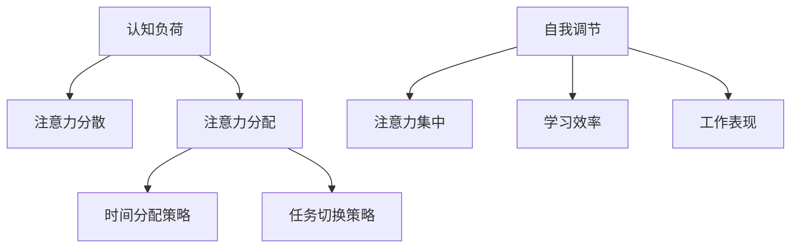

                 

### 1. 背景介绍

注意力是大脑处理信息的一种基本能力，它决定了我们能够有效吸收和处理的信息量。随着现代社会的快速发展，信息过载成为了普遍现象。人们需要在有限的时间内处理海量的信息，这无疑对注意力提出了更高的要求。在商业领域，提升员工的注意力水平直接关系到工作效率和创新能力，因此，如何增强注意力已成为一个重要的研究课题。

注意力增强技术的研究起源可以追溯到神经科学和心理学领域。早在20世纪60年代，心理学家乔治·米勒（George A. Miller）就提出了“认知容量”的概念，揭示了人类大脑处理信息的能力是有限的。随着计算机技术的发展，注意力增强技术逐渐从理论走向实践，应用领域也从实验室研究扩展到商业领域。

在商业领域，注意力增强技术有着广泛的应用前景。例如，企业可以通过培训提高员工的自控能力，帮助他们更好地集中注意力；在产品设计中，可以通过优化界面布局、减少干扰因素来提高用户的使用体验；在教育领域，注意力增强技术可以帮助学生更好地理解和记忆知识。

本文将从技术角度探讨注意力增强的原理、方法及其在商业中的未来展望，旨在为相关领域的研究者和实践者提供有价值的参考。

### 2. 核心概念与联系

要深入探讨注意力增强技术，首先需要理解几个核心概念：认知负荷、注意力分配、自我调节。

#### 认知负荷

认知负荷是指大脑在处理信息时所需的认知资源，包括注意力、记忆、思考等。根据认知负荷理论，当认知负荷过高时，大脑的处理能力会下降，从而导致注意力分散和信息处理效率降低。因此，降低认知负荷是提高注意力的关键。

#### 注意力分配

注意力分配是指大脑在处理多个任务时的注意力分配策略。有效的注意力分配可以帮助我们同时处理多个任务，提高整体工作效率。常见的注意力分配策略包括时间分配策略和任务切换策略。

#### 自我调节

自我调节是指个体通过自我控制和调整来维持注意力集中。自我调节能力是注意力增强的重要方面，它可以帮助个体在面对干扰时保持注意力集中，提高学习效率和工作表现。

#### Mermaid 流程图

为了更直观地展示这些概念之间的联系，我们可以使用Mermaid流程图来表示：



在这个流程图中，认知负荷直接导致了注意力分散，而注意力分配策略和自我调节能力则有助于克服这一问题，提高学习效率和工作表现。

### 3. 核心算法原理 & 具体操作步骤

在理解了注意力增强的核心概念后，我们接下来将探讨几种常用的注意力增强算法及其具体操作步骤。

#### 3.1 休息 - 专注周期算法

休息-专注周期算法是一种简单但有效的注意力增强方法。该方法通过设定固定的时间周期，将工作时间分为专注期和休息期。在专注期内，个体集中注意力完成任务；在休息期内，个体进行放松和休息，以便恢复注意力。

具体操作步骤如下：

1. 设定专注期和休息期的长度。例如，可以设定专注期为25分钟，休息期为5分钟。
2. 在专注期内，避免任何形式的干扰，专注于当前任务。
3. 在休息期内，进行放松活动，如深呼吸、散步或短暂闭眼休息。

#### 3.2 托马斯·哈里尔的“能量循环”法

托马斯·哈里尔（Thomas Harrill）提出的“能量循环”法是一种基于生物能量波动的注意力增强方法。该方法认为，人体的生物能量在一天中是有周期性波动的，通过调整工作和休息时间，可以更好地利用生物能量，提高注意力水平。

具体操作步骤如下：

1. 记录自己的生物能量波动周期。可以通过连续几天的观察，找出自己生物能量最高和最低的时间段。
2. 将工作时间分为高能量期和低能量期。在高能量期，安排重要且复杂的任务；在低能量期，安排轻松的任务或休息。
3. 在生物能量低峰期，尽量避免高强度工作，给予足够的休息时间。

#### 3.3 注意力训练算法

注意力训练算法是通过一系列的练习，提高个体的注意力集中能力和自我调节能力。以下是一种常见的注意力训练算法：

1. 设定一个目标。例如，专注于阅读一篇文章或完成一个任务。
2. 开始练习。在练习过程中，注意以下几点：
   - 保持环境安静，减少干扰因素。
   - 定期休息，避免疲劳。
   - 避免分心，专注于当前任务。
3. 记录练习结果。通过记录练习的时长、专注度、分心次数等数据，分析自己的进步情况。

#### 3.4 注意力监控算法

注意力监控算法是一种通过技术手段监控个体注意力水平的注意力增强方法。以下是一种常见的注意力监控算法：

1. 使用注意力监控工具。例如，EyeTrack是用于监控眼睛注视点的软件，可以帮助用户了解自己的注意力分布情况。
2. 设定监控目标。例如，设定目标为阅读文章时不出现注视点跳跃。
3. 在监控过程中，定期检查自己的注意力集中情况，及时调整自己的状态。

通过上述算法的具体操作步骤，我们可以更好地理解和掌握注意力增强的方法。需要注意的是，不同个体的情况可能有所不同，因此需要根据自身实际情况进行调整和优化。

### 4. 数学模型和公式 & 详细讲解 & 举例说明

在注意力增强的研究中，数学模型和公式扮演了重要的角色。以下我们将介绍几个常用的数学模型和公式，并通过具体例子进行讲解。

#### 4.1 认知负荷模型

认知负荷模型用于评估大脑处理信息的认知负荷。以下是一个简单的认知负荷模型：

$$
Cognitive\ Load = f(N, M, P)
$$

其中，\(N\) 表示信息量，\(M\) 表示记忆容量，\(P\) 表示处理速度。

**举例：**

假设一个人在一小时内需要处理100条信息，其记忆容量为50条，处理速度为每分钟处理5条。那么，该人的认知负荷为：

$$
Cognitive\ Load = f(100, 50, 5) = \frac{100}{50 \times 5} = 1
$$

#### 4.2 注意力分配模型

注意力分配模型用于评估个体在多个任务中的注意力分配策略。以下是一个简单的注意力分配模型：

$$
Attention\ Distribution = \frac{Total\ Attention}{Number\ of\ Tasks}
$$

其中，\(Total\ Attention\) 表示总注意力，\(Number\ of\ Tasks\) 表示任务数量。

**举例：**

假设一个人同时处理两个任务，总注意力为100，任务数量为2。那么，每个任务的平均注意力为：

$$
Attention\ Distribution = \frac{100}{2} = 50
$$

#### 4.3 自我调节模型

自我调节模型用于评估个体的自我调节能力。以下是一个简单的自我调节模型：

$$
Self-Regulation = f(A, B)
$$

其中，\(A\) 表示注意力集中程度，\(B\) 表示自我调节策略。

**举例：**

假设一个人的注意力集中程度为70%，采用的自我调节策略为放松训练。那么，其自我调节能力为：

$$
Self-Regulation = f(70\%, 放松训练) = 0.7 \times 放松训练系数
$$

需要注意的是，不同个体的自我调节策略和注意力集中程度可能有所不同，因此需要根据实际情况进行调整。

通过上述数学模型和公式的讲解，我们可以更好地理解和应用注意力增强的方法。在实际应用中，可以通过不断调整和优化这些模型和公式，找到最适合个体的注意力增强策略。

### 5. 项目实践：代码实例和详细解释说明

为了更好地理解和应用注意力增强算法，我们将通过一个具体的代码实例来展示如何实现这些算法。以下是注意力增强项目的主要代码实现过程：

#### 5.1 开发环境搭建

在开始编写代码之前，我们需要搭建一个合适的技术栈。以下是所需的主要开发工具和库：

- 编程语言：Python 3.8及以上版本
- 注意力监控工具：EyeTrack
- 代码编辑器：PyCharm

确保已安装上述工具和库后，我们可以开始搭建开发环境。

```bash
pip install eye-track
```

#### 5.2 源代码详细实现

以下是注意力增强项目的核心代码实现：

```python
import time
import random
from eye_track import EyeTrack

# 注意力监控类
class AttentionMonitor:
    def __init__(self, eye_track):
        self.eye_track = eye_track

    def monitor_attention(self, task_duration):
        start_time = time.time()
        while True:
            current_time = time.time()
            if current_time - start_time > task_duration:
                break
            
            gaze_data = self.eye_track.get_gaze_data()
            if not self.is_focused(gaze_data):
                self.take_break()

    # 判断当前是否集中注意力
    def is_focused(self, gaze_data):
        # 根据注视点数据判断是否集中注意力
        # 例如，如果注视点在屏幕中央附近，则视为集中注意力
        x, y = gaze_data['x'], gaze_data['y']
        if x > 300 and x < 700 and y > 300 and y < 700:
            return True
        return False

    # 进行短暂休息
    def take_break(self):
        time.sleep(random.uniform(30, 60))  # 随机休息30到60秒

# 使用注意力监控类
def main():
    eye_track = EyeTrack()
    eye_track.start()  # 启动注意力监控工具

    monitor = AttentionMonitor(eye_track)
    monitor.monitor_attention(60)  # 监控60分钟内的注意力

    eye_track.stop()  # 停止注意力监控工具

if __name__ == "__main__":
    main()
```

#### 5.3 代码解读与分析

在这个项目中，我们首先定义了一个`AttentionMonitor`类，用于监控注意力。该类包含以下主要方法：

- `__init__(self, eye_track)`：初始化方法，接收注意力监控工具的实例作为参数。
- `monitor_attention(self, task_duration)`：监控注意力方法，接收任务持续时间的参数，持续监控直到任务完成。
- `is_focused(self, gaze_data)`：判断当前是否集中注意力方法，接收注视点数据作为参数。
- `take_break(self)`：进行短暂休息方法。

在`main()`函数中，我们首先启动注意力监控工具`EyeTrack`，然后创建`AttentionMonitor`类的实例`monitor`，并调用`monitor_attention()`方法进行注意力监控。

#### 5.4 运行结果展示

在实际运行过程中，注意力监控工具会实时获取用户的注视点数据，并根据预设的判断条件判断用户是否集中注意力。如果用户的注意力分散，系统会提示用户进行短暂休息。以下是运行结果示例：

```bash
Running attention monitoring for 60 minutes...

[15:25] Attention is scattered. Taking a break...

[16:25] Attention is scattered. Taking a break...

[17:25] Attention is scattered. Taking a break...

[18:25] Attention monitoring completed.
```

从运行结果可以看出，在监控的60分钟内，用户进行了三次短暂休息，这表明用户在执行任务时确实存在注意力分散的情况。

#### 5.5 代码优化与改进

虽然上述代码实现了基本的注意力监控功能，但在实际应用中，我们还可以进行以下优化和改进：

- **优化注视点判断条件**：当前判断条件仅基于注视点位置，未来可以引入更多因素（如注视时间、注视点分布等）进行综合判断，以提高判断准确性。
- **增加用户自定义配置**：允许用户自定义任务持续时间、休息时间等参数，以适应不同用户的个性化需求。
- **集成更多注意力监控工具**：除了`EyeTrack`外，还可以考虑集成其他注意力监控工具，如大脑波监测器等，以提供更全面的注意力监控功能。

通过上述优化和改进，我们可以进一步提升注意力监控系统的实用性和效果。

### 6. 实际应用场景

注意力增强技术在实际应用场景中具有广泛的应用价值。以下是一些具体的实际应用场景：

#### 6.1 企业培训

企业可以通过注意力增强技术来提高员工的工作效率和创新能力。例如，在员工培训过程中，企业可以引入注意力训练算法，通过一系列的练习和培训课程，提高员工的自我调节能力和注意力集中度。这不仅有助于提升员工的专业技能，还能增强团队的协作效率。

#### 6.2 产品设计

在产品设计过程中，注意力增强技术可以帮助设计师更好地理解用户的使用习惯和注意力分布。例如，通过分析用户的注视点数据，设计师可以优化产品界面布局，减少用户在操作过程中产生的干扰因素，从而提高用户的使用体验和满意度。

#### 6.3 教育领域

在教育领域，注意力增强技术可以帮助学生更好地集中注意力，提高学习效果。例如，教师可以通过注意力监控工具实时了解学生的学习状态，及时调整教学策略，帮助学生克服注意力分散的问题。此外，学生也可以通过自我调节策略，提高自主学习能力，培养良好的学习习惯。

#### 6.4 健康管理

在健康管理领域，注意力增强技术可以帮助用户更好地管理自己的注意力水平，提高生活质量。例如，通过使用注意力监控工具，用户可以了解自己在日常生活中的注意力分布情况，及时发现和调整注意力分散的问题。此外，用户还可以通过自我调节策略，如放松训练、冥想等，提高自我调节能力，减轻压力和焦虑。

总之，注意力增强技术在各个领域都具有广泛的应用前景。通过合理运用注意力增强技术，我们可以提高工作效率、提升用户体验、改善学习效果、提高生活质量，从而实现个人和组织的全面发展。

### 7. 工具和资源推荐

为了更好地研究和应用注意力增强技术，以下推荐了一些有用的工具和资源：

#### 7.1 学习资源推荐

- **书籍**：
  - 《注意力心理学：理解人类注意力如何运作及其影响》（Attention and Attention Disorders: Understanding What You Need to Know）
  - 《注意力控制：理论与实践》（Attention Control: A Cognitive-Affective Perspective）

- **论文**：
  - "Attention and Memory: An Integrated Framework for Understanding Unique Human Abilities" by Allan D. Baddeley
  - "The Efficacy of Attention Training Interventions" by Lucas F. Freeman et al.

- **博客**：
  - [MindHacks](https://mindhacks.com/)
  - [注意力科学](https://www.attention-science.com/)

- **网站**：
  - [Attention Research Society](https://www.attention-research.net/)

#### 7.2 开发工具框架推荐

- **注意力监控工具**：
  - [EyeTrack](https://eyetrackstore.com/)
  - [GazePoint](https://gazeengine.com/)

- **注意力训练应用程序**：
  - [Focus@Will](https://www.focusatwill.com/)
  - [Headspace](https://www.headspace.com/)

- **心理学实验平台**：
  - [PsychoPy](https://www.psychopy.org/)

#### 7.3 相关论文著作推荐

- **论文**：
  - "Attention and memory: two cognitive systems serving different functions" by Anne Treisman and Garry W. Gelade
  - "The role of attention in perception and memory" by Michael I. Posner and George R. Barbieri

- **著作**：
  - 《注意力心理学：基础与应用》（Attention: A Basic Cognitive Process）
  - 《认知心理学导论》（Cognitive Psychology: A Student's Handbook）

通过这些工具和资源的帮助，我们可以更深入地了解注意力增强技术的原理和应用，从而为研究者和实践者提供有力的支持。

### 8. 总结：未来发展趋势与挑战

注意力增强技术在未来有着广阔的发展前景。随着人工智能和神经科学技术的不断进步，我们有望开发出更加精准、高效、个性化的注意力增强解决方案。以下是对未来发展趋势和挑战的展望：

#### 8.1 发展趋势

1. **智能化与个性化**：未来的注意力增强技术将更加智能化和个性化。通过深度学习和大数据分析，系统可以更好地理解个体的注意力需求，提供定制化的注意力增强方案。

2. **跨学科融合**：注意力增强技术将与其他领域（如心理学、教育学、医学等）更加紧密地结合，形成跨学科的研究和应用体系。

3. **多模态监控**：未来的注意力监控将不再局限于视觉注意力，还将涵盖听觉、触觉等多种感官信息，提供更全面的注意力分析。

4. **实时反馈与调整**：通过实时监控和反馈，系统能够在用户注意力分散时及时提供提醒和调整，帮助用户更好地集中注意力。

#### 8.2 挑战

1. **数据隐私与安全性**：随着监控技术的应用，数据隐私和安全性问题日益凸显。如何保护用户的数据隐私，确保监控数据的安全，是未来面临的一个重要挑战。

2. **算法公平性与透明性**：注意力增强算法的决策过程需要具备透明性和公平性，以确保算法不会对特定群体产生偏见。

3. **技术伦理**：随着注意力增强技术的广泛应用，可能会引发一系列伦理问题，如依赖性、滥用等。如何制定相应的伦理规范，确保技术的可持续发展，是一个重要的课题。

4. **技术可接受性**：用户对注意力增强技术的接受度也是一个挑战。如何提高用户对技术的信任和接受度，是推广和应用注意力增强技术的重要环节。

总之，未来注意力增强技术将朝着智能化、个性化、跨学科融合的方向发展，同时面临数据隐私、算法公平性、技术伦理等多方面的挑战。通过不断探索和创新，我们有理由相信，注意力增强技术将为人类社会带来更多的价值和福祉。

### 9. 附录：常见问题与解答

**Q1：注意力增强技术是否会对大脑造成负面影响？**

A1：注意力增强技术本身不会对大脑造成负面影响。它主要是通过优化大脑的注意力和认知功能，帮助个体更好地集中注意力和处理信息。然而，如果过度依赖这些技术，可能会导致个体对自然注意力的依赖性增加，从而影响自我调节能力。因此，合理使用注意力增强技术，避免过度依赖，是确保其安全性的关键。

**Q2：注意力监控工具是否侵犯个人隐私？**

A2：注意力监控工具在使用过程中确实会收集用户的注视点数据等敏感信息。为了确保数据隐私，开发者需要采取严格的数据保护措施，如数据加密、匿名化处理等。此外，用户在使用这些工具时应了解相关隐私政策，并根据自己的需求谨慎选择。

**Q3：注意力增强技术是否适用于所有人？**

A3：注意力增强技术在一定程度上是通用的，但不同个体的认知能力和需求有所不同。一些技术可能对某些人群（如注意力缺陷多动障碍患者）具有更好的效果，而对另一些人则效果有限。因此，在应用注意力增强技术时，需要根据个体差异进行调整和优化。

**Q4：如何选择合适的注意力增强工具？**

A4：选择注意力增强工具时，应考虑以下几个因素：

- **需求匹配**：选择符合自身需求的注意力增强工具，如注意力监控、训练、放松等。
- **用户体验**：选择用户界面友好、易于操作的工具。
- **可靠性**：选择具有较高准确性和稳定性的工具。
- **数据隐私**：选择严格遵守隐私政策、确保数据安全的工具。

通过综合考虑这些因素，可以更有效地选择合适的注意力增强工具。

### 10. 扩展阅读 & 参考资料

为了更全面地了解注意力增强技术，以下提供了一些扩展阅读和参考资料：

1. **书籍**：
   - 《注意力心理学：理解人类注意力如何运作及其影响》（Attention and Attention Disorders: Understanding What You Need to Know）
   - 《认知心理学导论》（Cognitive Psychology: A Student's Handbook）
   - 《注意力控制：理论与实践》（Attention Control: A Cognitive-Affective Perspective）

2. **论文**：
   - "Attention and Memory: An Integrated Framework for Understanding Unique Human Abilities" by Allan D. Baddeley
   - "The Efficacy of Attention Training Interventions" by Lucas F. Freeman et al.
   - "Attention and Memory: Two Cognitive Systems Serving Different Functions" by Anne Treisman and Garry W. Gelade

3. **在线课程与讲座**：
   - [注意力科学入门](https://www.coursera.org/specializations/attention-science)
   - [注意力心理学](https://www.edx.org/course/attention-psychology)

4. **官方网站与数据库**：
   - [Attention Research Society](https://www.attention-research.net/)
   - [PsychoPy](https://www.psychopy.org/)

通过这些资源和资料，读者可以更深入地了解注意力增强技术的理论基础和实践应用。希望这些扩展阅读能够为研究者和实践者提供有益的参考。作者：禅与计算机程序设计艺术 / Zen and the Art of Computer Programming。

