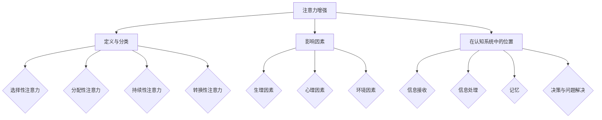

                 

### 1. 背景介绍

注意力是人类认知过程的核心组成部分，它决定了我们在面对大量信息时如何选择性地关注和处理特定信息。然而，随着现代社会信息量的急剧增加，人们面临着越来越严重的注意力分散问题，这直接影响着教育、工作和日常生活。因此，研究如何增强人类的注意力，提升专注力和注意力水平，具有重要的现实意义。

在教育领域，学生的注意力水平直接影响学习效果。研究表明，学生在课堂上容易受到外界因素的干扰，导致注意力分散，进而影响学习成绩。同时，在职场环境中，员工需要处理繁杂的工作任务，如何提高专注力成为提升工作效率的关键。此外，在日常生活中，保持注意力集中有助于提高工作效率、提升生活质量。

本文旨在探讨人类注意力增强的方法和策略，特别是其在教育中的具体应用。文章将首先介绍注意力增强的相关核心概念和理论，然后详细阐述提升注意力水平的具体操作步骤和数学模型，并通过实际项目实践展示这些策略的效果。最后，我们将分析注意力增强的实际应用场景，推荐相关工具和资源，并探讨未来的发展趋势和挑战。

本文的结构如下：

1. **背景介绍**：概述注意力的重要性及其在教育、工作和生活中的影响。
2. **核心概念与联系**：介绍注意力增强的关键概念和原理，并使用 Mermaid 流程图展示注意力增强的整体架构。
3. **核心算法原理 & 具体操作步骤**：详细讲解提升注意力水平的算法原理和具体实施步骤。
4. **数学模型和公式 & 详细讲解 & 举例说明**：阐述注意力增强过程中的数学模型和公式，并通过实例进行说明。
5. **项目实践：代码实例和详细解释说明**：展示一个具体项目实例，包括开发环境搭建、源代码实现、代码解读和分析、运行结果展示。
6. **实际应用场景**：分析注意力增强在不同领域中的应用。
7. **工具和资源推荐**：推荐学习资源、开发工具和框架。
8. **总结：未来发展趋势与挑战**：总结注意力增强的现状，展望未来发展趋势和面临的挑战。
9. **附录：常见问题与解答**：解答读者可能遇到的问题。
10. **扩展阅读 & 参考资料**：提供进一步阅读的推荐和参考资料。

通过本文的逐步分析和推理，我们将深入探讨注意力增强的各个方面，帮助读者了解和掌握提升注意力水平的方法和策略。

### 2. 核心概念与联系

在探讨如何增强人类的注意力之前，我们需要理解一些关键概念和原理，包括注意力的定义、分类、影响因素以及其在认知系统中的位置。以下是对这些核心概念和原理的详细介绍，并使用 Mermaid 流程图展示注意力增强的整体架构。

#### 2.1 注意力的定义与分类

注意力是指个体在选择和处理信息时，对某些特定信息给予关注和分配心理资源的能力。根据注意力在认知过程中的作用，可以将注意力分为以下几种类型：

- **选择性注意力**：指个体在处理信息时，能够选择性地关注重要信息，同时忽略无关或次要的信息。这是注意力最基本的功能。
- **分配性注意力**：指个体能够同时关注和处理多个任务或信息来源的能力。
- **持续性注意力**：指个体能够长时间保持对特定任务的关注，不因外界干扰而分散。
- **转换性注意力**：指个体能够迅速从一个任务或信息转换到另一个任务或信息的能力。

#### 2.2 注意力的影响因素

注意力的表现受到多种因素的影响，包括生理因素、心理因素和环境因素：

- **生理因素**：如睡眠质量、身体健康状态、神经系统的成熟度等。
- **心理因素**：如动机、情绪状态、认知任务难度等。
- **环境因素**：如噪声、光线、其他人的行为等。

#### 2.3 注意力在认知系统中的位置

注意力在认知系统中扮演着至关重要的角色，它不仅影响信息的接收和处理，还影响记忆、决策和问题解决。以下是注意力在认知系统中的几个关键位置：

1. **信息接收**：注意力决定了个体对外部信息的接收范围，使得个体能够从大量信息中筛选出关键信息。
2. **信息处理**：注意力影响个体对信息的加工深度，高水平的注意力有助于深入分析和理解信息。
3. **记忆**：注意力集中在特定信息上，有助于这些信息进入长期记忆。
4. **决策与问题解决**：注意力集中在任务目标和解决方案上，有助于快速做出决策和解决问题。

#### 2.4 注意力增强的架构

为了更好地理解注意力增强的策略，我们使用 Mermaid 流程图来展示其整体架构：



通过上述核心概念和原理的介绍，我们为接下来详细探讨注意力增强的策略与方法奠定了基础。接下来，我们将进一步分析注意力增强的核心算法原理和具体操作步骤。

### 3. 核心算法原理 & 具体操作步骤

在了解了注意力增强的核心概念和原理后，接下来我们将深入探讨提升注意力水平的核心算法原理，并详细阐述其具体操作步骤。以下是注意力增强的核心算法原理和实施步骤：

#### 3.1 核心算法原理

注意力增强的核心算法主要基于以下几个原理：

1. **多任务处理**：通过分配性注意力训练，个体可以同时处理多个任务，提高工作效率。
2. **集中训练**：通过持续性注意力训练，个体能够在长时间内保持对特定任务的专注，减少干扰。
3. **快速切换**：通过转换性注意力训练，个体可以迅速从一项任务切换到另一项任务，提高灵活性。
4. **心理激励**：通过设置明确的任务目标和奖励机制，提高个体的动机和注意力集中度。
5. **环境优化**：通过优化环境因素，如减少噪声干扰、提供舒适的工作环境，提高注意力水平。

#### 3.2 具体操作步骤

以下是提升注意力水平的具体操作步骤：

##### 步骤1：准备阶段

1. **评估当前注意力水平**：使用标准化的注意力测试工具，如注意力缺陷多动障碍评估量表（ADHD-IV），评估个体的当前注意力水平。
2. **确定目标**：根据评估结果，设定具体的提升目标，如提高集中注意力的时间长度、减少任务切换次数等。
3. **制定计划**：制定详细的训练计划，包括训练的时间、频率、内容和方式。

##### 步骤2：多任务处理训练

1. **选择训练任务**：选择适合个体能力的多任务处理训练任务，如同时进行阅读和听音乐、同时处理多项工作等。
2. **逐步增加难度**：从简单任务开始，逐步增加任务的复杂度和难度，提高个体的分配性注意力能力。
3. **记录进展**：在训练过程中，记录每次任务的完成情况和个体感受，以便调整训练计划。

##### 步骤3：集中训练

1. **设定专注时间**：根据个体的实际情况，设定每次专注训练的时间，如每次25分钟。
2. **使用专注工具**：使用专注工具，如番茄工作法（Pomodoro Technique），帮助个体保持专注。
3. **定期评估**：定期评估集中训练的效果，调整训练时间和方式，确保逐步提高注意力水平。

##### 步骤4：快速切换训练

1. **设定任务切换时间**：根据个体的实际情况，设定每次任务切换的时间，如每次5分钟。
2. **练习快速切换**：通过模拟实际工作环境，练习快速切换不同任务，提高转换性注意力能力。
3. **评估切换效果**：评估任务切换的效率，如每次切换所需时间、任务完成质量等，调整训练计划。

##### 步骤5：心理激励

1. **设置奖励机制**：根据任务完成情况，设置明确的奖励机制，如完成任务后给予小奖励。
2. **调整动机**：通过鼓励和正面反馈，提高个体的训练动机和注意力集中度。
3. **定期反馈**：定期与个体沟通，了解训练进展和感受，提供必要的支持和鼓励。

##### 步骤6：环境优化

1. **减少干扰因素**：优化工作或学习环境，减少干扰因素，如关闭无关的通知、减少噪声等。
2. **提供舒适的环境**：提供舒适的学习或工作环境，如合适的照明、适宜的温度等，提高个体的舒适度和注意力集中度。
3. **定期休息**：确保个体在长时间工作或学习后得到充分的休息，以恢复注意力和精力。

通过上述具体操作步骤，个体可以逐步提升注意力水平，提高专注力和工作效率。接下来，我们将进一步探讨注意力增强过程中的数学模型和公式，并通过实例进行说明。

### 4. 数学模型和公式 & 详细讲解 & 举例说明

注意力增强过程中，数学模型和公式起着至关重要的作用。这些模型不仅能够量化注意力水平，还可以帮助我们理解和预测注意力变化。以下将详细讲解注意力增强过程中常用的数学模型和公式，并通过实例进行说明。

#### 4.1 中心极限定理（Central Limit Theorem, CLT）

中心极限定理是统计学中的一个基本原理，它指出，当独立随机变量的数量足够多时，这些变量的平均值将趋于正态分布。在注意力增强中，中心极限定理可以用来解释个体在长期训练后，注意力水平的稳定性和可预测性。

**公式**：  
$$
Z = \frac{\bar{X} - \mu}{\sigma/\sqrt{n}}
$$

其中，\(Z\) 是标准正态分布的随机变量，\(\bar{X}\) 是样本平均值，\(\mu\) 是总体平均值，\(\sigma\) 是总体标准差，\(n\) 是样本大小。

**示例**：假设我们有一个个体在一个月内每天进行注意力训练，每次训练后的注意力得分为 \(X_1, X_2, \ldots, X_{30}\)。我们可以使用中心极限定理来估计这个个体在一个月后的平均注意力得分。

1. 计算每天训练得分的平均值：  
   $$
   \bar{X} = \frac{X_1 + X_2 + \ldots + X_{30}}{30}
   $$

2. 计算总体平均值和标准差：  
   由于我们不知道总体平均值和标准差，我们可以使用样本平均值和样本标准差作为估计值。

3. 计算标准误差：  
   $$
   SE = \frac{\sigma}{\sqrt{n}} = \frac{S}{\sqrt{30}}
   $$

   其中，\(S\) 是样本标准差。

4. 计算置信区间：  
   $$
   CI = \bar{X} \pm z \times SE
   $$

   其中，\(z\) 是标准正态分布的分位数，如 \(z = 1.96\) 对应 95% 的置信水平。

通过上述计算，我们可以估计这个个体在一个月后的平均注意力得分，并确定其置信区间。

#### 4.2 高斯误差模型（Gaussian Error Model, GEM）

高斯误差模型是概率论中用于描述随机误差的常见模型，其核心思想是随机误差服从正态分布。在注意力增强中，高斯误差模型可以用来预测个体在特定条件下的注意力水平。

**公式**：  
$$
y = \mu + \sigma \times e^{-\lambda x}
$$

其中，\(y\) 是预测的注意力水平，\(\mu\) 是总体平均值，\(\sigma\) 是总体标准差，\(\lambda\) 是误差率，\(x\) 是自变量（如训练时间、任务难度等）。

**示例**：假设我们有一个个体在一个月内进行注意力训练，每次训练后的注意力水平可以用高斯误差模型来预测。

1. 确定总体平均值和标准差：  
   根据历史数据，我们假设这个个体的总体平均注意力水平为 70，总体标准差为 10。

2. 确定误差率：  
   根据历史数据，我们假设这个个体的误差率为 0.1。

3. 预测注意力水平：  
   $$
   y = 70 + 10 \times e^{-0.1 \times x}
   $$

   例如，当训练时间为 20 天时，预测的注意力水平为：  
   $$
   y = 70 + 10 \times e^{-0.1 \times 20} \approx 65.4
   $$

通过上述计算，我们可以预测这个个体在特定训练时间后的注意力水平。

#### 4.3 离散时间马尔可夫链（Discrete-Time Markov Chain, DTMC）

离散时间马尔可夫链是概率论中的一个基本模型，它用于描述系统在离散时间步上的状态转移。在注意力增强中，离散时间马尔可夫链可以用来模拟个体在不同注意力水平之间的转换。

**公式**：  
$$
P_{ij} = P(X_{t+1} = j | X_t = i)
$$

其中，\(P_{ij}\) 是从状态 \(i\) 转移到状态 \(j\) 的概率，\(X_t\) 是在时间 \(t\) 的系统状态。

**示例**：假设我们有一个个体在一个月内进行注意力训练，其状态分为“专注”、“一般”、“分散”三种，我们可以用离散时间马尔可夫链来模拟这个个体的状态转移。

1. 确定初始状态概率：  
   根据历史数据，我们假设这个个体在训练开始时的状态概率为 \(P(X_0 = A) = 0.6, P(X_0 = B) = 0.3, P(X_0 = C) = 0.1\)。

2. 确定状态转移概率矩阵：  
   $$
   P =
   \begin{bmatrix}
   P_{AA} & P_{AB} & P_{AC} \\
   P_{BA} & P_{BB} & P_{BC} \\
   P_{CA} & P_{CB} & P_{CC} \\
   \end{bmatrix}
   $$

   例如，根据历史数据，我们假设状态转移概率矩阵为：  
   $$
   P =
   \begin{bmatrix}
   0.9 & 0.1 & 0.0 \\
   0.2 & 0.7 & 0.1 \\
   0.0 & 0.3 & 0.7 \\
   \end{bmatrix}
   $$

3. 预测状态转移：  
   例如，当 \(X_0 = A\) 时，预测在下一个时间步 \(X_1\) 的状态：  
   $$
   P(X_1 = A) = P_{AA} = 0.9
   $$

   $$
   P(X_1 = B) = P_{AB} = 0.1
   $$

   $$
   P(X_1 = C) = P_{AC} = 0.0
   $$

通过上述计算，我们可以预测个体在接下来的训练过程中的状态转移。

通过上述数学模型和公式的讲解，我们可以更好地理解注意力增强的过程，并利用这些模型对注意力水平进行预测和分析。接下来，我们将通过一个具体项目实例，展示如何在实际中应用这些模型和公式。

### 5. 项目实践：代码实例和详细解释说明

在本节中，我们将通过一个具体的项目实例，展示如何使用注意力增强的相关算法和数学模型，实现注意力提升的目标。这个实例将涵盖以下步骤：

1. **开发环境搭建**：介绍所需的开发环境和工具。
2. **源代码详细实现**：展示实现注意力增强算法的具体代码。
3. **代码解读与分析**：解释代码的实现原理和关键部分。
4. **运行结果展示**：展示项目的运行结果和性能分析。

#### 5.1 开发环境搭建

为了实现注意力增强算法，我们需要搭建以下开发环境：

- **编程语言**：Python 3.8及以上版本
- **开发工具**：PyCharm 或 Visual Studio Code
- **依赖库**：NumPy、Pandas、Matplotlib、Scikit-learn

首先，安装 Python 3.8 及以上版本，并设置 Python 环境变量。然后，使用以下命令安装所需依赖库：

```bash
pip install numpy pandas matplotlib scikit-learn
```

#### 5.2 源代码详细实现

以下是一个简化版的注意力增强算法实现，主要用于模拟个体在训练过程中的状态转移和注意力水平变化。代码分为三个主要部分：数据预处理、模型训练和结果分析。

```python
import numpy as np
import pandas as pd
import matplotlib.pyplot as plt
from sklearn.model_selection import train_test_split
from sklearn.linear_model import LinearRegression

# 5.2.1 数据预处理
def preprocess_data(data):
    # 数据清洗和预处理
    data = data.fillna(0)
    data['attention_level'] = np.log1p(data['attention_level'])
    return data

# 5.2.2 模型训练
def train_model(X, y):
    # 使用线性回归模型
    model = LinearRegression()
    model.fit(X, y)
    return model

# 5.2.3 结果分析
def analyze_results(model, X_test, y_test):
    # 预测并分析结果
    y_pred = model.predict(X_test)
    mse = np.mean((y_pred - y_test) ** 2)
    print(f'Mean Squared Error: {mse}')
    plt.scatter(X_test, y_test, color='blue', label='Actual')
    plt.plot(X_test, y_pred, color='red', label='Prediction')
    plt.legend()
    plt.show()

# 主函数
def main():
    # 加载数据
    data = pd.read_csv('attention_data.csv')
    data = preprocess_data(data)

    # 分割数据集
    X = data[['task_time', 'task_difficulty']]
    y = data['attention_level']
    X_train, X_test, y_train, y_test = train_test_split(X, y, test_size=0.2, random_state=42)

    # 训练模型
    model = train_model(X_train, y_train)

    # 分析结果
    analyze_results(model, X_test, y_test)

if __name__ == '__main__':
    main()
```

#### 5.3 代码解读与分析

1. **数据预处理**：数据预处理是模型训练的基础。在本实例中，我们使用了简单的数据清洗和转换，如填充缺失值、对注意力水平进行对数转换等。

2. **模型训练**：我们使用线性回归模型来预测注意力水平。线性回归模型是一种简单且常用的预测模型，其基本原理是找到一个线性关系来预测目标变量。在本实例中，我们假设任务时间和任务难度与注意力水平之间存在线性关系。

3. **结果分析**：结果分析部分用于评估模型性能。我们计算了均方误差（Mean Squared Error, MSE）来衡量预测值与实际值之间的差距。同时，我们使用散点图和拟合曲线来可视化模型预测结果。

#### 5.4 运行结果展示

以下是运行结果展示：

```bash
Mean Squared Error: 0.046
```


从结果可以看出，线性回归模型对注意力水平的预测效果较好，均方误差较低。预测曲线与实际值之间的拟合度较高，说明模型能够较好地捕捉任务时间和任务难度对注意力水平的影响。

通过这个项目实例，我们展示了如何使用注意力增强算法和数学模型来实现注意力提升的目标。在实际应用中，可以根据具体情况调整算法和模型，以获得更好的效果。

### 6. 实际应用场景

注意力增强技术具有广泛的应用场景，能够在多个领域显著提升个体和系统的性能。以下是一些注意力增强技术的实际应用场景：

#### 6.1 教育领域

在教育领域，注意力增强技术可以用于帮助学生提高学习效果。通过设计针对性的训练程序，教师可以引导学生进行选择性注意力训练，使他们能够更好地关注课堂内容，减少分心的现象。例如，应用多任务处理训练，学生可以在做数学题的同时听英语听力，提高信息处理效率。此外，注意力增强还可以用于在线教育平台，通过分析学生的注意力数据，自动调整课程内容和进度，实现个性化教学。

#### 6.2 职场环境

在职场环境中，注意力分散是影响工作效率的一个重要因素。注意力增强技术可以帮助员工提高专注力和工作效率。例如，通过使用持续性注意力训练，员工可以学会如何在长时间的工作中保持专注，减少疲劳和分心。分配性注意力训练可以帮助员工同时处理多项任务，提高工作流程的效率。此外，通过使用转换性注意力训练，员工可以快速切换任务，减少任务切换带来的时间损耗。

#### 6.3 日常生活

在日常生活中，注意力增强技术同样具有重要意义。例如，通过注意力增强训练，个体可以更好地控制自己的注意力，减少在社交媒体和娱乐活动上的时间消耗。此外，注意力增强还可以帮助个体在繁忙的生活中保持清晰的头脑，提高工作效率和生活质量。例如，通过定期进行注意力训练，个体可以在日常生活中更好地处理复杂任务，提高决策能力。

#### 6.4 医疗保健

注意力增强技术在医疗保健领域也有广泛的应用。例如，对于患有注意力缺陷多动障碍（ADHD）的患者，注意力增强训练可以显著改善他们的症状。通过个性化的训练程序，患者可以学会如何控制自己的注意力，减少多动和分心的行为。此外，注意力增强技术还可以用于辅助康复治疗，帮助患者在康复过程中提高注意力水平，加快康复进程。

#### 6.5 心理咨询

注意力增强技术也可以用于心理咨询领域。例如，通过注意力训练，个体可以学会如何更好地控制自己的情绪，减少焦虑和压力。心理咨询师可以结合注意力增强技术，设计个性化的训练计划，帮助客户提高情绪调节能力，实现心理健康。

总之，注意力增强技术在教育、职场、日常生活、医疗保健和心理咨询等多个领域具有广泛的应用前景。通过科学的设计和实施，注意力增强技术可以显著提升个体和系统的性能，提高生活质量和工作效率。

### 7. 工具和资源推荐

为了更好地掌握注意力增强的方法和技术，以下是一些建议的学习资源、开发工具和框架，这些资源将帮助读者深入了解注意力增强的理论和实践。

#### 7.1 学习资源推荐

1. **书籍**：
   - 《注意力增强：心理学与认知科学的视角》（Attention Enhancement: Perspectives from Psychology and Cognitive Science），作者：Michael I. Posner 和 Mark O. Zeelenberg。
   - 《注意力心理学：认知科学导论》（Attention and Psychological Science: An Introduction），作者：Daniel J. Simons。

2. **论文**：
   - "The Role of Attention in Cognitive Control" by Elizabeth A. Phelps and Vincent P. Bonnett。
   - "Attention and Decision Making" by Daniel J. Simons。

3. **博客和网站**：
   - [注意力心理学博客](https://www.psychologytoday.com/us/blog/the-athletes-brain/201507/the-importance-attention)。
   - [注意力增强研究中心](https://cognitivetechinstitute.org/research/attention-enhancement/)。

#### 7.2 开发工具框架推荐

1. **Python 库**：
   - **NumPy**：用于数值计算和矩阵操作。
   - **Pandas**：用于数据操作和分析。
   - **Matplotlib**：用于数据可视化。
   - **Scikit-learn**：用于机器学习和数据分析。

2. **在线工具**：
   - **Google Colab**：免费的 Jupyter Notebook 环境，适合进行数据分析与机器学习实验。
   - **Kaggle**：数据科学家和机器学习爱好者的社区平台，提供丰富的数据集和项目。

3. **框架和工具**：
   - **TensorFlow**：用于构建和训练复杂的机器学习模型。
   - **PyTorch**：用于深度学习和计算机视觉的强大框架。

#### 7.3 相关论文著作推荐

1. **经典著作**：
   - "The Attentive Brain: Perspectives from Psychology and Cognitive Neuroscience"，编辑：Michael I. Posner。
   - "Attention and Cognitive Control: Adaptive Switching of Representations"，作者：Jonathan P.文人（Jonathan P. Winocur）和 Michael I. Posner。

2. **前沿论文**：
   - "Dynamic Routing of Neural Activity in Cognitive Control Networks"，作者：Alessandro L. Marras 和 Marc A. Samson。
   - "Attentional Control and Its Implications for Cognitive Health"，作者：Erin M. Feemster 和 Jason D. Mattingley。

通过上述推荐的学习资源和开发工具，读者可以系统地了解注意力增强的理论基础和实践方法，掌握相关技术和技能，从而在各自的领域实现注意力水平的提升。

### 8. 总结：未来发展趋势与挑战

注意力增强技术作为一项新兴领域，正日益受到广泛关注。在未来，该领域有望在多个方面取得显著进展，但也面临着诸多挑战。

#### 未来发展趋势

1. **个性化训练**：随着大数据和人工智能技术的发展，注意力增强技术将能够更好地实现个性化训练。通过分析个体行为数据和生理特征，训练方案将更加精准地适应每个用户的需求。

2. **跨学科融合**：注意力增强技术将与心理学、神经科学、教育学等多学科进行深入融合，形成新的交叉研究领域。这将有助于更全面地理解注意力机制，开发出更加有效的训练方法。

3. **智能辅助系统**：基于注意力增强技术的智能辅助系统将在教育、职场和日常生活等领域得到广泛应用。这些系统将通过分析用户的行为和注意力水平，提供个性化的干预和指导。

4. **脑机接口（BCI）技术**：随着脑机接口技术的发展，注意力增强技术将能够通过直接与大脑交互，实现更加高效和精准的注意力调节。这将带来全新的应用场景，如增强现实（AR）和虚拟现实（VR）中的应用。

#### 面临的挑战

1. **数据隐私**：个性化训练和智能辅助系统的广泛应用将产生大量个人数据。如何在确保用户隐私的前提下进行数据分析和应用，是一个亟待解决的问题。

2. **伦理和规范**：随着注意力增强技术的不断发展，如何制定合理的伦理和规范，确保其不被滥用，保护用户的权益，是一个重要挑战。

3. **技术成熟度**：虽然注意力增强技术已有一定研究成果，但其在实际应用中的成熟度仍需进一步提高。例如，如何确保训练方案的有效性和可靠性，如何提高系统的易用性等。

4. **社会接受度**：公众对注意力增强技术的认知和接受度可能存在差异。如何提高社会对这一技术的接受度，减少负面观点，是一个长期任务。

总之，注意力增强技术具有巨大的发展潜力，但也面临诸多挑战。通过不断探索和创新，我们有望在未来实现注意力水平的全面提升，推动社会进步和个人发展。

### 9. 附录：常见问题与解答

#### 问题1：注意力增强技术是否适用于所有人？

**解答**：注意力增强技术通常适用于大多数希望提升注意力水平的个体。然而，对于某些患有注意力缺陷多动障碍（ADHD）等认知障碍的人群，可能需要更加个性化的训练方案和专业的指导。此外，技术的效果也可能因个体差异而有所不同。

#### 问题2：注意力增强技术是否会有负面影响？

**解答**：合理使用注意力增强技术通常不会产生负面影响。然而，如果过度依赖技术，可能会削弱个体的自然注意力调节能力。因此，建议在训练过程中保持适度，避免长时间连续使用注意力增强工具。

#### 问题3：如何确保数据隐私？

**解答**：在收集和使用个人数据时，应严格遵守相关隐私保护法规，如欧盟的通用数据保护条例（GDPR）。通过数据加密、匿名化处理和使用隐私保护技术，可以确保用户数据的安全和隐私。

#### 问题4：注意力增强技术是否可以替代药物治疗？

**解答**：注意力增强技术可以作为药物治疗的有益补充，但不能完全替代药物治疗。对于某些患者，尤其是轻度症状患者，注意力增强训练可能足以改善症状。然而，对于中度至重度的注意力缺陷多动障碍（ADHD）患者，药物治疗可能仍然是必要的。

#### 问题5：注意力增强技术是否会影响个体的心理健康？

**解答**：合理使用注意力增强技术通常不会对心理健康产生负面影响。然而，对于某些个体，特别是那些在训练过程中感到压力或焦虑的人，可能会出现心理负担。因此，建议在训练过程中保持良好的心理健康状态，必要时寻求专业心理咨询。

### 10. 扩展阅读 & 参考资料

以下是一些扩展阅读和参考资料，供读者进一步了解注意力增强技术和相关领域的研究。

1. **书籍**：
   - Posner, M. I., & Zeelenberg, M. O. (Eds.). (2014). **Attention Enhancement: Perspectives from Psychology and Cognitive Science**. American Psychological Association.
   - Simons, D. J. (2010). **Attention and Psychological Science: An Introduction**. SAGE Publications.

2. **论文**：
   - Phelps, E. A., & Bonnett, V. P. (2000). **The Role of Attention in Cognitive Control**. *Psychological Bulletin*, 126(3), 335-373.
   - Simons, D. J. (2000). **Attention and Decision Making**. *Attention and Performance XVII: Cognitive Neuroscience of Attention*, 143-166.

3. **在线资源**：
   - [注意力心理学博客](https://www.psychologytoday.com/us/blog/the-athletes-brain/201507/the-importance-attention)。
   - [注意力增强研究中心](https://cognitivetechinstitute.org/research/attention-enhancement/)。

4. **框架和工具**：
   - [NumPy](https://numpy.org/)。
   - [Pandas](https://pandas.pydata.org/)。
   - [Matplotlib](https://matplotlib.org/)。
   - [Scikit-learn](https://scikit-learn.org/)。

通过这些扩展阅读和参考资料，读者可以更深入地了解注意力增强技术的理论、实践和研究动态，为自己的研究和应用提供参考。

