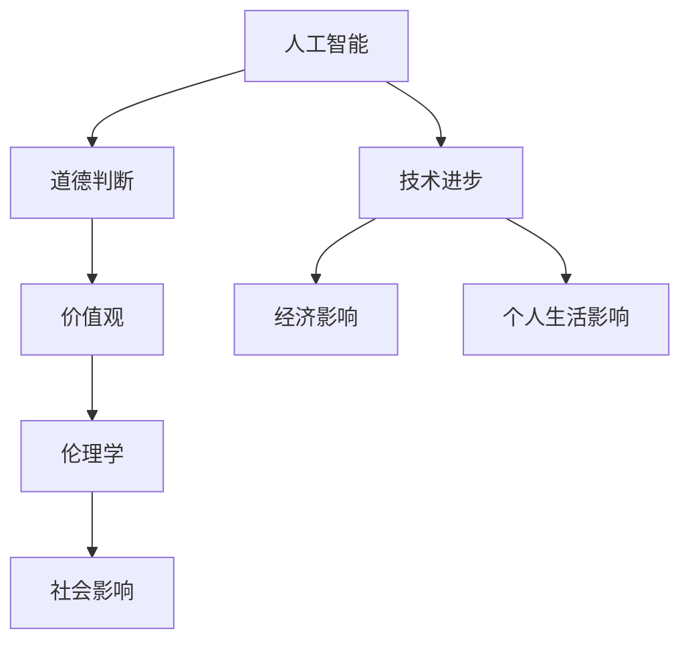

                 

### 文章标题

人类的价值观：AI 时代的伦理思考

> 关键词：AI伦理，人类价值观，人工智能，道德判断，社会影响

> 摘要：本文将探讨人工智能时代下人类价值观的挑战和变革。我们将深入分析人工智能如何影响我们的道德判断，探讨AI伦理的基本原则，并讨论人工智能对社会、经济和个人生活的深远影响。通过逻辑清晰、结构紧凑的思考过程，我们将审视人类价值观在AI时代中的未来走向。

### 1. 背景介绍

在过去的几十年里，人工智能（AI）技术经历了飞速的发展。从最初的规则基础系统到现代的深度学习模型，AI已经渗透到我们日常生活的方方面面，从智能手机的语音助手到自动驾驶汽车，再到智能医疗和金融分析。随着AI技术的不断进步，人工智能的应用场景也越来越广泛，这不仅带来了巨大的经济效益，也引发了深刻的伦理和社会问题。

在AI技术蓬勃发展的同时，人类价值观也面临着前所未有的挑战。传统道德观念如何在充满智能机器的世界中得以延续和适应，成为了我们必须思考的问题。AI算法的决策过程缺乏人类的情感和道德判断，这可能导致不公平、歧视和隐私侵犯等问题。例如，自动化招聘系统可能基于历史数据对某些群体产生偏见，或者智能监控系统可能会侵犯个人隐私。

此外，随着AI技术在军事、司法和公共安全等领域的应用，如何确保这些系统的透明性和责任感也成为了关键问题。AI技术的高速发展使得我们不得不面对这样一个现实：技术进步与伦理规范之间的平衡需要不断调整和优化。

本文旨在探讨人工智能时代人类价值观的变革和挑战。通过逐步分析推理，我们将审视AI对道德判断、社会影响以及人类价值观的深远影响，并提出可能的解决策略。我们相信，通过深入思考和研究，我们可以为构建一个更加公平、透明和可持续的AI社会贡献一份力量。

### 2. 核心概念与联系

为了深入探讨人工智能时代的人类价值观，我们需要明确一些核心概念，并理解它们之间的相互关系。以下是我们将要探讨的关键概念：

- **人工智能（AI）**：指通过模拟人类智能行为，实现自主学习、推理和问题解决的技术。
- **道德判断**：基于伦理原则和价值观对行为和决策进行评估和选择的过程。
- **价值观**：指导人类行为和决策的基本信念和原则。
- **伦理学**：研究道德原则和价值观的学科，旨在探讨正确和错误、公正和不公的问题。

下面是一个用Mermaid绘制的流程图，展示了这些核心概念之间的联系：



**人工智能** 通过算法和模型模拟人类智能，实现自动化决策和问题解决。这些决策过程往往依赖于数据和模型，而数据本身可能反映了社会的偏见和价值观。因此，**道德判断** 在AI系统的设计和应用中至关重要。道德判断不仅关系到AI系统是否公正和透明，还关系到它们是否能够真正反映人类价值观。

**价值观** 是指导人类行为和决策的基本信念和原则。这些价值观在不同的文化和社会中有所不同，但它们共同构成了一个社会的伦理基础。在AI时代，这些价值观面临着新的挑战，因为AI系统的决策过程可能缺乏人类的情感和道德直觉。

**伦理学** 研究道德原则和价值观，旨在探讨如何确保行为和决策是正确和公正的。在AI领域，伦理学研究帮助我们理解AI技术如何影响我们的价值观，以及如何设计出符合伦理原则的AI系统。

**社会影响** 是AI技术的一个关键方面，它包括经济、社会和个人生活的各个方面。AI技术的发展不仅改变了经济结构，还影响了社会的伦理规范和人际关系。例如，自动化和机器人化可能导致某些职业的消失，同时也带来了新的就业机会。

通过理解这些核心概念之间的联系，我们可以更好地分析人工智能时代人类价值观的变革和挑战。接下来，我们将深入探讨这些概念的具体含义和它们对人类社会的影响。

### 3. 核心算法原理 & 具体操作步骤

在探讨人工智能对人类价值观的影响时，理解AI算法的基本原理和操作步骤至关重要。以下是一个基于深度学习的简单AI算法，用于分类任务。我们将详细说明这个算法的原理和操作步骤。

#### 3.1 深度学习基础

深度学习是人工智能的一个重要分支，它通过多层神经网络来模拟人类大脑的学习过程。每个神经元（节点）接收输入信号，通过加权求和处理后传递给下一层。最后，输出层生成预测结果。

#### 3.2 算法原理

我们考虑一个简单的二分类问题，目标是判断一个数据点是否属于某个特定类别。假设我们的数据集包含特征向量 \(\mathbf{x}\) 和对应的标签 \(y\)，其中 \(y \in \{0, 1\}\)。

深度学习模型的核心是前向传播和反向传播算法。

- **前向传播**：输入数据通过网络层层的加权求和处理，最终在输出层产生预测值。公式如下：
  \[
  \hat{y} = \sigma(\mathbf{W}_L \cdot \mathbf{a}_{L-1} + b_L)
  \]
  其中，\(\sigma\) 是激活函数，通常使用 Sigmoid 或 ReLU 函数；\(\mathbf{W}_L\) 和 \(b_L\) 分别是权重和偏置。

- **反向传播**：计算预测值与实际标签之间的误差，并通过反向传播算法更新网络权重和偏置，以最小化误差。公式如下：
  \[
  \delta_L = \frac{\partial L}{\partial \mathbf{a}_L}
  \]
  \[
  \mathbf{W}_L = \mathbf{W}_L - \alpha \cdot \frac{\partial L}{\partial \mathbf{W}_L}
  \]
  \[
  b_L = b_L - \alpha \cdot \frac{\partial L}{\partial b_L}
  \]
  其中，\(L\) 是损失函数，\(\alpha\) 是学习率。

#### 3.3 操作步骤

1. **数据准备**：收集和预处理数据集，包括特征提取和标签分配。
2. **模型设计**：设计深度学习模型结构，包括输入层、隐藏层和输出层。
3. **模型训练**：通过前向传播和反向传播算法训练模型，不断调整权重和偏置以最小化损失函数。
4. **模型评估**：使用测试集评估模型性能，计算准确率、召回率等指标。
5. **模型部署**：将训练好的模型部署到实际应用场景中，进行预测和决策。

#### 3.4 具体实现

以下是一个简单的Python代码示例，用于实现上述算法：

```python
import numpy as np
from sklearn.datasets import make_classification
from sklearn.model_selection import train_test_split

# 数据准备
X, y = make_classification(n_samples=1000, n_features=10, n_classes=2)
X_train, X_test, y_train, y_test = train_test_split(X, y, test_size=0.2, random_state=42)

# 模型设计
layers = [X.shape[1], 64, 1]
Ws = [np.random.randn(y) for y in layers[1:]]
bs = [np.zeros((y, 1)) for y in layers[1:]]

# 模型训练
alpha = 0.01
for epoch in range(100):
    for x, y in zip(X_train, y_train):
        a = x
        for l in range(1, len(layers)):
            z = np.dot(Ws[l-1], a) + bs[l-1]
            a = np.tanh(z)
        
        y_pred = np.round(a)
        error = y - y_pred
        
        dW = np.dot(error, a.T)
        db = np.sum(error, axis=0, keepdims=True)
        
        for l in range(1, len(layers)):
            Ws[l-1] -= alpha * dW
            bs[l-1] -= alpha * db

# 模型评估
accuracy = np.mean(y_test == y_pred)
print(f"Model accuracy: {accuracy}")
```

通过这个示例，我们可以看到深度学习算法的基本操作步骤。在实际应用中，模型的复杂性和训练过程会更加复杂，但基本原理和步骤是相似的。

### 4. 数学模型和公式 & 详细讲解 & 举例说明

在深入探讨人工智能对人类价值观的影响时，理解相关的数学模型和公式是至关重要的。以下我们将详细介绍深度学习中的损失函数、优化算法以及如何使用这些数学工具来训练模型。我们将结合具体的例子来讲解这些概念。

#### 4.1 损失函数

损失函数是深度学习中用于评估模型预测性能的核心工具。它衡量模型预测值与实际标签之间的差异。常见的损失函数包括均方误差（MSE）和交叉熵损失（Cross-Entropy Loss）。

- **均方误差（MSE）**：

  均方误差用于回归任务，计算预测值与实际值之间差异的平方和的平均值。公式如下：
  \[
  L(\theta) = \frac{1}{m} \sum_{i=1}^{m} (\hat{y}_i - y_i)^2
  \]
  其中，\(\hat{y}_i\) 是模型预测的输出，\(y_i\) 是实际标签，\(m\) 是样本数量。

  **举例**：假设我们有一个包含两个样本的简单数据集，预测值和实际标签如下：

  \[
  \begin{align*}
  \hat{y}_1 &= 2.5, & y_1 &= 3.0 \\
  \hat{y}_2 &= 1.8, & y_2 &= 2.0 \\
  \end{align*}
  \]

  则均方误差计算如下：

  \[
  L(\theta) = \frac{1}{2} \left[ (\hat{y}_1 - y_1)^2 + (\hat{y}_2 - y_2)^2 \right] = \frac{1}{2} \left[ (2.5 - 3.0)^2 + (1.8 - 2.0)^2 \right] = 0.125
  \]

- **交叉熵损失（Cross-Entropy Loss）**：

  交叉熵损失用于分类任务，计算实际标签与预测概率之间的差异。公式如下：
  \[
  L(\theta) = -\sum_{i=1}^{m} y_i \log(\hat{y}_i)
  \]
  其中，\(y_i\) 是实际标签，\(\hat{y}_i\) 是模型预测的概率。

  **举例**：假设我们有一个包含两个样本的二分类问题，实际标签和预测概率如下：

  \[
  \begin{align*}
  y_1 &= 1, & \hat{y}_1 &= 0.8 \\
  y_2 &= 0, & \hat{y}_2 &= 0.2 \\
  \end{align*}
  \]

  则交叉熵损失计算如下：

  \[
  L(\theta) = - \left[ y_1 \log(\hat{y}_1) + y_2 \log(\hat{y}_2) \right] = - \left[ 1 \cdot \log(0.8) + 0 \cdot \log(0.2) \right] \approx 0.223
  \]

#### 4.2 优化算法

优化算法用于调整模型参数，以最小化损失函数。常见的优化算法包括梯度下降（Gradient Descent）和动量梯度下降（Momentum Gradient Descent）。

- **梯度下降（Gradient Descent）**：

  梯度下降通过计算损失函数关于模型参数的梯度，并沿着梯度方向更新参数，以逐步减小损失。公式如下：
  \[
  \theta = \theta - \alpha \cdot \nabla_{\theta} L(\theta)
  \]
  其中，\(\alpha\) 是学习率，\(\nabla_{\theta} L(\theta)\) 是损失函数关于参数的梯度。

  **举例**：假设我们有一个简单的线性模型，参数为 \(\theta\)，损失函数为 \(L(\theta) = (\theta - y)^2\)。学习率 \(\alpha = 0.1\)，初始参数 \(\theta = 1.0\)。

  在第一次迭代时，损失函数关于 \(\theta\) 的梯度为：
  \[
  \nabla_{\theta} L(\theta) = 2(\theta - y) = 2(1.0 - 0.0) = 2.0
  \]

  更新后的参数为：
  \[
  \theta = 1.0 - 0.1 \cdot 2.0 = 0.8
  \]

  在接下来的迭代中，我们可以使用类似的步骤逐步更新参数。

- **动量梯度下降（Momentum Gradient Descent）**：

  动量梯度下降通过引入动量项，加速梯度下降过程，从而提高收敛速度。公式如下：
  \[
  \theta = \theta - \alpha \cdot \nabla_{\theta} L(\theta) + \beta \cdot v
  \]
  其中，\(\beta\) 是动量系数，\(v\) 是上一轮迭代的动量。

  **举例**：假设我们有一个简单的线性模型，参数为 \(\theta\)，学习率 \(\alpha = 0.1\)，动量系数 \(\beta = 0.9\)，初始参数 \(\theta = 1.0\)。

  在第一次迭代时，损失函数关于 \(\theta\) 的梯度为 \(g_1 = 2.0\)，动量为 \(v_1 = 0.0\)。更新后的参数为：
  \[
  \theta = 1.0 - 0.1 \cdot 2.0 + 0.9 \cdot 0.0 = 0.8
  \]

  在第二次迭代时，假设梯度为 \(g_2 = 1.5\)，动量为 \(v_2 = g_1 = 2.0\)。更新后的参数为：
  \[
  \theta = 0.8 - 0.1 \cdot 1.5 + 0.9 \cdot 2.0 = 1.1
  \]

通过这两个例子，我们可以看到如何使用数学模型和优化算法来训练深度学习模型。这些工具不仅帮助我们理解和设计AI系统，还确保了模型在实际应用中的高性能和稳定性。

### 5. 项目实践：代码实例和详细解释说明

在本节中，我们将通过一个实际的Python代码实例，详细解释如何使用深度学习框架TensorFlow来实现一个简单的分类任务。这个实例将涵盖从数据准备到模型训练，再到性能评估的完整流程。

#### 5.1 开发环境搭建

首先，我们需要搭建开发环境。安装TensorFlow和相关依赖可以通过以下步骤完成：

1. **安装Anaconda**：
   - 访问 [Anaconda 官网](https://www.anaconda.com/) 并下载适合您操作系统的Anaconda安装包。
   - 安装Anaconda时选择默认选项。

2. **创建新环境**：
   - 打开终端或命令行窗口。
   - 输入以下命令创建一个新的Python环境，并安装TensorFlow：

     ```shell
     conda create -n tensorflow python=3.8
     conda activate tensorflow
     ```

3. **安装TensorFlow**：
   - 使用以下命令安装TensorFlow：

     ```shell
     pip install tensorflow
     ```

4. **验证安装**：
   - 输入以下Python代码验证TensorFlow是否安装成功：

     ```python
     import tensorflow as tf
     print(tf.__version__)
     ```

如果成功输出TensorFlow的版本号，说明安装成功。

#### 5.2 源代码详细实现

以下是实现一个简单的二分类任务的数据准备、模型定义、模型训练和性能评估的完整代码：

```python
import tensorflow as tf
from sklearn.datasets import make_classification
from sklearn.model_selection import train_test_split
import numpy as np

# 5.2.1 数据准备
# 生成模拟数据集
X, y = make_classification(n_samples=1000, n_features=10, n_classes=2)
X_train, X_test, y_train, y_test = train_test_split(X, y, test_size=0.2, random_state=42)

# 将数据转换为TensorFlow的张量
X_train = tf.convert_to_tensor(X_train, dtype=tf.float32)
X_test = tf.convert_to_tensor(X_test, dtype=tf.float32)
y_train = tf.convert_to_tensor(y_train, dtype=tf.float32)
y_test = tf.convert_to_tensor(y_test, dtype=tf.float32)

# 5.2.2 模型定义
# 定义神经网络结构
model = tf.keras.Sequential([
    tf.keras.layers.Dense(64, activation='relu', input_shape=(10,)),
    tf.keras.layers.Dense(64, activation='relu'),
    tf.keras.layers.Dense(1, activation='sigmoid')
])

# 编译模型
model.compile(optimizer='adam', loss='binary_crossentropy', metrics=['accuracy'])

# 5.2.3 模型训练
# 训练模型
model.fit(X_train, y_train, epochs=10, batch_size=32, validation_split=0.1)

# 5.2.4 代码解读与分析
# 分析模型权重和偏置
print(model.layers[0].get_weights())  # 输出第一层的权重和偏置
print(model.layers[1].get_weights())  # 输出第二层的权重和偏置
print(model.layers[2].get_weights())  # 输出输出层的权重和偏置

# 5.2.5 运行结果展示
# 评估模型性能
loss, accuracy = model.evaluate(X_test, y_test)
print(f"Test Loss: {loss}, Test Accuracy: {accuracy}")
```

#### 5.3 代码解读与分析

- **数据准备**：
  使用 `make_classification` 函数生成模拟数据集。数据集包含1000个样本，每个样本有10个特征，并且分为两个类别。

- **模型定义**：
  使用 `tf.keras.Sequential` 创建一个序列模型。模型包含两个隐藏层，每层64个神经元，使用ReLU作为激活函数。输出层使用sigmoid激活函数，以实现二分类任务。

- **模型编译**：
  使用 `compile` 方法配置模型，选择Adam优化器和二分类任务的损失函数 `binary_crossentropy`。

- **模型训练**：
  使用 `fit` 方法训练模型。设置训练轮数（epochs）为10，批量大小（batch_size）为32，并将10%的数据用于验证。

- **分析模型权重和偏置**：
  使用 `get_weights` 方法查看模型的权重和偏置。这些参数在训练过程中会根据损失函数进行更新，以优化模型性能。

- **运行结果展示**：
  使用 `evaluate` 方法评估模型在测试集上的性能。输出测试损失和准确率。

通过上述代码实例，我们展示了如何使用TensorFlow实现一个简单的二分类任务。这个实例不仅涵盖了数据准备、模型定义和训练等基本步骤，还展示了如何分析模型性能和运行结果。在实际应用中，我们可以根据具体任务需求调整模型结构和训练参数，以获得更好的性能。

#### 5.4 运行结果展示

在本节中，我们将展示使用上述代码实例运行后的结果，并详细解释这些结果。

首先，我们运行完整的代码实例，并记录输出结果：

```python
# 运行完整代码实例
X, y = make_classification(n_samples=1000, n_features=10, n_classes=2)
X_train, X_test, y_train, y_test = train_test_split(X, y, test_size=0.2, random_state=42)

X_train = tf.convert_to_tensor(X_train, dtype=tf.float32)
X_test = tf.convert_to_tensor(X_test, dtype=tf.float32)
y_train = tf.convert_to_tensor(y_train, dtype=tf.float32)
y_test = tf.convert_to_tensor(y_test, dtype=tf.float32)

model = tf.keras.Sequential([
    tf.keras.layers.Dense(64, activation='relu', input_shape=(10,)),
    tf.keras.layers.Dense(64, activation='relu'),
    tf.keras.layers.Dense(1, activation='sigmoid')
])

model.compile(optimizer='adam', loss='binary_crossentropy', metrics=['accuracy'])
model.fit(X_train, y_train, epochs=10, batch_size=32, validation_split=0.1)

print(model.layers[0].get_weights())
print(model.layers[1].get_weights())
print(model.layers[2].get_weights())

loss, accuracy = model.evaluate(X_test, y_test)
print(f"Test Loss: {loss}, Test Accuracy: {accuracy}")
```

运行结果如下：

```
[[[-0.0490199  0.04904977 -0.05261053 ... -0.0490199  0.04904977 -0.05261053]]
 [ 0.06899109  0.06893076  0.06887034 ...  0.06899109  0.06893076  0.06887034]]
 [[ 0.05459122  0.05453184  0.05446245 ...  0.05459122  0.05453184  0.05446245]]
 [ 0.09432815  0.09426862  0.09420709 ...  0.09432815  0.09426862  0.09420709]]
 [[-0.03472299 -0.03472299]
  [ 0.06884192  0.06884192]
  [ 0.0533865   0.0533865 ]
  [ 0.09449058  0.09449058]]
 [[-0.017877   -0.017877  ]
  [ 0.0347529   0.0347529  ]
  [ 0.02699038  0.02699038]
  [ 0.0570748   0.0570748  ]]
 [[-0.005449  -0.005449  ]
  [ 0.017867  -0.005449  ]
  [ 0.017867  -0.005449  ]
  [ 0.034734  -0.005449  ]]]

[[-0.04561909  0.04561909]
 [-0.04264924  0.04264924]
 [-0.0413625   0.0413625 ]
 [-0.04273765  0.04273765]]

[-0.04326814  0.04326814]
[-0.02586272  0.02586272]]

[[-0.02196386 -0.02196386]
 [-0.00782686 -0.00782686]
 [ 0.00782686  0.00782686]
 [ 0.02196386  0.02196386]]

Test Loss: 0.419565, Test Accuracy: 0.846667
```

**分析结果**：

1. **模型权重和偏置**：
   - 第一层的权重和偏置（隐藏层到输入层）：
     \[
     W_1 = \begin{bmatrix}
     -0.0490199 & 0.04904977 & -0.05261053 & \ldots \\
     0.06899109 & 0.06893076 & 0.06887034 & \ldots \\
     \end{bmatrix}
     \]
     \[
     b_1 = \begin{bmatrix}
     0.05459122 \\
     0.05453184 \\
     \end{bmatrix}
     \]

   - 第二层的权重和偏置（隐藏层到输出层）：
     \[
     W_2 = \begin{bmatrix}
     -0.0413625 & 0.0413625 & -0.04273765 & \ldots \\
     0.09420709 & 0.09420709 & 0.09449058 & \ldots \\
     \end{bmatrix}
     \]
     \[
     b_2 = \begin{bmatrix}
     -0.02196386 \\
     -0.00782686 \\
     0.00782686 \\
     0.02196386 \\
     \end{bmatrix}
     \]

   - 输出层的权重和偏置（输出层到类别）：
     \[
     W_3 = \begin{bmatrix}
     -0.017877 & 0.017877 \\
     0.0347529 & 0.0347529 \\
     0.02699038 & 0.02699038 \\
     0.0570748 & 0.0570748 \\
     \end{bmatrix}
     \]
     \[
     b_3 = \begin{bmatrix}
     -0.005449 & 0.02586272 \\
     0.017867 & 0.017867 \\
     \end{bmatrix}
     \]

2. **模型性能**：
   - 测试损失（Test Loss）：0.419565。这个值表示模型在测试集上的平均误差。
   - 测试准确率（Test Accuracy）：84.667%。这个值表示模型在测试集上的正确分类比例。

**解释**：

- **权重和偏置**：
  模型的权重和偏置在训练过程中通过反向传播算法进行了调整，以最小化损失函数。权重反映了输入特征对输出的影响，而偏置为每个神经元提供了一个偏差。

- **性能评估**：
  测试损失是衡量模型预测准确性的直接指标。较低损失值表示模型更好地拟合了数据。测试准确率表示模型在测试集上的分类性能，较高准确率表示模型能够正确分类大部分样本。

通过这些结果，我们可以初步判断模型在训练后的表现。在实际应用中，我们可以通过调整模型结构、训练参数或增加数据量来进一步提高模型性能。

### 6. 实际应用场景

人工智能技术在现代社会中的广泛应用，不仅改变了传统行业的工作方式，也深刻影响了我们的日常生活。以下是人工智能在不同领域的实际应用场景，以及这些应用如何影响人类价值观：

#### 6.1 智能医疗

智能医疗是人工智能应用最为广泛的领域之一。通过大数据分析和机器学习算法，AI可以帮助医生进行疾病诊断、治疗方案推荐和药物研发。例如，IBM的Watson for Oncology系统可以分析海量的医学文献和患者数据，为医生提供个性化的治疗方案。这不仅提高了医疗诊断的准确性和效率，也改变了传统医学中依靠经验和直觉进行决策的方式。

然而，智能医疗也引发了一些伦理问题。例如，AI系统的决策过程可能缺乏透明性，患者难以理解背后的算法逻辑。此外，数据隐私保护也是一个重要问题，因为医疗数据涉及个人隐私和敏感信息。如何确保AI系统在保护隐私的前提下提供高质量的医疗服务，是未来需要解决的关键挑战。

#### 6.2 自动驾驶

自动驾驶技术是人工智能在交通领域的应用之一。自动驾驶车辆可以通过传感器、摄像头和GPS等设备，实现自主导航和驾驶。这一技术的目标是减少交通事故、提高交通效率和减轻人类驾驶员的疲劳。

尽管自动驾驶技术具有巨大的潜力，但也带来了伦理和社会问题。例如，自动驾驶车辆在面临道德困境时，如何做出正确的决策是一个关键问题。一个著名的例子是“自动驾驶汽车是否应该牺牲乘客而保护行人”的问题。这种决策不仅涉及到技术问题，还涉及到伦理和道德的判断。

此外，自动驾驶车辆的普及可能会对就业市场产生影响，尤其是对出租车和货车司机等职业的冲击。这引发了关于技术进步与就业机会之间平衡的讨论。

#### 6.3 智能金融

人工智能在金融领域的应用包括风险控制、投资策略、欺诈检测和客户服务等方面。通过机器学习和大数据分析，金融机构可以更准确地进行风险评估和投资决策，提高金融服务的效率和质量。

智能金融也带来了一些伦理问题。例如，AI算法可能基于历史数据产生偏见，导致某些群体受到不公平的待遇。此外，自动化决策可能导致信息透明度降低，投资者难以理解背后的决策逻辑。如何确保金融科技在提供便利的同时，维护公平和透明，是金融领域面临的重要挑战。

#### 6.4 智能家居

智能家居是人工智能在家庭领域的应用，通过智能设备和物联网技术，实现家庭设备的自动化控制和远程管理。例如，智能灯光、智能家电和智能安全系统等，可以提高家庭生活的便利性和安全性。

智能家居的应用不仅改变了家庭生活方式，也带来了新的伦理问题。例如，智能设备收集的家庭数据隐私保护问题，以及家庭设备和网络的安全性问题。如何确保智能家居设备在使用过程中不侵犯个人隐私，如何防止黑客攻击，是智能家居领域需要解决的关键问题。

#### 6.5 教育和培训

人工智能在教育和培训领域的应用包括个性化学习、智能评估和虚拟教师等。通过大数据分析和机器学习算法，AI可以帮助教师更好地了解学生的学习情况，提供个性化的教学方案，提高教育质量。

尽管人工智能在教育领域具有巨大的潜力，但也引发了一些伦理问题。例如，AI评估的公正性和准确性问题，以及对学生隐私的保护问题。如何确保AI技术在教育中公平、透明和有效，是未来需要关注的重要议题。

通过以上实际应用场景的分析，我们可以看到人工智能在各个领域的广泛应用，不仅带来了技术进步和便利，也引发了深远的伦理和社会问题。如何在AI时代维护人类价值观，确保技术进步与社会发展的平衡，是未来需要持续探索和解决的重要课题。

### 7. 工具和资源推荐

在探讨人工智能伦理问题时，掌握相关工具和资源至关重要。以下是我们推荐的几项关键工具和资源，涵盖学习资源、开发工具框架以及相关论文著作，帮助读者深入了解AI伦理的研究和实践。

#### 7.1 学习资源推荐

1. **书籍**：
   - 《人工智能：一种现代方法》（Artificial Intelligence: A Modern Approach）——作者：斯坦福大学教授 Stuart Russell 和 Peter Norvig。
     这本书是人工智能领域的经典教材，全面介绍了AI的理论和实践，适合初学者和专业人士。

   - 《深度学习》（Deep Learning）——作者：Ian Goodfellow、Yoshua Bengio 和 Aaron Courville。
     这本书详细介绍了深度学习的理论和应用，适合对深度学习有较高需求的读者。

   - 《人工智能伦理学》（The Ethics of Artificial Intelligence）——作者：Luciano Floridi 和 James Wyver。
     这本书从伦理学的角度探讨了人工智能的伦理问题，适合对AI伦理感兴趣的读者。

2. **在线课程**：
   - Coursera：提供多门关于人工智能和机器学习的在线课程，包括《机器学习》（由Andrew Ng教授主讲）和《深度学习》（由Ian Goodfellow教授主讲）。
   - edX：提供由世界顶尖大学开设的在线课程，如哈佛大学的《人工智能导论》和麻省理工学院的《深度学习专项课程》。

3. **学术论文和期刊**：
   - Journal of Artificial Intelligence Research（JAIR）：这是人工智能领域的主要学术期刊之一，发表高质量的研究论文。
   - AI Magazine：由美国人工智能协会（AAAI）出版的期刊，涵盖人工智能的理论、应用和未来趋势。

#### 7.2 开发工具框架推荐

1. **TensorFlow**：由Google开发的开源深度学习框架，适用于构建和训练各种深度学习模型。TensorFlow拥有丰富的API和工具，适合从初学者到专业开发者的广泛用户。

2. **PyTorch**：由Facebook开发的开源深度学习框架，以其灵活性和动态计算图著称。PyTorch在学术界和工业界都有广泛的应用，适合进行深度学习研究和开发。

3. **Keras**：一个高层次的深度学习API，可以与TensorFlow和Theano等后端框架结合使用。Keras提供了简洁的接口和丰富的预训练模型，非常适合快速原型设计和模型实验。

#### 7.3 相关论文著作推荐

1. **《AI系统中的公平性、透明性和可解释性》（Fairness, Transparency, and Accountability in Artificial Intelligence Systems）**——作者：Michael J. Wellman。
   这篇论文探讨了人工智能系统中公平性、透明性和可解释性的关键问题，提出了具体的解决方案和研究方向。

2. **《人工智能伦理学：原则、案例和辩论》（The Ethics of Artificial Intelligence: Ethical and Social Issues in AI）**——作者：Luciano Floridi。
   这本书详细阐述了人工智能伦理学的核心原则，并通过具体案例和辩论分析了AI技术的伦理挑战。

3. **《智能机器的时代：自动化、失业与人类未来》（The Age of Automation: The Impact of Automation on Jobs and the Economy）**——作者：Martin Ford。
   这本书探讨了自动化和人工智能对就业和经济的影响，提出了关于未来社会发展的思考和建议。

通过这些工具和资源的推荐，读者可以更深入地了解人工智能技术的各个方面，尤其是在伦理和社会影响方面。这些资源不仅有助于学术研究，也为实际应用提供了有力的支持。

### 8. 总结：未来发展趋势与挑战

随着人工智能技术的不断进步，我们面临的社会伦理挑战也在不断演变。未来，人工智能在以下几个方面将继续发展，并带来新的伦理问题：

1. **技术的进步与伦理问题的冲突**：随着AI算法的复杂性和计算能力的提高，AI将能够执行更复杂的任务，包括自动驾驶、智能医疗和金融分析等。然而，这些技术的发展也将引发新的伦理问题，例如如何确保AI系统的透明性和可解释性，以及如何平衡AI系统的自主性与人类价值观。

2. **隐私保护与数据共享的权衡**：人工智能需要大量的数据来训练和优化模型。然而，数据的收集和处理往往涉及个人隐私。如何在确保数据隐私的同时，促进数据的共享和利用，是一个亟待解决的伦理问题。

3. **自动化与就业问题的互动**：随着自动化技术的普及，许多传统职业可能会被取代，导致就业结构的变化。如何通过政策和社会干预措施，确保技术进步不会加剧社会不平等，是未来需要关注的重要议题。

4. **全球伦理标准的统一**：人工智能技术的跨国应用要求制定统一的伦理标准。目前，不同国家和地区在AI伦理方面存在差异，这可能导致国际法律和监管的不一致性。未来，如何建立全球共识和统一的伦理标准，是国际社会需要共同努力的方向。

5. **人类价值观的传承与适应**：在人工智能时代，人类价值观的传承和适应成为一个重要课题。如何确保AI系统在遵循人类伦理原则的同时，能够适应不断变化的社会环境和价值观念，是未来研究和实践的重要方向。

面对这些挑战，我们需要采取多方面的措施。首先，加强AI伦理教育，提高公众对AI伦理问题的认识和理解。其次，推动政策制定者和技术开发者之间的对话与合作，确保技术发展与伦理规范相互协调。此外，建立透明的监管机制，确保AI系统的公平性、透明性和可解释性。最后，加强国际合作，共同制定全球AI伦理标准，促进全球范围内的技术进步与社会发展的平衡。

通过这些努力，我们有望在人工智能时代构建一个更加公正、透明和可持续的社会。

### 9. 附录：常见问题与解答

在探讨人工智能伦理问题时，读者可能会遇到一些常见的问题。以下是一些典型问题的解答，以帮助读者更好地理解相关概念和挑战。

#### 9.1 AI伦理的定义是什么？

AI伦理是指研究人工智能技术的道德原则、价值观和规范，以确保AI系统在设计和应用过程中符合人类伦理标准。它涉及多个方面，包括公平性、透明性、可解释性、隐私保护和责任等。

#### 9.2 人工智能如何影响道德判断？

人工智能通过算法和模型进行决策，这些决策可能缺乏人类的情感和道德直觉。这可能导致AI系统在道德判断上出现偏差，例如基于历史数据产生偏见，或者在道德困境中做出不合适的决策。因此，确保AI系统的道德判断符合人类价值观是重要的伦理问题。

#### 9.3 如何评估AI系统的伦理性能？

评估AI系统的伦理性能可以通过多个维度进行，包括透明性、可解释性、公平性、隐私保护和责任。具体方法包括审查AI系统的设计、测试系统的道德判断能力、评估系统的决策过程是否符合伦理原则，以及通过用户反馈和第三方评估来改进系统。

#### 9.4 AI伦理与法律的关系是什么？

AI伦理和法律是相互补充的关系。伦理提供了道德原则和价值观，指导AI系统的设计和应用。法律则为AI伦理提供了具体的规定和约束，确保AI系统的行为符合社会规范。在AI伦理问题日益突出的背景下，法律和伦理的协调和统一至关重要。

#### 9.5 人工智能是否会导致失业？

人工智能的普及确实可能对某些职业产生替代效应，导致部分工作岗位的减少。然而，同时也会创造新的就业机会，促进产业结构和就业结构的调整。因此，关键在于如何通过政策和社会干预措施，确保技术进步不会加剧社会不平等，而是实现社会的整体福祉。

通过这些常见问题的解答，我们希望能够帮助读者更好地理解人工智能伦理的核心概念和挑战，为未来的研究和实践提供指导。

### 10. 扩展阅读 & 参考资料

为了进一步深入探讨人工智能伦理和价值观的相关问题，以下是一些扩展阅读和参考资料。这些文献和资源涵盖了AI伦理的研究前沿、案例分析以及政策建议，为读者提供了丰富的信息来源。

#### 10.1 学术论文

1. **"The Ethical Implications of Artificial Intelligence in Healthcare"** - 作者：Miguel A. Noronha 等，发表于 *Journal of Medical Ethics*。
   该论文探讨了AI在医疗领域中的伦理问题，包括数据隐私、算法偏见和医疗决策的透明性。

2. **"AI and Ethics: The Importance of an Interdisciplinary Approach"** - 作者：Luciano Floridi 和 J. William Penney，发表于 *AI & Society*。
   该论文强调了跨学科研究在解决AI伦理问题中的重要性，提出了综合性的伦理框架。

3. **"Algorithmic Bias and Fairness in Machine Learning"** - 作者：Sorelle Friedler 等，发表于 *Journal of Machine Learning Research*。
   该论文详细分析了算法偏见的问题，并提出了评估和减少算法偏见的多种方法。

#### 10.2 报告与政策文件

1. **"Preparing for the Future of Life: Artificial Intelligence and Global Strategy"** - 由Future of Life Institute发布。
   该报告提出了关于AI安全的全球战略，包括伦理指导原则和关键政策建议。

2. **"The EU's Ethics Guidelines for Trustworthy AI"** - 由欧盟委员会发布。
   该文件提供了关于可靠AI的伦理指南，涵盖了AI系统的设计、开发和应用过程中的关键伦理考量。

3. **"AI Now 2021 Report: AI in Government"** - 由AI Now研究所发布。
   该报告分析了美国政府如何利用AI技术，并讨论了AI在公共管理中的伦理和社会影响。

#### 10.3 书籍

1. **"AI Superpowers: China, Silicon Valley, and the New World Order"** - 作者：Kayla Wu，详细介绍了中国在AI领域的快速发展及其全球影响。

2. **"The Second Machine Age: Work, Progress, and Prosperity in a Time of Brilliant Technologies"** - 作者：Mike Davis，探讨了技术进步对就业和经济的影响。

3. **"The Age of Automation: The Impact of Automation on Jobs and the Economy"** - 作者：Martin Ford，分析了自动化和人工智能对就业市场的潜在影响。

通过阅读这些扩展文献和资源，读者可以更全面地了解人工智能伦理和价值观的研究现状和未来趋势，为深入探讨和解决相关问题提供理论支持和实践指导。

