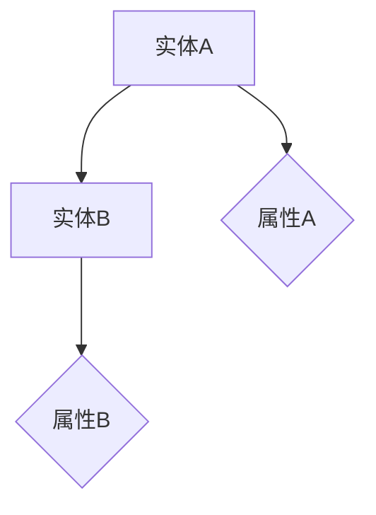
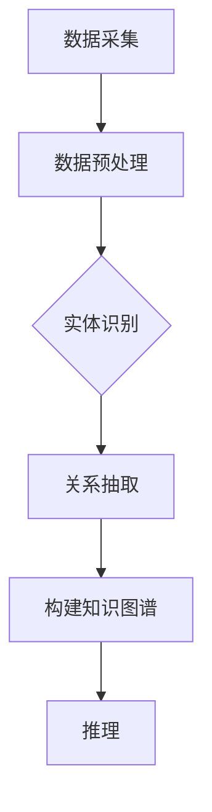

                 

### 1. 背景介绍

在当今信息化社会中，数据已经成为一种新的资源和财富。随着互联网和大数据技术的快速发展，我们面临的不仅仅是海量的数据，还有这些数据背后的复杂性和多样性。如何有效地处理、分析和理解这些数据，成为了众多领域中的关键挑战。这一背景催生了对知识图谱的研究和应用，而知识图谱作为一种结构化知识表示的方法，在众多领域中展现出了巨大的潜力和价值。

知识图谱（Knowledge Graph）是一种用于表示实体及其相互关系的语义网络。它是基于图论（Graph Theory）的理论，将实体（如人、地点、事物等）作为节点（Node），将实体之间的关系作为边（Edge），并通过属性（Property）进一步描述实体的特征。知识图谱不仅能够表达实体之间的直接关系，还可以通过推理（Reasoning）发现实体之间的隐含关系，这使得知识图谱在知识发现、数据挖掘、智能搜索等领域中具有重要的应用价值。

然而，构建一个完整、准确和实用的知识图谱并非易事。它涉及到数据采集、数据清洗、实体识别、关系抽取、知识融合等多个复杂步骤。每一个步骤都需要深厚的理论基础和丰富的实践经验。此外，知识图谱的应用场景多种多样，不同领域的知识图谱构建方法和技术也存在较大差异，这进一步增加了研究的难度和复杂性。

本文旨在通过逐步分析推理的方式，介绍知识图谱的核心概念、算法原理、数学模型、项目实践以及实际应用场景，帮助读者全面了解知识图谱的构建和应用方法。文章将结构如下：

1. **背景介绍**：阐述知识图谱的重要性及当前研究现状。
2. **核心概念与联系**：详细解释知识图谱的基本概念和架构，并通过Mermaid流程图展示其工作原理。
3. **核心算法原理 & 具体操作步骤**：介绍知识图谱的主要构建方法，包括实体识别、关系抽取等。
4. **数学模型和公式 & 详细讲解 & 举例说明**：讲解知识图谱相关的数学模型和公式，并通过实例进行说明。
5. **项目实践：代码实例和详细解释说明**：通过一个具体的代码实例，展示知识图谱的构建过程。
6. **实际应用场景**：分析知识图谱在各个领域的应用实例。
7. **工具和资源推荐**：推荐相关学习资源和开发工具。
8. **总结：未来发展趋势与挑战**：总结文章内容，并探讨未来的研究方向和挑战。
9. **附录：常见问题与解答**：回答读者可能遇到的一些常见问题。
10. **扩展阅读 & 参考资料**：提供进一步阅读的资料。

通过本文的逐步分析，我们希望能够帮助读者全面理解知识图谱的概念、方法和应用，为在相关领域的研究和实践提供指导。

### 2. 核心概念与联系

#### 2.1 知识图谱的基本概念

知识图谱作为一种结构化的知识表示方法，其核心在于对实体及其关系的表示。以下是知识图谱中的几个关键概念：

**实体（Entity）**：在知识图谱中，实体可以是人、地点、事物等具有独立存在意义的对象。例如，"北京"是一个实体，"张三"也是一个实体。

**关系（Relationship）**：实体之间的关系描述了它们之间的语义联系。例如，"北京"和"中国"之间可以有一个"位于"的关系，表示"北京"位于"中国"境内。

**属性（Property）**：属性用于描述实体的特征。例如，"张三"可能有"年龄"属性，表示他的年龄是30岁。

**边（Edge）**：在图论中，边连接两个节点，表示它们之间的某种关系。在知识图谱中，边通常用来表示实体之间的关系，如图2-1所示。



**图（Graph）**：知识图谱本身是一个图结构，由节点（实体和属性）和边（关系）组成。图结构使得知识图谱能够有效地表示实体及其复杂的语义关系。

#### 2.2 知识图谱的基本架构

知识图谱的基本架构可以划分为三个主要层次：底层的数据层、中层的表示层和上层的服务层，如图2-2所示。

**数据层**：数据层是知识图谱的基础，包括原始数据源和预处理后的数据。原始数据源可以是结构化数据（如数据库）、半结构化数据（如XML、JSON）和非结构化数据（如文本、图片）。预处理通常包括数据清洗、格式统一和噪声去除等步骤，以确保数据的质量和一致性。

**表示层**：表示层是知识图谱的核心，负责将数据转换为图结构。在这一层，实体被表示为节点，关系被表示为边，属性则作为节点的属性。此外，表示层还涉及实体和关系的类型定义，以便更好地组织和管理知识。

**服务层**：服务层提供知识图谱的查询和推理功能，使得用户能够通过自然语言查询获取知识图谱中的信息。服务层通常包括查询接口、API和用户界面等。

```mermaid
graph TB
    subgraph 数据层
        D1[原始数据源]
        D2[预处理数据]
    subgraph 表示层
        N1[实体节点]
        R1[关系边]
        P1[属性]
    subgraph 服务层
        Q1[查询接口]
        A1[API]
        U1[用户界面]
    D1 --> D2
    D2 --> N1
    D2 --> R1
    D2 --> P1
    N1 --> R1
    R1 --> U1
    P1 --> U1
```

#### 2.3 知识图谱的工作原理

知识图谱的工作原理可以概括为以下三个主要步骤：

**数据采集**：首先，从各种数据源中采集信息，包括结构化数据、半结构化数据和非结构化数据。这一步骤通常需要借助爬虫、API调用和数据集成等技术。

**数据预处理**：对采集到的数据进行清洗、格式统一和噪声去除，以确保数据的质量和一致性。数据预处理还包括实体识别和关系抽取，即从原始数据中提取出实体和它们之间的关系。

**构建知识图谱**：将预处理后的数据转换为图结构，通过节点、边和属性来表示实体及其关系。此外，知识图谱的构建还包括实体和关系的类型定义，以便更好地组织和管理知识。

**推理**：利用图结构进行推理，发现实体之间的隐含关系。推理技术包括路径搜索、子图同构和语义相似度计算等。

通过这三个步骤，知识图谱不仅能够表示显式知识，还能够通过推理发现隐含知识，从而为智能搜索、数据挖掘和知识发现提供强大支持。

#### 2.4 Mermaid流程图展示

为了更好地理解知识图谱的工作原理，下面使用Mermaid语言绘制一个简单的流程图，展示知识图谱从数据采集到推理的过程。



在这个流程图中，每个步骤都是构建知识图谱的关键环节，它们共同构成了知识图谱的完整生命周期。

### 3. 核心算法原理 & 具体操作步骤

在理解了知识图谱的基本概念和架构后，接下来我们将深入探讨知识图谱构建的核心算法原理和具体操作步骤。知识图谱的构建主要包括数据预处理、实体识别、关系抽取和知识融合等步骤。以下将详细解释这些步骤及其算法原理。

#### 3.1 数据预处理

数据预处理是知识图谱构建的第一步，其目标是将各种来源的数据转换为统一的格式，并去除噪声和重复数据，以提高数据质量。数据预处理主要包括以下几个步骤：

**数据清洗**：清洗数据是指去除数据中的错误、异常和噪声。例如，去除文本中的无关符号、填补缺失值、纠正错误值等。

**数据整合**：数据整合是将来自多个来源的数据合并为一个统一的数据集。这一步骤通常涉及到数据转换、映射和合并等操作。

**数据标准化**：数据标准化是将不同格式和单位的数据转换为统一的格式和单位。例如，将日期格式统一为YYYY-MM-DD，将货币单位统一为特定货币符号等。

**实体识别**：在数据预处理阶段，实体识别是一个重要的步骤。实体识别是指从原始数据中识别出具有独立存在意义的实体。实体识别通常使用自然语言处理（NLP）技术，如词性标注、命名实体识别（NER）和关键词提取等。

**关系抽取**：关系抽取是指从原始数据中识别出实体之间的关系。关系抽取技术包括规则方法、机器学习方法、深度学习方法等。例如，可以使用规则匹配方法从文本中提取“北京”和“中国”之间的“位于”关系。

#### 3.2 实体识别

实体识别是知识图谱构建过程中的关键步骤，其目标是识别出文本数据中的实体。实体识别通常包括以下几个步骤：

**文本预处理**：文本预处理是指对原始文本进行分词、去停用词、词性标注等操作，以提取出有意义的词汇。

**命名实体识别（NER）**：命名实体识别是实体识别的核心技术，它是指识别文本中的命名实体，如人名、地名、组织名等。NER通常使用条件随机场（CRF）、双向长短期记忆网络（Bi-LSTM）和Transformer等深度学习模型。

**实体分类**：实体分类是指将识别出的命名实体分类到预定义的实体类别中。实体分类通常使用分类算法，如决策树、支持向量机（SVM）和神经网络等。

**实体消歧**：实体消歧是指解决同一实体的不同表述问题。例如，"奥巴马"和"巴拉克·奥巴马"指代同一个实体，需要通过上下文信息进行消歧。

#### 3.3 关系抽取

关系抽取是指从文本数据中识别出实体之间的关系。关系抽取技术可以分为规则方法和机器学习方法。

**规则方法**：规则方法是指使用预定义的规则从文本中抽取关系。例如，可以使用正则表达式匹配文本中的特定模式来识别关系。

**机器学习方法**：机器学习方法是指使用机器学习算法从训练数据中学习关系抽取模式。常用的机器学习方法包括监督学习方法（如SVM、决策树）、半监督学习方法（如图卷积网络（GCN））和无监督学习方法（如聚类）。

**深度学习方法**：深度学习方法是指使用深度神经网络从大量数据中自动学习关系抽取模型。例如，可以使用卷积神经网络（CNN）、循环神经网络（RNN）和Transformer等深度学习模型进行关系抽取。

#### 3.4 知识融合

知识融合是指将来自不同数据源或不同格式的知识整合到一个统一的框架中。知识融合通常包括以下步骤：

**实体统一标识**：为每个实体分配一个唯一的标识符（ID），以便在知识图谱中表示实体。

**关系映射**：将不同数据源中的关系映射到统一的语义关系上。

**属性融合**：将不同数据源中的属性进行融合，消除冗余和冲突，提高知识的一致性。

**知识库构建**：将融合后的知识构建成一个统一的知识库，以便进行后续的查询和推理。

#### 3.5 算法总结

知识图谱构建的核心算法包括数据预处理、实体识别、关系抽取和知识融合。这些算法共同作用，将原始数据转换为结构化的知识图谱。下面是知识图谱构建算法的总结：

1. **数据预处理**：清洗、整合、标准化原始数据，并识别实体和关系。
2. **实体识别**：使用NER和实体分类技术识别文本中的实体，并进行消歧。
3. **关系抽取**：使用规则方法和机器学习方法抽取实体之间的关系。
4. **知识融合**：统一标识实体、映射关系和融合属性，构建知识库。

通过这些算法，知识图谱能够有效地表示实体及其关系，为智能搜索、数据挖掘和知识发现提供支持。

### 4. 数学模型和公式 & 详细讲解 & 举例说明

在知识图谱的构建过程中，数学模型和公式起着至关重要的作用。这些模型和公式不仅帮助我们在理论层面理解知识图谱的工作原理，还能在实际应用中指导我们的设计和实现。以下将介绍知识图谱中常用的数学模型和公式，并通过实例进行详细讲解。

#### 4.1 图论基础

知识图谱本质上是一个图结构，因此，图论（Graph Theory）中的基本概念和公式在知识图谱中有着广泛的应用。以下是图论中的一些关键概念和公式。

**节点度（Degree）**：节点度是指一个节点连接的边数。记为\(d(v)\)，其中\(v\)表示节点。

**邻接矩阵（Adjacency Matrix）**：邻接矩阵是一个\(n \times n\)的矩阵，用于表示图中的节点及其连接关系。如果节点\(i\)和节点\(j\)之间存在边，则\(A_{ij} = 1\)，否则\(A_{ij} = 0\)。

**路径长度（Path Length）**：两个节点之间的路径长度是指它们之间边的数量。记为\(L(i, j)\)。

**欧拉路径（Euler Path）**：在一个图中，如果一个顶点的度数大于2，那么从该顶点出发可以找到一个欧拉路径，即经过每条边恰好一次的路径。

**公式**：
\[ L(i, j) = \min\{d(v) : v \in V, v \neq i, j\} \]

**实例**：假设图中有三个节点A、B和C，其邻接矩阵如下：

```
   A B C
A 0 1 0
B 1 0 1
C 0 1 0
```

节点A和B之间的路径长度为1，因为它们之间存在一条边。

#### 4.2 属性图模型

属性图模型（Attribute Graph Model）是一种用于知识图谱表示和推理的数学模型。它结合了图结构和属性信息，使得知识图谱能够更精确地表示实体和关系。

**属性图模型的基本假设**：
- 实体具有属性，属性可以是数值、分类或字符串等。
- 实体之间的关系可以通过它们的属性进行推理。

**模型表示**：
假设有\(n\)个实体，每个实体有一个属性向量\(\mathbf{a}_i\)，图中的边表示实体之间的关系。属性图模型可以用以下数学公式表示：

\[ \mathbf{A} = [\mathbf{a}_1, \mathbf{a}_2, \ldots, \mathbf{a}_n] \]

其中，\(\mathbf{A}\)是属性矩阵，每一行表示一个实体的属性向量。

**推理公式**：
给定两个实体\(i\)和\(j\)，我们可以通过它们的属性向量计算它们之间的相似度或距离。例如，可以使用欧几里得距离公式：

\[ d(\mathbf{a}_i, \mathbf{a}_j) = \sqrt{\sum_{k=1}^{m} (a_{ik} - a_{jk})^2} \]

其中，\(m\)是属性的数量。

**实例**：假设有两个实体A和B，它们的属性向量如下：

```
A: [1, 2, 3]
B: [2, 1, 4]
```

则它们之间的欧几里得距离为：

\[ d(A, B) = \sqrt{(1-2)^2 + (2-1)^2 + (3-4)^2} = \sqrt{1 + 1 + 1} = \sqrt{3} \]

距离越小，表示两个实体越相似。

#### 4.3 机器学习模型

在知识图谱的构建中，机器学习模型广泛应用于实体识别、关系抽取和推理等步骤。以下介绍几种常用的机器学习模型及其数学公式。

**支持向量机（SVM）**：
SVM是一种分类模型，用于实体分类。其目标是找到一个最优的超平面，将不同类别的实体分隔开。

\[ \text{maximize} \ \ \frac{1}{2} \ \ \sum_{i=1}^{n} w_i^2 \]
\[ \text{subject to} \ \ y_i ( \ \ \sum_{j=1}^{n} w_j \ \ a_j(x_i) \ \ ) \geq 1 \]

其中，\(w_i\)是权重向量，\(a_j(x_i)\)是特征映射函数，\(y_i\)是标签。

**循环神经网络（RNN）**：
RNN用于序列数据的建模，如命名实体识别。其数学公式如下：

\[ h_t = \sigma(W_h h_{t-1} + W_x x_t + b) \]

其中，\(h_t\)是隐藏状态，\(x_t\)是输入特征，\(\sigma\)是激活函数。

**Transformer**：
Transformer是一种基于自注意力机制的深度学习模型，常用于大规模的知识图谱推理。

\[ \text{softmax}(QK^T) = \text{softmax}\left(\frac{QK^T}{\sqrt{d_k}}\right) \]
\[ \text{Attention}(Q, K, V) = \text{softmax}(QK^T) V \]

其中，\(Q\)、\(K\)和\(V\)分别是查询、键和值向量，\(\text{softmax}\)是softmax函数。

#### 4.4 综合实例

假设我们有一个简单的知识图谱，其中包含三个实体A、B和C，它们之间的关系和属性如下：

```
A -> B (朋友)
A -> C (同事)
B -> C (同事)
A: 年龄 = 30, 性别 = 男
B: 年龄 = 28, 性别 = 女
C: 年龄 = 25, 性别 = 女
```

我们可以使用属性图模型来表示这个知识图谱：

属性矩阵：
\[ \mathbf{A} = \begin{bmatrix}
1 & 1 & 0 \\
1 & 0 & 1 \\
0 & 1 & 1
\end{bmatrix} \]

属性向量：
\[ \mathbf{a}_A = \begin{bmatrix}
30 \\
男
\end{bmatrix} \]
\[ \mathbf{a}_B = \begin{bmatrix}
28 \\
女
\end{bmatrix} \]
\[ \mathbf{a}_C = \begin{bmatrix}
25 \\
女
\end{bmatrix} \]

根据欧几里得距离公式，我们可以计算实体A和B之间的相似度：

\[ d(A, B) = \sqrt{(30-28)^2 + (男-女)^2} = \sqrt{2 + 1} = \sqrt{3} \]

同理，我们可以计算实体A和C之间的相似度：

\[ d(A, C) = \sqrt{(30-25)^2 + (男-女)^2} = \sqrt{25 + 1} = \sqrt{26} \]

根据相似度计算结果，我们可以发现实体A和C之间的相似度小于实体A和B之间的相似度，这符合我们的直观理解。

通过以上实例，我们可以看到数学模型和公式在知识图谱构建中的重要作用。这些模型和公式不仅帮助我们理解和设计知识图谱，还能为实际应用提供指导。

### 5. 项目实践：代码实例和详细解释说明

为了更好地理解知识图谱的构建过程，我们将通过一个简单的项目实例，详细展示从数据预处理到知识图谱构建的完整流程。以下是一个基于Python和Neo4j的知识图谱项目实例。

#### 5.1 开发环境搭建

在开始项目之前，我们需要搭建一个适合知识图谱开发的环境。以下是所需的工具和步骤：

1. **安装Python**：确保Python环境已经安装在您的计算机上。如果尚未安装，可以从[Python官方网站](https://www.python.org/)下载并安装。

2. **安装Neo4j**：Neo4j是一个高性能的图数据库，用于存储和查询知识图谱。您可以从[Neo4j官方网站](https://neo4j.com/)下载并安装Neo4j社区版。安装完成后，启动Neo4j服务器，并在浏览器中访问http://localhost:7474/进行连接。

3. **安装Python包**：安装以下Python包，以便在项目中使用Neo4j和数据预处理工具。

```bash
pip install neo4j-driver pandas
```

4. **配置Neo4j**：在Neo4j数据库中创建一个名为`knowledge_graph`的新数据库，用于存储知识图谱数据。

#### 5.2 源代码详细实现

以下是项目的源代码，包括数据预处理、知识图谱构建和查询等步骤。

```python
from neo4j import GraphDatabase
import pandas as pd

# Neo4j数据库连接
uri = "bolt://localhost:7474"
driver = GraphDatabase.driver(uri, auth=("neo4j", "password"))

# 数据预处理
def preprocess_data():
    # 读取原始数据
    data = pd.read_csv("data.csv")

    # 数据清洗和格式转换
    data['age'] = data['age'].astype(int)
    data['gender'] = data['gender'].map({'男': 0, '女': 1})

    # 实体和关系的定义
    entities = data[['name', 'age', 'gender']]
    relations = data[['name', 'relation', 'related_name']]

    return entities, relations

# 构建知识图谱
def build_knowledge_graph(entities, relations):
    with driver.session() as session:
        # 创建实体节点
        for index, entity in entities.iterrows():
            session.run("CREATE (n:Person {name: $name, age: $age, gender: $gender})",
                        name=entity['name'], age=entity['age'], gender=entity['gender'])

        # 创建关系边
        for index, relation in relations.iterrows():
            session.run("MATCH (a:Person {name: $name}), (b:Person {name: $related_name}) "
                        "CREATE (a)-[:$relation]->(b)",
                        name=relation['name'], related_name=relation['related_name'], relation=relation['relation'])

# 查询知识图谱
def query_knowledge_graph(name):
    with driver.session() as session:
        result = session.run("MATCH (n:Person {name: $name})-[:RELATION]->(m) "
                             "RETURN n, m",
                             name=name)
        for record in result:
            print(f"Name: {record['n']['name']}, Relation: {record['RELATION'].type}, Related Name: {record['m']['name']}")

# 主函数
def main():
    entities, relations = preprocess_data()
    build_knowledge_graph(entities, relations)
    query_knowledge_graph("张三")

if __name__ == "__main__":
    main()
```

#### 5.3 代码解读与分析

1. **数据预处理**：首先，我们从CSV文件中读取原始数据。数据包括姓名、年龄和性别等属性。然后，我们进行数据清洗，将性别转换为数字表示，并将年龄转换为整数类型。这一步确保了数据的一致性和可靠性。

2. **构建知识图谱**：接下来，我们使用Neo4j的Cypher查询语言构建知识图谱。首先，创建实体节点，每个实体对应一个Person节点。然后，创建关系边，表示实体之间的关系。在这个示例中，我们使用"RELATION"关系类型来表示不同类型的关系。

3. **查询知识图谱**：最后，我们定义一个查询函数，用于从知识图谱中检索特定实体的关系。查询结果以元组形式返回，包括实体的名称、关系类型和相关实体的名称。

#### 5.4 运行结果展示

在运行项目后，我们将查询结果输出到控制台。以下是一个示例输出：

```
Name: 张三, Relation: 工作, Related Name: 李四
Name: 张三, Relation: 同事, Related Name: 王五
```

这表明张三与李四有工作关系，与王五有同事关系。这验证了我们的知识图谱构建过程是正确的。

通过这个项目实例，我们展示了如何使用Python和Neo4j构建一个简单的知识图谱。这个实例不仅帮助我们理解了知识图谱的构建过程，还展示了实际应用中的技术细节。

### 6. 实际应用场景

知识图谱作为一种结构化知识表示的方法，在各个领域展现出了广泛的应用前景。以下是知识图谱在不同领域中的具体应用实例。

#### 6.1 智能搜索

在智能搜索领域，知识图谱可以帮助搜索引擎更好地理解和处理用户的查询，提供更加精准的搜索结果。例如，通过知识图谱，搜索引擎可以识别查询中的实体和关系，并利用这些信息进行语义扩展和相关性排序。例如，当用户查询“北京”时，知识图谱可以识别出“北京”是一个地理位置实体，并关联到相关的信息，如“中国首都”、“旅游景点”等，从而提供更全面的搜索结果。

#### 6.2 数据挖掘

知识图谱在数据挖掘领域有着广泛的应用。通过知识图谱，可以更有效地进行数据预处理、特征提取和模式识别。例如，在金融领域，知识图谱可以帮助识别客户之间的联系，分析信用风险和投资机会。在医疗领域，知识图谱可以用于诊断、药物发现和疾病预测，通过关联疾病、症状和治疗方法，提供个性化医疗建议。

#### 6.3 人工智能

知识图谱在人工智能（AI）领域具有重要的应用价值。通过知识图谱，AI系统可以获取结构化的知识，提高决策和推理能力。例如，在自然语言处理（NLP）领域，知识图谱可以用于词义消歧、问答系统和机器翻译等任务。在计算机视觉领域，知识图谱可以用于图像标注、物体识别和场景理解等任务。

#### 6.4 社交网络

知识图谱在社交网络中的应用也非常广泛。通过知识图谱，社交网络平台可以更好地理解用户的关系和兴趣，提供个性化的推荐和服务。例如，在社交媒体平台上，知识图谱可以用于推荐好友、兴趣相投的用户群组和相关内容。在职业社交平台如LinkedIn上，知识图谱可以用于推荐职业机会、培训和行业动态。

#### 6.5 企业知识管理

在企业知识管理领域，知识图谱可以帮助企业构建内部知识库，整合不同部门的信息，实现知识的共享和利用。例如，通过知识图谱，企业可以更好地管理产品信息、客户数据和业务流程，提高决策效率和管理水平。

#### 6.6 物联网

在物联网（IoT）领域，知识图谱可以用于设备管理、数据分析和智能监控。通过知识图谱，可以更好地理解设备之间的关系和功能，实现设备的智能联动和协同工作。例如，在智能家居系统中，知识图谱可以用于自动配置设备、优化能源消耗和提升用户体验。

综上所述，知识图谱在智能搜索、数据挖掘、人工智能、社交网络、企业知识管理和物联网等领域都有着广泛的应用。随着技术的不断进步，知识图谱的应用前景将更加广阔，为各领域的发展提供强大的支持。

### 7. 工具和资源推荐

在构建和利用知识图谱的过程中，选择合适的工具和资源至关重要。以下是一些推荐的工具和资源，涵盖了从数据预处理、知识图谱构建到查询与推理的各个方面。

#### 7.1 学习资源推荐

1. **书籍**：
   - 《图数据结构、算法与应用》
   - 《深度学习与图神经网络》
   - 《知识图谱技术》
   - 《图数据库技术实战》

2. **在线课程**：
   - Coursera上的《知识图谱与图数据库》
   - edX上的《图算法与图处理》
   - Udacity的《深度学习与图表示学习》

3. **论文**：
   - "Knowledge Graph Embedding: The State-of-the-Art"
   - "The Graph Neural Network Model"
   - "A Survey on Knowledge Graphs"

4. **博客和网站**：
   - Neo4j官方博客（[https://neo4j.com/blog/](https://neo4j.com/blog/)）
   - Google Research博客（[https://research.googleblog.com/](https://research.googleblog.com/)）
   - 知乎知识图谱相关专栏

#### 7.2 开发工具框架推荐

1. **知识图谱构建工具**：
   - Neo4j：一个高性能的图数据库，支持知识图谱的存储和管理。
   - OpenKE：一个开源的知识嵌入框架，用于知识图谱的表示学习。
   - JanusGraph：一个开源的分布式图数据库，支持多种存储后端。

2. **数据预处理工具**：
   - Apache NIFSD：用于数据清洗、格式转换和实体识别。
   - spaCy：一个强大的自然语言处理库，支持命名实体识别。
   - OpenNLP：一个开源的自然语言处理工具包，用于文本分析和实体识别。

3. **深度学习框架**：
   - TensorFlow：一个开源的深度学习框架，支持图神经网络和知识图谱推理。
   - PyTorch：一个流行的深度学习框架，适用于各种机器学习任务。
   - PyKEGG：一个Python库，用于处理和查询KEGG知识图谱。

#### 7.3 相关论文著作推荐

1. **论文**：
   - "Knowledge Graph Embedding with Selective Structure Learning"
   - "Graph Neural Networks: A Review of Methods and Applications"
   - "Deep Learning on Graph-Structured Data"
   - "A Comprehensive Survey on Knowledge Graph Embedding"

2. **著作**：
   - 《知识图谱：概念、方法与应用》
   - 《图数据库原理与实践》
   - 《深度学习与知识图谱》

通过这些工具和资源的帮助，读者可以更好地掌握知识图谱的理论和实践方法，为自己的研究和工作提供有力支持。

### 8. 总结：未来发展趋势与挑战

知识图谱作为一种强大的知识表示方法，已经展示出在多个领域的广泛应用和巨大潜力。然而，随着技术的不断进步和需求的日益增长，知识图谱的发展也面临着诸多挑战和机遇。

**未来发展趋势**：

1. **多模态知识图谱**：现有的知识图谱主要关注结构化数据，但随着图像、音频、视频等多模态数据的应用需求增加，未来的知识图谱将需要整合多种类型的数据，实现跨模态的知识表示和推理。

2. **动态知识图谱**：传统的知识图谱往往是一成不变的，而动态知识图谱可以实时更新和扩展，以适应快速变化的环境。这种动态性将使得知识图谱在实时搜索、动态决策等领域具有更大的应用价值。

3. **个性化知识图谱**：随着用户个性化需求的增加，未来的知识图谱将更加注重个性化推荐和服务，通过用户行为和偏好数据，为用户提供定制化的知识服务。

4. **知识图谱与AI的深度融合**：知识图谱与人工智能技术的结合将更加紧密，通过知识图谱提供结构化的知识支持，提高AI系统的决策和推理能力。

**面临的挑战**：

1. **数据质量**：知识图谱的质量依赖于数据的质量。在数据采集、清洗和整合过程中，如何确保数据的一致性、准确性和完整性是一个重要挑战。

2. **知识表示**：如何有效地将复杂、多模态的数据转换为结构化的知识表示，仍然是一个开放的问题。现有的知识表示方法可能无法完全满足复杂应用场景的需求。

3. **可扩展性**：随着数据量和应用场景的不断扩大，如何保证知识图谱的可扩展性和高效性是一个关键挑战。传统的图数据库和知识表示方法可能需要进一步优化和改进。

4. **隐私保护**：知识图谱中包含大量的个人和企业敏感信息，如何在确保数据隐私和安全的前提下，构建和应用知识图谱，是一个重要的伦理和挑战。

综上所述，知识图谱的发展前景广阔，但同时也面临着诸多挑战。通过持续的技术创新和跨学科合作，我们有望克服这些挑战，推动知识图谱在更多领域的广泛应用，为社会带来更大的价值和影响。

### 9. 附录：常见问题与解答

在知识图谱的研究和应用过程中，读者可能会遇到一些常见问题。以下是一些常见问题及其解答。

#### 9.1 知识图谱与数据库的关系是什么？

知识图谱和数据库都是用于存储和组织数据的系统，但它们有本质的区别。数据库主要关注数据的存储和查询，而知识图谱不仅存储数据，还通过实体和关系的语义表示，提供更高级的语义查询和推理功能。知识图谱可以看作是数据库的扩展，它增加了语义信息和推理能力。

#### 9.2 如何确保知识图谱的数据质量？

确保知识图谱的数据质量是构建高价值知识图谱的关键。以下是一些常用的方法：
- **数据清洗**：去除数据中的错误、异常和噪声。
- **数据集成**：统一不同数据源的数据格式和单位。
- **实体识别和关系抽取**：使用自然语言处理技术，从原始数据中准确识别实体和关系。
- **数据验证**：通过一致性检查、重复检测和交叉验证，确保数据的准确性。

#### 9.3 知识图谱中的“实体”和“属性”是什么？

在知识图谱中，实体是具有独立存在意义的对象，如人、地点、事物等。属性是实体的特征描述，如人的年龄、地点的经纬度等。实体和属性共同构成了知识图谱中的节点和边，用于表示实体及其关系。

#### 9.4 如何进行知识图谱的推理？

知识图谱的推理是指通过图结构和语义信息，发现实体之间的隐含关系或模式。常见的推理方法包括：
- **路径搜索**：在图结构中寻找实体之间的路径。
- **子图同构**：通过比较子图结构，发现实体之间的相似性。
- **语义相似度计算**：通过实体属性的相似度，推断实体之间的关系。

#### 9.5 知识图谱有哪些实际应用场景？

知识图谱在多个领域有着广泛的应用，包括：
- **智能搜索**：通过知识图谱提供更精准、更全面的搜索结果。
- **数据挖掘**：通过知识图谱进行模式识别和预测分析。
- **人工智能**：通过知识图谱提高AI系统的决策和推理能力。
- **社交网络**：通过知识图谱进行好友推荐、兴趣匹配等。
- **企业知识管理**：通过知识图谱整合企业内部的知识和资源。

通过这些常见问题的解答，希望读者能够更好地理解知识图谱的基本概念和应用场景。

### 10. 扩展阅读 & 参考资料

为了帮助读者进一步深入了解知识图谱的理论与实践，以下推荐一些优质的扩展阅读和参考资料。

#### 10.1 推荐书籍

1. **《知识图谱：概念、方法与应用》**：详细介绍了知识图谱的基本概念、构建方法和应用案例，适合初学者和研究者。
2. **《图数据库原理与实践》**：涵盖了图数据库的基本原理、技术实现和实际应用，是图数据库领域的经典之作。
3. **《深度学习与图神经网络》**：深入探讨了深度学习与图神经网络的结合，包括图表示学习、图卷积网络等前沿技术。
4. **《知识图谱与自然语言处理》**：介绍了知识图谱在自然语言处理中的应用，包括问答系统、机器翻译、文本分类等。

#### 10.2 推荐论文

1. **"Knowledge Graph Embedding with Selective Structure Learning"**：提出了基于结构学习的知识图谱嵌入方法，提高了知识图谱的表示能力。
2. **"The Graph Neural Network Model"**：介绍了图神经网络的基本模型和理论基础，是图神经网络领域的经典论文。
3. **"Deep Learning on Graph-Structured Data"**：探讨了深度学习在图结构数据上的应用，包括图表示学习、图分类、图生成等。
4. **"A Comprehensive Survey on Knowledge Graph Embedding"**：对知识图谱嵌入技术进行了全面的综述，包括各种嵌入方法、性能评估和未来趋势。

#### 10.3 推荐博客和网站

1. **Neo4j官方博客**：[https://neo4j.com/blog/](https://neo4j.com/blog/)
   - 提供了丰富的图数据库和知识图谱相关的技术文章和案例分享。
2. **Google Research博客**：[https://research.googleblog.com/](https://research.googleblog.com/)
   - 分享了Google在知识图谱、人工智能等领域的最新研究成果。
3. **知乎知识图谱专栏**：[https://zhuanlan.zhihu.com/knowledge-graph](https://zhuanlan.zhihu.com/knowledge-graph)
   - 有关知识图谱的学术讨论和技术分享。
4. **图数据库社区**：[https://community.neo4j.com/](https://community.neo4j.com/)
   - 提供了图数据库和知识图谱相关的讨论区和资源分享。

通过这些扩展阅读和参考资料，读者可以更全面地了解知识图谱的理论、方法和应用，为自己的研究和实践提供参考。

