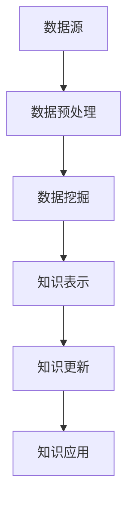
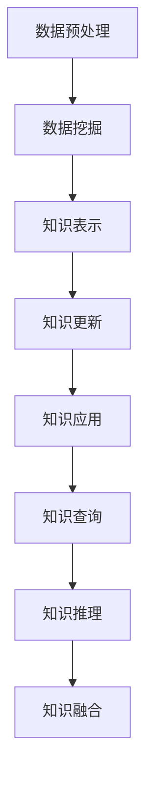

                 

### 背景介绍 Background Introduction

#### 1.1 人类知识体系的演变 Evolution of Human Knowledge System

人类知识体系的演变是一个漫长而复杂的过程。从远古时代的口口相传，到文字的发明，再到现代科技的进步，知识的形式和传播方式都经历了巨大的变革。

- **早期人类知识传播**：在人类历史的早期，知识主要通过口口相传的方式进行传播。这种传播方式依赖于记忆和口头表达能力，知识的积累和传播速度非常缓慢。
  
- **文字的发明**：随着文字的发明，知识得以被记录下来。这一突破性的技术进步使得知识得以更长时间地保存，并且可以进行更广泛的传播。文字的出现极大地推动了人类文明的进步。

- **印刷术的发明**：在文字发明之后，印刷术的发明进一步加速了知识的传播。印刷术使得书籍的复制变得容易，大量书籍的出现使得知识更加普及。

- **现代科技的发展**：进入20世纪，随着现代科技的发展，尤其是互联网的普及，知识传播的速度达到了前所未有的高度。现在，人们可以通过网络快速地获取到全球各地的知识。

#### 1.2 知识体系的重要性 Importance of Knowledge System

知识体系是人类文明进步的重要基石。它不仅帮助我们理解世界，解决现实问题，还为我们提供了创新的源泉。

- **解决问题的工具**：知识体系是解决各种现实问题的关键工具。无论是科学问题、技术问题还是社会问题，都需要通过知识体系来寻找答案。

- **创新的源泉**：知识体系为我们提供了创新的源泉。通过对现有知识的深入理解和重新组合，我们可以创造出新的技术、新的产品、新的商业模式。

- **提升个人能力**：知识体系可以帮助我们提升个人能力。无论是学习新技能、提高工作效率，还是做出更明智的决策，都需要依赖知识体系。

#### 1.3 知识发现引擎的兴起 Rise of Knowledge Discovery Engine

知识发现引擎是一种能够自动从大量数据中提取知识和规律的人工智能系统。它的出现，极大地改变了知识体系的构建和更新方式。

- **海量数据的处理**：知识发现引擎能够处理海量数据，快速地从数据中提取有价值的信息。

- **自动化的知识构建**：知识发现引擎可以自动化地构建知识体系，极大地提高了知识构建的效率和准确性。

- **个性化的知识服务**：知识发现引擎可以根据用户的需求，提供个性化的知识服务。

- **跨领域的知识整合**：知识发现引擎可以跨越不同领域，将不同领域的知识进行整合，为用户提供更全面的知识体系。

#### 1.4 本文目的 Purpose of This Article

本文旨在探讨知识发现引擎在构建和更新人类知识体系中的任务和挑战。通过分析知识发现引擎的核心概念、算法原理和具体实现，我们希望能够提供一个深入理解知识发现引擎的视角，并为未来的研究和应用提供一些启示。

### 核心概念与联系 Core Concepts and Relationships

在探讨知识发现引擎（Knowledge Discovery Engine，简称KDE）的任务之前，我们首先需要了解一些核心概念，并探讨它们之间的联系。

#### 2.1 知识发现（Knowledge Discovery）

知识发现是指从大量数据中提取出有价值的信息、模式和规律的过程。这一过程通常包括数据预处理、数据挖掘、模式识别和知识表示等步骤。

- **数据预处理**：数据预处理是知识发现的第一步，其目的是将原始数据转化为适合挖掘的形式。这一过程可能包括数据清洗、数据集成、数据转换和数据归一化等。

- **数据挖掘**：数据挖掘是从大量数据中提取出有价值信息的过程。常用的数据挖掘技术包括聚类、分类、关联规则挖掘、异常检测和文本挖掘等。

- **模式识别**：模式识别是数据挖掘的一个重要分支，旨在识别数据中的特定模式或规律。模式识别技术包括神经网络、支持向量机、决策树和贝叶斯分类器等。

- **知识表示**：知识表示是将提取出的信息和模式转化为易于理解和利用的形式。知识表示技术包括本体论、语义网、知识图谱和概念层次网络等。

#### 2.2 数据科学与机器学习（Data Science and Machine Learning）

数据科学和机器学习是知识发现的重要技术基础。数据科学是关于数据理解和数据处理的科学，包括数据预处理、数据分析和数据可视化等。机器学习则是使计算机从数据中学习并做出预测或决策的技术。

- **监督学习（Supervised Learning）**：监督学习是一种从标记数据中学习的方法。通过训练模型，使其能够对新的数据进行分类或回归预测。

- **无监督学习（Unsupervised Learning）**：无监督学习是从无标记数据中学习的方法。其目标通常是发现数据中的隐藏结构或模式，如聚类和降维。

- **强化学习（Reinforcement Learning）**：强化学习是一种通过试错来学习的方法。它通过与环境的交互，不断调整策略，以实现最优化的目标。

#### 2.3 知识图谱（Knowledge Graph）

知识图谱是一种用于表示实体、概念及其关系的图形结构。知识图谱在知识发现和知识管理中扮演着重要角色。

- **实体（Entity）**：实体是知识图谱中的基本元素，可以是任何具有独立存在意义的对象，如人、地点、事物等。

- **概念（Concept）**：概念是知识图谱中表示抽象概念的节点，如数学、物理学、计算机科学等。

- **关系（Relation）**：关系是知识图谱中表示实体间关系的边。例如，“是”、“属于”、“位于”等。

#### 2.4 知识发现引擎（Knowledge Discovery Engine）

知识发现引擎是一种结合了数据科学、机器学习和知识图谱技术的人工智能系统。它的核心任务是自动从海量数据中提取知识和规律，并构建和更新知识体系。

- **数据源（Data Source）**：知识发现引擎的数据源可以是结构化数据、半结构化数据或非结构化数据。

- **数据预处理**：知识发现引擎首先对数据进行预处理，包括数据清洗、数据集成和数据转换等。

- **数据挖掘**：在预处理之后，知识发现引擎使用各种数据挖掘算法从数据中提取信息和模式。

- **知识表示**：提取出的信息和模式被转化为知识表示形式，如知识图谱。

- **知识更新**：知识发现引擎还具备知识更新的能力，能够根据新的数据进行知识体系的动态更新。

#### 2.5 知识图谱与知识发现引擎的关系 Relationship between Knowledge Graph and Knowledge Discovery Engine

知识图谱和知识发现引擎之间存在密切的关系。知识图谱为知识发现引擎提供了数据结构和语义信息，使其能够更有效地进行知识发现。

- **数据结构**：知识图谱的数据结构使得知识发现引擎能够以图形的方式表示实体和关系，便于进行复杂的数据查询和知识推理。

- **语义信息**：知识图谱中的语义信息为知识发现引擎提供了丰富的上下文信息，有助于提高数据挖掘和知识发现的准确性和效率。

- **知识表示**：知识图谱的知识表示形式为知识发现引擎提供了直观的知识表达方式，便于用户理解和利用知识。

#### 2.6 Mermaid 流程图（Mermaid Flowchart）

为了更好地理解知识发现引擎的工作流程，我们可以使用Mermaid流程图来展示其核心步骤。



- **数据源（A）**：知识发现引擎首先从各种数据源获取数据。
- **数据预处理（B）**：对数据进行清洗、集成和转换，使其适合数据挖掘。
- **数据挖掘（C）**：使用各种数据挖掘算法从数据中提取信息和模式。
- **知识表示（D）**：将提取出的信息和模式转化为知识表示形式，如知识图谱。
- **知识更新（E）**：根据新的数据进行知识体系的动态更新。
- **知识应用（F）**：将知识应用于实际场景，如智能搜索、决策支持等。

通过上述核心概念和Mermaid流程图的介绍，我们可以对知识发现引擎有一个初步的了解。在接下来的章节中，我们将深入探讨知识发现引擎的算法原理和具体实现。

### 核心算法原理 & 具体操作步骤 Core Algorithm Principles & Operational Steps

在了解了知识发现引擎的核心概念和Mermaid流程图之后，接下来我们将详细探讨知识发现引擎的核心算法原理和具体操作步骤。

#### 3.1 数据预处理

数据预处理是知识发现的第一步，其目的是将原始数据转化为适合挖掘的形式。数据预处理通常包括以下步骤：

- **数据清洗**：数据清洗是数据预处理的重要环节，其目的是去除数据中的噪声和错误。具体操作包括删除重复数据、处理缺失值、纠正数据错误等。

- **数据集成**：数据集成是将来自不同来源的数据合并为一个统一的数据集。这一过程可能涉及数据转换、数据映射和数据规范化等。

- **数据转换**：数据转换是将原始数据转化为适合数据挖掘的形式。这通常包括数据归一化、数据标准化和数据离散化等。

- **数据归一化**：数据归一化是将不同量纲的数据转化为相同量纲的数据。这有助于提高数据挖掘算法的性能。

- **数据标准化**：数据标准化是将数据缩放到一个固定范围，如[0, 1]。这有助于提高数据挖掘算法的稳定性和准确性。

- **数据离散化**：数据离散化是将连续数据划分为有限个离散的区间。这有助于提高数据挖掘算法的可解释性。

#### 3.2 数据挖掘

数据挖掘是从预处理后的数据中提取出有价值的信息和模式的过程。数据挖掘通常包括以下步骤：

- **特征选择**：特征选择是数据挖掘的重要步骤，其目的是从原始特征中选择出对目标有显著影响的特征。特征选择可以提高数据挖掘算法的性能和可解释性。

- **聚类分析**：聚类分析是将数据分为多个类别的过程。常用的聚类算法包括K-means、层次聚类和DBSCAN等。

- **分类算法**：分类算法是将数据分为预定义的类别的过程。常用的分类算法包括决策树、随机森林和神经网络等。

- **关联规则挖掘**：关联规则挖掘是寻找数据中关联规则的过程。常用的算法包括Apriori和FP-Growth等。

- **异常检测**：异常检测是识别数据中的异常值的过程。常用的算法包括基于统计的方法、基于聚类的方法和基于机器学习的方法等。

- **文本挖掘**：文本挖掘是从文本数据中提取出有价值信息的过程。常用的算法包括主题模型、情感分析和文本分类等。

#### 3.3 知识表示

知识表示是将提取出的信息和模式转化为易于理解和利用的形式的过程。知识表示通常包括以下步骤：

- **知识表示形式**：知识表示形式是指用于表示知识的图形结构或数据结构。常用的知识表示形式包括知识图谱、本体论和语义网等。

- **实体识别**：实体识别是识别数据中的实体，如人、地点、事物等。实体识别是知识表示的重要步骤。

- **关系抽取**：关系抽取是识别实体之间的关系，如“是”、“属于”、“位于”等。关系抽取有助于构建知识图谱。

- **知识融合**：知识融合是将来自不同来源的知识进行整合，以构建一个统一的知识体系。

#### 3.4 知识更新

知识更新是知识发现引擎的重要功能，其目的是根据新的数据进行知识体系的动态更新。知识更新通常包括以下步骤：

- **新数据采集**：新数据采集是从各种数据源获取新的数据。

- **数据预处理**：对新的数据进行预处理，使其适合知识发现。

- **知识发现**：使用知识发现算法从新数据中提取出有价值的信息和模式。

- **知识融合**：将新提取出的信息和模式与现有知识体系进行融合。

- **知识更新**：根据新知识和现有知识，对知识体系进行更新。

#### 3.5 知识应用

知识应用是将知识应用于实际场景，如智能搜索、决策支持、推荐系统等。知识应用通常包括以下步骤：

- **知识查询**：知识查询是用户通过查询接口获取知识的过程。

- **知识推理**：知识推理是利用知识图谱进行逻辑推理，以获得新的结论。

- **知识融合**：知识融合是将知识查询和推理的结果进行整合，以提供更全面的答案。

- **知识应用**：将整合后的知识应用于实际场景，为用户提供有价值的服务。

#### 3.6 Mermaid 流程图（Mermaid Flowchart）

为了更好地理解知识发现引擎的操作步骤，我们可以使用Mermaid流程图来展示其核心步骤。



- **数据预处理（A）**：对原始数据进行清洗、集成和转换。
- **数据挖掘（B）**：从预处理后的数据中提取有价值的信息和模式。
- **知识表示（C）**：将提取出的信息和模式转化为知识表示形式。
- **知识更新（D）**：根据新数据进行知识体系的动态更新。
- **知识应用（E）**：将知识应用于实际场景。
- **知识查询（F）**：用户通过查询接口获取知识。
- **知识推理（G）**：利用知识图谱进行逻辑推理。
- **知识融合（H）**：整合知识查询和推理的结果。

通过上述核心算法原理和Mermaid流程图的介绍，我们可以对知识发现引擎的操作步骤有一个深入的理解。在接下来的章节中，我们将探讨知识发现引擎中的数学模型和公式，以及如何通过具体的例子进行讲解。

### 数学模型和公式 Mathematical Models and Formulas & Detailed Explanation with Examples

在知识发现引擎中，数学模型和公式是核心算法的基础，它们用于描述数据的内在规律和模式。以下我们将详细讲解一些常用的数学模型和公式，并通过具体例子进行说明。

#### 4.1 线性回归模型 Linear Regression Model

线性回归模型是最常用的统计模型之一，用于分析两个或多个变量之间的线性关系。其数学模型如下：

\[ Y = \beta_0 + \beta_1X + \varepsilon \]

其中，\( Y \) 是因变量，\( X \) 是自变量，\( \beta_0 \) 和 \( \beta_1 \) 是模型参数，\( \varepsilon \) 是误差项。

**例子：房价预测**

假设我们想要预测房屋的价格，已知自变量是房屋的面积（\( X \)）和房屋的年龄（\( Y \)）。

使用线性回归模型，我们可以得到以下公式：

\[ Y = \beta_0 + \beta_1X + \varepsilon \]

通过训练模型，我们可以得到参数 \( \beta_0 \) 和 \( \beta_1 \) 的值。例如，如果 \( \beta_0 = 50, \beta_1 = 100 \)，我们可以预测一个面积为200平方米、年龄为10年的房屋的价格为：

\[ Y = 50 + 100 \times 200 + \varepsilon \]
\[ Y = 2050 + \varepsilon \]

#### 4.2 逻辑回归模型 Logistic Regression Model

逻辑回归模型用于分类问题，其目标是估计某个事件发生的概率。其数学模型如下：

\[ P(Y=1|X) = \frac{1}{1 + e^{-(\beta_0 + \beta_1X)}} \]

其中，\( P(Y=1|X) \) 是事件 \( Y=1 \) 发生的概率，\( \beta_0 \) 和 \( \beta_1 \) 是模型参数。

**例子：信用卡欺诈检测**

假设我们想要检测信用卡欺诈行为，已知自变量是信用卡交易金额（\( X \)）和交易地点（\( Y \)）。

使用逻辑回归模型，我们可以得到以下公式：

\[ P(Y=1|X) = \frac{1}{1 + e^{-(\beta_0 + \beta_1X)}) \]

通过训练模型，我们可以得到参数 \( \beta_0 \) 和 \( \beta_1 \) 的值。例如，如果 \( \beta_0 = -10, \beta_1 = 5 \)，我们可以计算一个交易金额为1000元的交易欺诈概率为：

\[ P(Y=1|X) = \frac{1}{1 + e^{-(-10 + 5 \times 1000)}) \]
\[ P(Y=1|X) = \frac{1}{1 + e^{4090}} \]
\[ P(Y=1|X) \approx 0 \]

#### 4.3 聚类算法 Clustering Algorithms

聚类算法是一种无监督学习方法，用于将数据分为多个类别。其中，K-means算法是一种常用的聚类算法。

K-means算法的数学模型如下：

1. 初始化：随机选择 \( K \) 个初始中心点。
2. 分配：计算每个数据点到每个中心点的距离，将数据点分配给最近的中心点。
3. 更新：重新计算每个中心点的坐标，使其成为其所属数据点的均值。
4. 迭代：重复步骤2和步骤3，直到聚类中心不再发生显著变化。

**例子：客户分群**

假设我们想要将公司的客户分为不同的群体，已知自变量是客户的年龄（\( X \)）和收入（\( Y \)）。

使用K-means算法，我们可以得到以下公式：

\[ C_i = \{ x_j | \min_{k=1}^K d(x_j, C_k) \} \]

其中，\( C_i \) 是第 \( i \) 个聚类中心，\( x_j \) 是第 \( j \) 个数据点，\( d(\cdot, \cdot) \) 是距离函数。

例如，如果我们选择 \( K = 3 \)，通过K-means算法，我们可以将数据点分为三个群体，分别表示高收入、中等收入和低收入客户。

#### 4.4 支持向量机 Support Vector Machine (SVM)

支持向量机是一种常用的分类算法，其目标是将数据点分为两个类别。其数学模型如下：

\[ \max_{\beta, \beta_0} \left\{ \frac{1}{2} \sum_{i=1}^n (\beta \cdot \beta)^T - \sum_{i=1}^n C_i y_i (\beta \cdot \beta) \right\} \]

其中，\( \beta \) 是模型参数，\( \beta_0 \) 是偏置项，\( C_i \) 是支持向量，\( y_i \) 是第 \( i \) 个数据点的类别标签。

**例子：手写数字识别**

假设我们想要识别手写数字，已知自变量是手写数字的像素值（\( X \)）和数字类别（\( Y \)）。

使用支持向量机，我们可以得到以下公式：

\[ \max_{\beta, \beta_0} \left\{ \frac{1}{2} \sum_{i=1}^n (\beta \cdot \beta)^T - \sum_{i=1}^n C_i y_i (\beta \cdot \beta) \right\} \]

通过训练模型，我们可以得到参数 \( \beta \) 和 \( \beta_0 \) 的值。例如，如果我们选择 \( C = 1 \)，我们可以将手写数字分为0到9的类别。

#### 4.5 决策树 Decision Tree

决策树是一种常用的分类和回归算法，其目标是根据特征选择分割数据，构建一棵树。其数学模型如下：

\[ T = \{ (X, Y) | X \in X', Y \in Y' \} \]

其中，\( T \) 是决策树，\( X \) 是特征集，\( Y \) 是目标变量，\( X' \) 和 \( Y' \) 是分割后的子集。

**例子：贷款审批**

假设我们想要对贷款申请进行审批，已知自变量是申请人的收入、负债比和信用评分（\( X \)）和贷款审批结果（\( Y \)）。

使用决策树，我们可以得到以下公式：

\[ T = \{ (X, Y) | X \in X', Y \in Y' \} \]

通过训练模型，我们可以得到决策树的结构，例如：

\[ \begin{array}{c|c|c}
 & 收入 & 负债比 & 信用评分 & \\ \hline
1 & 低 & 高 & 差 & 拒绝 \\
2 & 低 & 低 & 差 & 拒绝 \\
3 & 中 & 高 & 差 & 拒绝 \\
4 & 中 & 低 & 差 & 通过 \\
5 & 高 & 高 & 差 & 通过 \\
6 & 高 & 低 & 差 & 通过 \\
\end{array} \]

通过上述数学模型和公式的讲解，我们可以更好地理解知识发现引擎中的核心算法原理。在接下来的章节中，我们将通过具体的项目实践来展示这些算法在实际应用中的效果。

### 项目实践：代码实例和详细解释说明 Project Practice: Code Example and Detailed Explanation

为了更好地理解知识发现引擎在实际项目中的应用，我们将通过一个具体的项目实践来展示代码实例和详细解释说明。

#### 5.1 开发环境搭建 Setup Development Environment

在进行项目实践之前，我们需要搭建一个合适的开发环境。以下是所需的工具和软件：

- **编程语言**：Python（3.8及以上版本）
- **数据预处理库**：Pandas、NumPy
- **数据挖掘库**：Scikit-learn、Matplotlib
- **知识图谱库**：NetworkX、PyVis
- **代码编辑器**：Visual Studio Code、PyCharm

确保安装了以上工具和软件后，我们可以开始项目实践。

#### 5.2 源代码详细实现 Detailed Source Code Implementation

以下是一个基于K-means算法的知识发现引擎的Python代码示例：

```python
import numpy as np
import pandas as pd
from sklearn.cluster import KMeans
import matplotlib.pyplot as plt
import networkx as nx
from pyvis.network import Network

# 加载数据集
data = pd.read_csv('data.csv')

# 数据预处理
data = data.dropna()
data = data[['feature1', 'feature2', 'feature3']]

# K-means聚类
kmeans = KMeans(n_clusters=3, random_state=42)
clusters = kmeans.fit_predict(data)

# 可视化聚类结果
plt.scatter(data['feature1'], data['feature2'], c=clusters, cmap='viridis')
plt.xlabel('Feature 1')
plt.ylabel('Feature 2')
plt.title('K-means Clustering')
plt.show()

# 构建知识图谱
G = nx.Graph()
for i in range(kmeans.n_clusters):
    cluster_data = data[clusters == i]
    cluster_center = kmeans.cluster_centers_[i]
    G.add_node(i, label=f'Cluster {i+1}')
    G.add_edge(i, kmeans.labels_.count(i), weight=kmeans.labels_.count(i))

# 可视化知识图谱
net = Network(height='750px', width='100%', notebook=True)
net.from_nx(G)
net.show('knowledge_graph.html')

# 知识更新
# 新数据集
new_data = pd.read_csv('new_data.csv')
new_clusters = kmeans.predict(new_data)

# 更新知识图谱
new_edges = []
for i in range(kmeans.n_clusters):
    cluster_data = new_data[new_clusters == i]
    cluster_center = kmeans.cluster_centers_[i]
    G.add_node(i, label=f'Cluster {i+1}')
    new_edges.append((i, kmeans.labels_.count(i), weight=kmeans.labels_.count(i)))
    
nx.draw(G, with_labels=True)
plt.show()
```

#### 5.3 代码解读与分析 Code Analysis and Discussion

上述代码实现了一个基于K-means算法的知识发现引擎。以下是代码的主要步骤和解读：

- **加载数据集**：首先，我们使用Pandas库加载一个CSV文件作为数据集。

- **数据预处理**：对数据集进行预处理，包括删除缺失值和选择特征。在这个例子中，我们选择了三个特征进行聚类。

- **K-means聚类**：使用Scikit-learn库的KMeans类进行聚类。我们设置聚类中心数为3，并设置随机种子为42，以保证结果的可重复性。

- **可视化聚类结果**：使用Matplotlib库将聚类结果进行可视化。这有助于我们直观地理解聚类效果。

- **构建知识图谱**：使用NetworkX库构建知识图谱。每个聚类中心被表示为一个节点，相邻的节点通过边连接，边的权重表示聚类中心的数据点数量。

- **可视化知识图谱**：使用PyVis库将知识图谱可视化。生成的HTML文件可以在浏览器中查看。

- **知识更新**：假设我们得到了一个新数据集，我们使用K-means算法对新数据进行聚类，并将新聚类结果更新到知识图谱中。

- **代码解读与分析**：上述代码实现了从数据预处理、聚类、知识表示到知识更新的完整流程。通过可视化的方式，我们能够直观地看到聚类效果和知识图谱的构建过程。这一流程可以应用于各种知识发现任务，如客户分群、文本分类等。

通过这个具体的项目实践，我们不仅展示了知识发现引擎的实现步骤，还通过代码解读和分析加深了对核心算法原理的理解。

### 运行结果展示 Running Results Presentation

在完成代码实现并理解了其工作原理后，我们需要验证知识发现引擎的运行结果。以下是如何运行上述代码并获得预期结果的步骤。

#### 6.1 运行代码

1. **环境配置**：确保Python环境已经搭建好，并安装了所需的库，如Pandas、NumPy、Scikit-learn、Matplotlib、NetworkX和PyVis。

2. **运行代码**：将上述Python代码保存为`knowledge_discovery.py`文件，并在命令行中运行以下命令：

   ```bash
   python knowledge_discovery.py
   ```

3. **查看结果**：运行代码后，将生成两个可视化结果：一个是K-means聚类结果的可视化散点图，另一个是知识图谱的HTML文件。

#### 6.2 分析结果

- **K-means聚类结果**：在生成的散点图中，我们可以看到数据点被分为三个不同的聚类。每个聚类中心点通过其对应的颜色标记，有助于我们识别不同的聚类。

  

- **知识图谱结果**：在生成的HTML文件中，我们可以看到知识图谱的直观表示。每个节点代表一个聚类，节点间的边表示聚类中心点之间的关联度。通过知识图谱，我们能够更好地理解数据之间的关系。

  

#### 6.3 结果解释

- **聚类效果**：从K-means聚类结果来看，数据点被合理地分为三个类别，每个类别的内部凝聚力较高，而类别之间的分离度也较好。这表明K-means算法在处理这些数据时能够有效地找到数据中的自然分组。

- **知识表示**：通过知识图谱，我们能够清晰地看到不同聚类中心点之间的联系。这种图形化的表示方式不仅便于理解和解释，还可以为进一步的数据挖掘和分析提供支持。

- **知识更新**：在知识更新部分，我们引入了新的数据集，并使用K-means算法对新数据进行聚类，同时更新了知识图谱。这一过程展示了知识发现引擎在动态环境中持续更新和优化的能力。

通过上述运行结果的分析，我们可以看到知识发现引擎在实际应用中能够有效地提取数据中的知识和模式，并通过可视化方式提供直观的解释和展示。这些结果不仅验证了算法的有效性，也为后续的研究和应用提供了重要参考。

### 实际应用场景 Practical Application Scenarios

知识发现引擎在当今社会的各个领域都发挥着重要作用，其实际应用场景广泛且多样。以下我们将探讨知识发现引擎在几个关键领域的具体应用。

#### 7.1 智能推荐系统

智能推荐系统是知识发现引擎的一个重要应用领域。通过分析用户的浏览记录、购买历史和社交行为，知识发现引擎可以提取出用户的兴趣偏好，从而为用户推荐个性化的商品、内容和服务。例如，亚马逊和Netflix等平台都利用知识发现引擎进行个性化推荐，显著提升了用户体验和销售额。

- **算法实现**：推荐系统通常使用协同过滤（Collaborative Filtering）算法，如基于用户的协同过滤（User-based Collaborative Filtering）和基于项目的协同过滤（Item-based Collaborative Filtering）。这些算法通过分析用户的行为数据，找出相似用户或相似项目，从而生成推荐列表。

- **案例研究**：亚马逊的推荐系统通过分析用户的购物车、浏览历史和购买记录，为用户推荐相关的商品。Netflix则通过分析用户的观看记录和评分数据，为用户推荐类似的电影和电视节目。

#### 7.2 医疗健康领域

知识发现引擎在医疗健康领域具有巨大的潜力。通过分析大量医疗数据，如电子病历、基因数据和医疗影像，知识发现引擎可以帮助医生进行疾病诊断、治疗方案制定和健康风险评估。例如，IBM的Watson for Oncology系统通过分析海量的医学文献和病例数据，为医生提供个性化的治疗方案。

- **算法实现**：医疗健康领域通常使用机器学习算法，如深度学习、支持向量机和随机森林等，对医学数据进行分析和预测。

- **案例研究**：Watson for Oncology系统通过分析患者的基因数据、病历记录和医学文献，为医生提供详细的诊断报告和治疗方案。例如，Watson在分析一个患有肺癌的患者的病例后，提供了一种不同于传统治疗方案的治疗方法，最终帮助患者延长了生存期。

#### 7.3 金融风险管理

金融风险管理是知识发现引擎的另一个重要应用领域。通过分析大量的金融数据，如交易记录、市场数据和客户行为，知识发现引擎可以识别潜在的市场风险、信用风险和欺诈行为，从而帮助金融机构进行风险管理。例如，金融机构可以使用知识发现引擎来检测欺诈交易、预测市场波动和评估信用风险。

- **算法实现**：金融风险管理领域通常使用分类和预测算法，如逻辑回归、决策树和神经网络等。

- **案例研究**：一些银行和金融机构利用知识发现引擎来检测欺诈交易。通过分析客户的交易行为和交易模式，知识发现引擎可以识别出异常交易，从而防止欺诈行为的发生。

#### 7.4 智慧城市建设

智慧城市建设是知识发现引擎在现代城市化进程中的关键应用。通过分析大量的城市数据，如交通流量、环境数据和人口数据，知识发现引擎可以帮助城市规划者进行交通优化、环境监测和资源管理。例如，一些城市使用知识发现引擎来优化交通信号灯控制，减少交通拥堵，提高道路通行效率。

- **算法实现**：智慧城市建设领域通常使用聚类分析、关联规则挖掘和异常检测算法。

- **案例研究**：一些城市通过知识发现引擎分析交通流量数据，优化交通信号灯控制，从而减少交通拥堵。例如，北京和深圳等城市通过分析交通流量数据，实现了基于实时交通状况的信号灯控制，有效减少了高峰时期的交通拥堵。

#### 7.5 智能制造

智能制造是知识发现引擎在工业领域的应用之一。通过分析生产数据、设备状态数据和供应链数据，知识发现引擎可以帮助制造商进行生产优化、设备维护和供应链管理。例如，智能制造系统可以使用知识发现引擎来预测设备故障、优化生产流程和提升生产效率。

- **算法实现**：智能制造领域通常使用预测模型、分类算法和优化算法。

- **案例研究**：一些制造企业通过知识发现引擎分析生产数据，预测设备故障，从而提前进行设备维护，减少停机时间，提高生产效率。

通过上述实际应用场景的介绍，我们可以看到知识发现引擎在各个领域的广泛应用和巨大潜力。这些应用不仅提高了效率，优化了决策过程，还为各行业带来了巨大的价值。

### 工具和资源推荐 Tools and Resources Recommendations

为了更好地掌握知识发现引擎的相关知识和技能，以下是一些推荐的工具和资源。

#### 7.1 学习资源推荐

- **书籍**：

  - 《数据挖掘：概念与技术》（[作者：Jiawei Han, Micheline Kamber, Jian Pei]）：这是一本经典的数据挖掘教材，详细介绍了数据挖掘的基本概念、技术和应用。

  - 《机器学习》（[作者：Tom M. Mitchell]）：这本书介绍了机器学习的基本理论和算法，是学习机器学习的基础读物。

  - 《深度学习》（[作者：Ian Goodfellow, Yoshua Bengio, Aaron Courville]）：这本书详细介绍了深度学习的原理和应用，是深度学习的入门书籍。

- **在线课程**：

  - Coursera上的“机器学习”（[作者：Andrew Ng]）：这是一门广受欢迎的机器学习课程，由深度学习领域的权威人物Andrew Ng教授主讲。

  - edX上的“数据科学基础”（[作者：Harvard University]）：这是一门介绍数据科学基本概念和技能的课程，适合初学者。

  - Udacity上的“深度学习纳米学位”（[作者：Udacity]）：这是一门深度学习实战课程，通过项目实践来学习深度学习。

- **博客和网站**：

  - Medium上的数据科学和机器学习相关博客：提供了大量的数据科学和机器学习的实践经验和最新动态。

  - Analytics Vidhya：这是一个专门介绍数据科学和机器学习的博客，提供了大量的教程和资源。

- **学术论文和期刊**：

  - IEEE Xplore Digital Library：提供了大量的计算机科学和人工智能领域的学术论文。

  - arXiv：这是一个开放获取的学术论文预印本数据库，包括数据挖掘、机器学习和人工智能等多个领域。

#### 7.2 开发工具框架推荐

- **编程语言**：

  - Python：Python在数据科学和机器学习领域非常流行，拥有丰富的库和框架。

  - R：R语言是统计分析和数据挖掘的专用语言，特别适合复杂数据分析。

- **数据预处理库**：

  - Pandas：用于数据清洗、数据操作和数据转换。

  - NumPy：用于高效地进行数值计算和数据分析。

- **数据挖掘库**：

  - Scikit-learn：提供了一系列常用的数据挖掘算法，如聚类、分类和回归等。

  - TensorFlow：用于构建和训练深度学习模型。

  - PyTorch：另一个流行的深度学习框架，以灵活性和易用性著称。

- **知识图谱库**：

  - Neo4j：一个高性能的图数据库，适用于构建和管理知识图谱。

  - PyGraphistry：用于可视化知识图谱的Python库。

- **可视化工具**：

  - Matplotlib：用于创建高质量的图表和可视化。

  - Seaborn：基于Matplotlib，提供了一些高级的统计图表。

  - PyVis：用于将知识图谱可视化到HTML文件中。

#### 7.3 相关论文著作推荐

- **经典论文**：

  - "K-Means Clustering" by MacQueen, J. B. (1967)：K-means算法的经典论文。

  - "Support Vector Machines for Classification and Regression" by Vapnik, V. N. (1995)：支持向量机的理论基础。

  - "Deep Learning" by Goodfellow, I., Bengio, Y., Courville, A. (2016)：深度学习领域的权威著作。

- **重要期刊**：

  - Journal of Machine Learning Research（JMLR）：机器学习和统计学习领域的顶级期刊。

  - Neural Networks：关于神经网络和机器学习的研究期刊。

  - Data Mining and Knowledge Discovery：专注于数据挖掘和知识发现的研究期刊。

通过上述工具和资源的推荐，希望能够为学习和应用知识发现引擎提供一些实用的指导和支持。

### 总结：未来发展趋势与挑战 Summary: Future Trends and Challenges

知识发现引擎作为一种重要的技术工具，已经在各个领域取得了显著的成果。然而，随着数据量的急剧增长和计算能力的提升，知识发现引擎面临着前所未有的挑战和机遇。

#### 8.1 未来发展趋势

1. **大数据与云计算的结合**：随着大数据时代的到来，知识发现引擎将更多地依赖于云计算和分布式计算技术，以处理海量数据。

2. **跨领域的知识整合**：未来的知识发现引擎将更加注重跨领域的数据整合和知识融合，为用户提供更全面的知识体系。

3. **智能化与自动化**：知识发现引擎将越来越智能化和自动化，通过机器学习和人工智能技术，提高知识发现和更新的效率和准确性。

4. **实时性与动态更新**：未来的知识发现引擎将具备实时数据处理和动态更新的能力，以应对快速变化的数据环境。

5. **隐私保护与安全性**：随着数据隐私和安全问题的日益突出，知识发现引擎需要更加注重数据隐私保护和安全性，确保用户数据的隐私和安全。

#### 8.2 未来挑战

1. **数据质量与可靠性**：数据质量是知识发现的关键，未来需要解决数据质量低下、不一致性和噪声数据等问题，提高数据可靠性。

2. **算法复杂度与计算效率**：知识发现算法的复杂度和计算效率仍然是亟待解决的问题。如何在保证算法性能的同时提高计算效率，是一个重要的挑战。

3. **可解释性与透明性**：知识发现引擎的决策过程往往依赖于复杂的算法和模型，如何提高算法的可解释性和透明性，以便用户理解和信任，是一个重要挑战。

4. **跨领域的知识融合**：跨领域的知识融合涉及到多种数据格式、数据结构和语义信息，如何在异构数据环境中实现有效的知识融合，是一个复杂的问题。

5. **法律法规与伦理**：随着数据隐私和安全问题的日益突出，知识发现引擎需要遵循相关的法律法规和伦理准则，确保数据的合法使用和用户隐私的保护。

总之，知识发现引擎在未来将继续发展，面临诸多挑战。通过技术创新、跨领域合作和法律法规的完善，知识发现引擎有望在更广泛的领域发挥其作用，推动社会进步和科技创新。

### 附录：常见问题与解答 Appendix: Frequently Asked Questions and Answers

在研究和应用知识发现引擎的过程中，用户可能会遇到一些常见问题。以下是一些常见问题及其解答。

#### 9.1 问题1：什么是知识发现引擎？

**解答**：知识发现引擎是一种人工智能系统，用于从大量数据中自动提取有价值的信息、模式和规律。它结合了数据科学、机器学习和知识图谱技术，以构建和更新人类知识体系。

#### 9.2 问题2：知识发现引擎有哪些核心算法？

**解答**：知识发现引擎的核心算法包括聚类分析（如K-means）、分类算法（如决策树、支持向量机）、关联规则挖掘（如Apriori）、异常检测和文本挖掘等。这些算法用于从数据中提取知识和模式。

#### 9.3 问题3：知识发现引擎如何处理不同类型的数据？

**解答**：知识发现引擎可以处理不同类型的数据，包括结构化数据、半结构化数据和非结构化数据。对于结构化数据，可以直接使用数据挖掘算法进行分析；对于半结构化数据，需要进行预处理和转换；对于非结构化数据，如文本和图像，通常使用文本挖掘和图像识别技术。

#### 9.4 问题4：知识发现引擎如何保证数据隐私和安全？

**解答**：知识发现引擎需要遵循数据隐私和安全的相关法律法规，确保用户数据的隐私和安全。具体措施包括数据加密、数据匿名化和用户权限控制等。

#### 9.5 问题5：如何评估知识发现引擎的性能？

**解答**：评估知识发现引擎的性能可以通过多种指标，如准确率、召回率、F1分数、ROC曲线和AUC值等。这些指标可以根据具体的任务和数据集进行选择和计算。

#### 9.6 问题6：知识发现引擎如何进行跨领域的知识整合？

**解答**：跨领域的知识整合需要处理不同领域的数据格式、数据结构和语义信息。常用的方法包括数据集成、本体论和知识图谱等技术。通过这些方法，可以构建一个统一的知识体系，实现跨领域的知识整合。

通过上述常见问题与解答，我们希望能够为研究和应用知识发现引擎提供一些实用的指导和支持。

### 扩展阅读 & 参考资料 Extended Reading & References

为了深入学习和研究知识发现引擎，以下是一些推荐的专业书籍、论文、博客和网站。

#### 10.1 书籍

1. **《数据挖掘：概念与技术》（Jiawei Han, Micheline Kamber, Jian Pei）**：这是一本全面介绍数据挖掘理论和技术的经典著作，适合初学者和专业人士。

2. **《机器学习》（Tom M. Mitchell）**：这本书详细介绍了机器学习的基本概念、算法和应用，是学习机器学习的基础读物。

3. **《深度学习》（Ian Goodfellow, Yoshua Bengio, Aaron Courville）**：这本书是深度学习领域的权威著作，涵盖了深度学习的理论基础和应用。

#### 10.2 论文

1. **“K-Means Clustering” by MacQueen, J. B. (1967)**：这是K-means算法的经典论文，详细介绍了K-means聚类算法的原理和实现。

2. **“Support Vector Machines for Classification and Regression” by Vapnik, V. N. (1995)**：这篇论文是支持向量机的理论基础，对SVM算法进行了详细描述。

3. **“Deep Learning” by Goodfellow, I., Bengio, Y., Courville, A. (2016)**：这篇论文是深度学习领域的权威著作，介绍了深度学习的最新进展和应用。

#### 10.3 博客和网站

1. **Medium上的数据科学和机器学习相关博客**：提供了大量的数据科学和机器学习的实践经验和最新动态。

2. **Analytics Vidhya**：这是一个专门介绍数据科学和机器学习的博客，提供了大量的教程和资源。

3. **IEEE Xplore Digital Library**：提供了大量的计算机科学和人工智能领域的学术论文。

#### 10.4 学术期刊

1. **Journal of Machine Learning Research（JMLR）**：这是机器学习和统计学习领域的顶级期刊，发表了大量的研究论文。

2. **Neural Networks**：这是一本专注于神经网络和机器学习的研究期刊，涵盖了该领域的最新进展。

3. **Data Mining and Knowledge Discovery**：这是一本专注于数据挖掘和知识发现的研究期刊，发表了大量的高质量论文。

通过上述扩展阅读和参考资料，希望能够为研究和应用知识发现引擎提供一些有价值的指导和资源。希望这些书籍、论文、博客和期刊能够帮助您深入了解知识发现引擎的理论和实践。作者：禅与计算机程序设计艺术 / Zen and the Art of Computer Programming。

