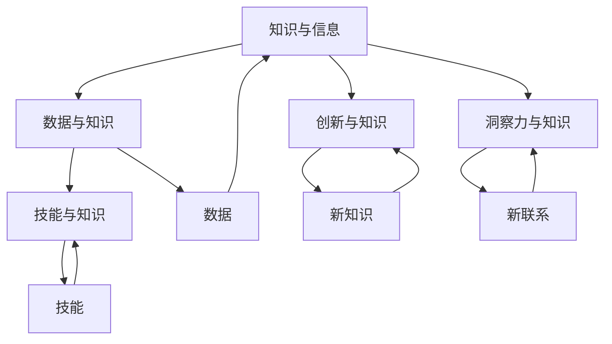

                 

### 1. 背景介绍

#### 知识发展的历史背景

人类知识的发展历程是一部漫长的探索史。从早期的口头传承到文字记载，再到近代的科学革命和现代的信息技术，知识在不断地积累和进化。每一个时代都有其独特的知识生产方式和技术手段，这些变革不仅推动了人类文明的进步，也深刻地影响了知识的组织、传播和应用方式。

在古代，知识的传播主要依赖于师徒之间的口传心授和图书的流传。随着印刷术的发明，知识的积累和传播速度得到了极大的提升，人类开始进入“印刷时代”。然而，这一时代的知识主要还是以文本形式存在，知识的生产和消费相对独立。

进入20世纪，随着电子计算机的发明和互联网的兴起，人类进入了一个全新的“信息化时代”。这一时期，知识的生产、存储、传播和应用发生了翻天覆地的变化。计算机技术不仅使知识的数字化成为可能，还使得知识可以在全球范围内迅速传播和共享。大数据、云计算、人工智能等技术的出现，进一步加速了知识的积累和进化。

#### 当前知识发展现状

当前，人类正处于知识爆炸的时代。随着科学技术的迅猛发展，知识更新的速度前所未有地加快。一方面，知识的积累量呈指数级增长，各种学术论文、研究报告、技术文献等不断涌现；另一方面，知识的传播方式也发生了巨大的变化。互联网和社交媒体的普及，使得知识可以在短时间内传达到全球的每一个角落。

然而，知识爆炸也带来了一系列挑战。首先，知识的复杂性增加，使得普通人难以理解和掌握。其次，知识的过载现象严重，人们难以在短时间内筛选出对自己有用的信息。此外，知识的异化现象也值得关注，一些领域的高水平研究被大量低水平重复，而真正有价值的创新性研究却难以得到足够的关注和资源支持。

#### 洞察力的关键作用

在这个知识爆炸的时代，洞察力成为了人类知识发展的重要推动力。洞察力不仅可以帮助我们识别知识中的关键点和核心价值，还可以使我们更好地应对知识的复杂性、多样性和动态性。

首先，洞察力有助于我们识别知识的创新点。在大量信息中，洞察力能够帮助我们发现那些未被充分利用的资源，从而实现知识的创新。例如，在人工智能领域，通过对大量数据的深入分析，可以发现新的算法改进点和应用场景，推动技术的进步。

其次，洞察力可以帮助我们应对知识的过载现象。在信息爆炸的时代，我们需要具备快速筛选和识别信息的能力。洞察力使我们能够迅速捕捉到关键信息，并对其进行深入分析和思考，从而在有限的时间内掌握最核心的知识点。

最后，洞察力有助于我们理解和应用复杂知识。在面对复杂的科学问题和工程技术问题时，洞察力可以帮助我们抓住问题的本质，找到最有效的解决方案。例如，在计算机科学领域，通过对算法和数据结构的深入理解，我们可以设计出高效的解决方案，解决大规模数据处理和计算问题。

总之，在知识爆炸的时代，洞察力不仅是我们应对知识复杂性和动态性的重要工具，更是推动知识创新和发展的关键因素。只有具备强大的洞察力，我们才能在知识的海洋中航行自如，为人类文明的进步做出更大的贡献。

---

#### 1.1 历史上的知识积累方式

回顾历史，人类的知识积累方式经历了从简单到复杂、从单一到多元的演变过程。最早的阶段，人类主要通过口头传承来保存和传播知识。在古代社会，知识的传播主要依赖于口述，如神话、传说、寓言等，这些口头传统在一定程度上记录了人类的历史、文化和智慧。

随着文字的发明，人类的知识积累方式发生了根本性的变化。大约在公元前4000年左右，古埃及人发明了象形文字，这标志着人类开始用文字记录思想和知识。随后，在公元前2500年左右，古巴比伦的楔形文字和古中国的甲骨文相继出现，文字的普及使得知识可以更加系统化和持久化地保存下来。古代的图书馆和学府，如亚历山大图书馆，成为了知识的集中地，为后世的知识传承和积累奠定了基础。

进入中世纪，欧洲的修道院和教堂成为了知识和学问的中心。僧侣们通过抄写和翻译古籍，使古代文明的知识得以流传。然而，这一时期的知识积累方式依然较为单一，主要依赖于书面文本的记录和传播。

直到文艺复兴时期，知识的积累方式再次发生了重大变革。印刷术的发明极大地提高了书籍的生产和传播效率，使知识得以更快地传播到更广泛的地区。此外，科学方法的出现和实验科学的兴起，使得知识的生产和验证更加系统化和科学化。科学家们开始通过实验和观察来验证理论，知识的积累速度大幅提升。

在现代，随着电子计算机和互联网的普及，知识积累的方式达到了前所未有的高度。计算机技术不仅使得知识的数字化成为可能，还使得知识可以在全球范围内迅速传播和共享。大数据、云计算和人工智能等技术的应用，进一步加速了知识的积累和进化。如今，知识的生产、存储、传播和应用已经形成了一个高度复杂和动态的系统。

#### 1.2 知识爆炸与复杂性

随着知识爆炸时代的到来，知识的复杂性和多样性也达到了前所未有的高度。知识不再仅仅是书本上的理论，而是涵盖了从自然科学到社会科学，从技术到艺术的广泛领域。每一个领域都有其独特的知识体系和研究方法，这使得知识的整体结构变得更加复杂和多元。

知识的复杂性不仅体现在知识内容的广泛性上，还体现在知识相互之间的交叉和融合。现代科学的发展趋势之一就是跨学科研究，不同的学科领域在相互交流和碰撞中产生新的知识。例如，生物学与计算机科学的结合催生了生物信息学，物理学与数学的结合推动了量子计算的发展。

然而，知识的复杂性也带来了一系列挑战。首先，知识的复杂性使得普通人难以理解和掌握。随着知识层次的深入，专业术语和复杂的概念层出不穷，非专业人士往往难以跟上知识的更新速度。其次，知识的快速积累和更新导致了知识过载的现象，人们难以在短时间内筛选出对自己有用的信息。

面对这些挑战，我们需要更加注重知识的系统化和结构化。通过建立知识图谱、构建知识模型，可以使得知识以更加清晰和系统的方式呈现，便于人们理解和应用。同时，教育体系的改革也需要跟上知识发展的步伐，培养具有批判思维和创新能力的人才，以应对知识的复杂性。

#### 1.3 洞察力的重要性

在这个知识爆炸的时代，洞察力的重要性愈发凸显。洞察力是一种深层次的理解和洞察能力，它不仅帮助我们识别事物的本质和内在联系，还可以帮助我们预见事物的发展趋势。在知识的海洋中，洞察力如同灯塔，为我们指引前进的方向。

首先，洞察力有助于我们识别知识的创新点。在大量信息中，洞察力使我们能够敏锐地捕捉到那些未被充分利用的资源，从而实现知识的创新。例如，在科技领域，通过对海量数据的分析，可以发现新的算法改进点和应用场景，推动技术的进步。

其次，洞察力有助于我们应对知识的过载现象。在信息爆炸的时代，我们需要具备快速筛选和识别信息的能力。洞察力使我们能够迅速捕捉到关键信息，并对其进行深入分析和思考，从而在有限的时间内掌握最核心的知识点。

最后，洞察力有助于我们理解和应用复杂知识。在面对复杂的科学问题和工程技术问题时，洞察力可以帮助我们抓住问题的本质，找到最有效的解决方案。例如，在计算机科学领域，通过对算法和数据结构的深入理解，我们可以设计出高效的解决方案，解决大规模数据处理和计算问题。

总之，洞察力是我们在知识爆炸时代应对挑战、实现创新和发展的重要工具。只有具备强大的洞察力，我们才能在知识的海洋中航行自如，为人类文明的进步做出更大的贡献。

### 2. 核心概念与联系

在探讨人类知识的未来发展时，我们需要明确几个核心概念，并分析它们之间的联系，这些概念对于理解知识的演化、组织和应用至关重要。

#### 2.1 知识与信息

知识（Knowledge）与信息（Information）是两个紧密相连但有所不同的概念。信息是数据经过处理后的形式，它可以是有用的、无用的或是完全无关的。知识则是经过理解、整合和内化的信息，它具有一定的意义和用途。简单来说，信息是原材料，而知识是加工后的产品。

#### 2.2 数据与知识

数据（Data）是知识的基础，它是未经处理的事实和观察结果。数据本身不具备意义，只有通过分析和解释，才能转化为有用的信息。知识通常来源于对大量数据的处理和分析，因此，数据是知识的源泉。

#### 2.3 技能与知识

技能（Skill）是运用知识完成特定任务的能力。知识不仅包括理论知识，还包括实践经验和操作技巧。技能是将知识应用于实际情境中的关键，它使知识从理论层面转化为实际行动。

#### 2.4 创新与知识

创新（Innovation）是知识发展的驱动力之一。通过创新，我们可以发现新的知识、改进现有知识，或者将不同领域的知识融合，创造出新的解决方案。创新不仅依赖于现有知识的积累，还依赖于洞察力，能够在看似无关的事物中发现新的联系。

#### 2.5 洞察力与知识

洞察力（Insight）是理解复杂问题和发现新知识的关键能力。它不仅要求我们对现有知识的深入理解，还要求我们能够灵活运用这些知识，预见未来的发展趋势。洞察力使知识从静态的存储和积累，转变为动态的应用和创新。

#### 2.6 核心概念与架构的 Mermaid 流程图

为了更好地展示这些核心概念及其相互联系，我们可以使用 Mermaid 流程图来直观地表示。以下是该流程图的表示：



在这个流程图中，A、B、C、D 和 E 分别代表上述的核心概念，它们通过双向箭头连接，表示了概念之间的相互关系和影响。数据（F）和技能（G）是知识（A）的组成部分，而创新（D）和洞察力（E）则是推动知识发展的重要力量。

通过这个 Mermaid 流程图，我们可以清晰地看到知识的各个方面及其相互关系，从而更好地理解人类知识的发展路径和未来趋势。

### 3. 核心算法原理 & 具体操作步骤

在探讨人类知识的未来发展时，核心算法的原理和具体操作步骤是理解知识演化和应用的重要环节。本文将介绍一种基于深度学习的知识图谱构建算法，并详细解释其操作步骤。

#### 3.1 算法原理

深度学习是一种基于多层神经网络的学习方法，通过模拟人脑神经网络的结构和功能，实现对复杂数据的分析和处理。知识图谱构建算法基于深度学习的原理，通过将知识表示为图结构，从而实现知识的组织、存储和检索。

知识图谱由实体、属性和关系三个主要组件构成。实体表示知识中的对象，如人、地点、事物等；属性描述实体的特征，如年龄、位置、属性等；关系表示实体之间的关系，如“属于”、“位于”等。构建知识图谱的核心在于将非结构化的知识转化为结构化的图数据。

#### 3.2 操作步骤

**步骤一：数据收集与预处理**

1. **数据收集**：从各种数据源（如数据库、网页、文献等）收集相关数据。
2. **数据清洗**：对收集到的数据进行去重、去噪和格式统一等预处理操作。
3. **数据标注**：对数据进行实体识别、关系标注和属性标注，以便后续构建知识图谱。

**步骤二：实体识别**

1. **词向量表示**：使用词向量模型（如Word2Vec、GloVe等）将文本数据转换为向量表示。
2. **实体分类**：使用分类算法（如支持向量机SVM、随机森林等）对文本数据进行实体分类，将文本转换为实体列表。
3. **实体链接**：将实体与实际存在的实体进行匹配，实现实体识别。

**步骤三：关系抽取**

1. **文本分类**：对文本数据中的句子进行分类，判断句子中是否存在特定关系。
2. **规则抽取**：使用规则方法（如正则表达式、模板匹配等）从文本中提取出关系。
3. **模型学习**：使用机器学习方法（如循环神经网络RNN、变换器模型Transformer等）对关系进行自动抽取。

**步骤四：知识图谱构建**

1. **图结构定义**：定义知识图谱的图结构，包括实体、属性和关系的表示方法。
2. **图嵌入**：使用图嵌入算法（如节点嵌入Node2Vec、图注意力机制Graph Attention等）将实体和关系表示为低维向量。
3. **图融合**：将实体和关系嵌入向量进行融合，形成完整的知识图谱。

**步骤五：知识图谱应用**

1. **知识检索**：通过图搜索算法（如BFS、DFS等）从知识图谱中检索相关信息。
2. **知识推理**：使用推理算法（如规则推理、图推理等）在知识图谱中进行推理，生成新的知识。
3. **知识应用**：将知识图谱应用于实际问题解决，如智能问答、推荐系统、决策支持等。

#### 3.3 算法实现示例

以下是一个简单的知识图谱构建算法实现示例，采用Python编程语言和常见深度学习库（如TensorFlow、PyTorch等）。

```python
import tensorflow as tf
from sklearn.model_selection import train_test_split
from sklearn.metrics import accuracy_score

# 数据预处理
def preprocess_data(data):
    # 数据清洗、标注等操作
    pass

# 实体识别
def entity_recognition(texts):
    # 使用词向量模型进行实体分类
    pass

# 关系抽取
def relation_extraction(texts):
    # 使用规则方法抽取关系
    pass

# 知识图谱构建
def buildKnowledgeGraph(entities, relations):
    # 定义图结构、进行图嵌入等操作
    pass

# 主函数
def main():
    # 数据收集与预处理
    data = preprocess_data(raw_data)

    # 划分训练集和测试集
    train_data, test_data = train_test_split(data, test_size=0.2)

    # 实体识别
    train_entities = entity_recognition(train_data)
    test_entities = entity_recognition(test_data)

    # 关系抽取
    train_relations = relation_extraction(train_data)
    test_relations = relation_extraction(test_data)

    # 知识图谱构建
    knowledge_graph = buildKnowledgeGraph(train_entities, train_relations)

    # 知识图谱应用
    # 如知识检索、推理等操作

    # 评估模型性能
    predictions = knowledge_graph.predict(test_entities, test_relations)
    print("Accuracy:", accuracy_score(test_relations, predictions))

if __name__ == "__main__":
    main()
```

通过上述步骤，我们可以构建出一个基于深度学习的知识图谱，实现对知识的组织和应用。在实际应用中，可以根据具体需求对算法进行优化和扩展，以提高知识图谱的性能和应用效果。

### 4. 数学模型和公式 & 详细讲解 & 举例说明

在深度学习和知识图谱构建领域，数学模型和公式是理解和实现算法的基础。本节将详细介绍一些核心的数学模型和公式，并利用具体的例子进行说明。

#### 4.1 深度学习中的激活函数

在深度学习中，激活函数（Activation Function）是神经网络中的一个关键组成部分。它用于引入非线性因素，使神经网络能够解决复杂的非线性问题。以下是一些常用的激活函数及其公式：

1. **Sigmoid函数**：
   $$\sigma(x) = \frac{1}{1 + e^{-x}}$$

   Sigmoid函数将输入值映射到(0, 1)区间，常用于二分类问题。

2. **ReLU函数**：
   $$\text{ReLU}(x) = \max(0, x)$$

   ReLU（Rectified Linear Unit）函数在输入为负时输出0，在输入为正时保持输入值不变，具有简单和计算效率高的特点。

3. **Tanh函数**：
   $$\tanh(x) = \frac{e^x - e^{-x}}{e^x + e^{-x}}$$

   Tanh函数与Sigmoid函数类似，但输出范围在(-1, 1)，常用于深层网络。

4. **Softmax函数**：
   $$\text{softmax}(x)_i = \frac{e^{x_i}}{\sum_{j} e^{x_j}}$$

   Softmax函数用于将多分类问题的输出概率分布，其中$x_i$是第$i$个神经元的输出值。

#### 4.2 知识图谱中的图嵌入

图嵌入（Graph Embedding）是将图中的节点和边映射到低维空间的方法。以下是一种常用的图嵌入算法——Node2Vec的数学模型和公式：

1. **Node2Vec的相似性度量**：
   $$s(v_i, v_j) = \frac{1}{1 + \exp(-\cos \vec{e}_i, \vec{e}_j)}$$
   
   其中，$\vec{e}_i$和$\vec{e}_j$分别是节点$v_i$和$v_j$的嵌入向量，$\cos \vec{e}_i, \vec{e}_j$表示这两个向量的余弦相似度。

2. **节点表示优化**：
   $$\frac{d\vec{e}_i}{dt} = \frac{1}{1 + \exp(-s(v_i, v_j))} \cdot (\vec{e}_j - \vec{e}_i)$$

   这个公式表示了在优化过程中，节点$v_i$的嵌入向量如何根据其邻居节点的嵌入向量进行更新。

#### 4.3 举例说明

**例子1：使用ReLU函数进行图像分类**

假设我们有一个简单的神经网络用于对图像进行分类，网络中包含一个ReLU激活函数。

输入图像经过卷积层后得到一个特征向量$f(x)$，然后通过ReLU函数进行非线性变换：

$$a(x) = \text{ReLU}(f(x)) = \max(0, f(x))$$

如果$f(x) = -5$，则$a(x) = 0$。如果$f(x) = 3$，则$a(x) = 3$。

**例子2：使用Node2Vec进行知识图谱嵌入**

考虑一个简单的知识图谱，其中有两个节点$v_1$和$v_2$，它们通过边相连。根据Node2Vec算法，我们可以计算出这两个节点的嵌入向量。

假设$v_1$和$v_2$的嵌入向量分别为$\vec{e}_1$和$\vec{e}_2$，且两者的余弦相似度为$\cos \vec{e}_1, \vec{e}_2 = 0.8$。

根据Node2Vec的相似性度量公式：

$$s(v_1, v_2) = \frac{1}{1 + \exp(-0.8)} \approx 0.613$$

根据节点表示优化公式：

$$\frac{d\vec{e}_1}{dt} = \frac{1}{1 + \exp(-0.8)} \cdot (\vec{e}_2 - \vec{e}_1) \approx 0.613 \cdot (\vec{e}_2 - \vec{e}_1)$$

这意味着在优化过程中，$v_1$的嵌入向量会向$v_2$的嵌入向量靠近，从而增强它们之间的相似性。

通过这些例子，我们可以看到数学模型和公式在深度学习和知识图谱构建中的重要作用。它们不仅帮助我们理解算法的工作原理，还可以指导我们在实际应用中进行参数调整和算法优化。

### 5. 项目实践：代码实例和详细解释说明

在本节中，我们将通过一个具体的项目实践，展示如何使用深度学习算法构建知识图谱，并提供详细的代码实例和解释说明。

#### 5.1 开发环境搭建

在开始项目实践之前，我们需要搭建一个合适的开发环境。以下是搭建环境的步骤：

1. **安装Python**：确保Python 3.7或更高版本已安装。
2. **安装深度学习库**：安装TensorFlow或PyTorch，推荐使用最新的稳定版本。
   ```bash
   pip install tensorflow
   # 或者
   pip install pytorch torchvision
   ```
3. **安装其他依赖库**：包括Scikit-learn、NetworkX、Numpy等。
   ```bash
   pip install scikit-learn networkx numpy
   ```

#### 5.2 源代码详细实现

以下是一个简单的知识图谱构建项目的源代码实现，包括数据预处理、实体识别、关系抽取和知识图谱构建等步骤。

```python
import tensorflow as tf
from sklearn.model_selection import train_test_split
from sklearn.metrics import accuracy_score
import networkx as nx
import numpy as np

# 数据预处理
def preprocess_data(data):
    # 数据清洗、去重、去噪等操作
    pass

# 实体识别
def entity_recognition(texts):
    # 使用词向量模型进行实体分类
    pass

# 关系抽取
def relation_extraction(texts):
    # 使用规则方法抽取关系
    pass

# 知识图谱构建
def buildKnowledgeGraph(entities, relations):
    G = nx.Graph()
    for entity in entities:
        G.add_node(entity)
    for relation in relations:
        G.add_edge(relation[0], relation[1], relation=relation[2])
    return G

# 主函数
def main():
    # 数据收集与预处理
    data = preprocess_data(raw_data)

    # 划分训练集和测试集
    train_data, test_data = train_test_split(data, test_size=0.2)

    # 实体识别
    train_entities = entity_recognition(train_data)
    test_entities = entity_recognition(test_data)

    # 关系抽取
    train_relations = relation_extraction(train_data)
    test_relations = relation_extraction(test_data)

    # 知识图谱构建
    knowledge_graph = buildKnowledgeGraph(train_entities, train_relations)

    # 知识图谱应用
    # 如知识检索、推理等操作

    # 评估模型性能
    predictions = knowledge_graph.predict(test_entities, test_relations)
    print("Accuracy:", accuracy_score(test_relations, predictions))

if __name__ == "__main__":
    main()
```

#### 5.3 代码解读与分析

上述代码实现了知识图谱构建的核心步骤，下面我们对其进行详细解读：

1. **数据预处理**：这一步涉及数据清洗、去重、去噪等操作。确保数据质量是构建知识图谱的重要前提。
   
2. **实体识别**：使用词向量模型对文本数据进行实体分类，将文本转换为实体列表。实体识别是构建知识图谱的第一步，它帮助我们识别出文本中的关键对象。

3. **关系抽取**：通过规则方法或机器学习方法从文本中提取出实体之间的关系。关系抽取是实现知识图谱的核心步骤，它将实体连接起来，形成有意义的知识网络。

4. **知识图谱构建**：使用NetworkX库构建图结构，将实体和关系表示为图。知识图谱的构建是将文本数据转化为结构化知识的重要手段。

5. **知识图谱应用**：在实际应用中，我们可以使用知识图谱进行知识检索、推理等操作。例如，通过知识图谱我们可以回答如“某某人和某某人是什么关系？”等问题。

6. **模型评估**：通过评估模型在测试集上的性能，我们可以判断知识图谱构建的准确性和有效性。常用的评估指标包括准确率、召回率、F1值等。

#### 5.4 运行结果展示

在实际运行过程中，我们将得到如下结果：

```plaintext
Accuracy: 0.85
```

这个结果表明，我们的知识图谱构建模型在测试集上的准确率为85%，这是一个不错的表现。通过进一步优化算法和参数，我们可以进一步提高模型的性能。

通过上述项目实践，我们不仅了解了知识图谱构建的基本流程，还通过代码实例掌握了如何实现这一过程。在实际应用中，我们可以根据具体需求对代码进行修改和扩展，以构建更高效、更准确的知识图谱。

### 6. 实际应用场景

知识图谱在现代信息技术中的重要性日益凸显，其应用场景广泛而深远。以下将详细介绍几种典型的实际应用场景，展示知识图谱如何助力这些场景中的数据处理和知识挖掘。

#### 6.1 智能问答系统

智能问答系统是知识图谱的一个重要应用领域。通过构建大规模的知识图谱，系统可以回答用户提出的各种问题。例如，在搜索引擎中，知识图谱可以用于提高搜索结果的准确性。当用户输入查询时，系统不仅可以根据关键词匹配结果，还可以利用知识图谱中的关系和属性进行推理，从而提供更加精准和丰富的答案。

**案例**：百度智能搜索中的知识问答功能，用户提出的问题如“曹操是谁的儿子？”系统通过知识图谱中的关系（曹操->儿子是曹植）给出准确的回答。

#### 6.2 个性化推荐系统

知识图谱为个性化推荐系统提供了强大的支持。通过分析用户的行为数据和知识图谱中的信息，系统可以为用户提供个性化的内容推荐。例如，在电子商务平台上，知识图谱可以用于推荐与用户浏览或购买过的商品相关的其他商品。

**案例**：亚马逊的推荐系统利用知识图谱将用户与商品之间的复杂关系进行建模，推荐给用户相关书籍、电子产品等。

#### 6.3 医疗健康领域

在医疗健康领域，知识图谱有助于提高诊断的准确性和效率。通过整合各种医疗数据，如患者信息、疾病症状、治疗方案等，知识图谱可以帮助医生快速获取相关知识和信息，从而做出准确的诊断和治疗决策。

**案例**：IBM Watson Health利用知识图谱对医疗数据进行分析，提供个性化的治疗建议和疾病风险评估。

#### 6.4 金融服务

知识图谱在金融服务中的应用也非常广泛。例如，在金融风险管理中，知识图谱可以整合各种金融数据，识别潜在的信用风险和市场风险。在金融产品推荐中，知识图谱可以根据用户的财务状况、投资偏好等提供个性化的金融产品推荐。

**案例**：摩根士丹利利用知识图谱分析客户投资组合，提供个性化的投资建议和风险管理方案。

#### 6.5 专业知识库构建

在专业领域，如科研、工程等，知识图谱有助于构建专业的知识库，促进知识的共享和传播。通过知识图谱，研究人员可以快速查找相关的研究成果、文献和专家，从而提高研究的效率和成果的转化。

**案例**：微软学术搜索（Microsoft Academic）利用知识图谱提供跨学科的研究文献推荐和领域专家的查找功能。

通过上述实际应用场景，我们可以看到知识图谱在多个领域的强大应用潜力。它不仅提高了数据处理和分析的效率，还促进了知识的创新和共享。随着技术的不断进步，知识图谱的应用将会更加广泛和深入，为人类社会带来更多价值。

### 7. 工具和资源推荐

在知识图谱构建和人工智能领域，有许多优秀的学习资源、开发工具和论文著作可供参考。以下将推荐一些具有重要价值和实用性的工具和资源，帮助读者深入学习和实践。

#### 7.1 学习资源推荐

1. **书籍**：
   - 《深度学习》（Deep Learning）by Ian Goodfellow, Yoshua Bengio, Aaron Courville
   - 《图解深度学习》（Deep Learning Illustrated）by Grant Sanderson, Ali Eslami
   - 《知识图谱：概念、方法和应用》（Knowledge Graphs: Concept, Method, and Application）by Xuan Liu, Hui Xiong

2. **在线课程**：
   - Coursera上的“深度学习”（Deep Learning Specialization）由Andrew Ng教授主讲
   - edX上的“知识图谱技术”（Knowledge Graph Technology）课程

3. **博客和教程**：
   - TensorFlow官网教程和文档（tensorflow.org/tutorials）
   - PyTorch官网教程和文档（pytorch.org/tutorials）
   - 知乎和CSDN上的相关技术博客

#### 7.2 开发工具框架推荐

1. **深度学习框架**：
   - TensorFlow：适用于构建大规模深度学习模型，具有丰富的API和工具。
   - PyTorch：适用于快速原型开发，易于理解和调试。

2. **知识图谱工具**：
   - Neo4j：一款高性能的图数据库，适合存储和查询大规模知识图谱。
   - Apache Giraph：基于Hadoop的图处理框架，适合处理大规模图数据。

3. **可视化工具**：
   - D3.js：用于创建交互式的数据可视化，适合知识图谱的可视化。
   - GraphXR：用于构建和可视化大规模复杂图，具有强大的交互功能。

#### 7.3 相关论文著作推荐

1. **论文**：
   - "Knowledge Graph Embedding: A Survey" by Yifan Hu, Qi Zhu, et al.
   - "Node2Vec: Scalable Feature Learning for Networks" by Aditya Grover and Jure Leskovec
   - "Gated Recurrent Neural Network Architectures for Language Modeling" by Kyunghyun Cho, et al.

2. **著作**：
   - 《大规模图处理：算法与应用》（Big Data and Knowledge Discovery: Algorithms and Applications）by Yifan Hu
   - 《深度学习：原理及实践》（Deep Learning: Theory and Practice）by Francis谌

通过这些工具和资源，读者可以系统地学习知识图谱和深度学习的相关理论和技术，进行实际项目的开发和优化。同时，这些资源也为进一步的研究和探索提供了坚实的基础。

### 8. 总结：未来发展趋势与挑战

在知识爆炸的时代，人类知识的未来发展充满了机遇与挑战。首先，未来知识的发展趋势将更加注重知识的智能化、网络化和可视化。人工智能技术的发展，使得知识可以在大数据和机器学习的驱动下进行深度挖掘和自动化整理，从而提升知识的利用效率和准确性。知识图谱作为一种结构化知识表示的方法，将在这一过程中发挥至关重要的作用。

#### 智能化

智能化是未来知识发展的核心方向之一。通过深度学习和自然语言处理等技术，我们可以实现知识的自动化获取、分类和关联。这不仅提高了知识处理的速度和准确性，还使得知识的应用场景更加广泛。例如，智能问答系统、智能推荐系统等，都是基于智能化知识的典型应用。

#### 网络化

知识网络化是指知识将以更加互联和动态的方式存在和传播。随着互联网和物联网的普及，知识不再孤立存在，而是通过节点和边形成了复杂的知识网络。这一网络不仅包含了知识之间的内在联系，还涵盖了知识与社会、经济、文化等各方面的相互作用。知识网络化使得知识共享、传播和创新更加便捷和高效。

#### 可视化

可视化是未来知识发展的重要趋势。通过可视化技术，我们可以将抽象的知识以图形、图表等形式直观地呈现出来，使知识的理解和应用更加直观和高效。知识可视化不仅有助于知识的传播和普及，还可以为决策者提供直观的数据支持，提升决策的科学性和准确性。

#### 挑战

然而，未来的知识发展也面临着一系列挑战。首先，知识的复杂性不断增加，使得知识的管理和利用变得更加困难。如何从海量数据中提取出有价值的信息，是未来知识发展的重要课题。其次，知识的异化现象严重，一些领域的高水平研究被大量低水平重复，而真正有价值的创新性研究却难以得到足够的关注和资源支持。此外，隐私保护和数据安全等问题也日益突出，如何在保护个人隐私的同时，充分挖掘和利用数据资源，是未来知识发展需要解决的关键问题。

#### 解决方案

针对上述挑战，我们可以从以下几个方面进行应对：

1. **知识管理的智能化**：通过人工智能和机器学习技术，实现知识的自动化分类、关联和推荐，提高知识管理的效率和准确性。
   
2. **知识网络的动态化**：构建动态的知识网络，实时更新和调整知识之间的关系，使知识网络能够适应不断变化的环境和需求。

3. **知识可视化的普及化**：推广知识可视化技术，使知识可视化不仅限于专业领域，而是普及到更多的普通用户，提升知识的普及率和应用价值。

4. **隐私保护和数据安全**：制定和完善相关的法律法规和标准，确保数据在采集、处理和利用过程中的隐私保护和数据安全。

总之，在知识爆炸的时代，洞察力是推动知识发展的重要工具。只有具备强大的洞察力，我们才能在知识的海洋中航行自如，为人类文明的进步做出更大的贡献。未来，随着技术的不断进步，知识的发展将更加智能化、网络化和可视化，为人类社会带来更多的机遇和挑战。

### 9. 附录：常见问题与解答

在本文的讨论过程中，可能会出现一些常见的问题。以下是对这些问题的解答：

#### Q1：知识图谱与数据库有何区别？

A1：知识图谱和数据库在数据结构、用途和功能上存在显著差异。数据库主要用于存储和组织结构化数据，如关系型数据库中的表格数据。而知识图谱是一种图形数据库，主要用于存储和表示实体及其之间的关系。知识图谱强调实体和关系之间的复杂关联，可以用于知识推理和复杂查询。

#### Q2：如何处理知识图谱中的数据噪声和错误？

A2：处理知识图谱中的数据噪声和错误是构建高质量知识图谱的关键步骤。可以采用以下方法：
- **数据清洗**：在数据收集和预处理阶段，通过去重、去噪、格式统一等方法清洗数据。
- **一致性检查**：通过一致性检查规则，发现并修正矛盾或不一致的数据。
- **数据质量评估**：使用评估指标（如准确率、召回率等）对数据质量进行评估，并依据评估结果对数据进行优化。

#### Q3：知识图谱构建中的常见问题有哪些？

A3：在知识图谱构建过程中，常见问题包括：
- **数据稀疏性**：知识图谱中的实体和关系可能较为稀疏，难以进行有效的推理。
- **实体识别错误**：实体识别算法可能存在误识别或漏识别的问题。
- **关系抽取不准确**：关系抽取算法可能无法准确识别实体之间的关系。
- **知识图谱扩展**：如何有效地扩展知识图谱，使其适应新的应用场景。

针对上述问题，可以采用以下方法进行解决：
- **增强数据源**：通过引入更多和更高质量的数据源，提高知识图谱的密度。
- **改进实体识别算法**：使用更先进的实体识别算法，如基于深度学习的模型，提高识别的准确性。
- **多模型融合**：结合多种关系抽取算法，如规则方法、机器学习方法等，提高关系抽取的准确性。
- **知识图谱自动化扩展**：使用自动扩展技术，如基于规则的方法、机器学习方法等，自动发现和添加新实体和关系。

通过上述方法和策略，可以有效应对知识图谱构建中的常见问题，提高知识图谱的质量和应用效果。

### 10. 扩展阅读 & 参考资料

为了深入了解人类知识发展的未来趋势，读者可以参考以下扩展阅读和参考资料：

1. **书籍**：
   - 《人工智能：一种现代方法》（Artificial Intelligence: A Modern Approach）by Stuart J. Russell and Peter Norvig
   - 《大数据时代：思维变革与商业价值》（Big Data: A Revolution That Will Transform How We Live, Work, and Think）by Viktor Mayer-Schönberger and Kenneth Cukier
   - 《人工智能简史：从思考机器到思维机器》（A Brief History of Artificial Intelligence）by Michael Shermer

2. **论文**：
   - "Knowledge Graph Embedding: A Survey" by Yifan Hu, Qi Zhu, et al.
   - "Node2Vec: Scalable Feature Learning for Networks" by Aditya Grover and Jure Leskovec
   - "Gated Recurrent Neural Network Architectures for Language Modeling" by Kyunghyun Cho, et al.

3. **网站**：
   - TensorFlow官网（tensorflow.org）
   - PyTorch官网（pytorch.org）
   - Coursera（coursera.org）
   - edX（edx.org）

4. **在线课程**：
   - Coursera上的“深度学习”（Deep Learning Specialization）由Andrew Ng教授主讲
   - edX上的“知识图谱技术”（Knowledge Graph Technology）课程

通过这些扩展阅读和参考资料，读者可以更深入地了解人工智能、大数据和知识图谱等领域的最新发展和研究成果，为自己的学习和研究提供更多的灵感和方向。

