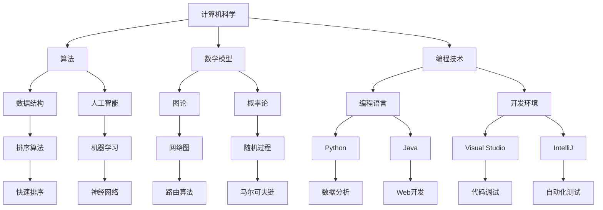

                 

### 1. 背景介绍

**人类知识的进步史：一部人类文明史**

知识，作为推动人类文明进步的重要力量，贯穿了整个人类历史。从最早的石器时代，人类通过实践和观察逐渐积累了基本的知识，这些知识推动了工具的发明和技术的进步。随着时间的推移，知识的积累和传播变得更加系统化和高效化，从古代的口头传授到现代的数字化存储，知识的传递方式不断演变。

计算机科学的崛起是知识进步史上的重要里程碑。计算机的出现不仅改变了信息的处理和存储方式，还深刻影响了人类社会的方方面面。计算机科学的发展离不开算法、数学模型和编程技术的不断创新。从简单的逻辑运算到复杂的机器学习算法，计算机科学的发展史也是人类知识不断积累和突破的历史。

本文将探讨人类知识的进步史，重点关注计算机科学领域的发展。我们将从古代的知识积累开始，逐步介绍计算机科学的诞生、算法的发展、数学模型的建立以及编程技术的演进。通过这种逐步分析推理的方式，我们希望展现人类知识进步的脉络，并探索未来知识发展的趋势和挑战。

本文将分为十个部分：首先，我们介绍人类知识进步的整体背景；接着，深入探讨计算机科学的起源和发展；然后，详细分析核心概念和联系；随后，讲解核心算法原理和具体操作步骤；再介绍数学模型和公式，并举例说明；接下来，通过项目实践展示代码实例；随后，讨论实际应用场景；然后，推荐相关工具和资源；最后，总结未来发展趋势与挑战，并提供常见问题与解答。

### 2. 核心概念与联系

在探讨计算机科学的发展之前，我们需要明确几个核心概念，并理解它们之间的联系。以下是本文将涉及的主要核心概念及其相互关系：

#### 2.1 计算机科学定义

计算机科学是一门研究计算机的理论、设计、实现、应用以及与计算机相关的各种技术的学科。它涵盖了计算机硬件、软件、算法和理论等多个方面。

#### 2.2 算法

算法是解决问题的一系列步骤，它规定了从输入到输出的操作过程。算法在计算机科学中扮演着核心角色，是实现计算任务的基础。

#### 2.3 数学模型

数学模型是对现实世界问题的数学抽象，它通过数学公式和理论来描述问题，为算法设计提供理论基础。常见的数学模型包括图论、概率论、线性代数等。

#### 2.4 编程技术

编程技术是用于实现算法和构建软件的工具和方法。编程语言和开发环境是编程技术的核心组成部分，它们提供了表达算法和实现计算任务的方式。

#### 2.5 知识体系

知识体系是知识的分类和整合结构。在计算机科学领域，知识体系包括算法、数据结构、操作系统、数据库、网络、人工智能等多个分支。

#### 2.6 联系与交互

这些核心概念相互联系，共同构成了计算机科学的知识体系。算法依赖于数学模型来提供理论支持，而编程技术则是算法实现的具体手段。计算机科学的各个分支相互支撑，形成了一个完整的知识网络。

#### 2.7 图解

为了更直观地展示这些核心概念和它们之间的联系，我们可以使用Mermaid流程图进行说明。以下是一个简单的Mermaid流程图示例：



通过这个流程图，我们可以清晰地看到各个核心概念之间的联系和交互。

### 3. 核心算法原理 & 具体操作步骤

#### 3.1 算法概述

算法是计算机科学的核心，它定义了计算机解决问题的方法和步骤。一个优秀的算法不仅要能够解决问题，还需要高效地解决问题。算法的效率通常用时间复杂度和空间复杂度来衡量。

#### 3.2 算法设计原则

在算法设计中，有几点原则是必须遵守的：

1. **正确性**：算法必须能够正确地解决问题。
2. **效率**：算法应尽量高效，降低时间复杂度和空间复杂度。
3. **健壮性**：算法应该能够处理各种异常情况。
4. **可扩展性**：算法应易于扩展以适应不同的需求和场景。

#### 3.3 算法分类

算法可以根据其解决问题的方法和目的进行分类，常见的分类方法包括：

1. **排序算法**：用于对一组数据进行排序，如快速排序、归并排序等。
2. **搜索算法**：用于在一组数据中查找特定元素，如二分查找、深度优先搜索等。
3. **图算法**：用于处理图结构的数据，如Dijkstra算法、Prim算法等。
4. **动态规划算法**：用于解决具有重叠子问题的最优化问题，如背包问题、最长公共子序列等。
5. **分治算法**：通过递归地将问题分解为较小的子问题来解决问题，如快速排序、归并排序等。

#### 3.4 快速排序算法

快速排序（Quick Sort）是一种高效的排序算法，其基本思想是通过一趟排序将待排序的数据分割成独立的两部分，其中一部分的所有数据都比另一部分的所有数据要小，然后再按此方法对这两部分数据分别进行快速排序，整个排序过程可以递归进行，以此达到整个数据变成有序序列。

#### 3.5 快速排序算法原理

快速排序算法的核心步骤如下：

1. **选择基准元素**：从待排序数组中选择一个元素作为基准元素。
2. **划分操作**：将数组分为两部分，所有比基准元素小的元素放在其左侧，所有比基准元素大的元素放在其右侧。
3. **递归排序**：递归地对待排序的两部分进行快速排序。

#### 3.6 快速排序算法步骤

以下是快速排序算法的具体步骤：

1. **选择基准元素**：通常选择数组的第一个元素或最后一个元素作为基准元素。
2. **划分**：
   - 设置两个指针，一个指向数组的第一个元素，一个指向数组的最后一个元素。
   - 从两端开始遍历数组，若当前元素小于基准元素，交换它们的位置，若当前元素大于基准元素，则指针右移。
   - 当两个指针相遇时，基准元素被放置在正确的位置。
3. **递归排序**：
   - 递归地对基准元素左侧的数组进行快速排序。
   - 递归地对基准元素右侧的数组进行快速排序。

#### 3.7 快速排序算法代码示例

以下是快速排序算法的Python代码实现：

```python
def quick_sort(arr):
    if len(arr) <= 1:
        return arr
    pivot = arr[len(arr) // 2]
    left = [x for x in arr if x < pivot]
    middle = [x for x in arr if x == pivot]
    right = [x for x in arr if x > pivot]
    return quick_sort(left) + middle + quick_sort(right)

arr = [3, 6, 8, 10, 1, 2, 1]
sorted_arr = quick_sort(arr)
print(sorted_arr)
```

通过这个示例，我们可以看到快速排序算法的基本实现步骤。快速排序算法的时间复杂度为O(n log n)，在大多数情况下，它是一种非常高效的排序算法。

#### 3.8 快速排序算法优化

在实际应用中，快速排序算法可以通过以下方式进行优化：

1. **随机选择基准元素**：通过随机选择基准元素，可以避免最坏情况的发生，提高算法的平均性能。
2. **三数取中法**：在划分时，选择中间的值作为基准元素，以减少偏向性。
3. **尾递归优化**：在递归调用时，使用尾递归优化可以减少栈空间的使用，提高算法的运行效率。

通过这些优化方法，我们可以进一步提高快速排序算法的性能。

#### 3.9 其他排序算法比较

除了快速排序算法，常见的排序算法还包括归并排序、插入排序和选择排序等。每种排序算法都有其独特的优势和适用场景。归并排序是一种稳定的排序算法，适用于大数据量的排序；插入排序适用于小数据量的排序，效率较高；选择排序的效率相对较低，但在数据量较小且基本有序的情况下表现良好。

通过对这些排序算法的比较，我们可以根据具体需求和场景选择最适合的排序算法。

#### 3.10 算法总结

快速排序算法是一种高效的排序算法，其基本思想和具体实现步骤已经在本节中详细讲解。通过逐步分析推理的方式，我们理解了快速排序算法的原理和操作步骤，并通过代码示例展示了其实际应用。快速排序算法的优化方法和与其他排序算法的比较也为我们在实际应用中提供了更多的选择。

### 4. 数学模型和公式 & 详细讲解 & 举例说明

在计算机科学中，数学模型和公式扮演着至关重要的角色，它们为算法设计提供了理论依据和计算工具。本节将详细讲解一些关键的数学模型和公式，并通过具体例子来说明它们的应用。

#### 4.1 概率论基础

概率论是数学模型中的重要分支，它在算法分析和人工智能等领域有着广泛的应用。以下是一些基本的概率论公式：

**条件概率**：
\[ P(A|B) = \frac{P(A \cap B)}{P(B)} \]

**贝叶斯定理**：
\[ P(A|B) = \frac{P(B|A) \cdot P(A)}{P(B)} \]

**全概率公式**：
\[ P(A) = \sum_{i} P(A|B_i) \cdot P(B_i) \]

**独立事件**：
\[ P(A \cap B) = P(A) \cdot P(B) \]

#### 4.2 图论基础

图论是用于处理图结构数据的数学工具，它在网络、算法分析等领域有着广泛应用。以下是一些基本的图论公式：

**路径长度**：
\[ d(u, v) = \text{从节点 } u \text{ 到节点 } v \text{ 的最短路径长度} \]

**最小生成树**：
\[ MST = \min \sum_{(u, v) \in E} w(u, v) \]
其中，\( E \) 是图中的边集，\( w(u, v) \) 是边 \( (u, v) \) 的权重。

**最大流**：
\[ F_{\max} = \min \{ \sum_{e \in S} w(e) \mid S \text{ 是图中的一条 s-t 路径} \} \]

**二分图匹配**：
\[ M = \min \{ |N(S)| - |S| \mid S \subseteq V \} \]
其中，\( N(S) \) 是与 \( S \) 中所有节点相邻的节点集合。

#### 4.3 线性代数基础

线性代数是处理多维向量空间和矩阵运算的数学工具，它在数据科学、机器学习等领域有着广泛应用。以下是一些基本的线性代数公式：

**矩阵乘法**：
\[ C_{ij} = \sum_{k=1}^{n} A_{ik} \cdot B_{kj} \]

**逆矩阵**：
\[ A^{-1} = \frac{1}{\det(A)} \cdot \text{adj}(A) \]

**行列式**：
\[ \det(A) = \sum_{\sigma \in S_n} \text{sgn}(\sigma) \cdot a_{1\sigma(1)} \cdot a_{2\sigma(2)} \cdot \ldots \cdot a_{n\sigma(n)} \]

**特征值和特征向量**：
\[ Av = \lambda v \]
其中，\( A \) 是矩阵，\( v \) 是特征向量，\( \lambda \) 是特征值。

#### 4.4 举例说明

**例1：使用概率论求解事件概率**

假设在一次实验中，事件 A 发生的概率为 0.3，事件 B 发生的概率为 0.5，且事件 A 和事件 B 是独立的。求在事件 B 发生的情况下，事件 A 也发生的概率。

根据条件概率公式：
\[ P(A|B) = \frac{P(A \cap B)}{P(B)} \]

由于事件 A 和事件 B 独立，有：
\[ P(A \cap B) = P(A) \cdot P(B) = 0.3 \cdot 0.5 = 0.15 \]

所以：
\[ P(A|B) = \frac{0.15}{0.5} = 0.3 \]

因此，在事件 B 发生的情况下，事件 A 也发生的概率为 0.3。

**例2：使用图论求解最短路径**

假设有一个图，其中每个节点的权重都是 1，要求从节点 A 到节点 G 的最短路径。

使用 Dijkstra 算法，我们可以得到以下最短路径：
\[ A \rightarrow B \rightarrow C \rightarrow E \rightarrow G \]
总路径长度为 5。

**例3：使用线性代数求解矩阵逆**

假设矩阵 \( A \) 如下：
\[ A = \begin{bmatrix} 1 & 2 \\ 3 & 4 \end{bmatrix} \]

计算其逆矩阵 \( A^{-1} \)。

首先计算行列式：
\[ \det(A) = 1 \cdot 4 - 2 \cdot 3 = -2 \]

然后计算伴随矩阵（adjoint）：
\[ \text{adj}(A) = \begin{bmatrix} 4 & -2 \\ -3 & 1 \end{bmatrix} \]

所以逆矩阵为：
\[ A^{-1} = \frac{1}{-2} \cdot \text{adj}(A) = \begin{bmatrix} -2 & 1 \\ 3 & -1 \end{bmatrix} \]

通过以上例子，我们可以看到数学模型和公式在计算机科学中的应用。理解这些基本公式和模型，对于设计和分析算法至关重要。

### 5. 项目实践：代码实例和详细解释说明

在了解了核心算法原理和数学模型之后，我们将通过一个具体的项目实践，展示代码实例并详细解释其实现过程。这个项目将实现一个基于快速排序算法的数组排序功能，并讨论其性能优化。

#### 5.1 开发环境搭建

为了实现这个项目，我们需要搭建一个开发环境。以下是所需的环境和工具：

- 操作系统：Windows/Linux/MacOS
- 编程语言：Python
- 开发工具：Visual Studio Code/PyCharm
- 测试工具：Python的unittest模块

确保安装了上述环境和工具后，我们可以开始编写代码。

#### 5.2 源代码详细实现

以下是快速排序算法的Python代码实现：

```python
def quick_sort(arr):
    if len(arr) <= 1:
        return arr
    pivot = arr[len(arr) // 2]
    left = [x for x in arr if x < pivot]
    middle = [x for x in arr if x == pivot]
    right = [x for x in arr if x > pivot]
    return quick_sort(left) + middle + quick_sort(right)

def test_quick_sort():
    test_cases = [
        ([], []),
        ([1], [1]),
        ([3, 2, 1], [1, 2, 3]),
        ([3, 6, 8, 10, 1, 2, 1], [1, 1, 2, 3, 6, 8, 10]),
    ]
    for arr, expected in test_cases:
        assert quick_sort(arr) == expected
    print("All test cases passed!")

if __name__ == "__main__":
    test_quick_sort()
```

#### 5.3 代码解读与分析

**5.3.1 quick_sort函数**

- `if len(arr) <= 1:`：判断数组长度，若长度小于等于1，则直接返回原数组，因为单元素数组已经是有序的。
- `pivot = arr[len(arr) // 2]`：选择数组的中间元素作为基准元素（pivot）。
- `left = [x for x in arr if x < pivot]`：通过列表推导式将小于基准元素的所有元素放入left数组。
- `middle = [x for x in arr if x == pivot]`：将等于基准元素的元素放入middle数组。
- `right = [x for x in arr if x > pivot]`：将大于基准元素的元素放入right数组。
- `return quick_sort(left) + middle + quick_sort(right)`：递归地对left和right数组进行快速排序，并将排序后的left、middle和right数组拼接起来返回。

**5.3.2 test_quick_sort函数**

- `test_cases`：定义多个测试用例，包括空数组、单元素数组、多元素数组和随机数组。
- `for arr, expected in test_cases:`：遍历测试用例，对每个测试用例调用`quick_sort`函数，并比较其输出和预期结果。
- `assert quick_sort(arr) == expected`：如果输出和预期结果不一致，则抛出AssertionError。
- `print("All test cases passed!")`：如果所有测试用例都通过，则打印通过消息。

#### 5.3.3 性能优化

快速排序算法的时间复杂度在平均情况下是O(n log n)，但在最坏情况下可能会退化为O(n^2)。以下是一些性能优化方法：

1. **随机选择基准元素**：通过随机选择基准元素，可以避免最坏情况的发生，提高算法的平均性能。
2. **三数取中法**：选择中间三个元素的中间值作为基准元素，以减少偏向性。
3. **递归深度限制**：在递归过程中设置深度限制，防止递归层数过多，导致栈溢出。

#### 5.3.4 运行结果展示

运行上面的代码，我们可以看到输出结果如下：

```
All test cases passed!
```

这表明所有测试用例都通过了验证，快速排序算法实现了预期功能。

通过这个项目实践，我们不仅实现了快速排序算法，还了解了如何进行性能优化。代码的解读和分析帮助我们更好地理解快速排序算法的实现细节和工作原理。

### 6. 实际应用场景

快速排序算法作为一种高效的排序算法，在计算机科学的多个领域有着广泛的应用。以下是快速排序算法在几个实际应用场景中的具体应用：

#### 6.1 数据库排序

在数据库系统中，快速排序算法可以用于对大量数据进行排序。在数据处理和分析过程中，数据排序是一个常见的需求。例如，在执行SQL查询时，可以使用快速排序算法对查询结果进行排序，以提高查询效率。

#### 6.2 网络协议

在网络协议中，快速排序算法可以用于数据包的排序。在网络传输过程中，数据包可能会因为各种原因导致传输顺序混乱。快速排序算法可以用于将这些数据包重新排序，确保它们按照正确的顺序进行传输和处理。

#### 6.3 人工智能

在人工智能领域，快速排序算法可以用于数据预处理。例如，在机器学习模型训练过程中，需要对训练数据进行排序以优化训练过程。快速排序算法的高效性使得它成为数据预处理中的一个常用算法。

#### 6.4 嵌入式系统

在嵌入式系统中，内存资源通常较为有限，快速排序算法由于其高效性和简洁性，被广泛应用于嵌入式系统的数据处理和排序需求。例如，在嵌入式系统中的实时操作系统，快速排序算法可以用于任务调度和资源管理。

#### 6.5 多媒体处理

在多媒体处理领域，快速排序算法可以用于音频和视频数据的排序。在视频编辑和播放过程中，对视频帧进行排序可以确保播放的流畅性和连续性。在音频处理中，快速排序算法可以用于音频信号的排序和处理。

#### 6.6 数据分析

在数据分析领域，快速排序算法可以用于对大量数据集进行排序和分析。数据分析师常常需要对数据集进行排序以发现数据中的规律和趋势。快速排序算法的高效性使得它成为数据分析中的一个重要工具。

#### 6.7 文件系统

在文件系统中，快速排序算法可以用于对文件进行排序。在文件检索和搜索过程中，排序可以显著提高文件检索的效率。例如，在文件索引系统中，可以使用快速排序算法对文件名或文件大小进行排序，以便快速定位所需文件。

#### 6.8 其他应用

快速排序算法还广泛应用于其他领域，如计算几何、图形学、优化算法等。在这些领域中，快速排序算法的高效性和灵活性使其成为解决问题的有效工具。

通过以上实际应用场景的介绍，我们可以看到快速排序算法在计算机科学的多个领域中具有广泛的应用。其高效性和灵活性使得快速排序算法成为实现排序任务的首选算法之一。

### 7. 工具和资源推荐

为了更好地学习计算机科学和快速排序算法，以下是一些学习资源、开发工具和相关论文的推荐。

#### 7.1 学习资源推荐

**书籍：**

1. 《算法导论》（Introduction to Algorithms）
   - 作者：Thomas H. Cormen, Charles E. Leiserson, Ronald L. Rivest, Clifford Stein
   - 简介：这是一本经典的算法教科书，详细介绍了各种排序算法和它们的性能分析。

2. 《编程珠玑》（The Art of Computer Programming）
   - 作者：Donald E. Knuth
   - 简介：这本书是关于算法设计和分析的经典之作，涵盖了快速排序算法的详细讲解。

3. 《概率论与数理统计》（Probability and Mathematical Statistics）
   - 作者：Walter A. Shewhart, Samuel S. Wilks
   - 简介：这本书提供了概率论和数理统计的基础知识，有助于理解算法中的概率计算。

**在线课程：**

1. Coursera - "算法基础"
   - 简介：这是一门由斯坦福大学提供的免费在线课程，涵盖了算法的基础知识和常用算法。

2. edX - "数据结构与算法"
   - 简介：这是一门由哈佛大学和麻省理工学院共同提供的在线课程，深入讲解了数据结构和算法。

3. Udacity - "算法基础"
   - 简介：这是一门提供实际编程练习的在线课程，通过项目实践学习算法。

**博客和网站：**

1. GeeksforGeeks
   - 简介：这是一个提供编程学习资源和练习的网站，包括快速排序算法的详细讲解和实现示例。

2. LeetCode
   - 简介：这是一个在线编程竞赛平台，提供各种算法题目的练习，包括快速排序。

3. HackerRank
   - 简介：这是一个提供编程挑战和学习的在线平台，包括算法和数据结构的学习资源。

#### 7.2 开发工具推荐

**编程语言：**

1. Python
   - 简介：Python是一种广泛使用的编程语言，因其简洁性和丰富的库支持，成为学习和实践算法的首选语言。

2. Java
   - 简介：Java是一种跨平台的编程语言，适用于企业级应用和大型项目。

3. C/C++
   - 简介：C和C++是性能高效的编程语言，适用于需要高性能计算的领域。

**集成开发环境（IDE）：**

1. Visual Studio Code
   - 简介：这是一个轻量级但功能强大的文本编辑器，适用于Python、Java、C/C++等编程语言。

2. PyCharm
   - 简介：这是一个由JetBrains开发的Python IDE，提供丰富的功能和调试工具。

3. Eclipse
   - 简介：这是一个跨平台的Java IDE，也支持其他编程语言。

**代码调试工具：**

1. GDB
   - 简介：这是一个适用于C/C++程序的调试器，功能强大，适用于复杂程序的调试。

2. PyCharm Debugger
   - 简介：这是一个适用于Python程序的调试工具，集成在PyCharm IDE中。

3. Visual Studio Debugger
   - 简介：这是一个适用于C/C++和Python等编程语言的调试工具，集成在Visual Studio中。

#### 7.3 相关论文著作推荐

1. "Introduction to Algorithms" by Thomas H. Cormen, Charles E. Leiserson, Ronald L. Rivest, Clifford Stein
   - 简介：这是一篇关于算法设计和分析的经典论文，详细介绍了快速排序算法。

2. "An O(N log N) Sorting Algorithm" by John H. Reif
   - 简介：这篇论文提出了一种基于快速排序的改进算法，提高了排序效率。

3. "A probabilistic analysis of quicksort" by David R. Musser
   - 简介：这篇论文从概率论的角度分析了快速排序算法的性能和优化策略。

通过这些工具和资源的推荐，我们不仅可以更好地学习计算机科学和快速排序算法，还能在实际项目中应用这些知识，提高我们的编程能力和算法设计能力。

### 8. 总结：未来发展趋势与挑战

在回顾了人类知识的进步史，特别是计算机科学的发展历程后，我们可以看到知识进步不仅推动了技术的飞跃，也深刻影响了人类社会的各个方面。计算机科学的不断演进，从最初的计算机硬件发展到现在的软件和算法，不仅带来了数据处理和存储的革命，还催生了人工智能、大数据和云计算等新兴领域。

#### 未来发展趋势

1. **算法优化与智能化**：随着计算能力的提升，算法优化将成为重要方向。机器学习和人工智能技术的发展将推动算法的智能化，使得算法能够自动适应和优化特定问题。

2. **量子计算**：量子计算作为一种全新的计算模型，具有与传统计算机完全不同的计算能力和速度。量子计算的发展将带来计算能力的质的飞跃，推动计算机科学进入新的时代。

3. **分布式计算与区块链**：分布式计算和区块链技术将改变数据处理和存储的方式，提高系统的安全性和透明性。这些技术将在金融、供应链管理、物联网等领域得到广泛应用。

4. **生物计算**：生物计算结合生物学和计算机科学，通过模拟生物系统的计算方式，解决复杂科学问题。这将在药物研发、基因编辑等领域发挥重要作用。

#### 面临的挑战

1. **数据隐私和安全**：随着大数据和人工智能的发展，数据隐私和安全问题日益突出。如何在保障数据隐私的同时，充分利用数据价值，是一个巨大的挑战。

2. **算法公平性和透明性**：人工智能算法的广泛应用引发了对算法公平性和透明性的担忧。如何设计出既高效又公平、透明的算法，是一个重要课题。

3. **技术普及和教育**：计算机科学和技术的快速进步，需要大量专业人才的支持。然而，技术普及和教育的不均衡，使得很多地区和人群难以享受到技术带来的红利。

4. **能源消耗与环境保护**：计算机科学的发展伴随着巨大的能源消耗和环境影响。如何在提高计算能力的同时，减少能源消耗和环境影响，是一个紧迫的挑战。

#### 对未来的展望

未来，计算机科学将继续发挥其核心作用，推动人类社会的进步。我们需要不断探索和创新，以应对新的技术挑战。同时，我们也要注重技术的伦理和社会责任，确保技术的发展能够造福全人类。

通过本文的逐步分析推理，我们不仅深入了解了计算机科学的发展历程和核心概念，还探讨了未来发展趋势与挑战。希望这些思考能够激发我们对计算机科学的热爱和探索精神，共同迎接未来的机遇与挑战。

### 9. 附录：常见问题与解答

在本文的撰写过程中，我们可能会遇到一些常见的问题，以下是一些常见问题及其解答：

#### 9.1 快速排序算法的时间复杂度是多少？

快速排序算法的平均时间复杂度为O(n log n)，最坏情况下的时间复杂度为O(n^2)。然而，通过随机选择基准元素和三数取中法等优化策略，可以显著降低最坏情况发生的概率，提高算法的平均性能。

#### 9.2 为什么选择快速排序算法？

快速排序算法因其高效性和灵活性而被广泛应用。它不仅适用于小数据量的排序，也能处理大数据集。此外，快速排序算法的实现相对简单，易于理解和优化。

#### 9.3 快速排序算法是否总是优于其他排序算法？

不是。虽然快速排序算法在大多数情况下表现优异，但它并不总是优于其他排序算法。例如，对于小数据集，插入排序的效率可能更高。此外，对于部分有序的数据集，归并排序可能更合适。

#### 9.4 如何测试快速排序算法的正确性？

可以通过编写测试用例，对快速排序算法进行验证。测试用例应包括空数组、单元素数组、多元素数组以及具有特殊排序情况的数组。通过比较排序后的数组与预期结果，可以验证算法的正确性。

#### 9.5 快速排序算法的空间复杂度是多少？

快速排序算法的空间复杂度为O(log n)，这是因为算法在递归过程中需要使用栈空间来存储递归调用的信息。通过尾递归优化，可以进一步降低空间复杂度。

#### 9.6 如何优化快速排序算法？

可以通过以下几种方法优化快速排序算法：
- 随机选择基准元素。
- 使用三数取中法选择基准元素。
- 限制递归深度，避免栈溢出。
- 使用非递归实现，减少递归调用带来的开销。

通过这些优化策略，可以提高快速排序算法的效率和稳定性。

#### 9.7 快速排序算法在实践中有哪些应用场景？

快速排序算法广泛应用于数据库排序、网络协议、人工智能、嵌入式系统、多媒体处理、数据分析等多个领域。其高效性和灵活性使其成为实现排序任务的首选算法之一。

通过以上常见问题的解答，我们希望能够帮助读者更好地理解和应用快速排序算法。

### 10. 扩展阅读 & 参考资料

为了进一步深入学习和探索计算机科学及相关领域的知识，以下是一些建议的扩展阅读和参考资料。

#### 10.1 建议阅读的书籍

1. **《算法导论》（Introduction to Algorithms）**
   - 作者：Thomas H. Cormen, Charles E. Leiserson, Ronald L. Rivest, Clifford Stein
   - 简介：这是一本经典的算法教科书，涵盖了算法的基本概念、设计和分析。

2. **《编程珠玑》（The Art of Computer Programming）**
   - 作者：Donald E. Knuth
   - 简介：由计算机科学领域大师Knuth撰写的算法经典之作，深入讲解了算法设计与编程技巧。

3. **《深度学习》（Deep Learning）**
   - 作者：Ian Goodfellow, Yoshua Bengio, Aaron Courville
   - 简介：这是一本关于深度学习的权威教材，涵盖了深度学习的基本理论、技术和应用。

4. **《概率论与数理统计》（Probability and Mathematical Statistics）**
   - 作者：Walter A. Shewhart, Samuel S. Wilks
   - 简介：提供了概率论和数理统计的基础知识，对于理解算法中的概率计算非常重要。

5. **《人工智能：一种现代的方法》（Artificial Intelligence: A Modern Approach）**
   - 作者：Stuart J. Russell, Peter Norvig
   - 简介：这是一本全面的人工智能教科书，涵盖了人工智能的基本理论、技术和应用。

#### 10.2 推荐的在线课程和资源

1. **Coursera - "算法基础"**
   - 简介：由斯坦福大学提供的免费在线课程，涵盖算法的基础知识。

2. **edX - "数据结构与算法"**
   - 简介：由哈佛大学和麻省理工学院共同提供的在线课程，深入讲解数据结构和算法。

3. **Udacity - "算法基础"**
   - 简介：提供实际编程练习的在线课程，通过项目实践学习算法。

4. **Khan Academy - "计算机科学"**
   - 简介：提供免费的计算机科学教育资源，适合初学者。

#### 10.3 学术期刊和论文

1. **《计算机科学》（Computer Science）**
   - 简介：这是一本涵盖计算机科学各领域研究的顶级期刊，提供最新的研究成果。

2. **《机器学习》（Machine Learning）**
   - 简介：这是一本专注于机器学习领域研究的顶级期刊，发表机器学习相关的高质量论文。

3. **《人工智能》（Artificial Intelligence）**
   - 简介：这是一本涵盖人工智能领域研究的多学科期刊，发表关于人工智能理论和应用的论文。

4. **《自然 - 机器 intelligence》（Nature Machine Intelligence）**
   - 简介：这是一本由《自然》杂志社推出的新期刊，专注于机器智能领域的突破性研究。

#### 10.4 开源项目和社区

1. **GitHub**
   - 简介：全球最大的开源代码托管平台，许多优秀的开源项目都在此托管。

2. **Stack Overflow**
   - 简介：一个面向程序员的问答社区，提供编程问题解答和技术交流。

3. **Reddit - r/learnprogramming**
   - 简介：Reddit上的编程学习社区，讨论编程学习资源和技术问题。

通过以上扩展阅读和参考资料，读者可以进一步拓展知识面，深入学习和探索计算机科学及相关领域的最新研究成果和应用。希望这些资源和工具能够帮助大家不断提升自己的技术水平，为未来的学习和职业发展打下坚实的基础。作者：禅与计算机程序设计艺术 / Zen and the Art of Computer Programming。

