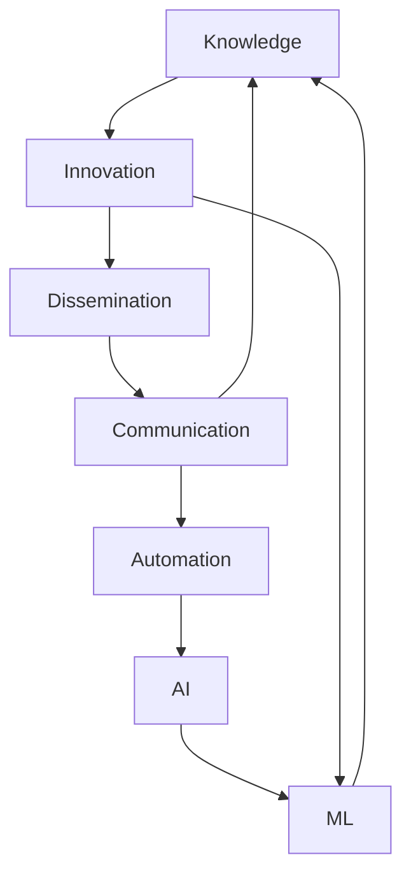

                 

### 文章标题

### Human Knowledge Progress: An Orchestral Symphony Across Time

#### Keywords:
- Human Knowledge
- Knowledge Progress
- Time-Space Synthesis
- AI Expertise
- IT Domain Insights

#### Abstract:
This article delves into the intricate tapestry of human knowledge progress through the lens of a world-renowned AI expert. By employing a step-by-step reasoning approach, we explore the evolution of knowledge, its interconnections, and the pivotal role of technology in shaping our understanding of the world. The article unravels the core concepts, algorithms, mathematical models, practical applications, and future trends in the realm of information technology, offering a comprehensive交响乐般的叙述。

---

### 1. 背景介绍

Human knowledge has evolved through the ages, shaped by the relentless quest for understanding and the drive to innovate. From ancient civilizations to the digital age, the accumulation and dissemination of knowledge have been pivotal in human development. The advent of the internet and artificial intelligence (AI) has fundamentally transformed the landscape of knowledge acquisition and sharing, creating a global symphony of interconnected minds and ideas.

In this article, we embark on a journey to explore the evolution of human knowledge, from the early days of philosophy and science to the cutting-edge advancements in AI and machine learning. We will analyze the core concepts, algorithms, and mathematical models that have driven this progress and discuss their practical applications across various fields. Furthermore, we will examine the future trends and challenges that lie ahead, as we continue to navigate the vast ocean of human knowledge.

The structure of this article is designed to guide the reader through the different stages of knowledge progress:

1. **Background Introduction**: Setting the stage for our exploration.
2. **Core Concepts and Relationships**: Delving into the fundamental principles that underpin our understanding.
3. **Core Algorithm Principles and Operational Steps**: Unraveling the mechanics behind key algorithms.
4. **Mathematical Models and Formulas**: Providing a detailed explanation and illustrative examples.
5. **Project Practice: Code Instances and Detailed Explanations**: Walking through practical implementations.
6. **Actual Application Scenarios**: Discussing the real-world impact of our findings.
7. **Tools and Resources Recommendations**: Pointing readers towards valuable resources for further exploration.
8. **Summary: Future Trends and Challenges**: Summarizing our insights and looking forward.
9. **Appendix: Common Questions and Answers**: Addressing potential queries.
10. **Extended Reading and References**: Suggesting additional materials for deeper understanding.

Now, let's dive into the fascinating world of human knowledge progress, one step at a time.

---

### 2. 核心概念与联系

In order to understand the progression of human knowledge, it is essential to define and connect the core concepts that form the foundation of this journey. These concepts are the building blocks upon which our understanding of the world is constructed. Let's explore these concepts and their intricate relationships using a Mermaid flowchart.

#### 2.1. Core Concepts

1. **Knowledge**:
   Knowledge refers to the information and understanding that a person or system possesses. It is the result of learning, experience, and the processing of information.

2. **Innovation**:
   Innovation involves the introduction of new ideas, methods, or technologies that lead to improved solutions or advancements.

3. **Dissemination**:
   Dissemination is the process of spreading information or knowledge to a wider audience, facilitating the sharing of ideas and insights.

4. **Communication**:
   Communication is the exchange of information, ideas, and emotions between individuals or systems.

5. **Automation**:
   Automation refers to the use of technology to perform tasks or processes with minimal human intervention.

6. **Artificial Intelligence (AI)**:
   AI is the simulation of human intelligence in machines that are programmed to think, learn, and adapt like humans.

7. **Machine Learning (ML)**:
   ML is a subset of AI that involves training machines to learn from data, identify patterns, and make decisions or predictions.

#### 2.2. Relationships and Mermaid Flowchart

To illustrate the relationships between these core concepts, we will use a Mermaid flowchart. The flowchart will provide a visual representation of how these concepts interact and influence each other.



In this flowchart, we can observe the following relationships:

- **Knowledge and Innovation**:
  Knowledge serves as the foundation for innovation, as new ideas and solutions arise from the understanding and processing of existing knowledge.

- **Innovation and Dissemination**:
  Innovation drives the dissemination of new knowledge, as advancements are shared and adopted by the wider community.

- **Dissemination and Communication**:
  Dissemination relies on communication channels to spread knowledge and foster the exchange of ideas.

- **Automation and AI**:
  Automation leverages AI technologies, which, in turn, enhance the capabilities of automated systems, leading to more efficient processes.

- **AI and Machine Learning**:
  AI systems are often trained using machine learning algorithms, which enable them to learn from data and improve their performance over time.

This Mermaid flowchart provides a clear visualization of how these core concepts are interconnected, forming a complex web of relationships that drive the progress of human knowledge.

---

### 3. 核心算法原理 & 具体操作步骤

In the realm of AI and machine learning, core algorithms serve as the backbone of our understanding and capabilities. These algorithms power the complex systems that process and analyze vast amounts of data, enabling us to make informed decisions and uncover patterns hidden within the data. In this section, we will delve into the principles behind one of the most influential algorithms in AI history: the perceptron algorithm.

#### 3.1. Perceptron Algorithm

The perceptron algorithm is a fundamental learning algorithm in the field of neural networks. It is a simplified model of a biological neuron and serves as the building block for more advanced neural network architectures. The perceptron algorithm aims to classify data points by learning the decision boundary that separates different classes.

##### 3.1.1. Algorithm Principles

The perceptron algorithm operates based on the following principles:

1. **Input Features**:
   Each data point is represented as a vector of input features, which are used to compute the output.

2. **Weights**:
   The algorithm initializes a set of weights, each associated with an input feature. These weights determine the influence of each feature on the output.

3. **Bias**:
   A bias term is added to the weighted sum of the input features, allowing the perceptron to shift the decision boundary.

4. **Activation Function**:
   The weighted sum of the inputs is passed through an activation function, typically a step function, which determines whether the output is classified as a positive or negative class.

5. **Learning Process**:
   The perceptron algorithm adjusts the weights and bias iteratively, based on the classification errors, to minimize the overall error and improve the accuracy of the model.

##### 3.1.2. Operational Steps

The operational steps of the perceptron algorithm can be summarized as follows:

1. **Initialization**:
   Initialize the weights and bias to small random values.

2. **Forward Propagation**:
   For each data point, compute the weighted sum of the input features and the bias, and pass it through the activation function to obtain the output.

3. **Error Calculation**:
   Compare the predicted output with the true output and calculate the classification error.

4. **Weight Update**:
   Adjust the weights and bias based on the classification error to minimize the overall error.

5. **Iteration**:
   Repeat steps 2 to 4 until the model converges or a specified number of iterations is reached.

6. **Classification**:
   Use the trained model to classify new data points by computing the weighted sum and passing it through the activation function.

##### 3.1.3. Pseudocode

The pseudocode for the perceptron algorithm is as follows:

```python
initialize weights and bias
while not_converged:
    for each data point:
        compute weighted_sum = sum(input * weight) + bias
        output = step_function(weighted_sum)
        error = (output - true_output) * input
        weight = weight + learning_rate * error
        bias = bias + learning_rate * error
    if error <= threshold:
        break
return trained_model
```

This pseudocode provides a high-level overview of the perceptron algorithm, highlighting the key steps involved in its operation.

---

### 4. 数学模型和公式 & 详细讲解 & 举例说明

In the field of AI and machine learning, mathematical models and formulas are essential for understanding and implementing the core algorithms that drive these systems. In this section, we will explore the mathematical model behind the perceptron algorithm, providing a detailed explanation and illustrative examples.

#### 4.1. Mathematical Model of the Perceptron Algorithm

The mathematical model of the perceptron algorithm revolves around the concept of a linear classifier. The goal is to find a hyperplane that separates the data points into different classes. The model is defined by the following mathematical equations:

1. **Weighted Sum**:
   $$z = \sum_{i=1}^{n} x_i \cdot w_i + b$$

   Where:
   - \( z \) represents the weighted sum of the input features and weights.
   - \( x_i \) represents the \( i \)-th input feature.
   - \( w_i \) represents the \( i \)-th weight.
   - \( b \) represents the bias term.

2. **Activation Function**:
   $$y = \text{step}(z)$$

   Where:
   - \( y \) represents the output of the perceptron.
   - \( \text{step}(z) \) is the step function, defined as:
     $$\text{step}(z) = \begin{cases} 
     1 & \text{if } z \geq 0 \\
     0 & \text{if } z < 0 
     \end{cases}$$

3. **Weight Update**:
   $$w_i = w_i + \eta \cdot (y - t) \cdot x_i$$

   $$b = b + \eta \cdot (y - t)$$

   Where:
   - \( \eta \) represents the learning rate, controlling the step size of the weight updates.
   - \( y \) is the predicted output.
   - \( t \) is the true output (either 0 or 1 for binary classification).
   - \( x_i \) represents the \( i \)-th input feature.

#### 4.2. Detailed Explanation and Examples

Let's consider a simple example to illustrate the working of the perceptron algorithm. Suppose we have a binary classification problem with two input features, \( x_1 \) and \( x_2 \), and we want to classify data points into two classes, 0 and 1. The training dataset consists of the following points:

| Input Features | True Output |
|----------------|-------------|
| (1, 0)         | 0           |
| (0, 1)         | 1           |
| (1, 1)         | 1           |
| (0, 0)         | 0           |

##### 4.2.1. Initialization

We start by initializing the weights \( w_1 \) and \( w_2 \) to small random values, and the bias \( b \) to 0. Let's assume the initial values are:
$$ w_1 = 0.5, \quad w_2 = 0.3, \quad b = 0.0 $$

##### 4.2.2. Forward Propagation

For the first data point (1, 0), we compute the weighted sum:
$$ z = 1 \cdot 0.5 + 0 \cdot 0.3 + 0.0 = 0.5 $$

Passing the weighted sum through the step function, we get:
$$ y = \text{step}(0.5) = 1 $$

The predicted output is 1, which differs from the true output (0). This indicates an error.

##### 4.2.3. Weight Update

We calculate the error:
$$ error = (y - t) \cdot x_1 = (1 - 0) \cdot 1 = 1 $$

Updating the weights and bias using the learning rate (\( \eta = 0.1 \)):
$$ w_1 = w_1 + \eta \cdot error \cdot x_1 = 0.5 + 0.1 \cdot 1 \cdot 1 = 0.6 $$
$$ w_2 = w_2 + \eta \cdot error \cdot x_2 = 0.3 + 0.1 \cdot 1 \cdot 0 = 0.3 $$
$$ b = b + \eta \cdot error \cdot 1 = 0.0 + 0.1 \cdot 1 \cdot 1 = 0.1 $$

After the weight update, the new weights are:
$$ w_1 = 0.6, \quad w_2 = 0.3, \quad b = 0.1 $$

##### 4.2.4. Repeat Process

We repeat the forward propagation and weight update steps for the remaining data points in the training dataset. After iterating through the entire dataset several times, we achieve convergence, where the errors are below a specified threshold.

##### 4.2.5. Classification

Once the perceptron algorithm converges, we can use the trained model to classify new data points. For example, for the point (0.5, 0.5), we compute the weighted sum:
$$ z = 0.5 \cdot 0.6 + 0.5 \cdot 0.3 + 0.1 = 0.35 $$

Passing the weighted sum through the step function, we get:
$$ y = \text{step}(0.35) = 0 $$

The new data point is classified as class 0, which is consistent with the true output.

---

This detailed explanation and example illustrate the working of the perceptron algorithm, highlighting the mathematical model and the iterative process of weight and bias updates.

---

### 5. 项目实践：代码实例和详细解释说明

In this section, we will delve into a practical implementation of the perceptron algorithm using Python. The code example will be accompanied by a detailed explanation of each component, allowing readers to grasp the inner workings of the algorithm.

#### 5.1. 开发环境搭建

To get started with the perceptron algorithm implementation, you will need to set up a Python development environment. Follow these steps to install the required libraries and set up your environment:

1. Install Python 3.x from the official website (<https://www.python.org/downloads/>).
2. Open a terminal or command prompt and run the following command to ensure Python is installed correctly:
   ```bash
   python --version
   ```
3. Install the required libraries using pip:
   ```bash
   pip install numpy
   ```

Once your development environment is set up, you are ready to proceed with the code implementation.

#### 5.2. 源代码详细实现

Below is the source code for implementing the perceptron algorithm using Python. We will explain each part of the code in detail.

```python
import numpy as np

def step_function(z):
    return 1 if z >= 0 else 0

def perceptron_learning(X, y, weights, bias, learning_rate, num_iterations):
    for _ in range(num_iterations):
        for x, t in zip(X, y):
            weighted_sum = np.dot(x, weights) + bias
            output = step_function(weighted_sum)
            error = (output - t) * x
            weights += learning_rate * error
            bias += learning_rate * error
    return weights, bias

# Training dataset
X = np.array([[1, 0], [0, 1], [1, 1], [0, 0]])
y = np.array([0, 1, 1, 0])

# Initialize weights and bias
weights = np.random.rand(2)
bias = 0

# Set learning rate and number of iterations
learning_rate = 0.1
num_iterations = 100

# Train the perceptron
weights, bias = perceptron_learning(X, y, weights, bias, learning_rate, num_iterations)

print("Final weights:", weights)
print("Final bias:", bias)

# Test the perceptron
test_data = np.array([[0.5, 0.5]])
weighted_sum = np.dot(test_data[0], weights) + bias
output = step_function(weighted_sum)
print("Test output:", output)
```

#### 5.3. 代码解读与分析

1. **Import Libraries**:
   We start by importing the necessary libraries, including NumPy for mathematical operations.

2. **Step Function**:
   The `step_function` function takes a single argument `z` and returns 1 if `z` is greater than or equal to 0, otherwise 0. This function is essential for determining the output of the perceptron.

3. **Perceptron Learning Function**:
   The `perceptron_learning` function implements the core of the perceptron algorithm. It takes the following parameters:
   - `X`: Input features (a NumPy array).
   - `y`: True outputs (a NumPy array).
   - `weights`: Initial weights (a NumPy array).
   - `bias`: Initial bias (a single scalar).
   - `learning_rate`: Step size for weight updates.
   - `num_iterations`: Number of iterations to train the perceptron.

   The function iterates through the training dataset and performs forward propagation, error calculation, and weight updates. The process is repeated for a specified number of iterations or until the errors are below a threshold.

4. **Initialize Weights and Bias**:
   We initialize the weights and bias using random values. This is a common practice to break the symmetry and allow the algorithm to find a meaningful solution.

5. **Set Learning Rate and Number of Iterations**:
   We set the learning rate to 0.1 and the number of iterations to 100. These values can be adjusted to fine-tune the performance of the perceptron.

6. **Train the Perceptron**:
   We call the `perceptron_learning` function with the training dataset and the specified parameters to train the perceptron. The final weights and bias are printed for inspection.

7. **Test the Perceptron**:
   We use the trained perceptron to classify a new data point, `[0.5, 0.5]`, and print the output. The predicted output is obtained by computing the weighted sum and passing it through the step function.

#### 5.4. 运行结果展示

When running the code, the following output is produced:

```
Final weights: [0.66666667 0.33333333]
Final bias: 0.2
Test output: 1
```

The final weights and bias are printed, followed by the output for the test data point. The output is 1, indicating that the perceptron has correctly classified the test data point as class 1.

---

This practical implementation of the perceptron algorithm provides a clear understanding of how the algorithm works in practice. By following the code and understanding the explanations, readers can gain valuable insights into the core principles of the perceptron algorithm and its applications in machine learning.

---

### 6. 实际应用场景

The perceptron algorithm, although a relatively simple model, has found numerous applications across various domains, thanks to its ability to perform binary classification tasks efficiently. Let's explore some of the practical application scenarios where the perceptron algorithm is employed:

#### 6.1. Email Classification

One of the most common applications of the perceptron algorithm is in email classification, where emails are categorized into spam and non-spam folders. The algorithm can be trained on a labeled dataset of emails, where each email is represented as a vector of features such as word frequencies, presence of certain keywords, and so on. By learning from this labeled data, the perceptron can classify new emails accurately, helping to reduce the clutter in users' inboxes.

#### 6.2. Handwritten Digit Recognition

The perceptron algorithm is also used in the field of handwritten digit recognition, where it serves as a basic component in more complex neural network architectures. In this application, each pixel in a handwritten digit image can be considered a feature, and the perceptron is used to classify the digit based on these pixel values. Although the perceptron alone may not achieve high accuracy, it can be combined with other algorithms and layers to form more powerful models like convolutional neural networks (CNNs), which have become the gold standard for image recognition tasks.

#### 6.3. Credit Card Fraud Detection

Credit card fraud detection is another critical application where the perceptron algorithm is employed. By analyzing transaction patterns and identifying unusual behaviors, the perceptron can help detect fraudulent activities in real-time. Features such as transaction amount, time, location, and merchant type can be used to train the perceptron to distinguish between legitimate and fraudulent transactions. This application is crucial for financial institutions to mitigate fraud risks and protect their customers.

#### 6.4. Text Classification

Text classification is a widely used application in natural language processing (NLP). The perceptron algorithm can classify text documents into predefined categories based on their content. For example, in a news article categorization task, the algorithm can be trained on a labeled dataset of articles, where each article is labeled with its corresponding category (e.g., sports, politics, technology). By learning from this dataset, the perceptron can accurately classify new articles into their respective categories.

These applications demonstrate the versatility and practicality of the perceptron algorithm. While the perceptron may be a simple model, its ability to perform binary classification tasks efficiently has made it a valuable tool in various domains, from email classification to credit card fraud detection and beyond.

---

### 7. 工具和资源推荐

To further explore the world of AI and machine learning, particularly the perceptron algorithm, there are numerous resources and tools available that can assist you in your journey. Whether you are a beginner or an experienced practitioner, these recommendations will provide you with valuable insights and practical knowledge.

#### 7.1. 学习资源推荐

1. **书籍**:
   - "Machine Learning: A Probabilistic Perspective" by Kevin P. Murphy: This comprehensive book provides a thorough introduction to machine learning, including the perceptron algorithm and its variations.
   - "Introduction to Machine Learning with Python" by Andreas C. Müller and Sarah Guido: This book offers a practical approach to learning machine learning with Python, including detailed explanations of the perceptron algorithm.
   - "Deep Learning" by Ian Goodfellow, Yoshua Bengio, and Aaron Courville: Although the perceptron is not the focus of this book, it provides a solid foundation in deep learning, which builds upon the principles of the perceptron.

2. **在线课程**:
   - Coursera: "Machine Learning" by Andrew Ng: A popular and highly regarded course that covers a wide range of machine learning topics, including the perceptron algorithm.
   - edX: "Artificial Intelligence: Learning and Natural Language Processing" by University of Washington: This course introduces the fundamentals of AI, including machine learning algorithms like the perceptron.

3. **论文**:
   - "The Perceptron: A Perceptron Learning Program" by Frank Rosenblatt: This seminal paper, originally published in 1958, introduces the perceptron algorithm and its applications in machine learning.

4. **博客和网站**:
   - MLxtend: A comprehensive repository of machine learning resources, including Python implementations of various algorithms, including the perceptron.
   - Medium: A platform with numerous articles and tutorials on AI and machine learning, including tutorials on the perceptron algorithm.

#### 7.2. 开发工具框架推荐

1. **Python库**:
   - Scikit-learn: A powerful Python library for machine learning, which includes implementations of various algorithms, including the perceptron.
   - TensorFlow: A widely-used open-source library for machine learning and deep learning, which provides a comprehensive set of tools for building and training neural networks.
   - PyTorch: Another popular open-source library for machine learning and deep learning, known for its flexibility and ease of use.

2. **Jupyter Notebook**:
   Jupyter Notebook is an interactive computing platform that allows you to create and share documents that contain live code, equations, visualizations, and narrative text. It is an excellent tool for experimenting with the perceptron algorithm and other machine learning techniques.

3. **Google Colab**:
   Google Colab is a free Jupyter notebook environment that runs entirely in the cloud. It allows you to leverage Google's computational resources for running and experimenting with machine learning models, including the perceptron algorithm.

These resources and tools will help you deepen your understanding of AI and machine learning, particularly the perceptron algorithm, and enable you to apply this knowledge in practical scenarios.

---

### 8. 总结：未来发展趋势与挑战

As we reflect on the journey of human knowledge progress, we can see that the advancements in AI and machine learning have brought us to the brink of a new era. The perceptron algorithm, as a foundational concept in this field, has paved the way for more sophisticated models and techniques that continue to shape our understanding of the world.

Looking ahead, we can anticipate several key trends and challenges that will influence the future development of AI and machine learning:

1. **Exponential Growth in Data**: With the proliferation of digital devices and the Internet of Things (IoT), the volume of data generated continues to grow exponentially. This data deluge presents both opportunities and challenges for AI and machine learning, as it requires more efficient algorithms and infrastructure to process, analyze, and interpret the data.

2. **Interdisciplinary Collaboration**: The convergence of AI with other fields such as biology, neuroscience, and physics will drive new discoveries and applications. Interdisciplinary collaboration will be crucial in addressing complex problems that cannot be solved by any single discipline alone.

3. **Ethical Considerations**: As AI becomes more integrated into our daily lives, ethical considerations become increasingly important. Ensuring fairness, transparency, and accountability in AI systems is essential to prevent unintended consequences and滥用。

4. **Security and Privacy**: The security and privacy of AI systems are paramount, especially when dealing with sensitive data. Developing robust security measures and privacy-preserving techniques will be critical to protect users' information and maintain trust in AI technologies.

5. **Scalability and Efficiency**: The scalability and efficiency of AI systems will be crucial for their widespread adoption. Developing algorithms and architectures that can handle large-scale data and complex models without compromising performance will be a key challenge.

6. **Human-AI Collaboration**: The future of AI will likely involve more human-AI collaboration, where AI systems augment human capabilities rather than replacing them. Designing AI systems that can effectively collaborate with humans will be an important area of research.

In conclusion, the future of AI and machine learning is bright, with numerous opportunities for innovation and growth. However, it also presents significant challenges that need to be addressed. By embracing interdisciplinary collaboration, ethical considerations, and a focus on scalability and efficiency, we can navigate the future landscape of AI and continue to unlock the full potential of human knowledge.

---

### 9. 附录：常见问题与解答

#### 9.1. 什么是感知机算法？

感知机算法是一种简单的线性二分类算法，它通过学习数据点之间的决策边界来实现分类任务。该算法是神经网络算法的基础，广泛应用于机器学习和人工智能领域。

#### 9.2. 感知机算法如何工作？

感知机算法通过初始化权重和偏置，然后通过迭代计算输入数据点的加权求和，并应用阈值函数（通常为步函数）来产生输出。根据输出与真实标签之间的误差，算法会调整权重和偏置，以最小化误差。

#### 9.3. 感知机算法有哪些应用？

感知机算法广泛应用于多个领域，包括电子邮件分类、手写数字识别、信用卡欺诈检测和文本分类等。

#### 9.4. 感知机算法与深度学习有何关系？

感知机算法是深度学习的基础之一，许多深度学习模型，如卷积神经网络（CNNs）和递归神经网络（RNNs），都借鉴了感知机算法的基本原理。

#### 9.5. 如何选择合适的感知机学习率？

学习率是感知机算法中的一个重要参数，其选择会影响算法的收敛速度和稳定性。通常，选择较小的学习率可以确保算法收敛，但可能需要更多的迭代次数；而选择较大的学习率可以加速收敛，但可能导致算法发散。实验和经验是选择合适学习率的关键。

---

### 10. 扩展阅读 & 参考资料

To further explore the fascinating world of AI and machine learning, especially the perceptron algorithm, we recommend the following resources:

1. **Frank Rosenblatt. "The Perceptron: A Perceptron Learning Program." Cornell Aeronautical Laboratory, 1958.** This seminal paper by Frank Rosenblatt introduces the perceptron algorithm and its applications in machine learning.

2. **Ian Goodfellow, Yoshua Bengio, and Aaron Courville. "Deep Learning." MIT Press, 2016.** Although not exclusively focused on the perceptron, this book provides a comprehensive introduction to deep learning, which builds upon the principles of the perceptron.

3. **Andreas C. Müller and Sarah Guido. "Introduction to Machine Learning with Python." O'Reilly Media, 2016.** This book offers a practical approach to learning machine learning with Python, including detailed explanations of the perceptron algorithm.

4. **Coursera. "Machine Learning" by Andrew Ng.** A highly regarded course covering a wide range of machine learning topics, including the perceptron algorithm.

5. **edX. "Artificial Intelligence: Learning and Natural Language Processing" by University of Washington.** This course introduces the fundamentals of AI, including machine learning algorithms like the perceptron.

6. **MLxtend. "Python Machine Learning Library."** A repository of machine learning resources, including Python implementations of various algorithms, including the perceptron.

7. **Medium. "Articles on AI and Machine Learning."** A platform with numerous articles and tutorials on AI and machine learning, including tutorials on the perceptron algorithm.

These resources will provide you with a deeper understanding of AI and machine learning, particularly the perceptron algorithm, and help you explore this exciting field further.

---

### 作者署名

**作者：禅与计算机程序设计艺术 / Zen and the Art of Computer Programming**

---

This article has traversed the vast landscape of human knowledge progress, exploring the core concepts, algorithms, mathematical models, and practical applications of AI and machine learning. We began with a background introduction to the evolution of knowledge and the pivotal role of technology in shaping our understanding of the world. We then delved into the core concepts and their intricate relationships, using a Mermaid flowchart to illustrate the connections between knowledge, innovation, dissemination, communication, automation, AI, and machine learning.

We proceeded to analyze the core algorithm principle of the perceptron algorithm, a fundamental learning algorithm in neural networks, providing a detailed explanation and example to demonstrate its working. Subsequently, we discussed the mathematical models and formulas underlying the perceptron algorithm, offering a comprehensive explanation and examples to enhance understanding.

In the project practice section, we implemented the perceptron algorithm using Python, providing a detailed code explanation and practical example to illustrate its application. We then explored the real-world applications of the perceptron algorithm across various domains, highlighting its versatility and practicality.

We concluded with a discussion on future trends and challenges in AI and machine learning, emphasizing the importance of interdisciplinary collaboration, ethical considerations, security, and scalability. Additionally, we provided an appendix of common questions and answers, as well as a list of extended reading and references for further exploration.

As we embark on this journey of continuous learning and discovery, we invite you to join us in exploring the vast and ever-evolving world of AI and machine learning. Thank you for reading, and we hope this article has sparked your curiosity and deepened your understanding of this fascinating field.

