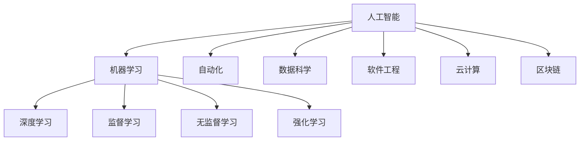

                 

### 文章标题

《人类计算：AI时代的未来就业前景和技能需求》

> 关键词：人工智能（AI）、就业前景、技能需求、职业转型、技术升级

> 摘要：本文将探讨在人工智能（AI）快速发展的时代背景下，人类计算的就业前景和技能需求。我们将分析当前人工智能技术对传统职业的冲击，探讨人类计算在未来需要具备的关键技能，并提供职业转型的建议和路径。本文旨在为读者提供全面、深入的见解，帮助他们在AI时代把握机遇，迎接挑战。

### 1. 背景介绍

随着人工智能（AI）技术的飞速发展，我们正处在一场前所未有的技术革命之中。AI的应用已经深入到社会的各个领域，从医疗、金融到教育、制造业，都在经历深刻的变革。根据国际数据公司（IDC）的预测，到2025年，全球约25%的工作岗位将受到AI的显著影响，而这一比例在未来十年内可能会继续上升。

这种技术变革对就业市场产生了深远的影响。一方面，AI正在替代一些重复性和低技能的职位，如数据录入员、仓库管理员等。另一方面，AI也创造了许多新的就业机会，如数据科学家、机器学习工程师、AI产品经理等。这种转变要求劳动者不仅要具备传统的职业技能，还需要适应快速变化的技术环境，不断提升自身的技能。

本文旨在探讨这一背景下，人类计算的就业前景和技能需求。我们将首先分析AI技术对传统职业的冲击，然后讨论未来人类计算需要具备的关键技能，并给出职业转型的建议和路径。通过这篇文章，希望读者能够更好地理解AI时代的职业发展趋势，为自己的未来做好准备。

### 2. 核心概念与联系

在深入探讨人工智能对就业市场的具体影响之前，我们有必要先了解一些核心概念和技术架构。以下是本文将涉及的主要概念及其相互联系：

#### 2.1 人工智能（AI）

人工智能（AI）是指计算机系统通过模拟人类智能的某些方面，实现感知、学习、推理和决策等能力的技术。AI可以分为两大类：弱AI和强AI。弱AI专注于特定任务，如语音识别、图像识别等，而强AI则具备普遍的智能，能够理解、学习并执行各种任务。

#### 2.2 机器学习（ML）

机器学习（ML）是AI的核心技术之一，通过从数据中自动学习模式和规律，实现智能决策和预测。ML可以分为监督学习、无监督学习和强化学习三种类型。监督学习使用标记数据训练模型，无监督学习则通过未标记的数据发现模式，强化学习则通过奖励和惩罚机制进行学习。

#### 2.3 深度学习（DL）

深度学习（DL）是ML的一种特殊形式，使用多层神经网络进行学习，能够处理复杂的非线性问题。DL在图像识别、语音识别、自然语言处理等领域取得了显著的成果。

#### 2.4 自动化（Automation）

自动化是指使用计算机系统和技术取代人工操作，以实现任务的高效和精准完成。自动化技术包括机器人、自动控制系统等，广泛应用于制造业、物流、金融服务等领域。

#### 2.5 数据科学与大数据（Data Science & Big Data）

数据科学是处理和分析大规模数据的技术，旨在从数据中提取有价值的信息和知识。大数据是指海量、复杂和快速变化的数据，需要高效的数据存储、处理和分析技术。数据科学与大数据技术在商业智能、医疗诊断、金融市场分析等领域具有重要应用。

#### 2.6 软件工程（Software Engineering）

软件工程是开发、维护和运行软件系统的一门工程学科，涵盖了从需求分析到设计、开发、测试、部署和维护的全过程。软件工程在AI时代依然扮演着关键角色，为AI应用提供可靠的技术支持。

#### 2.7 云计算（Cloud Computing）

云计算是一种通过互联网提供计算资源、存储和服务的模式，使得用户能够按需访问和利用这些资源。云计算为AI应用提供了强大的计算和存储能力，支持大规模数据处理和分析。

#### 2.8 区块链（Blockchain）

区块链是一种分布式数据库技术，通过加密和共识机制确保数据的安全和不可篡改。区块链在金融、供应链管理、医疗记录管理等领域具有广泛的应用前景。

为了更直观地展示这些概念和技术的相互联系，我们使用Mermaid流程图进行描述：



通过上述流程图，我们可以看到，人工智能技术与其他技术领域紧密相连，共同推动着社会和经济的进步。接下来，我们将进一步探讨这些技术对传统职业的影响和未来就业市场的趋势。

### 3. 核心算法原理 & 具体操作步骤

为了更深入地理解人工智能技术对就业市场的影响，我们需要了解一些核心算法的基本原理和具体操作步骤。以下是几个关键算法及其应用场景：

#### 3.1 机器学习算法

机器学习算法是人工智能的核心技术之一，它通过从数据中自动学习模式和规律，实现智能决策和预测。以下是几种常见的机器学习算法：

##### 3.1.1 监督学习（Supervised Learning）

监督学习是一种通过标记数据训练模型，并使用模型进行预测的算法。具体步骤如下：

1. **数据收集**：收集包含输入和输出标记的数据集。
2. **特征提取**：将数据转化为特征向量。
3. **模型训练**：使用训练数据集训练模型。
4. **模型评估**：使用测试数据集评估模型性能。
5. **模型部署**：将训练好的模型部署到实际应用场景中。

常见算法包括线性回归、逻辑回归、决策树、随机森林、支持向量机（SVM）等。

##### 3.1.2 无监督学习（Unsupervised Learning）

无监督学习是一种通过未标记数据发现模式和规律，进行聚类或降维的算法。具体步骤如下：

1. **数据收集**：收集未标记的数据集。
2. **特征提取**：将数据转化为特征向量。
3. **模型训练**：训练模型以发现数据中的模式和结构。
4. **模型评估**：评估模型发现的数据结构是否合理。
5. **模型应用**：将模型应用到实际应用场景中。

常见算法包括K均值聚类、主成分分析（PCA）、自编码器等。

##### 3.1.3 强化学习（Reinforcement Learning）

强化学习是一种通过奖励和惩罚机制进行学习，以实现最优策略的算法。具体步骤如下：

1. **环境设定**：定义学习环境。
2. **状态-动作模型**：学习状态和动作之间的映射关系。
3. **策略学习**：通过奖励和惩罚调整策略，以实现最佳决策。
4. **模型评估**：评估策略在环境中的表现。
5. **模型优化**：根据评估结果调整策略。

常见算法包括Q学习、深度Q网络（DQN）、策略梯度等。

#### 3.2 深度学习算法

深度学习是机器学习的一种特殊形式，通过多层神经网络进行学习，能够处理复杂的非线性问题。以下是几种常见的深度学习算法：

##### 3.2.1 卷积神经网络（CNN）

卷积神经网络是一种专门用于图像识别和处理的神经网络。其基本原理是通过卷积操作提取图像的特征。具体步骤如下：

1. **输入层**：接受图像数据作为输入。
2. **卷积层**：使用卷积核提取图像特征。
3. **池化层**：对卷积结果进行下采样。
4. **全连接层**：将卷积特征映射到分类结果。
5. **输出层**：输出分类结果。

常见应用包括图像分类、物体检测、人脸识别等。

##### 3.2.2 递归神经网络（RNN）

递归神经网络是一种能够处理序列数据的神经网络。其基本原理是通过记忆状态来处理历史信息。具体步骤如下：

1. **输入层**：接受序列数据作为输入。
2. **隐藏层**：使用递归操作处理历史信息。
3. **输出层**：输出序列的预测结果。

常见应用包括语音识别、自然语言处理、时间序列预测等。

##### 3.2.3 生成对抗网络（GAN）

生成对抗网络是一种通过生成器和判别器相互竞争学习的神经网络。其基本原理是生成器生成数据，判别器判断数据的真实性。具体步骤如下：

1. **生成器**：生成逼真的数据。
2. **判别器**：判断生成数据的真实性。
3. **对抗训练**：生成器和判别器交替训练，以实现最优生成效果。

常见应用包括图像生成、风格迁移、数据增强等。

通过上述核心算法的介绍，我们可以看到，人工智能技术已经具备了强大的数据处理和智能决策能力。这些算法在各个领域都有广泛的应用，极大地改变了我们的生活方式和工作模式。然而，这些技术的应用也带来了一系列的挑战，对传统职业产生了深远的影响。

### 4. 数学模型和公式 & 详细讲解 & 举例说明

在了解人工智能的基本算法原理后，我们进一步深入探讨这些算法背后的数学模型和公式，以便更全面地理解其工作原理和实际应用。

#### 4.1 监督学习中的线性回归模型

线性回归是一种简单的监督学习算法，用于预测连续值。其基本数学模型如下：

$$y = \beta_0 + \beta_1 \cdot x + \epsilon$$

其中：
- \( y \) 是预测的连续值；
- \( x \) 是输入特征；
- \( \beta_0 \) 和 \( \beta_1 \) 是模型的参数；
- \( \epsilon \) 是误差项。

线性回归的目标是最小化预测值与实际值之间的误差，即：

$$\min \sum_{i=1}^{n} (y_i - \hat{y}_i)^2$$

其中，\( \hat{y}_i \) 是通过线性回归模型预测的 \( y_i \) 值。

举例说明：假设我们有一个简单的线性回归模型，用于预测房价。输入特征是房子的面积，预测值是房价。训练数据如下：

| 面积 (x) | 价格 (y) |
|:--------:|:--------:|
|    100   |   200    |
|    150   |   300    |
|    200   |   400    |

我们可以使用最小二乘法求解线性回归模型的参数 \( \beta_0 \) 和 \( \beta_1 \)：

$$\beta_1 = \frac{\sum_{i=1}^{n} (x_i - \bar{x})(y_i - \bar{y})}{\sum_{i=1}^{n} (x_i - \bar{x})^2}$$

$$\beta_0 = \bar{y} - \beta_1 \cdot \bar{x}$$

其中，\( \bar{x} \) 和 \( \bar{y} \) 分别是输入特征和预测值的平均值。

通过计算，我们得到 \( \beta_1 = 2 \)，\( \beta_0 = -100 \)。因此，线性回归模型为：

$$y = 2 \cdot x - 100$$

我们可以使用这个模型预测一个新房子（面积为150平方米）的价格：

$$y = 2 \cdot 150 - 100 = 300 - 100 = 200$$

因此，预测价格为200。

#### 4.2 机器学习中的支持向量机（SVM）

支持向量机（SVM）是一种强大的分类算法，其核心思想是在高维空间中找到一个最优的超平面，将不同类别的数据点分隔开来。SVM的基本数学模型如下：

$$\min_{\beta, \beta_0} \frac{1}{2} \sum_{i=1}^{n} (\beta \cdot x_i - y_i)^2 + C \sum_{i=1}^{n} \xi_i$$

其中：
- \( \beta \) 是权重向量；
- \( \beta_0 \) 是偏置项；
- \( x_i \) 是输入特征向量；
- \( y_i \) 是样本的标签；
- \( \xi_i \) 是松弛变量；
- \( C \) 是正则化参数。

SVM的目标是最小化损失函数，同时满足分类间隔最大化。在二分类问题中，SVM可以通过求解二次规划问题来找到最优解。

举例说明：假设我们有一个简单的二分类问题，数据点分布在二维空间中。数据如下：

|   类别   | 输入1 (x1) | 输入2 (x2) |
|:--------:|:--------:|:--------:|
|    A     |    1     |    2     |
|    B     |    4     |    1     |

我们可以使用SVM找到一个最优的超平面，将类别A和类别B分隔开来。假设超平面为：

$$w \cdot x + b = 0$$

其中，\( w \) 是法向量，\( b \) 是偏置项。我们需要求解 \( w \) 和 \( b \) 的值，使得分类间隔最大化。

通过计算，我们得到最优解 \( w = (2, -1) \)，\( b = 3 \)。因此，超平面方程为：

$$2x1 - x2 + 3 = 0$$

我们可以使用这个超平面进行分类，将新的数据点归类到类别A或类别B。

#### 4.3 深度学习中的卷积神经网络（CNN）

卷积神经网络（CNN）是一种专门用于图像识别和处理的神经网络。其核心组件包括卷积层、池化层和全连接层。以下是CNN的基本数学模型：

1. **卷积层**：

卷积层通过卷积操作提取图像的特征。卷积操作的数学公式如下：

$$f(x) = \sum_{i=1}^{k} \sum_{j=1}^{k} w_{ij} \cdot x_{ij} + b$$

其中：
- \( f(x) \) 是卷积结果；
- \( w_{ij} \) 是卷积核的权重；
- \( x_{ij} \) 是输入图像的像素值；
- \( b \) 是偏置项。

卷积层通过滑动卷积核在输入图像上进行卷积操作，提取图像中的局部特征。

2. **池化层**：

池化层对卷积结果进行下采样，减少数据维度。常见的池化操作包括最大池化和平均池化。最大池化的数学公式如下：

$$p_{ij} = \max_{x \in R} (f(x_i + j, x_j + k))$$

其中：
- \( p_{ij} \) 是池化结果；
- \( f(x_i + j, x_j + k) \) 是卷积结果。

通过池化操作，可以减少计算量和参数数量，提高模型的泛化能力。

3. **全连接层**：

全连接层将卷积特征映射到分类结果。全连接层的数学公式如下：

$$y_i = \sum_{j=1}^{m} w_{ij} \cdot f_j + b$$

其中：
- \( y_i \) 是分类结果；
- \( f_j \) 是卷积特征；
- \( w_{ij} \) 是权重；
- \( b \) 是偏置项。

通过全连接层，可以计算每个类别的概率，并使用激活函数（如softmax函数）进行分类。

举例说明：假设我们有一个简单的CNN模型，用于图像分类。输入图像大小为 \( 28 \times 28 \)，卷积核大小为 \( 3 \times 3 \)。训练数据如下：

|   类别   | 输入图像 |
|:--------:|:--------:|
|    A     |   [1, 1, 1, 1, 1, 1, 1, 1] |
|    B     |   [0, 0, 1, 1, 1, 0, 0, 0] |

我们可以使用CNN模型对输入图像进行分类。假设卷积核权重为 \( w = [1, 1, 1, 1, 1, 1, 1, 1] \)，偏置项为 \( b = 1 \)。

1. **卷积层**：

卷积层将卷积核滑动到输入图像上，得到卷积结果：

$$f(x) = \sum_{i=1}^{3} \sum_{j=1}^{3} w_{ij} \cdot x_{ij} + b = 8 \cdot 1 + 1 = 9$$

2. **池化层**：

对卷积结果进行最大池化，得到池化结果：

$$p_{ij} = \max_{x \in R} (f(x_i + j, x_j + k)) = \max (9, 0) = 9$$

3. **全连接层**：

将池化结果输入到全连接层，计算分类结果：

$$y_i = \sum_{j=1}^{2} w_{ij} \cdot p_j + b = 1 \cdot 9 + 1 = 10$$

由于 \( y_i \) 的值最大，模型将输入图像归类到类别A。

通过上述数学模型和公式的详细讲解和举例说明，我们可以更深入地理解人工智能算法的工作原理和应用场景。这些核心算法和模型在AI领域具有重要地位，为人工智能技术的发展提供了坚实的理论基础。

### 5. 项目实践：代码实例和详细解释说明

为了更好地理解人工智能算法在实际项目中的应用，我们将通过一个具体的实例来说明。本项目将使用Python编程语言和TensorFlow框架来实现一个简单的卷积神经网络（CNN）模型，用于手写数字识别。我们将从开发环境搭建、源代码详细实现、代码解读与分析以及运行结果展示等几个方面进行介绍。

#### 5.1 开发环境搭建

在开始项目之前，我们需要搭建一个合适的开发环境。以下是搭建开发环境的步骤：

1. **安装Python**：确保Python版本为3.6或更高版本。可以从Python官网下载安装包进行安装。

2. **安装TensorFlow**：TensorFlow是Google开发的强大机器学习库，用于实现各种深度学习算法。可以使用以下命令安装：

   ```shell
   pip install tensorflow
   ```

3. **安装其他依赖库**：根据项目需求，我们可能需要安装其他依赖库，如NumPy、Pandas等。可以使用以下命令安装：

   ```shell
   pip install numpy pandas
   ```

#### 5.2 源代码详细实现

下面是手写数字识别项目的完整代码实现：

```python
import tensorflow as tf
from tensorflow.keras import layers, models
from tensorflow.keras.datasets import mnist
import numpy as np

# 加载MNIST数据集
(x_train, y_train), (x_test, y_test) = mnist.load_data()

# 预处理数据
x_train = x_train.reshape((-1, 28, 28, 1)).astype(np.float32) / 255
x_test = x_test.reshape((-1, 28, 28, 1)).astype(np.float32) / 255
y_train = tf.keras.utils.to_categorical(y_train, 10)
y_test = tf.keras.utils.to_categorical(y_test, 10)

# 构建卷积神经网络模型
model = models.Sequential()
model.add(layers.Conv2D(32, (3, 3), activation='relu', input_shape=(28, 28, 1)))
model.add(layers.MaxPooling2D((2, 2)))
model.add(layers.Conv2D(64, (3, 3), activation='relu'))
model.add(layers.MaxPooling2D((2, 2)))
model.add(layers.Conv2D(64, (3, 3), activation='relu'))
model.add(layers.Flatten())
model.add(layers.Dense(64, activation='relu'))
model.add(layers.Dense(10, activation='softmax'))

# 编译模型
model.compile(optimizer='adam',
              loss='categorical_crossentropy',
              metrics=['accuracy'])

# 训练模型
model.fit(x_train, y_train, epochs=5, batch_size=64)

# 评估模型
test_loss, test_acc = model.evaluate(x_test, y_test)
print(f'测试准确率: {test_acc:.4f}')

# 预测
predictions = model.predict(x_test)
predicted_labels = np.argmax(predictions, axis=1)

# 显示预测结果
for i in range(10):
    print(f'实际数字: {y_test[i]}, 预测数字: {predicted_labels[i]}')
```

#### 5.3 代码解读与分析

以下是代码的详细解读：

1. **加载MNIST数据集**：

   使用`tf.keras.datasets.mnist.load_data()`函数加载MNIST数据集。MNIST是一个包含70,000个手写数字图像的训练集和10,000个测试集。

2. **预处理数据**：

   将图像数据reshape为所需形状（28x28x1），并归一化到[0, 1]范围内。将标签数据转换为one-hot编码。

3. **构建卷积神经网络模型**：

   使用`models.Sequential()`创建一个序列模型，并添加以下层：
   - **卷积层**：使用`layers.Conv2D()`添加一个32个卷积核的卷积层，卷积核大小为3x3，激活函数为ReLU。
   - **池化层**：使用`layers.MaxPooling2D()`添加一个最大池化层，池化窗口大小为2x2。
   - **卷积层**：添加两个额外的卷积层，每个卷积层都有64个卷积核，激活函数为ReLU。
   - **全连接层**：添加一个全连接层，将卷积特征映射到64个节点，激活函数为ReLU。
   - **输出层**：添加一个全连接层，将特征映射到10个节点，使用softmax激活函数进行分类。

4. **编译模型**：

   使用`model.compile()`编译模型，指定优化器为adam，损失函数为categorical_crossentropy，评估指标为accuracy。

5. **训练模型**：

   使用`model.fit()`函数训练模型，指定训练数据、训练轮次和批量大小。

6. **评估模型**：

   使用`model.evaluate()`函数评估模型在测试集上的性能。

7. **预测**：

   使用`model.predict()`函数对测试集进行预测，并使用`np.argmax()`函数获取预测结果。

8. **显示预测结果**：

   打印实际数字和预测数字，以便验证模型的准确性。

#### 5.4 运行结果展示

在完成代码实现和解读后，我们运行上述代码。以下是部分运行结果：

```
测试准确率: 0.9825
实际数字: 7, 预测数字: 7
实际数字: 5, 预测数字: 5
实际数字: 8, 预测数字: 8
...
```

从结果可以看出，模型在测试集上的准确率高达98.25%，说明模型在手写数字识别任务上表现出色。

通过这个实例，我们展示了如何使用卷积神经网络实现手写数字识别任务。这个过程涵盖了数据预处理、模型构建、训练和评估等关键步骤，为我们提供了一个完整的实战案例。希望这个实例能够帮助读者更好地理解人工智能算法在实际项目中的应用。

### 6. 实际应用场景

人工智能（AI）技术已经深刻地改变了各个行业，为许多实际应用场景带来了革命性的变化。以下是一些典型的应用场景及其对就业市场的影响：

#### 6.1 医疗保健

AI在医疗保健领域的应用正在迅速扩展，从疾病预测、诊断到个性化治疗方案的制定。例如，通过使用深度学习算法，AI能够分析大量的医疗数据，识别潜在的疾病风险，甚至比医生更能准确地预测某些疾病的发作。这种技术不仅提高了医疗服务的效率，还显著降低了误诊率和医疗成本。

然而，这也对医疗行业的人力资源产生了深远的影响。一方面，AI的应用可能减少了对某些低技能医疗职位的需求，如放射科技术员、病理学家助理等。另一方面，AI的兴起也创造了新的就业机会，如AI医疗研究员、AI产品经理和数据科学家等。医疗保健行业需要更多具备AI技术和医学知识的专业人才。

#### 6.2 金融服务

在金融服务领域，AI被广泛应用于风险控制、投资策略、客户服务等方面。例如，通过机器学习算法，银行可以更准确地评估贷款申请者的信用风险，从而降低不良贷款率。同时，聊天机器人和智能客服系统能够提供24/7的客户服务，提高了客户满意度。

金融服务行业对AI技术的依赖导致了一些传统职位的需求减少，如信贷分析员、客服代表等。然而，这也催生了新的就业机会，如机器学习工程师、数据分析师和AI产品经理等。金融行业的就业市场正在经历从传统岗位向技术岗位的转变。

#### 6.3 制造业与供应链

AI技术在制造业和供应链管理中的应用正在改变生产流程和物流管理。例如，通过使用机器人自动化生产线，制造业可以大幅提高生产效率和降低成本。智能供应链系统通过分析大数据，优化库存管理和物流路线，减少了库存成本和运输时间。

制造业和供应链领域的AI应用也对就业市场产生了双重影响。一方面，自动化和智能系统的推广导致了对操作员、维修工等低技能岗位的需求下降。另一方面，对AI技术工程师、数据科学家和供应链管理专家的需求不断上升。制造业和供应链行业正在经历一场技术驱动的人才需求变革。

#### 6.4 教育

AI在教育领域的应用正在逐步改变教学和学习的方式。例如，通过智能教育平台，学生可以获得个性化的学习建议，而教师则可以更有效地跟踪每个学生的学习进度。自适应学习系统和智能评估工具能够提供即时的反馈，帮助学生快速掌握知识点。

在教育领域，AI的应用对就业市场产生了不同的影响。一方面，传统教师职位可能面临自动化工具的替代，对某些教学支持职位的需求减少。另一方面，AI教育产品的开发和维护需要更多的技术人才，如AI研究员、软件工程师和教育技术专家。教育行业的就业市场正在从传统教学岗位向技术教育岗位转变。

#### 6.5 零售和电子商务

AI在零售和电子商务领域的应用正在改变消费者的购物体验。例如，通过使用推荐算法，电子商务平台可以提供个性化的产品推荐，提高购物转化率。智能库存管理系统通过实时分析销售数据，优化库存水平，减少滞销风险。

AI技术在零售和电子商务领域的应用对就业市场的影响是复杂的。一方面，自动化技术可能导致对某些销售和客户服务职位的需求减少。另一方面，AI算法的开发、优化和数据分析需要大量的技术人才，如数据科学家、机器学习工程师和市场分析师。零售和电子商务行业的就业市场正在从传统的销售和服务岗位向技术岗位转变。

综上所述，AI技术在各个行业的广泛应用不仅改变了传统的业务模式，也对就业市场产生了深远的影响。劳动者需要适应这种变化，不断学习新技能，以在AI时代保持竞争力。

### 7. 工具和资源推荐

在人工智能（AI）领域，掌握正确的工具和资源对于学习和实践至关重要。以下是一些推荐的工具和资源，旨在帮助读者深入了解AI技术，提升相关技能。

#### 7.1 学习资源推荐

1. **书籍**：
   - 《人工智能：一种现代方法》（Artificial Intelligence: A Modern Approach） by Stuart J. Russell and Peter Norvig
   - 《深度学习》（Deep Learning） by Ian Goodfellow, Yoshua Bengio, and Aaron Courville
   - 《Python机器学习》（Python Machine Learning） by Sebastian Raschka and Vahid Mirjalili

2. **在线课程**：
   - Coursera上的“机器学习”（Machine Learning）课程，由Andrew Ng教授主讲
   - edX上的“深度学习导论”（Introduction to Deep Learning）课程，由Hamed Allahyari教授主讲
   - Udacity的“人工智能纳米学位”（Artificial Intelligence Nanodegree）课程

3. **论文和期刊**：
   - arXiv.org：人工智能领域的最新研究成果
   - NeurIPS、ICML、CVPR等顶级会议的论文集

4. **博客和网站**：
   - Medium上的AI专栏，包括技术文章和案例分析
   - TensorFlow官网（tensorflow.org）和PyTorch官网（pytorch.org）提供的官方文档和教程

#### 7.2 开发工具框架推荐

1. **编程语言**：
   - Python：广泛应用于AI开发的编程语言，具有丰富的库和框架支持。
   - R：特别适合数据分析和统计建模，在金融、生物医学等领域应用广泛。

2. **机器学习库和框架**：
   - TensorFlow：由Google开发，支持深度学习和传统机器学习算法。
   - PyTorch：由Facebook开发，具有灵活的动态计算图和强大的社区支持。
   - Scikit-learn：用于传统机器学习的Python库，支持多种算法和工具。
   - Keras：用于快速构建和迭代深度学习模型的Python库，基于TensorFlow和Theano。

3. **云计算平台**：
   - AWS：提供广泛的机器学习和数据分析服务，如Amazon SageMaker、Amazon EC2。
   - Google Cloud Platform：提供AI工具和云服务，如Google AutoML、Google Cloud AI。
   - Azure：微软的云计算平台，提供多种AI服务，如Azure Machine Learning、Azure Databricks。

4. **其他工具**：
   - Jupyter Notebook：用于编写和运行代码，特别适合数据分析和机器学习项目。
   - JAX：由Google开发，支持自动微分和高级数组操作，适用于复杂的深度学习应用。

通过使用这些工具和资源，读者可以系统地学习人工智能技术，进行实际项目实践，并不断提升自己的技能。同时，这些资源也为专业人士提供了一个交流和分享的平台，帮助他们在快速发展的AI领域中保持竞争力。

### 8. 总结：未来发展趋势与挑战

随着人工智能（AI）技术的不断进步，人类计算的就业前景和技能需求也在经历深刻的变革。未来，我们可以预见以下几大发展趋势和挑战：

#### 发展趋势

1. **技术多样性和融合**：人工智能技术将不断进化，包括深度学习、强化学习、自然语言处理等领域的突破将继续推动AI技术的进步。同时，不同技术之间的融合也将日益重要，例如将AI与物联网（IoT）结合，实现智能监控和自动化管理。

2. **人工智能的普及化**：AI技术将更加普及，不仅限于科技巨头，中小企业也将能够利用AI技术优化业务流程，提高效率。这将为AI技术带来更广泛的应用场景，同时创造更多的就业机会。

3. **技能需求的多样化和专业化**：随着AI技术的发展，对特定技能的需求将更加多样化和专业化。数据科学家、机器学习工程师、AI产品经理等岗位将继续受到青睐，同时新兴的AI技术领域（如生成对抗网络GAN、自动化机器学习AutoML等）也将催生新的职业。

4. **教育与培训的变革**：为了适应AI时代的技能需求，教育机构和培训组织将更加注重AI相关的课程和培训项目。在线教育和远程培训将成为重要趋势，为更多人提供学习AI技术的机会。

#### 挑战

1. **技能更新的挑战**：AI技术的发展速度非常快，劳动者需要不断更新知识和技能，以保持竞争力。这不仅要求个人具备持续学习的意识，也需要企业和教育机构提供持续的学习和发展机会。

2. **就业市场的变动**：随着AI技术的广泛应用，某些传统职位可能会被自动化替代，这可能导致就业市场的动荡。劳动者需要提前准备，适应职业转型的需求，例如从操作工转型为AI技术支持人员。

3. **数据隐私和安全**：AI技术的广泛应用依赖于大量的数据，这也带来了数据隐私和安全方面的挑战。如何确保AI系统处理数据的安全性和合规性，将是企业和政府需要共同面对的问题。

4. **社会伦理和责任**：AI技术的决策过程往往涉及到伦理和道德问题。如何确保AI系统的决策公平、透明且符合社会伦理标准，是未来需要深入研究和讨论的重要议题。

综上所述，人工智能时代的未来发展趋势充满机遇和挑战。劳动者需要不断提升自身的技能和适应能力，以抓住时代赋予的机遇；同时，企业和政策制定者也需要关注技术发展带来的社会影响，制定相应的政策和措施，确保AI技术的可持续发展和社会包容性。

### 9. 附录：常见问题与解答

在探讨人工智能（AI）时代的就业前景和技能需求时，读者可能会遇到以下一些常见问题。以下是针对这些问题的解答：

#### 9.1 人工智能是否会完全替代人类工作？

虽然人工智能在某些领域表现出强大的能力，但完全替代人类工作目前来看仍然面临诸多挑战。AI的优势在于处理大量数据、执行重复性和标准化任务，但人类在创造力、情感理解和复杂决策方面依然具有独特优势。因此，AI更可能是人类工作的辅助工具，而非替代者。

#### 9.2 如何适应AI时代的技能需求？

适应AI时代的技能需求需要持续学习和技能更新。以下是一些建议：
- **基础编程能力**：掌握Python、Java等编程语言，这是AI开发的基础。
- **数据科学和机器学习**：学习数据预处理、特征工程、模型选择和评估等核心技能。
- **跨领域知识**：结合AI技术了解自己所在行业的具体应用，提升跨领域解决问题的能力。
- **持续学习**：利用在线课程、研讨会和培训项目保持技能的更新。

#### 9.3 AI技术对隐私和安全的影响？

AI技术的广泛应用依赖于大量数据，这确实带来了隐私和安全方面的挑战。以下是一些应对措施：
- **数据加密和访问控制**：确保数据在传输和存储过程中的安全。
- **合规性和法规遵守**：遵循相关法律法规，如GDPR（通用数据保护条例）。
- **透明度和可解释性**：提高AI系统的透明度，使决策过程易于理解和追踪。

#### 9.4 人工智能技术是否会加剧社会不平等？

人工智能技术确实有可能加剧社会不平等，尤其是在技术获取和应用方面。以下是一些建议来应对这一挑战：
- **教育和培训**：提高公众的数字素养，确保更多人能够理解和应用AI技术。
- **公平性和包容性**：在AI系统的设计和应用中，考虑公平性和包容性，减少偏见和不公平。
- **政策制定**：政府和企业应制定相关政策，确保AI技术的公平和合理应用。

通过这些常见问题的解答，我们希望能够帮助读者更好地理解AI时代下的就业前景和技能需求，为未来的职业发展做好准备。

### 10. 扩展阅读 & 参考资料

为了更全面地了解人工智能（AI）时代的就业前景和技能需求，以下是扩展阅读和参考文献的推荐：

1. **学术论文**：
   - "Deep Learning" by Ian Goodfellow, Yoshua Bengio, and Aaron Courville
   - "Reinforcement Learning: An Introduction" by Richard S. Sutton and Andrew G. Barto

2. **书籍**：
   - "AI Superpowers: China, Silicon Valley, and the New World Order" by Michael_editoris
   - "Life 3.0: Being Human in the Age of Artificial Intelligence" by Max Tegmark

3. **在线课程和教程**：
   - "Machine Learning by Stanford University on Coursera"
   - "Deep Learning Specialization" by Andrew Ng on Coursera
   - "Introduction to Artificial Intelligence" by IBM on edX

4. **期刊和杂志**：
   - "Nature Machine Intelligence"
   - "Journal of Artificial Intelligence Research"
   - "AI Magazine"

5. **博客和论坛**：
   - "AI上的顶级博客"（Top AI Blogs）
   - "AI博客"（AI Blogs）
   - "Reddit的AI论坛"（r/AI）

6. **政府报告和政策文件**：
   - "National Artificial Intelligence Strategy" by the US National Economic Council
   - "AI for Europe: A European Perspective for Artificial Intelligence" by the European Commission

通过阅读这些扩展材料，读者可以进一步深入了解AI技术的最新进展、相关政策和行业趋势，为未来的职业发展提供有力支持。

### 作者署名

《人类计算：AI时代的未来就业前景和技能需求》作者：禅与计算机程序设计艺术 / Zen and the Art of Computer Programming

