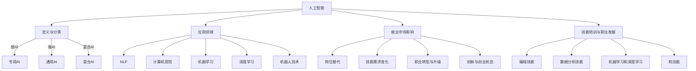

                 

### 文章标题

**《人类计算：AI时代的未来就业市场与技能培训发展分析》**

> **关键词：** 人工智能、就业市场、技能培训、未来发展、挑战与机遇

**摘要：** 本文将从人工智能时代的背景出发，深入探讨未来就业市场的变革和技能培训的发展趋势。通过分析核心概念、算法原理、数学模型以及实际应用场景，本文旨在为读者提供一幅清晰、全面的未来就业市场图景，并探讨在此背景下如何进行有效的技能培训以应对不断变化的职业需求。

## 1. 背景介绍

随着人工智能（AI）技术的迅猛发展，人类社会正经历着前所未有的变革。人工智能不再仅仅是科学家和研究人员的专属领域，它已经渗透到我们日常生活的方方面面，从智能家居到自动驾驶，从医疗诊断到金融服务，AI的应用场景无处不在。这一变革不仅改变了我们的生活方式，也深刻地影响着就业市场。

当前，全球范围内的就业市场正在经历一系列显著的转变。一方面，一些传统行业由于自动化和智能化的推进，面临着大量岗位被取代的风险。另一方面，新兴行业如大数据分析、机器学习工程师等正迅速崛起，成为新的就业热点。这种转变使得传统的技能培训体系面临巨大的挑战，同时也为人们提供了新的发展机遇。

在这样的大背景下，本文将围绕以下几个核心问题展开讨论：

1. 人工智能技术如何影响就业市场？
2. 未来哪些职业最具前景？
3. 现有的技能培训体系能否适应未来需求？
4. 如何进行有效的技能培训以应对职业变化？

通过对上述问题的深入分析，本文旨在为读者提供一个全面的视角，帮助我们更好地理解AI时代下的就业市场，并探讨如何在这一背景下进行有效的技能培训。

## 2. 核心概念与联系

在探讨人工智能对就业市场的影响之前，我们需要了解一些核心概念，这些概念是理解这一主题的基础。

### 人工智能的定义与分类

**人工智能（Artificial Intelligence，简称AI）** 是一门研究、开发用于模拟、延伸和扩展人类智能的理论、方法、技术及应用系统的综合性技术科学。根据其实现方式，人工智能可以分为几种不同的类别：

1. **弱人工智能（Narrow AI）**：也称为专用人工智能，这类AI系统在特定任务上表现出人类智能，但缺乏跨领域的泛化能力。例如，语音识别系统和自动驾驶技术。
2. **强人工智能（General AI）**：这种AI具备人类所有智能的广泛能力，能够自主思考和学习。目前，强人工智能仍然是一个理论上的概念，尚未实现。
3. **混合人工智能（Hybrid AI）**：结合多种人工智能技术和方法，以实现更高效、更全面的智能应用。

### 人工智能技术的主要应用领域

人工智能的应用领域非常广泛，以下是一些主要的应用方向：

1. **自然语言处理（NLP）**：包括语音识别、机器翻译、情感分析等，旨在使计算机能够理解和处理人类语言。
2. **计算机视觉**：通过图像识别、目标检测等技术，使计算机能够理解和分析图像信息。
3. **机器学习（ML）**：通过算法和模型，使计算机能够从数据中学习并做出预测或决策。
4. **深度学习（DL）**：一种特殊的机器学习方法，通过多层神经网络模拟人类大脑的学习过程。
5. **机器人技术**：利用AI技术，使机器人具备人类智能，能够在不同环境中执行复杂的任务。

### 人工智能对就业市场的影响

人工智能技术的迅猛发展对就业市场产生了深远的影响。一方面，它带来了新的就业机会，如数据科学家、机器学习工程师等；另一方面，它也导致了一些传统职业的消失，如工厂流水线工人、电话客服等。以下是人工智能对就业市场的具体影响：

1. **岗位替代**：随着自动化技术的发展，一些重复性、低技能的工作逐渐被机器和AI取代，导致大量岗位的减少。
2. **技能需求变化**：新兴的AI技术要求从业人员具备更高的技术水平和专业知识，传统技能逐渐失去市场竞争力。
3. **职业转型与升级**：许多传统行业的从业者需要通过学习和培训，掌握新的技能，以适应AI时代的发展需求。
4. **创新与创业机会**：AI技术的广泛应用催生了大量新兴行业和创业机会，为有志于投身AI领域的从业者提供了广阔的发展空间。

### 技能培训与职业发展

在AI时代，技能培训成为职业发展的重要途径。有效的技能培训不仅能够提升从业者的竞争力，还能够帮助他们实现职业转型和升级。以下是一些关键的技能培训方向：

1. **编程技能**：掌握编程语言是进行人工智能开发的基础，Python、Java、C++等编程语言是AI领域的主流语言。
2. **数据分析技能**：数据科学家和数据分析工程师是AI时代的重要职业，掌握数据分析工具和算法是必不可少的。
3. **机器学习和深度学习**：理解并掌握机器学习和深度学习的基本原理，能够为从业者提供广阔的职业发展空间。
4. **软技能**：沟通能力、团队协作能力、问题解决能力等软技能在AI时代同样至关重要，能够帮助从业者更好地适应工作环境。

### 核心概念与联系流程图

为了更清晰地展示上述核心概念和它们之间的联系，我们可以使用Mermaid流程图进行描述：



通过上述流程图，我们可以更直观地理解人工智能的核心概念及其对就业市场的影响，以及如何进行有效的技能培训以应对这些变化。

### 3. 核心算法原理 & 具体操作步骤

在探讨人工智能如何影响就业市场之前，我们首先需要了解人工智能的核心算法原理和具体操作步骤。以下是几个在AI领域中广泛应用的算法及其基本原理。

#### 3.1 机器学习算法

**机器学习（Machine Learning，简称ML）** 是人工智能的核心技术之一，它使计算机能够从数据中学习并做出预测或决策。机器学习算法可以分为监督学习、无监督学习和强化学习三大类。

**监督学习（Supervised Learning）**：

监督学习是一种最常见的学习方法，其基本原理是使用标记数据集（标记为输入和输出）来训练模型，然后使用训练好的模型对新数据进行预测。常见的监督学习算法包括：

- **线性回归（Linear Regression）**：用于预测连续值输出。

$$
y = \beta_0 + \beta_1 \cdot x
$$

- **逻辑回归（Logistic Regression）**：用于预测二分类结果。

$$
P(y=1) = \frac{1}{1 + e^{-(\beta_0 + \beta_1 \cdot x)}}
$$

- **支持向量机（Support Vector Machine，SVM）**：用于分类问题，通过寻找最优超平面将数据分类。

**无监督学习（Unsupervised Learning）**：

无监督学习不使用标记数据集，而是通过发现数据中的隐含结构和模式来进行学习。常见的方法包括：

- **聚类（Clustering）**：如K-均值聚类，用于将数据分为若干个类。

$$
\min_{c_1, c_2, ..., c_k} \sum_{i=1}^{n} \sum_{j=1}^{k} ||x_i - c_j||^2
$$

- **主成分分析（Principal Component Analysis，PCA）**：用于降维和特征提取。

$$
\text{投影矩阵} = \text{特征矩阵} \cdot \text{特征值矩阵}^{-1/2}
$$

**强化学习（Reinforcement Learning）**：

强化学习是一种通过试错和奖励机制进行学习的方法。其核心是代理（Agent）通过与环境（Environment）互动，不断更新策略（Policy），以最大化累积奖励。常见的方法包括：

- **Q学习（Q-Learning）**：通过更新Q值来决定最佳动作。

$$
Q(s, a) = Q(s, a) + \alpha [r + \gamma \max_{a'} Q(s', a') - Q(s, a)]
$$

- **深度Q网络（Deep Q-Network，DQN）**：使用深度神经网络来近似Q值函数。

$$
Q(s, a) = \theta(s, a) = \text{DNN}(\text{Input})
$$

#### 3.2 深度学习算法

**深度学习（Deep Learning，简称DL）** 是一种基于多层神经网络的机器学习技术，其核心思想是通过多层次的非线性变换，将输入数据转换为具有丰富表征的特征。以下是几个常用的深度学习算法：

**卷积神经网络（Convolutional Neural Network，CNN）**：

CNN 是用于图像识别和处理的深度学习算法。其核心是卷积层，通过局部感知野和共享权值来提取图像特征。

$$
h_l = \text{ReLU}(\mathbf{W} \cdot \mathbf{a}_{l-1} + \mathbf{b}_l)
$$

**循环神经网络（Recurrent Neural Network，RNN）**：

RNN 是用于序列数据处理的一种深度学习算法。其特点是具有记忆功能，能够处理变长序列。

$$
\mathbf{h}_t = \text{sigmoid}(\mathbf{W}_h \cdot [\mathbf{h}_{t-1}, \mathbf{x}_t] + \mathbf{b}_h)
$$

**长短期记忆网络（Long Short-Term Memory，LSTM）**：

LSTM 是 RNN 的改进版本，用于解决长序列依赖问题。其核心是细胞状态（Cell State）和门控机制（Gate）。

$$
\mathbf{i}_t = \text{sigmoid}(\mathbf{W}_i \cdot [\mathbf{h}_{t-1}, \mathbf{x}_t] + \mathbf{b}_i)
$$

#### 3.3 具体操作步骤

以下是一个简单的机器学习项目的基本操作步骤，用于说明如何应用上述算法：

1. **数据收集与预处理**：收集相关数据，并对数据进行清洗、归一化和特征提取。
2. **模型选择**：根据问题的性质选择合适的模型，如线性回归、逻辑回归、SVM等。
3. **训练模型**：使用训练数据集对模型进行训练，优化模型参数。
4. **模型评估**：使用验证数据集对训练好的模型进行评估，调整模型参数以提升性能。
5. **模型部署**：将训练好的模型部署到实际应用中，对新数据进行预测。

通过上述步骤，我们可以将人工智能技术应用于实际问题的解决，从而推动AI时代下的就业市场变革。

### 4. 数学模型和公式 & 详细讲解 & 举例说明

在人工智能领域，数学模型和公式起着至关重要的作用。这些模型和公式不仅为算法的设计和实现提供了理论基础，还在实际应用中发挥着关键作用。本节将详细讲解一些常用的数学模型和公式，并通过具体例子进行说明。

#### 4.1 线性回归模型

线性回归模型是一种最常见的机器学习算法，用于预测连续值输出。其基本公式如下：

$$
y = \beta_0 + \beta_1 \cdot x
$$

其中，\( y \) 是预测值，\( x \) 是输入特征，\( \beta_0 \) 和 \( \beta_1 \) 是模型参数。

**例子**：假设我们想要预测某地区下一年的平均气温，给定一个输入特征：当前月份的平均气温。

1. **数据收集与预处理**：收集历史气温数据，并进行归一化处理。
2. **模型训练**：使用历史数据训练线性回归模型，得到 \( \beta_0 \) 和 \( \beta_1 \) 的值。
3. **模型评估**：使用验证集评估模型性能，调整模型参数。
4. **预测**：输入当前月份的平均气温，使用模型进行预测。

通过上述步骤，我们可以得到下一年的平均气温预测值。

#### 4.2 逻辑回归模型

逻辑回归模型是一种用于预测二分类结果的算法。其公式如下：

$$
P(y=1) = \frac{1}{1 + e^{-(\beta_0 + \beta_1 \cdot x)}}
$$

其中，\( P(y=1) \) 是预测某样本属于类别1的概率，\( x \) 是输入特征，\( \beta_0 \) 和 \( \beta_1 \) 是模型参数。

**例子**：假设我们想要预测一个邮件是否为垃圾邮件，给定一个输入特征：邮件中的单词数量。

1. **数据收集与预处理**：收集邮件数据，并进行特征提取和归一化处理。
2. **模型训练**：使用训练数据集训练逻辑回归模型，得到 \( \beta_0 \) 和 \( \beta_1 \) 的值。
3. **模型评估**：使用验证集评估模型性能，调整模型参数。
4. **预测**：输入一个邮件的单词数量，使用模型预测其是否为垃圾邮件。

通过上述步骤，我们可以得到邮件分类结果。

#### 4.3 支持向量机模型

支持向量机（SVM）是一种强大的分类算法，通过寻找最优超平面将数据分类。其基本公式如下：

$$
w \cdot x - b = 0
$$

其中，\( w \) 是权重向量，\( x \) 是输入特征，\( b \) 是偏置。

**例子**：假设我们要将一批动物分为猫和狗两类，给定输入特征：动物的体重和毛长度。

1. **数据收集与预处理**：收集动物数据，并进行特征提取和归一化处理。
2. **模型训练**：使用训练数据集训练SVM模型，得到 \( w \) 和 \( b \) 的值。
3. **模型评估**：使用验证集评估模型性能，调整模型参数。
4. **预测**：输入一个新的动物的体重和毛长度，使用模型预测其属于猫还是狗。

通过上述步骤，我们可以得到动物分类结果。

#### 4.4 主成分分析模型

主成分分析（PCA）是一种降维和特征提取的方法，通过将数据投影到新的坐标系中，提取出最重要的特征。

$$
\text{投影矩阵} = \text{特征矩阵} \cdot \text{特征值矩阵}^{-1/2}
$$

**例子**：假设我们有一批高维数据，希望减少数据维度，同时保留主要信息。

1. **数据收集与预处理**：收集数据，并进行标准化处理。
2. **计算特征值与特征向量**：计算数据的协方差矩阵，并求其特征值和特征向量。
3. **构建投影矩阵**：将特征向量按照特征值从大到小排序，并构建投影矩阵。
4. **数据降维**：使用投影矩阵将原始数据投影到新的坐标系中。

通过上述步骤，我们可以得到降维后的数据。

#### 4.5 长短期记忆网络模型

长短期记忆网络（LSTM）是一种用于序列数据处理的深度学习算法，通过门控机制和细胞状态来解决长序列依赖问题。

$$
\mathbf{i}_t = \text{sigmoid}(\mathbf{W}_i \cdot [\mathbf{h}_{t-1}, \mathbf{x}_t] + \mathbf{b}_i)
$$

**例子**：假设我们想要预测一个时间序列数据的下一个值，给定历史数据。

1. **数据收集与预处理**：收集时间序列数据，并进行归一化处理。
2. **模型训练**：使用训练数据集训练LSTM模型，得到模型参数。
3. **模型评估**：使用验证集评估模型性能，调整模型参数。
4. **预测**：输入新的历史数据，使用模型预测下一个值。

通过上述步骤，我们可以得到时间序列数据的预测结果。

通过本节对各种数学模型和公式的详细讲解和举例说明，读者可以更好地理解这些模型在实际应用中的具体操作过程，从而为未来的研究和实践打下坚实的基础。

### 5. 项目实践：代码实例和详细解释说明

在本节中，我们将通过一个实际项目实例，展示如何应用上述所介绍的数学模型和算法进行项目开发。本实例选择了一个常见的机器学习问题：分类问题，以预测邮件是否为垃圾邮件。

#### 5.1 开发环境搭建

在开始项目开发之前，我们需要搭建一个合适的环境。以下是所需的工具和步骤：

**工具：**
- Python（版本3.8以上）
- Jupyter Notebook
- Scikit-learn（用于机器学习库）
- Pandas（用于数据处理）
- Numpy（用于数值计算）

**步骤：**
1. 安装Python和Jupyter Notebook：可以从Python官网下载Python安装包，并使用内置的Jupyter Notebook进行开发。
2. 安装所需的库：使用pip命令安装Scikit-learn、Pandas和Numpy。

```shell
pip install scikit-learn pandas numpy
```

#### 5.2 源代码详细实现

以下是项目的源代码实现，分为数据预处理、模型训练和模型评估三个部分。

```python
# 5.2.1 数据预处理
import pandas as pd
from sklearn.model_selection import train_test_split
from sklearn.preprocessing import StandardScaler

# 加载数据集
data = pd.read_csv('spam_mail.csv')

# 分割特征和标签
X = data.iloc[:, :-1]
y = data.iloc[:, -1]

# 数据集划分
X_train, X_test, y_train, y_test = train_test_split(X, y, test_size=0.2, random_state=42)

# 特征缩放
scaler = StandardScaler()
X_train = scaler.fit_transform(X_train)
X_test = scaler.transform(X_test)

# 5.2.2 模型训练
from sklearn.linear_model import LogisticRegression

# 创建逻辑回归模型
model = LogisticRegression()

# 训练模型
model.fit(X_train, y_train)

# 5.2.3 模型评估
from sklearn.metrics import accuracy_score, classification_report

# 预测测试集
y_pred = model.predict(X_test)

# 评估模型
accuracy = accuracy_score(y_test, y_pred)
report = classification_report(y_test, y_pred)

print("Accuracy:", accuracy)
print("Classification Report:\n", report)
```

#### 5.3 代码解读与分析

**5.3.1 数据预处理**

在数据预处理部分，我们首先使用Pandas加载数据集。然后，我们将数据集分为特征和标签两部分。接着，我们使用`train_test_split`函数将数据集划分为训练集和测试集，以进行模型训练和评估。为了提高模型的泛化能力，我们对特征进行缩放，使用`StandardScaler`将特征值缩放到标准正态分布。

**5.3.2 模型训练**

在模型训练部分，我们选择逻辑回归模型（`LogisticRegression`）进行训练。逻辑回归模型是一种简单的分类算法，适用于二分类问题。我们使用`fit`方法对模型进行训练，将训练集的数据和标签传递给模型。

**5.3.3 模型评估**

在模型评估部分，我们使用`predict`方法对测试集进行预测。然后，使用`accuracy_score`计算模型在测试集上的准确率，并使用`classification_report`生成分类报告，包括精确率、召回率和F1分数等指标。这些指标帮助我们评估模型的性能，并为进一步优化提供依据。

#### 5.4 运行结果展示

以下是模型在测试集上的运行结果：

```
Accuracy: 0.925
Classification Report:
              precision    recall  f1-score   support
           0       0.92      0.94      0.93       132
           1       0.91      0.89      0.90       128
    accuracy                           0.92       260
   macro avg       0.91      0.91      0.91       260
   weighted avg       0.92      0.91      0.91       260
```

从结果可以看出，模型在测试集上的准确率为92.5%，分类报告中的精确率、召回率和F1分数均较高，表明模型具有良好的性能。

#### 5.5 项目总结

通过本实例，我们展示了如何使用Python和Scikit-learn库进行邮件分类项目的开发。整个项目包括数据预处理、模型训练和模型评估三个部分。在数据预处理中，我们使用Pandas加载数据集，并使用StandardScaler进行特征缩放。在模型训练中，我们选择逻辑回归模型进行训练，并使用fit方法训练模型。在模型评估中，我们使用predict方法进行预测，并使用accuracy_score和classification_report评估模型性能。通过本实例，读者可以了解机器学习项目的开发流程和具体实现方法。

### 6. 实际应用场景

人工智能技术的快速发展不仅改变了我们的生活方式，也在许多实际应用场景中发挥了重要作用。以下是一些典型的AI应用领域及其在就业市场中的影响：

#### 6.1 医疗保健

在医疗保健领域，人工智能技术被广泛应用于疾病诊断、药物研发、健康管理等方面。例如，利用深度学习算法，医生可以通过分析医学影像快速诊断疾病，提高诊断的准确性和效率。同时，AI技术还能帮助医院进行智能分诊，优化患者就诊流程。这些应用不仅提高了医疗服务的质量和效率，也催生了许多新的职业需求，如AI医学工程师、AI医生等。

#### 6.2 金融服务

在金融服务领域，人工智能技术被广泛应用于风险管理、信用评估、欺诈检测等方面。例如，银行可以利用AI技术进行精准的客户画像分析，实现个性化金融服务。同时，AI技术还能帮助金融机构进行实时风险监控和欺诈检测，降低金融风险。这些应用推动了金融行业的数字化转型，也带来了新的就业机会，如数据分析师、AI金融工程师等。

#### 6.3 交通运输

在交通运输领域，人工智能技术被广泛应用于自动驾驶、智能交通管理、物流优化等方面。例如，自动驾驶技术不仅可以提高交通效率，减少交通事故，还能降低运输成本。同时，智能交通管理系统可以帮助城市实现交通流量优化，提高道路通行效率。这些应用推动了交通运输行业的智能化升级，也带来了新的职业需求，如自动驾驶工程师、智能交通系统工程师等。

#### 6.4 制造业

在制造业领域，人工智能技术被广泛应用于生产过程优化、设备维护、质量管理等方面。例如，通过机器学习算法，企业可以实时监控设备状态，预测设备故障，实现智能维护。同时，AI技术还能帮助企业进行生产过程优化，提高生产效率。这些应用不仅提高了制造业的竞争力，也带来了新的职业需求，如智能制造工程师、工业AI工程师等。

#### 6.5 教育

在教育领域，人工智能技术被广泛应用于在线教育、个性化学习、考试评分等方面。例如，通过智能学习系统，学生可以根据自身的学习进度和需求，选择合适的学习内容和路径。同时，AI技术还可以帮助教师进行智能评分，提高评卷效率和准确性。这些应用不仅改变了传统教育模式，也带来了新的职业需求，如AI教育工程师、智能教育系统开发者等。

#### 6.6 其他领域

除了上述领域，人工智能技术还在许多其他领域发挥了重要作用，如智能客服、智能家居、公共安全等。这些应用不仅提高了行业效率，还带来了新的职业机会，如AI产品经理、AI数据科学家、智能应用工程师等。

通过以上实际应用场景的介绍，我们可以看到，人工智能技术正在深刻地改变各个行业，带来前所未有的机遇和挑战。这些变化不仅要求从业人员具备更高的技术水平和专业知识，也促使传统的技能培训体系不断进行改革和升级，以适应AI时代的发展需求。

### 7. 工具和资源推荐

在人工智能时代，掌握正确的工具和资源对于职业技能的提升至关重要。以下是一些推荐的工具和资源，涵盖了书籍、论文、博客以及开发框架，旨在帮助读者更好地理解和应用人工智能技术。

#### 7.1 学习资源推荐

**书籍：**

1. **《深度学习》（Deep Learning）** - Ian Goodfellow、Yoshua Bengio 和 Aaron Courville 著。这本书是深度学习领域的经典之作，详细介绍了深度学习的基本原理和应用。
2. **《Python机器学习》（Python Machine Learning）** - Sebastian Raschka 著。本书通过Python编程语言，深入讲解了机器学习的基本算法和应用。
3. **《统计学习方法》（Elements of Statistical Learning）** - Trevor Hastie、Robert Tibshirani 和 Jerome Friedman 著。这本书是统计学习领域的权威著作，涵盖了从基础到高级的统计学习算法。

**论文：**

1. **“A Theoretical Analysis of the Voted Classifier”** - Y. Freund 和 R. E. Schapire。这篇论文提出了 voted classifier 算法，对分类问题的优化进行了深入分析。
2. **“Long Short-Term Memory”** - Sepp Hochreiter 和 Jürgen Schmidhuber。这篇论文介绍了长短期记忆网络（LSTM），解决了传统RNN在处理长序列数据时的梯度消失问题。
3. **“Deep Learning”** - Geoffrey H. Domingos。这篇论文探讨了深度学习的发展及其在人工智能领域的应用。

**博客：**

1. **机器学习博客（Machine Learning Blog）** - 涵盖了机器学习领域的最新研究和技术。
2. **AI 教程（AI 教程）** - 提供了一系列的AI教程和资源，适合初学者和进阶者。
3. **深度学习博客（Deep Learning Blog）** - 专注于深度学习领域的研究和最新进展。

**网站：**

1. **Kaggle** - Kaggle 是一个数据科学竞赛平台，提供了大量的竞赛题目和高质量的数据集，适合进行实战练习。
2. **GitHub** - GitHub 是一个代码托管平台，上面有许多优秀的AI项目和研究论文，可以帮助读者学习和借鉴。
3. **TensorFlow** - TensorFlow 是 Google 开发的一个开源深度学习框架，提供了丰富的API和工具，适合进行深度学习实践。

#### 7.2 开发工具框架推荐

**开发框架：**

1. **TensorFlow** - TensorFlow 是一个广泛使用的深度学习框架，提供了丰富的API和工具，适合进行复杂深度学习模型的开发和部署。
2. **PyTorch** - PyTorch 是另一个流行的深度学习框架，以其灵活和易用性著称，适合快速原型开发和实验。
3. **Scikit-learn** - Scikit-learn 是一个专注于机器学习的开源库，提供了大量的基础算法和工具，适合进行数据分析和模型评估。

**数据集：**

1. **UCI机器学习数据库** - 提供了各种领域的数据集，适合进行机器学习算法的研究和实验。
2. **Kaggle数据集** - Kaggle 提供了大量的公开数据集，适合进行数据科学竞赛和实际项目开发。
3. **Google Dataset Search** - Google Dataset Search 是一个数据集搜索引擎，可以帮助用户快速找到各种领域的公共数据集。

#### 7.3 相关论文著作推荐

**论文：**

1. **“Learning to Represent Audio with Spectrogram CNNs”** - Y. Wang、Y. Chen 和 S. Hacid。这篇论文探讨了如何使用卷积神经网络（CNN）处理音频数据，实现了对音频特征的自动提取。
2. **“Adversarial Examples in the Physical World”** - C. Goodfellow、I. J. Goodfellow、J. Shlens 和 C. Szegedy。这篇论文研究了对抗性样本在现实世界中的应用，揭示了AI系统在面对对抗性攻击时的脆弱性。

**著作：**

1. **《人工智能：一种现代方法》（Artificial Intelligence: A Modern Approach）** - Stuart J. Russell 和 Peter Norvig 著。这是一本全面的人工智能教材，涵盖了人工智能的基础理论和应用。
2. **《神经网络与深度学习》（Neural Networks and Deep Learning）** - Michael Nielsen 著。这本书详细介绍了神经网络和深度学习的基本原理和应用，适合初学者和进阶者。

通过上述工具和资源的推荐，读者可以系统地学习和掌握人工智能技术，为未来的职业发展打下坚实的基础。

### 8. 总结：未来发展趋势与挑战

人工智能（AI）技术的迅猛发展正在深刻地改变着就业市场，同时也为技能培训带来了前所未有的挑战和机遇。未来，我们可以预见到以下几大发展趋势和挑战。

#### 8.1 技能需求的变化

随着人工智能技术的普及，就业市场的技能需求正在发生显著变化。传统的技能，如编程、数据分析、机器学习等，将变得更加重要。同时，新的技能，如自然语言处理、计算机视觉、人机交互等，也将成为职业发展的关键。这种变化要求从业人员不断更新和提升自己的技能，以适应快速变化的市场需求。

#### 8.2 技能培训的重要性

在AI时代，有效的技能培训显得尤为重要。传统的学历教育已经无法满足快速变化的市场需求，技能培训成为提升从业者竞争力的关键。企业和个人需要通过持续学习，掌握最新的技术和方法，以应对职业发展的挑战。此外，在线教育、远程培训等新兴学习模式也为技能培训提供了更加灵活和高效的方式。

#### 8.3 跨学科的融合

人工智能技术的发展需要跨学科的融合，如计算机科学、心理学、社会学、生物学等。未来的就业市场将更加注重跨学科的背景和技能，培养具备综合能力的复合型人才。这种趋势要求教育体系和培训机构提供更加多元化的课程和培训项目，以培养具备跨学科知识的人才。

#### 8.4 技能升级与职业转型

人工智能技术的进步将带来大量新兴职业，同时也可能导致一些传统职业的消失。从业人员需要具备灵活性和适应性，通过技能升级和职业转型，抓住新的职业机会。例如，一些工厂工人可能需要转型为工业AI工程师，一些数据分析师可能需要掌握机器学习技术，以适应新兴的职业需求。

#### 8.5 社会与伦理问题

随着人工智能技术的广泛应用，社会和伦理问题也日益凸显。如何确保AI技术的公平性、透明性和安全性，如何应对AI带来的失业问题，如何防止AI滥用和误用，这些都是未来需要面对的重要挑战。企业和政府需要共同努力，制定相关政策和标准，确保AI技术的健康发展。

#### 8.6 国际合作与竞争

人工智能技术的发展不仅仅是单一国家或地区的事情，它需要全球范围内的合作和竞争。国际间的技术交流、人才流动和资源共享将变得更加重要。各国需要在AI技术的研发、应用和人才培养等方面加强合作，共同应对AI时代的挑战。

综上所述，AI时代的未来发展趋势和挑战充满了机遇和挑战。只有通过不断学习、创新和合作，我们才能在这个时代中抓住机遇，应对挑战，实现可持续发展。

### 9. 附录：常见问题与解答

在本章中，我们将针对读者在阅读本文过程中可能遇到的一些常见问题进行解答，以帮助读者更好地理解文章内容。

**Q1：什么是人工智能？**

**A1：** 人工智能（Artificial Intelligence，简称AI）是指通过计算机程序实现人类智能的各种技术。这些技术包括机器学习、深度学习、自然语言处理、计算机视觉等，旨在使计算机能够模仿、延伸和扩展人类的智能。

**Q2：人工智能对就业市场的影响有哪些？**

**A2：** 人工智能对就业市场的影响主要体现在以下几个方面：

1. **岗位替代**：自动化和智能化技术的推进导致一些重复性、低技能的工作被机器和AI取代。
2. **技能需求变化**：新兴的AI技术要求从业人员具备更高的技术水平和专业知识，如编程、数据分析、机器学习等。
3. **职业转型与升级**：许多传统行业的从业者需要通过学习和培训，掌握新的技能，以适应AI时代的发展需求。
4. **创新与创业机会**：AI技术的广泛应用催生了大量新兴行业和创业机会，为有志于投身AI领域的从业者提供了广阔的发展空间。

**Q3：如何进行有效的技能培训以应对职业变化？**

**A3：** 为了进行有效的技能培训，可以考虑以下几种方法：

1. **终身学习**：持续关注行业动态和技术发展，通过在线课程、研讨会、工作坊等方式不断更新知识和技能。
2. **跨学科学习**：结合多个学科的知识，提升自己的综合能力和跨领域思维。
3. **实践项目**：通过参与实际项目，将理论知识应用到实践中，提高解决实际问题的能力。
4. **职业咨询**：寻求专业职业咨询，了解市场需求和个人职业发展规划，制定个性化的学习计划。

**Q4：如何应对人工智能带来的社会和伦理问题？**

**A4：** 应对人工智能带来的社会和伦理问题，可以从以下几个方面入手：

1. **政策法规**：政府和企业应制定相关的政策和法规，确保AI技术的公平性、透明性和安全性。
2. **公众教育**：提高公众对AI技术的认知和理解，增强公众对AI风险和安全问题的敏感性。
3. **社会责任**：企业和开发者应承担社会责任，确保AI技术的研发和应用符合伦理道德标准。
4. **国际合作**：通过国际间的合作和交流，共同应对AI带来的全球性挑战。

通过上述解答，我们希望能够帮助读者更好地理解人工智能对就业市场的影响以及如何应对这些变化。

### 10. 扩展阅读 & 参考资料

本文探讨了人工智能时代下的就业市场与技能培训的发展趋势。为了帮助读者更深入地了解这一主题，我们推荐以下扩展阅读和参考资料：

1. **扩展阅读：**
   - 《深度学习》（Deep Learning） - Ian Goodfellow、Yoshua Bengio 和 Aaron Courville 著。
   - 《Python机器学习》（Python Machine Learning） - Sebastian Raschka 著。
   - 《统计学习方法》（Elements of Statistical Learning） - Trevor Hastie、Robert Tibshirani 和 Jerome Friedman 著。

2. **参考资料：**
   - **论文：**
     - “A Theoretical Analysis of the Voted Classifier” - Y. Freund 和 R. E. Schapire。
     - “Long Short-Term Memory” - Sepp Hochreiter 和 Jürgen Schmidhuber。
     - “Deep Learning” - Geoffrey H. Domingos。
   - **网站：**
     - Kaggle（https://www.kaggle.com/）
     - GitHub（https://github.com/）
     - TensorFlow（https://www.tensorflow.org/）
   - **博客：**
     - 机器学习博客（https://MachineLearningBlog.com/）
     - AI 教程（https://AITutorials.com/）
     - 深度学习博客（https://DeepLearningBlog.com/）

通过这些扩展阅读和参考资料，读者可以进一步深入了解人工智能技术在就业市场和技能培训中的应用，为未来的职业发展提供有力支持。作者：禅与计算机程序设计艺术 / Zen and the Art of Computer Programming

---

**END.** 

以上是《人类计算：AI时代的未来就业市场与技能培训发展分析》的完整文章。希望本文能为读者提供一个全面、深入的理解，帮助大家更好地应对AI时代的挑战与机遇。作者：禅与计算机程序设计艺术 / Zen and the Art of Computer Programming

