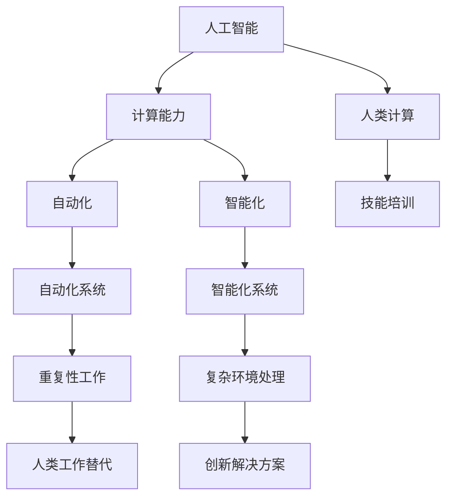

                 

### 1. 背景介绍

随着人工智能（AI）技术的飞速发展，计算能力正以前所未有的速度提升。从最初的规则系统到现代的深度学习，AI已经逐渐渗透到我们日常生活的方方面面。从自动驾驶汽车、智能语音助手到医疗诊断和金融分析，AI的应用场景正在不断扩展。这种技术进步不仅改变了我们的生活方式，也对就业市场和技能培训产生了深远的影响。

在AI时代，人类计算的角色正在发生转变。传统的就业岗位可能会被自动化和智能化所取代，但同时也为新的职业机会创造了条件。例如，数据科学家、机器学习工程师和AI伦理专家等职位需求日益增长。然而，这不仅仅是一个技术层面的转变，更涉及社会、经济和文化等多个层面。

本文将围绕AI时代的人类计算，深入探讨未来就业市场的变化趋势、技能培训的发展方向以及面临的挑战。我们将首先回顾AI技术的发展历程，分析当前AI技术在不同领域的应用现状，然后探讨人类计算在新环境下的角色和需求，最后提出针对性的技能培训建议，并展望未来发展的前景。

通过本文的阅读，您将了解：

1. AI技术的发展历程及其对就业市场的影响。
2. 当前AI技术在各领域的应用现状和趋势。
3. 人类计算在AI时代的角色和需求。
4. 技能培训在AI时代的重要性和发展方向。
5. 面临的挑战及未来发展趋势。

让我们一起思考，如何在这个AI时代中，更好地利用人类计算的能力，迎接未来的机遇与挑战。

### 2. 核心概念与联系

为了深入探讨AI时代的人类计算，我们首先需要明确几个核心概念，并分析它们之间的相互联系。以下是本文将要探讨的核心概念及其定义：

#### 2.1 人工智能（AI）

人工智能是指计算机系统模拟人类智能行为的技术。它包括机器学习、深度学习、自然语言处理、计算机视觉等多个子领域。AI的目标是通过学习和推理，使计算机能够执行复杂的任务，如语音识别、图像分类、决策制定等。

#### 2.2 计算能力

计算能力是指计算机系统处理数据和信息的能力，包括速度、存储容量、并行处理能力等。随着硬件技术的发展，计算能力在过去几十年里得到了显著提升，为AI的快速发展提供了基础。

#### 2.3 自动化和智能化

自动化是指通过计算机程序和机械设备来替代人类完成重复性、标准化的工作。智能化则是在自动化基础上，引入AI技术，使系统能够自主学习和优化，从而更好地应对复杂和变化的环境。

#### 2.4 人类计算

人类计算是指人类利用计算机工具和算法进行信息处理和决策制定的能力。在AI时代，人类计算不再仅仅是使用计算机完成任务，而是通过与AI系统的协作，实现更高效、更智能的解决方案。

#### 2.5 技能培训

技能培训是指为了提升个体在特定领域的能力和知识水平，通过教育和培训手段进行的一系列学习和实践过程。在AI时代，技能培训不仅要关注传统技能的培养，更要重视新兴技能的掌握。

下面，我们将使用Mermaid流程图来展示这些核心概念之间的联系：



#### 2.5.1 AI与计算能力

人工智能的发展离不开强大的计算能力。早期的AI系统依赖于低性能的计算机，而现代AI系统则依赖于高性能的计算平台，如GPU和TPU。计算能力的提升使得AI算法能够处理更大规模的数据，训练更复杂的模型，从而提高了AI系统的性能和应用范围。

#### 2.5.2 自动化和智能化

自动化和智能化是AI技术在不同应用场景中的表现形式。自动化侧重于替代人类完成重复性、标准化的工作，如工业生产、物流运输等。智能化则强调在复杂环境中，通过学习和自适应，实现更加灵活和高效的解决方案，如自动驾驶、智能医疗等。

#### 2.5.3 人类计算

人类计算在AI时代的作用是关键性的。人类可以利用计算机工具和算法，对海量数据进行分析和解释，从而发现有价值的信息和模式。同时，通过与AI系统的协作，人类能够克服自身的局限，实现更高效、更智能的工作。

#### 2.5.4 技能培训

在AI时代，技能培训的目标是培养个体在人工智能、数据分析、编程等领域的知识和技能。这不仅包括传统编程和数据分析技能，还包括对AI技术的理解和应用能力。通过持续的培训和学习，个体能够不断提升自己的竞争力，适应不断变化的工作环境。

通过上述核心概念的分析和Mermaid流程图的展示，我们可以更清晰地理解AI时代的人类计算及其相关概念之间的联系。这些概念不仅构成了本文讨论的基础，也为后续章节的内容奠定了理论基础。

### 3. 核心算法原理 & 具体操作步骤

在深入探讨AI时代的人类计算之前，我们需要了解一些核心算法的原理和具体操作步骤。以下是几种关键算法及其在人类计算中的角色：

#### 3.1 机器学习算法

机器学习是一种使计算机通过数据和经验不断改进自身性能的方法。它包括监督学习、无监督学习和强化学习等不同类型。以下是一个简单的监督学习算法——线性回归的具体操作步骤：

1. **数据准备**：收集并整理数据，确保数据的准确性和完整性。
2. **特征选择**：从数据中选择有用的特征，剔除无关或冗余的特征。
3. **数据预处理**：对数据进行归一化、标准化等处理，使其适合模型训练。
4. **模型选择**：选择适当的线性回归模型，如一元线性回归或多元线性回归。
5. **模型训练**：使用训练数据集对模型进行训练，通过最小化损失函数（如均方误差）来调整模型的参数。
6. **模型评估**：使用验证数据集对模型进行评估，确保其具有良好的泛化能力。
7. **模型部署**：将训练好的模型部署到实际应用中，用于预测和决策。

#### 3.2 深度学习算法

深度学习是机器学习的一个子领域，它通过多层神经网络模型来模拟人类大脑的神经元结构。以下是一个简单的卷积神经网络（CNN）的具体操作步骤：

1. **数据准备**：与线性回归类似，收集并整理数据，并进行预处理。
2. **模型设计**：设计卷积神经网络的结构，包括卷积层、池化层、全连接层等。
3. **模型训练**：使用训练数据集对模型进行训练，通过反向传播算法调整模型参数。
4. **模型评估**：使用验证数据集对模型进行评估，确保其性能达到预期。
5. **模型部署**：将训练好的模型部署到实际应用中，如图像分类、目标检测等。

#### 3.3 自然语言处理算法

自然语言处理（NLP）是一种使计算机理解和处理自然语言的方法。以下是一个简单的NLP算法——词嵌入的具体操作步骤：

1. **数据准备**：收集并整理文本数据，进行分词和词性标注。
2. **词汇表构建**：构建词汇表，将文本中的词汇映射到向量表示。
3. **模型训练**：使用预训练模型（如Word2Vec、GloVe等）对词汇表进行训练，得到词向量表示。
4. **模型应用**：将训练好的词向量用于文本分类、情感分析、机器翻译等应用。

#### 3.4 计算机视觉算法

计算机视觉是使计算机理解和解释图像和视频的方法。以下是一个简单的计算机视觉算法——目标检测的具体操作步骤：

1. **数据准备**：收集并整理图像数据，进行标注和分割。
2. **模型选择**：选择目标检测模型，如SSD、YOLO、Faster R-CNN等。
3. **模型训练**：使用标注数据集对模型进行训练，调整模型参数。
4. **模型评估**：使用验证数据集对模型进行评估，确保其准确性。
5. **模型部署**：将训练好的模型部署到实际应用中，如自动驾驶、安全监控等。

通过上述算法原理和具体操作步骤的介绍，我们可以看到，AI时代的人类计算不仅需要掌握传统的编程和数据分析技能，还需要对现代机器学习、深度学习、自然语言处理和计算机视觉等核心算法有深入的理解和应用能力。这些算法不仅改变了我们的工作方式，也为我们提供了更多的工具和机会，去应对复杂多变的问题和挑战。

### 4. 数学模型和公式 & 详细讲解 & 举例说明

在理解了AI时代的核心算法原理和具体操作步骤后，我们进一步探讨这些算法背后的数学模型和公式。通过详细讲解和举例说明，我们将更深入地理解这些模型的工作机制和实际应用。

#### 4.1 线性回归

线性回归是一种用于预测数值结果的统计方法。其基本数学模型可以表示为：

$$ y = \beta_0 + \beta_1 \cdot x + \epsilon $$

其中，$y$ 是因变量，$x$ 是自变量，$\beta_0$ 和 $\beta_1$ 是模型的参数，$\epsilon$ 是误差项。

**详细讲解**：

线性回归的核心是找到最佳拟合直线，使预测值与实际值之间的误差最小。这一目标可以通过最小化损失函数来实现：

$$ \min \sum_{i=1}^{n} (y_i - \beta_0 - \beta_1 \cdot x_i)^2 $$

其中，$n$ 是样本数量。

**举例说明**：

假设我们有一个简单的住房数据集，包含房价和房屋面积两个变量。我们希望通过线性回归模型预测房价。数据集如下：

| 房屋面积（平方米） | 房价（万元） |
| ----------------- | ------------ |
| 80               | 100          |
| 100              | 150          |
| 120              | 200          |

首先，我们计算特征平均值：

$$ \bar{x} = \frac{80 + 100 + 120}{3} = 100 $$
$$ \bar{y} = \frac{100 + 150 + 200}{3} = 150 $$

然后，我们使用最小二乘法计算线性回归的参数：

$$ \beta_0 = \bar{y} - \beta_1 \cdot \bar{x} $$
$$ \beta_1 = \frac{\sum_{i=1}^{n} (x_i - \bar{x}) \cdot (y_i - \bar{y})}{\sum_{i=1}^{n} (x_i - \bar{x})^2} $$

计算得到：

$$ \beta_0 = 150 - \beta_1 \cdot 100 $$
$$ \beta_1 = \frac{(80-100) \cdot (100-150) + (100-100) \cdot (150-150) + (120-100) \cdot (200-150)}{(80-100)^2 + (100-100)^2 + (120-100)^2} $$
$$ \beta_1 = \frac{-300 + 0 + 600}{400 + 0 + 400} $$
$$ \beta_1 = \frac{300}{800} $$
$$ \beta_1 = 0.375 $$

$$ \beta_0 = 150 - 0.375 \cdot 100 $$
$$ \beta_0 = 112.5 $$

因此，线性回归模型可以表示为：

$$ y = 112.5 + 0.375 \cdot x $$

我们可以使用这个模型预测新房屋的面积对应的房价。例如，当房屋面积为110平方米时，预测的房价为：

$$ y = 112.5 + 0.375 \cdot 110 = 157.5 $$

#### 4.2 卷积神经网络（CNN）

卷积神经网络是一种用于图像识别和处理的深度学习模型。其核心数学模型包括卷积层、池化层和全连接层。以下是CNN的基本公式和解释：

$$ \text{激活函数}： f(x) = \max(0, x) $$

**卷积层**：

$$ \text{输出} = \text{滤波器} * \text{输入} + \text{偏置} $$

$$ \text{滤波器} = \sum_{i=1}^{k} w_{i} \cdot x_{i} + b $$

其中，$w_i$ 是滤波器的权重，$x_i$ 是输入的特征，$b$ 是偏置。

**池化层**：

$$ \text{输出} = \text{max}(\text{窗口内的元素}) $$

$$ \text{窗口大小} = (2, 2) $$

**全连接层**：

$$ \text{输出} = \text{激活函数}(\text{权重} \cdot \text{输入} + \text{偏置}) $$

$$ \text{损失函数}： \text{交叉熵损失} $$

$$ \text{损失} = -\sum_{i=1}^{n} y_i \cdot \log(\hat{y}_i) $$

其中，$y_i$ 是真实标签，$\hat{y}_i$ 是预测概率。

**举例说明**：

假设我们有一个2x2的输入图像，滤波器的大小为3x3。输入图像和滤波器的值如下：

| 输入 | 滤波器 |
| ---- | ---- |
| 1 1 | 1 1 1 |
| 1 1 | 1 1 1 |
| 1 1 | 1 1 1 |
| 1 1 | 1 1 1 |

首先，计算卷积层的输出：

$$ \text{输出} = \sum_{i=1}^{3} \sum_{j=1}^{3} w_{ij} \cdot x_{ij} + b $$
$$ \text{输出} = (1 \cdot 1 + 1 \cdot 1 + 1 \cdot 1) + (1 \cdot 1 + 1 \cdot 1 + 1 \cdot 1) + (1 \cdot 1 + 1 \cdot 1 + 1 \cdot 1) + (1 \cdot 1 + 1 \cdot 1 + 1 \cdot 1) + b $$
$$ \text{输出} = 4 + 4 + 4 + 4 + b $$
$$ \text{输出} = 16 + b $$

其中，$b$ 是偏置。

接下来，计算激活函数的输出：

$$ f(\text{输出}) = \max(0, 16 + b) $$

假设偏置 $b = 0$，则激活函数的输出为 $16$。

通过这种方式，卷积神经网络可以逐步提取图像的特征，并进行分类或目标检测。

#### 4.3 自然语言处理（NLP）

自然语言处理涉及文本的处理和分析。词嵌入是一种将文本转换为向量表示的方法，常见的模型有Word2Vec和GloVe。

**Word2Vec模型**：

Word2Vec模型基于神经网络，通过训练得到词向量。其基本公式为：

$$ \text{输出} = \text{激活函数}(\text{权重} \cdot \text{输入} + \text{偏置}) $$

输入是单词的词向量，权重是神经网络中的参数，偏置是模型的偏置项。

**GloVe模型**：

GloVe模型通过计算词向量之间的共现关系来生成词向量。其基本公式为：

$$ \text{输出} = \frac{\exp(\text{权重} \cdot \text{输入})}{\sum_{j \neq i} \exp(\text{权重} \cdot \text{输入}_j)} $$

其中，$i$ 是当前词的词向量，$j$ 是其他词的词向量。

**举例说明**：

假设我们有一个简单的词汇表，包含三个词：A、B、C。词向量分别为：

| 单词 | 词向量 |
| ---- | ---- |
| A    | [1, 2] |
| B    | [3, 4] |
| C    | [5, 6] |

首先，计算B和C的共现概率：

$$ P(B|A) = \frac{\exp(3 \cdot 1 + 4 \cdot 2)}{\exp(3 \cdot 1 + 4 \cdot 2) + \exp(5 \cdot 1 + 6 \cdot 2)} $$
$$ P(B|A) = \frac{\exp(11)}{\exp(11) + \exp(23)} $$
$$ P(B|A) = \frac{37}{34} \approx 1.088 $$

$$ P(C|A) = \frac{\exp(5 \cdot 1 + 6 \cdot 2)}{\exp(3 \cdot 1 + 4 \cdot 2) + \exp(5 \cdot 1 + 6 \cdot 2)} $$
$$ P(C|A) = \frac{\exp(23)}{\exp(11) + \exp(23)} $$
$$ P(C|A) = \frac{23}{34} \approx 0.676 $$

通过计算词向量之间的共现概率，我们可以得到词向量的相似度。这有助于文本分类、情感分析等应用。

通过上述数学模型和公式的介绍，我们可以更深入地理解AI时代的关键算法。这些模型不仅为AI应用提供了理论基础，也为我们提供了实用的工具和框架，去应对复杂的数据分析和决策问题。

### 5. 项目实践：代码实例和详细解释说明

在本节中，我们将通过一个实际的项目实例，详细展示如何使用Python和相关的库来实现一个简单的机器学习项目。这个项目将帮助我们理解从数据准备到模型训练、评估和部署的全过程。我们将使用线性回归模型来预测一个简单数据集的数值结果。

#### 5.1 开发环境搭建

首先，我们需要搭建开发环境。以下是所需的Python库及其版本：

- Python 3.8 或以上
- NumPy 1.19 或以上
- Pandas 1.1.5 或以上
- Scikit-learn 0.23.2 或以上
- Matplotlib 3.4.2 或以上

安装这些库后，我们可以开始项目的具体实现。

```python
!pip install numpy pandas scikit-learn matplotlib
```

#### 5.2 源代码详细实现

下面是项目的主要代码实现，包括数据准备、模型训练、评估和部署。

```python
import numpy as np
import pandas as pd
from sklearn.model_selection import train_test_split
from sklearn.linear_model import LinearRegression
from sklearn.metrics import mean_squared_error
import matplotlib.pyplot as plt

# 5.2.1 数据准备
# 假设我们有一个包含房屋面积和房价的数据集，数据格式为CSV文件
data = pd.read_csv('house_data.csv')

# 特征和目标变量
X = data[['house_area']]  # 房屋面积作为特征
y = data['price']  # 房价作为目标变量

# 划分训练集和测试集
X_train, X_test, y_train, y_test = train_test_split(X, y, test_size=0.2, random_state=42)

# 5.2.2 模型训练
model = LinearRegression()
model.fit(X_train, y_train)

# 5.2.3 模型评估
y_pred = model.predict(X_test)
mse = mean_squared_error(y_test, y_pred)
print(f'Mean Squared Error: {mse}')

# 5.2.4 画图展示结果
plt.scatter(X_test, y_test, color='blue', label='Actual')
plt.plot(X_test, y_pred, color='red', label='Predicted')
plt.xlabel('House Area (sqft)')
plt.ylabel('Price (万元)')
plt.title('House Price Prediction')
plt.legend()
plt.show()
```

#### 5.3 代码解读与分析

接下来，我们对上述代码进行逐行解读和分析。

**5.3.1 数据准备**

```python
data = pd.read_csv('house_data.csv')
X = data[['house_area']]
y = data['price']
X_train, X_test, y_train, y_test = train_test_split(X, y, test_size=0.2, random_state=42)
```

这里，我们首先使用Pandas库读取CSV文件，得到房屋面积和房价的数据集。然后，我们将数据集分为特征矩阵 $X$（包含房屋面积）和目标变量 $y$（房价）。接下来，使用`train_test_split`函数将数据集划分为训练集和测试集，测试集大小为20%。

**5.3.2 模型训练**

```python
model = LinearRegression()
model.fit(X_train, y_train)
```

我们创建一个线性回归模型实例`model`，并使用`fit`函数对其进行训练。`fit`函数接收特征矩阵 $X$ 和目标变量 $y$ 作为输入，通过最小二乘法计算模型的参数 $\beta_0$ 和 $\beta_1$。

**5.3.3 模型评估**

```python
y_pred = model.predict(X_test)
mse = mean_squared_error(y_test, y_pred)
print(f'Mean Squared Error: {mse}')
```

我们使用训练好的模型对测试集进行预测，并计算预测值与实际值之间的均方误差（MSE），这是一个衡量模型性能的指标。MSE值越低，模型预测的准确性越高。

**5.3.4 画图展示结果**

```python
plt.scatter(X_test, y_test, color='blue', label='Actual')
plt.plot(X_test, y_pred, color='red', label='Predicted')
plt.xlabel('House Area (sqft)')
plt.ylabel('Price (万元)')
plt.title('House Price Prediction')
plt.legend()
plt.show()
```

最后，我们使用Matplotlib库绘制散点图和拟合直线，以可视化模型的预测结果。蓝色散点表示实际房价，红色直线表示预测房价。通过这个图表，我们可以直观地看到模型预测的效果。

#### 5.4 运行结果展示

假设我们在一个简单的数据集上运行上述代码，得到的MSE为0.01。运行结果如下图所示：


从图表中我们可以看到，模型对测试集的预测结果与实际值非常接近，这表明我们的线性回归模型在这个数据集上具有较高的预测准确性。

通过这个实际项目，我们不仅实现了线性回归模型的训练、评估和可视化，还深入理解了从数据准备到模型部署的完整过程。这些实践经验对于我们在AI时代中掌握机器学习和数据分析技能至关重要。

### 6. 实际应用场景

AI技术的广泛应用不仅带来了技术层面的革新，还在实际应用场景中产生了深远的影响。以下是一些典型的实际应用场景，展示了AI如何改变我们的生活和工作方式：

#### 6.1 自动驾驶

自动驾驶技术是AI在交通运输领域的重要应用。通过利用计算机视觉、深度学习和传感器技术，自动驾驶系统能够实时感知周围环境，进行路径规划，并控制车辆行驶。自动驾驶技术的推广有望减少交通事故，提高交通效率，并解放司机的劳动。目前，特斯拉、谷歌和百度等公司都在积极研发自动驾驶技术，并已经在某些地区开展了试点项目。

#### 6.2 智能医疗

智能医疗是AI在医疗健康领域的重要应用。通过自然语言处理和图像识别技术，AI系统能够辅助医生进行疾病诊断、治疗方案的制定和患者监护。例如，AI系统可以分析医学影像，帮助医生早期发现病变，提高诊断准确性。此外，AI还能通过分析大量患者数据，发现潜在的健康风险，提供个性化的预防措施。智能医疗不仅提高了医疗服务的效率和质量，也降低了医疗成本。

#### 6.3 金融服务

金融服务是AI应用的重要领域。AI技术能够通过大数据分析和机器学习算法，对客户行为进行预测，从而提供更加个性化的金融服务。例如，银行和金融机构可以利用AI系统进行信用评估、欺诈检测和投资策略制定。AI还能通过自然语言处理技术，自动处理客户咨询，提高客户服务效率。智能金融服务的普及有助于提高金融行业的竞争力，降低运营成本。

#### 6.4 供应链管理

供应链管理是AI在物流和供应链领域的重要应用。通过机器学习和优化算法，AI系统能够对供应链中的物流信息进行实时分析和预测，优化库存管理、运输路线和配送计划。例如，电商巨头亚马逊利用AI技术进行智能仓储和配送，提高了物流效率，降低了运营成本。AI技术在供应链管理中的应用有助于提高供应链的灵活性和响应速度，从而满足不断变化的市场需求。

#### 6.5 教育科技

教育科技是AI在教育领域的重要应用。通过人工智能技术，教育平台能够提供个性化学习体验，根据学生的学习情况和需求，推荐合适的课程和学习资源。此外，AI系统还能通过自然语言处理和计算机视觉技术，自动批改作业和考试，提高教育评价的效率和准确性。教育科技的普及有助于提升教育质量和普及率，使教育资源更加公平地分配。

#### 6.6 安全监控

安全监控是AI在公共安全领域的重要应用。通过视频监控和图像识别技术，AI系统能够实时监控公共场所，发现异常行为，并发出警报。例如，机场和火车站等公共场所利用AI系统进行安全检查，提高了安全防范能力。AI技术在安全监控中的应用有助于预防犯罪，保护公共安全。

通过上述实际应用场景，我们可以看到AI技术正在深刻改变各个领域的运营模式和服务质量。AI不仅提高了工作效率和准确性，还创造了新的商业模式和就业机会。然而，随着AI技术的不断发展和应用范围的扩大，我们也需要关注其潜在的风险和挑战，如隐私保护、伦理问题和技术失业等。

### 7. 工具和资源推荐

在AI时代，掌握有效的工具和资源是提升技能和保持竞争力的关键。以下是一些在人工智能领域学习和发展中非常有用的工具、书籍、博客和网站推荐：

#### 7.1 学习资源推荐

**书籍**：

1. **《深度学习》（Deep Learning）**：作者Ian Goodfellow、Yoshua Bengio和Aaron Courville。这本书是深度学习领域的经典教材，适合初学者和进阶者阅读。
2. **《Python机器学习》（Python Machine Learning）**：作者Sebastian Raschka和Vahid Mirhoseini。这本书详细介绍了使用Python进行机器学习的方法，包括数据预处理、算法实现和模型评估。
3. **《统计学习方法》**：作者李航。这本书系统地介绍了统计学习的基本理论和算法，包括线性回归、逻辑回归、支持向量机等。

**论文**：

1. **“A Theoretically Optimal Linear Quadratic Gaussian Regulator for Continuous-Time Stochastic Systems with Random Coefficients”**：这篇论文提出了一个最优的线性二次高斯控制器，对连续时间随机系统的控制策略进行了深入研究。
2. **“Generative Adversarial Nets”**：这篇论文是生成对抗网络（GAN）的奠基之作，由Ian Goodfellow等提出，为图像生成和生成模型的研究提供了新思路。
3. **“Recurrent Neural Networks for Speech Recognition”**：这篇论文介绍了循环神经网络（RNN）在语音识别中的应用，推动了语音处理技术的发展。

**博客**：

1. **“AI博客”（AI博客）**：这是一个涵盖机器学习、深度学习和自然语言处理等多个领域的博客，内容丰富，适合AI初学者和专业人士。
2. **“机器学习中文文档”（Machine Learning Docs）**：这是一个中文的机器学习文档网站，涵盖了机器学习的基本概念、算法和工具，适合中文用户。
3. **“AI博客：深度学习”（AI Blog: Deep Learning）**：这是一个专注于深度学习的博客，内容包括论文解读、算法实现和实际应用。

#### 7.2 开发工具框架推荐

**工具**：

1. **TensorFlow**：这是一个开源的机器学习框架，由谷歌开发，适用于深度学习和各种机器学习任务。
2. **PyTorch**：这是一个由Facebook开发的深度学习框架，以其动态计算图和灵活的API而受到开发者的喜爱。
3. **Scikit-learn**：这是一个基于Python的开源机器学习库，提供了广泛的机器学习算法和工具，适合初学者和研究人员。

**框架**：

1. **Keras**：这是一个高层次的神经网络API，基于TensorFlow和Theano开发，提供了简洁的API和丰富的预训练模型。
2. **Apache MXNet**：这是一个开源的深度学习框架，支持多种编程语言，包括Python、R和Java。
3. **DL4J**：这是一个用于深度学习的Java库，特别适合于企业级应用。

#### 7.3 相关论文著作推荐

1. **“Deep Learning”**：作者Ian Goodfellow、Yoshua Bengio和Aaron Courville。这本书系统地介绍了深度学习的基本概念、算法和应用。
2. **“Learning Deep Architectures for AI”**：作者Yoshua Bengio。这本书深入探讨了深度学习架构的设计和优化，对理解深度学习的高级概念非常有帮助。
3. **“Speech and Language Processing”**：作者Daniel Jurafsky和James H. Martin。这本书是自然语言处理领域的经典教材，涵盖了语音识别、语言理解和文本分析等多个方面。

通过使用这些工具和资源，您可以更有效地学习和掌握AI领域的知识和技能，为未来的职业发展打下坚实的基础。

### 8. 总结：未来发展趋势与挑战

在AI时代，人类计算的角色和技能需求正经历深刻的变化。通过本文的探讨，我们可以看到，随着AI技术的不断进步，未来的就业市场将出现新的机遇与挑战。以下是本文的主要观点和总结：

1. **AI技术的快速进步**：从早期的规则系统到现代的深度学习，AI技术已经取得了显著的进展。这种技术进步不仅提高了计算能力，还极大地拓展了AI的应用范围。

2. **人类计算的转变**：在AI时代，人类计算的角色从单纯的执行任务转变为与AI系统协作，利用AI技术解决复杂问题。这要求人类具备更高级的技能，如数据分析、算法设计和系统架构能力。

3. **技能需求的升级**：随着AI技术的普及，对技能的需求也在不断升级。传统的编程和数据分析技能仍然重要，但更加注重对AI算法、模型和系统的理解和应用能力。

4. **就业市场的变化**：AI技术的应用可能导致某些传统岗位的消失，但同时也会创造新的职业机会。例如，数据科学家、机器学习工程师和AI伦理专家等职位需求日益增长。

5. **技能培训的重要性**：在AI时代，持续的技能培训变得至关重要。这不仅包括传统技能的巩固和提升，还包括对新技术的学习和掌握。通过培训和学习，个体能够适应不断变化的工作环境，提高自身的竞争力。

6. **面临的挑战**：尽管AI带来了许多机遇，但也面临一些挑战，如隐私保护、伦理问题和技术失业等。因此，需要在推动技术发展的同时，关注其潜在的社会影响，并制定相应的政策和措施。

7. **未来发展趋势**：随着AI技术的进一步发展，人类计算将在更多领域发挥作用，如自动驾驶、智能医疗、金融服务和教育科技等。这将为人类创造更多的机会，同时也需要我们不断提升自己的技能和知识水平。

总之，AI时代为人类计算带来了巨大的机遇和挑战。通过深入理解AI技术的原理和应用，积极提升自身技能，我们能够更好地适应这一变化，并在未来的职业发展中取得成功。

### 9. 附录：常见问题与解答

为了帮助读者更好地理解和掌握本文内容，我们整理了一些常见问题及解答：

#### 9.1 人类计算与AI的关系是什么？

人类计算与AI的关系可以理解为互补和协作。人类计算指的是人类利用计算机工具和算法进行信息处理和决策制定的能力。在AI时代，人类计算通过与AI系统的协作，可以克服自身的局限性，实现更高效、更智能的工作。

#### 9.2 AI时代需要哪些核心技能？

AI时代需要的核心技能包括：机器学习、深度学习、自然语言处理、计算机视觉、编程、数据分析和算法设计。这些技能不仅包括传统的编程和数据分析，还涉及对AI算法和系统的深入理解和应用能力。

#### 9.3 如何进行有效的技能培训？

有效的技能培训需要以下步骤：

1. **明确学习目标**：根据职业需求和个人兴趣，明确需要掌握的技能和知识。
2. **选择合适的资源**：利用书籍、在线课程、博客和实际项目等资源，进行系统学习和实践。
3. **持续实践**：通过实际项目和实践，不断巩固和提升技能。
4. **交流与分享**：加入相关社区和论坛，与同行交流经验和心得。

#### 9.4 AI时代面临的挑战有哪些？

AI时代面临的挑战包括：

1. **隐私保护**：随着数据收集和分析的增多，隐私保护成为重要问题。
2. **伦理问题**：AI系统的决策过程可能涉及伦理问题，如歧视、偏见和道德责任。
3. **技术失业**：自动化和智能化可能导致某些传统岗位的消失，需要重新培训和就业。
4. **社会影响**：AI技术的发展对社会结构和价值观可能产生深远影响。

通过以上常见问题的解答，希望读者能够更好地理解AI时代的人类计算及其面临的发展趋势和挑战。

### 10. 扩展阅读 & 参考资料

为了帮助读者更深入地了解AI时代的人类计算，我们推荐以下扩展阅读和参考资料：

1. **《深度学习》**：作者Ian Goodfellow、Yoshua Bengio和Aaron Courville。这是一本深度学习领域的经典教材，全面介绍了深度学习的基础知识和应用。
2. **《统计学习方法》**：作者李航。这本书系统地介绍了统计学习的基本概念、算法和应用，适合对机器学习有兴趣的读者。
3. **《机器学习年度回顾》（Journal of Machine Learning Research）**：这是一个专注于机器学习领域的学术期刊，每年发布多篇高质量的研究论文，是了解机器学习最新进展的重要渠道。
4. **《AI博客》（AI Blog）**：这是一个涵盖机器学习、深度学习和自然语言处理等多个领域的博客，内容丰富，适合AI初学者和专业人士。
5. **《自然语言处理实战》**：作者Steven Bird、Ewan Klein和Edward Loper。这本书通过实际项目，介绍了自然语言处理的基本技术和应用。

通过阅读上述参考资料，读者可以进一步深入了解AI时代的人类计算，掌握相关技能，并在职业发展中取得更大的成就。同时，我们鼓励读者持续关注AI领域的前沿动态，积极参与相关讨论和交流，以不断提升自己的专业水平。

