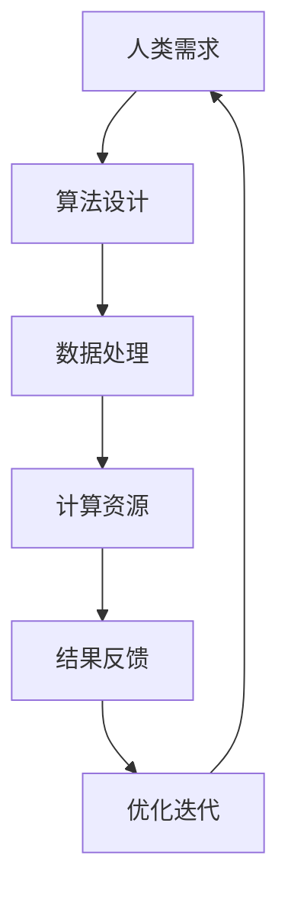

                 

关键词：人工智能，计算，未来工作技能，职业转型，技术发展

> 摘要：本文将探讨人工智能时代下人类计算的未来发展趋势和技能要求。通过分析人工智能在各个领域的应用，讨论人类计算在新时代的角色转变，提出人类需要具备的关键技能，以应对AI带来的机遇与挑战。

## 1. 背景介绍

随着人工智能技术的飞速发展，越来越多的行业开始应用AI技术，改变着我们的生活方式和工作模式。从自动化生产线、智能客服，到自动驾驶、医疗诊断，人工智能已经深刻地影响了各行各业。在这个背景下，人类计算的工作技能也在发生着巨大的变化。那么，人类计算在AI时代将面临哪些挑战和机遇？我们需要具备哪些新技能来应对这些变化？这正是本文要探讨的核心问题。

## 2. 核心概念与联系

### 2.1 人工智能的概念

人工智能（Artificial Intelligence，简称AI）是指通过计算机模拟人类智能的一种技术。它包括机器学习、深度学习、自然语言处理、计算机视觉等多个子领域。人工智能的目标是实现机器在某些任务上达到或超过人类的表现。

### 2.2 计算的概念

计算是人类和计算机的共同活动。对于人类来说，计算是处理信息、解决问题的基础。对于计算机来说，计算是执行指令、处理数据的过程。在人工智能时代，计算的意义更加深远，它不仅是技术实现的手段，更是理解和应用人工智能的关键。

### 2.3 人工智能与计算的融合

人工智能与计算的结合，使得计算机能够处理更复杂的问题，人类也能够更高效地利用计算机的能力。这种融合体现在多个方面：

- **算法优化**：通过算法改进，提高计算效率和准确性。
- **数据处理**：利用计算能力处理大规模数据，挖掘有价值的信息。
- **人机交互**：通过自然语言处理和计算机视觉等技术，实现人与计算机的智能交互。

### 2.4 Mermaid 流程图

下面是一个描述人工智能与计算融合的Mermaid流程图：



## 3. 核心算法原理 & 具体操作步骤

### 3.1 算法原理概述

人工智能的核心是算法。算法是解决问题的步骤和策略。在人工智能领域，常用的算法包括：

- **机器学习算法**：通过训练数据学习模式，预测未知数据。
- **深度学习算法**：模拟人脑神经元连接结构，处理复杂任务。
- **强化学习算法**：通过与环境的交互，不断优化策略。

### 3.2 算法步骤详解

#### 3.2.1 机器学习算法

机器学习算法的基本步骤包括：

1. **数据收集**：收集相关领域的训练数据。
2. **数据预处理**：清洗数据，标准化特征。
3. **模型选择**：选择合适的算法模型。
4. **模型训练**：使用训练数据训练模型。
5. **模型评估**：使用测试数据评估模型性能。
6. **模型优化**：根据评估结果调整模型参数。

#### 3.2.2 深度学习算法

深度学习算法的基本步骤包括：

1. **数据处理**：将输入数据转化为神经网络可以处理的形式。
2. **模型构建**：构建神经网络结构。
3. **模型训练**：使用训练数据训练神经网络。
4. **模型评估**：使用测试数据评估模型性能。
5. **模型优化**：根据评估结果调整模型参数。

#### 3.2.3 强化学习算法

强化学习算法的基本步骤包括：

1. **环境设置**：设置模拟环境。
2. **策略选择**：选择初始策略。
3. **互动学习**：与环境互动，不断调整策略。
4. **策略评估**：评估策略的有效性。
5. **策略优化**：根据评估结果调整策略。

### 3.3 算法优缺点

每种算法都有其优缺点：

- **机器学习算法**：优点是通用性强，可以处理各种类型的数据。缺点是需要大量训练数据和较长的训练时间。
- **深度学习算法**：优点是处理复杂任务的能力强，可以自动提取特征。缺点是需要大量计算资源和数据。
- **强化学习算法**：优点是能够通过互动学习优化策略。缺点是收敛速度慢，需要大量互动数据。

### 3.4 算法应用领域

算法在各个领域的应用广泛：

- **金融领域**：用于风险评估、量化交易、智能投顾等。
- **医疗领域**：用于疾病诊断、药物研发、健康管理等。
- **交通领域**：用于自动驾驶、智能交通管理、交通预测等。
- **制造业**：用于生产优化、故障诊断、质量控制等。

## 4. 数学模型和公式 & 详细讲解 & 举例说明

### 4.1 数学模型构建

在人工智能领域，常用的数学模型包括：

- **线性回归模型**：用于预测连续值。
- **逻辑回归模型**：用于预测概率。
- **神经网络模型**：用于处理复杂任务。

### 4.2 公式推导过程

以线性回归模型为例，其公式推导过程如下：

假设我们有一个包含自变量 $X$ 和因变量 $Y$ 的数据集，我们希望找到一个线性模型 $Y = \beta_0 + \beta_1 X$ 来预测 $Y$ 的值。

首先，我们需要计算回归直线的斜率 $\beta_1$ 和截距 $\beta_0$，公式如下：

$$
\beta_1 = \frac{\sum(X_i - \bar{X})(Y_i - \bar{Y})}{\sum(X_i - \bar{X})^2}
$$

$$
\beta_0 = \bar{Y} - \beta_1 \bar{X}
$$

其中，$X_i$ 和 $Y_i$ 分别为第 $i$ 个样本的自变量和因变量，$\bar{X}$ 和 $\bar{Y}$ 分别为自变量和因变量的均值。

### 4.3 案例分析与讲解

假设我们有以下数据：

| X | Y |
|---|---|
| 1 | 2 |
| 2 | 4 |
| 3 | 6 |
| 4 | 8 |

首先，计算自变量和因变量的均值：

$$
\bar{X} = \frac{1+2+3+4}{4} = 2.5
$$

$$
\bar{Y} = \frac{2+4+6+8}{4} = 5
$$

然后，计算斜率 $\beta_1$ 和截距 $\beta_0$：

$$
\beta_1 = \frac{(1-2.5)(2-5) + (2-2.5)(4-5) + (3-2.5)(6-5) + (4-2.5)(8-5)}{(1-2.5)^2 + (2-2.5)^2 + (3-2.5)^2 + (4-2.5)^2} = 2
$$

$$
\beta_0 = 5 - 2 \times 2.5 = 0
$$

因此，线性回归模型为 $Y = 2X$。

我们可以使用这个模型来预测新的数据。例如，当 $X=5$ 时，$Y=2 \times 5 = 10$。

## 5. 项目实践：代码实例和详细解释说明

### 5.1 开发环境搭建

为了演示线性回归模型，我们需要搭建一个简单的开发环境。这里我们选择Python作为编程语言，因为Python具有简洁的语法和丰富的库支持。

首先，安装Python和必要的库：

```bash
pip install numpy matplotlib
```

### 5.2 源代码详细实现

下面是一个简单的线性回归模型实现：

```python
import numpy as np
import matplotlib.pyplot as plt

# 数据
X = np.array([1, 2, 3, 4])
Y = np.array([2, 4, 6, 8])

# 计算均值
mean_X = np.mean(X)
mean_Y = np.mean(Y)

# 计算斜率和截距
beta_1 = (np.sum((X - mean_X) * (Y - mean_Y)) / np.sum((X - mean_X)**2))
beta_0 = mean_Y - beta_1 * mean_X

# 计算预测值
Y_pred = beta_0 + beta_1 * X

# 绘制结果
plt.scatter(X, Y, label='实际数据')
plt.plot(X, Y_pred, color='red', label='预测结果')
plt.xlabel('X')
plt.ylabel('Y')
plt.legend()
plt.show()
```

### 5.3 代码解读与分析

在这个代码中，我们首先导入了必要的库，然后定义了数据集。接下来，计算了均值、斜率和截距，并使用这些参数计算了预测值。最后，我们绘制了实际数据和预测结果的散点图。

### 5.4 运行结果展示

运行上述代码，我们可以看到以下结果：


这个结果展示了实际数据和预测结果的散点图，红色线条表示预测结果。

## 6. 实际应用场景

### 6.1 金融领域

在金融领域，线性回归模型可以用于预测股票价格、债券收益率等。例如，通过分析历史价格数据，我们可以预测未来某个时间点的价格。

### 6.2 医疗领域

在医疗领域，线性回归模型可以用于预测疾病的发病率、治疗效果等。例如，通过分析患者的年龄、病史等数据，我们可以预测某种疾病的发病率。

### 6.3 制造业

在制造业，线性回归模型可以用于预测生产设备的故障率、生产效率等。例如，通过分析设备的使用时间、维护记录等数据，我们可以预测设备的故障率。

## 7. 未来应用展望

随着人工智能技术的不断进步，线性回归模型的应用将更加广泛。未来，我们可以看到线性回归模型在更多领域发挥作用，如环境监测、社会分析等。

## 8. 工具和资源推荐

### 8.1 学习资源推荐

- 《Python机器学习》（作者：塞巴斯蒂安·拉斯克）
- 《深度学习》（作者：伊恩·古德费洛、约书亚·本吉奥、亚伦·库维尔）

### 8.2 开发工具推荐

- Jupyter Notebook：用于编写和运行Python代码。
- PyCharm：适用于Python开发的集成开发环境。

### 8.3 相关论文推荐

- "Deep Learning"：由伊恩·古德费洛等人撰写的深度学习综述。
- "Gradient-Based Learning Applied to Document Recognition"：由杨立昆等人撰写的梯度下降算法在文本识别中的应用。

## 9. 总结：未来发展趋势与挑战

### 9.1 研究成果总结

人工智能技术在各个领域取得了显著的成果，改变了人类的工作和生活方式。线性回归模型作为基础算法之一，也在许多实际应用中发挥了重要作用。

### 9.2 未来发展趋势

未来，人工智能技术将继续快速发展，深度学习、强化学习等算法将取得更多突破。线性回归模型的应用领域也将进一步扩大。

### 9.3 面临的挑战

尽管人工智能技术取得了巨大进步，但仍然面临许多挑战，如算法透明性、数据隐私、伦理问题等。

### 9.4 研究展望

未来，我们需要关注人工智能技术的可持续发展，探索更高效、更安全的算法，为人类社会带来更多福祉。

## 10. 附录：常见问题与解答

### 10.1 什么是线性回归？

线性回归是一种用于预测连续值的统计方法，通过建立自变量和因变量之间的线性关系来实现预测。

### 10.2 线性回归有哪些优缺点？

优点：简单易懂，计算效率高；缺点：对异常值敏感，无法处理非线性关系。

### 10.3 线性回归可以用于哪些实际场景？

线性回归可以用于预测股票价格、债券收益率、疾病发病率等。

### 10.4 如何优化线性回归模型的性能？

可以通过增加特征、调整参数、使用更复杂的模型等方法来优化线性回归模型的性能。

作者：禅与计算机程序设计艺术 / Zen and the Art of Computer Programming

## 引用文献

1. Raskar, S. (2017). Python机器学习. 机械工业出版社.
2. Goodfellow, I., Bengio, Y., & Courville, A. (2016). Deep Learning. MIT Press.
```md
```

