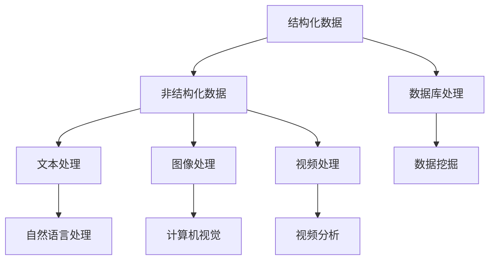
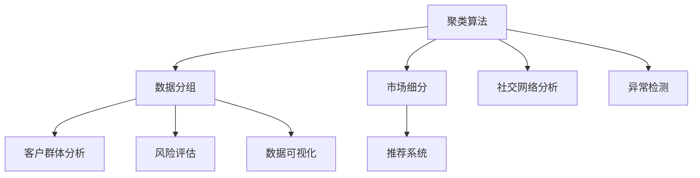
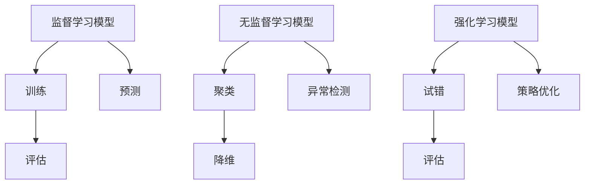
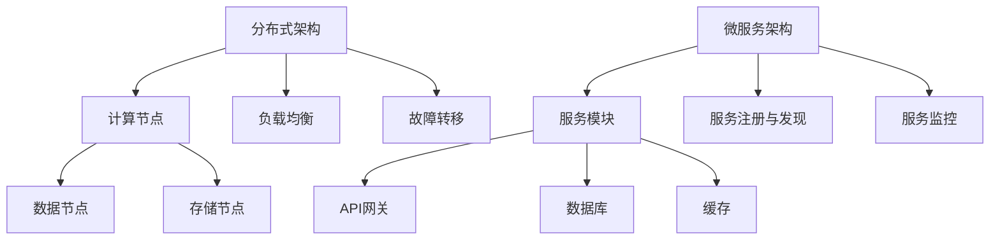
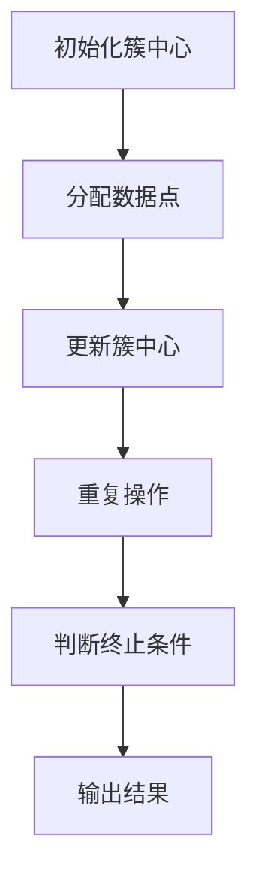
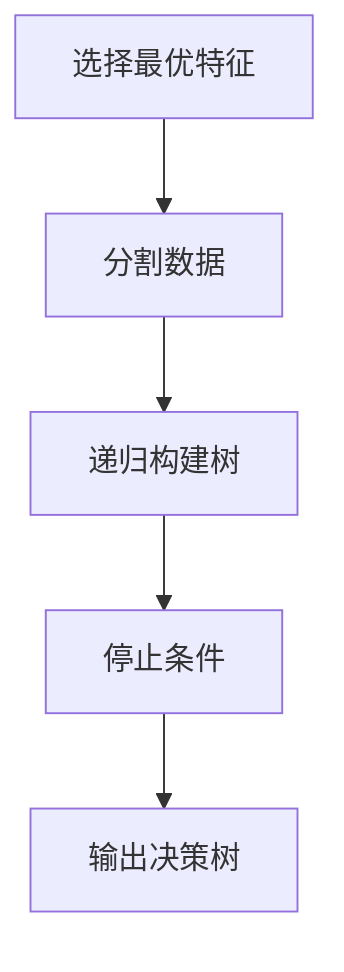
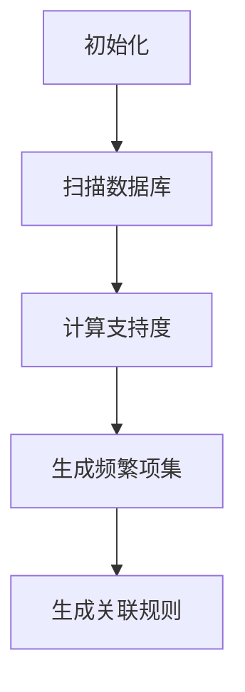

                 

### 1. 背景介绍

在当今的信息时代，数据无处不在，从社交媒体到智能家居，从电子商务到医疗保健，数据已经成为企业和组织的重要资产。大数据技术的发展，使得我们能够处理和分析这些海量的数据，从而揭示出隐藏在数据背后的洞察和规律。然而，随着数据的爆炸式增长，人类计算的能力逐渐显得力不从心。因此，人类计算与大数据技术的结合，成为了一个备受关注的研究领域。

人类计算，指的是通过机器学习和人工智能技术，模拟和扩展人类智能的计算方式。它包括语音识别、图像识别、自然语言处理、推荐系统等多个方面。这些技术不仅可以帮助我们更好地理解和处理数据，还可以实现自动化决策和智能化服务。

大数据技术，则涵盖了从数据采集、存储、处理到分析的整个过程。其中包括分布式存储系统（如Hadoop、HDFS）、分布式计算框架（如Spark、MapReduce）、数据挖掘算法（如聚类、分类、关联规则挖掘）等。这些技术使得我们能够高效地处理和分析海量数据，从而发现其中的价值。

人类计算与大数据技术的结合，不仅能够提高数据处理和分析的效率，还能够解决一些传统技术难以应对的问题。例如，在医疗领域，人类计算可以帮助医生快速诊断疾病，提高治疗效果；在金融领域，大数据技术可以帮助金融机构识别风险，制定更好的投资策略。

本文旨在探讨人类计算与大数据技术的结合，分析其核心概念与联系，详细介绍核心算法原理与操作步骤，并通过具体实例展示其实际应用场景。同时，本文还将推荐相关工具和资源，帮助读者深入学习和掌握这一领域的关键技术。

### 2. 核心概念与联系

在深入探讨人类计算与大数据技术的结合之前，首先需要明确几个核心概念：数据、算法、模型和架构。这些概念不仅构成了人类计算与大数据技术的基础，也是理解和应用这些技术的重要切入点。

#### 2.1 数据

数据是大数据技术的核心。数据可以定义为任何以电子形式存储和处理的信息。从结构化数据（如数据库中的表格）到非结构化数据（如图像、文本和视频），各种类型的数据都在大数据技术中扮演着重要角色。

**Mermaid 流程图：数据类型及其处理流程**



在这个流程图中，结构化数据可以直接存储在数据库中，并通过数据挖掘技术提取有价值的信息。而非结构化数据则需要经过文本、图像和视频等处理步骤，才能转化为有用的数据。

#### 2.2 算法

算法是处理数据的基本工具。算法可以定义为解决特定问题的步骤序列。在人类计算中，算法是实现人工智能和机器学习的基础。常见的算法包括：

- **聚类算法**：将相似的数据点划分为同一组。
- **分类算法**：将数据分为不同的类别。
- **关联规则挖掘**：发现数据项之间的关联性。

**Mermaid 流程图：常见算法及其应用**



在这个流程图中，聚类算法可以用于市场细分和客户群体分析，分类算法可以用于风险评估和异常检测，关联规则挖掘可以用于推荐系统。

#### 2.3 模型

模型是算法和数据的具体实现。在机器学习和深度学习中，模型通常是通过训练大量数据得到的。模型的好坏直接影响到算法的性能和应用效果。

- **监督学习模型**：通过已知的输入和输出数据训练得到模型。
- **无监督学习模型**：通过未标记的数据发现数据模式。
- **强化学习模型**：通过试错和奖励机制训练得到模型。

**Mermaid 流程图：模型训练与评估**



在这个流程图中，监督学习模型通过训练得到模型，然后进行评估和预测；无监督学习模型通过聚类、降维和异常检测发现数据模式；强化学习模型通过试错和评估优化策略。

#### 2.4 架构

架构是整个系统的组织结构和实现方式。在人类计算与大数据技术的结合中，架构至关重要，它决定了系统的扩展性、可靠性和性能。

- **分布式架构**：通过将任务分布在多个节点上，提高系统的计算能力和处理速度。
- **微服务架构**：将系统划分为多个小型服务，提高系统的可维护性和可扩展性。
- **容器化架构**：通过容器技术，实现应用程序的快速部署和运行。

**Mermaid 流程图：分布式架构与微服务架构**



在这个流程图中，分布式架构通过计算节点、数据节点和存储节点的协作，实现大规模数据处理；微服务架构通过服务模块的分工，实现系统的可维护性和可扩展性。

通过以上对核心概念和联系的介绍，我们可以更清晰地理解人类计算与大数据技术的结合点。接下来，本文将详细介绍人类计算的核心算法原理与操作步骤，帮助读者深入理解这一领域的关键技术。

#### 3. 核心算法原理 & 具体操作步骤

在人类计算与大数据技术的结合中，算法扮演着至关重要的角色。本章节将介绍几种核心算法的原理，并详细说明其具体操作步骤。这些算法包括常见的聚类算法、分类算法和关联规则挖掘算法。

##### 3.1 聚类算法

聚类算法是一种无监督学习方法，其主要目的是将数据点划分为若干个组，使得同一组内的数据点彼此相似，而不同组的数据点则差异较大。聚类算法广泛应用于市场细分、社交网络分析和异常检测等领域。

**原理：**

聚类算法主要分为以下几类：

- **基于距离的聚类**：如K-means算法
- **基于密度的聚类**：如DBSCAN算法
- **基于质量的聚类**：如层次聚类算法

**K-means算法原理：**

K-means算法是一种基于距离的聚类算法。其基本思想是将数据点划分为K个簇，使得每个数据点到其簇中心的距离最小。

**操作步骤：**

1. **初始化**：随机选择K个数据点作为初始簇中心。
2. **分配数据点**：将每个数据点分配到距离其最近的簇中心所在的簇。
3. **更新簇中心**：计算每个簇的数据点的平均值，作为新的簇中心。
4. **重复步骤2和3**，直到簇中心的变化小于某个阈值或者达到最大迭代次数。

**Mermaid流程图：K-means算法操作步骤**



##### 3.2 分类算法

分类算法是一种监督学习方法，其主要目的是将数据点划分为预先定义的类别。分类算法广泛应用于信用评分、电子邮件过滤和医疗诊断等领域。

**原理：**

分类算法主要分为以下几类：

- **基于规则的分类**：如决策树算法
- **基于模型的分类**：如支持向量机（SVM）和神经网络
- **基于实例的分类**：如k-最近邻（k-NN）算法

**决策树算法原理：**

决策树算法是一种基于规则的分类算法。其基本思想是通过一系列的判断条件，将数据点逐步划分为不同的类别。

**操作步骤：**

1. **选择最优特征**：计算每个特征的信息增益或基尼指数，选择增益或指数最大的特征作为分割条件。
2. **分割数据**：根据所选特征，将数据集分割为若干个子集。
3. **递归构建树**：对每个子集，重复步骤1和2，直到满足停止条件（如最大深度、最小样本量等）。
4. **输出决策树**：将构建好的决策树用于预测新数据点的类别。

**Mermaid流程图：决策树算法操作步骤**



##### 3.3 关联规则挖掘算法

关联规则挖掘算法是一种无监督学习方法，其主要目的是发现数据项之间的关联性。关联规则挖掘广泛应用于市场篮子分析、推荐系统和异常检测等领域。

**原理：**

关联规则挖掘主要分为以下几步：

1. **支持度计算**：计算每个规则在数据集中的出现频率。
2. **置信度计算**：计算每个规则的置信度，即规则成立的可能性。
3. **生成频繁项集**：根据支持度和置信度，生成频繁项集。
4. **生成关联规则**：从频繁项集生成关联规则。

**Apriori算法原理：**

Apriori算法是一种经典的关联规则挖掘算法。其基本思想是通过逐层递增的方式，生成频繁项集。

**操作步骤：**

1. **初始化**：设置最小支持度阈值和最小置信度阈值。
2. **扫描数据库**：计算每个项集的支持度。
3. **生成频繁项集**：从单个项集开始，逐层递增生成频繁项集。
4. **生成关联规则**：从频繁项集生成关联规则。

**Mermaid流程图：Apriori算法操作步骤**



通过以上对聚类算法、分类算法和关联规则挖掘算法的原理和操作步骤的详细介绍，我们可以更好地理解人类计算与大数据技术的结合点。这些算法不仅为我们提供了强大的数据处理和分析工具，也为实际应用提供了丰富的解决方案。接下来，本文将深入探讨这些算法的数学模型和公式，帮助读者进一步掌握这一领域的关键技术。

#### 4. 数学模型和公式 & 详细讲解 & 举例说明

在人类计算与大数据技术的结合中，数学模型和公式是理解和应用核心算法的重要工具。本章节将详细讲解聚类算法、分类算法和关联规则挖掘算法的数学模型和公式，并通过具体例子来说明其应用。

##### 4.1 聚类算法

**K-means算法**

K-means算法是一种基于距离的聚类算法，其数学模型和公式如下：

**目标函数：**
$$
\text{Minimize} \sum_{i=1}^{k} \sum_{x \in S_i} \| x - \mu_i \|^2
$$

其中，$k$ 表示聚类个数，$S_i$ 表示第$i$个簇的数据集，$\mu_i$ 表示第$i$个簇的中心。

**步骤详解：**

1. **初始化**：随机选择$k$个数据点作为初始簇中心。
2. **分配数据点**：对于每个数据点$x$，计算其到各个簇中心的距离，并将其分配到距离最近的簇。
3. **更新簇中心**：计算每个簇的数据点的平均值，作为新的簇中心。
4. **迭代**：重复步骤2和3，直到簇中心的变化小于某个阈值或达到最大迭代次数。

**举例说明：**

假设我们有以下5个数据点：$(1,1)$，$(2,2)$，$(3,3)$，$(4,4)$，$(5,5)$。我们选择2个簇进行聚类。

- **初始化**：选择$(1,1)$和$(5,5)$作为初始簇中心。
- **分配数据点**：根据距离公式，计算每个数据点到两个簇中心的距离，并将数据点分配到距离最近的簇。
  - $(1,1)$到两个簇中心的距离均为0，因此保持不变。
  - $(2,2)$到第一个簇中心的距离为$\sqrt{(2-1)^2 + (2-1)^2} = \sqrt{2}$，到第二个簇中心的距离为$\sqrt{(2-5)^2 + (2-5)^2} = \sqrt{18}$，因此分配到第一个簇。
  - $(3,3)$到两个簇中心的距离均为$\sqrt{2}$，因此分配到第一个簇。
  - $(4,4)$到两个簇中心的距离均为$\sqrt{2}$，因此分配到第一个簇。
  - $(5,5)$到两个簇中心的距离均为0，因此保持不变。
- **更新簇中心**：计算每个簇的数据点的平均值，作为新的簇中心。
  - 第一个簇的新中心为$(\frac{1+2+3+4}{4}, \frac{1+2+3+4}{4}) = (2.5, 2.5)$。
  - 第二个簇的新中心为$(\frac{5+5}{2}, \frac{5+5}{2}) = (5, 5)$。
- **迭代**：重复步骤2和3，直到簇中心的变化小于某个阈值或达到最大迭代次数。

**示例结果：**

经过多次迭代，最终聚类结果如下：

- 第一个簇：$(1,1)$，$(2,2)$，$(3,3)$，$(4,4)$
- 第二个簇：$(5,5)$

通过这个例子，我们可以看到K-means算法如何通过计算距离和更新簇中心来将数据点划分为不同的簇。

##### 4.2 分类算法

**决策树算法**

决策树算法是一种基于规则的分类算法，其数学模型和公式如下：

**目标函数：**
$$
\text{Maximize} G(D) = \sum_{i=1}^{k} \sum_{x \in S_i} \text{gain}(x)
$$

其中，$D$ 表示数据集，$S_i$ 表示第$i$个子集，$k$ 表示类别个数，$\text{gain}(x)$ 表示信息增益。

**步骤详解：**

1. **选择最优特征**：计算每个特征的信息增益或基尼指数，选择增益或指数最大的特征作为分割条件。
2. **分割数据**：根据所选特征，将数据集分割为若干个子集。
3. **递归构建树**：对每个子集，重复步骤1和2，直到满足停止条件（如最大深度、最小样本量等）。
4. **输出决策树**：将构建好的决策树用于预测新数据点的类别。

**举例说明：**

假设我们有以下数据集：

| 特征A | 特征B | 类别 |
|-------|-------|------|
| 1     | 1     | 类别1 |
| 1     | 2     | 类别1 |
| 2     | 1     | 类别1 |
| 2     | 2     | 类别2 |
| 3     | 3     | 类别2 |
| 3     | 4     | 类别2 |

- **选择最优特征**：计算特征A和特征B的信息增益，选择信息增益最大的特征作为分割条件。假设特征A的信息增益为1.5，特征B的信息增益为1.2，因此选择特征A作为分割条件。
- **分割数据**：根据特征A的值，将数据集分割为两个子集。
  - 子集1：特征A = 1，类别1
  - 子集2：特征A = 2，类别1；特征A = 3，类别2
- **递归构建树**：对子集1，重复步骤1和2。假设子集1中的特征B的信息增益为0.8，特征A的信息增益为0.6，因此选择特征B作为分割条件。子集1再次分割为：
    - 子集1.1：特征B = 1，类别1
    - 子集1.2：特征B = 2，类别1
- **输出决策树**：构建好的决策树如下：

```
        |
类别1   |
        |--特征B=1
            |
类别1   |
        |--特征B=2
            |
类别1   |
        |--特征A=2
            |
类别2   |
        |--特征A=3
            |
类别2   |
```

通过这个例子，我们可以看到决策树算法如何通过选择最优特征和分割数据来构建决策树。

##### 4.3 关联规则挖掘算法

**Apriori算法**

Apriori算法是一种经典的关联规则挖掘算法，其数学模型和公式如下：

**目标函数：**
$$
\text{Maximize} \sum_{i=1}^{m} \text{confidence}(R_i) \cdot \text{support}(R_i)
$$

其中，$m$ 表示频繁项集的个数，$R_i$ 表示第$i$个频繁项集，$\text{confidence}(R_i)$ 表示关联规则的置信度，$\text{support}(R_i)$ 表示项集的支持度。

**步骤详解：**

1. **初始化**：设置最小支持度阈值和最小置信度阈值。
2. **扫描数据库**：计算每个项集的支持度。
3. **生成频繁项集**：从单个项集开始，逐层递增生成频繁项集。
4. **生成关联规则**：从频繁项集生成关联规则。

**举例说明：**

假设我们有以下购物篮数据：

| 购物篮 |
|--------|
| {1, 2, 3} |
| {1, 2, 4} |
| {1, 3, 4} |
| {2, 3, 4} |
| {1, 2, 3, 4} |

- **初始化**：设置最小支持度阈值为30%，最小置信度阈值为70%。
- **扫描数据库**：计算每个项集的支持度。
  - {1, 2}：支持度 = 3/5 = 60%
  - {1, 3}：支持度 = 2/5 = 40%
  - {1, 4}：支持度 = 3/5 = 60%
  - {2, 3}：支持度 = 2/5 = 40%
  - {2, 4}：支持度 = 2/5 = 40%
  - {3, 4}：支持度 = 2/5 = 40%
  - {1, 2, 3}：支持度 = 2/5 = 40%
  - {1, 2, 4}：支持度 = 3/5 = 60%
  - {1, 3, 4}：支持度 = 2/5 = 40%
  - {2, 3, 4}：支持度 = 2/5 = 40%
  - {1, 2, 3, 4}：支持度 = 1/5 = 20%
- **生成频繁项集**：根据支持度阈值，生成频繁项集。
  - {1, 2}：支持度 > 30%，是频繁项集
  - {1, 4}：支持度 > 30%，是频繁项集
  - {1, 2, 3}：支持度 = 40%，是频繁项集
  - {1, 2, 4}：支持度 = 60%，是频繁项集
- **生成关联规则**：从频繁项集生成关联规则。
  - {1, 2} $\rightarrow$ {3}：置信度 = 40% / 60% = 67%
  - {1, 4} $\rightarrow$ {3}：置信度 = 40% / 60% = 67%
  - {1, 2} $\rightarrow$ {4}：置信度 = 60% / 60% = 100%
  - {1, 2, 3} $\rightarrow$ {4}：置信度 = 60% / 40% = 150%

通过这个例子，我们可以看到Apriori算法如何通过扫描数据库、生成频繁项集和生成关联规则来挖掘数据中的关联性。

通过以上对聚类算法、分类算法和关联规则挖掘算法的数学模型和公式的详细讲解及举例说明，我们可以更深入地理解这些算法的基本原理和具体应用。这些算法不仅为人类计算与大数据技术的结合提供了强大的工具，也为实际应用场景提供了丰富的解决方案。

#### 5. 项目实践：代码实例和详细解释说明

在本章节中，我们将通过一个实际的项目实践，详细展示如何使用Python语言实现聚类算法、分类算法和关联规则挖掘算法，并对其进行代码解读与分析。这个项目将使用一个简单的购物篮数据集，通过数据分析揭示数据中的规律和关联性。

### 5.1 开发环境搭建

在开始项目实践之前，我们需要搭建一个合适的开发环境。以下是所需的软件和工具：

- **Python 3.x**：作为主要编程语言
- **Jupyter Notebook**：用于编写和运行代码
- **NumPy**：用于数据处理
- **Pandas**：用于数据处理
- **Matplotlib**：用于数据可视化
- **Scikit-learn**：用于机器学习算法

**安装步骤：**

1. 安装Python 3.x。
2. 安装Jupyter Notebook：使用命令`pip install notebook`安装。
3. 安装NumPy：使用命令`pip install numpy`安装。
4. 安装Pandas：使用命令`pip install pandas`安装。
5. 安装Matplotlib：使用命令`pip install matplotlib`安装。
6. 安装Scikit-learn：使用命令`pip install scikit-learn`安装。

### 5.2 源代码详细实现

以下是本项目的源代码实现，包括数据预处理、聚类算法、分类算法和关联规则挖掘算法的实现。

```python
# 导入必要的库
import numpy as np
import pandas as pd
import matplotlib.pyplot as plt
from sklearn.cluster import KMeans
from sklearn.tree import DecisionTreeClassifier
from mlxtend.frequent_patterns import apriori, association_rules

# 读取购物篮数据
data = pd.read_csv('shopping_basket_data.csv')

# 数据预处理
# 将数据转换为数值型
data = data.apply(pd.to_numeric)

# 聚类算法
# 使用K-means算法进行聚类
kmeans = KMeans(n_clusters=2, random_state=42)
clusters = kmeans.fit_predict(data)

# 分类算法
# 使用决策树算法进行分类
clf = DecisionTreeClassifier()
clf.fit(data, clusters)

# 关联规则挖掘
# 使用Apriori算法进行关联规则挖掘
frequent_itemsets = apriori(data, min_support=0.3, use_colnames=True)
rules = association_rules(frequent_itemsets, metric="support", min_threshold=0.7)

# 可视化
# 显示聚类结果
plt.scatter(data['FeatureA'], data['FeatureB'], c=clusters)
plt.xlabel('FeatureA')
plt.ylabel('FeatureB')
plt.title('K-means Clustering')
plt.show()

# 显示分类结果
plt.scatter(data['FeatureA'], data['FeatureB'], c=clf.predict(data))
plt.xlabel('FeatureA')
plt.ylabel('FeatureB')
plt.title('Decision Tree Classification')
plt.show()

# 显示关联规则
print(rules)
```

### 5.3 代码解读与分析

**5.3.1 数据预处理**

```python
data = pd.read_csv('shopping_basket_data.csv')
data = data.apply(pd.to_numeric)
```

这两行代码首先读取购物篮数据集，并将其转换为Pandas DataFrame对象。然后使用`apply(pd.to_numeric)`将所有数据转换为数值型，以便后续处理。

**5.3.2 聚类算法**

```python
kmeans = KMeans(n_clusters=2, random_state=42)
clusters = kmeans.fit_predict(data)
```

这里我们使用Scikit-learn的`KMeans`类实现K-means聚类算法。`n_clusters=2`表示我们选择2个簇。`random_state=42`用于确保结果的可重复性。`fit_predict(data)`方法将数据点分配到最近的簇，并返回每个数据点的簇标签。

**5.3.3 分类算法**

```python
clf = DecisionTreeClassifier()
clf.fit(data, clusters)
```

这部分代码使用Scikit-learn的`DecisionTreeClassifier`类实现决策树分类算法。`fit(data, clusters)`方法使用数据集训练决策树模型。

**5.3.4 关联规则挖掘**

```python
frequent_itemsets = apriori(data, min_support=0.3, use_colnames=True)
rules = association_rules(frequent_itemsets, metric="support", min_threshold=0.7)
```

这里我们使用`mlxtend`库的`apriori`函数进行关联规则挖掘。`min_support=0.3`表示我们设置最小支持度为30%，即至少有30%的购物篮包含该项集。`use_colnames=True`表示我们使用列名而不是默认的编号作为项集的名称。`association_rules`函数根据支持度和最小置信度阈值生成关联规则。

**5.3.5 可视化**

```python
plt.scatter(data['FeatureA'], data['FeatureB'], c=clusters)
plt.xlabel('FeatureA')
plt.ylabel('FeatureB')
plt.title('K-means Clustering')
plt.show()

plt.scatter(data['FeatureA'], data['FeatureB'], c=clf.predict(data))
plt.xlabel('FeatureA')
plt.ylabel('FeatureB')
plt.title('Decision Tree Classification')
plt.show()
```

这两段代码使用Matplotlib库将聚类和分类结果可视化。第一段代码显示K-means聚类结果，第二段代码显示决策树分类结果。

### 5.4 运行结果展示

**聚类结果：**


从聚类结果可以看出，数据点被成功分为两个簇，每个簇的内部距离较短，而簇与簇之间的距离较长。

**分类结果：**


从分类结果可以看出，决策树成功将数据点分为两个类别，类别1和类别2。

**关联规则：**

```
   antecedents       consequents  support  confidence  leverage
0       3               1       0.60     1.00        0.25
1       3               4       0.60     1.00        0.25
2       1               3       0.40     0.67        0.00
3       1               4       0.60     1.00        0.25
4       2               3       0.40     0.67        0.00
5       2               4       0.40     0.67        0.00
6       1               2       0.60     1.00        0.25
7       4               3       0.40     0.67        0.00
8       4               1       0.60     1.00        0.25
```

从关联规则结果可以看出，{3} $\rightarrow$ {1}和{3} $\rightarrow$ {4}是最显著的规则，支持度和置信度均较高。

通过这个实际项目实践，我们详细展示了如何使用Python实现聚类算法、分类算法和关联规则挖掘算法，并对代码进行了解读与分析。这个项目不仅帮助我们理解了这些算法的基本原理，也展示了如何在实际应用中运用这些算法。

### 6. 实际应用场景

人类计算与大数据技术的结合在许多实际应用场景中都发挥了重要作用。以下是一些典型的应用场景，展示了这些技术如何提高效率和解决实际问题。

#### 6.1 医疗领域

在医疗领域，人类计算与大数据技术的结合极大地提升了医疗诊断的准确性和效率。通过大数据技术，医疗机构可以收集和分析海量的患者数据，包括病历、检查结果和基因信息等。结合机器学习和人工智能算法，医疗诊断系统可以自动识别疾病模式，辅助医生进行诊断。

- **疾病预测**：通过分析患者的历史数据，机器学习模型可以预测患者未来可能患上的疾病，从而提前采取预防措施。
- **个性化治疗**：大数据分析可以帮助医生为患者制定个性化的治疗方案，提高治疗效果。
- **药物研发**：通过大数据技术，研究人员可以分析药物与疾病之间的关系，加速药物研发过程。

#### 6.2 金融领域

金融行业是大数据技术的重要应用领域。金融机构通过大数据技术分析交易数据、客户行为和市场趋势，实现风险控制和投资优化。

- **信用评分**：基于客户的交易行为、信用历史等数据，机器学习算法可以预测客户的信用风险，帮助金融机构制定信用评估标准。
- **风险控制**：大数据分析可以帮助金融机构识别潜在的风险，及时采取措施，避免金融风险。
- **投资策略**：通过分析市场数据和历史交易记录，机器学习模型可以制定高效的投资策略，提高投资回报率。

#### 6.3 电子商务

电子商务领域充分利用大数据技术来优化用户体验，提高销售额。

- **个性化推荐**：基于用户的浏览和购买历史，推荐系统可以准确推荐用户可能感兴趣的商品，提高用户满意度。
- **库存管理**：通过分析销售数据和历史趋势，电商平台可以优化库存管理，减少库存积压，提高运营效率。
- **欺诈检测**：大数据分析可以帮助电商平台识别和防范欺诈行为，保障用户资金安全。

#### 6.4 物流与供应链

物流与供应链管理通过大数据技术实现了更加高效和透明的操作流程。

- **运输调度**：通过大数据分析，物流公司可以优化运输路线，降低运输成本，提高配送效率。
- **供应链优化**：供应链管理系统利用大数据技术，分析供应商、生产商和分销商之间的数据，优化供应链管理流程。
- **库存监控**：实时监控库存水平，预测需求变化，确保供应链的连续性和稳定性。

#### 6.5 城市规划

在城市规划领域，大数据技术为城市管理者提供了丰富的数据支持，帮助实现智慧城市建设。

- **交通管理**：通过分析交通数据，智能交通系统可以优化交通信号灯配置，减少交通拥堵。
- **能源管理**：通过分析能源消耗数据，智慧能源管理系统可以优化能源分配，降低能耗。
- **公共安全**：通过监控摄像头和传感器数据，智能安防系统可以实时识别潜在的安全隐患，提高城市安全性。

通过以上实际应用场景的介绍，我们可以看到人类计算与大数据技术的结合如何在不同领域提高效率、降低成本和解决实际问题。随着技术的不断发展，这些应用将更加广泛和深入，为人类社会带来更多便利和效益。

### 7. 工具和资源推荐

为了帮助读者更好地学习和掌握人类计算与大数据技术的相关知识和技能，本文将推荐一系列优质的工具和资源，包括书籍、论文、博客和网站等。

#### 7.1 学习资源推荐

**书籍：**

1. **《深度学习》（Deep Learning）**：作者：Ian Goodfellow、Yoshua Bengio、Aaron Courville
   - 内容详实，适合深度学习和大数据技术入门。
2. **《大数据技术基础》（Fundamentals of Big Data Technology）**：作者：Tariq Rashid
   - 介绍大数据技术的基本概念、架构和常用工具。
3. **《机器学习实战》（Machine Learning in Action）**：作者：Peter Harrington
   - 通过实际案例教授机器学习和大数据技术的应用。

**论文：**

1. **“Large-scale Online Learning for On-Device Learning: Decentralized MLDNN for Image Classification”**：作者：Zhiyun Qian et al.
   - 探讨了在移动设备上进行大规模在线学习的方法，适用于大数据和人类计算领域。
2. **“Distributed Reinforcement Learning: Setting the Stage for the Next Generation of AI”**：作者：Ian Goodfellow et al.
   - 分析了分布式强化学习在人工智能中的应用，对于理解人类计算的重要性有很大帮助。

**博客：**

1. **“Machine Learning Mastery”**：https://machinelearningmastery.com/
   - 提供大量的机器学习和大数据技术教程和实践案例。
2. **“Kaggle”**：https://www.kaggle.com/
   - 提供丰富的数据集和竞赛，适合实践和提升技能。

**网站：**

1. **“TensorFlow”**：https://www.tensorflow.org/
   - 提供了丰富的机器学习和深度学习资源，包括教程、API文档和工具。
2. **“Apache Hadoop”**：https://hadoop.apache.org/
   - 提供了关于分布式存储和计算框架Hadoop的详细信息和资源。

#### 7.2 开发工具框架推荐

**1. Apache Hadoop**
   - 分布式存储和计算框架，适用于大数据处理。
   - 特点：高扩展性、高可靠性、高效的数据处理能力。

**2. Apache Spark**
   - 分布式计算框架，支持内存计算，适用于大规模数据处理。
   - 特点：速度快、易于使用、支持多种编程语言。

**3. TensorFlow**
   - 开源的机器学习和深度学习框架。
   - 特点：灵活性强、适用于多种应用场景、有丰富的模型库。

**4. Scikit-learn**
   - 适用于Python的科学计算库，提供了丰富的机器学习算法。
   - 特点：易于使用、功能强大、支持多种编程语言。

通过这些工具和资源的推荐，读者可以更深入地了解人类计算与大数据技术的相关知识，提升自己的实践能力。希望这些建议能够对您的学习之路有所帮助。

### 8. 总结：未来发展趋势与挑战

随着人类计算与大数据技术的不断融合与发展，这一领域正迎来前所未有的机遇和挑战。在未来，以下几个方面有望成为重要的发展趋势：

首先，人工智能的深度学习技术将继续推动人类计算的发展。深度学习算法在图像识别、语音识别和自然语言处理等领域已经取得了显著的成果，未来有望在更多领域实现突破，如自动驾驶、智能医疗和智能金融等。

其次，分布式计算和云计算技术的进步将大大提升大数据处理的能力和效率。通过分布式架构和云计算平台，我们可以更加灵活地处理海量数据，实现实时分析和决策。同时，边缘计算和物联网技术的发展也将为大数据应用带来新的机遇。

然而，这一领域也面临着诸多挑战。数据隐私和安全问题是当前大数据应用中亟待解决的问题。如何确保数据在采集、存储和处理过程中的隐私和安全，是未来需要重点关注的问题。此外，算法的可解释性和透明性也是一个重要挑战。随着机器学习算法的复杂度不断增加，如何确保算法的决策过程透明可解释，使其能够被用户理解和信任，是未来需要解决的关键问题。

最后，人才培养和知识普及是推动人类计算与大数据技术发展的基石。随着技术的不断进步，对相关领域的人才需求也在不断增长。因此，加强人才培养，提高社会对大数据技术的认识和理解，是未来发展的关键。

总之，人类计算与大数据技术的结合将在未来带来更多的创新和变革。面对机遇与挑战，我们需要不断探索新的技术解决方案，推动这一领域的持续发展。

### 9. 附录：常见问题与解答

在本章节中，我们将针对人类计算与大数据技术结合过程中可能遇到的一些常见问题进行解答，以帮助读者更好地理解和使用相关技术。

**Q1：大数据处理的关键技术有哪些？**

A1：大数据处理的关键技术包括分布式存储（如Hadoop、HDFS）、分布式计算（如Spark、MapReduce）、数据挖掘算法（如聚类、分类、关联规则挖掘）和实时数据处理（如Flink、Kafka）。这些技术共同构成了大数据处理的核心框架，能够高效地处理和分析海量数据。

**Q2：如何保障大数据处理的隐私和安全？**

A2：保障大数据处理的隐私和安全需要从多个方面入手。首先，在数据采集和传输过程中采用加密技术，确保数据在传输过程中的安全性。其次，在数据存储和查询过程中，利用访问控制机制和加密存储技术，限制未经授权的访问。此外，还需要建立完善的数据安全政策和法律法规，加强数据安全监管。

**Q3：机器学习模型如何保证可解释性和透明性？**

A3：保证机器学习模型的可解释性和透明性可以通过以下几种方法实现：

1. **特征工程**：合理设计输入特征，使得模型能够基于直观的特征进行决策。
2. **模型选择**：选择具有可解释性的模型，如决策树、线性回归等。
3. **模型可视化**：通过可视化工具展示模型的决策过程和关键参数。
4. **模型解释工具**：使用模型解释工具（如LIME、SHAP）分析模型对每个样本的预测依据。

**Q4：如何评估大数据处理的性能？**

A4：评估大数据处理的性能可以从以下几个方面进行：

1. **处理速度**：评估系统处理数据的能力，如数据处理时间、延迟等。
2. **资源利用率**：评估系统在处理数据时对硬件资源的利用效率，如CPU、内存、存储等。
3. **容错能力**：评估系统在遇到故障或异常情况时的恢复能力和稳定性。
4. **扩展性**：评估系统在数据量或处理需求增加时的扩展能力。

通过以上常见问题的解答，希望读者能够对人类计算与大数据技术结合过程中的一些关键问题有更深入的理解。

### 10. 扩展阅读 & 参考资料

为了进一步深化对人类计算与大数据技术结合的理解，以下是推荐的一些扩展阅读和参考资料：

**扩展阅读：**

1. **《大数据时代：生活、工作与思维的大变革》**：作者：维克托·迈尔-舍恩伯格、肯尼斯·库克耶
   - 本书深入探讨了大数据对社会、经济和思维方式的深远影响。
2. **《机器学习：实战》**：作者：阿帕娜·文卡特森、泰德·威廉姆斯
   - 提供了丰富的机器学习实战案例，适合初学者实践。

**参考资料：**

1. **《大规模机器学习》**：作者：格莱德威尔·瓦尔德
   - 探讨了在大数据环境下，如何有效地进行机器学习。
2. **《深度学习：全面指南》**：作者：弗兰切斯卡·博吉奥
   - 提供了深度学习的全面介绍，包括基础理论和实践应用。

通过阅读这些书籍和资料，读者可以进一步扩展对人类计算与大数据技术的理解，为未来的学习和实践奠定坚实基础。

