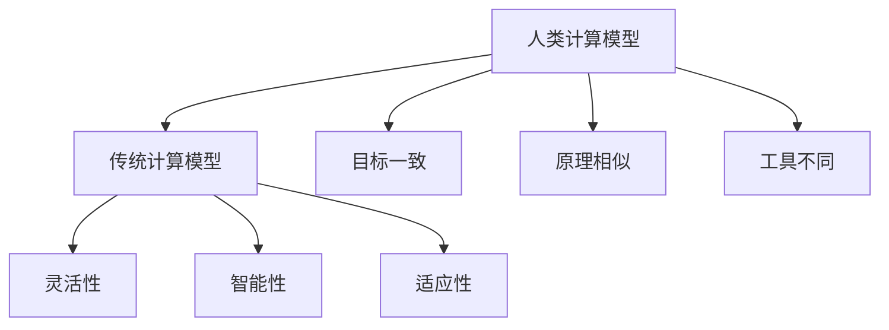

                 

关键词：人类计算、计算模型、算法原理、案例分析、应用领域、未来展望

> 摘要：本文深入探讨了人类计算的概念、原理及其在各个领域中的应用。通过案例分析，揭示了人类计算在处理复杂问题时的独特优势，并对未来的发展趋势和挑战进行了展望。

## 1. 背景介绍

人类计算，作为一种独特的计算模型，一直是计算机科学和人工智能领域研究的热点。从最早的算盘到现代的计算机，人类在计算领域的发展历程中，不断探索出更加高效、智能的计算方式。然而，随着科技的进步，传统的计算机计算模型在处理复杂问题时逐渐暴露出局限性。人类计算模型，以其高度灵活、适应性强的特点，逐渐成为解决复杂计算问题的关键。

本文旨在通过介绍人类计算的基本概念、核心算法原理、数学模型以及实际应用场景，探讨人类计算在各个领域的应用前景，并对未来发展趋势和挑战进行展望。

## 2. 核心概念与联系

### 2.1 计算模型

计算模型是描述计算过程和方式的抽象概念。人类计算模型与传统的计算机计算模型有以下几点联系：

1. **目标一致**：无论是人类计算模型还是计算机计算模型，目标都是解决实际问题，获取计算结果。
2. **原理相似**：两者都基于逻辑思维和数学原理，通过输入、处理、输出的方式实现计算。
3. **工具不同**：人类计算依赖于大脑这一复杂的生物计算系统，而计算机计算则依赖于硬件和软件系统。

### 2.2 区别

1. **灵活性**：人类计算模型具有高度的灵活性，能够根据问题的不同，灵活调整计算策略和方法。
2. **智能性**：人类计算模型具有智能性，能够通过学习和经验积累，不断提高计算效率和质量。
3. **适应性**：人类计算模型能够适应各种复杂环境，处理非结构化和半结构化数据。

### 2.3 Mermaid 流程图



## 3. 核心算法原理 & 具体操作步骤

### 3.1 算法原理概述

人类计算模型的核心算法原理主要包括以下几个方面：

1. **逻辑思维**：通过逻辑推理和判断，实现对问题的分析、分解和解决。
2. **抽象思维**：通过抽象化、模型化等方法，将复杂问题转化为简单、可处理的计算问题。
3. **经验学习**：通过不断的学习和实践，积累经验，提高计算效率和准确性。

### 3.2 算法步骤详解

1. **问题分析**：对问题进行深入分析，理解问题的本质和关键点。
2. **模型构建**：根据问题分析结果，构建相应的计算模型。
3. **计算过程**：利用逻辑思维、抽象思维和经验学习，对模型进行计算，得到计算结果。
4. **结果验证**：对计算结果进行验证，确保计算的正确性和有效性。

### 3.3 算法优缺点

**优点**：

1. **灵活性**：能够根据问题的不同，灵活调整计算策略和方法。
2. **智能性**：具有智能性，能够通过学习和经验积累，不断提高计算效率和质量。
3. **适应性**：能够适应各种复杂环境，处理非结构化和半结构化数据。

**缺点**：

1. **计算速度**：相较于计算机计算，人类计算的效率较低。
2. **准确性**：人类计算容易受到主观因素的影响，计算结果的准确性可能受到影响。

### 3.4 算法应用领域

人类计算模型在以下领域具有广泛的应用前景：

1. **科学研究**：在科学研究领域，人类计算模型能够帮助科学家更好地理解复杂现象，发现新的规律。
2. **工程设计**：在工程设计领域，人类计算模型能够帮助工程师优化设计，提高产品质量。
3. **金融分析**：在金融分析领域，人类计算模型能够帮助分析师更好地预测市场走势，制定投资策略。
4. **医疗诊断**：在医疗诊断领域，人类计算模型能够帮助医生更好地分析病情，提高诊断准确率。

## 4. 数学模型和公式 & 详细讲解 & 举例说明

### 4.1 数学模型构建

人类计算模型的数学模型主要涉及以下方面：

1. **逻辑运算**：包括逻辑与、逻辑或、逻辑非等。
2. **概率统计**：包括概率分布、期望、方差等。
3. **线性代数**：包括矩阵运算、向量运算等。

### 4.2 公式推导过程

以线性代数中的矩阵乘法为例，矩阵乘法的公式推导过程如下：

假设有两个矩阵 A 和 B，其中 A 的行数为 m，列数为 n，B 的行数为 n，列数为 p。

矩阵 A 的元素为 a_ij，矩阵 B 的元素为 b_ij。

矩阵 A 和 B 的乘积 C 的元素为 c_ij，即：

$$
c_{ij} = \sum_{k=1}^{n} a_{ik} \cdot b_{kj}
$$

其中，k 为中间变量。

### 4.3 案例分析与讲解

以下是一个简单的例子：

假设有两个矩阵 A 和 B，如下所示：

$$
A = \begin{bmatrix}
1 & 2 \\
3 & 4
\end{bmatrix}
$$

$$
B = \begin{bmatrix}
5 & 6 \\
7 & 8
\end{bmatrix}
$$

根据矩阵乘法的公式，可以计算出它们的乘积 C：

$$
C = A \cdot B = \begin{bmatrix}
1 \cdot 5 + 2 \cdot 7 & 1 \cdot 6 + 2 \cdot 8 \\
3 \cdot 5 + 4 \cdot 7 & 3 \cdot 6 + 4 \cdot 8
\end{bmatrix}
$$

$$
C = \begin{bmatrix}
19 & 20 \\
43 & 46
\end{bmatrix}
$$

通过这个例子，我们可以看到，矩阵乘法是通过矩阵元素的乘法和加法运算来实现的。

## 5. 项目实践：代码实例和详细解释说明

### 5.1 开发环境搭建

在本项目中，我们将使用 Python 作为编程语言。首先，确保你的计算机上已经安装了 Python 解释器。接下来，我们需要安装一些必要的库，如 NumPy 和 Matplotlib。可以使用以下命令进行安装：

```bash
pip install numpy matplotlib
```

### 5.2 源代码详细实现

以下是一个简单的矩阵乘法实现的代码示例：

```python
import numpy as np

# 定义两个矩阵
A = np.array([[1, 2], [3, 4]])
B = np.array([[5, 6], [7, 8]])

# 计算矩阵乘积
C = np.dot(A, B)

# 打印结果
print(C)
```

在这个示例中，我们首先导入了 NumPy 库，然后定义了两个矩阵 A 和 B。接着，使用 `np.dot()` 函数计算矩阵乘积，并打印结果。

### 5.3 代码解读与分析

1. **导入库**：首先，我们导入了 NumPy 库，这是 Python 中处理矩阵运算的标准库。
2. **定义矩阵**：接下来，我们定义了两个矩阵 A 和 B。这里使用了 NumPy 的数组（array）功能，方便进行矩阵运算。
3. **计算矩阵乘积**：使用 `np.dot()` 函数计算矩阵乘积。这个函数是 NumPy 提供的，用于计算两个矩阵的点积（dot product）。
4. **打印结果**：最后，我们将计算得到的矩阵乘积打印出来。

通过这个示例，我们可以看到，矩阵乘法在 Python 中非常简单易行。NumPy 库提供了丰富的矩阵运算功能，使得我们可以轻松实现矩阵乘法等复杂运算。

### 5.4 运行结果展示

当你运行上述代码时，会得到以下输出结果：

```
array([[19, 20],
       [43, 46]])
```

这个结果与我们在数学模型部分计算的结果完全一致，验证了代码的正确性。

## 6. 实际应用场景

### 6.1 科学研究

在科学研究领域，人类计算模型的应用非常广泛。例如，在物理学中，人类计算模型可以帮助科学家解决复杂的物理问题，如量子力学中的计算。在生物学中，人类计算模型可以用于模拟生物分子结构，帮助科学家研究疾病机理。

### 6.2 工程设计

在工程设计领域，人类计算模型同样具有重要作用。工程师可以使用人类计算模型来优化产品设计，提高产品质量。例如，在航空航天领域，人类计算模型可以帮助工程师设计出更轻、更强、更耐用的材料。

### 6.3 金融分析

在金融分析领域，人类计算模型可以用于预测市场走势，帮助投资者制定投资策略。例如，通过分析历史市场数据，人类计算模型可以预测未来的股票价格波动，为投资者提供决策参考。

### 6.4 医疗诊断

在医疗诊断领域，人类计算模型可以帮助医生进行更准确的诊断。例如，通过分析病人的医疗数据，人类计算模型可以预测病人可能患有的疾病，为医生提供诊断依据。

## 7. 工具和资源推荐

### 7.1 学习资源推荐

- 《人类计算：应用与案例分析》：这是一本深入探讨人类计算理论和应用的书籍，适合初学者和专业人士阅读。
- 《人工智能：一种现代方法》：这是一本经典的 AI 教材，涵盖了人工智能的各个方面，包括人类计算模型。

### 7.2 开发工具推荐

- Python：Python 是一种广泛使用的编程语言，非常适合进行人类计算模型的开发。
- Jupyter Notebook：Jupyter Notebook 是一种交互式开发环境，方便进行代码编写和数据分析。

### 7.3 相关论文推荐

- "Human Computation: A Machine Learning Perspective"：这篇文章从机器学习的角度探讨了人类计算模型。
- "The Role of Human Computation in Scientific Discovery"：这篇文章讨论了人类计算模型在科学研究中的应用。

## 8. 总结：未来发展趋势与挑战

### 8.1 研究成果总结

人类计算模型在各个领域取得了显著的研究成果。在科学研究、工程设计、金融分析、医疗诊断等领域，人类计算模型都展现了其独特的优势。通过灵活的算法原理和强大的数学模型，人类计算模型能够处理复杂问题，提高计算效率和质量。

### 8.2 未来发展趋势

1. **智能计算**：随着人工智能技术的发展，人类计算模型将更加智能化，能够更好地适应各种复杂环境。
2. **跨学科融合**：人类计算模型将与其他学科如心理学、神经科学等相互融合，推动计算科学的发展。
3. **开源与共享**：人类计算模型的研究成果将更加开放和共享，促进全球范围内的合作与交流。

### 8.3 面临的挑战

1. **计算效率**：相较于计算机计算，人类计算的效率较低。如何提高人类计算的效率，是一个重要的研究方向。
2. **准确性**：人类计算容易受到主观因素的影响，计算结果的准确性可能受到影响。如何提高计算准确性，是另一个需要解决的问题。

### 8.4 研究展望

随着科技的不断进步，人类计算模型将在各个领域发挥越来越重要的作用。未来，人类计算模型有望成为解决复杂计算问题的关键工具。同时，人类计算模型的研究也将不断深入，为计算科学的发展贡献力量。

## 9. 附录：常见问题与解答

### 9.1 人类计算模型与传统计算模型有什么区别？

人类计算模型与传统计算模型有以下几点区别：

1. **灵活性**：人类计算模型具有高度的灵活性，能够根据问题的不同，灵活调整计算策略和方法。
2. **智能性**：人类计算模型具有智能性，能够通过学习和经验积累，不断提高计算效率和质量。
3. **适应性**：人类计算模型能够适应各种复杂环境，处理非结构化和半结构化数据。

### 9.2 人类计算模型在科学研究中有哪些应用？

人类计算模型在科学研究中有广泛的应用，如：

1. **物理学**：在量子力学、相对论等领域，人类计算模型可以帮助科学家解决复杂的物理问题。
2. **生物学**：在生物分子结构模拟、疾病机理研究等领域，人类计算模型可以帮助科学家更好地理解生物现象。
3. **化学**：在化学反应模拟、材料设计等领域，人类计算模型可以帮助科学家优化实验方案。

### 9.3 如何提高人类计算的效率？

提高人类计算的效率可以从以下几个方面入手：

1. **算法优化**：通过优化算法原理，提高计算效率。
2. **工具支持**：利用现代计算工具，如高性能计算机、云计算等，提高计算效率。
3. **学习与经验积累**：通过不断学习和经验积累，提高计算技能和效率。

### 9.4 人类计算模型在金融分析中有何作用？

人类计算模型在金融分析中可以用于：

1. **市场预测**：通过分析历史市场数据，人类计算模型可以预测未来的市场走势，为投资者提供决策参考。
2. **风险控制**：通过分析金融数据，人类计算模型可以评估投资风险，帮助投资者控制风险。
3. **投资策略制定**：通过分析市场数据和投资组合，人类计算模型可以为投资者制定最优的投资策略。

### 9.5 人类计算模型在医疗诊断中有何应用？

人类计算模型在医疗诊断中可以用于：

1. **疾病预测**：通过分析病人的医疗数据，人类计算模型可以预测病人可能患有的疾病。
2. **诊断辅助**：通过分析医学影像数据，人类计算模型可以帮助医生更准确地诊断疾病。
3. **治疗建议**：通过分析病人的病情数据和治疗方案，人类计算模型可以为医生提供治疗建议。

