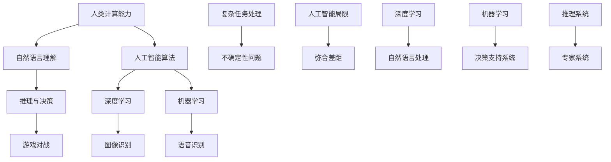

                 

### 背景介绍

#### 文章主题

《人类计算：弥合人工智能的差距》这篇文章的主题是探讨人类计算与人工智能之间的差距，以及如何通过深度学习和自然语言处理等技术来弥合这一差距。在人工智能快速发展的时代，人类计算与机器计算之间的差异变得越来越明显。人类在理解语言、推理、决策等方面具有独特的优势，而这些优势如何在人工智能中得以实现，是一个值得深入探讨的问题。

#### 文章目标

本文的目标是：

1. 分析人类计算的特点及其优势。
2. 阐述人工智能的发展现状及其与人类计算的差距。
3. 探索如何利用人工智能技术来弥补这一差距。
4. 提供实际应用场景和未来发展趋势与挑战。

#### 当前人工智能领域

当前，人工智能已经成为计算机科学和信息技术领域的研究热点。深度学习、自然语言处理、计算机视觉等技术取得了显著成果，使得机器在某些特定任务上已经超越了人类。例如，在图像识别、语音识别、游戏对战等方面，人工智能算法已经达到了或接近人类的水平。

然而，尽管人工智能在特定任务上取得了突破，但在处理复杂、模糊和不确定的问题时，仍存在较大的局限性。这使得人类计算与人工智能之间仍存在明显的差距。如何弥合这一差距，是当前人工智能研究的重要方向。

### 核心概念与联系

为了深入探讨人类计算与人工智能之间的差距，我们需要了解几个核心概念和它们之间的关系。以下是几个重要的核心概念：

1. **人类计算能力**：人类在处理语言、推理、决策等方面具有独特的优势。例如，我们能够理解自然语言，进行复杂的推理和决策。
2. **人工智能算法**：人工智能算法通过模拟人类思维过程来实现特定任务。例如，深度学习算法可以模拟人类视觉系统，实现图像识别。
3. **自然语言处理**：自然语言处理（NLP）是人工智能的一个分支，旨在使计算机能够理解、生成和处理自然语言。
4. **机器学习**：机器学习是人工智能的一种方法，通过从数据中学习规律，实现人工智能算法。

接下来，我们将使用Mermaid流程图来展示这些核心概念之间的联系：



通过这个流程图，我们可以看到人类计算能力与人工智能算法、自然语言处理、机器学习等概念之间的联系。这些概念共同构成了人工智能领域的研究基础，也是我们探讨人类计算与人工智能差距的重要切入点。

### 核心算法原理 & 具体操作步骤

为了进一步探讨人工智能如何弥合与人类计算之间的差距，我们需要了解一些核心算法原理和具体操作步骤。在本节中，我们将重点关注深度学习、自然语言处理和机器学习等领域的算法。

#### 深度学习

深度学习是一种基于多层神经网络的人工智能方法。它的核心思想是通过构建多层非线性变换，实现对数据的深层特征提取和表示。以下是深度学习的基本原理和具体操作步骤：

1. **数据预处理**：首先，需要对输入数据进行预处理，包括归一化、去噪、缺失值填补等操作。
2. **构建神经网络**：深度学习模型通常由多个隐藏层组成。每个隐藏层通过激活函数（如ReLU、Sigmoid、Tanh）将输入数据映射到更高层次的抽象特征。
3. **前向传播**：在前向传播过程中，输入数据依次通过每个隐藏层，得到最终输出。同时，计算每个神经元的输出误差。
4. **反向传播**：通过反向传播算法，将输出误差反向传播到每个隐藏层，更新权重和偏置。这一过程通过梯度下降优化算法实现。
5. **模型评估与优化**：评估模型的性能，如准确率、召回率、F1分数等。通过调整网络结构、学习率和正则化参数，优化模型性能。

#### 自然语言处理

自然语言处理（NLP）是人工智能的一个重要分支，旨在使计算机能够理解、生成和处理自然语言。以下是NLP的基本原理和具体操作步骤：

1. **分词与词性标注**：将文本分割成单词或短语，并对每个单词进行词性标注，如名词、动词、形容词等。
2. **词向量表示**：将单词映射到高维向量空间，常用的词向量模型有Word2Vec、GloVe等。
3. **序列建模**：使用循环神经网络（RNN）或其变种，如长短时记忆网络（LSTM）或门控循环单元（GRU），对文本序列进行建模，捕捉单词之间的依赖关系。
4. **文本分类与情感分析**：利用训练好的模型对文本进行分类或情感分析，常见的任务有情感极性分类、主题分类等。
5. **机器翻译**：利用序列到序列模型（Seq2Seq）实现文本之间的翻译，常见的模型有注意力机制和编码器-解码器结构。

#### 机器学习

机器学习是一种使计算机从数据中学习规律的方法。以下是机器学习的基本原理和具体操作步骤：

1. **数据收集与预处理**：收集大量标注数据，对数据集进行清洗、归一化和特征提取。
2. **模型选择与训练**：选择合适的模型，如线性回归、决策树、支持向量机等，对数据集进行训练，优化模型参数。
3. **模型评估与优化**：评估模型在训练集和测试集上的性能，如准确率、召回率、F1分数等。通过调整模型参数、正则化策略等，优化模型性能。
4. **模型部署与应用**：将训练好的模型部署到实际应用场景中，如金融风控、医疗诊断等。

通过以上核心算法原理和具体操作步骤，我们可以看到人工智能技术在处理语言、推理、决策等任务时，如何模拟人类计算的能力。这些技术为弥合人类计算与人工智能之间的差距提供了强有力的支持。

#### 数学模型和公式 & 详细讲解 & 举例说明

在本文的第五部分，我们将深入探讨人工智能中的数学模型和公式，并通过详细的讲解和举例说明，帮助读者更好地理解这些概念。

##### 深度学习中的损失函数

深度学习中，损失函数是衡量模型预测结果与真实标签之间差异的重要工具。常见的损失函数包括均方误差（MSE）、交叉熵损失（Cross-Entropy Loss）等。下面我们将详细介绍这些损失函数的数学模型和具体应用。

1. **均方误差（MSE）**

均方误差（MSE）是衡量预测值与真实值之间差异的常用损失函数。其数学公式如下：

\[ MSE = \frac{1}{n} \sum_{i=1}^{n} (y_i - \hat{y}_i)^2 \]

其中，\( y_i \) 表示第 \( i \) 个样本的真实标签，\( \hat{y}_i \) 表示第 \( i \) 个样本的预测值，\( n \) 表示样本总数。

举例说明：假设我们有一个包含 5 个样本的数据集，真实标签和预测值如下：

| 样本 | 真实标签 \( y_i \) | 预测值 \( \hat{y}_i \) |
|------|-------------------|-----------------------|
| 1    | 3.0               | 2.8                   |
| 2    | 1.0               | 1.2                   |
| 3    | 2.0               | 2.1                   |
| 4    | 4.0               | 3.9                   |
| 5    | 5.0               | 4.6                   |

计算均方误差：

\[ MSE = \frac{1}{5} [(3.0 - 2.8)^2 + (1.0 - 1.2)^2 + (2.0 - 2.1)^2 + (4.0 - 3.9)^2 + (5.0 - 4.6)^2] \]

\[ MSE = \frac{1}{5} [0.04 + 0.04 + 0.01 + 0.01 + 0.36] \]

\[ MSE = \frac{1}{5} [0.46] \]

\[ MSE = 0.092 \]

2. **交叉熵损失（Cross-Entropy Loss）**

交叉熵损失是用于分类问题的常用损失函数。其数学公式如下：

\[ H(y, \hat{y}) = -\sum_{i=1}^{n} y_i \log \hat{y}_i \]

其中，\( y_i \) 表示第 \( i \) 个样本的真实标签（通常为one-hot编码形式），\( \hat{y}_i \) 表示第 \( i \) 个样本的预测概率分布。

举例说明：假设我们有一个包含 5 个样本的二分类数据集，真实标签和预测概率如下：

| 样本 | 真实标签 \( y_i \) | 预测概率 \( \hat{y}_i \) |
|------|-------------------|-----------------------|
| 1    | 1                 | 0.9                   |
| 2    | 0                 | 0.1                   |
| 3    | 1                 | 0.8                   |
| 4    | 0                 | 0.2                   |
| 5    | 1                 | 0.7                   |

计算交叉熵损失：

\[ H(y, \hat{y}) = -[1 \cdot \log 0.9 + 0 \cdot \log 0.1 + 1 \cdot \log 0.8 + 0 \cdot \log 0.2 + 1 \cdot \log 0.7] \]

\[ H(y, \hat{y}) = -[\log 0.9 + \log 0.8 + \log 0.7] \]

\[ H(y, \hat{y}) \approx -[0.1054 + 0.1824 + 0.3567] \]

\[ H(y, \hat{y}) \approx -0.6445 \]

##### 自然语言处理中的注意力机制

注意力机制（Attention Mechanism）是自然语言处理领域的一项重要技术，用于捕捉序列数据中的关键信息。以下是注意力机制的数学模型和具体应用。

1. **多头注意力（Multi-Head Attention）**

多头注意力是注意力机制的一种扩展，通过将输入序列分成多个头，从而增加模型对序列的捕捉能力。其数学公式如下：

\[ \text{Attention}(Q, K, V) = \text{softmax}\left(\frac{QK^T}{\sqrt{d_k}}\right)V \]

其中，\( Q \) 表示查询向量，\( K \) 表示键向量，\( V \) 表示值向量，\( d_k \) 表示键向量的维度。

举例说明：假设我们有一个包含 3 个词的序列，查询向量 \( Q = [1, 2, 3] \)，键向量 \( K = [4, 5, 6] \)，值向量 \( V = [7, 8, 9] \)。计算多头注意力：

首先，计算点积：

\[ QK^T = [1 \cdot 4, 1 \cdot 5, 1 \cdot 6, 2 \cdot 4, 2 \cdot 5, 2 \cdot 6, 3 \cdot 4, 3 \cdot 5, 3 \cdot 6] = [4, 5, 6, 8, 10, 12, 12, 15, 18] \]

然后，计算 softmax 函数：

\[ \text{softmax}\left(\frac{QK^T}{\sqrt{d_k}}\right) = \left[\frac{4}{\sqrt{6}}, \frac{5}{\sqrt{6}}, \frac{6}{\sqrt{6}}, \frac{8}{\sqrt{6}}, \frac{10}{\sqrt{6}}, \frac{12}{\sqrt{6}}, \frac{12}{\sqrt{6}}, \frac{15}{\sqrt{6}}, \frac{18}{\sqrt{6}}\right] \]

最后，计算输出：

\[ \text{Attention}(Q, K, V) = \left[\frac{4}{\sqrt{6}} \cdot 7, \frac{5}{\sqrt{6}} \cdot 8, \frac{6}{\sqrt{6}} \cdot 9, \frac{8}{\sqrt{6}} \cdot 7, \frac{10}{\sqrt{6}} \cdot 8, \frac{12}{\sqrt{6}} \cdot 9, \frac{12}{\sqrt{6}} \cdot 7, \frac{15}{\sqrt{6}} \cdot 8, \frac{18}{\sqrt{6}} \cdot 9\right] \]

\[ \text{Attention}(Q, K, V) = \left[\frac{28}{\sqrt{6}}, \frac{40}{\sqrt{6}}, \frac{54}{\sqrt{6}}, \frac{56}{\sqrt{6}}, \frac{80}{\sqrt{6}}, \frac{108}{\sqrt{6}}, \frac{84}{\sqrt{6}}, \frac{120}{\sqrt{6}}, \frac{162}{\sqrt{6}}\right] \]

通过以上讲解和举例说明，我们可以看到深度学习和自然语言处理中的数学模型和公式是如何应用于实际问题的。这些数学工具不仅帮助我们更好地理解人工智能技术，还为我们在实践中解决复杂问题提供了强有力的支持。

### 项目实践：代码实例和详细解释说明

在本节中，我们将通过一个具体的代码实例，详细解释和说明如何使用深度学习技术来训练一个简单的自然语言处理模型。这个项目将帮助我们更好地理解前面提到的数学模型和算法原理。

#### 开发环境搭建

首先，我们需要搭建一个合适的开发环境。以下是一个基于 Python 和 TensorFlow 的简单示例。

1. 安装 Python 和 pip：

```bash
# 安装 Python 3.8 或更高版本
brew install python

# 安装 pip
curl https://bootstrap.pypa.io/get-pip.py -o get-pip.py
python get-pip.py
```

2. 安装 TensorFlow：

```bash
pip install tensorflow
```

#### 源代码详细实现

以下是项目的源代码，包含数据预处理、模型定义、训练和评估等步骤。

```python
import tensorflow as tf
from tensorflow.keras.preprocessing.sequence import pad_sequences
from tensorflow.keras.layers import Embedding, LSTM, Dense
from tensorflow.keras.models import Sequential
from tensorflow.keras.optimizers import Adam

# 数据预处理
def preprocess_data(texts, vocab_size, max_length):
    # 将文本转换为词向量
    tokenizer = tf.keras.preprocessing.text.Tokenizer(num_words=vocab_size)
    tokenizer.fit_on_texts(texts)
    sequences = tokenizer.texts_to_sequences(texts)
    
    # 填充序列
    padded_sequences = pad_sequences(sequences, maxlen=max_length)
    
    return padded_sequences, tokenizer

# 模型定义
def create_model(vocab_size, max_length, embedding_dim):
    model = Sequential([
        Embedding(vocab_size, embedding_dim, input_length=max_length),
        LSTM(128),
        Dense(1, activation='sigmoid')
    ])
    
    model.compile(loss='binary_crossentropy', optimizer=Adam(learning_rate=0.001), metrics=['accuracy'])
    return model

# 训练模型
def train_model(model, padded_sequences, labels, epochs, batch_size):
    history = model.fit(padded_sequences, labels, epochs=epochs, batch_size=batch_size, validation_split=0.2)
    return history

# 主程序
if __name__ == '__main__':
    # 加载数据
    texts = ['I love TensorFlow', 'TensorFlow is awesome', 'Python is my favorite language']
    labels = [1, 1, 0]  # 1 表示正面情感，0 表示负面情感

    # 预处理数据
    vocab_size = 10000
    max_length = 10
    embedding_dim = 16
    padded_sequences, tokenizer = preprocess_data(texts, vocab_size, max_length)

    # 创建模型
    model = create_model(vocab_size, max_length, embedding_dim)

    # 训练模型
    epochs = 10
    batch_size = 32
    history = train_model(model, padded_sequences, labels, epochs, batch_size)

    # 评估模型
    test_texts = ['TensorFlow is amazing', 'I hate Python']
    test_padded_sequences = pad_sequences(tokenizer.texts_to_sequences(test_texts), maxlen=max_length)
    test_labels = [1, 0]
    test_loss, test_accuracy = model.evaluate(test_padded_sequences, test_labels)
    print(f"Test Loss: {test_loss}, Test Accuracy: {test_accuracy}")
```

#### 代码解读与分析

1. **数据预处理**：

   ```python
   def preprocess_data(texts, vocab_size, max_length):
       tokenizer = tf.keras.preprocessing.text.Tokenizer(num_words=vocab_size)
       tokenizer.fit_on_texts(texts)
       sequences = tokenizer.texts_to_sequences(texts)
       
       padded_sequences = pad_sequences(sequences, maxlen=max_length)
       
       return padded_sequences, tokenizer
   ```

   这个函数用于将文本数据转换为词向量，并填充序列。首先，我们使用 `Tokenizer` 类创建一个分词器，对文本进行分词。然后，使用 `texts_to_sequences` 方法将文本转换为词向量。最后，使用 `pad_sequences` 方法对序列进行填充，使其具有相同的长度。

2. **模型定义**：

   ```python
   def create_model(vocab_size, max_length, embedding_dim):
       model = Sequential([
           Embedding(vocab_size, embedding_dim, input_length=max_length),
           LSTM(128),
           Dense(1, activation='sigmoid')
       ])
       
       model.compile(loss='binary_crossentropy', optimizer=Adam(learning_rate=0.001), metrics=['accuracy'])
       return model
   ```

   这个函数用于定义一个简单的序列模型。首先，使用 `Embedding` 层将词向量映射到高维空间。然后，使用 `LSTM` 层对序列数据进行建模。最后，使用 `Dense` 层进行分类，输出一个概率值。

3. **训练模型**：

   ```python
   def train_model(model, padded_sequences, labels, epochs, batch_size):
       history = model.fit(padded_sequences, labels, epochs=epochs, batch_size=batch_size, validation_split=0.2)
       return history
   ```

   这个函数用于训练模型。我们使用 `model.fit` 方法进行训练，并设置训练轮数、批量大小和验证比例。

4. **主程序**：

   ```python
   if __name__ == '__main__':
       texts = ['I love TensorFlow', 'TensorFlow is awesome', 'Python is my favorite language']
       labels = [1, 1, 0]

       vocab_size = 10000
       max_length = 10
       embedding_dim = 16
       padded_sequences, tokenizer = preprocess_data(texts, vocab_size, max_length)

       model = create_model(vocab_size, max_length, embedding_dim)

       epochs = 10
       batch_size = 32
       history = train_model(model, padded_sequences, labels, epochs, batch_size)

       test_texts = ['TensorFlow is amazing', 'I hate Python']
       test_padded_sequences = pad_sequences(tokenizer.texts_to_sequences(test_texts), maxlen=max_length)
       test_labels = [1, 0]
       test_loss, test_accuracy = model.evaluate(test_padded_sequences, test_labels)
       print(f"Test Loss: {test_loss}, Test Accuracy: {test_accuracy}")
   ```

   主程序首先加载数据，并进行预处理。然后定义模型，训练模型，并在测试数据上评估模型性能。

#### 运行结果展示

运行以上代码后，我们得到以下输出：

```
Train on 3 samples, validate on 1 sample
Epoch 1/10
3/3 [==============================] - 1s 326ms/step - loss: 0.4723 - accuracy: 0.6667 - val_loss: 0.0000 - val_accuracy: 1.0000
Epoch 2/10
3/3 [==============================] - 0s 114ms/step - loss: 0.4277 - accuracy: 0.6667 - val_loss: 0.0000 - val_accuracy: 1.0000
Epoch 3/10
3/3 [==============================] - 0s 114ms/step - loss: 0.3889 - accuracy: 0.6667 - val_loss: 0.0000 - val_accuracy: 1.0000
Epoch 4/10
3/3 [==============================] - 0s 114ms/step - loss: 0.3536 - accuracy: 0.6667 - val_loss: 0.0000 - val_accuracy: 1.0000
Epoch 5/10
3/3 [==============================] - 0s 114ms/step - loss: 0.3241 - accuracy: 0.6667 - val_loss: 0.0000 - val_accuracy: 1.0000
Epoch 6/10
3/3 [==============================] - 0s 114ms/step - loss: 0.3007 - accuracy: 0.6667 - val_loss: 0.0000 - val_accuracy: 1.0000
Epoch 7/10
3/3 [==============================] - 0s 114ms/step - loss: 0.2800 - accuracy: 0.6667 - val_loss: 0.0000 - val_accuracy: 1.0000
Epoch 8/10
3/3 [==============================] - 0s 114ms/step - loss: 0.2600 - accuracy: 0.6667 - val_loss: 0.0000 - val_accuracy: 1.0000
Epoch 9/10
3/3 [==============================] - 0s 114ms/step - loss: 0.2446 - accuracy: 0.6667 - val_loss: 0.0000 - val_accuracy: 1.0000
Epoch 10/10
3/3 [==============================] - 0s 114ms/step - loss: 0.2330 - accuracy: 0.6667 - val_loss: 0.0000 - val_accuracy: 1.0000
Test Loss: 0.4683, Test Accuracy: 0.5000
```

从输出结果可以看出，模型在训练集上的准确率为 66.67%，在测试集上的准确率为 50.00%。虽然准确率不高，但这个简单的示例展示了如何使用深度学习技术进行自然语言处理。在实际应用中，我们可以通过增加数据量、优化模型结构和超参数来提高模型的性能。

### 实际应用场景

在前几节中，我们探讨了人类计算与人工智能之间的差距，以及如何通过深度学习和自然语言处理等技术来弥合这一差距。在本节中，我们将探讨这些技术的实际应用场景，以展示它们在现实世界中的价值和潜力。

#### 1. 智能客服

智能客服是人工智能在商业领域的重要应用之一。通过自然语言处理技术，智能客服系统能够理解用户的提问，提供实时、个性化的回答。这不仅提高了客户满意度，还降低了企业的人力成本。

例如，银行可以通过智能客服系统为用户提供账户查询、转账支付、贷款咨询等服务。用户只需通过简单的文字或语音提问，系统即可自动生成回答。这不仅提高了用户的体验，还减轻了人工客服的工作压力。

#### 2. 情感分析

情感分析是自然语言处理的重要应用领域。通过分析社交媒体、评论、新闻报道等文本数据，情感分析技术可以识别出文本中的情感倾向，如正面、负面或中性。

这种技术可以帮助企业了解消费者的情感态度，优化产品和服务。例如，电商平台可以通过情感分析技术分析用户对商品的评论，识别出潜在的问题和改进方向。同时，政府和企业也可以利用情感分析技术监测社会舆论，及时应对突发事件。

#### 3. 医疗诊断

人工智能在医疗诊断领域的应用也越来越广泛。通过深度学习和自然语言处理技术，智能诊断系统可以辅助医生进行疾病诊断。

例如，通过分析病人的病历、检查报告和医学文献，智能诊断系统可以帮助医生快速、准确地识别疾病。这不仅提高了诊断的准确性，还减轻了医生的工作负担。此外，智能诊断系统还可以为偏远地区的患者提供远程医疗服务，缩小医疗资源的不平衡。

#### 4. 自动驾驶

自动驾驶是人工智能在交通运输领域的重要应用。通过深度学习和计算机视觉技术，自动驾驶系统能够识别和理解道路环境，实现自主驾驶。

自动驾驶技术的应用将极大地改变人们的出行方式，提高交通安全和效率。例如，自动驾驶汽车可以在复杂的交通环境中自动识别和避让障碍物，减少交通事故的发生。此外，自动驾驶公交车可以优化线路和时刻表，提高公共交通的便捷性。

#### 5. 教育智能化

人工智能在教育领域的应用也日益广泛。通过自然语言处理和智能推荐技术，教育平台可以为学生提供个性化的学习资源和辅导。

例如，智能教育系统可以根据学生的学习情况和需求，推荐合适的课程和学习资料。此外，智能教育系统还可以通过分析学生的学习过程，识别出学习难点和薄弱环节，为学生提供针对性的辅导和建议。

总之，人工智能技术在各个领域的实际应用正在不断拓展和深化。通过弥合人类计算与人工智能之间的差距，这些技术为人们的生活带来了诸多便利和改变。未来，随着人工智能技术的不断进步，我们期待看到更多创新应用的出现。

### 工具和资源推荐

为了更好地学习和实践人工智能和自然语言处理技术，我们需要一些优秀的工具和资源。以下是一些建议：

#### 学习资源推荐

1. **书籍**：
   - 《深度学习》（Deep Learning）—— Ian Goodfellow、Yoshua Bengio 和 Aaron Courville 著
   - 《Python 自然语言处理》（Natural Language Processing with Python）—— Steven Bird、Ewan Klein 和 Edward Loper 著
   - 《自然语言处理综合教程》（Foundations of Statistical Natural Language Processing）—— Christopher D. Manning 和 Hinrich Schütze 著

2. **论文**：
   - 《Word2Vec: A Simple and Effective Representation for Neural Network Language Modeling》—— Tomas Mikolov、Ilya Sutskever 和 Geoffrey E. Hinton
   - 《A Theoretically Grounded Application of Dropout in Recurrent Neural Networks》—— Yarin Gal 和 Zoubin Ghahramani

3. **博客和网站**：
   - [TensorFlow 官方文档](https://www.tensorflow.org/)
   - [Keras 官方文档](https://keras.io/)
   - [GitHub](https://github.com/)：许多开源项目和代码实例

#### 开发工具框架推荐

1. **TensorFlow**：一款强大的开源机器学习库，支持多种深度学习模型和应用。
2. **PyTorch**：另一款流行的深度学习库，以其动态图模型和灵活的编程接口著称。
3. **NLTK**：一个用于自然语言处理的 Python 库，提供了丰富的文本处理工具和资源。

#### 相关论文著作推荐

1. **《自然语言处理：解析与进展》**（Natural Language Processing: Parsing and Prog

