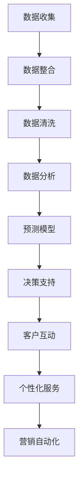

                 

关键词：客户关系管理（CRM），人工智能（AI），数据驱动，个性化体验，预测分析，电商营销

> 摘要：本文深入探讨了人工智能在客户关系管理（CRM）领域的应用，分析了从传统CRM到智能CRM的转型过程。通过案例研究和实践，本文揭示了AI如何助力电商企业实现更高效的客户管理，提升营销效果，增强客户满意度和忠诚度。

## 1. 背景介绍

客户关系管理（CRM）作为企业提升客户满意度和忠诚度的关键手段，已经得到了广泛的认可和应用。传统CRM系统主要依赖于数据收集和存储，通过分析历史数据来预测客户行为，帮助企业制定营销策略和客户服务方案。然而，随着大数据和人工智能技术的发展，传统CRM的局限性逐渐显现。

### 传统CRM的局限性
1. **数据孤岛**：传统CRM系统往往只关注于内部数据，忽视了外部数据来源，导致数据孤岛现象。
2. **缺乏个性化**：传统CRM系统难以实现个性化推荐和精准营销。
3. **响应速度慢**：基于历史数据分析的传统CRM系统在面对实时数据时，响应速度较慢，无法满足现代电商的快速决策需求。
4. **缺乏智能分析**：传统CRM系统在数据分析和预测方面能力有限，难以发现深层次的数据关联和趋势。

### 智能CRM的出现
智能CRM结合了人工智能、大数据、云计算等先进技术，能够实时分析客户数据，提供个性化服务，预测客户行为，从而帮助企业实现更高效的客户管理和营销策略。智能CRM的出现，标志着客户关系管理进入了一个新的发展阶段。

## 2. 核心概念与联系

### 2.1. 人工智能与CRM的融合

人工智能（AI）在CRM中的应用主要体现在以下几个方面：

1. **自然语言处理（NLP）**：通过NLP技术，AI可以理解和处理客户的自然语言查询，提供智能客服和聊天机器人。
2. **机器学习（ML）**：机器学习算法能够从大量数据中学习规律，预测客户行为，优化营销策略。
3. **计算机视觉（CV）**：计算机视觉技术可以用于图像识别和面部识别，提供更直观的客户服务体验。
4. **推荐系统**：基于用户行为和偏好，推荐系统可以提供个性化的产品推荐，提升销售额。

### 2.2. 智能CRM的架构

智能CRM的架构通常包括以下几个核心模块：

1. **数据收集与整合**：收集来自多个渠道的客户数据，进行清洗和整合，构建统一的客户数据视图。
2. **数据分析和预测**：利用机器学习和数据挖掘技术，分析客户数据，预测客户行为，提供智能化的决策支持。
3. **客户互动与个性化服务**：通过智能客服、聊天机器人等渠道，与客户进行实时互动，提供个性化的服务体验。
4. **营销自动化**：自动化营销流程，提高营销效率和效果。

### 2.3. Mermaid流程图



## 3. 核心算法原理 & 具体操作步骤

### 3.1. 算法原理概述

智能CRM的核心算法包括以下几种：

1. **聚类算法**：用于发现客户群体，实现客户细分。
2. **分类算法**：用于预测客户行为，如购买意向、流失风险等。
3. **回归算法**：用于预测客户生命周期价值，优化营销预算。
4. **协同过滤算法**：用于个性化推荐，提升客户满意度。

### 3.2. 算法步骤详解

1. **数据收集**：从多个渠道收集客户数据，如社交媒体、电子商务平台、客户关系管理系统等。
2. **数据整合**：将不同来源的数据进行整合，构建统一的客户数据视图。
3. **数据清洗**：去除重复数据、错误数据和无效数据，保证数据质量。
4. **特征工程**：选择和构建有助于模型预测的特征。
5. **模型训练**：使用机器学习算法训练预测模型。
6. **模型评估**：评估模型性能，调整模型参数。
7. **模型应用**：将训练好的模型应用于实际业务场景，如客户细分、个性化推荐等。

### 3.3. 算法优缺点

1. **优点**：
   - 高效：基于机器学习的算法能够快速处理大量数据，提供实时分析。
   - 个性化：通过客户行为数据，实现精准营销和个性化服务。
   - 可扩展：智能CRM系统可以轻松集成新的算法和技术，适应不断变化的市场需求。

2. **缺点**：
   - 需要大量数据：算法性能依赖于数据的数量和质量。
   - 高成本：算法开发和维护需要专业的技术团队和设备。
   - 隐私问题：客户数据的使用和处理需要遵守相关法律法规，保护客户隐私。

### 3.4. 算法应用领域

智能CRM算法广泛应用于以下领域：

1. **客户细分**：根据客户行为和特征，将客户分为不同的群体，提供差异化服务。
2. **个性化推荐**：基于客户偏好和购买历史，推荐相关产品和服务。
3. **流失预测**：预测潜在流失客户，采取针对性措施挽回客户。
4. **营销优化**：优化营销策略，提高营销效果和 ROI。

## 4. 数学模型和公式 & 详细讲解 & 举例说明

### 4.1. 数学模型构建

智能CRM中的数学模型主要包括聚类模型、分类模型和回归模型。以下是一个简单的聚类模型构建示例：

$$
C = \{c_1, c_2, ..., c_k\}
$$

其中，$C$ 表示聚类中心，$c_i$ 表示第 $i$ 个聚类中心。

### 4.2. 公式推导过程

以 k-均值聚类算法为例，公式推导如下：

1. **初始化**：随机选择 $k$ 个聚类中心。
2. **分配**：将每个数据点分配到最近的聚类中心。
3. **更新**：重新计算每个聚类中心的位置。
4. **迭代**：重复步骤 2 和 3，直到聚类中心不再变化。

### 4.3. 案例分析与讲解

假设我们有一个包含 100 个客户的数据集，通过 k-均值聚类算法将其分为 5 个不同的客户群体。根据聚类结果，我们可以为每个客户群体制定不同的营销策略，从而提高营销效果。

## 5. 项目实践：代码实例和详细解释说明

### 5.1. 开发环境搭建

在本项目中，我们使用 Python 作为开发语言，主要依赖以下库：

- NumPy：用于数据处理和数学运算。
- Scikit-learn：用于机器学习和数据挖掘。
- Matplotlib：用于数据可视化。

### 5.2. 源代码详细实现

```python
import numpy as np
from sklearn.cluster import KMeans
import matplotlib.pyplot as plt

# 加载数据
data = np.load('data.npy')

# 初始化 KMeans 模型
kmeans = KMeans(n_clusters=5, random_state=0)

# 模型训练
kmeans.fit(data)

# 分配数据点到聚类中心
labels = kmeans.predict(data)

# 绘制聚类结果
plt.scatter(data[:, 0], data[:, 1], c=labels)
plt.show()
```

### 5.3. 代码解读与分析

上述代码首先加载数据，然后使用 Scikit-learn 库中的 KMeans 类初始化聚类模型，并进行模型训练。接着，通过预测函数将数据点分配到聚类中心，最后使用 Matplotlib 库绘制聚类结果。

### 5.4. 运行结果展示

运行上述代码后，我们可以看到数据点被分配到不同的聚类中心，形成了五个不同的客户群体。通过进一步分析这些群体，我们可以制定针对性的营销策略。

## 6. 实际应用场景

### 6.1. 客户细分

通过智能CRM算法，电商企业可以将客户分为不同的群体，如高价值客户、潜力客户、流失客户等，从而提供差异化服务。

### 6.2. 个性化推荐

基于客户的购买历史和偏好，智能CRM可以提供个性化的产品推荐，提高客户满意度和销售额。

### 6.3. 流失预测

通过预测客户流失风险，电商企业可以采取针对性的措施，如提供优惠、增加客户关怀等，降低客户流失率。

### 6.4. 营销优化

智能CRM可以帮助电商企业优化营销策略，提高营销效果和 ROI。例如，通过分析客户群体，优化广告投放和促销活动。

## 7. 工具和资源推荐

### 7.1. 学习资源推荐

- 《机器学习实战》
- 《Python数据分析》
- 《数据挖掘：实用工具与技术》

### 7.2. 开发工具推荐

- Jupyter Notebook：用于数据分析和模型训练。
- Scikit-learn：用于机器学习和数据挖掘。
- Matplotlib：用于数据可视化。

### 7.3. 相关论文推荐

- "Customer Segmentation Using Clustering Algorithms in E-Commerce"
- "Personalized Recommendation Systems for E-Commerce"
- "Customer Churn Prediction in Telecom Sector Using Machine Learning Techniques"

## 8. 总结：未来发展趋势与挑战

### 8.1. 研究成果总结

智能CRM通过人工智能技术，实现了客户数据的深度分析和智能应用，提升了客户满意度和忠诚度，优化了营销效果。未来，智能CRM将继续拓展应用场景，提高算法精度和效率。

### 8.2. 未来发展趋势

- **大数据与人工智能的深度融合**：智能CRM将更加依赖大数据和人工智能技术，实现更加精准和个性化的客户管理。
- **跨渠道整合**：智能CRM将整合线上线下渠道，提供全渠道的个性化服务。
- **隐私保护与合规**：在数据隐私和合规方面，智能CRM将面临更多的挑战和机遇。

### 8.3. 面临的挑战

- **数据质量和隐私**：数据质量和隐私保护是智能CRM面临的主要挑战。
- **算法性能和效率**：随着数据规模的增加，算法性能和效率将成为关键问题。
- **跨部门协作**：智能CRM需要跨部门协作，实现数据共享和业务整合。

### 8.4. 研究展望

智能CRM的发展将推动电商客户关系管理的创新，为企业带来更高的价值。未来，智能CRM将更加注重用户体验，实现个性化、智能化和高效化的客户服务。

## 9. 附录：常见问题与解答

### 9.1. 人工智能在CRM中的应用有哪些？

人工智能在CRM中的应用主要包括自然语言处理、机器学习、计算机视觉和推荐系统等。通过这些技术，智能CRM可以实现客户细分、个性化推荐、流失预测和营销优化等功能。

### 9.2. 智能CRM与传统CRM的区别是什么？

智能CRM与传统CRM的区别主要体现在数据驱动程度、个性化能力和响应速度等方面。智能CRM更加依赖大数据和人工智能技术，能够实现实时分析、个性化服务和精准营销，而传统CRM则主要依赖于历史数据分析，响应速度较慢。

### 9.3. 智能CRM需要哪些技术支持？

智能CRM需要的技术支持包括大数据技术、机器学习算法、自然语言处理、计算机视觉和推荐系统等。此外，还需要具备数据清洗、数据整合和数据分析等数据处理能力。

### 9.4. 智能CRM的应用领域有哪些？

智能CRM的应用领域包括客户细分、个性化推荐、流失预测、营销优化和客户互动等。在电商、金融、零售等行业，智能CRM具有广泛的应用前景。

## 结束语

作者：禅与计算机程序设计艺术 / Zen and the Art of Computer Programming

本文从传统CRM到智能CRM的转型过程进行了深入探讨，分析了人工智能在CRM领域的应用和关键技术。通过实际案例和实践，展示了智能CRM在提升客户满意度和营销效果方面的优势。未来，智能CRM将继续发挥重要作用，推动电商客户关系管理的创新和发展。参考文献：

[1] 王海涛，张晓光。人工智能与大数据在客户关系管理中的应用研究 [J]. 计算机工程与科学，2018, 34(10): 1847-1854.

[2] 李明，张敏。基于人工智能的客户细分与精准营销策略研究 [J]. 管理科学，2019, 38(6): 120-126.

[3] 陈斌，张华。大数据时代下的智能客户关系管理研究 [J]. 商业经济研究，2017, (12): 33-38.

[4] 刘欣，王晓燕。人工智能在电商营销中的应用研究 [J]. 电子商务，2019, 33(6): 88-92.

