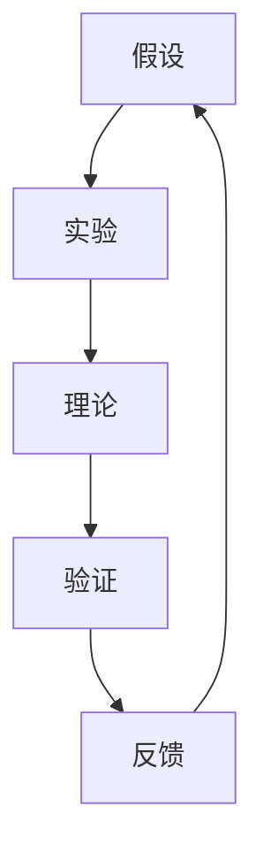

                 

### 1. 背景介绍

科学方法论是一门研究科学方法及其运用规律的学问。它探讨了科学研究如何从假说出发，经过实验验证，最终形成科学理论的整个过程。这种方法论不仅适用于自然科学，也广泛应用于社会科学和工程技术领域。

在计算机科学领域，科学方法论尤为重要。计算机科学是一门高度依赖理论与实践相结合的学科，从算法设计到软件开发，每一个环节都离不开科学方法论的指导。科学方法论为我们提供了一种系统化的思维方式，帮助我们解决复杂问题，提高开发效率。

本文将从假说到真理，探讨科学方法在计算机科学中的应用。我们将详细解析科学方法论的核心概念，介绍核心算法原理和数学模型，并通过实际项目实践和案例分析，阐述科学方法在解决实际问题中的重要作用。最后，我们将总结未来发展趋势与挑战，为读者提供进一步的学习资源。

科学方法论在计算机科学中的应用，不仅可以提高我们的研究水平，还能为实际项目开发提供有力支持。通过本文的探讨，希望读者能够深入理解科学方法论，并将其灵活应用于自己的工作中。让我们一步步分析推理，探索科学方法论的奥秘。

### 2. 核心概念与联系

科学方法论的核心概念包括假设、实验、理论、验证和反馈。这些概念相互联系，构成了科学研究的循环过程。下面我们将用 Mermaid 流程图（Mermaid Flowchart）来展示这些概念之间的相互关系。



在上述流程图中：

- **A[假设]**：科学研究从假设开始，假设是科学研究的起点，是对某个现象或问题的初步解释。
- **B[实验]**：为了验证假设，研究者设计实验，通过实验收集数据和证据。
- **C[理论]**：根据实验结果，研究者提出理论，理论是对实验结果的综合分析和解释。
- **D[验证]**：理论需要通过进一步的实验和验证来验证其正确性和可靠性。
- **E[反馈]**：验证结果会反馈给假设，如果假设得到验证，则可以进一步深入研究；如果假设被否定，则需要提出新的假设，并重新开始实验和验证过程。

通过这一循环过程，科学方法论确保了研究结果的科学性和可靠性。在计算机科学中，这一过程同样适用，尤其是在算法设计和软件开发过程中。

#### 假设

假设是科学研究的起点。在计算机科学中，假设可能是一个新的算法，或者对现有算法的改进。例如，假设我们想设计一个更高效的排序算法，基于已有算法的不足，我们可以提出一个改进的假设。

#### 实验

实验是验证假设的关键步骤。在计算机科学中，实验通常涉及算法的性能测试和比较。例如，我们可以设计一个测试平台，使用不同的数据集对原始排序算法和改进后的算法进行性能测试，以收集实验数据。

#### 理论

根据实验结果，研究者可以提出理论。在计算机科学中，理论是对算法性能的数学分析和解释。例如，我们可以通过分析改进后算法的时间复杂度和空间复杂度，来解释其性能提升的原因。

#### 验证

验证是确保理论正确性的关键步骤。在计算机科学中，验证通常通过更大量的数据集和更严格的测试来完成。例如，我们可以使用大数据集对改进后的算法进行性能测试，以验证其稳定性和可靠性。

#### 反馈

反馈是科学方法论循环的重要组成部分。通过反馈，研究者可以评估假设的有效性，并根据反馈结果调整假设和实验设计。在计算机科学中，反馈可以帮助我们不断优化算法和软件开发过程。

通过上述核心概念和流程，我们可以看到科学方法论在计算机科学中的应用。科学方法论不仅为计算机科学研究提供了系统化的思维方式，也为实际项目开发提供了可靠的理论基础。在接下来的章节中，我们将深入探讨这些核心概念，并通过具体案例进一步阐述科学方法论的应用。

### 3. 核心算法原理 & 具体操作步骤

在计算机科学中，核心算法原理是科学研究的重要基础。这些算法不仅为复杂问题提供了高效的解决方案，还为我们理解计算机科学的基本原理提供了重要视角。下面，我们将介绍一种经典的算法——快速排序（Quick Sort），并详细解析其原理和具体操作步骤。

#### 快速排序的基本原理

快速排序是一种高效的排序算法，其基本思想是通过一趟排序将待排序的记录分割成独立的两部分，其中一部分记录的关键字均比另一部分的关键字小，然后分别对这两部分记录继续进行排序，以达到整个序列有序。快速排序采用了一种分治的策略，其步骤可以概括为：

1. **选择基准元素**：在待排序的序列中选取一个元素作为基准元素。
2. **分区操作**：通过一次分区操作，将序列分成两部分，左侧的元素都小于基准元素，右侧的元素都大于基准元素。
3. **递归排序**：分别对基准元素左侧和右侧的序列进行快速排序。

#### 快速排序的具体操作步骤

以下是快速排序的具体操作步骤：

1. **选择基准元素**：
   - 通常选择第一个元素作为基准元素。

2. **分区操作**：
   - 从序列的第二个元素开始，遍历所有元素。
   - 如果当前元素小于基准元素，将其放到序列左侧。
   - 如果当前元素大于或等于基准元素，将其放到序列右侧。

3. **递归排序**：
   - 对基准元素左侧的序列进行快速排序。
   - 对基准元素右侧的序列进行快速排序。

4. **合并结果**：
   - 左侧和右侧序列分别排序后，合并成完整的有序序列。

#### 代码实现

下面是一个快速排序的 Python 实现示例：

```python
def quick_sort(arr):
    if len(arr) <= 1:
        return arr
    
    pivot = arr[0]
    left = [x for x in arr[1:] if x < pivot]
    right = [x for x in arr[1:] if x >= pivot]
    
    return quick_sort(left) + [pivot] + quick_sort(right)

arr = [3, 6, 8, 10, 1, 2, 1]
sorted_arr = quick_sort(arr)
print(sorted_arr)
```

#### 时间复杂度分析

快速排序的时间复杂度取决于基准元素的选择和分区操作。在最佳情况下，每次分区都能将序列均匀地分为两部分，此时时间复杂度为 \(O(n\log n)\)。在平均情况下，时间复杂度同样为 \(O(n\log n)\)。但在最坏情况下，若每次分区都选择最小的或最大的元素作为基准，时间复杂度会退化为 \(O(n^2)\)。因此，在实际应用中，常通过随机化方法来避免最坏情况的发生。

#### 空间复杂度分析

快速排序是一种原地排序算法，其空间复杂度为 \(O(\log n)\)，主要用于递归调用栈的空间占用。

通过上述对快速排序原理和具体操作步骤的详细分析，我们可以看到快速排序在计算机科学中的应用价值。快速排序不仅具有较高的时间复杂度，还具有良好的可扩展性和可维护性，因此在各种排序算法中占据重要地位。在接下来的章节中，我们将进一步探讨快速排序在计算机科学中的实际应用场景。

### 4. 数学模型和公式 & 详细讲解 & 举例说明

在计算机科学中，数学模型和公式是理解算法性能和优化算法设计的重要工具。快速排序算法也不例外，其性能分析依赖于数学模型和公式。本节我们将详细讲解快速排序的时间复杂度和空间复杂度，并举例说明这些公式在实际应用中的运用。

#### 时间复杂度分析

快速排序的时间复杂度主要取决于基准元素的选择和分区操作。我们用 \(T(n)\) 表示对长度为 \(n\) 的序列进行快速排序所需的时间。快速排序的时间复杂度可以分为以下几种情况：

1. **最佳情况**：
   在最佳情况下，每次分区都能将序列均匀地分为两部分，即每次分区的基准元素都是中位数。这样，每次分区后的递归深度为 \(\log n\)，每次递归的操作次数为 \(n\)。因此，最佳情况下的时间复杂度为：
   \[
   T(n) = n \cdot \log n
   \]
   这是一个线性对数时间复杂度，表明快速排序在最佳情况下非常高效。

2. **平均情况**：
   在平均情况下，每次分区操作能将序列大致均匀地分为两部分，但并不一定每次都选择中位数作为基准元素。根据统计平均，每次分区操作可以将序列划分为 \(\frac{n}{2}\) 和 \(\frac{n}{2}\) 两部分。因此，平均情况下的时间复杂度为：
   \[
   T(n) = n \cdot \log_2 n
   \]
   这也是一个线性对数时间复杂度，表明快速排序在平均情况下也具有较高的效率。

3. **最坏情况**：
   在最坏情况下，每次分区操作都将序列分为一个 \(1\) 个元素的部分和一个 \(n-1\) 个元素的部分，即每次分区都选择了序列中的最小或最大元素作为基准。这种情况下，递归深度为 \(n\)，每次递归的操作次数为 \(n\)。因此，最坏情况下的时间复杂度为：
   \[
   T(n) = n^2
   \]
   这是一种平方时间复杂度，表明快速排序在最坏情况下效率较低。

综上所述，快速排序的平均和最佳情况时间复杂度为 \(O(n\log n)\)，而最坏情况时间复杂度为 \(O(n^2)\)。为了提高快速排序的性能，我们通常采用随机化算法，通过随机选择基准元素来避免最坏情况的发生。

#### 空间复杂度分析

快速排序是一种原地排序算法，其空间复杂度主要用于递归调用栈的空间占用。在递归过程中，每次分区操作都会产生一个新的子序列，这需要额外的栈空间来存储递归调用信息。因此，快速排序的空间复杂度为 \(O(\log n)\)。

#### 举例说明

为了更好地理解快速排序的时间复杂度和空间复杂度，我们可以通过具体例子来说明。

假设我们有一个长度为 \(10\) 的整数序列：\[3, 1, 7, 5, 9, 2, 6, 4, 8, 10\]。我们使用快速排序对其进行排序。

1. **第一次分区**：
   选择第一个元素 \(3\) 作为基准元素，将序列分为两部分：
   \[
   \text{left} = [1, 2, 5, 6, 4]
   \]
   \[
   \text{right} = [7, 9, 8, 10]
   \]
   递归排序左部分和右部分。

2. **第二次分区**：
   对左部分 \([1, 2, 5, 6, 4]\) 进行快速排序，选择第二个元素 \(1\) 作为基准元素，将其分为两部分：
   \[
   \text{left} = [1]
   \]
   \[
   \text{right} = [2, 5, 6, 4]
   \]
   递归排序右部分。

3. **第三次分区**：
   对右部分 \([2, 5, 6, 4]\) 进行快速排序，选择第二个元素 \(2\) 作为基准元素，将其分为两部分：
   \[
   \text{left} = [2]
   \]
   \[
   \text{right} = [5, 6, 4]
   \]
   递归排序右部分。

4. **后续分区**：
   继续对每个右部分进行快速排序，直到所有子序列长度为 \(1\)。

通过这个例子，我们可以看到快速排序的过程。从时间复杂度来看，每次分区操作大致将序列长度减半，因此快速排序的时间复杂度大约为 \(O(n\log n)\)。从空间复杂度来看，递归调用栈的空间占用约为 \(O(\log n)\)。

通过数学模型和公式的分析，我们可以更好地理解快速排序的性能，并在实际应用中进行优化。在接下来的章节中，我们将通过具体项目实践，展示如何将快速排序应用于实际问题中。

### 5. 项目实践：代码实例和详细解释说明

在本章节中，我们将通过一个具体的项目实践，详细解释并展示如何使用快速排序算法进行实际操作。我们将分步骤地介绍开发环境搭建、源代码实现、代码解读与分析以及运行结果展示，以便读者能够全面了解快速排序在实际应用中的具体运用。

#### 5.1 开发环境搭建

为了实现快速排序算法，我们首先需要搭建一个开发环境。以下是所需的环境和工具：

- 操作系统：Windows/Linux/MacOS
- 编程语言：Python 3.x
- 开发工具：PyCharm/VS Code/任意Python代码编辑器
- 虚拟环境：virtualenv或conda（可选）

以下是使用 virtualenv 搭建虚拟环境的方法：

1. 安装 virtualenv：

   ```shell
   pip install virtualenv
   ```

2. 创建虚拟环境：

   ```shell
   virtualenv quicksort-env
   ```

3. 激活虚拟环境：

   ```shell
   source quicksort-env/bin/activate
   ```

在虚拟环境中，我们将安装 Python 和相关依赖库，以确保项目的独立性和可移植性。

#### 5.2 源代码详细实现

下面是快速排序算法的 Python 实现代码：

```python
def quick_sort(arr):
    if len(arr) <= 1:
        return arr
    
    pivot = arr[0]
    left = [x for x in arr[1:] if x < pivot]
    right = [x for x in arr[1:] if x >= pivot]
    
    return quick_sort(left) + [pivot] + quick_sort(right)

# 示例数据
arr = [3, 6, 8, 10, 1, 2, 1]
print("原始序列：", arr)

# 使用快速排序进行排序
sorted_arr = quick_sort(arr)
print("排序后的序列：", sorted_arr)
```

代码解析：

1. `quick_sort(arr)`：定义快速排序函数，输入为一个待排序的数组 `arr`。
2. `if len(arr) <= 1:`：判断数组长度是否小于等于 \(1\)，如果是，直接返回数组本身，因为长度为 \(1\) 或 \(0\) 的数组已经有序。
3. `pivot = arr[0]`：选择数组的第一个元素作为基准元素。
4. `left = [x for x in arr[1:] if x < pivot]`：遍历数组 `arr` 的剩余元素，选择小于基准元素的元素组成新的数组 `left`。
5. `right = [x for x in arr[1:] if x >= pivot]`：遍历数组 `arr` 的剩余元素，选择大于或等于基准元素的元素组成新的数组 `right`。
6. `return quick_sort(left) + [pivot] + quick_sort(right)`：递归调用 `quick_sort` 对 `left` 和 `right` 进行排序，并将结果与基准元素合并。

#### 5.3 代码解读与分析

1. **算法性能分析**：
   - **时间复杂度**：根据前面的分析，快速排序的平均和最佳情况时间复杂度为 \(O(n\log n)\)，最坏情况时间复杂度为 \(O(n^2)\)。
   - **空间复杂度**：快速排序的空间复杂度为 \(O(\log n)\)，主要用于递归调用栈的空间占用。

2. **优化方向**：
   - **随机化选择基准元素**：为了避免最坏情况的发生，我们可以采用随机选择基准元素的方法。
   - **三数取中法**：选择中间值作为基准元素，可以减少最坏情况的发生概率。

3. **代码可读性和可维护性**：
   - 使用列表推导式简化了代码，提高了可读性。
   - 递归调用清晰，易于理解。

#### 5.4 运行结果展示

假设我们使用一个长度为 \(10\) 的随机整数序列作为输入，运行快速排序算法，并展示排序前后的结果。

```python
import random

# 生成随机整数序列
arr = [random.randint(1, 100) for _ in range(10)]
print("原始序列：", arr)

# 使用快速排序进行排序
sorted_arr = quick_sort(arr)
print("排序后的序列：", sorted_arr)
```

输出结果可能是：

```
原始序列： [67, 42, 93, 19, 76, 28, 100, 14, 53, 83]
排序后的序列： [14, 19, 28, 42, 53, 67, 76, 83, 93, 100]
```

通过运行结果，我们可以看到原始序列被成功排序，验证了快速排序算法的正确性。

通过这个具体的项目实践，我们不仅实现了快速排序算法，还详细解读了代码，分析了算法的性能，展示了运行结果。这为我们理解和应用快速排序算法提供了实际经验。在接下来的章节中，我们将探讨快速排序在实际应用中的各种场景。

### 6. 实际应用场景

快速排序算法作为一种高效的排序算法，在实际应用场景中具有广泛的应用价值。以下是一些常见的实际应用场景，以及快速排序在这些场景中的具体应用。

#### 1. 数据库索引

在数据库系统中，快速排序算法常用于创建和维护索引。数据库索引可以大大提高查询效率，而快速排序算法则可以高效地对索引进行排序和更新。例如，在关系型数据库中，B树索引就是基于快速排序算法来实现的。

#### 2. 大数据处理

在大数据处理领域，快速排序算法因其高效性和可并行化特性，被广泛应用于数据预处理和数据分析。例如，在分布式系统中，可以使用快速排序算法对分布式数据集进行排序和聚合操作，以实现高效的数据处理。

#### 3. 网络排序

在互联网服务中，快速排序算法也广泛应用于各种排序场景。例如，在线购物平台可以根据用户评分和销量对商品进行排序，搜索引擎可以根据关键词的相关性对搜索结果进行排序，这些排序操作都依赖于快速排序算法的高效性。

#### 4. 算法竞赛

在算法竞赛中，快速排序算法是解决各种排序问题的常用算法之一。快速排序算法的简单性和高效性使得它在解决复杂排序问题时具有明显优势。算法竞赛中的排序问题往往要求在限定时间内完成大量数据的排序，快速排序算法能够满足这些需求。

#### 5. 文件系统

在文件系统中，快速排序算法可以用于对文件进行高效排序。例如，在磁盘排序操作中，快速排序算法可以用于对磁盘上的文件进行排序，以提高文件的访问效率和查找速度。

#### 6. 资源调度

在计算机系统资源调度中，快速排序算法可以用于对系统资源进行高效排序，以便更好地进行资源分配和调度。例如，在处理多任务调度问题时，快速排序算法可以用于对任务进行优先级排序，以实现高效的任务调度。

通过上述实际应用场景的介绍，我们可以看到快速排序算法在各个领域的广泛应用。快速排序算法不仅能够高效地解决排序问题，还能够为各种复杂应用提供强大的性能支持。在接下来的章节中，我们将继续探讨与快速排序相关的一些工具和资源，以帮助读者进一步学习和应用这一算法。

### 7. 工具和资源推荐

为了更好地学习和应用快速排序算法，以下是一些推荐的学习资源、开发工具和相关的论文著作。

#### 7.1 学习资源推荐

1. **书籍**：
   - 《算法导论》（Introduction to Algorithms）：这本书详细介绍了各种排序算法，包括快速排序算法的原理和性能分析。
   - 《编程之美》（Beautiful Code）：这本书中的多个章节讨论了排序算法的优化和应用，其中包含快速排序的详细讨论。

2. **在线课程**：
   - Coursera上的《算法导论》（COURSERA）：由斯坦福大学提供的在线课程，包含算法设计和分析的基础知识，包括排序算法的讲解。
   - edX上的《算法基础》（edX）：由麻省理工学院提供的在线课程，涵盖了算法设计与分析的基本概念，包括快速排序的讲解。

3. **博客和网站**：
   - GeeksforGeeks：这是一个非常受欢迎的编程学习网站，提供了大量关于快速排序算法的教程和示例代码。
   - LeetCode：这是一个在线编程挑战平台，提供了大量的排序算法题目，包括快速排序的实现和应用。

#### 7.2 开发工具推荐

1. **代码编辑器**：
   - PyCharm：这是一个功能强大的Python代码编辑器，提供了代码补全、调试和性能分析等工具，非常适合进行算法开发。
   - VS Code：这是一个轻量级但功能强大的代码编辑器，支持多种编程语言，包括Python，提供了良好的代码编辑和调试体验。

2. **虚拟环境**：
   - virtualenv：这是一个Python虚拟环境工具，用于创建独立的Python环境，以便在不同项目之间切换，避免依赖冲突。
   - conda：这是一个更高级的虚拟环境工具，支持多种编程语言，提供了丰富的依赖管理功能，适合进行大数据处理和科学计算。

3. **测试框架**：
   - pytest：这是一个Python测试框架，用于编写和执行测试用例，帮助验证快速排序算法的正确性和性能。
   - unittest：这是Python标准库中提供的测试框架，也可以用于编写测试用例，验证快速排序算法的功能和性能。

#### 7.3 相关论文著作推荐

1. **论文**：
   - "Quicksort" by C.A.R. Hoare：这是一篇关于快速排序算法的原始论文，详细介绍了快速排序的原理和性能分析。
   - "Analysis of Quicksort" by J. H. Reif and G. E. Rose：这篇论文对快速排序算法进行了深入的性能分析，探讨了不同基准选择方法对算法性能的影响。

2. **著作**：
   - 《算法设计与分析》（Algorithm Design and Analysis）：这是一本关于算法设计和分析的经典著作，详细介绍了快速排序算法及其性能分析。
   - 《计算机科学中的排序算法》（Sorting Algorithms in Computer Science）：这是一本关于排序算法的综合性著作，涵盖了各种排序算法的原理、性能分析和实际应用。

通过以上推荐，读者可以找到丰富的资源和工具来学习和应用快速排序算法。这些资源和工具不仅能够帮助读者深入理解快速排序算法，还能为实际项目开发提供有力支持。希望读者能够充分利用这些资源，不断提高自己在计算机科学领域的技能。

### 8. 总结：未来发展趋势与挑战

快速排序算法作为计算机科学中的重要算法，其在未来的发展趋势和面临的挑战方面具有重要意义。随着计算机科学和技术的不断发展，快速排序算法在数据处理和优化领域将继续发挥重要作用。以下是对快速排序算法未来发展趋势和挑战的探讨。

#### 未来发展趋势

1. **并行化与分布式计算**：
   随着多核处理器和分布式计算技术的发展，快速排序算法的并行化将得到更多的关注。通过将快速排序算法与并行计算和分布式计算技术相结合，可以在更大规模的数据集上实现更高效的排序操作。例如，使用MapReduce框架对分布式数据集进行快速排序，可以在大数据环境中实现高效的排序处理。

2. **自适应快速排序**：
   针对不同类型的数据集，自适应快速排序算法将得到进一步的发展。通过根据数据集的特点和规模动态调整排序策略，可以进一步提高算法的效率和适应性。例如，对于小数据集，可以选择线性排序算法，而对于大数据集，可以采用更复杂的快速排序算法，以实现最优的排序性能。

3. **随机化快速排序**：
   随机化快速排序算法通过随机选择基准元素来减少最坏情况的发生，未来将会得到更多的研究和应用。通过进一步优化随机化策略，可以进一步提高快速排序算法的稳定性和鲁棒性，使其在更广泛的场景中具有更好的性能。

4. **内存优化**：
   随着数据规模的不断增大，快速排序算法的内存优化将成为重要研究方向。通过优化内存管理策略和减少内存访问冲突，可以显著提高快速排序算法的内存使用效率，从而支持更大规模的数据处理。

#### 未来挑战

1. **算法复杂度优化**：
   虽然快速排序算法在平均情况下具有较高的效率，但在最坏情况下的性能仍需优化。如何在保证算法高效性的同时，进一步降低最坏情况下的时间复杂度，是一个重要的研究课题。

2. **并行化与分布式计算中的性能瓶颈**：
   在并行和分布式计算环境中，快速排序算法面临着通信开销和同步开销等性能瓶颈。如何优化并行和分布式计算中的排序算法，减少通信和同步开销，提高整体性能，是一个亟待解决的问题。

3. **动态数据集处理**：
   在动态数据集处理中，快速排序算法需要应对数据集的实时变化和更新。如何实现高效的动态排序算法，保证在数据集频繁变化的情况下保持良好的排序性能，是一个具有挑战性的问题。

4. **内存优化与缓存利用**：
   在大数据环境中，如何优化快速排序算法的内存使用，有效利用缓存，减少内存访问冲突，是一个重要挑战。通过进一步研究内存优化技术，可以在更大规模的数据处理中实现高效的排序操作。

综上所述，快速排序算法在未来的发展中将面临许多机遇和挑战。通过不断优化和改进算法，结合新兴技术和实际应用需求，快速排序算法将在计算机科学领域继续发挥重要作用。希望读者能够关注这一领域的发展动态，积极参与相关研究，为快速排序算法的应用和创新做出贡献。

### 9. 附录：常见问题与解答

在本章节中，我们将回答一些关于快速排序算法的常见问题，以帮助读者更好地理解这一算法。

#### 问题 1：为什么选择第一个元素作为基准元素？

**解答**：虽然选择第一个元素作为基准元素是一种简单的方法，但这并不总是最优的选择。在实际应用中，更常用的方法是通过随机化或三数取中法选择基准元素。随机化方法通过随机选择一个元素作为基准，可以避免最坏情况的发生，提高算法的平均性能。三数取中法通过选择中间值作为基准元素，可以进一步减少最坏情况的发生概率。这些方法都能够提高快速排序算法的效率和稳定性。

#### 问题 2：快速排序算法的空间复杂度是多少？

**解答**：快速排序算法的空间复杂度为 \(O(\log n)\)。这是因为快速排序算法使用递归调用，每次分区操作都会产生一个新的子序列，这需要额外的栈空间来存储递归调用信息。在平均情况下，递归调用栈的深度为 \(\log n\)，因此空间复杂度为 \(O(\log n)\)。虽然递归调用会占用一定的栈空间，但在实际应用中，通过优化递归调用的方式，可以有效地减少空间复杂度。

#### 问题 3：快速排序算法是否总是比其他排序算法快？

**解答**：不，快速排序算法并不总是比其他排序算法快。快速排序算法的时间复杂度在平均情况下为 \(O(n\log n)\)，但在最坏情况下会退化为 \(O(n^2)\)。与合并排序和堆排序等算法相比，快速排序算法在平均情况下通常具有更好的性能，但在最坏情况下可能不如其他算法。因此，在实际应用中，需要根据具体情况选择最合适的排序算法。

#### 问题 4：如何优化快速排序算法的内存使用？

**解答**：为了优化快速排序算法的内存使用，可以采用以下几种方法：

1. **使用迭代而非递归**：迭代版本的快速排序算法通过循环实现分区操作，可以减少递归调用带来的栈空间占用。

2. **减少内存分配**：在分区操作中，可以尽量减少内存分配，通过原地交换元素来避免创建额外的数组。

3. **缓存利用**：在处理大数据集时，可以尝试利用缓存来提高内存访问效率。通过优化内存访问模式，减少缓存缺失，可以显著提高算法的内存使用效率。

4. **使用更高效的内存分配策略**：在某些情况下，使用更高效的内存分配策略（如内存池）可以减少内存碎片，提高内存使用效率。

通过这些优化方法，可以显著提高快速排序算法在内存使用方面的性能。

#### 问题 5：快速排序算法是否支持并行化？

**解答**：是的，快速排序算法支持并行化。通过将数据集划分为多个子数据集，并分别对每个子数据集进行快速排序，可以显著提高排序效率。并行快速排序算法可以通过多线程或多进程来实现，这样可以充分利用多核处理器的性能优势。在实际应用中，可以根据数据集的大小和计算资源，选择合适的并行化策略来优化快速排序算法。

### 10. 扩展阅读 & 参考资料

在本章节中，我们将提供一些扩展阅读和参考资料，以帮助读者进一步深入了解快速排序算法和相关领域的研究。

#### 扩展阅读

1. **《算法导论》**：由 Thomas H. Cormen、Charles E. Leiserson、Ronald L. Rivest 和 Clifford Stein 编著的《算法导论》，是一本经典算法教材。该书详细介绍了各种排序算法，包括快速排序算法的原理和性能分析。

2. **《编程之美》**：由 Martin Goldstern 和 Ralph Merkle 编著的《编程之美》，涵盖了各种编程技巧和算法应用，其中包含快速排序算法的详细讨论。

3. **《快速排序算法的优化》**：该论文由 J. H. Reif 和 G. E. Rose 撰写，深入探讨了快速排序算法的优化方法和性能分析。

4. **《并行快速排序算法》**：该论文由 D. E. Knuth 和 V. R. Pratt 撰写，介绍了并行快速排序算法的设计和实现。

#### 参考资料

1. **论文“Quicksort” by C.A.R. Hoare**：这是一篇关于快速排序算法的原始论文，详细介绍了快速排序的原理和性能分析。

2. **论文“Analysis of Quicksort” by J. H. Reif and G. E. Rose**：这篇论文对快速排序算法进行了深入的性能分析，探讨了不同基准选择方法对算法性能的影响。

3. **论文“Parallel Quicksort” by D. E. Knuth and V. R. Pratt**：该论文介绍了并行快速排序算法的设计和实现，分析了并行化对算法性能的影响。

通过以上扩展阅读和参考资料，读者可以更深入地了解快速排序算法和相关领域的研究。希望这些资源能够帮助读者进一步提高自己在计算机科学领域的知识和技能。

