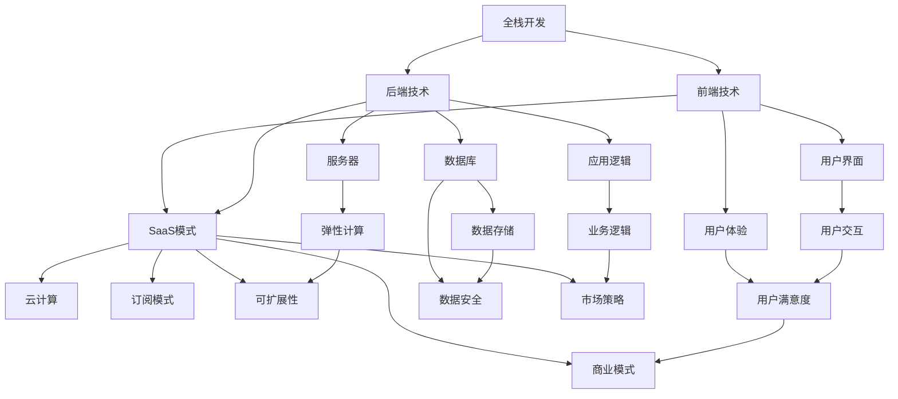

                 

### 背景介绍

在当今的数字化时代，软件开发已经成为企业竞争力的重要组成部分。而全栈开发作为一种兼具前端和后端技能的开发模式，正逐渐受到越来越多的关注。从全栈开发向SaaS（软件即服务）模式的转型，不仅能够提升开发效率，还能为企业和个人带来更广阔的商业机会。

全栈开发（Full-Stack Development）指的是开发者具备处理前端（用户界面）和后端（数据库、服务器、应用逻辑等）所有开发任务的能力。这种开发模式要求开发者熟练掌握多种编程语言和开发工具，例如HTML、CSS、JavaScript、Python、Java等，并能够使用React、Vue、Angular等前端框架以及Node.js、Django、Spring Boot等后端框架。

随着技术的发展，全栈开发已经成为了许多软件开发项目的主流选择。它不仅能够提高开发效率，还能使开发过程更加透明和协同。然而，随着项目的复杂度增加，全栈开发者需要处理更多的技术和业务细节，这对开发者的技能和经验提出了更高的要求。

SaaS模式，即软件即服务（Software as a Service），是一种通过互联网提供软件服务的模式。在这种模式下，软件以服务的形式提供给用户，用户可以通过订阅的方式使用软件，而不需要购买和安装。SaaS模式具有低成本、高可扩展性、易于维护等优点，因此在企业应用中得到了广泛的推广。

从全栈开发到SaaS创业的转型，意味着开发者不仅需要继续掌握前端和后端技能，还需要具备云计算、网络安全、数据存储和管理等方面的知识。此外，创业者还需要具备市场分析、产品设计、团队管理等多方面的能力。

本文将深入探讨从全栈开发到SaaS创业的转型过程，包括核心概念、算法原理、数学模型、项目实践、应用场景和未来发展等，帮助开发者了解这一转型过程中的关键要素和挑战。

### 核心概念与联系

在从全栈开发到SaaS创业的转型过程中，有几个核心概念和联系是必须了解和掌握的。这些概念不仅涵盖了技术层面，还包括商业模式、用户需求和市场策略等。下面我们将通过一个Mermaid流程图来详细展示这些核心概念之间的联系。



#### 前端技术（Front-End Technologies）

前端技术是全栈开发的基石，主要包括HTML、CSS和JavaScript。HTML（HyperText Markup Language）用于构建网页的结构，CSS（Cascading Style Sheets）用于美化网页的样式，JavaScript则用于实现网页的交互功能。这些技术共同构成了用户界面（User Interface, UI），直接影响用户体验（User Experience, UX）。

在SaaS模式中，前端技术同样重要。开发者需要确保用户界面简洁易用，用户体验流畅舒适。此外，随着Web组件和前端框架（如React、Vue、Angular）的普及，前端开发变得越来越模块化和组件化，提高了开发效率和代码复用性。

#### 后端技术（Back-End Technologies）

后端技术涵盖服务器（Server）、数据库（Database）和应用逻辑（Application Logic）。服务器负责处理用户请求、转发数据等任务；数据库用于存储和管理数据；应用逻辑则实现了业务逻辑，如用户认证、数据处理等。

在SaaS模式中，后端技术需要具备高可用性、高可靠性和高可扩展性。云计算（Cloud Computing）提供了弹性计算资源，使得开发者可以根据需求动态调整服务器资源。此外，后端技术还需要确保数据存储的安全性和数据传输的加密性。

#### SaaS模式（Software as a Service）

SaaS模式是软件交付的一种新兴方式，通过互联网向用户提供软件服务。其核心特点是订阅模式（Subscription Model），用户无需购买软件，而是通过订阅支付使用费用。这种模式具有低成本、高可扩展性和易于维护等优点。

在SaaS模式中，云计算（Cloud Computing）是关键基础设施。云计算提供了弹性计算、数据存储和网络安全等资源，使得SaaS应用能够快速部署、灵活扩展和可靠运行。

#### 用户需求（User Needs）

用户需求是软件开发的核心驱动力。在全栈开发中，开发者需要深入了解用户需求，设计出符合用户期望的产品。在SaaS模式中，用户需求同样重要。开发者需要确保SaaS应用能够满足用户的业务需求，并提供良好的用户体验。

#### 市场策略（Market Strategy）

市场策略是SaaS创业成功的关键。开发者需要通过市场调研，了解目标市场、竞争对手和用户需求。然后，制定合适的产品策略、定价策略和推广策略，以吸引用户和市场份额。

#### 商业模式（Business Model）

商业模式是SaaS创业的核心。开发者需要设计可持续的商业模式，包括收入来源、成本结构和盈利模式。常见的商业模式有订阅模式、广告模式和付费增值模式等。

通过上述Mermaid流程图，我们可以清晰地看到从全栈开发到SaaS创业之间的核心概念和联系。这些概念和联系不仅帮助开发者理解转型过程中的关键技术，还有助于创业者制定有效的市场策略和商业模式。

#### 核心算法原理 & 具体操作步骤

在从全栈开发到SaaS创业的过程中，核心算法原理的理解和应用是确保项目成功的关键之一。以下我们将介绍几个关键算法原理，并详细说明其具体操作步骤。

##### 1. 决策树算法（Decision Tree Algorithm）

决策树是一种常用的机器学习算法，通过树形结构对数据进行分类或回归。其核心原理是基于特征和目标之间的条件概率关系，通过递归划分特征，使得每个子集在目标上的概率最大化。

**具体操作步骤：**

1. **数据准备：** 收集并处理数据，确保数据质量。
2. **特征选择：** 根据数据特点选择适当的特征，可以通过信息增益（Information Gain）或基尼不纯度（Gini Impurity）进行选择。
3. **划分数据：** 使用选择的最优特征划分数据，生成树节点。
4. **递归构建：** 对于每个节点，继续划分数据，生成子节点，直至满足停止条件（如最大深度、最小样本量等）。
5. **评估模型：** 使用测试数据评估模型性能，如准确率、召回率等。

**示例：** 假设我们有一个数据集，目标是预测客户是否会购买某种产品。特征包括年龄、收入、信用评分等。我们可以通过决策树算法将这些特征结合，生成一个预测模型。

##### 2. 集成算法（Ensemble Algorithms）

集成算法通过结合多个模型的预测结果，提高模型的准确性和泛化能力。常见的集成算法有随机森林（Random Forest）和梯度提升树（Gradient Boosting Tree）。

**具体操作步骤：**

1. **模型选择：** 选择适当的基模型，如决策树、支持向量机等。
2. **模型训练：** 使用训练数据分别训练多个基模型。
3. **集成预测：** 将所有基模型的预测结果进行加权平均或投票，得到最终预测结果。

**示例：** 假设我们有一个分类问题，可以使用随机森林算法。首先选择多个决策树作为基模型，分别训练，然后对每个决策树的预测结果进行投票，得到最终分类结果。

##### 3. 聚类算法（Clustering Algorithms）

聚类算法用于将数据集划分为多个群组，使得同一群组内的数据点尽可能相似，不同群组的数据点尽可能不同。常见的聚类算法有K-均值（K-Means）和层次聚类（Hierarchical Clustering）。

**具体操作步骤：**

1. **初始化聚类中心：** 选择K个初始聚类中心。
2. **分配数据点：** 根据每个数据点到聚类中心的距离，将其分配到最近的聚类中心。
3. **更新聚类中心：** 根据分配后的数据点重新计算聚类中心。
4. **迭代优化：** 重复步骤2和3，直到聚类中心不再发生显著变化。

**示例：** 假设我们有一个客户数据集，需要将其划分为不同的客户群体。可以使用K-均值算法，首先选择K个初始聚类中心，然后迭代优化，将每个客户点分配到最近的聚类中心，最后得到多个客户群体。

##### 4. 关联规则学习（Association Rule Learning）

关联规则学习用于发现数据集中的关联关系，常见的算法有Apriori算法和FP-Growth算法。

**具体操作步骤：**

1. **构建事务数据库：** 将数据集转换为事务数据库，每个事务代表一次交易。
2. **计算支持度：** 计算每个关联规则的支持度，支持度表示规则在数据集中的出现频率。
3. **计算置信度：** 计算每个关联规则的置信度，置信度表示后件出现的概率。
4. **生成规则：** 根据支持度和置信度阈值，生成满足条件的关联规则。

**示例：** 假设我们有一个超市的销售数据，需要发现顾客购买A商品时很可能也会购买B商品。可以通过Apriori算法，首先构建事务数据库，然后计算每个商品组合的支持度和置信度，最后生成满足阈值的关联规则。

通过上述算法原理和具体操作步骤，开发者可以更好地理解从全栈开发到SaaS创业过程中所需的核心算法，并能够根据实际需求选择合适的算法进行应用。

#### 数学模型和公式 & 详细讲解 & 举例说明

在从全栈开发到SaaS创业的过程中，数学模型和公式的作用至关重要。这些模型和公式不仅可以优化算法性能，还能帮助创业者更好地评估和预测商业表现。以下，我们将详细讲解几个关键的数学模型和公式，并提供实例说明。

##### 1. 决策树中的信息增益（Information Gain）

信息增益是决策树算法中的一个核心概念，用于评估一个特征对数据集划分的 effectiveness。信息增益的计算公式如下：

\[ IG(D, A) = ID(D) - SUM(p(A_i) * IG(D_{A_i}, A)) \]

其中，\( IG(D, A) \) 是特征 A 对数据集 D 的信息增益，\( ID(D) \) 是数据集 D 的信息熵，\( p(A_i) \) 是特征 A 的第 i 个取值在数据集中出现的概率，\( IG(D_{A_i}, A) \) 是在特征 A 的第 i 个取值下，数据集 \( D_{A_i} \) 的信息增益。

**示例：** 假设我们有一个数据集，包含年龄、收入、信用评分三个特征，目标为是否购买某种产品。信息增益的计算如下：

1. **计算数据集 D 的信息熵：**
   \[ ID(D) = - SUM(p(y_i) * log_2(p(y_i))) \]
   假设购买的概率为 0.6，不购买的概率为 0.4，则：
   \[ ID(D) = - (0.6 * log_2(0.6) + 0.4 * log_2(0.4)) \approx 0.918 \]

2. **计算特征 A（年龄）的信息增益：**
   \[ IG(D, A) = ID(D) - SUM(p(A_i) * IG(D_{A_i}, A)) \]
   假设年龄分为三个区间：小于 30 岁、30-50 岁、大于 50 岁，每个区间的购买概率分别为 0.4、0.55 和 0.75，则：
   \[ IG(D, A) = 0.918 - (0.4 * (0.4 * 0.918 + 0.55 * 0.55 + 0.75 * 0.75)) \approx 0.246 \]

3. **重复步骤 2，计算其他特征的信息增益，选择最大者作为划分特征。**

##### 2. 随机森林中的基尼不纯度（Gini Impurity）

基尼不纯度是另一种常用于决策树特征选择的指标，其计算公式如下：

\[ GI(D) = 1 - SUM(p(y_i)^2) \]

其中，\( GI(D) \) 是数据集 D 的基尼不纯度，\( p(y_i) \) 是数据集中属于第 i 个类别的概率。

**示例：** 假设数据集 D 包含两个类别，购买和不购买，购买的概率为 0.6，不购买的概率为 0.4，则：

\[ GI(D) = 1 - (0.6^2 + 0.4^2) = 0.2 \]

基尼不纯度越小，表示数据集的纯度越高，划分后生成的子集纯度越高，因此可以用作特征选择的指标。

##### 3. 聚类算法中的距离度量（Distance Measure）

聚类算法中，距离度量用于计算数据点之间的相似度。常见的距离度量包括欧几里得距离（Euclidean Distance）、曼哈顿距离（Manhattan Distance）和余弦相似度（Cosine Similarity）。

**欧几里得距离：**

\[ d(x, y) = \sqrt{\sum_{i=1}^{n} (x_i - y_i)^2} \]

其中，\( x \) 和 \( y \) 是两个数据点，\( n \) 是特征的数量。

**示例：** 假设两个数据点 \( x = [1, 2, 3] \) 和 \( y = [2, 3, 4] \)，则欧几里得距离为：

\[ d(x, y) = \sqrt{(1-2)^2 + (2-3)^2 + (3-4)^2} = \sqrt{1 + 1 + 1} = \sqrt{3} \]

**曼哈顿距离：**

\[ d(x, y) = \sum_{i=1}^{n} |x_i - y_i| \]

**示例：** 同样的两个数据点 \( x = [1, 2, 3] \) 和 \( y = [2, 3, 4] \)，则曼哈顿距离为：

\[ d(x, y) = |1-2| + |2-3| + |3-4| = 1 + 1 + 1 = 3 \]

**余弦相似度：**

\[ \cos(\theta) = \frac{\sum_{i=1}^{n} x_i y_i}{\sqrt{\sum_{i=1}^{n} x_i^2} \sqrt{\sum_{i=1}^{n} y_i^2}} \]

**示例：** 假设两个数据点 \( x = [1, 2, 3] \) 和 \( y = [2, 3, 4] \)，则余弦相似度为：

\[ \cos(\theta) = \frac{1*2 + 2*3 + 3*4}{\sqrt{1^2 + 2^2 + 3^2} \sqrt{2^2 + 3^2 + 4^2}} = \frac{2 + 6 + 12}{\sqrt{14} \sqrt{29}} \approx 0.948 \]

##### 4. 集成算法中的权重调整（Weight Adjustment）

在集成算法中，如随机森林和梯度提升树，每个基模型的权重需要根据其预测性能进行调整。权重调整的公式如下：

\[ w_i = \frac{1}{1 + e^{-\alpha \cdot \Delta}} \]

其中，\( w_i \) 是模型 i 的权重，\( \alpha \) 是调整系数，\( \Delta \) 是模型 i 的预测误差。

**示例：** 假设有一个随机森林模型，其中包含三个基模型，初始权重分别为 \( w_1 = 0.5 \)、\( w_2 = 0.3 \) 和 \( w_3 = 0.2 \)。第一个基模型的预测误差为 \( \Delta_1 = 0.1 \)，则其权重调整如下：

\[ w_1 = \frac{1}{1 + e^{-\alpha \cdot 0.1}} = \frac{1}{1 + e^{-0.1}} \approx 0.588 \]

类似地，可以调整其他基模型的权重。

通过上述数学模型和公式的讲解，我们可以看到它们在从全栈开发到SaaS创业过程中的重要作用。这些模型和公式不仅帮助开发者优化算法性能，还帮助创业者更好地理解和预测商业表现。

### 项目实践：代码实例和详细解释说明

为了更好地理解从全栈开发到SaaS创业的过程，我们将通过一个实际项目——一个简单的在线购物平台——来展示代码实例和详细解释说明。

#### 开发环境搭建

1. **硬件环境**：一台配置不低于 Intel i5 处理器的电脑，8GB 内存，50GB 硬盘空间。
2. **软件环境**：
   - 操作系统：Windows 10 / macOS / Linux
   - 编程语言：Python 3.x
   - 开发工具：PyCharm
   - 依赖库：Flask（Web 框架）、SQLAlchemy（ORM）、Flask-WTF（表单处理）、Flask-Login（用户认证）等

#### 源代码详细实现

以下是一个简单的购物平台的核心源代码，我们将逐段代码进行解释：

```python
# app.py

from flask import Flask, render_template, request, redirect, url_for
from flask_sqlalchemy import SQLAlchemy
from flask_login import LoginManager, login_user, login_required, logout_user, current_user

app = Flask(__name__)
app.config['SQLALCHEMY_DATABASE_URI'] = 'sqlite:///shop.db'
app.config['SECRET_KEY'] = 'your_secret_key'
db = SQLAlchemy(app)
login_manager = LoginManager(app)

# 用户模型
class User(db.Model):
    id = db.Column(db.Integer, primary_key=True)
    username = db.Column(db.String(100), unique=True, nullable=False)
    password = db.Column(db.String(100), nullable=False)

# 商品模型
class Product(db.Model):
    id = db.Column(db.Integer, primary_key=True)
    name = db.Column(db.String(100), nullable=False)
    price = db.Column(db.Float, nullable=False)

@login_manager.user_loader
def load_user(user_id):
    return User.query.get(int(user_id))

@app.route('/')
@login_required
def home():
    products = Product.query.all()
    return render_template('home.html', products=products)

@app.route('/login', methods=['GET', 'POST'])
def login():
    if request.method == 'POST':
        username = request.form['username']
        password = request.form['password']
        user = User.query.filter_by(username=username).first()
        if user and user.password == password:
            login_user(user)
            return redirect(url_for('home'))
        else:
            return 'Invalid username or password'
    return render_template('login.html')

@app.route('/logout')
@login_required
def logout():
    logout_user()
    return redirect(url_for('login'))

@app.route('/add_product', methods=['GET', 'POST'])
@login_required
def add_product():
    if request.method == 'POST':
        name = request.form['name']
        price = request.form['price']
        new_product = Product(name=name, price=price)
        db.session.add(new_product)
        db.session.commit()
        return redirect(url_for('home'))
    return render_template('add_product.html')

if __name__ == '__main__':
    db.create_all()
    app.run(debug=True)
```

#### 代码解读与分析

1. **数据库模型**：代码中定义了两个数据库模型：`User` 和 `Product`。`User` 模型代表用户，包括用户名和密码；`Product` 模型代表商品，包括商品名称和价格。

2. **用户认证**：使用了 Flask-Login 扩展来管理用户认证。通过 `login_manager.user_loader` 装饰器，实现了用户的加载和登录状态的管理。

3. **路由与视图**：代码中定义了多个路由和视图函数：
   - `home()`：首页视图，展示所有商品。
   - `login()`：登录视图，处理用户登录。
   - `logout()`：登出视图，处理用户登出。
   - `add_product()`：添加商品视图，处理用户添加商品。

4. **模板渲染**：使用了 Flask 的 `render_template` 函数来渲染 HTML 模板。模板文件分别对应于每个视图函数的功能。

#### 运行结果展示

1. **用户登录**：用户访问 `/login` 页面，输入用户名和密码，如果验证成功，将被重定向到首页。

2. **首页展示**：用户登录成功后，访问首页，页面将展示所有商品列表。

3. **添加商品**：用户登录后，可以访问 `/add_product` 页面，输入商品名称和价格，提交表单后，商品将被添加到数据库中，并展示在首页。

#### 功能扩展

1. **购物车功能**：可以扩展购物车功能，让用户能够添加商品到购物车，并进行结算。

2. **订单管理**：可以添加订单管理功能，记录用户的购物订单。

3. **用户评论**：可以添加用户评论功能，让用户对商品进行评价。

通过上述实际项目实践，我们可以看到从全栈开发到SaaS创业过程中的关键步骤和实现方法。开发者可以通过不断实践和优化，逐步提升自己的开发能力和创业经验。

### 实际应用场景

从全栈开发到SaaS创业的过程中，实际应用场景是衡量项目成功与否的重要标准。以下，我们将探讨几个常见的实际应用场景，并分析如何在这些场景中优化开发流程和提高项目成功率。

#### 1. 在线教育平台

在线教育平台是一个典型的SaaS应用场景，它通过互联网向用户提供在线课程、学习资源和互动交流。在这种场景中，全栈开发的能力至关重要，开发者需要掌握前端技术（如HTML、CSS、JavaScript和Vue.js）、后端技术（如Python和Django）以及云计算和大数据处理。

**优化建议：**
- **模块化设计**：将前端、后端和数据库模块化，提高代码复用性和维护性。
- **负载均衡**：使用云计算平台（如AWS、Azure）提供的负载均衡服务，确保平台在高并发场景下稳定运行。
- **用户行为分析**：利用大数据分析技术，对用户行为进行实时监测和分析，优化课程推荐和用户体验。
- **安全性保障**：确保用户数据的安全和隐私，采用SSL加密、身份验证和数据备份等安全措施。

#### 2. 企业办公协同平台

企业办公协同平台是一种为企业提供在线协作、文档管理、日程安排等功能的SaaS应用。在这种场景中，开发者需要具备丰富的全栈开发经验和团队协作能力。

**优化建议：**
- **用户体验优先**：注重用户界面的设计和用户体验，提供简洁、直观的操作界面。
- **实时协作**：实现实时文档编辑和多人协作功能，提升团队工作效率。
- **移动端适配**：确保平台能够适配各种移动设备，满足用户在不同设备上的办公需求。
- **系统集成**：提供与其他企业应用（如CRM、ERP）的集成能力，实现数据共享和流程自动化。

#### 3. 金融服务平台

金融服务平台是一种提供金融产品和服务（如投资、理财、支付等）的SaaS应用。在这种场景中，开发者需要具备严格的金融合规性和数据处理能力。

**优化建议：**
- **合规性保障**：遵循金融行业的法规和标准，确保平台的安全性和合规性。
- **高可用性**：实现高可用性设计，确保平台在极端情况下依然能够稳定运行。
- **数据安全**：采用加密技术保障用户数据的安全，防止数据泄露和恶意攻击。
- **风险控制**：通过实时监控和数据分析，及时发现并控制风险，保障用户资金安全。

#### 4. 健康医疗平台

健康医疗平台是一种提供在线医疗咨询、健康管理、医疗预约等服务的SaaS应用。在这种场景中，开发者需要具备医学知识和数据处理能力。

**优化建议：**
- **个性化服务**：根据用户健康数据和需求，提供个性化的健康建议和医疗服务。
- **远程诊疗**：实现远程诊疗功能，提高医疗服务的覆盖范围和效率。
- **数据隐私保护**：确保用户健康数据的隐私和安全，遵守相关法律法规。
- **人工智能辅助**：利用人工智能技术，提供智能诊断、病情预测等功能，提高医疗服务质量。

通过以上实际应用场景的分析，我们可以看到从全栈开发到SaaS创业过程中，如何在不同领域优化开发流程和提高项目成功率是至关重要的。开发者需要根据具体应用场景的需求，灵活运用技术和管理方法，不断提升自身能力和项目质量。

### 工具和资源推荐

在从全栈开发到SaaS创业的过程中，掌握合适的工具和资源是成功的关键。以下，我们将推荐一些学习资源、开发工具和论文著作，帮助开发者提升技能，加速项目进程。

#### 学习资源推荐

1. **书籍**：
   - 《SaaS商业模式》
   - 《Python Web开发实战》
   - 《Vue.js实战》
   - 《Django实战》
   - 《深度学习》

2. **论文**：
   - 《云计算基础设施的设计与实现》
   - 《基于机器学习的用户行为预测》
   - 《SaaS平台安全性研究》
   - 《大数据处理技术与应用》

3. **博客和网站**：
   - 《阮一峰的网络日志》
   - 《云栖社区》
   - 《掘金》
   - 《GitHub》

#### 开发工具推荐

1. **集成开发环境（IDE）**：
   - PyCharm（Python开发）
   - Visual Studio Code（多语言开发）
   - IntelliJ IDEA（Java开发）

2. **数据库**：
   - MySQL
   - PostgreSQL
   - MongoDB

3. **前端框架**：
   - React
   - Vue.js
   - Angular

4. **后端框架**：
   - Django（Python）
   - Flask（Python）
   - Spring Boot（Java）

5. **云计算平台**：
   - AWS
   - Azure
   - Google Cloud Platform

6. **容器化和编排工具**：
   - Docker
   - Kubernetes

#### 相关论文著作推荐

1. **《云计算：概念、架构与实践》**：详细介绍了云计算的基本概念、架构和实现技术，对开发者理解和应用云计算具有很高的参考价值。

2. **《深度学习与人工智能：基础与应用》**：介绍了深度学习的基本原理和主要应用，对开发者掌握人工智能技术具有重要意义。

3. **《软件工程：实践者的研究方法》**：探讨了软件工程的基本方法和实践，对开发者提升项目管理和开发能力具有指导意义。

4. **《大数据技术导论》**：系统介绍了大数据处理技术，包括数据采集、存储、处理和分析等，对开发者理解和应用大数据技术具有参考价值。

通过以上工具和资源的推荐，开发者可以不断提升自身技能，为从全栈开发到SaaS创业的转型打下坚实的基础。

### 总结：未来发展趋势与挑战

从全栈开发到SaaS创业的转型，不仅代表了软件开发模式的升级，也预示着未来技术发展的新趋势。随着云计算、大数据、人工智能等技术的不断进步，SaaS模式在各个领域的应用前景将越来越广阔。以下，我们总结未来发展趋势和面临的挑战。

#### 未来发展趋势

1. **云计算的普及**：云计算为SaaS应用提供了强大的基础设施支持，使得开发者可以更加专注于业务逻辑的实现。随着云计算技术的成熟，SaaS应用的部署和运维成本将进一步降低，更多企业将选择采用SaaS模式。

2. **人工智能的应用**：人工智能技术正在改变各个行业的面貌，包括软件开发。通过机器学习、深度学习等技术，SaaS应用可以实现智能推荐、自动化分析等功能，提升用户体验和业务效率。

3. **大数据的处理与分析**：大数据技术可以帮助SaaS应用更好地理解和满足用户需求。通过对用户行为、市场趋势等大数据的分析，开发者可以优化产品设计和推广策略，提高市场竞争力和盈利能力。

4. **区块链技术的发展**：区块链技术具有去中心化、不可篡改等特点，可以应用于SaaS应用中的数据安全和隐私保护。未来，区块链技术有望成为SaaS领域的重要基础设施。

#### 面临的挑战

1. **技术复杂性**：随着SaaS应用的复杂度增加，开发者需要掌握更多的技术和工具。如何高效地整合和管理各种技术资源，确保系统的稳定性和安全性，是开发者面临的一大挑战。

2. **市场竞争激烈**：SaaS市场处于快速增长的阶段，竞争异常激烈。如何在众多竞争者中脱颖而出，打造具有独特竞争力的产品，是创业者需要面对的重要问题。

3. **用户需求多变**：用户需求不断变化，如何快速响应用户需求，提供个性化服务，是SaaS企业需要持续关注的问题。此外，用户隐私和数据安全也是重要的挑战。

4. **法律法规合规**：随着各国对数据隐私和网络安全监管的加强，SaaS企业需要遵守相关的法律法规，确保用户数据的安全和合规。

#### 结论

从全栈开发到SaaS创业的转型，不仅带来了技术上的革新，也为企业带来了新的商业机会。未来，开发者需要紧跟技术发展趋势，不断提升自身技能，应对市场竞争和用户需求的变化。同时，注重法律法规合规，确保业务的安全和可持续发展。通过不断努力，开发者将在SaaS领域创造更多的价值。

### 附录：常见问题与解答

在从全栈开发到SaaS创业的过程中，开发者可能会遇到一系列技术和管理上的问题。以下，我们针对一些常见问题进行解答。

#### 1. 如何选择合适的云计算平台？

选择合适的云计算平台取决于业务需求和预算。以下是几个关键因素：

- **计算能力**：根据应用的性能需求，选择具有足够计算资源的平台。
- **数据存储**：考虑数据存储的容量、速度和安全性能。
- **网络连接**：确保平台具有良好的网络连接性能，满足应用的高并发需求。
- **成本**：对比不同平台的价格策略，选择性价比最高的方案。
- **服务支持**：考虑平台的技术支持和售后服务质量。

常见云计算平台包括AWS、Azure、Google Cloud Platform等，开发者可以根据实际需求进行选择。

#### 2. 如何确保SaaS应用的安全性？

确保SaaS应用的安全性是保护用户数据和隐私的关键。以下是一些关键措施：

- **加密技术**：使用SSL/TLS加密技术保护数据传输安全。
- **访问控制**：采用严格的访问控制策略，限制对用户数据的访问权限。
- **数据备份**：定期备份数据，确保数据在故障或攻击中不会丢失。
- **安全审计**：定期进行安全审计，检测潜在的安全漏洞。
- **合规性**：遵守相关法律法规，如GDPR、CCPA等，确保业务合规。

#### 3. 如何快速响应用户需求？

快速响应用户需求是SaaS企业保持竞争力的关键。以下是一些建议：

- **敏捷开发**：采用敏捷开发方法，快速迭代和优化产品。
- **用户反馈**：积极收集用户反馈，了解用户需求和意见。
- **自动化测试**：使用自动化测试工具，提高测试效率和质量。
- **模块化设计**：采用模块化设计，便于快速开发和部署新功能。
- **用户体验优化**：关注用户体验，提供简洁、直观的操作界面。

#### 4. 如何制定有效的市场策略？

制定有效的市场策略是SaaS创业成功的关键。以下是一些建议：

- **市场调研**：了解目标市场和竞争对手，明确自身优势和差异化策略。
- **产品定位**：确定产品的目标用户群体和核心功能。
- **定价策略**：制定合理的定价策略，平衡盈利和市场份额。
- **营销推广**：利用各种营销渠道（如社交媒体、内容营销、广告等）进行推广。
- **客户关系管理**：建立良好的客户关系，提供优质的客户服务，提高客户满意度和忠诚度。

通过上述问题和解答，开发者可以更好地应对从全栈开发到SaaS创业过程中遇到的各种挑战，为企业的可持续发展打下坚实基础。

### 扩展阅读 & 参考资料

在从全栈开发到SaaS创业的过程中，学习更多相关领域的知识和技术是至关重要的。以下推荐一些扩展阅读和参考资料，帮助开发者深入了解相关主题。

#### 扩展阅读

1. 《SaaS架构设计与实践》：详细介绍了SaaS系统的设计原则、架构模式和关键技术，适合开发者系统性地学习SaaS架构。

2. 《Python Web开发实战》：涵盖了使用Python进行Web开发的各个方面，包括Flask、Django等框架的使用。

3. 《Vue.js实战》：深入讲解Vue.js框架的使用，适合开发者掌握前端技术。

4. 《深度学习》和《机器学习实战》：介绍了深度学习和机器学习的基本原理和应用，有助于开发者提升数据处理和分析能力。

#### 参考资料

1. AWS官方文档：[https://aws.amazon.com/documentation/](https://aws.amazon.com/documentation/)
2. Azure官方文档：[https://docs.microsoft.com/zh-cn/azure/](https://docs.microsoft.com/zh-cn/azure/)
3. Google Cloud官方文档：[https://cloud.google.com/documentation/](https://cloud.google.com/documentation/)
4. Flask官方文档：[https://flask.palletsprojects.com/](https://flask.palletsprojects.com/)
5. Django官方文档：[https://docs.djangoproject.com/](https://docs.djangoproject.com/)
6. Vue.js官方文档：[https://vuejs.org/](https://vuejs.org/)

通过阅读这些书籍和资料，开发者可以不断丰富自己的技术储备，提升在SaaS创业领域的竞争力。同时，积极参与技术社区和开源项目，与其他开发者交流经验和最佳实践，也是提升技能的重要途径。

