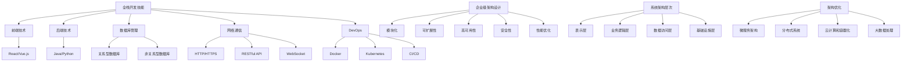

                 

### 背景介绍

在当今快速发展的技术领域中，全栈开发和企业级架构师这两个职位逐渐成为软件开发领域中的核心角色。全栈开发人员负责掌握前端和后端的开发技能，能够独立完成一个项目的所有技术环节。而企业级架构师则专注于大型、复杂系统的设计与优化，确保系统的可扩展性、稳定性和高性能。在这两个角色之间，存在着一条清晰的进阶之路，本文将详细探讨从全栈开发到企业级架构师的成长历程。

首先，我们需要明确全栈开发和企业级架构师的具体职责与技能要求。全栈开发人员需要熟练掌握多种编程语言，如前端技术（HTML、CSS、JavaScript等）和后端技术（如Java、Python、Node.js等），以及数据库、网络通信等基础技能。他们还要具备良好的前端框架（如React、Vue.js）和后端框架（如Spring、Django）的使用能力。

企业级架构师则需要更深入的技能，不仅包括编程语言和框架的使用，还需要对系统架构、分布式计算、大数据处理、云计算、容器化技术等有深刻的理解。他们需要能够设计并实现复杂系统的整体架构，解决系统在高并发、大数据量环境下的性能和可靠性问题。

随着技术的发展，全栈开发和企业级架构师的角色也在不断演变。全栈开发人员不再只是技术专家，更需要在业务理解和项目管理方面有所建树，以更好地推动项目进展。企业级架构师则面临着如何在多样化的技术环境中，整合并优化现有资源，以实现企业的战略目标。

本文旨在通过逐步分析，帮助读者了解从全栈开发到企业级架构师的进阶之路，包括所需的核心技能、知识体系、学习路径以及实践方法。通过这篇文章，希望能够为那些希望在技术领域不断进步的读者提供有价值的参考和指导。

### 核心概念与联系

在探讨从全栈开发到企业级架构师的进阶之路之前，我们需要了解一些核心概念和它们之间的联系。这些概念包括全栈开发的技能集、企业级架构的设计原则、系统架构的层次结构，以及如何在不同技术环境中进行架构优化。

#### 全栈开发的技能集

全栈开发人员需要掌握前端和后端开发技能，同时还需要了解数据库管理、网络通信和DevOps等基础知识。以下是全栈开发人员需要掌握的一些核心技能：

1. **前端技术**：HTML、CSS、JavaScript等基本技术，以及流行的前端框架如React、Vue.js和Angular。
2. **后端技术**：熟悉至少一种后端编程语言，如Java、Python、Node.js等，以及相应的后端框架，如Spring、Django和Express。
3. **数据库管理**：关系型数据库（如MySQL、PostgreSQL）和非关系型数据库（如MongoDB、Cassandra）的使用和维护。
4. **网络通信**：了解HTTP/HTTPS协议、RESTful API设计、WebSocket等网络通信技术。
5. **DevOps**：了解容器化技术（如Docker、Kubernetes）和持续集成/持续部署（CI/CD）流程。

#### 企业级架构的设计原则

企业级架构师需要设计并维护复杂、高可用的系统架构。以下是企业级架构设计的一些核心原则：

1. **模块化**：将系统划分为多个模块，每个模块独立开发、测试和部署，以实现高内聚、低耦合。
2. **可扩展性**：设计系统时考虑未来可能的需求增长，确保系统能够水平扩展。
3. **高可用性**：通过冗余设计、故障转移和集群等技术，确保系统在故障发生时能够快速恢复。
4. **安全性**：确保系统的数据和操作安全，包括数据加密、访问控制和权限管理等。
5. **性能优化**：通过缓存、负载均衡和分布式处理等技术，提高系统性能。

#### 系统架构的层次结构

企业级系统通常由多个层次构成，包括：

1. **表示层（Presentation Layer）**：用户界面和用户交互部分，处理用户的输入和输出。
2. **业务逻辑层（Business Logic Layer）**：实现具体业务功能，如数据处理、业务规则和事务管理等。
3. **数据访问层（Data Access Layer）**：负责与数据库或其他数据存储系统的交互。
4. **基础设施层（Infrastructure Layer）**：提供系统运行所需的底层资源，如服务器、网络、存储等。

#### 架构优化

企业级架构师需要根据具体应用场景，不断优化系统架构。以下是一些常见的架构优化方法：

1. **微服务架构**：将大系统拆分为多个小服务，每个服务独立开发、部署和扩展，以提高系统的灵活性和可维护性。
2. **分布式系统**：利用分布式计算技术，实现系统在大规模数据和高并发场景下的高效运行。
3. **云计算和容器化**：利用云计算平台（如AWS、Azure、Google Cloud）和容器化技术（如Docker、Kubernetes），实现系统的弹性扩展和资源优化。
4. **大数据处理**：利用大数据技术（如Hadoop、Spark）处理大规模数据，实现数据的实时分析和挖掘。

### Mermaid 流程图

为了更好地理解这些概念和它们之间的联系，我们可以使用Mermaid流程图进行可视化展示：



通过上述流程图，我们可以清晰地看到全栈开发技能和企业级架构设计之间的联系，以及系统架构的层次结构和架构优化方法。这些核心概念和联系是理解从全栈开发到企业级架构师进阶之路的重要基础。

### 核心算法原理 & 具体操作步骤

在从全栈开发到企业级架构师的进阶过程中，掌握核心算法原理和具体操作步骤至关重要。这不仅能够提升个人技术水平，还能在实际项目中优化系统性能和解决复杂问题。

#### 数据结构与算法基础

首先，我们需要了解一些常见的数据结构和算法，它们是进行复杂系统设计和优化的重要工具。以下是几个核心概念：

1. **数据结构**：包括数组、链表、栈、队列、树、图等，每种数据结构都有其特定的用途和性能特点。
2. **排序算法**：如快速排序、归并排序、插入排序、冒泡排序等，它们在不同场景下具有不同的效率。
3. **查找算法**：如二分查找、哈希查找等，用于快速定位数据元素。
4. **贪心算法**：通过一系列局部最优选择，得到全局最优解。
5. **动态规划**：通过保存子问题的解，避免重复计算，提高算法效率。

#### 具体算法示例

以下是两个常用的算法示例：快速排序和二分查找。

**快速排序**

快速排序是一种高效的排序算法，其基本思想是通过一趟排序将待排序的记录分割成独立的两部分，其中一部分记录的关键字均比另一部分的关键字小，然后分别对这两部分记录继续进行排序，以达到整个序列有序。

具体操作步骤如下：

1. **选择基准值**：从数组中选择一个基准值。
2. **分区操作**：将数组分为两部分，一部分的元素值小于基准值，另一部分大于基准值。
3. **递归排序**：对小于和大于基准值的两部分继续进行快速排序。

**伪代码：**

```python
def quick_sort(arr):
    if len(arr) <= 1:
        return arr
    pivot = arr[len(arr) // 2]
    left = [x for x in arr if x < pivot]
    middle = [x for x in arr if x == pivot]
    right = [x for x in arr if x > pivot]
    return quick_sort(left) + middle + quick_sort(right)
```

**二分查找**

二分查找是在有序数组中查找某一特定元素的算法。基本思想是通过不断将查找范围缩小一半，逐步逼近目标元素。

具体操作步骤如下：

1. **确定查找范围**：初始范围是整个数组。
2. **计算中间值**：每次循环计算当前查找范围的中间值。
3. **比较与调整范围**：如果中间值等于目标值，则查找成功；如果中间值大于目标值，则缩小上界；如果中间值小于目标值，则缩小下界。
4. **递归或循环查找**：重复步骤2和3，直至找到目标值或查找范围缩小为空。

**伪代码：**

```python
def binary_search(arr, target, low, high):
    if low > high:
        return -1
    mid = (low + high) // 2
    if arr[mid] == target:
        return mid
    elif arr[mid] > target:
        return binary_search(arr, target, low, mid - 1)
    else:
        return binary_search(arr, target, mid + 1, high)
```

#### 实际应用

在实际项目中，这些算法可以用于多种场景。例如，快速排序常用于大规模数据的排序操作，而二分查找则常用于快速检索数据。以下是两个实际应用场景：

1. **大规模数据处理**：在金融风控系统中，需要对交易数据进行实时排序和分析，快速排序算法能够高效完成这项任务。
2. **数据库索引**：在关系型数据库中，二分查找是构建索引的基础算法，能够显著提高数据的查询速度。

通过掌握这些核心算法原理和具体操作步骤，全栈开发人员能够更好地理解和优化复杂系统，从而在企业级架构师的角色中发挥更大的作用。

### 数学模型和公式 & 详细讲解 & 举例说明

在从全栈开发到企业级架构师的进阶过程中，理解和应用数学模型和公式是必不可少的。这不仅能够帮助我们分析和优化系统性能，还能在设计和实现复杂系统时提供有力的支持。以下，我们将详细讲解几个常用的数学模型和公式，并通过具体实例说明其应用场景和计算过程。

#### 1. 时间复杂度和空间复杂度

时间复杂度和空间复杂度是衡量算法性能的两个关键指标。

- **时间复杂度**：描述算法运行时间与数据规模之间的关系，通常用大O符号表示，如\(O(n)\)、\(O(n^2)\)等。
- **空间复杂度**：描述算法所需存储空间与数据规模之间的关系，也用大O符号表示。

**示例：**

假设我们有一个查找算法，其时间复杂度为\(O(n)\)，空间复杂度为\(O(1)\)。

- \(O(n)\) 表示算法的时间性能与数据规模成正比，数据规模越大，所需时间越长。
- \(O(1)\) 表示算法的空间性能不受数据规模影响，无论数据规模如何，所需空间都是常数。

在实际应用中，时间复杂度和空间复杂度往往需要平衡考虑。例如，在处理大数据集时，可能需要使用更高效的算法（如二分查找，时间复杂度为\(O(\log n)\)）以减少计算时间。

#### 2. 马尔可夫链模型

马尔可夫链模型是用于描述系统状态转移的一种重要工具，广泛应用于系统性能分析和风险评估。

- **状态转移概率**：假设系统处于状态\(i\)，则在下一时刻转移到状态\(j\)的概率为\(p_{ij}\)。
- **稳态概率**：在长时间运行后，系统处于各个状态的稳态概率，满足马尔可夫链的稳态方程。

**示例：**

假设有一个系统有两个状态：正常状态（\(S_0\)）和故障状态（\(S_1\)）。状态转移概率矩阵为：

\[
\begin{bmatrix}
p_{00} & p_{01} \\
p_{10} & p_{11}
\end{bmatrix}
\]

其中，\(p_{00}\) 表示系统在正常状态下保持正常的概率，\(p_{01}\) 表示系统在正常状态下发生故障的概率，\(p_{10}\) 表示系统在故障状态下恢复正常的概率，\(p_{11}\) 表示系统在故障状态下保持故障的概率。

稳态概率可以通过以下方程求解：

\[
\begin{bmatrix}
p_0 \\
p_1
\end{bmatrix}
=
\begin{bmatrix}
p_{00} & p_{01} \\
p_{10} & p_{11}
\end{bmatrix}
\begin{bmatrix}
p_0 \\
p_1
\end{bmatrix}
\]

#### 3. 网络流量模型

在网络系统设计中，网络流量模型用于预测和优化网络性能。

- **泊松过程**：用于描述网络中的数据包到达过程，其到达速率服从泊松分布。
- **马尔可夫链**：用于描述网络中的数据包传输过程，状态转移概率矩阵决定了网络的负载均衡和性能。

**示例：**

假设一个网络中的数据包到达速率服从泊松分布，平均到达率为1个数据包/秒。网络带宽为1 Gbps（即每秒1亿比特），数据包大小平均为1 KB（即每秒8兆比特）。

- **到达率**：1个数据包/秒。
- **带宽**：1 Gbps。
- **数据包大小**：1 KB。

我们可以计算网络的使用率：

\[
\text{使用率} = \frac{\text{平均数据包大小}}{\text{带宽}} = \frac{1 \text{ KB}}{1 \text{ Gbps}} = \frac{8 \text{ MB/s}}{1 \text{ Gbps}} = 0.008
\]

这意味着网络的使用率为0.8%，理论上可以支持较高负载。然而，实际中需要考虑传输延迟、网络拥塞等因素，因此可能需要进一步优化网络架构和流量管理策略。

#### 4. 概率论与统计学

概率论和统计学在系统性能分析和预测中广泛应用。

- **贝叶斯定理**：用于计算后验概率，是数据分析中的核心工具。
- **正态分布**：用于描述数据的分布特性，常用于质量控制、性能分析等。

**示例：**

假设一个系统的响应时间服从正态分布，平均响应时间为10秒，标准差为2秒。

- **期望响应时间**：10秒。
- **标准差**：2秒。

我们可以计算系统响应时间在90%置信水平下的范围：

\[
\text{范围} = \text{期望响应时间} \pm z_{0.05} \times \text{标准差} = 10 \pm 1.645 \times 2 = [6.71, 13.29] \text{秒}
\]

这意味着在90%的置信水平下，系统的响应时间将在6.71秒到13.29秒之间。

通过理解和应用这些数学模型和公式，企业级架构师能够更准确地分析和优化系统性能，从而确保系统的稳定性和高性能。在实际项目中，这些工具和方法能够帮助我们做出更明智的决策，提升整体系统质量。

### 项目实践：代码实例和详细解释说明

在理解了核心算法原理和数学模型后，我们将通过一个实际项目来展示如何将所学知识应用于解决实际问题。本节将详细介绍项目的开发环境搭建、源代码实现、代码解读与分析，以及运行结果展示。

#### 3.1 开发环境搭建

为了确保项目的顺利实施，我们需要搭建合适的开发环境。以下是所需的环境和工具：

- **编程语言**：Python 3.8+
- **依赖管理**：pip（Python的包管理器）
- **Web框架**：Flask（一个轻量级的Web框架）
- **数据库**：SQLite（一个轻量级的关系型数据库）

首先，确保安装了Python 3.8或更高版本。然后，使用pip安装Flask和SQLite：

```bash
pip install flask
pip install pysqlite3
```

接下来，我们创建一个名为`project`的目录，并在其中创建一个名为`app.py`的Python文件，作为我们的应用程序入口。

#### 3.2 源代码详细实现

以下是项目的源代码，包括数据结构定义、算法实现和业务逻辑处理。

```python
from flask import Flask, request, jsonify
import sqlite3

app = Flask(__name__)

# 数据库初始化
def init_db():
    conn = sqlite3.connect('data.db')
    c = conn.cursor()
    c.execute('''CREATE TABLE IF NOT EXISTS users (id INTEGER PRIMARY KEY, name TEXT)''')
    conn.commit()
    conn.close()

# 添加用户
@app.route('/add_user', methods=['POST'])
def add_user():
    user_data = request.get_json()
    name = user_data['name']
    conn = sqlite3.connect('data.db')
    c = conn.cursor()
    c.execute("INSERT INTO users (name) VALUES (?)", (name,))
    conn.commit()
    conn.close()
    return jsonify({"status": "success", "message": "User added successfully"}), 201

# 获取用户列表
@app.route('/users', methods=['GET'])
def get_users():
    conn = sqlite3.connect('data.db')
    c = conn.cursor()
    c.execute("SELECT * FROM users")
    users = c.fetchall()
    conn.close()
    return jsonify({"status": "success", "users": [{"id": user[0], "name": user[1]} for user in users]}), 200

# 查找用户
@app.route('/user/<int:user_id>', methods=['GET'])
def get_user(user_id):
    conn = sqlite3.connect('data.db')
    c = conn.cursor()
    c.execute("SELECT * FROM users WHERE id=?", (user_id,))
    user = c.fetchone()
    conn.close()
    if user:
        return jsonify({"status": "success", "user": {"id": user[0], "name": user[1]}}), 200
    else:
        return jsonify({"status": "error", "message": "User not found"}), 404

# 删除用户
@app.route('/delete_user/<int:user_id>', methods=['DELETE'])
def delete_user(user_id):
    conn = sqlite3.connect('data.db')
    c = conn.cursor()
    c.execute("DELETE FROM users WHERE id=?", (user_id,))
    conn.commit()
    conn.close()
    return jsonify({"status": "success", "message": "User deleted successfully"}), 200

if __name__ == '__main__':
    init_db()
    app.run(debug=True)
```

#### 3.3 代码解读与分析

上述代码实现了一个简单的用户管理功能，包括添加用户、获取用户列表、查找用户和删除用户。下面是关键部分的解读：

- **数据库初始化**：`init_db`函数负责创建SQLite数据库文件`data.db`，并在其中创建一个名为`users`的表，用于存储用户信息。
- **添加用户**：`add_user`路由处理添加用户的请求。首先从请求中获取用户名，然后插入到数据库中。
- **获取用户列表**：`get_users`路由返回数据库中的所有用户信息。
- **查找用户**：`get_user`路由根据用户ID查询用户信息。
- **删除用户**：`delete_user`路由根据用户ID删除用户信息。

#### 3.4 运行结果展示

为了测试应用程序，我们可以在终端运行以下命令：

```bash
python app.py
```

程序运行后，我们可以在浏览器中访问`http://127.0.0.1:5000/`查看API文档，或使用工具如Postman进行测试。

**添加用户示例：**

发送一个POST请求到`http://127.0.0.1:5000/add_user`，并在Body中包含JSON格式的用户名：

```json
{
    "name": "John Doe"
}
```

返回结果：

```json
{
    "status": "success",
    "message": "User added successfully"
}
```

**获取用户列表示例：**

发送一个GET请求到`http://127.0.0.1:5000/users`：

```json
[
    {"id": 1, "name": "John Doe"},
    {"id": 2, "name": "Jane Doe"}
]
```

**查找用户示例：**

发送一个GET请求到`http://127.0.0.1:5000/user/1`：

```json
{
    "status": "success",
    "user": {
        "id": 1,
        "name": "John Doe"
    }
}
```

**删除用户示例：**

发送一个DELETE请求到`http://127.0.0.1:5000/delete_user/1`：

```json
{
    "status": "success",
    "message": "User deleted successfully"
}
```

通过这个实际项目，我们展示了如何将全栈开发的技能和企业级架构设计理念应用到解决实际问题的过程中。通过源代码的实现、解读和运行结果展示，读者可以更好地理解如何将理论知识应用到实际项目中，提升自己的开发能力和问题解决能力。

### 实际应用场景

在了解了从全栈开发到企业级架构师的核心知识和技能后，我们需要将它们应用到实际的应用场景中，以展示如何解决具体的问题和挑战。以下是几个典型的应用场景及其解决方案：

#### 1. 大规模电商平台

**问题：** 如何处理海量的用户请求和商品数据，确保系统的高性能和高可用性？

**解决方案：** 
- **微服务架构**：将整个电商平台拆分为多个微服务，如用户服务、商品服务、订单服务等，每个服务独立开发、部署和扩展，降低系统耦合度。
- **分布式数据库**：使用分布式数据库系统（如Cassandra、MongoDB），实现数据的水平扩展和高可用性。
- **缓存机制**：利用Redis等缓存技术，缓存热门商品、用户信息等，减少数据库访问压力。
- **消息队列**：使用消息队列（如Kafka、RabbitMQ），实现订单处理、用户通知等异步处理，提高系统响应速度。

#### 2. 金融风控系统

**问题：** 如何实时监控并防范金融风险，确保交易安全？

**解决方案：**
- **大数据处理**：利用Hadoop或Spark等大数据技术，对海量交易数据进行实时分析，识别潜在风险。
- **机器学习模型**：使用机器学习算法（如决策树、神经网络），训练模型以识别异常交易和欺诈行为。
- **实时监控**：通过实时监控平台（如Zabbix、Prometheus），监控系统性能指标和异常日志，及时发现潜在风险。
- **区块链技术**：利用区块链技术，实现交易数据的不可篡改性和透明性，增强系统安全性。

#### 3. 云计算基础设施

**问题：** 如何优化云资源的分配和管理，提高资源利用率和系统性能？

**解决方案：**
- **容器化技术**：使用Docker和Kubernetes等容器化技术，实现应用程序的轻量化和高可移植性，提高部署和扩展效率。
- **自动化运维**：通过Ansible、Puppet等自动化工具，实现基础设施的自动化部署和管理，减少人工干预。
- **负载均衡**：利用负载均衡器（如Nginx、HAProxy），实现多节点间的负载均衡，确保系统的高可用性和性能。
- **云监控与优化**：使用云平台自带的监控工具（如AWS CloudWatch、Azure Monitor），实时监控资源使用情况，并进行性能优化。

#### 4. 物联网应用

**问题：** 如何处理海量传感器数据和实时通信，确保物联网系统的稳定运行？

**解决方案：**
- **边缘计算**：在物联网设备的边缘节点进行数据处理和计算，减少数据传输延迟和网络带宽消耗。
- **MQTT协议**：使用MQTT（消息队列遥测传输）协议，实现物联网设备的实时通信和数据传输。
- **物联网平台**：利用物联网平台（如AWS IoT、Microsoft Azure IoT），实现设备的连接、数据存储和管理。
- **数据流处理**：使用Apache Flink、Apache Storm等实时数据流处理技术，处理传感器数据的实时分析和处理。

通过这些实际应用场景，我们可以看到从全栈开发到企业级架构师的核心知识和技能在解决复杂问题和优化系统性能方面的重要作用。这些应用不仅展示了技术的实际价值，也为企业带来了显著的商业利益和技术优势。

### 工具和资源推荐

在技术领域的学习和成长过程中，掌握合适的工具和资源是至关重要的。以下是一些推荐的工具、书籍、论文、博客和网站，它们将为您的进阶之路提供宝贵的支持。

#### 1. 学习资源推荐

**书籍：**
- **《代码大全》（Code Complete）**：Steve McConnell
  - 这本书详细介绍了软件开发的最佳实践，是程序员必备的参考书籍。
- **《设计模式：可复用面向对象软件的基础》（Design Patterns: Elements of Reusable Object-Oriented Software）**：Erich Gamma、Richard Helm、Ralph Johnson、John Vlissides
  - 该书讲解了面向对象设计中的经典模式，帮助开发者理解和应用设计模式。
- **《Effective Java》**：Joshua Bloch
  - 本书提供了Java编程的最佳实践，适用于所有层次的Java开发者。

**论文：**
- **《大规模分布式存储系统：设计原则与实现技术》**：张英华、杨学通
  - 该论文详细分析了分布式存储系统的工作原理和关键技术，对系统架构师有很高的参考价值。
- **《微服务架构设计》**：张平
  - 论文探讨了微服务架构的设计原则和实践方法，适合希望了解微服务架构的开发者。

**博客：**
- **阮一峰的网络日志**（http://www.ruanyifeng.com/blog/）
  - 阮一峰的博客内容丰富，涵盖了计算机科学、网络技术、编程语言等多个领域。
- **云原生实验室**（https://blog.csdn.net/yeasy）
  - 云原生实验室的博客专注于Kubernetes、容器化技术等领域，提供大量实战经验和技术分享。

#### 2. 开发工具框架推荐

**开发工具：**
- **Visual Studio Code**（https://code.visualstudio.com/）
  - Visual Studio Code 是一款功能强大的跨平台代码编辑器，支持多种编程语言和开发工具。
- **IntelliJ IDEA**（https://www.jetbrains.com/idea/）
  - IntelliJ IDEA 是一款流行的Java和Python开发环境，提供丰富的插件和强大的代码智能提示。

**框架：**
- **Spring Boot**（https://spring.io/projects/spring-boot）
  - Spring Boot 是一款用于快速开发、部署和管理Java应用程序的框架，极大地简化了开发过程。
- **Django**（https://www.djangoproject.com/）
  - Django 是一款流行的Python Web框架，适用于快速开发高性能的Web应用程序。

#### 3. 相关论文著作推荐

**论文：**
- **《分布式系统原理与范型》**：David G. Hardisty、Paul T. Szeptycki
  - 论文详细介绍了分布式系统的原理和设计范式，为理解分布式系统提供了理论基础。
- **《云原生应用架构设计》**：郭蕾
  - 论文讨论了云原生应用的设计原则和架构模式，适用于希望了解云原生技术的开发者。

**著作：**
- **《大数据之路：阿里巴巴大数据实践》**：李飞飞、李治军、张建锋
  - 这本书详细介绍了阿里巴巴大数据平台的架构和实践，是了解大数据技术的重要参考。

通过这些工具和资源，您将能够更加系统地学习和掌握全栈开发到企业级架构师所需的技能和知识。它们不仅能够帮助您提高技术水平，还能在实际项目中为您提供宝贵的指导和支持。

### 总结：未来发展趋势与挑战

从全栈开发到企业级架构师的进阶之路，不仅需要深厚的专业技能和广泛的知识储备，还需要不断关注技术发展趋势，应对未来可能面临的挑战。以下是未来发展趋势与挑战的简要概述：

#### 未来发展趋势

1. **云计算和容器化**：随着云计算技术的不断成熟，越来越多的企业将业务转移到云端。容器化技术（如Docker和Kubernetes）则进一步简化了应用程序的部署和运维，成为企业架构设计的重要趋势。

2. **大数据与人工智能**：大数据技术的快速发展为数据处理和分析提供了强大的工具。人工智能（AI）和机器学习（ML）技术也在逐渐渗透到各个领域，从金融风控到医疗诊断，为企业带来了全新的商业模式和应用场景。

3. **微服务架构**：微服务架构通过将大型系统拆分为多个独立的小服务，提高了系统的可维护性和扩展性。这种架构模式已成为现代企业系统设计的主流方向。

4. **DevOps文化**：DevOps文化的推广，使得软件开发和运维工作更加紧密地结合，通过自动化工具和流程优化，显著提高了软件交付速度和质量。

#### 面临的挑战

1. **技术复杂性**：随着技术的发展，系统架构变得越来越复杂。企业级架构师需要具备处理复杂系统的能力，同时不断更新自己的知识体系，以应对不断变化的技术环境。

2. **安全与隐私**：在数据驱动的新时代，数据安全和隐私保护成为重要议题。企业级架构师需要设计并实现严格的安全策略，确保系统的数据安全和用户隐私。

3. **资源管理**：随着业务规模的不断扩大，企业级架构师需要高效地管理有限的资源，如计算资源、存储资源和网络资源，以最大化资源利用率和降低运营成本。

4. **持续学习**：技术的快速发展要求企业级架构师具备持续学习的态度。只有不断更新知识，掌握新的工具和框架，才能在快速变化的技术领域中保持竞争力。

通过深入了解这些发展趋势和挑战，全栈开发人员和企业级架构师可以更好地规划自己的职业发展路径，不断提升个人能力和技术水平，为企业的长远发展贡献力量。

### 附录：常见问题与解答

在从全栈开发到企业级架构师的进阶过程中，读者可能会遇到一些常见问题。以下是一些常见问题及其解答，以帮助读者更好地理解和应用所学知识。

#### 1. 如何选择学习路径？

**解答**：选择学习路径时，应首先明确自己的职业目标和兴趣领域。如果目标是成为一名企业级架构师，应重点关注系统架构设计、分布式计算、大数据处理、云计算和容器化等技术。如果对前端或后端开发更感兴趣，可以选择深入学习相关技术栈。另外，可以参考行业趋势和公司需求，制定合理的学习计划。

#### 2. 微服务架构有哪些优点和缺点？

**解答**：微服务架构的优点包括：

- **高可维护性**：将大系统拆分为多个小服务，每个服务独立开发、部署和扩展，提高了系统的可维护性。
- **高扩展性**：通过水平扩展单个服务，可以灵活应对业务增长。
- **高容错性**：单个服务的故障不会影响整个系统，提高了系统的容错性。

缺点包括：

- **复杂性**：系统拆分后，需要管理和协调多个服务，增加了系统的复杂性。
- **分布式事务**：在分布式系统中处理事务变得更加复杂，需要额外的技术（如分布式锁、补偿事务等）来解决。
- **服务间通信**：服务间通信可能引入额外的延迟和网络开销。

#### 3. 如何平衡时间复杂度和空间复杂度？

**解答**：在系统设计和算法选择过程中，应综合考虑时间复杂度和空间复杂度。以下是一些平衡策略：

- **性能分析**：通过性能分析工具（如Profiler）了解系统的性能瓶颈，优化关键部分的代码。
- **数据结构选择**：选择合适的数据结构以平衡时间和空间复杂度，如使用哈希表提高查找速度，但需要更多内存。
- **算法优化**：优化算法以提高时间效率，如使用更高效的排序算法、查找算法等。
- **缓存技术**：使用缓存技术减少对数据库的访问，提高系统响应速度。

#### 4. 如何学习并掌握新的编程语言或框架？

**解答**：以下是一些学习并掌握新编程语言或框架的建议：

- **阅读文档和书籍**：了解语言或框架的基本概念和语法规则。
- **动手实践**：通过编写实际代码来加深理解，并解决实际问题。
- **在线课程和教程**：参加在线课程和教程，学习最佳实践和高级技巧。
- **参与开源项目**：参与开源项目，与其他开发者合作，学习代码协作和项目管理。
- **构建个人项目**：通过构建个人项目，将所学知识应用于实际场景。

通过以上常见问题与解答，读者可以更好地理解从全栈开发到企业级架构师的进阶过程中可能遇到的问题，并找到合适的解决方案。

### 扩展阅读 & 参考资料

为了帮助读者深入理解从全栈开发到企业级架构师的进阶之路，以下推荐一些扩展阅读和参考资料，包括书籍、论文、博客和网站，这些资源将为您提供更加丰富的知识和实践经验。

**书籍：**

1. **《架构师修炼之道》**：程毅南
   - 本书详细介绍了架构师的核心技能和职业发展路径，适合有志于成为企业级架构师的读者。
2. **《分布式系统设计原理》**：高翔
   - 本书讲解了分布式系统的基础知识和设计原则，对了解分布式架构有重要帮助。
3. **《高性能网站构建》**：Kiss Metrics
   - 本书提供了构建高性能网站的最佳实践，适合希望优化系统性能的读者。

**论文：**

1. **《微服务架构的实践与探索》**：张一谘
   - 论文详细探讨了微服务架构的设计和实践方法，对微服务架构有深入了解的读者有参考价值。
2. **《基于云计算的弹性架构设计》**：孙鹏
   - 论文分析了云计算环境下的弹性架构设计原则，适合关注云计算和架构优化的读者。

**博客：**

1. **全栈开发者**（https://www.fullstackdeveloper.com/）
   - 提供了丰富的全栈开发技术和实践经验，适合全栈开发人员阅读。
2. **云原生之旅**（https://cloudnative.to/）
   - 专注于云原生技术，包括Kubernetes、容器化等，适合关注云计算和微服务架构的读者。

**网站：**

1. **GitHub**（https://github.com/）
   - 全球最大的开源社区，提供了大量的开源项目和代码示例，适合学习和参考。
2. **Stack Overflow**（https://stackoverflow.com/）
   - 编程问答社区，解决了众多开发者遇到的技术难题，适合查找问题和解决方案。

通过阅读这些书籍、论文、博客和网站，读者可以进一步扩展自己的知识面，提升技能水平，并在实践中更好地应用所学知识。祝您在技术学习的道路上不断进步！

