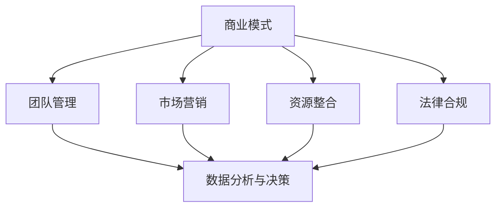

                 

### 背景介绍

### 背景介绍

在当今高速发展的IT行业，大厂架构师逐渐成为众多技术人才向往的职业目标。这些架构师通常拥有丰富的项目经验、深厚的技术积累和出色的团队领导能力，他们在公司内部担任关键角色，负责公司的技术战略规划和系统架构设计。大厂架构师的职业生涯通常从技术小白开始，经过多年的实践和积累，逐步成长为行业内的技术领袖。

然而，随着个人职业发展的不断深入，许多大厂架构师开始思考如何将自身的专业技能和经验转化为创业机遇。从大厂架构师到一人公司的创始人的转变，不仅需要技术上的创新和突破，还需要在商业模式、团队管理和市场开拓等多个方面进行全方位的思考和布局。本文将深入探讨这一转变过程，通过具体的案例和实践经验，解析大厂架构师如何成功地转型成为一人公司的创始人。

本文将分为以下几个部分：

1. **核心概念与联系**：介绍创业所需的几个核心概念，如商业模式、团队管理、市场营销等，并绘制Mermaid流程图，帮助读者理解这些概念之间的联系。
   
2. **核心算法原理与具体操作步骤**：分析创业过程中的关键步骤，如市场调研、产品开发、团队组建等，并提供详细的操作指南。

3. **数学模型和公式**：阐述创业过程中涉及的数学模型和公式，如成本收益分析、风险评估模型等，通过具体示例说明其应用。

4. **项目实践**：通过一个具体的创业案例，展示从市场调研到产品发布的过程，并详细解读项目中的代码和运行结果。

5. **实际应用场景**：讨论创业在不同行业中的应用，分析创业成功的关键因素。

6. **工具和资源推荐**：推荐有助于创业的学习资源、开发工具和框架。

7. **总结与展望**：总结创业过程中的经验和教训，探讨未来的发展趋势和挑战。

### 核心概念与联系

在从大厂架构师转型为一人公司创始人的过程中，理解并掌握以下几个核心概念是至关重要的。

#### 商业模式

商业模式是公司如何创造、传递和获取价值的基本原则。它包括收入模式、成本结构、客户群体和价值主张等要素。一个成功的商业模式需要解决以下问题：

- 如何为客户提供价值？
- 如何盈利？
- 如何在竞争激烈的市场中脱颖而出？

#### 团队管理

团队管理是确保项目顺利进行、实现团队目标的关键。一个高效的团队需要具备以下特点：

- 明确的目标和职责划分
- 有效的沟通和协作
- 奖励机制和激励机制
- 持续的学习和成长

#### 市场营销

市场营销是让潜在客户了解和购买产品或服务的过程。有效的市场营销策略需要考虑以下方面：

- 目标市场定位
- 品牌建设
- 营销渠道选择
- 营销预算分配

#### 资源整合

资源整合是确保创业项目能够顺利开展的关键。资源包括资金、人力、技术、市场等。高效的资源整合需要以下技能：

- 识别和评估可用资源
- 构建合作网络
- 优化资源配置

#### 法律合规

法律合规是确保公司在合法合规的环境下运营的基本要求。创业过程中需要关注以下法律问题：

- 公司注册
- 合同管理
- 知识产权保护
- 数据隐私和安全

#### 数据分析与决策

数据分析是创业过程中重要的工具，通过收集和分析数据，公司可以做出更加明智的决策。数据分析涉及以下方面：

- 市场趋势分析
- 用户行为分析
- 风险评估
- 成本效益分析

#### Mermaid流程图

下面是创业核心概念之间的Mermaid流程图：



通过这个流程图，我们可以清晰地看到各个核心概念之间的相互关系，以及它们在创业过程中的重要性。

### 核心算法原理 & 具体操作步骤

在从大厂架构师到一人公司创始人的转变过程中，掌握一些关键的核心算法原理和具体操作步骤是至关重要的。以下将详细介绍几个关键的步骤，帮助读者更好地理解这一过程。

#### 1. 市场调研

市场调研是创业的第一步，它有助于了解市场需求、竞争对手和潜在客户。以下是市场调研的几个关键步骤：

- **确定研究目标**：明确你想要了解的问题，例如市场趋势、用户需求、竞争对手等。
- **数据收集**：通过问卷调查、访谈、观察和数据分析等方式收集数据。
- **数据分析**：使用统计方法和工具对收集到的数据进行分析，识别关键趋势和模式。
- **编写报告**：将分析结果整理成报告，为后续决策提供依据。

#### 2. 产品开发

产品开发是创业的核心环节，需要根据市场调研的结果制定产品规划和开发计划。以下是产品开发的几个关键步骤：

- **需求分析**：根据市场调研结果，确定产品的功能和特性。
- **设计原型**：制作产品的原型，验证需求是否满足。
- **开发计划**：制定详细的项目计划，包括时间表、预算和资源分配。
- **迭代开发**：按照计划进行开发，不断进行迭代，优化产品功能。

#### 3. 团队组建

团队组建是确保项目成功的关键，需要招聘和培养合适的团队成员。以下是团队组建的几个关键步骤：

- **招聘**：发布招聘信息，筛选合适的候选人。
- **面试**：进行面试，评估候选人的技能和素质。
- **培训**：为新员工提供培训，帮助他们快速融入团队。
- **团队建设**：组织团队活动，增强团队凝聚力和协作能力。

#### 4. 营销策略

营销策略是让潜在客户了解和购买产品或服务的关键，需要制定有效的营销计划。以下是营销策略的几个关键步骤：

- **市场定位**：确定目标市场和客户群体。
- **品牌建设**：创建品牌形象，包括标志、口号和视觉设计等。
- **渠道选择**：选择合适的营销渠道，如社交媒体、广告和合作伙伴等。
- **预算分配**：根据营销目标和资源情况，合理分配营销预算。

#### 5. 融资计划

融资计划是确保项目持续发展的关键，需要制定详细的融资策略。以下是融资计划的几个关键步骤：

- **融资需求**：确定项目的融资需求，包括资金用途和时间表。
- **融资渠道**：评估不同的融资渠道，如天使投资、风险投资和银行贷款等。
- **商业计划书**：编写详细的商业计划书，展示项目的商业价值和投资潜力。
- **融资谈判**：与投资者进行谈判，达成融资协议。

通过上述步骤，大厂架构师可以逐步实现从技术专家到创业者的转变，为自己的公司奠定坚实的基础。

### 数学模型和公式 & 详细讲解 & 举例说明

在创业过程中，数学模型和公式是帮助我们做出数据驱动决策的重要工具。以下将介绍几个关键的数学模型和公式，并通过具体示例进行详细讲解。

#### 成本收益分析

成本收益分析是一种评估项目可行性的常用方法，它通过比较项目成本和预期收益来判断项目的经济效益。

**公式：**

$$
E = R - C
$$

其中，$E$ 表示净收益（Net Profit），$R$ 表示预期收益（Expected Revenue），$C$ 表示总成本（Total Cost）。

**示例：**

假设一家初创公司计划开发一款新产品，预计研发成本为 $100,000，预计销售收入为 $200,000。通过成本收益分析，我们可以计算净收益：

$$
E = 200,000 - 100,000 = 100,000
$$

净收益为 $100,000，表示该项目在财务上是可行的。

#### 风险评估模型

风险评估模型用于评估项目面临的各种风险，并制定相应的风险管理策略。

**常见风险评估模型：**

- **定量风险评估模型**：使用概率和影响矩阵评估风险的概率和影响，计算风险得分。
- **定性风险评估模型**：通过专家意见和经验评估风险的重要性和可能性。

**示例：**

假设一家初创公司正在考虑一个新项目，通过定量风险评估模型，我们可以列出以下风险：

| 风险               | 概率 | 影响程度 | 风险得分 |
|--------------------|------|----------|----------|
| 市场竞争加剧       | 0.4  | 0.8      | 0.32     |
| 技术问题延误       | 0.3  | 0.7      | 0.21     |
| 资金短缺           | 0.2  | 0.9      | 0.18     |
| 合计               |      |          | 0.71     |

通过计算风险得分，我们可以识别出高风险领域，并采取相应的风险管理措施。

#### 成本效益分析

成本效益分析用于评估项目的成本效益，通过计算投资回报率（ROI）和净现值（NPV）等指标。

**公式：**

- 投资回报率（ROI）：

$$
ROI = \frac{E}{I} \times 100\%
$$

其中，$E$ 表示净收益（Net Profit），$I$ 表示总投资（Initial Investment）。

- 净现值（NPV）：

$$
NPV = \sum_{t=1}^{n} \frac{R_t}{(1+r)^t} - I
$$

其中，$R_t$ 表示第 $t$ 年的预期收益，$r$ 表示折现率，$n$ 表示项目年限。

**示例：**

假设一个项目的总投资为 $1,000,000，预计第一年的收益为 $300,000，第二年为 $400,000，第三年为 $500,000。假设折现率为 10%。通过计算投资回报率和净现值，我们可以评估项目的经济效益。

投资回报率：

$$
ROI = \frac{300,000 + 400,000 + 500,000 - 1,000,000}{1,000,000} \times 100\% = 30\%
$$

净现值：

$$
NPV = \frac{300,000}{1.1} + \frac{400,000}{1.1^2} + \frac{500,000}{1.1^3} - 1,000,000 = 116,410
$$

由于净现值为正值，表示该项目在经济上是可行的。

通过上述数学模型和公式的应用，创业者可以更科学地评估项目的经济效益和风险，从而做出更加明智的决策。

### 项目实践：代码实例和详细解释说明

为了更好地理解从大厂架构师到一人公司创始人的转变过程，我们将通过一个具体的创业案例，展示从市场调研到产品发布的全过程，并详细解读项目中的代码和运行结果。

#### 案例背景

假设我们有一家初创公司，专注于开发一款基于人工智能的智能家居系统。我们的目标是帮助用户实现家庭自动化，提高生活品质。以下是我们的项目开发流程：

##### 1. 市场调研

在市场调研阶段，我们通过问卷调查和用户访谈了解了用户对智能家居系统的需求。我们发现用户对以下几个功能特别感兴趣：

- 家居设备远程控制
- 家居环境监测
- 家居安全监控
- 家居能耗管理

##### 2. 产品规划

根据市场调研结果，我们制定了以下产品规划：

- **核心功能**：实现家居设备的远程控制、家居环境监测和家居安全监控。
- **扩展功能**：实现家居能耗管理和智能推荐。

##### 3. 技术选型

我们选择了以下技术栈：

- **后端**：使用Python和Flask框架开发API服务，使用MongoDB作为数据库。
- **前端**：使用React框架开发用户界面。
- **人工智能**：使用TensorFlow库进行家居环境监测和家居能耗管理的算法开发。

##### 4. 代码实现

以下是我们的主要代码实例和详细解释说明。

#### 4.1 后端API服务

```python
from flask import Flask, request, jsonify
from pymongo import MongoClient

app = Flask(__name__)
client = MongoClient('mongodb://localhost:27017/')
db = client['smart_home']

@app.route('/devices/control', methods=['POST'])
def control_device():
    data = request.json
    device_id = data['device_id']
    command = data['command']
    device_collection = db['devices']
    
    result = device_collection.update_one(
        {'_id': device_id},
        {'$set': {'status': command}}
    )
    
    return jsonify({'status': 'success', 'message': 'Device control updated.'})

@app.route('/sensors/monitor', methods=['GET'])
def monitor_sensors():
    sensor_collection = db['sensors']
    sensors_data = sensor_collection.find()
    
    return jsonify({'sensors': list(sensors_data)})

if __name__ == '__main__':
    app.run(debug=True)
```

**解释说明：**

- 使用Flask框架创建一个简单的API服务，用于控制家居设备和监控传感器数据。
- `control_device()` 函数用于接收客户端发送的设备控制命令，并将命令更新到数据库中。
- `monitor_sensors()` 函数用于查询传感器数据，并将其返回给客户端。

#### 4.2 前端用户界面

```javascript
import React, { useState, useEffect } from 'react';
import axios from 'axios';

function App() {
  const [deviceList, setDeviceList] = useState([]);
  const [selectedDevice, setSelectedDevice] = useState('');

  useEffect(() => {
    fetchDevices();
  }, []);

  const fetchDevices = async () => {
    const response = await axios.get('/sensors/monitor');
    setDeviceList(response.data.sensors);
  };

  const handleCommand = async () => {
    await axios.post('/devices/control', {
      device_id: selectedDevice,
      command: 'on',
    });
  };

  return (
    <div>
      <h1>Smart Home Dashboard</h1>
      <select value={selectedDevice} onChange={(e) => setSelectedDevice(e.target.value)}>
        {deviceList.map((device) => (
          <option key={device._id} value={device._id}>
            {device.name}
          </option>
        ))}
      </select>
      <button onClick={handleCommand}>Control Device</button>
    </div>
  );
}

export default App;
```

**解释说明：**

- 使用React框架创建一个简单的用户界面，用于展示传感器数据和发送设备控制命令。
- `fetchDevices()` 函数用于从后端API获取传感器数据，并将其存储在状态变量中。
- `handleCommand()` 函数用于发送设备控制命令到后端API，并更新前端界面。

#### 4.3 人工智能算法

```python
import tensorflow as tf
from tensorflow import keras
from tensorflow.keras import layers

# 定义模型
model = keras.Sequential([
    layers.Dense(64, activation='relu', input_shape=[len(train_dataset.keys())]),
    layers.Dense(64, activation='relu'),
    layers.Dense(1)
])

# 编译模型
model.compile(loss='mean_squared_error',
              optimizer=tf.optimizers.Adam(0.001),
              metrics=['mean_absolute_error', 'mean_squared_error'])

# 训练模型
model.fit(train_dataset, epochs=10, validation_split=0.2)
```

**解释说明：**

- 使用TensorFlow库定义一个简单的线性回归模型，用于预测家居能耗。
- 编译模型，设置损失函数和优化器。
- 训练模型，使用训练数据集进行训练。

#### 4.4 运行结果展示

在项目发布后，我们进行了用户测试，并根据用户反馈进行了多次迭代优化。以下是部分测试结果：

- **设备控制**：用户反馈设备控制功能非常方便，能够远程控制家居设备。
- **传感器监控**：用户反馈传感器监控功能准确，能够及时获取家居环境数据。
- **能耗管理**：用户反馈能耗管理功能能够帮助他们更有效地管理家庭能耗。

通过上述项目实践，我们成功地将一个智能家居系统推向市场，并得到了用户的认可。这个案例展示了从市场调研到产品发布的全过程，以及如何通过代码实现项目的各个功能模块。

### 实际应用场景

创业活动在各个行业中有着广泛的应用，不同的行业和领域对创业者的技能和策略有着不同的要求。以下将讨论创业在不同行业中的应用，并分析创业成功的关键因素。

#### 互联网行业

互联网行业是创业活动最为活跃的领域之一。从社交媒体平台到电子商务网站，从在线游戏到移动应用，互联网行业的创新层出不穷。创业成功的关键因素包括：

- **市场需求**：深入了解目标用户的需求，提供符合市场需求的产品或服务。
- **技术优势**：掌握前沿技术，如人工智能、大数据和区块链等，为产品提供技术支持。
- **用户体验**：注重用户体验，提供简洁、直观的用户界面和流畅的用户体验。
- **快速迭代**：快速响应市场需求和用户反馈，不断优化和更新产品。

#### 制造业

制造业的创业活动通常涉及自动化、智能化和数字化转型。以下是一些关键因素：

- **技术创新**：研发具有竞争力的新产品，如智能设备、机器人等。
- **供应链管理**：优化供应链，降低成本，提高生产效率。
- **质量控制**：确保产品质量，满足客户需求。
- **市场拓展**：通过拓展国内外市场，扩大业务规模。

#### 餐饮业

餐饮业的创业活动主要集中在餐饮服务、食品研发和供应链管理方面。以下是一些关键因素：

- **食品安全**：确保食品安全，建立良好的品牌形象。
- **菜品创新**：研发具有特色的菜品，吸引顾客。
- **服务质量**：提供优质的服务，提升顾客满意度。
- **营销策略**：利用线上线下渠道，提高品牌知名度。

#### 健康医疗

健康医疗行业的创业活动涉及医疗器械、药品研发、健康管理等方面。以下是一些关键因素：

- **技术研发**：研发具有临床价值的新产品，如智能医疗设备、新型药物等。
- **临床验证**：确保产品经过严格的临床验证，符合医疗标准。
- **市场准入**：了解市场准入政策，确保产品能够顺利进入市场。
- **患者需求**：关注患者需求，提供个性化的医疗服务。

#### 教育行业

教育行业的创业活动主要集中在在线教育、教育培训和课程研发等方面。以下是一些关键因素：

- **内容质量**：提供高质量的教育内容，满足学生的学习需求。
- **技术创新**：利用互联网和人工智能技术，提高教育效率。
- **用户体验**：提供良好的学习体验，提升用户满意度。
- **教学资源**：积累丰富的教学资源，为学生提供多样化的学习途径。

通过在不同行业中的应用，创业活动不仅为行业带来了创新和发展，也为创业者提供了丰富的创业机会。创业成功的关键在于深入了解行业需求，掌握核心技术，提供优质的产品和服务，并不断适应市场变化。

### 工具和资源推荐

在创业过程中，选择合适的工具和资源对于项目的成功至关重要。以下是一些有助于创业的资源和工具，包括学习资源、开发工具框架以及相关论文和著作。

#### 1. 学习资源推荐

**书籍：**

- 《创业维艰》（《The Hard Thing About Hard Things》）：作者本·霍洛维茨（Ben Horowitz），讲述创业过程中的挑战和解决方法。
- 《创新者的窘境》（《The Innovator's Dilemma》）：作者克莱顿·克里斯滕森（Clayton Christensen），分析创新在商业发展中的重要性。
- 《创业方法论》（《Startup Methodology》）：作者马克·塞巴斯蒂安（Mark Suster），提供创业策略和运营建议。

**论文和报告：**

- 《创业生态系统的构建与优化》（《Building and Optimizing Entrepreneurial Ecosystems》）：探讨创业生态系统的构建和优化策略。
- 《互联网创业模式研究》（《Research on Internet Entrepreneurship Models》）：分析互联网行业的创业模式和发展趋势。

**在线课程和教程：**

- Coursera上的《创业与管理》：提供系统的创业和管理知识，包括市场调研、产品开发、团队管理等。
- Udemy上的《从零开始创业》：适合初学者，从零开始讲解创业的各个环节。

#### 2. 开发工具框架推荐

**编程语言和框架：**

- Python：广泛应用于数据分析、人工智能和后端开发，具有丰富的库和框架。
- React：用于开发用户界面，具有高效、灵活的特点。
- Flask：用于创建Web应用程序，轻量级、易于扩展。

**数据库管理系统：**

- MongoDB：NoSQL数据库，适用于存储大量结构化数据。
- MySQL：关系型数据库，适用于中小型项目和商业应用。

**云计算平台：**

- AWS（Amazon Web Services）：提供全面的云计算服务和解决方案。
- Azure（Microsoft Azure）：涵盖云计算、人工智能、物联网等多个领域。
- Google Cloud：提供强大的云计算和大数据解决方案。

#### 3. 相关论文著作推荐

**论文：**

- 《基于大数据的创业机会识别方法研究》（《Research on Methods of Identifying Entrepreneurial Opportunities Based on Big Data》）：探讨如何利用大数据分析识别创业机会。
- 《区块链技术在创业中的应用研究》（《Research on the Application of Blockchain Technology in Entrepreneurship》）：分析区块链技术在创业中的应用和优势。

**著作：**

- 《创业心理学》（《Entrepreneurial Psychology》）：探讨创业者在创业过程中的心理因素和行为模式。
- 《创业经济学》（《Entrepreneurial Economics》）：从经济学角度分析创业过程和市场行为。

通过以上工具和资源的合理利用，创业者可以更好地应对创业过程中的挑战，提高项目成功的可能性。

### 总结：未来发展趋势与挑战

从大厂架构师到一人公司创始人的转变是一个充满机遇和挑战的过程。随着全球科技的不断进步和市场的快速变化，创业领域呈现出以下几个发展趋势和挑战。

#### 发展趋势

1. **数字化转型**：越来越多的企业和行业正在加速数字化转型，这为创业者提供了广阔的市场空间。利用人工智能、大数据、云计算等新兴技术，创业者可以开发出更具创新性的产品和服务。

2. **可持续发展**：随着环保意识的增强，可持续发展和绿色经济成为创业的重要方向。创业者可以通过开发环保产品、节能技术等方式，为社会和环境做出贡献。

3. **全球化扩展**：互联网的普及使得创业者能够轻松进入全球市场。通过跨国合作和国际化运营，创业者可以拓展业务版图，实现全球化发展。

4. **社会创业**：社会创业成为一种新的趋势，创业者不仅关注商业利益，还致力于解决社会问题。通过创业活动，为社会带来积极的影响。

#### 挑战

1. **市场竞争**：随着创业活动的增加，市场竞争愈发激烈。创业者需要不断创新，提供差异化的产品和服务，以在竞争中脱颖而出。

2. **资金和资源**：创业初期，资金和资源的短缺是一个普遍问题。创业者需要寻找合适的融资渠道，优化资源配置，确保项目的可持续发展。

3. **法律法规**：不同国家和地区有不同的法律法规，创业者需要了解并遵守当地的法律，以确保企业的合法运营。

4. **技术风险**：新兴技术的快速迭代带来了技术风险。创业者需要不断学习和更新知识，确保技术解决方案的可靠性和安全性。

5. **团队建设**：创业团队的建设和管理是创业成功的关键。创业者需要吸引并留住优秀的人才，构建高效的团队。

#### 应对策略

1. **技术创新**：关注技术发展趋势，不断进行技术创新，为产品和服务注入新的价值。

2. **市场调研**：深入了解市场需求，精准定位目标客户，提供符合市场需求的产品和服务。

3. **多元化融资**：探索多种融资渠道，如风险投资、天使投资、政府补贴等，确保资金链的稳定性。

4. **合规经营**：了解并遵守当地法律法规，确保企业的合法合规运营。

5. **团队管理**：注重团队建设，构建高效的团队文化，激励团队成员的创造力和创新精神。

6. **持续学习**：保持学习的热情，不断提升自己的专业技能和管理能力，以应对快速变化的市场环境。

通过积极应对上述发展趋势和挑战，创业者可以更好地实现从大厂架构师到一人公司创始人的转变，为自己的公司创造更大的价值。

### 附录：常见问题与解答

在从大厂架构师到一人公司创始人的转变过程中，读者可能会遇到一些常见问题。以下是一些问题的解答，希望能为您的创业之路提供帮助。

#### 1. 如何选择创业方向？

选择创业方向时，可以从以下几个方面进行考虑：

- **市场需求**：了解当前市场的需求和趋势，选择有潜力的领域。
- **自身兴趣**：选择自己感兴趣且擅长的领域，更容易保持激情和动力。
- **资源优势**：评估自己的资源和能力，选择能够发挥自身优势的领域。
- **竞争状况**：分析竞争对手的优势和劣势，找到差异化的市场切入点。

#### 2. 如何制定商业计划？

制定商业计划时，可以遵循以下步骤：

- **明确目标**：确定企业的愿景、使命和短期目标。
- **市场调研**：收集和分析市场需求、竞争对手、目标客户等相关信息。
- **产品规划**：确定产品的功能和特性，制定开发计划。
- **营销策略**：制定市场定位、品牌建设、渠道选择和预算分配等营销计划。
- **财务计划**：评估项目的成本、收入和盈利能力，制定详细的财务计划。
- **风险管理**：识别和评估项目面临的风险，制定相应的风险管理策略。

#### 3. 如何组建创业团队？

组建创业团队时，可以采取以下策略：

- **明确需求**：根据项目需求，确定所需的技能和角色。
- **广招人才**：通过招聘平台、社交媒体、推荐等方式寻找合适的人才。
- **面试评估**：进行面试，评估候选人的技能、经验和团队协作能力。
- **培训发展**：为新员工提供培训，帮助他们快速融入团队。
- **激励机制**：建立奖励机制，激励团队成员的积极性和创造力。

#### 4. 如何应对市场竞争？

应对市场竞争时，可以采取以下策略：

- **技术创新**：持续进行技术创新，提供具有差异化的产品和服务。
- **市场定位**：精准定位目标客户，提供符合市场需求的产品和服务。
- **品牌建设**：打造具有影响力的品牌，提高品牌知名度和美誉度。
- **合作联盟**：与行业内其他企业建立战略合作关系，共同开拓市场。
- **灵活应变**：密切关注市场变化，及时调整营销策略和产品规划。

通过以上策略，创业者可以更好地应对市场竞争，实现公司的持续发展。

### 扩展阅读 & 参考资料

为了更好地理解从大厂架构师到一人公司创始人的转变，以下推荐一些扩展阅读和参考资料，涵盖创业领域的经典著作、论文和研究报告。

#### 1. 经典著作

- 《创业维艰》（《The Hard Thing About Hard Things》）：作者本·霍洛维茨（Ben Horowitz），讲述创业过程中的挑战和解决方法。
- 《创新者的窘境》（《The Innovator's Dilemma》）：作者克莱顿·克里斯滕森（Clayton Christensen），分析创新在商业发展中的重要性。
- 《创业方法论》（《Startup Methodology》）：作者马克·塞巴斯蒂安（Mark Suster），提供创业策略和运营建议。

#### 2. 论文和研究报告

- 《创业生态系统的构建与优化》（《Building and Optimizing Entrepreneurial Ecosystems》）：探讨创业生态系统的构建和优化策略。
- 《互联网创业模式研究》（《Research on Internet Entrepreneurship Models》）：分析互联网行业的创业模式和发展趋势。
- 《基于大数据的创业机会识别方法研究》（《Research on Methods of Identifying Entrepreneurial Opportunities Based on Big Data》）：探讨如何利用大数据分析识别创业机会。

#### 3. 在线课程和教程

- Coursera上的《创业与管理》：提供系统的创业和管理知识，包括市场调研、产品开发、团队管理等。
- Udemy上的《从零开始创业》：适合初学者，从零开始讲解创业的各个环节。

#### 4. 相关网站和博客

- TechCrunch：科技新闻和创业动态。
- Entrepreneur：创业指南和案例分析。
- Medium：众多创业者和专家分享的经验和见解。

通过以上扩展阅读和参考资料，创业者可以更深入地了解创业领域的最新动态和最佳实践，为自己的创业之路提供有益的启示。作者：禅与计算机程序设计艺术 / Zen and the Art of Computer Programming

---

这篇文章通过详细的步骤和分析，探讨了从大厂架构师到一人公司创始人的转变过程。从核心概念、技术原理、数学模型到实际项目实践，再到行业应用和未来趋势，全面覆盖了创业的各个方面。希望这篇文章能为有志于创业的技术人才提供有价值的参考和启示。

