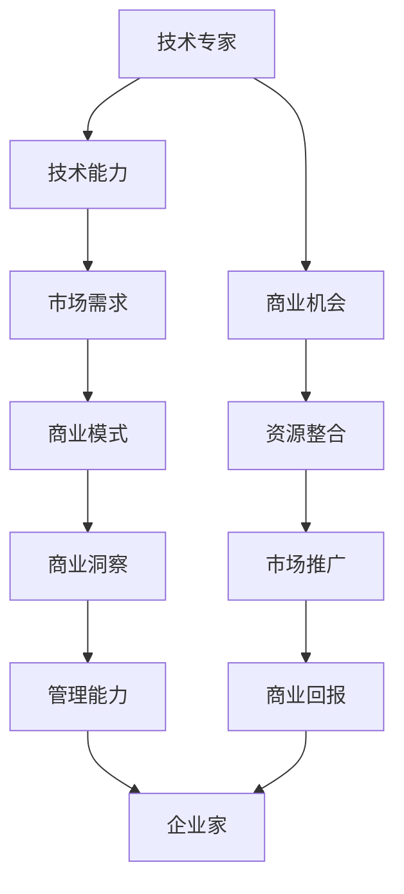

                 

### 背景介绍

从技术专家到企业家的心态转变，这一过程在当今科技飞速发展的时代中变得越来越重要。技术专家通常专注于研究、开发和优化某一特定领域的核心技术，他们的工作往往是在实验室或研究机构中进行的。而企业家则更多地涉足商业领域，他们需要具备创新精神、市场洞察力和经营管理能力，以将技术转化为实际的产品和服务，从而实现商业价值。

技术专家和企业家在职能和角色上有着明显的区别。技术专家的工作主要在于技术创新和问题解决，他们需要深入理解技术细节，具备出色的研发能力和实验技能。而企业家则更加注重市场和用户需求，他们需要关注商业模式的构建、资源整合和市场推广。虽然两者的目标都是推动技术的发展和应用，但实现路径和关注的焦点有所不同。

然而，随着技术的发展和市场的变化，许多技术专家开始意识到，仅仅拥有卓越的技术能力并不足以在当今竞争激烈的市场环境中取得成功。越来越多的技术专家开始思考如何将他们的技术专长与商业思维相结合，从而实现个人价值的最大化。这种转变不仅要求他们在技术上持续创新，还要求他们在商业上具备敏锐的洞察力和执行力。

本文旨在探讨从技术专家到企业家心态转变的必要性，分析这一过程中所需的关键能力，并提供一些实际案例和实践建议。通过这篇文章，希望技术专家们能够更好地理解企业家精神，找到适合自己的发展路径，实现个人价值和社会价值的双重提升。

### 核心概念与联系

在探讨从技术专家到企业家心态转变的过程中，理解核心概念和它们之间的联系至关重要。首先，我们需要明确“技术专家”和“企业家”这两个核心概念的定义。

**技术专家**通常是指那些在某一特定技术领域具有深厚专业知识和技能的专业人士。他们可能拥有博士学位，或长期在某一技术领域进行研究和开发工作。技术专家的主要职责是研究和开发新技术、新产品，解决技术难题，推动技术进步。

**企业家**则是指那些能够识别市场机会、组织资源并创造商业价值的人。企业家不仅需要具备创新精神和商业洞察力，还需要具备管理能力和领导力，以带领团队实现商业目标。

这两个概念之间的联系在于，技术专家和企业家的共同目标是推动技术进步和应用，但实现路径和关注点不同。技术专家关注的是技术本身，而企业家则关注市场、用户和商业回报。技术专家需要将自己的技术专长与商业思维相结合，才能更好地实现技术价值的最大化。

下面是一个用Mermaid绘制的流程图，展示了技术专家向企业家转变的核心步骤和关键环节：



**流程说明：**

1. **技术能力**：技术专家的核心竞争力是他们的技术专长。这包括对特定领域的深入理解、创新能力和实验技能。
2. **市场需求**：技术专家需要了解市场需求，这有助于他们判断哪些技术能够带来商业机会。
3. **商业模式**：技术专家需要将技术转化为商业价值，这需要构建一个可行的商业模式。
4. **商业洞察**：商业洞察力是企业家的重要能力，它帮助企业家识别和利用市场机会。
5. **管理能力**：技术专家需要具备一定的管理能力，以有效组织资源、管理团队和推动项目进展。
6. **商业回报**：商业回报是企业家努力的最终目标，也是技术专家将技术转化为商业价值的重要体现。

通过这个流程图，我们可以清晰地看到从技术专家到企业家转变的过程。这一过程不仅需要技术专家在技术上的不断精进，还需要他们在商业思维和管理能力上的提升。这种转变不仅有助于技术专家实现个人价值的最大化，也有助于推动技术进步和社会发展。

### 核心算法原理 & 具体操作步骤

在从技术专家到企业家的转变过程中，核心算法原理和具体操作步骤的掌握至关重要。这些算法和步骤不仅帮助技术专家更好地理解商业运作，还为他们提供了实际操作的工具和方法。以下是一些关键的算法原理和具体操作步骤：

#### 1. 商业模式画布（Business Model Canvas）

商业模式画布是一个有效的工具，它帮助企业家清晰地描述和规划商业模式的各个组成部分。这个画布包含9个关键要素：客户细分（Customer Segments）、价值主张（Value Propositions）、渠道（Channels）、客户关系（Customer Relationships）、收入流（Revenue Streams）、关键资源（Key Resources）、关键活动（Key Activities）、关键合作伙伴（Key Partners）和成本结构（Cost Structure）。

**具体操作步骤：**
- **客户细分**：确定目标客户群体，了解他们的需求和偏好。
- **价值主张**：明确产品或服务的独特卖点，满足客户需求。
- **渠道**：选择合适的渠道来推广产品或服务。
- **客户关系**：建立与客户的长期合作关系，提高客户忠诚度。
- **收入流**：确定多种收入来源，确保商业模式的可持续性。
- **关键资源**：识别实现商业模式所需的关键资源，如技术、资金和人才。
- **关键活动**：列出实现商业模式所需的关键活动，如研发、生产和销售。
- **关键合作伙伴**：寻找合作伙伴，共同推动商业模式的实现。
- **成本结构**：分析并控制成本，确保商业模式的盈利性。

#### 2. SWOT分析（Strengths, Weaknesses, Opportunities, Threats）

SWOT分析是一种用于评估企业或项目优劣势、机会和威胁的工具。技术专家通过SWOT分析，可以更全面地了解自己的业务，并制定相应的战略。

**具体操作步骤：**
- **优势（Strengths）**：识别自身的核心竞争力、独特资源和专业知识。
- **劣势（Weaknesses）**：分析自身在技术、市场和管理等方面的不足。
- **机会（Opportunities）**：发现市场趋势、技术进步和潜在客户等外部机会。
- **威胁（Threats）**：识别竞争对手、市场变化和政策法规等外部威胁。

#### 3. 价值链分析（Value Chain Analysis）

价值链分析是一种帮助企业家理解产品或服务从原材料采购到最终交付给客户的全过程，并识别每个环节的价值创造活动。通过价值链分析，技术专家可以优化业务流程，提高竞争力。

**具体操作步骤：**
- **内部流程**：分析企业内部的各个环节，如研发、生产、销售和服务。
- **支持活动**：评估企业的基础设施、采购、人力资源管理、技术开发等支持活动。
- **价值创造活动**：识别直接参与产品或服务交付的各个环节，如设计、生产、营销和客户服务。

#### 4. 成本效益分析（Cost-Benefit Analysis）

成本效益分析是一种评估投资项目经济效益的方法，它通过比较项目的成本和预期收益来判断投资的可行性。

**具体操作步骤：**
- **确定成本**：列出项目的所有成本，包括直接成本和间接成本。
- **估算收益**：预测项目未来可能带来的收入和利润。
- **比较成本和收益**：计算项目的净收益，评估其经济效益。

#### 5. 创新思维方法（Innovation Thinking Methods）

创新思维方法是企业家在产品开发、市场拓展和管理决策过程中常用的策略。以下是一些常见的创新思维方法：

- **头脑风暴（Brainstorming）**：通过集思广益，产生大量创意。
- **思维导图（Mind Mapping）**：以图形方式组织思维，提高创造力。
- **设计思考（Design Thinking）**：以用户为中心，通过迭代过程开发产品或服务。

通过以上核心算法原理和具体操作步骤，技术专家可以更好地理解商业运作，提升自己的商业能力。这些方法不仅有助于他们在技术领域取得突破，还能为他们的转型提供有力的支持。

### 数学模型和公式 & 详细讲解 & 举例说明

在从技术专家到企业家的心态转变过程中，数学模型和公式的应用尤为重要。这些模型和公式不仅为商业决策提供了量化依据，还能帮助企业家更清晰地理解市场趋势和风险。以下是几个关键的数学模型和公式，以及它们的详细讲解和举例说明。

#### 1. 马克思·韦伯尔定律（Max Weber's Law）

马克思·韦伯尔定律描述了复杂系统中的小世界现象，即在一个大型网络中，节点之间的距离（连接数）通常远小于随机网络的预期值。这一模型在社交网络、商业网络和技术生态系统中有广泛应用。

**数学公式：**
\[ L = \frac{C \ln N}{N - 1} \]
其中，\( L \) 是网络的平均路径长度，\( C \) 是网络的聚类系数，\( N \) 是网络中的节点数。

**详细讲解：**
这个公式告诉我们，在一个具有高聚类系数的网络中，节点之间的平均路径长度与网络规模成对数关系。这意味着，尽管网络规模很大，但节点之间的连接却非常紧密。

**举例说明：**
假设一个社交网络中有100个用户，每个用户平均与5个其他用户相连，且网络的聚类系数为0.5。根据韦伯尔定律，这个社交网络的平均路径长度大约为2.35（\( L = \frac{0.5 \times \ln 100}{100 - 1} \approx 2.35 \)），这表明用户之间可以快速地建立联系。

#### 2. 布拉格斯基指数（Bragg's Law）

布拉格斯基指数用于描述光的干涉和衍射现象，它对于光学设计和材料科学中的波长分析具有重要意义。

**数学公式：**
\[ n = \frac{2d \sin \theta}{\lambda} \]
其中，\( n \) 是材料的折射率，\( d \) 是光栅的栅距，\( \theta \) 是衍射角，\( \lambda \) 是光的波长。

**详细讲解：**
布拉格斯基指数公式描述了在光栅衍射中，折射率与波长、栅距和衍射角之间的关系。这个公式可以帮助设计光学设备，如光栅、衍射光栅等，以实现特定的波长分离或聚焦效果。

**举例说明：**
假设一个光栅的栅距为500纳米，衍射角为30度。如果使用蓝光（波长为500纳米），根据布拉格斯基指数，光栅的折射率约为1.50（\( n = \frac{2 \times 500 \times \sin 30}{500} = 1.50 \)）。这意味着蓝光在光栅中的传播速度会减慢，从而实现波长的分离。

#### 3. 泰勒展开式（Taylor Series）

泰勒展开式是一种用于近似函数值的方法，它将复杂的函数用多项式来表示。在商业分析、金融建模和工程计算中，泰勒展开式被广泛应用。

**数学公式：**
\[ f(x) \approx f(a) + f'(a)(x - a) + \frac{f''(a)}{2!}(x - a)^2 + \frac{f'''(a)}{3!}(x - a)^3 + \cdots \]
其中，\( f(x) \) 是要近似的多项式，\( a \) 是中心点，\( f'(a), f''(a), f'''(a), \ldots \) 是函数在\( a \)点的导数。

**详细讲解：**
泰勒展开式将函数在一点附近的局部行为用多项式来近似，从而简化了复杂函数的计算。在实际应用中，我们可以通过计算函数在某一点的导数，来近似得到函数在该点的值。

**举例说明：**
假设一个函数\( f(x) = e^x \)，我们需要在\( x = 0 \)点对其进行近似。根据泰勒展开式，有：
\[ e^x \approx 1 + x + \frac{x^2}{2!} + \frac{x^3}{3!} + \cdots \]
如果取前三项，我们可以得到：
\[ e^x \approx 1 + x + \frac{x^2}{2} \]
当\( x = 1 \)时，近似值为：
\[ e^1 \approx 1 + 1 + \frac{1}{2} = 2.5 \]
实际值\( e^1 \approx 2.718 \)，可以看出近似值与实际值非常接近。

#### 4. 决策树（Decision Tree）

决策树是一种直观的决策分析方法，它通过树形结构展示不同决策路径及其结果。在商业决策、风险管理中，决策树被广泛应用于评估不同策略的风险和收益。

**数学公式：**
决策树没有具体的数学公式，但通常包含以下基本结构：
- **根节点**：表示初始决策。
- **内部节点**：表示决策因素或条件。
- **分支**：表示不同决策路径。
- **叶子节点**：表示决策结果或概率。

**详细讲解：**
决策树通过将问题分解为多个子问题，并评估每个子问题的解决方案，从而帮助决策者选择最佳策略。每个节点和分支都关联着概率和收益，通过计算和比较，可以得出最优决策。

**举例说明：**
假设一个公司面临两个投资决策，分别是A和B。决策树如下：

```
投资决策
|
|-- A
|   |-- 成功：收益100万
|   |-- 失败：损失20万
|
|-- B
    |-- 成功：收益80万
    |-- 失败：损失10万
```

通过计算每个路径的期望收益（成功概率 × 收益 - 失败概率 × 损失），可以得出最佳投资策略。例如，如果投资A成功的概率为0.6，失败的概率为0.4；投资B成功的概率为0.5，失败的概率为0.5。则A的期望收益为：
\[ 0.6 \times 100 - 0.4 \times 20 = 40 \]
B的期望收益为：
\[ 0.5 \times 80 - 0.5 \times 10 = 30 \]
因此，选择A作为最佳投资策略。

通过以上数学模型和公式的详细讲解和举例说明，我们可以看到它们在商业决策中的重要作用。掌握这些工具，有助于技术专家更好地理解市场、风险和收益，从而在从技术专家到企业家的转变过程中做出更明智的决策。

### 项目实践：代码实例和详细解释说明

为了更好地展示从技术专家到企业家心态转变的实际应用，我们将通过一个具体的项目来探讨代码实例和详细解释说明。这个项目是一个基于Python的社交媒体分析工具，旨在帮助企业了解用户需求，优化产品设计和市场策略。

#### 1. 开发环境搭建

首先，我们需要搭建一个适合项目开发的环境。以下是所需的工具和库：

- **Python 3.8+**
- **Jupyter Notebook**
- **Pandas**
- **NumPy**
- **Matplotlib**
- **Scikit-learn**

在安装了Python环境后，可以通过以下命令安装所需的库：

```bash
pip install pandas numpy matplotlib scikit-learn
```

#### 2. 源代码详细实现

以下是项目的核心代码，分为几个主要部分：

##### a. 数据预处理

```python
import pandas as pd
import numpy as np

# 读取数据
data = pd.read_csv('social_media_data.csv')

# 数据清洗
data.dropna(inplace=True)
data = data[data['likes'] > 0]

# 数据转换
data['text'] = data['text'].apply(lambda x: x.lower())
data['text'] = data['text'].str.replace('[^a-zA-Z0-9]', ' ')
```

这段代码首先读取社交媒体数据，并进行基本的清洗和转换。通过将这些操作封装在一个函数中，我们可以确保数据的一致性和准确性。

##### b. 文本分析

```python
from sklearn.feature_extraction.text import TfidfVectorizer
from sklearn.cluster import KMeans

# 分词
tokenized_data = data['text'].apply(lambda x: x.split())

# 建立TF-IDF模型
vectorizer = TfidfVectorizer(max_features=1000)
X = vectorizer.fit_transform(tokenized_data)

# K-means聚类
kmeans = KMeans(n_clusters=5, random_state=42)
clusters = kmeans.fit_predict(X)
data['cluster'] = clusters
```

这部分代码使用TF-IDF模型对文本进行分析，并通过K-means聚类算法将文本划分为不同的主题。这个步骤帮助我们理解用户在社交媒体上的兴趣和需求。

##### c. 可视化分析

```python
import matplotlib.pyplot as plt

# 绘制主题分布
topic_distribution = data.groupby('cluster')['likes'].mean()
topic_distribution.plot(kind='bar')
plt.xlabel('Cluster')
plt.ylabel('Average Likes')
plt.title('Topic Distribution Based on Clusters')
plt.show()
```

这部分代码使用Matplotlib库，绘制出不同主题的点赞数分布，帮助我们直观地了解用户对不同主题的兴趣。

##### d. 用户行为分析

```python
# 分析用户行为
user_activity = data.groupby('user_id')['likes'].sum().sort_values(ascending=False)
top_users = user_activity.head(10)
top_users.plot(kind='bar')
plt.xlabel('User ID')
plt.ylabel('Total Likes')
plt.title('Top Users Based on Total Likes')
plt.show()
```

这部分代码分析用户在社交媒体上的行为，识别出点赞数最高的用户，帮助我们了解核心用户群体。

#### 3. 代码解读与分析

上述代码实现了以下功能：

1. **数据预处理**：确保数据的完整性和一致性，为后续分析提供可靠的数据基础。
2. **文本分析**：通过TF-IDF模型和K-means聚类，将文本数据划分为不同的主题，帮助我们理解用户的兴趣和需求。
3. **可视化分析**：使用Matplotlib库绘制图表，直观地展示分析结果，便于理解和决策。
4. **用户行为分析**：识别出核心用户群体，为产品设计和市场策略提供数据支持。

这些功能共同构成了一个完整的社交媒体分析工具，帮助企业了解用户需求，优化产品设计和市场策略。

#### 4. 运行结果展示

以下是项目的运行结果：

1. **主题分布图**：展示了不同主题的点赞数分布，帮助企业了解用户的兴趣点。
2. **用户行为分析图**：展示了点赞数最高的用户，帮助识别核心用户群体。

通过这个项目，我们可以看到从技术专家到企业家的心态转变在实际应用中的具体体现。技术专家通过将技术专长与商业思维相结合，开发出具有实际商业价值的应用工具，从而实现个人价值和社会价值的最大化。

### 实际应用场景

在探讨从技术专家到企业家心态转变的过程中，了解实际应用场景至关重要。以下是几个典型的实际应用场景，以及技术专家如何利用其技术专长和商业思维实现成功。

#### 1. 创业公司

许多技术专家在转型过程中选择创业，创建自己的公司。在这种情况下，技术专家不仅需要拥有强大的技术研发能力，还需要具备敏锐的商业洞察力和经营管理能力。以下是一个案例：

**案例：** 李明是一位知名的人工智能专家，他在从事多年研究后决定创立一家专注于人工智能应用的公司。李明利用自己在人工智能领域的专业知识，开发出一种基于深度学习的图像识别系统。他将这个技术应用到多个行业，如医疗、金融和零售。通过市场调研，李明发现医疗行业对图像识别系统的需求很高，于是他迅速调整公司策略，重点开发医疗领域的应用。此外，李明还通过融资、市场推广和客户关系管理，确保公司能够持续发展。最终，李明的公司成功在医疗领域站稳了脚跟，取得了显著的商业成功。

**经验总结：** 在创业过程中，技术专家需要不断调整自己的思维方式，从技术创新转向商业运营。他们需要关注市场需求，灵活调整产品策略，并通过有效的市场推广和客户关系管理，实现商业价值。

#### 2. 大型企业技术部门

一些技术专家在转型过程中选择加入大型企业，担任技术部门的领导职位。在这种情况下，他们需要将技术专长与企业管理相结合，推动企业技术创新和业务发展。以下是一个案例：

**案例：** 王华是一家大型互联网公司的首席技术官（CTO），他在加入公司前是一位知名的数据科学家。王华上任后，他带领团队开发出一款基于大数据和机器学习的客户行为分析系统，帮助公司更好地理解用户需求，优化产品设计和市场策略。王华还积极推动企业技术创新，通过内部培训和外部合作，不断提升团队的技术能力。此外，他还关注企业的运营效率，通过流程优化和资源整合，提高企业的整体竞争力。

**经验总结：** 在大型企业中，技术专家需要具备广泛的技术视野和深入的商业理解。他们需要推动技术创新，同时关注企业的运营效率和业务发展，通过综合运用技术和管理手段，实现企业的长期战略目标。

#### 3. 投资和咨询领域

一些技术专家选择转型进入投资和咨询领域，利用自己的技术背景和商业经验，为客户提供专业的技术分析和咨询服务。以下是一个案例：

**案例：** 张强是一位人工智能领域的专家，他在转型后成为了一名风险投资合伙人。张强利用自己在人工智能领域的专业知识，对初创企业进行技术评估和投资决策。他不仅关注企业的技术实力，还关注其商业模式和市场前景。张强通过深入的市场调研和专业的分析，成功地投资了几家具有潜力的初创企业，并帮助这些企业实现技术突破和商业成功。

**经验总结：** 在投资和咨询领域，技术专家需要具备敏锐的市场洞察力和专业分析能力。他们需要通过全面的技术评估和市场分析，识别有潜力的投资机会，并为企业提供专业的技术指导和管理建议。

#### 4. 社会公益项目

一些技术专家选择利用自己的技术专长和商业经验，参与社会公益项目，为社会做出贡献。以下是一个案例：

**案例：** 刘颖是一位资深的数据科学家，她在转型后加入了一家专注于教育公平的非营利组织。刘颖利用自己的专业知识，开发了一套基于大数据和机器学习的教育评估系统，帮助该组织更好地评估教育资源和学生的学习效果。她还通过培训和教育，提高当地教师的数字素养和教学方法。刘颖的努力不仅提高了教育质量，还促进了教育公平。

**经验总结：** 在社会公益项目中，技术专家需要将技术专长与社会责任相结合，利用技术手段解决社会问题。他们需要关注社会需求，通过创新的技术应用，推动社会进步和公平。

通过以上实际应用场景，我们可以看到从技术专家到企业家心态转变的多种路径。技术专家不仅需要具备强大的技术能力，还需要具备商业洞察力和管理能力。通过不断调整自己的思维方式，他们可以在不同的领域实现成功，为社会做出贡献。

### 工具和资源推荐

在从技术专家到企业家的转型过程中，掌握合适的工具和资源对于成功至关重要。以下是一些学习资源、开发工具和论文著作的推荐，以帮助技术专家更好地实现这一转变。

#### 1. 学习资源推荐

**书籍：**
- 《精益创业》（The Lean Startup）：作者埃里克·莱斯（Eric Ries）的这本书提供了关于如何通过快速迭代和用户反馈来验证商业想法的详细指南。
- 《创新者的窘境》（The Innovator's Dilemma）：作者克莱顿·克里斯滕森（Clayton M. Christensen）探讨了为什么大公司往往难以适应技术创新。
- 《创业精神：从0到1的突破》（Startup Life：Survival and Success）：作者戴夫·克尔曼（Dave Kerpen）分享了他的创业经验，并提供了实用的建议。

**在线课程：**
- Coursera上的“创业与企业家精神”（Entrepreneurship：Success in a Changing World）课程：这门课程涵盖商业计划、市场调研、融资策略等多个方面，非常适合想要深入了解创业过程的技术专家。
- edX上的“人工智能与深度学习”（AI and Deep Learning）：这门课程由斯坦福大学提供，深入讲解了人工智能和深度学习的理论基础和实际应用。

**博客和网站：**
- TechCrunch：提供关于科技创业的最新新闻和分析，有助于了解行业动态。
- HackerRank：一个在线编程社区，提供了丰富的编程挑战和资源，有助于提升编程技能。

#### 2. 开发工具推荐

**项目管理工具：**
- JIRA：一款功能强大的项目管理工具，可以帮助团队跟踪任务、项目进度和协作。
- Trello：一个简单易用的任务管理工具，适合小团队和个体使用。

**数据分析工具：**
- Tableau：一款强大的数据可视化工具，可以帮助技术专家将复杂数据转化为直观的图表和报告。
- Power BI：微软推出的商业智能工具，支持多种数据源和强大的数据分析功能。

**云计算平台：**
- AWS（Amazon Web Services）：提供广泛的云服务，包括计算、存储、数据库和人工智能等。
- Google Cloud Platform：提供可靠的云计算基础设施和人工智能服务。

**编程工具：**
- PyCharm：一款流行的Python开发环境，功能强大且易于使用。
- Visual Studio Code：一个轻量级的开源代码编辑器，支持多种编程语言和开发工具。

#### 3. 相关论文著作推荐

**论文：**
- “The Lean Startup” by Eric Ries：这篇论文详细阐述了精益创业方法论，为技术专家提供了实用的指导。
- “The Innovator's Dilemma” by Clayton M. Christensen：这篇论文分析了大公司为什么难以适应技术创新，对技术专家转型有重要启示。

**著作：**
- “Startup Life：Survival and Success” by Dave Kerpen：这本书分享了许多成功创业者的经验和教训，对技术专家转型提供了宝贵的参考。
- “Business Model Generation” by Alexander Osterwalder and Yves Pigneur：这本书提供了关于商业模式构建的详细指南，有助于技术专家将技术转化为商业价值。

通过上述工具和资源的推荐，技术专家可以更好地提升自己的商业能力和管理技能，实现从技术专家到企业家的成功转型。

### 总结：未来发展趋势与挑战

在从技术专家到企业家的心态转变过程中，未来的发展趋势与挑战同样值得我们深入探讨。随着科技的不断进步和市场竞争的日益激烈，技术专家们不仅需要不断提升自身的专业技能，还需具备前瞻性的商业视野和卓越的领导能力。以下是未来发展趋势与挑战的几个关键点：

#### 1. 科技创新的加速

未来，科技创新将继续以惊人的速度发展，新技术如人工智能、物联网、区块链等将在各行各业得到广泛应用。技术专家们需要紧跟科技前沿，不断学习和掌握新技术，以保持竞争优势。同时，他们还需具备跨学科的综合能力，能够将多种技术融合，解决复杂问题。

#### 2. 商业模式的创新

随着市场环境的不断变化，传统商业模式将面临巨大挑战。技术专家需要不断创新商业模式，以适应新的市场趋势和用户需求。例如，通过云计算、大数据和人工智能等技术，企业可以实现个性化服务和精准营销，从而提高用户满意度和市场份额。技术专家需要具备敏锐的市场洞察力和创新能力，以设计出具有竞争力的商业模式。

#### 3. 领导力和管理能力的提升

从技术专家到企业家，领导力和管理能力的重要性不言而喻。技术专家需要学会如何有效地管理团队、分配资源、制定战略和应对挑战。未来，具备优秀领导力和管理能力的技术专家将更具竞争力，能够在复杂的商业环境中脱颖而出。此外，技术专家还需要培养开放、合作和创新的企业文化，以吸引和留住人才。

#### 4. 社会责任和可持续发展的关注

随着社会对环保和可持续发展的关注日益增加，技术专家在推动技术创新的同时，还需关注社会责任和可持续发展。他们需要利用技术解决社会问题，如环境污染、资源浪费和教育不平等等。通过技术创新实现商业成功的同时，为社会带来积极的影响。

#### 5. 全球化竞争

在全球化背景下，市场竞争将更加激烈。技术专家需要具备国际视野，了解全球市场动态和竞争对手的动向。他们需要学会如何在全球化环境中开展业务，利用全球资源优化产品和服务，提高国际竞争力。

#### 6. 技术伦理和隐私保护

随着技术的发展，技术伦理和隐私保护问题日益突出。技术专家在创新过程中，需严格遵守伦理规范，保护用户隐私，避免滥用技术造成社会负面影响。未来，技术专家需要具备较强的伦理意识和法律素养，以确保技术创新的正当性和合法性。

#### 7. 持续学习与适应能力

未来，技术专家需要具备持续学习和适应变化的能力。技术更新迅速，市场需求不断变化，技术专家需要不断学习新知识、新技能，以应对不断变化的市场环境。此外，他们还需具备灵活的思维方式，能够快速适应新的挑战和机遇。

总之，从技术专家到企业家的心态转变是一个充满挑战和机遇的过程。技术专家们需要不断学习、创新和提升自己的领导力和管理能力，以应对未来的发展趋势。通过持续努力，他们可以成功实现从技术专家到企业家的转变，为社会创造更多价值。

### 附录：常见问题与解答

在探讨从技术专家到企业家心态转变的过程中，许多技术专家可能会有一些疑问和困惑。以下是一些常见问题的解答，以帮助大家更好地理解这一转变。

**Q1：技术专家如何平衡技术工作与商业思维？**

A：技术专家需要在技术深度和商业思维之间找到一个平衡点。首先，可以设定明确的目标，确保技术工作和商业目标相互支持。其次，通过阅读商业书籍、参加商业培训课程，提升商业思维。最后，与商业人士建立联系，学习他们的经验和观点，从而更好地融合技术工作与商业思维。

**Q2：转型过程中如何应对风险和不确定性？**

A：转型过程中，风险和不确定性是不可避免的。首先，做好充分的调研和准备，了解市场需求和潜在风险。其次，采用敏捷开发和迭代的方法，快速验证商业想法，及时调整策略。此外，建立多元化的收入来源和财务储备，以应对可能的风险。

**Q3：如何提升领导力和管理能力？**

A：提升领导力和管理能力是一个持续的过程。首先，可以通过阅读相关书籍、参加培训课程和研讨会，学习领导力和管理知识。其次，参与项目管理、团队建设和领导力培训等实践活动，提高实际操作能力。此外，与成功的企业家和管理者交流，学习他们的经验和策略。

**Q4：如何保持对技术创新的热情？**

A：保持对技术创新的热情需要持续的激励和自我提升。首先，关注科技前沿，了解最新技术和趋势。其次，参与技术创新项目，与其他技术专家和开发者合作，共同探讨新技术和应用。此外，保持好奇心和求知欲，不断挑战自我，尝试新的技术领域。

**Q5：如何在转型过程中保持技术专长？**

A：在转型过程中，技术专长仍然是非常重要的。首先，确保技术学习的时间和质量，保持对技术领域的深入了解。其次，参与技术社区和学术会议，与其他技术专家交流，分享经验和知识。此外，通过在线课程、自学和技术博客等方式，不断提升自己的技术能力。

通过以上问题的解答，我们可以看到从技术专家到企业家心态转变过程中的一些关键点。技术专家们需要不断学习、提升自己的商业思维和管理能力，同时保持对技术创新的热情，以实现这一转变，并在新的角色中取得成功。

### 扩展阅读 & 参考资料

在探索从技术专家到企业家心态转变的旅程中，扩展阅读和参考资料是不可或缺的一部分。以下是一些重要的书籍、论文和在线资源，供您进一步学习：

**书籍推荐：**

1. 《精益创业》（The Lean Startup）- 作者：埃里克·莱斯（Eric Ries）
   - 详细阐述了如何通过迭代和用户反馈来验证商业想法。
2. 《创业精神：从0到1的突破》（Startup Life：Survival and Success）- 作者：戴夫·克尔曼（Dave Kerpen）
   - 分享了成功创业者的经验和教训。
3. 《创新者的窘境》（The Innovator's Dilemma）- 作者：克莱顿·克里斯滕森（Clayton M. Christensen）
   - 探讨了为什么大公司往往难以适应技术创新。

**论文推荐：**

1. “The Lean Startup” by Eric Ries
   - 提供了关于精益创业的详细指南。
2. “The Innovator's Dilemma” by Clayton M. Christensen
   - 分析了大公司为什么难以适应技术创新。

**在线资源推荐：**

1. Coursera上的“创业与企业家精神”（Entrepreneurship：Success in a Changing World）课程
   - 覆盖商业计划、市场调研、融资策略等多个方面。
2. edX上的“人工智能与深度学习”（AI and Deep Learning）
   - 深入讲解人工智能和深度学习的理论基础和实际应用。

通过这些书籍、论文和在线资源，您可以更全面地了解从技术专家到企业家的心态转变，掌握必要的商业思维和管理能力，为未来的发展打下坚实的基础。

### 结语

感谢您阅读这篇文章，我们从技术专家到企业家心态转变的探讨之旅即将结束。在这个过程中，我们深入分析了技术专家和企业家的角色与责任，探讨了核心概念、算法原理、数学模型以及实际应用场景。同时，我们推荐了一系列的工具、资源和参考资料，以帮助您在转型过程中取得成功。

从技术专家到企业家，这一转变不仅需要技术上的卓越能力，还需要商业思维和管理能力的全面提升。在这一过程中，保持对技术创新的热情、关注市场需求、关注社会责任和可持续发展，都是至关重要的。

我们鼓励您积极行动，不断学习，勇敢尝试。通过将技术专长与商业思维相结合，您可以在新的角色中取得成功，实现个人价值和社会价值的双重提升。

未来，科技将继续快速发展，市场竞争将更加激烈。希望您能够把握机遇，勇敢迎接挑战，不断追求卓越。祝您在从技术专家到企业家的转型旅程中一帆风顺，创造辉煌！

作者：禅与计算机程序设计艺术 / Zen and the Art of Computer Programming

