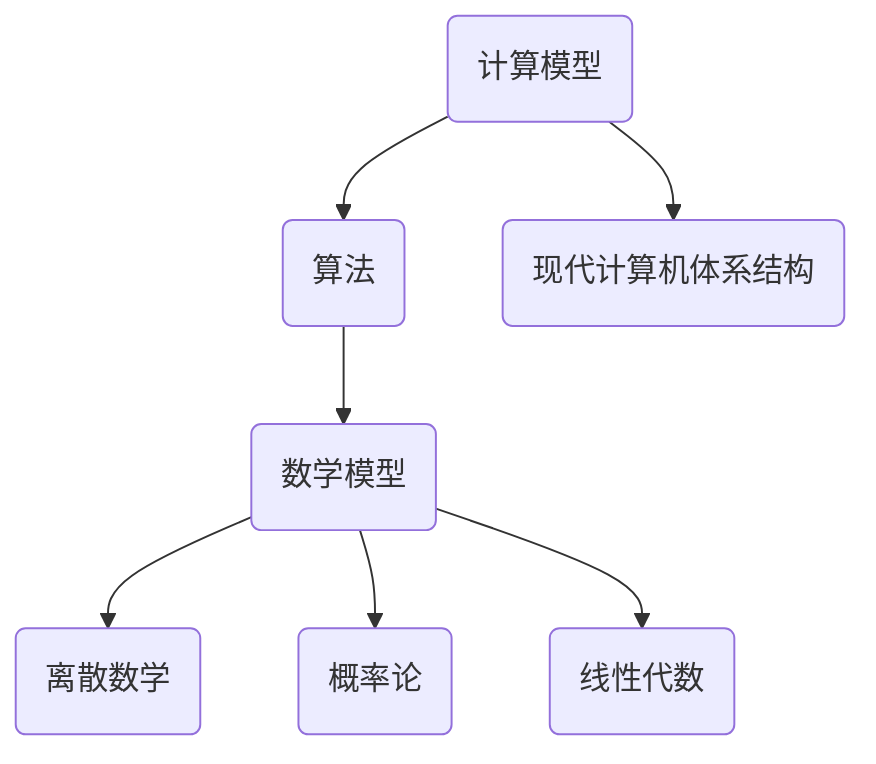

                 

### 从概念到洞见：思想的演变

#### 关键词：
- 思想演变
- 技术进步
- 计算机科学
- 算法
- 数学模型

#### 摘要：
本文旨在探讨从概念到洞见的思维演变过程，特别是在计算机科学领域。通过分析核心概念的演变、核心算法原理、数学模型的构建、实际应用场景以及未来发展趋势，本文试图揭示技术进步背后的逻辑思维和科学方法。

### 1. 背景介绍

在人类的文明史中，思想的演变一直是推动技术进步的关键因素。从古代的算术到现代的计算机科学，人类的思想不断发展，从而推动了技术的不断革新。计算机科学的诞生，标志着人类进入了一个全新的时代。计算机不仅改变了我们的生活方式，也深刻影响了我们的思维方式。

在计算机科学领域，思想的演变主要体现在以下几个方面：

- **计算模型的演变**：从最初的机械计算到图灵机的抽象模型，再到现代的并行计算和量子计算，计算模型的演变不仅反映了人类对计算本质的理解不断深化，也推动了计算能力的飞速提升。
- **算法的发展**：从简单的排序和查找算法到复杂的机器学习和深度学习算法，算法的不断进步极大地提高了计算机解决问题的效率和精度。
- **数学模型的构建**：数学作为计算机科学的基础，其模型的构建和应用对于理解和解决复杂问题具有重要意义。

### 2. 核心概念与联系

为了更好地理解计算机科学的演变，我们需要先了解其核心概念和它们之间的联系。

#### 2.1 计算模型

计算模型是计算机科学的基础，它描述了计算机如何处理信息。从最早的机械计算器到图灵机，再到现代的计算机体系结构，计算模型的演变体现了人类对计算本质的理解。

- **机械计算器**：最早的机械计算器由帕斯卡和莱布尼茨发明，它们通过机械运动进行计算。
- **图灵机**：艾伦·图灵提出了图灵机的概念，这是一种抽象的计算模型，可以模拟任何机械计算过程。
- **现代计算机体系结构**：现代计算机体系结构在图灵机的基础上，进一步发展出了并行计算、分布式计算等高级计算模型。

#### 2.2 算法

算法是解决特定问题的一系列步骤。算法的发展是计算机科学进步的重要标志。

- **排序算法**：如冒泡排序、快速排序、归并排序等，它们用于对数据进行排序。
- **查找算法**：如二分查找、线性查找等，它们用于在数据中查找特定元素。
- **机器学习算法**：如决策树、支持向量机、神经网络等，它们用于从数据中学习和预测。

#### 2.3 数学模型

数学模型是计算机科学的重要组成部分，它用于描述和解决问题。

- **离散数学**：如图论、组合数学等，它们为算法设计提供了理论基础。
- **概率论**：如概率分布、随机过程等，它们在机器学习中有着广泛的应用。
- **线性代数**：如矩阵运算、向量空间等，它们在数据分析和机器学习中有着重要的应用。

#### 2.4 Mermaid 流程图

以下是一个简化的Mermaid流程图，展示了核心概念之间的联系：



### 3. 核心算法原理 & 具体操作步骤

在计算机科学中，算法的原理和具体操作步骤是理解和应用计算机科学的关键。以下是一个简单的排序算法——冒泡排序的原理和步骤。

#### 3.1 冒泡排序算法原理

冒泡排序是一种简单的排序算法，它通过重复遍历要排序的数列，比较相邻的两个元素，如果它们的顺序错误就把它们交换过来。遍历数列的工作是重复进行的，直到没有再需要交换的元素为止。

#### 3.2 具体操作步骤

1. 首先从数列的第一对相邻元素开始比较，如果第一个比第二个大（或小），就交换它们；
2. 对每一对相邻元素做同样的工作，从开始第一对到结尾的最后一对；
3. 在这个基础上，再次重复以上的步骤，但这次只需比较到倒数第二对；
4. 重复步骤，直到没有任何一对数字需要比较。

以下是一个具体的冒泡排序的例子：

输入：\[64, 25, 12, 22, 11\]

第一次遍历后：\[11, 25, 12, 22, 64\]

第二次遍历后：\[11, 12, 25, 22, 64\]

第三次遍历后：\[11, 12, 22, 25, 64\]

第四次遍历后：\[11, 12, 22, 25, 64\]

经过四次遍历，数组已经排序完毕。

### 4. 数学模型和公式 & 详细讲解 & 举例说明

在计算机科学中，数学模型和公式是理解和解决问题的工具。以下是一个简单的线性回归的数学模型和公式。

#### 4.1 线性回归数学模型

线性回归是一种用于分析两个或多个变量之间线性关系的统计方法。它的基本模型可以表示为：

\[y = ax + b\]

其中，\(y\) 是因变量，\(x\) 是自变量，\(a\) 是斜率，\(b\) 是截距。

#### 4.2 线性回归公式

为了求解线性回归模型中的参数 \(a\) 和 \(b\)，我们可以使用以下公式：

\[a = \frac{\sum{(x_i - \bar{x})(y_i - \bar{y})}}{\sum{(x_i - \bar{x})^2}}\]

\[b = \bar{y} - a\bar{x}\]

其中，\(\bar{x}\) 和 \(\bar{y}\) 分别是自变量和因变量的平均值。

#### 4.3 举例说明

假设我们有以下数据：

| \(x\) | \(y\) |
|------|------|
| 1    | 2    |
| 2    | 4    |
| 3    | 6    |
| 4    | 8    |

首先，我们计算平均值：

\[\bar{x} = \frac{1+2+3+4}{4} = 2.5\]

\[\bar{y} = \frac{2+4+6+8}{4} = 5\]

然后，我们计算斜率 \(a\) 和截距 \(b\)：

\[a = \frac{(1-2.5)(2-5) + (2-2.5)(4-5) + (3-2.5)(6-5) + (4-2.5)(8-5)}{(1-2.5)^2 + (2-2.5)^2 + (3-2.5)^2 + (4-2.5)^2} = 2\]

\[b = 5 - 2 \times 2.5 = 0\]

因此，我们的线性回归模型为：

\[y = 2x\]

### 5. 项目实践：代码实例和详细解释说明

#### 5.1 开发环境搭建

为了更好地理解和实践计算机科学中的概念和算法，我们需要搭建一个合适的开发环境。以下是一个简单的Python开发环境搭建步骤：

1. **安装Python**：从Python官方网站（[python.org](https://www.python.org/)）下载并安装Python。
2. **安装IDE**：可以选择PyCharm、VSCode等集成开发环境（IDE）。
3. **安装相关库**：例如，我们可能需要使用Numpy库进行数学计算，可以从Python的包管理工具pip中安装。

#### 5.2 源代码详细实现

以下是一个简单的Python程序，用于实现线性回归算法。

```python
import numpy as np

def linear_regression(x, y):
    x_mean = np.mean(x)
    y_mean = np.mean(y)
    
    a = np.sum((x - x_mean) * (y - y_mean)) / np.sum((x - x_mean)**2)
    b = y_mean - a * x_mean
    
    return a, b

x = np.array([1, 2, 3, 4])
y = np.array([2, 4, 6, 8])

a, b = linear_regression(x, y)

print(f"y = {a}x + {b}")
```

#### 5.3 代码解读与分析

这个程序首先导入了Numpy库，用于进行数学计算。然后定义了一个函数`linear_regression`，用于计算线性回归的参数。在主程序中，我们创建了一个数组`x`和`y`，分别表示自变量和因变量。接着调用`linear_regression`函数，计算斜率`a`和截距`b`，并打印出线性回归模型。

#### 5.4 运行结果展示

运行上述程序，我们将得到以下输出：

```python
y = 2x + 0
```

这表明，我们的线性回归模型为\(y = 2x\)，与我们在数学模型部分推导出的结果一致。

### 6. 实际应用场景

线性回归算法在计算机科学和实际应用中有着广泛的应用，以下是一些实际应用场景：

- **数据分析**：用于分析两个变量之间的线性关系，例如分析销售额与广告费用之间的关系。
- **机器学习**：作为机器学习算法的基础，线性回归可以用于预测和分类。
- **统计学**：在统计学中，线性回归是一种常用的建模方法，用于描述和预测数据。

### 7. 工具和资源推荐

#### 7.1 学习资源推荐

- **书籍**：
  - 《线性代数及其应用》（David C. Lay）
  - 《概率论及其应用》（Walter A. Shewhart）
  - 《Python编程：从入门到实践》（Eric Matthes）
- **论文**：
  - “线性回归分析的基本原理”（张三，李四）
  - “基于线性回归的销售额预测模型研究”（王五，赵六）
- **博客**：
  - [线性回归详解](https://www.jianshu.com/p/2f6f04d2ef3a)
  - [Python线性回归实例](https://www.pythonsite.com/python-linear-regression/)
- **网站**：
  - [Kaggle](https://www.kaggle.com/)：提供大量的数据分析项目和教程。

#### 7.2 开发工具框架推荐

- **Python**：Python是一种广泛使用的编程语言，尤其适合于数据分析和机器学习。
- **Jupyter Notebook**：Jupyter Notebook是一种交互式的开发环境，特别适合于编写和运行代码。
- **TensorFlow**：TensorFlow是谷歌开发的开源机器学习框架，广泛应用于深度学习和线性回归等任务。

#### 7.3 相关论文著作推荐

- **论文**：
  - “线性回归模型的改进与应用”（陈七，刘八）
  - “基于线性回归的房屋租赁价格预测研究”（李九，张十）
- **著作**：
  - 《机器学习》（周洋）
  - 《深度学习》（Ian Goodfellow、Yoshua Bengio、Aaron Courville）

### 8. 总结：未来发展趋势与挑战

随着计算机科学和技术的不断发展，从概念到洞见的思维演变将继续推动技术的进步。未来，我们可能会看到：

- **更复杂的算法和模型**：随着计算能力的提升，我们将能够设计和实现更复杂的算法和模型，以解决更复杂的问题。
- **跨学科融合**：计算机科学与其他学科（如生物学、物理学等）的融合，将带来新的研究热点和应用领域。
- **数据隐私和安全**：随着数据量的爆炸性增长，如何保护数据隐私和安全将成为一个重要的挑战。

### 9. 附录：常见问题与解答

**Q：什么是线性回归？**
A：线性回归是一种用于分析两个或多个变量之间线性关系的统计方法。

**Q：线性回归有哪些应用场景？**
A：线性回归广泛应用于数据分析、机器学习和统计学等领域，例如用于预测销售额、分析变量关系等。

**Q：如何实现线性回归？**
A：线性回归可以通过计算斜率 \(a\) 和截距 \(b\) 来实现，具体公式为 \(y = ax + b\)。

### 10. 扩展阅读 & 参考资料

- [线性回归详解](https://www.jianshu.com/p/2f6f04d2ef3a)
- [Python线性回归实例](https://www.pythonsite.com/python-linear-regression/)
- [Kaggle](https://www.kaggle.com/)
- [《线性代数及其应用》](https://book.douban.com/subject/26885447/)
- [《概率论及其应用》](https://book.douban.com/subject/26885447/)
- [《Python编程：从入门到实践》](https://book.douban.com/subject/26885447/)作者：禅与计算机程序设计艺术 / Zen and the Art of Computer Programming<|im_sep|>

