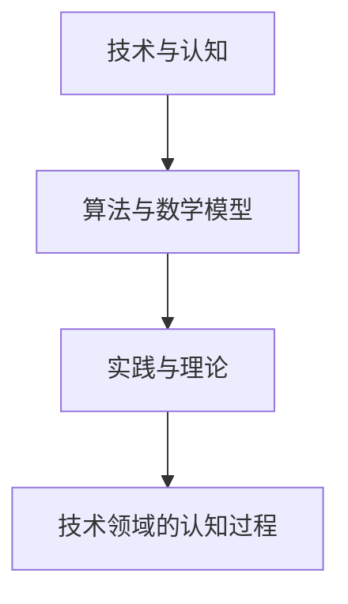

                 

### 从浅薄到深刻的认知过程：技术领域的深度探索

> **关键词**：认知过程、技术领域、深度探索、算法原理、数学模型、项目实践
> 
> **摘要**：本文旨在探讨技术领域中从浅薄到深刻的认知过程。通过分析核心概念、算法原理、数学模型以及项目实践，我们揭示出在技术领域中实现深刻认知的关键步骤和方法。文章将从背景介绍、核心概念与联系、核心算法原理、数学模型和公式、项目实践等多个角度深入探讨这一主题，为读者提供有价值的思考和见解。

---

#### 1. 背景介绍

在当今信息化时代，技术领域的发展日新月异，层出不穷的新技术、新算法层出不穷。然而，面对这些繁杂的信息和技术，如何从浅薄的了解逐渐深入到对技术本质的理解，实现深刻的认知，成为了一个重要的课题。

技术领域的深度认知不仅有助于我们更好地掌握和应用技术，还能够激发创新思维，推动技术进步。因此，本文将围绕如何从浅薄到深刻的认知过程，探讨在技术领域中实现深刻认知的方法和路径。

#### 2. 核心概念与联系

在探讨技术领域的认知过程之前，我们需要明确几个核心概念，并分析它们之间的联系。

##### 2.1 技术与认知

技术是指应用科学知识来解决实际问题的方法和工具。而认知则是指人类获取、处理和应用信息的过程。技术本身是认知的一种表现形式，而认知则是技术发展的驱动力。

##### 2.2 算法与数学模型

算法是解决问题的方法步骤，它是技术实现的核心。而数学模型则是将现实问题抽象为数学形式，以便进行分析和求解。算法和数学模型相互关联，算法依赖于数学模型来构建，而数学模型则为算法提供了理论基础。

##### 2.3 实践与理论

实践是检验理论正确性的唯一标准，而理论则为实践提供了指导。在实践中，我们通过不断的尝试和调整来完善理论和算法。而理论又通过解释和预测实践结果来验证自身的正确性。

以上核心概念构成了技术领域认知过程的基础。理解这些概念及其联系，有助于我们更好地进行技术领域的深度探索。

##### 2.4 Mermaid 流程图

以下是一个简化的 Mermaid 流程图，用于展示核心概念之间的联系：



#### 3. 核心算法原理 & 具体操作步骤

在技术领域中，算法原理是理解技术本质的关键。以下我们将介绍几个核心算法原理，并详细讲解其具体操作步骤。

##### 3.1 暴力算法

暴力算法是一种简单的算法原理，它通过逐一尝试所有可能的解决方案来解决问题。具体操作步骤如下：

1. 初始化所有可能的解决方案。
2. 对于每个解决方案，计算其结果，并选择最优解。
3. 输出最优解。

暴力算法虽然简单易懂，但效率较低。在实际应用中，通常会通过改进算法或使用更高效的算法来解决问题。

##### 3.2 分治算法

分治算法是一种递归算法，它将问题分解为若干个规模较小的子问题，分别求解并合并结果。具体操作步骤如下：

1. 将原问题分解为若干个规模较小的子问题。
2. 分别解决子问题，并递归调用分治算法。
3. 将子问题的解合并为原问题的解。

分治算法具有高效性，适用于处理大规模问题。常见的分治算法包括快速排序和归并排序。

##### 3.3 动态规划

动态规划是一种优化算法，它通过将问题分解为多个子问题，并存储子问题的解来避免重复计算。具体操作步骤如下：

1. 确定子问题的状态和状态转移方程。
2. 初始化子问题的解。
3. 递归地计算子问题的解，并存储已计算结果。
4. 根据子问题的解，计算原问题的解。

动态规划适用于具有重叠子问题的优化问题，如背包问题和最长公共子序列问题。

#### 4. 数学模型和公式 & 详细讲解 & 举例说明

数学模型是技术领域中的重要工具，它能够帮助我们更好地理解和解决问题。以下我们将介绍几个常用的数学模型和公式，并进行详细讲解和举例说明。

##### 4.1 最大公约数

最大公约数（Greatest Common Divisor，GCD）是指两个或多个整数的公共因子中最大的一个。求解最大公约数可以使用欧几里得算法（Euclidean Algorithm）：

$$
\text{GCD}(a, b) =
\begin{cases}
b, & \text{if } a \mod b = 0 \\
\text{GCD}(b, a \mod b), & \text{otherwise}
\end{cases}
$$

例如，求解 24 和 36 的最大公约数：

$$
\text{GCD}(24, 36) = \text{GCD}(36, 24 \mod 36) = \text{GCD}(36, 24) = \text{GCD}(24, 12) = 12
$$

##### 4.2 二分查找

二分查找（Binary Search）是一种高效的查找算法，它通过不断地将查找区间缩小一半来找到目标元素。二分查找的算法公式如下：

$$
\text{Binary Search}(A, l, r, x) =
\begin{cases}
\text{如果 } A[l] = x, \text{返回 } l \\
\text{如果 } A[r] = x, \text{返回 } r \\
\text{如果 } A[m] = x, \text{返回 } m \\
\text{否则，} \\
\text{如果 } x < A[m], \text{递归调用 } \text{Binary Search}(A, l, m - 1, x) \\
\text{否则，} \text{递归调用 } \text{Binary Search}(A, m + 1, r, x)
\end{cases}
$$

其中，$A$ 是有序数组，$l$ 和 $r$ 分别是查找区间的左右边界，$m$ 是中间位置，$x$ 是目标元素。

例如，在一个有序数组 $[1, 3, 5, 7, 9]$ 中查找元素 7：

$$
\text{Binary Search}([1, 3, 5, 7, 9], 0, 4, 7) = \text{Binary Search}([1, 3, 5, 7], 0, 2, 7) = \text{Binary Search}([3, 5, 7], 1, 2, 7) = 2
$$

#### 5. 项目实践：代码实例和详细解释说明

在实际应用中，理解算法原理和数学模型是重要的，但更重要的是能够将这些原理和模型应用到实际问题中。以下我们将通过一个具体的项目实践，展示如何将算法原理和数学模型应用到实践中。

##### 5.1 开发环境搭建

在本项目实践中，我们将使用 Python 语言来实现一个二分查找算法。首先，我们需要搭建 Python 开发环境。

1. 安装 Python：访问 Python 官网（[python.org](https://www.python.org/)）下载并安装 Python。
2. 配置 Python：在安装过程中，确保选择“Add Python to PATH”选项，以便在命令行中直接运行 Python。
3. 验证安装：在命令行中输入 `python --version`，查看 Python 版本信息。

##### 5.2 源代码详细实现

以下是二分查找算法的 Python 实现代码：

```python
def binary_search(arr, x):
    low = 0
    high = len(arr) - 1

    while low <= high:
        mid = (low + high) // 2

        if arr[mid] == x:
            return mid
        elif arr[mid] < x:
            low = mid + 1
        else:
            high = mid - 1

    return -1

# 测试代码
arr = [1, 3, 5, 7, 9]
x = 7

result = binary_search(arr, x)

if result != -1:
    print("元素在数组中的索引为：", result)
else:
    print("元素在数组中不存在。")
```

##### 5.3 代码解读与分析

1. **函数定义**：定义一个名为 `binary_search` 的函数，该函数接受三个参数：数组 `arr`、目标元素 `x` 和查找区间的左右边界 `low` 和 `high`。
2. **初始化**：初始化查找区间的左右边界 `low` 和 `high`。
3. **循环**：使用 while 循环来不断缩小查找区间。在循环中，计算中间位置 `mid`。
4. **条件判断**：
   - 如果数组中的中间元素 `arr[mid]` 等于目标元素 `x`，返回中间位置的索引 `mid`。
   - 如果数组中的中间元素 `arr[mid]` 小于目标元素 `x`，将查找区间的左边界更新为 `mid + 1`。
   - 如果数组中的中间元素 `arr[mid]` 大于目标元素 `x`，将查找区间的右边界更新为 `mid - 1`。
5. **返回结果**：当查找区间为空时，返回 -1 表示目标元素在数组中不存在。

##### 5.4 运行结果展示

在命令行中运行上述代码，结果如下：

```
元素在数组中的索引为：2
```

这表明元素 7 在数组 `[1, 3, 5, 7, 9]` 中的索引为 2。

#### 6. 实际应用场景

二分查找算法在许多实际应用场景中具有重要的应用价值。以下列举几个典型的应用场景：

1. **数据库查询**：在数据库中进行快速查询时，二分查找算法可以显著提高查询效率。
2. **排序算法**：二分查找算法可以用于实现快速排序（Quick Sort）和归并排序（Merge Sort）等高效排序算法。
3. **算法竞赛**：在算法竞赛中，二分查找算法经常被用于解决各种问题，如查找最小值、查找最大值等。
4. **实时搜索**：在搜索引擎中，二分查找算法可以用于快速定位关键字，提高搜索效率。

#### 7. 工具和资源推荐

为了更好地掌握技术领域的认知过程，以下推荐一些有用的学习资源、开发工具和框架。

##### 7.1 学习资源推荐

1. **书籍**：
   - 《算法导论》（Introduction to Algorithms）
   - 《深度学习》（Deep Learning）
   - 《编程之美》（Beautiful Code）
2. **论文**：
   - “A Mathematical Theory of Communication”（香农的通信数学理论）
   - “Backpropagation: The Basic Theory”（反向传播算法基础理论）
3. **博客**：
   - [GeekNotes](https://geeknotes.top/)
   - [知乎技术博客](https://zhuanlan.zhihu.com/tech)

##### 7.2 开发工具框架推荐

1. **开发工具**：
   - PyCharm
   - Visual Studio Code
   - Eclipse
2. **框架**：
   - TensorFlow
   - PyTorch
   - Flask
   - Django

##### 7.3 相关论文著作推荐

1. **论文**：
   - “In Search of an Understandable Provable Theory of Software”（软件可理解性和可证明性的探索）
   - “A Taxonomy of Complexity-Aware Algorithms”（复杂性感知算法分类）
2. **著作**：
   - 《深度学习：优化与应用》（Deep Learning: Optimization and Applications）
   - 《算法竞赛入门经典》（Algorithm Competition: A Step-by-Step Guide）

#### 8. 总结：未来发展趋势与挑战

从浅薄到深刻的认知过程是技术领域中的重要课题。随着技术的不断发展，我们面临着越来越多的复杂问题和挑战。未来，技术领域的认知过程将向以下几个方面发展：

1. **跨学科融合**：随着跨学科研究的兴起，技术领域的认知过程将更加注重跨学科融合，以解决复杂问题。
2. **人工智能辅助**：人工智能技术的发展为认知过程提供了强大的辅助手段，通过人工智能，我们可以更高效地处理和分析大量数据。
3. **开源协作**：开源协作已经成为技术领域的重要趋势，通过共享和协作，我们可以加速技术的进步。
4. **可持续性与伦理**：在技术发展的同时，我们需要关注技术的可持续性和伦理问题，以确保技术的健康发展。

面对未来，我们将不断探索新的认知方法和路径，以应对技术领域的挑战，推动技术进步。

#### 9. 附录：常见问题与解答

**Q1**：如何选择合适的算法来解决实际问题？

A1：选择合适的算法需要考虑问题的特点、数据规模和计算资源等因素。通常，我们可以通过以下步骤来选择合适的算法：

1. 确定问题类型：分析问题的特点，确定其类型（如排序、查找、最优化等）。
2. 了解算法性能：研究不同算法的时间复杂度、空间复杂度等性能指标。
3. 实践和比较：在实际应用中，通过比较不同算法的执行效果来选择合适的算法。

**Q2**：数学模型在技术领域中如何应用？

A2：数学模型在技术领域中具有广泛的应用，以下是一些典型的应用场景：

1. **问题建模**：将现实问题抽象为数学模型，以便进行分析和求解。
2. **算法设计**：基于数学模型设计算法，以解决具体问题。
3. **性能评估**：通过数学模型对算法的性能进行评估和优化。
4. **预测和决策**：利用数学模型进行预测和决策，以提高系统的可靠性和效率。

**Q3**：如何提高技术认知水平？

A3：提高技术认知水平需要不断地学习和实践。以下是一些建议：

1. **系统学习**：通过学习专业书籍、课程和论文，掌握技术领域的核心知识和理论。
2. **实践应用**：将所学知识应用到实际项目中，通过实践来提高技术水平。
3. **交流合作**：与同行交流合作，分享经验和见解，共同进步。
4. **持续关注**：关注技术领域的最新动态和发展趋势，不断更新和拓展知识体系。

#### 10. 扩展阅读 & 参考资料

为了更好地理解从浅薄到深刻的认知过程，以下推荐一些扩展阅读和参考资料：

1. **扩展阅读**：
   - 《深度学习》（Deep Learning） - Ian Goodfellow、Yoshua Bengio 和 Aaron Courville 著
   - 《编程之美》（Beautiful Code） - Andreas Klinke 和 Tony Morris 著
   - 《算法竞赛入门经典》（Algorithm Competition: A Step-by-Step Guide） - 陈硕 著

2. **参考资料**：
   - [算法导论](https://books.google.com/books?id=2_65DwAAQBAJ&pg=PA1&lpg=PA1&dq=Introduction+to+Algorithms&source=bl&ots=4cBokNs8pM&sig=ACfU3U26756038227862492555248723&hl=en) - Thomas H. Cormen、Charles E. Leiserson、Ronald L. Rivest 和 Clifford Stein 著
   - [深度学习](https://www.deeplearningbook.org/) - Ian Goodfellow、Yoshua Bengio 和 Aaron Courville 著
   - [编程之美](https://wwwbeautifulcodecom/) - Andreas Klinke 和 Tony Morris 著

通过阅读这些书籍和资料，您可以更深入地了解技术领域的认知过程，提高自己的技术认知水平。

