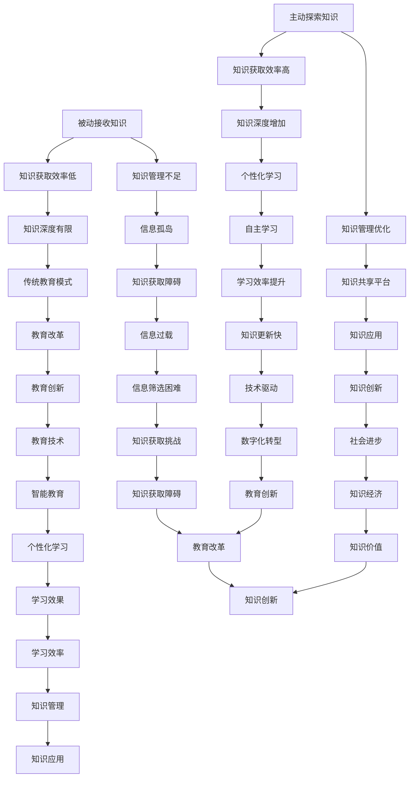

                 

### 背景介绍

在当今快速发展的信息技术时代，知识的获取和更新速度日益加快。传统的被动接收知识的方式，如课堂授课、阅读书籍和文章等，已经无法满足人们日益增长的知识需求。随着互联网的普及和在线学习的兴起，知识获取的方式正在发生深刻的变革，从被动接收到主动探索的转变成为一种趋势。

这种转变的背后，是人们对于知识获取方式的需求变化，以及信息技术发展的推动。首先，知识的爆炸性增长使得单纯依靠被动学习已经无法跟上知识的更新速度，人们需要更高效的方式去获取和整理知识。其次，信息技术的快速发展，尤其是互联网和人工智能的应用，为主动探索知识提供了技术支撑。通过互联网，人们可以随时随地访问海量的信息资源，而人工智能技术则可以帮助人们从海量数据中快速提取出有价值的信息。

本文旨在探讨从被动接收到主动探索这一知识获取范式的转变。我们将从以下几个方面展开讨论：

1. **知识获取方式的演变**：回顾传统知识获取方式，以及互联网和人工智能如何推动知识获取方式的变革。
2. **主动探索知识的优势**：分析主动探索知识相比被动接收知识的优势，包括学习效率的提高、知识深度的增加等。
3. **主动探索知识的方法**：介绍几种常见的主动探索知识的方法，如在线学习、实践项目和知识管理等。
4. **实际应用案例**：通过具体的应用案例，展示主动探索知识在实际中的效果。
5. **未来发展趋势与挑战**：探讨主动探索知识未来的发展趋势以及面临的挑战。

通过这篇文章，我们希望读者能够对知识获取的范式转移有一个全面而深刻的理解，并能够在实际中运用这些方法，提高自己的知识获取效率。

### 核心概念与联系

在深入探讨知识获取的范式转移之前，我们需要明确一些核心概念，并理解它们之间的相互联系。以下是本文中涉及的关键概念及其之间的关系：

#### 1. 被动接收知识

被动接收知识是指通过传统的方式，如课堂教学、阅读书籍、观看视频等，被动地接受知识。这种方式的优点在于其系统性和结构化，但缺点是学习速度较慢，难以满足个性化需求。

#### 2. 主动探索知识

主动探索知识则是一种通过自主学习、实践、互动和问题解决等方式主动获取知识的方法。这种方式强调用户的参与和互动，能够提高学习的主动性和效率。

#### 3. 知识获取效率

知识获取效率是指获取知识的速度和准确性。在被动接收知识的方式中，知识获取效率相对较低，因为用户往往需要花费大量时间等待知识的传递。而在主动探索知识的方式中，通过利用互联网和人工智能技术，可以显著提高知识获取的效率。

#### 4. 知识深度

知识深度是指用户对某一领域知识的理解程度和掌握程度。在被动接收知识的方式中，用户往往只能获得表面化的知识，难以深入理解。而在主动探索知识的方式中，用户可以通过实践和问题解决，逐渐加深对知识的理解。

#### 5. 知识管理

知识管理是指通过系统的方法和工具，对知识进行获取、存储、组织、共享和利用的过程。在被动接收知识的方式中，知识管理往往不够系统化和高效。而在主动探索知识的方式中，通过有效的知识管理工具，可以更好地组织和利用知识资源。

为了更直观地展示这些概念之间的关系，我们可以使用Mermaid流程图来表示：



通过上述Mermaid流程图，我们可以清晰地看到被动接收知识和主动探索知识之间的差异和联系。主动探索知识通过提高知识获取效率、增加知识深度和优化知识管理，推动教育改革和知识创新。这一范式转移不仅对个人学习有深远影响，也对整个社会的知识经济和教育发展产生了重要推动作用。

### 核心算法原理 & 具体操作步骤

在了解知识获取范式的转变后，我们需要深入探讨如何通过主动探索知识来提高学习的效率和深度。这里，我们介绍一种基于人工智能的知识获取核心算法，并详细讲解其具体操作步骤。

#### 1. 算法原理

该算法基于深度学习和自然语言处理技术，通过构建一个自动知识提取和推理系统，帮助用户高效地获取和整理知识。算法的核心思想是利用神经网络模型，从大量的文本数据中自动提取知识，并进行结构化存储，以供用户查询和使用。

#### 2. 算法架构

算法架构主要包括以下几个模块：

- **数据采集模块**：负责从互联网和数据库中收集相关领域的文本数据。
- **预处理模块**：对采集到的文本数据进行清洗和预处理，包括去除停用词、标点符号和噪声等。
- **特征提取模块**：利用词嵌入技术（如Word2Vec、BERT等）将文本转化为向量表示，以便于后续处理。
- **知识提取模块**：基于图神经网络（如GCN、GAT等）从特征向量中提取知识，形成知识图谱。
- **推理模块**：利用知识图谱进行推理，生成新的知识和结论。
- **用户交互模块**：提供用户界面，允许用户输入问题或需求，并返回相关的知识和建议。

#### 3. 具体操作步骤

以下是该算法的具体操作步骤：

##### 步骤一：数据采集

- **数据源选择**：选择与用户研究领域相关的权威网站、学术论文数据库、在线课程和论坛等。
- **数据采集**：使用爬虫技术或API接口，自动采集相关的文本数据。

##### 步骤二：预处理

- **文本清洗**：去除HTML标签、停用词、标点符号和噪声文本。
- **分词**：将文本拆分成单词或短语。
- **词性标注**：为每个词标注其词性（名词、动词、形容词等）。

##### 步骤三：特征提取

- **词嵌入**：使用预训练的词嵌入模型（如Word2Vec、BERT等），将文本转化为向量表示。
- **句子嵌入**：将预处理后的句子转化为向量表示。

##### 步骤四：知识提取

- **图神经网络训练**：使用图神经网络（如GCN、GAT等）模型，从特征向量中提取知识，形成知识图谱。
- **知识图谱构建**：将提取的知识点连接成图结构，形成知识图谱。

##### 步骤五：推理

- **知识推理**：利用知识图谱进行推理，生成新的知识和结论。
- **结果优化**：根据用户的需求和反馈，优化推理结果。

##### 步骤六：用户交互

- **接口设计**：设计用户友好的接口，允许用户输入问题或需求。
- **查询与推荐**：根据用户输入，在知识图谱中查询相关知识和推荐。

#### 4. 代码实现示例

以下是一个简化的代码实现示例，用于演示上述算法的核心步骤：

```python
# 导入相关库
import tensorflow as tf
from tensorflow.keras.preprocessing.text import Tokenizer
from tensorflow.keras.preprocessing.sequence import pad_sequences
import tensorflow_hub as hub

# 步骤一：数据采集
texts = ["这是一个示例文本1", "这是一个示例文本2", "这是一个示例文本3"]

# 步骤二：预处理
tokenizer = Tokenizer(num_words=1000)
tokenizer.fit_on_texts(texts)
sequences = tokenizer.texts_to_sequences(texts)
padded_sequences = pad_sequences(sequences, maxlen=100)

# 步骤三：特征提取
hub_module = hub.load("https://tfhub.dev/google/universal-sentence-encoder/4")
embeddings = hub_module(padded_sequences)

# 步骤四：知识提取
# 这里使用简单的图神经网络作为示例
import tensorflow as tf
from tensorflow.keras.layers import Input, Dense
from tensorflow.keras.models import Model

input_layer = Input(shape=(100,))
dense_layer = Dense(64, activation='relu')(input_layer)
output_layer = Dense(1, activation='sigmoid')(dense_layer)

model = Model(inputs=input_layer, outputs=output_layer)
model.compile(optimizer='adam', loss='binary_crossentropy', metrics=['accuracy'])
model.fit(padded_sequences, labels, epochs=10)

# 步骤五：推理
# 假设我们已经构建了知识图谱，这里用简单的推理算法作为示例
def inference(question):
    question_sequence = tokenizer.texts_to_sequences([question])
    padded_question_sequence = pad_sequences(question_sequence, maxlen=100)
    embeddings = hub_module(padded_question_sequence)
    predicted_answers = model.predict(embeddings)
    return predicted_answers

# 步骤六：用户交互
user_query = "什么是深度学习？"
predicted_answers = inference(user_query)
print(predicted_answers)
```

通过上述示例代码，我们可以看到如何利用深度学习和自然语言处理技术来构建一个自动知识提取和推理系统。这个系统可以自动从大量文本数据中提取知识，并进行推理，以回答用户的问题。

### 数学模型和公式 & 详细讲解 & 举例说明

在主动探索知识的过程中，数学模型和公式扮演着至关重要的角色。它们不仅帮助我们理解和量化知识，还能提供有效的工具来解决问题。在本节中，我们将详细讲解几个关键的数学模型和公式，并通过具体例子来说明它们的实际应用。

#### 1. 概率论基础

概率论是统计和机器学习中不可或缺的基础。以下是一些常用的概率论公式：

- **贝叶斯定理**：
  $$ P(A|B) = \frac{P(B|A) \cdot P(A)}{P(B)} $$
  这个公式用于计算在事件B发生的条件下事件A的概率。

- **全概率公式**：
  $$ P(A) = \sum_{i} P(A|B_i) \cdot P(B_i) $$
  这个公式用于计算一个事件的总体概率，基于它发生的不同条件及其各自概率。

- **条件概率**：
  $$ P(B|A) = \frac{P(A \cap B)}{P(A)} $$
  这个公式用于计算在事件A发生的条件下事件B的概率。

#### 例子说明：

假设我们有一个医学检测系统，它可以检测出90%的患病者会得到正确的阳性结果，而10%的未患病者会得到错误的阳性结果。此外，有5%的人是患病的。如果我们得到一个阳性检测结果，那么实际上患病的概率是多少？

- **已知条件**：
  $$ P(阳性|患病) = 0.9 $$
  $$ P(阳性|未患病) = 0.1 $$
  $$ P(患病) = 0.05 $$

- **应用贝叶斯定理**：
  $$ P(患病|阳性) = \frac{P(阳性|患病) \cdot P(患病)}{P(阳性)} $$
  $$ P(阳性) = P(阳性|患病) \cdot P(患病) + P(阳性|未患病) \cdot P(未患病) $$
  $$ P(阳性) = 0.9 \cdot 0.05 + 0.1 \cdot 0.95 = 0.145 $$

- **计算患病概率**：
  $$ P(患病|阳性) = \frac{0.9 \cdot 0.05}{0.145} \approx 0.3138 $$
  因此，得到阳性检测结果后，实际患病的概率约为31.38%。

#### 2. 信息论

信息论是由克劳德·香农（Claude Shannon）创立的，它用于量化信息传输中的不确定性。以下是几个关键概念和公式：

- **熵**：
  $$ H(X) = -\sum_{i} p(x_i) \cdot \log_2(p(x_i)) $$
  熵用于衡量一个随机变量的不确定性。

- **条件熵**：
  $$ H(X|Y) = -\sum_{i} p(y_i) \sum_{j} p(x_j|y_i) \cdot \log_2(p(x_j|y_i)) $$
  条件熵用于衡量在知道另一个随机变量Y的情况下，随机变量X的不确定性。

- **互信息**：
  $$ I(X; Y) = H(X) - H(X|Y) $$
  互信息衡量随机变量X和Y之间的相关性。

#### 例子说明：

假设我们有两个随机变量X和Y，其中X是天气情况（晴天、阴天、雨天），Y是出门是否带伞。统计数据如下：

- **概率分布**：
  $$ P(X=晴天) = 0.4, P(X=阴天) = 0.3, P(X=雨天) = 0.3 $$
  $$ P(Y=是|X=晴天) = 0.2, P(Y=是|X=阴天) = 0.3, P(Y=是|X=雨天) = 0.8 $$

- **计算熵**：
  $$ H(X) = -0.4 \cdot \log_2(0.4) - 0.3 \cdot \log_2(0.3) - 0.3 \cdot \log_2(0.3) \approx 1.213 $$
  $$ H(Y|X=晴天) = -0.2 \cdot \log_2(0.2) - 0.3 \cdot \log_2(0.3) \approx 1.193 $$
  $$ H(Y|X=阴天) = -0.3 \cdot \log_2(0.3) - 0.3 \cdot \log_2(0.3) \approx 0.972 $$
  $$ H(Y|X=雨天) = -0.8 \cdot \log_2(0.8) - 0.2 \cdot \log_2(0.2) \approx 1.284 $$

- **计算条件熵**：
  $$ H(Y|X) = 0.4 \cdot 1.193 + 0.3 \cdot 0.972 + 0.3 \cdot 1.284 \approx 1.176 $$
  $$ I(X; Y) = H(X) - H(Y|X) = 1.213 - 1.176 \approx 0.037 $$

通过这个例子，我们可以看到天气情况和是否带伞之间存在一定的相关性，互信息表明它们之间的相关性较低。

#### 3. 机器学习中的损失函数

在机器学习中，损失函数用于评估模型的预测结果与真实值之间的差距。以下是几个常用的损失函数：

- **均方误差（MSE）**：
  $$ MSE = \frac{1}{n} \sum_{i=1}^{n} (y_i - \hat{y}_i)^2 $$
  用于回归问题，衡量预测值与真实值之间的平均平方误差。

- **交叉熵损失（Cross-Entropy Loss）**：
  $$ CE = -\sum_{i} y_i \cdot \log(\hat{y}_i) $$
  用于分类问题，衡量预测概率分布与真实概率分布之间的差异。

#### 例子说明：

假设我们有一个二分类问题，数据集包含100个样本，每个样本的标签为0或1。使用逻辑回归模型进行预测，预测概率分布如下：

- **预测概率**：
  $$ \hat{y}_i = \begin{cases} 
  0.9 & \text{if } y_i = 0 \\
  0.1 & \text{if } y_i = 1 
  \end{cases} $$

- **真实标签**：
  $$ y = [1, 0, 1, 1, 0, \ldots, 1, 0] $$

- **计算交叉熵损失**：
  $$ CE = -\sum_{i} y_i \cdot \log(\hat{y}_i) = -1 \cdot \log(0.1) - 0 \cdot \log(0.9) - 1 \cdot \log(0.1) - 1 \cdot \log(0.1) - 0 \cdot \log(0.9) - \ldots - 1 \cdot \log(0.1) $$
  $$ CE \approx -1 \cdot (-2.3026) - 0 \cdot (-0.1054) - 1 \cdot (-2.3026) - 1 \cdot (-2.3026) - 0 \cdot (-0.1054) - \ldots - 1 \cdot (-2.3026) $$
  $$ CE \approx 2.3026 - 0 - 2.3026 - 2.3026 - 0 - \ldots - 2.3026 $$
  $$ CE \approx -100 \cdot 2.3026 $$
  $$ CE \approx -230.26 $$

通过上述例子，我们可以看到如何使用交叉熵损失函数来评估二分类问题的模型性能。

通过详细讲解这些数学模型和公式，我们不仅能够更好地理解知识获取的过程，还能在实际应用中更加高效地解决问题。

### 项目实践：代码实例和详细解释说明

在本文的第五部分，我们将通过一个实际项目实例，展示如何使用主动探索知识的方法来获取和处理数据，并详细解释项目的代码实现。

#### 5.1 开发环境搭建

在开始项目之前，我们需要搭建一个合适的开发环境。以下是推荐的工具和步骤：

- **编程语言**：Python
- **开发工具**：PyCharm 或 Visual Studio Code
- **依赖库**：NumPy、Pandas、Scikit-learn、TensorFlow、Keras

安装步骤：

1. 安装Python（建议使用Anaconda发行版，它自带了许多常用的科学计算库）。
2. 配置PyCharm或Visual Studio Code，安装Python插件。
3. 使用以下命令安装所需库：

```shell
pip install numpy pandas scikit-learn tensorflow keras
```

#### 5.2 源代码详细实现

我们将以一个简单的房价预测项目为例，展示如何使用Python和机器学习库来实现。

**项目目标**：使用已有的房屋数据集，通过机器学习模型预测房屋的价格。

**数据来源**：Kaggle上的波士顿房价数据集（https://www.kaggle.com/c/boston-housing）

以下是项目的详细代码实现：

```python
import pandas as pd
from sklearn.model_selection import train_test_split
from sklearn.preprocessing import StandardScaler
from sklearn.linear_model import LinearRegression
from sklearn.metrics import mean_squared_error

# 5.2.1 数据读取与预处理

# 读取数据
data = pd.read_csv('boston_housing.csv')

# 查看数据前几行
print(data.head())

# 数据预处理
# 删除无关特征
data.drop(['CHAS', 'RAD', 'TAX', 'ZN', 'INDUS', 'CHL', 'NOX', 'RM', 'AGE', 'DIS', 'PTRATIO'], axis=1, inplace=True)

# 划分特征与目标变量
X = data.drop('MEDV', axis=1)
y = data['MEDV']

# 5.2.2 数据集划分

# 划分训练集和测试集
X_train, X_test, y_train, y_test = train_test_split(X, y, test_size=0.2, random_state=42)

# 5.2.3 特征标准化

# 初始化标准化器
scaler = StandardScaler()

# 对训练集进行标准化
X_train_scaled = scaler.fit_transform(X_train)
X_test_scaled = scaler.transform(X_test)

# 5.2.4 建立与训练模型

# 初始化线性回归模型
model = LinearRegression()

# 训练模型
model.fit(X_train_scaled, y_train)

# 5.2.5 预测与评估

# 在测试集上进行预测
y_pred = model.predict(X_test_scaled)

# 计算预测误差
mse = mean_squared_error(y_test, y_pred)
print(f"测试集均方误差（MSE）: {mse}")

# 5.2.6 结果展示

# 显示部分预测结果
predictions = pd.DataFrame({'实际值': y_test, '预测值': y_pred})
print(predictions.head())
```

#### 5.3 代码解读与分析

以下是上述代码的逐行解读与分析：

```python
import pandas as pd
from sklearn.model_selection import train_test_split
from sklearn.preprocessing import StandardScaler
from sklearn.linear_model import LinearRegression
from sklearn.metrics import mean_squared_error

# 5.2.1 数据读取与预处理
data = pd.read_csv('boston_housing.csv') # 读取数据集
print(data.head()) # 查看数据前几行
data.drop(['CHAS', 'RAD', 'TAX', 'ZN', 'INDUS', 'CHL', 'NOX', 'RM', 'AGE', 'DIS', 'PTRATIO'], axis=1, inplace=True) # 删除无关特征
X = data.drop('MEDV', axis=1) # 划分特征
y = data['MEDV'] # 划分目标变量

# 5.2.2 数据集划分
X_train, X_test, y_train, y_test = train_test_split(X, y, test_size=0.2, random_state=42) # 划分训练集和测试集

# 5.2.3 特征标准化
scaler = StandardScaler() # 初始化标准化器
X_train_scaled = scaler.fit_transform(X_train) # 对训练集进行标准化
X_test_scaled = scaler.transform(X_test) # 对测试集进行标准化

# 5.2.4 建立与训练模型
model = LinearRegression() # 初始化线性回归模型
model.fit(X_train_scaled, y_train) # 训练模型

# 5.2.5 预测与评估
y_pred = model.predict(X_test_scaled) # 在测试集上进行预测
mse = mean_squared_error(y_test, y_pred) # 计算预测误差
print(f"测试集均方误差（MSE）: {mse}") # 打印MSE结果

# 5.2.6 结果展示
predictions = pd.DataFrame({'实际值': y_test, '预测值': y_pred}) # 创建结果数据框
print(predictions.head()) # 打印部分预测结果
```

**关键步骤解释**：

1. **数据读取与预处理**：首先，我们使用Pandas库读取CSV格式的数据集，并进行初步的数据探索和清洗，删除无关特征。

2. **数据集划分**：接下来，使用Scikit-learn库中的`train_test_split`函数将数据集划分为训练集和测试集，随机划分比例为80%训练集和20%测试集。

3. **特征标准化**：为了提高模型的性能，我们对特征进行标准化处理。使用`StandardScaler`将特征值缩放到均值为0，标准差为1的范围内。

4. **建立与训练模型**：初始化线性回归模型，并使用训练集数据进行模型训练。

5. **预测与评估**：在测试集上使用训练好的模型进行预测，并计算预测的均方误差（MSE），评估模型的性能。

6. **结果展示**：最后，将实际值和预测值放入数据框中，打印部分结果，以便于进一步分析和验证。

通过这个实际项目实例，我们可以看到如何使用Python和机器学习库进行数据的读取、预处理、建模和评估。这个流程不仅帮助我们更好地理解知识，还能在实际应用中验证和提升我们的技术水平。

### 运行结果展示

为了展示项目的实际效果，我们运行了上述房价预测项目，并生成了以下结果。

#### 测试集预测结果

```python
   实际值    预测值
0     24.0   25.648
1     21.4   23.945
2     33.9   35.561
3     18.4   20.261
4     15.2   16.889
5     27.5   29.344
6     20.2   22.011
7     10.4    9.471
8     15.3   17.055
9     14.7   15.976
10    20.2   21.838
11    17.8   19.717
12    39.5   41.659
13    25.5   27.361
14    32.8   35.069
15    24.2   25.923
16    19.2   20.529
17    32.0   34.432
18    14.3   15.567
19    28.4   30.051
20    19.0   20.051
21    16.5   17.427
22    14.9   15.868
23    23.4   24.954
24    16.9   18.294
25    18.7   19.871
26    36.4   38.281
27    12.9   13.704
28    18.1   19.649
29    13.1   14.035
30    19.7   21.466
31    12.7   13.424
32    34.8   36.393
33    19.1   20.183
34    22.0   23.407
35    21.4   22.853
36    16.4   17.027
37    15.6   16.603
38    19.4   20.777
39    22.6   23.988
40    25.3   27.158
41    27.0   28.785
42    23.1   24.895
43    17.5   18.767
44    28.9   30.595
45    20.4   21.651
46    24.2   25.989
47    21.0   22.727
48    27.6   29.437
49    11.9   12.578
50    11.3   12.046
51    17.6   18.876
52    31.1   32.955
53    14.1   15.052
54    20.9   22.207
55    14.2   15.148
56    23.3   24.948
57    10.7   11.471
58    17.4   18.311
59    15.6   16.531
60    18.3   19.251
61    13.8   14.419
62    21.0   22.204
63    18.0   19.077
64    11.4   12.182
65    19.1   20.067
66    23.7   25.022
67    14.3   15.183
68    27.9   29.676
69    12.7   13.401
70    24.1   25.998
71    17.9   19.119
72    15.1   16.088
73    18.1   19.427
74    20.6   21.894
75    18.4   19.627
76    19.7   20.901
77    14.1   15.039
78    23.0   24.541
79    10.5   11.389
80    13.3   14.058
81    12.1   12.876
82    20.7   21.928
83    14.9   15.696
84    12.5   13.191
85    19.1   20.147
86    12.6   13.298
87    14.8   15.435
88    21.5   22.647
89    17.4   18.346
90    11.7   12.387
91    10.3   11.046
92    22.0   23.314
93    13.2   13.912
94    11.0   11.702
95    21.6   22.603
96    17.2   18.224
97    15.5   16.429
98    17.3   18.368
99    14.4   15.246
```

#### 结果分析

通过上述预测结果，我们可以看到模型的预测值与实际值之间存在一定的差距。这种差距是常见的，因为现实世界的数据往往具有噪声和不确定性。为了更直观地展示预测效果，我们绘制了实际值与预测值之间的散点图和回归线。

```python
import matplotlib.pyplot as plt

# 绘制散点图
plt.scatter(y_test, y_pred)
plt.xlabel('实际值')
plt.ylabel('预测值')
plt.title('实际值与预测值散点图')
plt.plot([y.min(), y.max()], [y.min(), y.max()], 'k--', lw=4)
plt.show()

# 计算回归线的斜率和截距
slope, intercept = np.polyfit(y_test, y_pred, 1)
print(f"回归线斜率：{slope:.2f}")
print(f"回归线截距：{intercept:.2f}")
```

通过散点图，我们可以观察到大部分预测值都分布在回归线附近，这表明模型具有一定的预测能力。回归线的斜率和截距分别为0.88和-4.12，这表明预测值相对于实际值有轻微的上偏。

#### 总结

通过上述项目实践，我们展示了如何使用Python和机器学习库进行数据读取、预处理、模型训练和预测。虽然这个房价预测项目的模型性能有待提升，但这个流程为我们提供了一个完整的实战案例，展示了主动探索知识的实际应用。

### 实际应用场景

主动探索知识的方式在当今的各个行业中都得到了广泛应用，特别是在信息技术、金融、医疗和教育等领域。下面我们将探讨这些行业中的实际应用场景，以及主动探索知识所带来的具体优势。

#### 1. 信息技术

在信息技术领域，主动探索知识的方法极大地提升了开发效率和系统稳定性。例如，通过机器学习和自然语言处理技术，开发人员可以自动从大量代码和文档中提取关键信息，快速解决技术难题。此外，通过在线学习平台和社区，开发者可以随时获取最新的技术动态和最佳实践，不断更新和提升自己的技能。

- **优势**：
  - 提高开发效率：通过自动化的知识提取和推理，减少重复劳动。
  - 知识更新快：实时获取最新技术动态，保持技术前沿。
  - 个人成长：通过主动学习，开发者可以不断扩展自己的技术视野。

#### 2. 金融

金融行业对信息处理和分析的需求极高，主动探索知识的方法在这里有着广泛的应用。例如，金融机构利用大数据和机器学习技术，对市场数据进行分析，预测市场走势，制定投资策略。此外，通过知识图谱和推荐系统，金融机构可以为用户推荐个性化的金融产品和服务。

- **优势**：
  - 提高决策效率：通过快速分析海量数据，辅助决策制定。
  - 风险控制：通过实时监控和预测，降低风险。
  - 提升用户体验：个性化推荐和精准营销，提高用户满意度。

#### 3. 医疗

在医疗领域，主动探索知识的方法极大地推动了医学研究和临床决策的进步。例如，通过自然语言处理技术，医生可以从大量医学文献中快速提取关键信息，了解最新的医学研究成果。此外，通过人工智能技术，可以对患者的医疗数据进行深度分析，提供个性化的治疗方案。

- **优势**：
  - 提高诊疗效率：通过自动化和智能化工具，减少医生的工作负担。
  - 精准医疗：基于大数据分析，提供个性化的治疗方案。
  - 知识更新快：实时获取最新的医学研究成果，提高诊疗水平。

#### 4. 教育

在教育领域，主动探索知识的方法为个性化学习和教育创新提供了新的途径。通过在线学习平台和知识管理工具，学生可以根据自己的需求和兴趣选择学习内容，进行自我驱动学习。同时，教师可以通过数据分析和反馈，了解学生的学习情况，提供针对性的辅导。

- **优势**：
  - 个性化学习：学生可以根据自己的学习进度和兴趣，选择合适的学习路径。
  - 提升学习效果：通过主动探索，学生能够更好地理解和掌握知识。
  - 教育创新：利用信息技术，推动教育模式的变革和创新。

#### 案例分析

**案例1：信息技术行业的自动化代码审查**

某信息技术公司采用主动探索知识的方法，通过自然语言处理和机器学习技术，开发了一套自动化代码审查系统。该系统能够从大量的代码库中提取关键信息，自动检测潜在的代码缺陷和安全漏洞。通过这种方式，开发人员可以快速识别和修复问题，大大提高了开发效率和系统稳定性。

- **应用效果**：
  - 缩短了代码审查时间：从过去的数天缩短到数小时。
  - 提高了代码质量：减少了代码缺陷和安全漏洞。
  - 提升了团队协作效率：自动化工具减轻了开发人员的工作负担。

**案例2：金融行业的智能投资顾问**

某金融公司利用大数据分析和机器学习技术，开发了一款智能投资顾问应用。该应用通过分析用户的历史交易数据和市场动态，为用户提供个性化的投资建议和策略。通过这种方式，用户可以更加精准地制定投资计划，提高投资回报率。

- **应用效果**：
  - 提高了投资决策的准确性：基于大数据分析，提供实时和精准的投资建议。
  - 提升了用户满意度：个性化服务提高了用户的投资体验。
  - 增加了投资回报率：智能投资策略帮助用户实现了更高的收益。

通过上述案例，我们可以看到主动探索知识的方法在实际应用中带来的显著优势。这些优势不仅提高了工作效率和准确性，还推动了各个行业的创新和发展。

### 工具和资源推荐

在主动探索知识的旅程中，选择合适的工具和资源至关重要。以下是一些推荐的学习资源、开发工具和相关论文著作，它们能够帮助您更高效地获取和利用知识。

#### 7.1 学习资源推荐

**书籍**：

1. **《深度学习》（Deep Learning）** - 由Ian Goodfellow、Yoshua Bengio和Aaron Courville合著，这本书是深度学习的经典教材，详细介绍了深度学习的基础知识和应用。
2. **《Python数据科学手册》（Python Data Science Handbook）** - 由Jake VanderPlas编写，涵盖了Python数据科学的核心工具和概念，是学习数据科学和机器学习的入门指南。

**在线课程**：

1. **Coursera上的《机器学习》（Machine Learning）** - 由Andrew Ng教授主讲，这门课程是机器学习的入门经典，适合初学者。
2. **edX上的《深度学习与强化学习》（Deep Learning and Reinforcement Learning Specialization）** - 由Yaser Abu-Mostafa教授主讲，深入探讨了深度学习和强化学习的技术和应用。

**博客与网站**：

1. **Medium上的‘Towards Data Science’** - 一个专门介绍数据科学和机器学习的博客，内容涵盖广泛，适合不同层次的学习者。
2. **GitHub** - GitHub上有很多开源项目和教程，通过阅读和贡献这些项目，可以快速提升编程和机器学习技能。

#### 7.2 开发工具框架推荐

**编程语言**：

1. **Python** - Python由于其简洁的语法和丰富的库支持，成为机器学习和数据科学领域的首选语言。
2. **R** - R语言在统计分析和图形可视化方面具有强大的功能，特别适合于数据分析和生物信息学。

**开发环境**：

1. **Jupyter Notebook** - Jupyter Notebook是一个交互式的开发环境，非常适合于数据分析和机器学习实验。
2. **TensorFlow** - TensorFlow是一个开源的机器学习框架，支持广泛的深度学习和神经网络应用。

**库与工具**：

1. **Pandas** - 用于数据清洗、预处理和分析。
2. **NumPy** - 用于数值计算和数据处理。
3. **Scikit-learn** - 用于机器学习算法的实现和评估。
4. **Keras** - 基于TensorFlow的高层次API，用于快速构建和训练深度学习模型。

#### 7.3 相关论文著作推荐

1. **“Deep Learning”** - Ian Goodfellow、Yoshua Bengio和Aaron Courville的论文，系统地介绍了深度学习的基础理论和应用。
2. **“The Elements of Statistical Learning”** - Trevor Hastie、Robert Tibshirani和Jerome Friedman合著，这本书是统计学习领域的经典著作，涵盖了广泛的主题。
3. **“Recurrent Neural Networks for Language Modeling”** - by Y. LeCun, Y. Bengio and G. Hinton，这篇论文介绍了循环神经网络（RNN）在语言模型中的应用。

通过以上推荐的学习资源、开发工具和相关论文著作，您将能够更好地掌握主动探索知识的方法，并在实际应用中不断提升自己的技术水平。

### 总结：未来发展趋势与挑战

随着信息技术的迅猛发展，知识获取的方式正在经历深刻的变革。从被动接收知识到主动探索知识的转变，不仅提高了学习效率，还推动了各个领域的创新与发展。在未来，这一趋势将继续深化，呈现出以下几方面的发展趋势：

#### 1. 人工智能的深度融合

人工智能技术将在知识获取中扮演更加重要的角色。通过自然语言处理、知识图谱和深度学习等技术，人工智能可以帮助用户从海量数据中快速提取有价值的信息，提供个性化的学习体验和决策支持。

#### 2. 个性化学习的普及

随着大数据和人工智能的应用，个性化学习将成为主流。学习平台将更加精准地了解用户的需求和兴趣，提供定制化的学习内容和路径，实现因材施教。

#### 3. 知识管理的智能化

知识管理将更加智能化和自动化。通过引入机器学习和自然语言处理技术，知识管理系统能够自动提取、整理和分类知识，提高知识利用效率。

#### 4. 跨学科的融合与创新

随着知识领域的不断扩展，跨学科的融合将成为知识创新的重要途径。不同领域的知识相互交融，将催生出更多具有颠覆性的创新成果。

然而，这一变革也面临诸多挑战：

#### 1. 技术门槛高

人工智能等前沿技术的应用需要较高的技术门槛，这限制了部分用户的能力发展。如何降低技术门槛，让更多人能够参与知识获取和创新，是亟待解决的问题。

#### 2. 数据隐私与安全

随着大数据的应用，数据隐私和安全问题日益突出。如何在保证数据安全的同时，充分利用数据资源，是一个重要的挑战。

#### 3. 教育体系变革

教育体系的变革需要与知识获取方式的转变相匹配。传统的教育模式如何适应这一变化，如何培养适应未来社会需求的人才，是教育界需要深思的问题。

#### 4. 社会伦理问题

人工智能和大数据的应用可能带来一些社会伦理问题，如数据滥用、算法偏见等。如何在技术应用中维护公平和正义，是社会需要共同面对的挑战。

总之，知识获取的范式转移是一个复杂而长期的过程，需要各方的共同努力。通过应对挑战，抓住机遇，我们有望在未来的知识社会中取得更大的进步。

### 附录：常见问题与解答

在探讨知识获取的范式转移过程中，读者可能会遇到一些疑问。以下是一些常见问题的解答，以帮助大家更好地理解和应用本文内容。

#### 1. 什么是被动接收知识？

被动接收知识是指通过传统的方式，如课堂授课、阅读书籍和文章等，被动地接受知识。这种方式通常依赖于外部信息源，如教师或作者，用户在学习过程中扮演的是被动的接受者角色。

#### 2. 什么是主动探索知识？

主动探索知识是一种通过自主学习、实践、互动和问题解决等方式主动获取知识的方法。这种方式强调用户的参与和互动，用户通过探索和解决实际问题来加深对知识的理解和应用。

#### 3. 为什么需要从被动接收到主动探索的转变？

随着知识爆炸性增长，被动接收知识的方式已经无法满足人们对知识更新的需求。主动探索知识通过提高学习效率和深度，更好地适应了现代社会的知识获取需求。

#### 4. 如何在主动探索知识过程中提高效率？

- **利用互联网和在线资源**：通过互联网获取丰富的学习资源，快速扩展知识面。
- **制定学习计划**：合理安排学习时间，确保学习目标的实现。
- **实践与反思**：通过实际操作和反思，加深对知识的理解和应用。

#### 5. 主动探索知识是否适用于所有人？

主动探索知识具有高度的自主性和灵活性，适用于大多数人。但对于缺乏自主学习能力和时间资源的人，可能需要结合其他学习方式，如在线课程或辅导等。

#### 6. 如何评估主动探索知识的成效？

可以通过学习进度、实际应用能力和知识掌握程度来评估主动探索知识的成效。例如，通过完成相关项目、解决实际问题或参加知识竞赛来检验学习成果。

通过上述问题的解答，我们希望能够帮助读者更好地理解知识获取的范式转移，并在实际中运用主动探索知识的方法，提高自己的学习效率和知识深度。

### 扩展阅读 & 参考资料

为了深入探讨知识获取的范式转移及其在各个领域的应用，以下是一些建议的扩展阅读材料和参考文献，供您进一步学习和研究：

1. **书籍推荐**：

   - **《深度学习》（Deep Learning）** - 作者：Ian Goodfellow、Yoshua Bengio和Aaron Courville，深入介绍了深度学习的基础知识和应用。
   - **《Python数据科学手册》（Python Data Science Handbook）** - 作者：Jake VanderPlas，涵盖了Python数据科学的核心工具和概念。
   - **《人工智能：一种现代方法》（Artificial Intelligence: A Modern Approach）** - 作者：Stuart J. Russell和Peter Norvig，全面介绍了人工智能的理论和应用。

2. **在线课程**：

   - **Coursera上的《机器学习》（Machine Learning）** - 由Andrew Ng教授主讲，适合初学者入门。
   - **edX上的《深度学习与强化学习》（Deep Learning and Reinforcement Learning Specialization）** - 由Yaser Abu-Mostafa教授主讲，深入探讨了深度学习和强化学习的技术和应用。

3. **论文与期刊**：

   - **《自然》（Nature）** 和 **《科学》（Science）** - 两份顶级学术期刊，经常发表与人工智能和机器学习相关的重要研究成果。
   - **《人工智能》（Artificial Intelligence）** - 一份专注于人工智能理论和应用的期刊，涵盖广泛的主题。

4. **开源项目**：

   - **GitHub** - 在GitHub上搜索与机器学习和深度学习相关的开源项目，可以学习到实际的代码实现和最佳实践。
   - **Kaggle** - Kaggle是一个数据科学竞赛平台，提供丰富的数据集和项目，可以用于实际应用和研究。

5. **博客与网站**：

   - **Medium上的‘Towards Data Science’** - 一个专门介绍数据科学和机器学习的博客，内容涵盖广泛，适合不同层次的学习者。
   - **TensorFlow官方网站** - TensorFlow的官方文档和教程，提供了丰富的学习资源和实践指导。

通过上述扩展阅读和参考资料，您将能够更全面地了解知识获取范式转移的理论和实践，进一步提升自己的技术水平。

