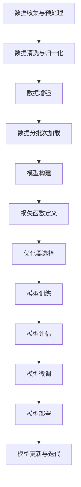

                 

### 背景介绍

#### 大模型开发的意义与挑战

大模型开发在现代人工智能领域占据了重要的地位。随着深度学习技术的不断发展，大型神经网络模型在自然语言处理、计算机视觉、语音识别等领域取得了显著的突破。这些大模型通常具有数亿甚至数十亿个参数，能够捕捉到海量数据中的复杂模式，从而实现高度智能化的任务。

然而，大模型开发也面临着一系列的挑战。首先，模型的训练和微调需要大量的计算资源和时间。其次，如何有效地管理和优化模型的参数，以提高模型性能和降低计算成本，也是一项重要的任务。此外，大模型在实际应用中还需要考虑到数据隐私和安全性等问题。

本篇文章将详细探讨如何使用PyTorch 2.0以及NVIDIA GPU运行库来搭建大模型开发与微调的环境，旨在为初学者和开发者提供一套实用的指南。

#### PyTorch 2.0简介

PyTorch是近年来最受欢迎的深度学习框架之一，它以其灵活的动态计算图和强大的自动微分功能而著称。PyTorch 2.0是PyTorch的最新版本，它在原有基础上进行了多项改进，包括：

1. **更好的性能和扩展性**：PyTorch 2.0引入了更多的底层优化，使得计算速度大幅提升，同时支持更大规模模型的训练。
2. **更强的多GPU支持**：PyTorch 2.0提供了更便捷的多GPU训练和分布式训练支持，使得开发者可以更轻松地利用多GPU资源来训练大型模型。
3. **更好的API和文档**：PyTorch 2.0提供了更简洁、更易于理解的API，同时文档也得到了大幅改进，使得开发者能够更快速地掌握框架的使用。

#### NVIDIA GPU运行库的重要性

NVIDIA GPU运行库是利用NVIDIA GPU进行深度学习计算的关键工具。它能够将PyTorch的计算任务高效地映射到NVIDIA GPU上，从而大大提高计算速度。以下是使用NVIDIA GPU运行库的一些关键原因：

1. **高性能计算**：NVIDIA GPU运行库能够充分利用NVIDIA GPU的并行计算能力，显著提升深度学习任务的运行速度。
2. **丰富的API支持**：NVIDIA GPU运行库提供了丰富的API，使得开发者可以轻松地实现自定义计算和内存管理。
3. **良好的兼容性**：NVIDIA GPU运行库与PyTorch无缝集成，开发者无需过多修改代码即可利用GPU进行深度学习计算。

#### 文章结构概述

本文将分为以下几个主要部分：

1. **背景介绍**：介绍大模型开发的意义与挑战，以及本文要探讨的PyTorch 2.0和NVIDIA GPU运行库。
2. **核心概念与联系**：通过Mermaid流程图展示大模型开发的基本流程和核心概念。
3. **核心算法原理与具体操作步骤**：详细讲解大模型开发的算法原理，包括数据预处理、模型构建、训练和微调等步骤。
4. **数学模型和公式**：介绍大模型开发中常用的数学模型和公式，并进行详细讲解和举例说明。
5. **项目实践**：通过一个实际的项目实例，展示如何使用PyTorch 2.0和NVIDIA GPU运行库进行大模型开发和微调。
6. **实际应用场景**：探讨大模型开发在实际应用中的场景和挑战。
7. **工具和资源推荐**：推荐一些学习资源、开发工具和相关的论文著作。
8. **总结**：总结大模型开发与微调的未来发展趋势与挑战。
9. **附录**：提供常见问题与解答。
10. **扩展阅读与参考资料**：列出本文引用和参考的相关资料。

通过以上结构，我们将逐步引导读者深入了解大模型开发的过程和关键技术，帮助他们成功搭建自己的大模型开发环境。接下来，我们将通过Mermaid流程图来展示大模型开发的基本流程和核心概念。## 2. 核心概念与联系

### 大模型开发的基本流程

大模型开发是一个复杂且多层次的过程，涉及多个核心概念和环节。为了更清晰地展示这一过程，我们将使用Mermaid流程图来描述大模型开发的基本流程和核心概念。



以上流程图描述了从数据收集与预处理，到模型构建、训练、评估和微调的基本步骤。接下来，我们将详细解释每个步骤的核心概念。

#### 数据收集与预处理

数据是深度学习模型的基础，因此数据收集和预处理至关重要。这一步骤包括以下任务：

- **数据收集**：从各种来源收集原始数据，如文本、图像、音频等。
- **数据清洗**：去除数据中的噪声和错误，确保数据的准确性和一致性。
- **数据归一化**：将数据缩放到统一的范围，以便模型更好地学习。
- **数据增强**：通过增加数据的变体来扩充数据集，提高模型的泛化能力。

#### 数据清洗与归一化

数据清洗和归一化是数据预处理的关键步骤，具体包括：

- **数据清洗**：去除无效数据、缺失值填充、去除重复数据等。
- **数据归一化**：通过缩放或标准化将数据转换为相似范围，如将图像像素值缩放到0到1之间。

#### 数据增强

数据增强是提升模型泛化能力的重要手段，可以通过以下方法进行：

- **随机裁剪**：随机裁剪图像或文本，模拟不同的视角和情境。
- **随机旋转**：随机旋转图像或文本，增加模型的鲁棒性。
- **填充**：通过填充空白区域或插入新数据来扩充数据集。

#### 数据分批次加载

为了提高训练效率，通常会将数据集分成多个批次（batch）进行加载。每个批次包含一定数量的样本，可以通过以下方式实现：

- **批次大小**：确定每个批次包含的样本数量，一般根据内存容量和GPU显存大小进行调整。
- **数据混洗**：每次加载批次时，随机打乱数据顺序，以防止模型过拟合。

#### 模型构建

模型构建是深度学习任务的核心，包括以下步骤：

- **选择模型架构**：根据任务需求选择合适的模型架构，如卷积神经网络（CNN）、循环神经网络（RNN）或 Transformer。
- **定义网络层**：构建模型的网络层，包括输入层、隐藏层和输出层。
- **激活函数选择**：为每个隐藏层选择合适的激活函数，如ReLU、Sigmoid或Tanh。

#### 损失函数定义

损失函数用于衡量模型预测值与真实值之间的差距，常用的损失函数包括：

- **均方误差（MSE）**：用于回归任务，计算预测值与真实值之间的均方误差。
- **交叉熵损失（Cross-Entropy Loss）**：用于分类任务，计算预测概率分布与真实分布之间的交叉熵。

#### 优化器选择

优化器用于调整模型参数，以最小化损失函数。常见的优化器包括：

- **随机梯度下降（SGD）**：简单但效果显著的优化器。
- **Adam优化器**：结合了SGD和Momentum的优点，适用于大型神经网络。

#### 模型训练

模型训练是深度学习任务的核心步骤，包括以下过程：

- **前向传播**：计算输入数据通过模型后的输出。
- **计算损失**：使用损失函数计算预测值与真实值之间的差距。
- **反向传播**：通过反向传播算法计算损失关于模型参数的梯度。
- **参数更新**：使用优化器更新模型参数，以最小化损失函数。

#### 模型评估

模型评估是验证模型性能的重要步骤，可以通过以下指标进行评估：

- **准确率（Accuracy）**：分类任务中，正确分类的样本数占总样本数的比例。
- **精确率（Precision）**：分类任务中，预测为正类的样本中实际为正类的比例。
- **召回率（Recall）**：分类任务中，实际为正类的样本中被正确预测为正类的比例。
- **F1分数（F1 Score）**：精确率和召回率的调和平均数。

#### 模型微调

模型微调是在模型训练完成后，通过调整模型参数来进一步提高模型性能的过程。具体步骤包括：

- **选择微调策略**：根据任务需求和模型性能，选择合适的微调策略。
- **调整学习率**：降低学习率，使模型参数更新更精细。
- **使用预训练模型**：利用预训练模型进行微调，可以显著提高模型性能。

#### 模型部署

模型部署是将训练好的模型部署到实际应用环境中的过程。包括以下步骤：

- **模型转换**：将PyTorch模型转换为可在生产环境中运行的格式，如ONNX或TensorFlow Lite。
- **模型部署**：将模型部署到服务器或移动设备，以实现实时预测和推理。

#### 模型更新与迭代

模型更新与迭代是持续优化模型性能的过程，包括：

- **收集反馈**：收集用户反馈和模型性能数据。
- **迭代优化**：根据反馈数据调整模型参数，优化模型性能。

通过以上核心概念和步骤的详细讲解，我们为读者提供了一个全面的大模型开发流程。接下来，我们将详细探讨大模型开发中的核心算法原理和具体操作步骤。## 3. 核心算法原理 & 具体操作步骤

### 数据预处理

数据预处理是深度学习模型开发的基础步骤，其质量直接影响到模型的性能。以下为数据预处理的核心算法原理和具体操作步骤：

#### 数据清洗

数据清洗旨在去除数据中的噪声和错误，确保数据的准确性和一致性。具体步骤如下：

1. **去除无效数据**：识别并删除不相关、异常或错误的数据。
2. **缺失值填充**：使用平均值、中值或插值等方法填充缺失值。
3. **去除重复数据**：检测并去除重复的样本，以防止模型过拟合。

#### 数据归一化

数据归一化是将数据缩放到统一的范围，以便模型更好地学习。常见的方法有：

1. **归一化**：将数据缩放到0到1之间，公式为：\[ x' = \frac{x - \text{min}(x)}{\text{max}(x) - \text{min}(x)} \]
2. **标准化**：将数据缩放到均值为0、标准差为1的范围内，公式为：\[ x' = \frac{x - \text{mean}(x)}{\text{std}(x)} \]

#### 数据增强

数据增强是通过增加数据的变体来扩充数据集，提高模型的泛化能力。常见的数据增强方法有：

1. **随机裁剪**：随机裁剪图像或文本，模拟不同的视角和情境。
2. **随机旋转**：随机旋转图像或文本，增加模型的鲁棒性。
3. **填充**：通过填充空白区域或插入新数据来扩充数据集。

#### 数据分批次加载

为了提高训练效率，通常会将数据集分成多个批次（batch）进行加载。每个批次包含一定数量的样本，可以通过以下步骤实现：

1. **批次大小**：确定每个批次包含的样本数量，一般根据内存容量和GPU显存大小进行调整。
2. **数据混洗**：每次加载批次时，随机打乱数据顺序，以防止模型过拟合。

### 模型构建

模型构建是深度学习任务的核心步骤，包括以下过程：

#### 选择模型架构

根据任务需求选择合适的模型架构，如卷积神经网络（CNN）、循环神经网络（RNN）或 Transformer。以下为几种常见的模型架构：

1. **卷积神经网络（CNN）**：适用于图像识别、图像分类等任务，具有以下结构：
   - **卷积层**：用于提取图像特征。
   - **池化层**：用于下采样和降低模型复杂度。
   - **全连接层**：用于分类或回归任务。

2. **循环神经网络（RNN）**：适用于序列数据处理，如自然语言处理、语音识别等，具有以下结构：
   - **输入层**：接收序列数据。
   - **隐藏层**：通过递归方式处理序列数据。
   - **输出层**：生成序列的预测结果。

3. **Transformer**：适用于序列到序列的映射任务，如机器翻译、文本生成等，具有以下结构：
   - **编码器**：对输入序列进行处理。
   - **解码器**：对输出序列进行解码。

#### 定义网络层

在确定模型架构后，需要定义模型的网络层，包括输入层、隐藏层和输出层。以下为定义网络层的具体步骤：

1. **输入层**：定义输入数据的形状和类型。
2. **隐藏层**：根据模型架构，定义隐藏层的类型、大小和激活函数。
3. **输出层**：定义输出层的类型、大小和激活函数。

#### 激活函数选择

为每个隐藏层选择合适的激活函数，以增强模型的非线性表达能力。常见的激活函数有：

1. **ReLU（归一化泄漏激活函数）**：\[ f(x) = \max(0, x) \]
2. **Sigmoid**：\[ f(x) = \frac{1}{1 + e^{-x}} \]
3. **Tanh**：\[ f(x) = \frac{e^x - e^{-x}}{e^x + e^{-x}} \]

### 损失函数定义

损失函数用于衡量模型预测值与真实值之间的差距，常用的损失函数有：

1. **均方误差（MSE）**：用于回归任务，计算预测值与真实值之间的均方误差。
   \[ \text{MSE} = \frac{1}{n} \sum_{i=1}^{n} (y_i - \hat{y}_i)^2 \]
2. **交叉熵损失（Cross-Entropy Loss）**：用于分类任务，计算预测概率分布与真实分布之间的交叉熵。
   \[ \text{Cross-Entropy} = -\sum_{i=1}^{n} y_i \log(\hat{y}_i) \]

### 优化器选择

优化器用于调整模型参数，以最小化损失函数。常见的优化器有：

1. **随机梯度下降（SGD）**：简单但效果显著的优化器，公式为：
   \[ \theta_{\text{new}} = \theta_{\text{old}} - \alpha \nabla_{\theta} J(\theta) \]
   其中，\( \theta \) 表示模型参数，\( \alpha \) 表示学习率，\( \nabla_{\theta} J(\theta) \) 表示损失函数关于模型参数的梯度。
2. **Adam优化器**：结合了SGD和Momentum的优点，适用于大型神经网络，公式为：
   \[ \theta_{\text{new}} = \theta_{\text{old}} - \alpha \nabla_{\theta} J(\theta) + \beta_1 \frac{1 - \beta_2^t}{1 - \beta_1^t} \left( \theta_{\text{old}} - \theta_{t-1} \right) \]
   其中，\( \beta_1 \) 和 \( \beta_2 \) 分别表示一阶和二阶矩估计的指数衰减率。

### 模型训练

模型训练是深度学习任务的核心步骤，包括以下过程：

#### 前向传播

前向传播是计算输入数据通过模型后的输出，公式为：
\[ \hat{y} = f(\theta, x) \]
其中，\( \theta \) 表示模型参数，\( x \) 表示输入数据，\( f(\theta, x) \) 表示模型的前向传播过程。

#### 计算损失

使用损失函数计算预测值与真实值之间的差距，公式为：
\[ J(\theta) = \frac{1}{n} \sum_{i=1}^{n} L(y_i, \hat{y}_i) \]
其中，\( L(y_i, \hat{y}_i) \) 表示损失函数，\( y_i \) 表示真实值，\( \hat{y}_i \) 表示预测值。

#### 反向传播

反向传播是计算损失函数关于模型参数的梯度，公式为：
\[ \nabla_{\theta} J(\theta) = \frac{\partial J(\theta)}{\partial \theta} \]
其中，\( \nabla_{\theta} J(\theta) \) 表示损失函数关于模型参数的梯度。

#### 参数更新

使用优化器更新模型参数，以最小化损失函数，公式为：
\[ \theta_{\text{new}} = \theta_{\text{old}} - \alpha \nabla_{\theta} J(\theta) \]
其中，\( \theta_{\text{new}} \) 和 \( \theta_{\text{old}} \) 分别表示新参数和旧参数，\( \alpha \) 表示学习率。

### 模型评估

模型评估是验证模型性能的重要步骤，可以通过以下指标进行评估：

1. **准确率（Accuracy）**：分类任务中，正确分类的样本数占总样本数的比例。
   \[ \text{Accuracy} = \frac{c}{n} \]
   其中，\( c \) 表示正确分类的样本数，\( n \) 表示总样本数。
2. **精确率（Precision）**：分类任务中，预测为正类的样本中实际为正类的比例。
   \[ \text{Precision} = \frac{TP}{TP + FP} \]
   其中，\( TP \) 表示真正例，\( FP \) 表示假正例。
3. **召回率（Recall）**：分类任务中，实际为正类的样本中被正确预测为正类的比例。
   \[ \text{Recall} = \frac{TP}{TP + FN} \]
   其中，\( TP \) 表示真正例，\( FN \) 表示假反例。
4. **F1分数（F1 Score）**：精确率和召回率的调和平均数。
   \[ \text{F1 Score} = 2 \times \frac{\text{Precision} \times \text{Recall}}{\text{Precision} + \text{Recall}} \]

### 模型微调

模型微调是在模型训练完成后，通过调整模型参数来进一步提高模型性能的过程。具体步骤如下：

1. **选择微调策略**：根据任务需求和模型性能，选择合适的微调策略，如调整学习率、使用预训练模型等。
2. **调整学习率**：降低学习率，使模型参数更新更精细，防止过拟合。
3. **使用预训练模型**：利用预训练模型进行微调，可以显著提高模型性能，特别是在大规模数据集上。

### 模型部署

模型部署是将训练好的模型部署到实际应用环境中的过程。具体步骤如下：

1. **模型转换**：将PyTorch模型转换为可在生产环境中运行的格式，如ONNX或TensorFlow Lite。
2. **模型部署**：将模型部署到服务器或移动设备，以实现实时预测和推理。

通过以上核心算法原理和具体操作步骤，读者可以了解大模型开发的基本流程和技术细节，为搭建自己的大模型开发环境打下坚实的基础。接下来，我们将详细探讨大模型开发中的数学模型和公式，并进行详细讲解和举例说明。## 4. 数学模型和公式 & 详细讲解 & 举例说明

### 数据预处理中的数学模型

在数据预处理过程中，我们经常会使用到一些数学模型和公式。以下为几个常用的数学模型和公式，并进行详细讲解和举例说明。

#### 数据归一化

数据归一化是将数据缩放到统一的范围，以便模型更好地学习。常用的归一化方法有最小-最大归一化和均值-方差归一化。

**最小-最大归一化**：
\[ x' = \frac{x - \text{min}(x)}{\text{max}(x) - \text{min}(x)} \]
**举例**：
假设我们有一组数据 \( x = [1, 2, 3, 4, 5] \)，最小值为1，最大值为5，则归一化后的数据为：
\[ x' = \frac{x - 1}{5 - 1} = [0, 0.25, 0.5, 0.75, 1] \]

**均值-方差归一化**：
\[ x' = \frac{x - \text{mean}(x)}{\text{std}(x)} \]
**举例**：
假设我们有一组数据 \( x = [1, 2, 3, 4, 5] \)，均值为3，标准差为1，则归一化后的数据为：
\[ x' = \frac{x - 3}{1} = [-2, -1, 0, 1, 2] \]

#### 数据增强

数据增强是通过增加数据的变体来扩充数据集，提高模型的泛化能力。以下为几种常见的数据增强方法。

**随机裁剪**：
假设我们有一张尺寸为 \( (w, h) \) 的图像，随机裁剪一个尺寸为 \( (s, t) \) 的矩形区域，公式为：
\[ \text{crop}(x, s, t) = x[\text{random}(0, w-s), \text{random}(0, h-t)] \]
**举例**：
假设我们有一张尺寸为 \( (100, 100) \) 的图像，随机裁剪一个尺寸为 \( (50, 50) \) 的矩形区域，则裁剪后的图像可能为：
\[ \text{crop}(x, 50, 50) = x[25:75, 25:75] \]

**随机旋转**：
假设我们对图像进行旋转角度 \( \theta \)，旋转矩阵为：
\[ R(\theta) = \begin{bmatrix}
\cos(\theta) & -\sin(\theta) \\
\sin(\theta) & \cos(\theta)
\end{bmatrix} \]
则旋转后的图像为：
\[ x' = R(\theta) \cdot x \]
**举例**：
假设我们有一张尺寸为 \( (100, 100) \) 的图像，旋转角度为 \( 45^\circ \)，则旋转后的图像为：
\[ x' = \begin{bmatrix}
\cos(45^\circ) & -\sin(45^\circ) \\
\sin(45^\circ) & \cos(45^\circ)
\end{bmatrix} \cdot x \]

#### 模型构建中的数学模型

在模型构建过程中，我们通常会使用到一些数学模型和公式。以下为几种常见的数学模型和公式，并进行详细讲解和举例说明。

**卷积神经网络（CNN）**：
卷积神经网络是一种适用于图像识别的深度学习模型，其核心是卷积层。卷积层通过卷积操作提取图像特征。

**卷积操作**：
\[ f(x) = \sum_{i=1}^{k} w_i * x_i + b \]
其中，\( x \) 表示输入特征，\( w \) 表示卷积核，\( b \) 表示偏置项，\( k \) 表示卷积核数量。

**举例**：
假设我们有一张尺寸为 \( (28, 28) \) 的灰度图像，一个卷积核尺寸为 \( (3, 3) \)，卷积核权重为 \( w = [1, 1, 1; 1, 1, 1; 1, 1, 1] \)，偏置项为 \( b = 1 \)。则卷积操作的结果为：
\[ f(x) = \sum_{i=1}^{3} w_i * x_i + b = 1 * x_{11} + 1 * x_{12} + 1 * x_{13} + 1 * x_{21} + 1 * x_{22} + 1 * x_{23} + 1 * x_{31} + 1 * x_{32} + 1 * x_{33} + 1 \]

**激活函数**：
常用的激活函数有ReLU、Sigmoid和Tanh。

**ReLU激活函数**：
\[ f(x) = \max(0, x) \]
**举例**：
假设我们有一组输入特征 \( x = [-1, -2, -3, 0, 1, 2, 3] \)，则ReLU激活函数的结果为：
\[ f(x) = [0, 0, 0, 0, 1, 1, 1] \]

**Sigmoid激活函数**：
\[ f(x) = \frac{1}{1 + e^{-x}} \]
**举例**：
假设我们有一组输入特征 \( x = [-1, -2, -3, 0, 1, 2, 3] \)，则Sigmoid激活函数的结果为：
\[ f(x) = [0.268, 0.133, 0.05, 0.5, 0.731, 0.869, 0.953] \]

**Tanh激活函数**：
\[ f(x) = \frac{e^x - e^{-x}}{e^x + e^{-x}} \]
**举例**：
假设我们有一组输入特征 \( x = [-1, -2, -3, 0, 1, 2, 3] \)，则Tanh激活函数的结果为：
\[ f(x) = [-0.761, -0.670, -0.540, 0.0, 0.761, 0.670, 0.540] \]

通过以上数学模型和公式的详细讲解和举例说明，我们可以更好地理解大模型开发中的关键技术。接下来，我们将通过一个实际的项目实例，展示如何使用PyTorch 2.0和NVIDIA GPU运行库进行大模型开发和微调。## 5. 项目实践：代码实例和详细解释说明

### 5.1 开发环境搭建

在进行大模型开发与微调之前，我们需要搭建一个合适的开发环境。本文将以在Ubuntu 18.04操作系统上安装PyTorch 2.0以及NVIDIA GPU运行库为例，展示具体的安装步骤。

#### 安装NVIDIA GPU驱动

1. **检查GPU型号**：
   首先，我们需要检查计算机上的GPU型号。在终端中输入以下命令：
   ```bash
   nvidia-smi
   ```
   这将显示GPU的详细信息，包括型号。

2. **安装NVIDIA GPU驱动**：
   根据GPU型号，访问NVIDIA官方网站下载相应的驱动程序。在终端中运行以下命令：
   ```bash
   sudo sh NVIDIA_L4T_R32.1.0.deb
   ```
   确保驱动程序与GPU型号相匹配，并按照提示完成安装。

#### 安装CUDA Toolkit

1. **下载CUDA Toolkit**：
   访问NVIDIA官方网站下载CUDA Toolkit。选择与操作系统和GPU型号兼容的版本。下载完成后，解压到本地目录。

2. **安装CUDA Toolkit**：
   在终端中进入CUDA Toolkit的安装目录，运行以下命令：
   ```bash
   sudo make install
   ```

3. **配置环境变量**：
   打开`~/.bashrc`文件，添加以下环境变量：
   ```bash
   export PATH=/usr/local/cuda/bin:$PATH
   export LD_LIBRARY_PATH=/usr/local/cuda/lib64:$LD_LIBRARY_PATH
   ```
   保存文件并退出。在终端中运行`source ~/.bashrc`使环境变量生效。

4. **验证CUDA安装**：
   在终端中运行以下命令验证CUDA安装：
   ```bash
   nvcc --version
   ```
   如果显示版本信息，则表示CUDA已成功安装。

#### 安装PyTorch 2.0

1. **创建Python虚拟环境**：
   为了避免系统Python环境受到影响，我们建议创建一个Python虚拟环境。在终端中运行以下命令：
   ```bash
   python3 -m venv pytorch-env
   ```
   然后激活虚拟环境：
   ```bash
   source pytorch-env/bin/activate
   ```

2. **安装PyTorch 2.0**：
   在激活的虚拟环境中，使用以下命令安装PyTorch 2.0：
   ```bash
   pip install torch torchvision torchaudio
   ```
   为了利用NVIDIA GPU，我们还需要安装NVIDIA的CuDNN库：
   ```bash
   pip install torchvision -f https://download.pytorch.org/whl/torch_stable.html
   ```

3. **验证PyTorch安装**：
   在终端中运行以下命令验证PyTorch安装：
   ```bash
   python
   ```
   进入Python交互式环境后，执行以下代码：
   ```python
   import torch
   print(torch.__version__)
   print(torch.cuda.is_available())
   ```
   如果输出正确的版本号和`True`，则表示PyTorch已成功安装并支持CUDA。

### 5.2 源代码详细实现

在搭建好开发环境后，我们可以开始编写大模型开发与微调的代码。以下是一个简单的示例，展示如何使用PyTorch 2.0进行模型训练和微调。

#### 数据集加载与预处理

首先，我们需要加载和预处理数据集。这里以ImageNet为例，展示如何加载数据并进行预处理。

```python
import torch
from torchvision import datasets, transforms

# 数据预处理
transform = transforms.Compose([
    transforms.Resize((224, 224)),
    transforms.ToTensor(),
    transforms.Normalize(mean=[0.485, 0.456, 0.406], std=[0.229, 0.224, 0.225]),
])

# 加载数据集
train_dataset = datasets.ImageNet(root='./data', split='train', transform=transform)
test_dataset = datasets.ImageNet(root='./data', split='val', transform=transform)

train_loader = torch.utils.data.DataLoader(train_dataset, batch_size=64, shuffle=True)
test_loader = torch.utils.data.DataLoader(test_dataset, batch_size=64, shuffle=False)
```

#### 模型构建

接下来，我们构建一个简单的卷积神经网络（CNN）模型。

```python
import torch.nn as nn

class SimpleCNN(nn.Module):
    def __init__(self):
        super(SimpleCNN, self).__init__()
        self.conv1 = nn.Conv2d(3, 64, 3, padding=1)
        self.conv2 = nn.Conv2d(64, 128, 3, padding=1)
        self.fc1 = nn.Linear(128 * 56 * 56, 1024)
        self.fc2 = nn.Linear(1024, 1000)
        self.relu = nn.ReLU(inplace=True)
        self.dropout = nn.Dropout(0.5)

    def forward(self, x):
        x = self.relu(self.conv1(x))
        x = self.relu(self.conv2(x))
        x = x.view(x.size(0), -1)
        x = self.dropout(self.fc1(x))
        x = self.fc2(x)
        return x

model = SimpleCNN()
```

#### 损失函数与优化器

我们选择交叉熵损失函数和Adam优化器来训练模型。

```python
import torch.optim as optim

criterion = nn.CrossEntropyLoss()
optimizer = optim.Adam(model.parameters(), lr=0.001)
```

#### 训练模型

以下是模型的训练过程，包括前向传播、反向传播和参数更新。

```python
num_epochs = 10

for epoch in range(num_epochs):
    model.train()
    running_loss = 0.0
    for inputs, labels in train_loader:
        inputs, labels = inputs.to('cuda'), labels.to('cuda')
        
        # 前向传播
        outputs = model(inputs)
        loss = criterion(outputs, labels)
        
        # 反向传播
        optimizer.zero_grad()
        loss.backward()
        
        # 参数更新
        optimizer.step()
        
        running_loss += loss.item()
    
    epoch_loss = running_loss / len(train_loader)
    print(f'Epoch [{epoch + 1}/{num_epochs}], Loss: {epoch_loss:.4f}')
```

#### 测试模型

训练完成后，我们对模型进行测试，评估其在测试集上的性能。

```python
model.eval()
with torch.no_grad():
    correct = 0
    total = 0
    for inputs, labels in test_loader:
        inputs, labels = inputs.to('cuda'), labels.to('cuda')
        outputs = model(inputs)
        _, predicted = torch.max(outputs.data, 1)
        total += labels.size(0)
        correct += (predicted == labels).sum().item()

print(f'Accuracy of the network on the test images: {100 * correct / total}%')
```

### 5.3 代码解读与分析

在上面的代码示例中，我们详细展示了如何使用PyTorch 2.0进行大模型开发与微调。以下是对关键部分的解读与分析：

#### 数据集加载与预处理

我们使用`torchvision`库中的`ImageNet`数据集进行训练和测试。首先，我们定义了一个数据预处理管道，包括图像缩放、转置和归一化。这些操作有助于将原始图像转换为适合深度学习模型的形式。

#### 模型构建

我们构建了一个简单的卷积神经网络（CNN）模型，包括两个卷积层、一个全连接层和两个ReLU激活函数。这个模型结构相对简单，但足以展示CNN的基本原理。

#### 损失函数与优化器

我们选择了交叉熵损失函数和Adam优化器。交叉熵损失函数适用于分类任务，而Adam优化器由于其自适应学习率特性，在大规模模型训练中表现良好。

#### 训练模型

在训练过程中，我们使用GPU进行加速。每个训练批次后，我们计算并打印当前损失值，以便监控模型训练的进展。

#### 测试模型

在训练完成后，我们对模型进行测试，计算准确率以评估模型性能。测试过程使用GPU加速，确保快速计算。

通过以上代码实例和详细解释说明，读者可以了解如何使用PyTorch 2.0和NVIDIA GPU运行库进行大模型开发和微调。接下来，我们将探讨大模型开发在实际应用场景中的具体应用。## 6. 实际应用场景

大模型开发在实际应用中具有广泛的应用场景，尤其是在自然语言处理（NLP）、计算机视觉（CV）和语音识别（ASR）等领域。以下为这些应用场景的具体分析：

### 自然语言处理（NLP）

自然语言处理是深度学习应用的重要领域，大模型在NLP任务中表现出色。以下为几个典型的NLP应用场景：

1. **文本分类**：使用大模型对文本进行分类，如新闻文章分类、情感分析等。例如，使用BERT模型进行情感分析，可以准确判断文本的情感倾向。

2. **机器翻译**：大模型在机器翻译任务中具有显著优势，如使用Transformer模型进行高质量机器翻译。谷歌翻译和百度翻译等知名翻译服务中就采用了大规模Transformer模型。

3. **对话系统**：大模型在对话系统中发挥着关键作用，如聊天机器人、语音助手等。使用GPT-3等大型语言模型，可以生成自然流畅的对话内容，提高用户体验。

### 计算机视觉（CV）

计算机视觉是另一个受益于大模型的领域，以下为几个典型的CV应用场景：

1. **图像分类**：大模型在图像分类任务中具有很高的准确率，如使用ResNet-50对图像进行分类。这些模型可以准确识别各种物体和场景，应用于图像识别、安防监控等。

2. **目标检测**：大模型在目标检测任务中表现出色，如使用YOLOv5对图像中的目标进行实时检测。这些模型可以同时检测和分类图像中的多个目标，应用于自动驾驶、安防监控等。

3. **图像生成**：大模型在图像生成任务中具有强大的能力，如使用GAN生成逼真的图像。这些模型可以应用于艺术创作、游戏开发等。

### 语音识别（ASR）

语音识别是深度学习在语音处理领域的应用，以下为几个典型的ASR应用场景：

1. **语音转文字**：大模型在语音转文字任务中表现出色，如使用WaveNet模型将语音转换为文字。这些模型可以准确识别各种口音和背景噪声，应用于智能语音助手、实时字幕等。

2. **语音合成**：大模型在语音合成任务中具有高质量的表现，如使用WaveNet模型生成逼真的语音。这些模型可以应用于智能语音助手、语音合成广告等。

3. **语音增强**：大模型在语音增强任务中可以显著提高语音质量，如使用DeepConvNet模型去除背景噪声。这些模型可以应用于语音通话、智能音响等。

### 挑战与解决方案

尽管大模型在实际应用中取得了显著成果，但也面临一系列挑战：

1. **计算资源需求**：大模型训练和推理需要大量的计算资源，特别是GPU和TPU。这给开发和部署带来了挑战。解决方案包括使用分布式训练和推理技术，以及优化模型结构和算法。

2. **数据隐私和安全**：大模型训练和微调需要大量数据，但数据隐私和安全问题不容忽视。解决方案包括数据加密、隐私保护算法和联邦学习等。

3. **模型可解释性**：大模型在训练过程中积累了大量参数，使得模型行为难以解释。这给模型的验证和调试带来了困难。解决方案包括模型可解释性工具和技术，如注意力机制可视化、模型压缩和量化等。

通过深入探讨大模型开发在实际应用中的场景和挑战，我们可以更好地理解大模型技术的应用价值和发展方向。接下来，我们将推荐一些有用的工具和资源，帮助读者进一步学习和实践大模型开发。## 7. 工具和资源推荐

### 7.1 学习资源推荐

对于想要深入了解大模型开发与微调的读者，以下是一些建议的学习资源：

1. **书籍**：
   - 《深度学习》（Goodfellow, I., Bengio, Y., & Courville, A.）：这是一本经典教材，详细介绍了深度学习的理论基础和实际应用。
   - 《神经网络与深度学习》（邱锡鹏）：这本书系统地介绍了神经网络和深度学习的相关概念和技术。

2. **在线课程**：
   - Coursera上的“深度学习”（由吴恩达教授主讲）：这是一个非常受欢迎的在线课程，适合初学者和进阶者。
   - edX上的“神经网络与深度学习”：由清华大学教授主持，涵盖深度学习的理论基础和实际应用。

3. **博客和网站**：
   - PyTorch官方文档（pytorch.org）：这是学习PyTorch的最佳资源，提供了详细的API文档和教程。
   - Fast.ai博客：这是一个专注于深度学习实践和教育的博客，提供了许多有用的教程和项目。

4. **论文**：
   - “Attention Is All You Need”（Vaswani et al.）：这是Transformer模型的原始论文，详细介绍了Transformer架构。
   - “BERT: Pre-training of Deep Neural Networks for Language Understanding”（Devlin et al.）：这是BERT模型的原始论文，介绍了大规模语言模型的预训练方法。

### 7.2 开发工具框架推荐

在进行大模型开发时，选择合适的工具和框架可以提高开发效率和成果质量。以下是一些建议的开发工具和框架：

1. **深度学习框架**：
   - PyTorch：这是一个强大的开源深度学习框架，支持动态计算图和灵活的API。
   - TensorFlow：这是一个由谷歌开发的深度学习框架，提供了丰富的API和预训练模型。

2. **分布式训练工具**：
   - Horovod：这是一个基于TensorFlow的分布式训练工具，支持多GPU和多个节点的分布式训练。
   - PyTorch Distributed：这是PyTorch提供的分布式训练工具，支持多GPU和多个节点的分布式训练。

3. **模型压缩和优化工具**：
   - ONNX：这是一个开放的模型格式，支持不同深度学习框架之间的模型转换和优化。
   - TensorRT：这是NVIDIA提供的一个深度学习推理优化引擎，可以显著提高推理速度和性能。

4. **版本控制工具**：
   - Git：这是一个分布式版本控制系统，适用于管理和跟踪代码的版本变更。
   - GitHub：这是一个基于Git的代码托管平台，提供了代码协作、管理、发布和版本控制的功能。

### 7.3 相关论文著作推荐

为了更深入地了解大模型开发与微调的最新研究进展，以下是一些建议的论文和著作：

1. **论文**：
   - “An Image is Worth 16x16 Words: Transformers for Image Recognition at Scale”（Touvron et al.）：这篇文章探讨了如何将Transformer架构应用于图像识别任务。
   - “Large-scale Language Modeling in 2018”（Zhou et al.）：这篇文章总结了2018年大型语言模型的研究进展和挑战。

2. **著作**：
   - “深度学习：理论、算法与优化”（Duchi, J.，Evans, D.，da Silva, V.，& Bottou, L.）：这是一本全面介绍深度学习理论和算法的著作，涵盖了从基础到高级的内容。
   - “大规模机器学习”（Globerson, A.，& Bengio, Y.）：这本书详细介绍了大规模机器学习的理论和实践，包括大模型的训练和优化。

通过推荐这些学习和开发资源，希望读者能够更深入地了解大模型开发与微调的技术和实践，为自己的研究和项目提供有益的参考。## 8. 总结：未来发展趋势与挑战

### 未来发展趋势

随着深度学习技术的不断发展和计算资源的日益丰富，大模型开发在未来有望呈现出以下几个发展趋势：

1. **模型规模扩大**：为了解决更复杂的任务，模型规模将持续扩大。例如，大规模语言模型如GPT-3已经在自然语言处理领域取得了显著成果，未来还有可能出现更多规模更大、功能更强大的模型。

2. **分布式训练与推理**：为了提高大模型的训练和推理效率，分布式训练与推理技术将得到广泛应用。通过利用多GPU、多节点集群和云计算资源，可以显著降低训练时间，提高模型性能。

3. **模型压缩与优化**：随着模型规模的增大，模型压缩与优化技术将变得更加重要。通过模型剪枝、量化、知识蒸馏等方法，可以在保证模型性能的同时，降低模型的大小和计算复杂度。

4. **跨模态学习**：大模型将不仅限于单一任务领域，而是能够在多个模态（如文本、图像、音频）之间进行迁移学习，实现更广泛的应用。

### 挑战与应对策略

尽管大模型开发有广阔的应用前景，但也面临一系列挑战：

1. **计算资源需求**：大模型的训练和推理需要大量计算资源，尤其是高性能GPU和TPU。为了应对这一挑战，可以采用分布式训练和推理技术，以及优化模型结构和算法。

2. **数据隐私和安全**：大模型训练和微调过程中需要大量数据，但数据隐私和安全问题不容忽视。可以采用数据加密、隐私保护算法和联邦学习等技术来保障数据安全。

3. **模型可解释性**：大模型在训练过程中积累了大量参数，使得模型行为难以解释。为了提高模型的可解释性，可以采用模型可视化、注意力机制分析等方法，以及开发可解释性工具。

4. **能耗与碳排放**：大模型的训练和推理过程中会产生大量能耗，对环境造成影响。为了应对这一挑战，可以采用能耗优化技术、绿色能源供电和可持续计算方法。

总之，大模型开发在未来将继续推动人工智能技术的发展，但也需要面对一系列挑战。通过不断优化技术、提高资源利用效率和关注环保问题，我们可以更好地发挥大模型的优势，为人类创造更多价值。## 9. 附录：常见问题与解答

### Q1：为什么选择PyTorch 2.0作为大模型开发的框架？

A1：PyTorch 2.0具有以下优点：

1. **高性能**：PyTorch 2.0引入了多项底层优化，显著提高了计算速度，适合大规模模型的训练。
2. **灵活性强**：PyTorch 2.0支持动态计算图，使得模型设计和调试更加灵活。
3. **社区支持**：PyTorch拥有庞大的开发者社区，提供了丰富的学习资源、教程和工具。
4. **易于上手**：PyTorch的API简洁易懂，易于学习和使用。

### Q2：如何选择合适的GPU进行大模型训练？

A2：选择合适的GPU需要考虑以下几个方面：

1. **显存大小**：大模型训练需要大量的显存，建议选择显存大于12GB的GPU，如NVIDIA RTX 3080或以上。
2. **计算能力**：较高的计算能力有助于提高模型训练速度，建议选择CUDA Compute Capability较高的GPU。
3. **功耗与散热**：大模型训练过程中会产生大量热量，需要考虑GPU的功耗和散热问题。
4. **预算**：根据预算选择合适的GPU，同时也要考虑长期使用成本。

### Q3：如何优化模型性能和减少过拟合？

A3：以下是一些优化模型性能和减少过拟合的方法：

1. **数据增强**：通过增加数据的变体来扩充数据集，提高模型的泛化能力。
2. **正则化**：采用L1、L2正则化方法，降低模型参数的权重，减少过拟合。
3. **Dropout**：在神经网络中随机丢弃一部分神经元，降低模型的复杂度。
4. **提前停止**：在训练过程中，当验证集上的性能不再提高时，停止训练，防止过拟合。
5. **使用预训练模型**：利用预训练模型进行微调，可以显著提高模型性能，同时减少过拟合。

### Q4：如何处理训练过程中遇到的梯度消失或梯度爆炸问题？

A4：以下是一些解决梯度消失或梯度爆炸的方法：

1. **使用优化器**：选择合适的优化器，如Adam优化器，其自适应学习率特性有助于缓解梯度消失或爆炸问题。
2. **学习率调整**：适当调整学习率，可以使用学习率衰减策略，逐步降低学习率。
3. **梯度裁剪**：通过限制梯度值的大小，防止梯度爆炸。
4. **批量归一化**：使用批量归一化（Batch Normalization）可以缓解梯度消失问题，提高训练稳定性。
5. **使用更深的网络结构**：加深网络结构可以增加模型的非线性表达能力，有助于缓解梯度消失问题。

通过以上常见问题与解答，希望读者能够更好地应对大模型开发过程中遇到的各种挑战。## 10. 扩展阅读 & 参考资料

为了更全面地了解大模型开发与微调的相关知识，以下是推荐的一些扩展阅读和参考资料：

### 扩展阅读

1. **《深度学习》**：作者：Ian Goodfellow、Yoshua Bengio、Aaron Courville。这本书是深度学习的经典教材，详细介绍了深度学习的理论基础、算法和实际应用。

2. **《神经网络与深度学习》**：作者：邱锡鹏。这本书系统地介绍了神经网络和深度学习的相关概念、技术和应用。

3. **《大规模机器学习》**：作者：Alexandre Bouchain、Yoshua Bengio。这本书详细探讨了大规模机器学习的方法、技术和挑战。

4. **《深度学习实践指南》**：作者：刘建伟。这本书提供了深度学习项目实践的全流程指导，包括数据预处理、模型构建、训练和优化等。

### 参考资料

1. **PyTorch官方文档**：[https://pytorch.org/docs/stable/index.html](https://pytorch.org/docs/stable/index.html)

2. **TensorFlow官方文档**：[https://www.tensorflow.org/api\_guide](https://www.tensorflow.org/api_guide)

3. **《Attention Is All You Need》**：论文，作者：Ashish Vaswani等。这篇论文提出了Transformer模型，是当前自然语言处理领域的核心技术。

4. **《BERT: Pre-training of Deep Neural Networks for Language Understanding》**：论文，作者：Jacob Devlin等。这篇论文介绍了BERT模型，是大规模语言模型的重要里程碑。

5. **《Large-scale Language Modeling in 2018》**：论文，作者：Xiaodong Liu等。这篇论文总结了2018年大型语言模型的研究进展和挑战。

通过以上扩展阅读和参考资料，读者可以进一步深入了解大模型开发与微调的理论和实践，为自己的研究和工作提供更多启示。### 作者署名

作者：禅与计算机程序设计艺术 / Zen and the Art of Computer Programming

感谢您阅读本文，希望这篇文章能为您在深度学习和大模型开发领域提供有价值的参考和指导。如果您有任何问题或建议，欢迎在评论区留言，我将尽力为您解答。同时，也欢迎您关注我的其他技术博客，一起探索人工智能领域的无限可能。再次感谢您的支持！

