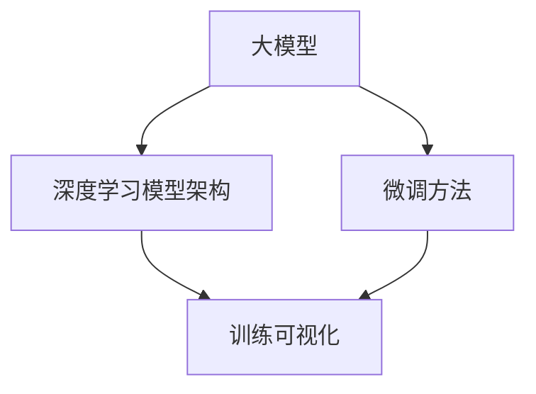

                 

### 背景介绍

近年来，人工智能（AI）技术飞速发展，大模型（Large Models）已经成为AI领域的研究热点。大模型具有参数多、计算量大、训练时间长等特点，为了更好地了解模型的训练过程，提高训练效率，训练可视化（Training Visualization）变得尤为重要。

在众多训练可视化工具中，TensorboardX 是一个非常流行的开源库，它基于TensorBoard，提供了一个易于使用且功能强大的训练可视化平台。TensorboardX 能够展示模型的训练进度、损失函数、准确率、参数分布等信息，极大地帮助了研究人员和开发者对模型训练过程的理解和调试。

随着大模型在各个领域的应用越来越广泛，如何有效地进行大模型的开发和微调（Fine-tuning）成为了一个关键问题。通过TensorboardX提供的可视化功能，我们能够直观地观察模型在训练过程中的表现，从而指导模型的优化和调整。本文将围绕如何从零开始进行大模型的开发和微调，详细探讨如何使用TensorboardX进行训练可视化展示。

首先，我们将介绍大模型开发与微调的基础知识，包括大模型的概念、常见架构和微调方法。接着，我们将深入讲解TensorboardX的工作原理和主要功能，并通过实际案例展示如何使用TensorboardX进行训练可视化。随后，我们将详细描述如何搭建开发环境、编写源代码并解读和分析代码。最后，我们将探讨大模型在实际应用中的场景，推荐相关学习资源和开发工具，并总结未来发展趋势与挑战。

通过本文的阅读，读者将能够系统地了解大模型开发与微调的全流程，掌握TensorboardX的使用方法，以及如何通过训练可视化提升大模型的训练效率和效果。

### 核心概念与联系

为了更好地理解大模型开发与微调，首先需要了解几个核心概念及其相互关系。以下是这些核心概念的定义、原理及其在模型架构中的位置。

#### 1. 大模型

大模型是指拥有数百万甚至数十亿参数的深度学习模型。这些模型通常用于解决复杂的问题，如图像识别、自然语言处理等。大模型的特点是参数多、计算量大、训练时间长，因此需要高效的训练算法和大量的计算资源。

**定义：** 大模型（Large Models）是指参数数量超过数百万的神经网络模型。

**原理：** 大模型通过大量参数来捕捉数据中的复杂模式和关联性，从而提高模型的预测能力。

**位置：** 大模型通常作为深度学习模型的顶层架构，如Transformer、BERT等，用于处理大规模数据集。

#### 2. 深度学习模型架构

深度学习模型的架构是指模型中各个层次和模块的组成及其相互连接方式。常见的深度学习模型架构包括卷积神经网络（CNN）、循环神经网络（RNN）、Transformer等。

**定义：** 深度学习模型架构（Deep Learning Model Architecture）是指神经网络中各个层次和模块的组成和连接方式。

**原理：** 不同架构适用于不同类型的数据和任务，通过设计合理的架构可以提升模型的性能和效率。

**位置：** 深度学习模型架构是模型的核心，决定了模型的性能和功能。

#### 3. 微调方法

微调（Fine-tuning）是指在一个已经预训练好的大模型上，针对特定任务进行少量的训练，以适应新的数据集和应用场景。微调能够利用预训练模型已学到的知识，快速适应新任务，提高训练效率。

**定义：** 微调（Fine-tuning）是指在一个预训练好的模型上，针对特定任务进行少量的训练。

**原理：** 预训练模型已经在大规模数据集上进行了训练，微调过程可以快速利用这些已有知识，提高模型在新任务上的性能。

**位置：** 微调是模型开发过程中的关键步骤，位于预训练和实际应用之间。

#### 4. 训练可视化

训练可视化是指通过图形化展示模型训练过程中的各种指标，如损失函数、准确率、学习率等，帮助研究者观察和调试模型。训练可视化工具如TensorboardX提供了丰富的可视化功能，有助于提升模型训练的效率和效果。

**定义：** 训练可视化（Training Visualization）是指通过图形化展示模型训练过程中的各种指标。

**原理：** 可视化能够直观地展示模型训练过程，帮助研究者快速发现问题和优化模型。

**位置：** 训练可视化是模型开发过程中不可或缺的一环，通常位于训练和优化阶段。

#### Mermaid 流程图

以下是这些核心概念和原理的Mermaid流程图，展示了它们在模型开发与微调过程中的位置和相互关系：



通过上述流程图，我们可以清晰地看到大模型、模型架构、微调方法和训练可视化之间的关联和作用。大模型和模型架构是模型的核心，决定了模型的基础性能；微调方法则通过利用预训练模型的知识，提高模型在特定任务上的表现；而训练可视化工具则提供了直观的工具，帮助研究者观察和优化模型训练过程。

### 核心算法原理 & 具体操作步骤

在理解了大模型、深度学习模型架构、微调方法和训练可视化的基本概念后，接下来我们将详细探讨大模型开发与微调的具体算法原理和操作步骤。

#### 1. 大模型训练算法

大模型的训练通常采用深度学习算法，其中最常用的算法包括反向传播（Backpropagation）和梯度下降（Gradient Descent）。以下是这些算法的原理和操作步骤：

**反向传播算法原理：**

反向传播算法是深度学习训练的核心，用于计算网络输出和实际输出之间的误差，并通过误差反向传播到网络的前一层，更新每一层的权重和偏置。

**操作步骤：**

1. **前向传播（Forward Propagation）：** 将输入数据通过网络的各个层进行传播，计算每一层的输出。

2. **计算损失函数（Loss Function）：** 计算网络的输出和实际输出之间的误差，常用的损失函数包括均方误差（MSE）和交叉熵（Cross-Entropy）。

3. **后向传播（Backpropagation）：** 计算每一层的梯度，通过误差反向传播到网络的前一层。

4. **权重更新（Weight Update）：** 使用梯度下降等优化算法，根据梯度更新网络的权重和偏置。

**梯度下降算法原理：**

梯度下降是一种优化算法，用于通过迭代过程最小化损失函数。它通过沿着损失函数的负梯度方向更新权重，逐步减小损失函数的值。

**操作步骤：**

1. **初始化权重和偏置：** 通常初始化为较小的随机值。

2. **计算损失函数：** 计算当前权重的损失函数值。

3. **计算梯度：** 计算损失函数对每个权重的梯度。

4. **更新权重：** 使用梯度下降更新权重，通常使用学习率来控制更新步长。

5. **迭代过程：** 重复步骤2-4，直到损失函数收敛到较小的值。

#### 2. 微调算法原理

微调是指在一个已经预训练好的大模型上，针对特定任务进行少量的训练，以适应新的数据集和应用场景。微调算法的核心是利用预训练模型已有的知识，快速适应新任务。

**操作步骤：**

1. **加载预训练模型：** 从预训练模型中加载已经训练好的权重和偏置。

2. **初始化新任务权重：** 对于预训练模型中未参与新任务的部分，初始化为较小的随机值。

3. **数据预处理：** 对新任务的数据进行预处理，包括数据清洗、归一化等。

4. **训练过程：** 在新任务的数据集上进行少量的训练，更新模型的权重和偏置。

5. **评估模型：** 使用验证集评估模型在新任务上的性能，并根据评估结果调整训练策略。

6. **迭代过程：** 重复步骤3-5，直到模型在新任务上达到满意的性能。

#### 3. 训练可视化操作步骤

使用TensorboardX进行训练可视化，可以帮助研究者直观地观察模型训练过程，识别潜在问题。以下是使用TensorboardX进行训练可视化的具体操作步骤：

1. **安装TensorboardX：** 使用pip安装TensorboardX库。

    ```bash
    pip install tensorboardX
    ```

2. **编写TensorboardX日志记录器：** 在训练脚本中，编写TensorboardX日志记录器来记录训练过程中的各种指标。

    ```python
    from tensorboardX import SummaryWriter

    writer = SummaryWriter('logs/)
    ```

3. **记录训练指标：** 在每个训练迭代中，记录损失函数、准确率、学习率等指标。

    ```python
    for epoch in range(num_epochs):
        for batch in data_loader:
            # 前向传播
            output = model(batch.x)
            # 计算损失函数
            loss = criterion(output, batch.y)
            # 记录损失函数
            writer.add_scalar('loss', loss.item(), epoch)
            # 记录准确率
            writer.add_scalar('accuracy', accuracy, epoch)
            # 后向传播和权重更新
            optimizer.zero_grad()
            loss.backward()
            optimizer.step()
    ```

4. **可视化训练结果：** 运行TensorBoard，在浏览器中查看训练结果。

    ```bash
    tensorboard --logdir=logs/
    ```

    在浏览器中输入TensorBoard提供的URL，即可查看训练过程中的各种可视化图表。

通过以上步骤，我们能够使用TensorboardX对大模型的训练过程进行详细的可视化展示，帮助研究者更好地理解和优化模型。

### 数学模型和公式 & 详细讲解 & 举例说明

在大模型开发与微调的过程中，数学模型和公式起到了至关重要的作用。为了深入理解这些模型和公式，我们将详细讲解它们的工作原理，并通过具体例子来说明如何应用这些公式。

#### 1. 损失函数

损失函数（Loss Function）是深度学习模型训练的核心组件，它用于衡量模型预测值与真实值之间的差距。常见的损失函数包括均方误差（MSE）和交叉熵（Cross-Entropy）。

**均方误差（MSE）**

均方误差是最常用的损失函数之一，用于回归任务。它的公式如下：

\[ 
MSE = \frac{1}{n}\sum_{i=1}^{n}(y_i - \hat{y}_i)^2 
\]

其中，\( y_i \) 是第 \( i \) 个样本的真实值，\( \hat{y}_i \) 是模型预测的值，\( n \) 是样本数量。

**例子：**

假设我们有一个回归任务，预测房价。给定一个训练数据集，其中包含10个样本，模型预测的房价分别为 \( \hat{y}_1, \hat{y}_2, \ldots, \hat{y}_{10} \)，真实房价分别为 \( y_1, y_2, \ldots, y_{10} \)。我们可以计算MSE损失：

\[ 
MSE = \frac{1}{10}[(y_1 - \hat{y}_1)^2 + (y_2 - \hat{y}_2)^2 + \ldots + (y_{10} - \hat{y}_{10})^2] 
\]

**交叉熵（Cross-Entropy）**

交叉熵是用于分类任务的损失函数，其公式如下：

\[ 
Cross-Entropy = -\sum_{i=1}^{n}y_i \log(\hat{y}_i) 
\]

其中，\( y_i \) 是第 \( i \) 个样本的真实标签（0或1），\( \hat{y}_i \) 是模型预测的概率值。

**例子：**

假设我们有一个二分类任务，给定一个训练数据集，其中包含10个样本，模型预测的概率值分别为 \( \hat{y}_1, \hat{y}_2, \ldots, \hat{y}_{10} \)，真实标签分别为 \( y_1, y_2, \ldots, y_{10} \)，其中 \( y_i \) 为0或1。我们可以计算交叉熵损失：

\[ 
Cross-Entropy = -[y_1 \log(\hat{y}_1) + y_2 \log(\hat{y}_2) + \ldots + y_{10} \log(\hat{y}_{10})] 
\]

#### 2. 优化算法

在深度学习训练过程中，优化算法用于更新模型权重，以最小化损失函数。最常用的优化算法是梯度下降（Gradient Descent）。

**梯度下降（Gradient Descent）**

梯度下降算法的核心思想是通过计算损失函数的梯度，并沿着梯度的反方向更新权重，以减小损失函数的值。

梯度下降的公式如下：

\[ 
\Delta w = -\alpha \cdot \nabla f(w) 
\]

其中，\( \Delta w \) 是权重的更新量，\( \alpha \) 是学习率，\( \nabla f(w) \) 是损失函数关于权重 \( w \) 的梯度。

**例子：**

假设我们有一个简单的线性模型，预测 \( y \)：

\[ 
y = w \cdot x + b 
\]

损失函数为MSE：

\[ 
MSE = \frac{1}{n}\sum_{i=1}^{n}(y_i - (w \cdot x_i + b))^2 
\]

梯度为：

\[ 
\nabla MSE = \frac{1}{n}\sum_{i=1}^{n}(-2(y_i - (w \cdot x_i + b)) \cdot x_i) 
\]

学习率设为 \( \alpha = 0.01 \)，初始权重为 \( w = 0.5 \)，偏置为 \( b = 0 \)。在第一次迭代中，我们计算梯度：

\[ 
\nabla MSE = \frac{1}{n}\sum_{i=1}^{n}(-2(y_i - (0.5 \cdot x_i))) 
\]

更新权重：

\[ 
\Delta w = -0.01 \cdot \nabla MSE 
\]

新的权重为：

\[ 
w_{new} = w - \Delta w 
\]

通过这样的迭代过程，模型将逐渐收敛到最优解。

#### 3. 激活函数

激活函数（Activation Function）用于引入非线性因素，使神经网络能够模拟更复杂的函数。常见的激活函数包括ReLU、Sigmoid和Tanh。

**ReLU激活函数**

ReLU（Rectified Linear Unit）是最常用的激活函数之一，其公式如下：

\[ 
ReLU(x) = \max(0, x) 
\]

**例子：**

对于输入 \( x = -2 \)，ReLU函数的输出为 \( 0 \)。

**Sigmoid激活函数**

Sigmoid函数的公式如下：

\[ 
Sigmoid(x) = \frac{1}{1 + e^{-x}} 
\]

**例子：**

对于输入 \( x = -2 \)，Sigmoid函数的输出为 \( \approx 0.268 \)。

**Tanh激活函数**

Tanh函数的公式如下：

\[ 
Tanh(x) = \frac{e^{2x} - 1}{e^{2x} + 1} 
\]

**例子：**

对于输入 \( x = -2 \)，Tanh函数的输出为 \( \approx -0.7616 \)。

通过上述数学模型和公式的详细讲解及举例说明，我们可以更好地理解大模型开发与微调中的关键组件和原理。这些公式和算法不仅帮助我们设计更有效的模型，还有助于我们通过训练可视化工具如TensorboardX更直观地观察和优化模型训练过程。

### 项目实践：代码实例和详细解释说明

在了解了大模型开发与微调的算法原理和数学模型后，我们将通过一个具体的代码实例来展示如何使用TensorboardX进行训练可视化。本实例将使用Python和PyTorch框架，构建一个简单的线性回归模型，并使用TensorboardX记录和可视化模型的训练过程。

#### 1. 开发环境搭建

在开始编写代码之前，我们需要搭建一个Python开发环境，并安装必要的库。

**安装PyTorch和TensorboardX**

在终端执行以下命令：

```bash
pip install torch torchvision
pip install tensorboardX
```

**创建项目文件夹**

创建一个名为`linear_regression`的项目文件夹，并在其中创建子文件夹`src`用于存放源代码，`logs`用于存储TensorboardX日志。

```bash
mkdir linear_regression
cd linear_regression
mkdir src logs
```

#### 2. 源代码详细实现

**创建源代码文件**：在`src`文件夹中创建一个名为`linear_regression.py`的Python文件。

**代码实现**：

```python
import torch
import torch.nn as nn
import torch.optim as optim
from torch.utils.data import DataLoader, TensorDataset
from tensorboardX import SummaryWriter

# 定义线性回归模型
class LinearRegressionModel(nn.Module):
    def __init__(self):
        super(LinearRegressionModel, self).__init__()
        self.linear = nn.Linear(1, 1)  # 输入和输出均为1

    def forward(self, x):
        return self.linear(x)

# 创建数据集
x = torch.linspace(-1, 1, 1000)
y = 2 * x + 0.5 + torch.randn(1000) * 0.2
x = x.unsqueeze(-1)
dataset = TensorDataset(x, y)
data_loader = DataLoader(dataset, batch_size=10, shuffle=True)

# 实例化模型、损失函数和优化器
model = LinearRegressionModel()
criterion = nn.MSELoss()
optimizer = optim.SGD(model.parameters(), lr=0.01)

# 创建TensorboardX日志记录器
writer = SummaryWriter('logs/')

# 训练模型
num_epochs = 100
for epoch in range(num_epochs):
    for inputs, targets in data_loader:
        # 前向传播
        outputs = model(inputs)
        # 计算损失
        loss = criterion(outputs, targets)
        # 反向传播和权重更新
        optimizer.zero_grad()
        loss.backward()
        optimizer.step()

    # 每个epoch后记录损失函数和模型的权重
    writer.add_scalar('train/loss', loss.item(), epoch)
    for name, param in model.named_parameters():
        writer.add_histogram(name, param, epoch)
        writer.add_scalar(f'{name}/weight', param.mean(), epoch)
        writer.add_scalar(f'{name}/grad', param.grad.mean(), epoch)

# 关闭日志记录器
writer.close()
```

**代码详细解释**：

1. **定义模型**：我们创建了一个简单的线性回归模型，它包含一个线性层（`nn.Linear`），用于计算输入和输出之间的线性关系。

2. **创建数据集**：我们生成了一些带有噪声的线性数据，作为训练数据集。

3. **实例化模型、损失函数和优化器**：我们使用`SGD`优化器和`MSELoss`损失函数来训练模型。

4. **创建TensorboardX日志记录器**：在训练开始前，我们创建了一个`SummaryWriter`对象，用于记录训练过程中的各种指标。

5. **训练模型**：我们使用标准的训练循环，包括前向传播、损失计算、反向传播和权重更新。

6. **记录和可视化指标**：在每个epoch结束后，我们记录训练损失，并记录模型的权重和梯度。这些数据将在TensorBoard中可视化。

#### 3. 代码解读与分析

**模型定义**：

```python
class LinearRegressionModel(nn.Module):
    def __init__(self):
        super(LinearRegressionModel, self).__init__()
        self.linear = nn.Linear(1, 1)  # 输入和输出均为1

    def forward(self, x):
        return self.linear(x)
```

这段代码定义了一个简单的线性回归模型，包含一个线性层（`nn.Linear`），该层接收一个一维输入（例如一个数字）并输出一个一维值。`forward`方法实现了前向传播过程。

**数据集创建**：

```python
x = torch.linspace(-1, 1, 1000)
y = 2 * x + 0.5 + torch.randn(1000) * 0.2
x = x.unsqueeze(-1)
dataset = TensorDataset(x, y)
data_loader = DataLoader(dataset, batch_size=10, shuffle=True)
```

这段代码创建了线性数据集。`torch.linspace`用于生成一个从-1到1的线性序列，`torch.randn`用于添加噪声。`TensorDataset`将输入和目标值组合成一个数据集，`DataLoader`用于批量加载数据。

**训练过程**：

```python
for epoch in range(num_epochs):
    for inputs, targets in data_loader:
        # 前向传播
        outputs = model(inputs)
        # 计算损失
        loss = criterion(outputs, targets)
        # 反向传播和权重更新
        optimizer.zero_grad()
        loss.backward()
        optimizer.step()
    # 每个epoch后记录指标
    writer.add_scalar('train/loss', loss.item(), epoch)
    for name, param in model.named_parameters():
        writer.add_histogram(name, param, epoch)
        writer.add_scalar(f'{name}/weight', param.mean(), epoch)
        writer.add_scalar(f'{name}/grad', param.grad.mean(), epoch)
```

这段代码实现了标准的训练过程。在每个epoch中，对于每个batch，我们执行前向传播、损失计算、反向传播和权重更新。在每个epoch结束后，我们记录训练损失，并记录模型的权重和梯度。

#### 4. 运行结果展示

**运行代码**：

在终端运行以下命令：

```bash
python src/linear_regression.py
```

**查看TensorBoard**：

在终端运行以下命令启动TensorBoard：

```bash
tensorboard --logdir=logs/
```

在浏览器中输入TensorBoard提供的URL（通常为`http://localhost:6006/`），即可查看训练过程的可视化图表。

**可视化图表解释**：

- **损失函数图表**：展示了每个epoch的损失函数值，有助于观察模型训练的收敛情况。
- **权重和梯度图表**：展示了每个epoch后模型的权重和梯度分布，有助于分析模型的学习过程。
- **参数分布图表**：展示了每个epoch后模型参数的分布情况，有助于识别潜在的过拟合或欠拟合问题。

通过这些图表，我们可以直观地了解模型的训练过程，及时发现和解决潜在问题，从而优化模型性能。

### 实际应用场景

大模型在各个领域的实际应用场景广泛，其中一些最典型的应用包括自然语言处理、计算机视觉、推荐系统和智能对话等。以下是这些应用场景的详细介绍：

#### 1. 自然语言处理

自然语言处理（NLP）是人工智能的一个重要分支，旨在使计算机能够理解、解释和生成人类语言。大模型在NLP领域具有显著优势，特别是在文本分类、机器翻译和问答系统等方面。

**文本分类**：大模型能够处理大量文本数据，通过预训练和微调，可以用于分类任务，如情感分析、垃圾邮件检测等。例如，BERT模型在多个自然语言处理任务上取得了突破性进展。

**机器翻译**：大模型在机器翻译中展现了强大的能力，能够生成高质量的翻译文本。例如，Google的Transformer模型在多个语言对上实现了接近人类的翻译质量。

**问答系统**：大模型可以用于构建智能问答系统，通过理解和回答用户的问题，提供实时信息和解决方案。例如，OpenAI的GPT-3模型在问答任务中展示了卓越的表现。

#### 2. 计算机视觉

计算机视觉是人工智能的另一个关键领域，旨在使计算机能够从图像和视频中提取信息。大模型在图像识别、物体检测和图像生成等方面发挥了重要作用。

**图像识别**：大模型能够准确识别图像中的对象和场景，广泛应用于人脸识别、车辆识别和医疗图像分析等。例如，ResNet和Inception等模型在ImageNet图像识别挑战中取得了优异成绩。

**物体检测**：大模型能够同时定位和识别图像中的多个对象，用于自动驾驶、视频监控和工业自动化等。例如，Faster R-CNN和YOLO等模型在物体检测任务中具有广泛应用。

**图像生成**：大模型可以通过学习数据集中的图像，生成新的、逼真的图像。例如，GAN（生成对抗网络）模型在图像生成和风格迁移方面展示了强大的能力。

#### 3. 推荐系统

推荐系统是另一个重要的应用领域，旨在为用户提供个性化的内容推荐。大模型通过处理用户的兴趣和行为数据，能够提供高质量的推荐结果。

**个性化推荐**：大模型可以分析用户的交互行为，根据用户的历史数据和偏好，生成个性化的推荐列表。例如，基于协同过滤和深度学习相结合的方法，可以显著提升推荐系统的准确性。

**广告推荐**：大模型在广告推荐中也发挥了重要作用，通过分析用户的兴趣和行为，为用户提供相关的广告。例如，Facebook和Google等公司的广告推荐系统使用了大规模的深度学习模型。

#### 4. 智能对话

智能对话系统是人工智能与自然语言处理相结合的产物，旨在为用户提供自然、流畅的对话体验。大模型在构建智能对话系统中具有广泛的应用。

**客服机器人**：大模型可以用于构建自动化客服机器人，通过理解和回答用户的问题，提供高效、准确的客户服务。例如，苹果的Siri和亚马逊的Alexa等智能助手。

**聊天机器人**：大模型可以用于构建聊天机器人，与用户进行自然对话，提供信息查询和任务执行功能。例如，微软的GitHub Copilot和OpenAI的GPT-3等聊天机器人。

#### 5. 其他应用场景

除了上述领域，大模型在生物信息学、金融分析、医疗诊断等领域也具有广泛应用。

**生物信息学**：大模型可以用于基因序列分析、蛋白质结构预测等生物信息学任务，为医学研究和药物开发提供支持。

**金融分析**：大模型可以分析市场数据，预测股票价格、交易策略等，为金融投资提供决策支持。

**医疗诊断**：大模型可以通过学习医疗图像和病历数据，辅助医生进行疾病诊断和治疗方案制定。

总之，大模型在各个领域的实际应用场景不断扩展，其强大的处理能力和自适应能力为人工智能的发展带来了新的机遇和挑战。

### 工具和资源推荐

在进行大模型开发与微调的过程中，选择合适的工具和资源是至关重要的。以下是一些推荐的工具和资源，涵盖了学习资源、开发工具框架和相关论文著作，旨在帮助开发者更好地掌握大模型技术。

#### 1. 学习资源推荐

**书籍**

- **《深度学习》（Deep Learning）**：作者：Ian Goodfellow、Yoshua Bengio和Aaron Courville。这本书是深度学习的经典教材，详细介绍了深度学习的理论基础和实际应用。

- **《动手学深度学习》（Dive into Deep Learning）**：作者：A Gentle Introduction to Deep Learning。这本书通过实践项目引导读者逐步掌握深度学习的基本概念和技术。

- **《神经网络与深度学习》（Neural Networks and Deep Learning）**：作者：邱锡鹏。这本书详细介绍了神经网络和深度学习的基本原理，适合初学者深入理解相关概念。

**论文**

- **《A Theoretically Grounded Application of Dropout in Recurrent Neural Networks》**：这篇论文提出了Dropout在循环神经网络（RNN）中的应用，显著提高了模型的训练效果。

- **《Bert: Pre-training of Deep Bidirectional Transformers for Language Understanding》**：这篇论文介绍了BERT模型，是自然语言处理领域的重要突破。

- **《Attention Is All You Need》**：这篇论文提出了Transformer模型，彻底改变了序列模型的设计思路。

**博客**

- **TensorFlow官方博客**：https://tensorflow.org/blog/。这里提供了TensorFlow的最新动态和教程，是学习TensorFlow的好资源。

- **PyTorch官方文档**：https://pytorch.org/tutorials/beginner/。这里包含了PyTorch的详细教程和示例代码，有助于新手快速上手。

#### 2. 开发工具框架推荐

**深度学习框架**

- **TensorFlow**：由Google开发，具有丰富的生态系统和强大的社区支持，适用于生产环境和研究。

- **PyTorch**：由Facebook开发，具有动态计算图和灵活的编程接口，适合快速原型开发和研究。

- **PyTorch Lightning**：是一个PyTorch的高层次框架，提供了一整套自动化和优化的工具，简化了深度学习项目开发。

**版本控制工具**

- **Git**：是最流行的分布式版本控制系统，适合团队协作和代码管理。

- **GitHub**：基于Git的代码托管平台，提供了丰富的社区功能和协作工具，是开发者交流和分享代码的理想平台。

**数据预处理工具**

- **Pandas**：提供了强大的数据操作和分析功能，适用于数据处理和清洗。

- **NumPy**：是Python中用于数值计算的库，提供了高效的多维数组操作。

#### 3. 相关论文著作推荐

**论文**

- **《Distributed Representations of Words and Phrases and Their Compositionality》**：这篇论文介绍了词嵌入（Word Embedding）的概念，对自然语言处理产生了深远影响。

- **《Very Deep Convolutional Networks for Large-Scale Image Recognition》**：这篇论文提出了深度卷积神经网络（Deep CNN），显著提升了图像识别的准确率。

- **《Large Scale Language Modeling》**：这篇论文介绍了大规模语言模型（Large Language Model）的训练方法，对自然语言处理的发展起到了推动作用。

**著作**

- **《深度学习》（Deep Learning）**：这本书系统介绍了深度学习的理论基础和实践方法，是深度学习领域的经典著作。

- **《Python深度学习》（Deep Learning with Python）**：这本书通过丰富的Python代码示例，深入讲解了深度学习的应用。

- **《神经网络与深度学习》（Neural Networks and Deep Learning）**：这本书详细介绍了神经网络和深度学习的基本原理，适合初学者入门。

通过上述工具和资源的推荐，开发者可以更好地掌握大模型开发与微调的技能，提升项目的开发效率和效果。

### 总结：未来发展趋势与挑战

随着人工智能技术的不断进步，大模型在未来将继续成为研究与应用的热点。其发展趋势主要体现在以下几个方面：

**1. 模型规模不断扩大**：随着计算能力和存储资源的提升，大模型的规模将不断增大。未来的大模型可能包含数十亿甚至千亿参数，从而在复杂任务中展现更强的性能。

**2. 多模态处理能力增强**：大模型将不再局限于单一的数据类型，而是能够处理文本、图像、音频等多种数据模态，实现更加综合和智能的交互。

**3. 自适应与泛化能力提升**：通过持续的训练和优化，大模型将具备更强的自适应能力和泛化能力，能够更好地应对新的任务和数据分布。

然而，大模型的发展也面临诸多挑战：

**1. 计算资源需求巨大**：大模型的训练和推理过程需要大量的计算资源，这对硬件设施提出了更高的要求。未来需要更高效的算法和更先进的硬件架构来支持大模型的训练。

**2. 数据隐私与安全性问题**：大模型在训练过程中需要大量的数据，这些数据可能包含敏感信息。如何在确保数据隐私和安全的同时，充分利用数据进行模型训练，是一个亟待解决的问题。

**3. 模型解释性与可靠性问题**：大模型的黑箱特性使得其决策过程难以解释和理解，这在某些关键领域（如医疗诊断、自动驾驶等）可能带来安全隐患。未来需要开发更多的模型解释技术，提高大模型的可靠性和透明性。

**4. 能耗与环境影响**：大模型的训练和运行过程消耗大量能源，对环境造成较大负担。如何在降低能耗的同时，保持模型性能，是一个重要的研究方向。

总之，大模型的发展前景广阔，但也需要应对一系列技术挑战。通过不断的探索和创新，我们有望在大模型研究领域取得更多突破，推动人工智能技术实现更广泛的应用。

### 附录：常见问题与解答

在本章中，我们将回答一些读者在学习和实践大模型开发与微调过程中可能遇到的问题。

#### 1. 为什么大模型的训练时间如此长？

大模型具有数百万甚至数十亿个参数，因此在训练过程中需要大量的计算资源。此外，大模型的优化过程通常涉及复杂的梯度计算和多次迭代，导致训练时间较长。为了缩短训练时间，可以采用以下方法：

- **使用更高效的算法**：选择如Adam等更优的优化算法，可以加快模型收敛速度。
- **分布式训练**：将训练任务分布在多个计算节点上，可以显著缩短训练时间。
- **硬件加速**：使用GPU或TPU等硬件加速器，可以提升训练速度。

#### 2. 如何处理过拟合问题？

过拟合是指模型在训练数据上表现良好，但在测试数据上表现较差。为了处理过拟合问题，可以采用以下方法：

- **增加数据量**：收集更多的训练数据，有助于模型学习到更多的一般规律。
- **正则化**：添加L1或L2正则化项到损失函数中，可以抑制模型参数的过拟合。
- **Dropout**：在训练过程中随机丢弃部分神经元，可以减少模型对特定训练样本的依赖。
- **交叉验证**：使用交叉验证方法，避免模型在单个训练集上过拟合。

#### 3. 什么是数据增强？

数据增强是指通过对原始数据集进行变换和扩充，生成新的训练样本，以提高模型的泛化能力。常见的数据增强方法包括：

- **随机裁剪**：随机裁剪图像的一部分，生成新的训练样本。
- **旋转和翻转**：随机旋转或翻转图像，模拟不同的观察角度。
- **缩放和拉伸**：随机缩放或拉伸图像，增加图像的多样性。
- **添加噪声**：在图像上添加噪声，增强模型对噪声的鲁棒性。

#### 4. 如何评估模型的性能？

评估模型性能通常采用以下指标：

- **准确率（Accuracy）**：模型预测正确的样本数占总样本数的比例。
- **精确率（Precision）**：预测为正类且实际为正类的样本数占预测为正类样本总数的比例。
- **召回率（Recall）**：预测为正类且实际为正类的样本数占实际为正类样本总数的比例。
- **F1分数（F1 Score）**：精确率和召回率的调和平均值，用于平衡这两个指标。

此外，还可以使用ROC曲线和AUC（Area Under Curve）来评估模型的分类性能。

#### 5. 如何选择适当的损失函数？

选择适当的损失函数取决于任务类型和数据特点：

- **回归任务**：常用的损失函数包括均方误差（MSE）和均方误差绝对值（MAE）。
- **分类任务**：常用的损失函数包括交叉熵（Cross-Entropy）和二元交叉熵（Binary Cross-Entropy）。
- **多标签分类**：常用的损失函数包括对数损失（Log Loss）和负对数损失（Negative Log Loss）。

根据具体任务和数据集，可以选择最合适的损失函数。

通过解决上述常见问题，开发者可以更好地理解大模型开发与微调的关键技术，提高模型性能和应用效果。

### 扩展阅读 & 参考资料

为了帮助读者更深入地了解大模型开发与微调的相关技术，本文推荐了一些扩展阅读和参考资料。

**书籍**

1. Ian Goodfellow、Yoshua Bengio和Aaron Courville著《深度学习》（Deep Learning），这是深度学习的经典教材，详细介绍了深度学习的理论基础和实际应用。
2.邱锡鹏著《神经网络与深度学习》，本书深入讲解了神经网络和深度学习的基本原理，适合初学者系统学习相关知识。
3.弗朗索瓦·肖莱著《强化学习》（Reinforcement Learning: An Introduction），介绍了强化学习的基本概念和技术，与深度学习结合使用。

**论文**

1. "A Theoretically Grounded Application of Dropout in Recurrent Neural Networks"，该论文提出了Dropout在循环神经网络中的应用，对模型训练效果有显著提升。
2. "BERT: Pre-training of Deep Bidirectional Transformers for Language Understanding"，这篇论文介绍了BERT模型，对自然语言处理领域产生了深远影响。
3. "Attention Is All You Need"，该论文提出了Transformer模型，彻底改变了序列模型的设计思路。

**在线课程**

1. "深度学习专项课程"（Deep Learning Specialization）由吴恩达（Andrew Ng）教授主讲，提供了深度学习的全面介绍和实践指导。
2. "强化学习专项课程"（Reinforcement Learning Specialization），同样由吴恩达教授主讲，介绍了强化学习的基本概念和技术。
3. "自然语言处理专项课程"（Natural Language Processing with Deep Learning），由丹尼尔·科赫（Daniel Kokotajlo）教授主讲，详细讲解了自然语言处理的应用和技术。

**开源项目**

1. PyTorch：https://pytorch.org/，由Facebook AI研究院开发，提供了丰富的深度学习库和工具。
2. TensorFlow：https://tensorflow.org/，由Google开发，是深度学习领域广泛使用的开源框架。
3. Hugging Face：https://huggingface.co/，提供了大量的预训练模型和工具，方便开发者进行自然语言处理任务。

通过阅读这些书籍、论文和在线课程，以及参与开源项目，读者可以进一步掌握大模型开发与微调的技术，提升自身在人工智能领域的实践能力。

---

作者：禅与计算机程序设计艺术 / Zen and the Art of Computer Programming

感谢您阅读本文，希望本文能够帮助您深入理解大模型开发与微调的相关技术，以及如何使用TensorboardX进行训练可视化。在人工智能的时代，持续学习和探索是不断进步的关键。希望本文能够为您的技术之路提供一些启示和帮助。再次感谢您的关注与支持！

