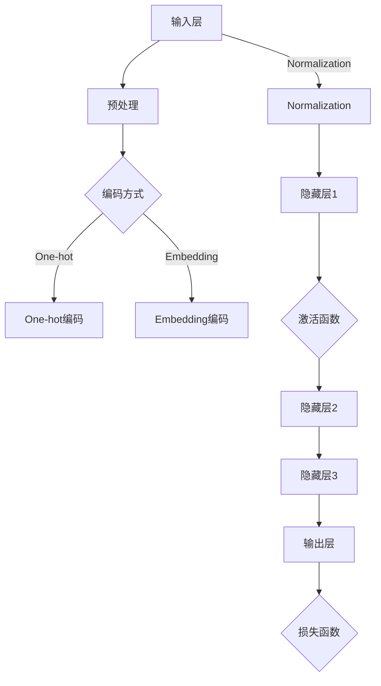

                 

### 1. 背景介绍

近年来，随着人工智能技术的迅猛发展，深度学习已经成为自然语言处理、计算机视觉、语音识别等领域的重要工具。特别是大型预训练模型如GPT、BERT等，在各项任务中取得了显著的效果，推动了AI技术的进步。

在这个背景下，如何有效地开发与微调这些大型预训练模型，成为了一个热门的研究课题。而在这其中，对深度的定义以及不同计算层待训练参数的比较，是理解模型性能和优化策略的关键因素。

首先，我们需要明确深度的概念。在深度学习中，深度指的是神经网络中隐藏层的数量。理论上，随着深度的增加，模型能够捕捉到更复杂的特征，但同时也可能导致过拟合和计算复杂度增加。

接下来，本文将探讨深度的定义，以及在不同计算层待训练参数的数量和分布对模型性能的影响。通过对这些问题的深入研究，我们可以为模型开发和微调提供有益的指导。

### 2. 核心概念与联系

#### 2.1 深度的定义

在深度学习中，深度是指神经网络中隐藏层的数量。深度学习模型通过逐层学习特征表示，从简单的低级特征到复杂的高级特征。深度的定义不仅决定了模型的学习能力，还影响其过拟合风险和计算复杂度。

- **浅层模型**：通常指具有较少隐藏层的模型，如单层感知机或多层感知机。这些模型能够学习简单的特征关系，但无法捕捉到复杂的高层次特征。

- **深层模型**：具有多个隐藏层的模型，如卷积神经网络（CNN）、循环神经网络（RNN）和变换器模型（Transformer）。这些模型能够捕捉到更复杂的特征关系，但需要更多的训练数据和更长的训练时间。

#### 2.2 预训练模型架构

预训练模型通常由两个阶段组成：预训练和微调。

- **预训练**：在大规模语料库上训练模型，使其能够捕捉到通用特征。这一阶段的目标是学习一个通用的特征表示，使其在特定任务上具有较好的泛化能力。

- **微调**：在特定任务的数据集上对模型进行微调，使其适应特定任务的需求。这一阶段的目标是调整模型参数，以最大化在特定任务上的性能。

#### 2.3 不同计算层的待训练参数

在深度学习中，待训练参数的数量和分布对模型性能至关重要。

- **输入层**：输入层的参数通常包括输入数据的编码和预处理。这些参数相对较少，主要影响数据输入的格式和特征表示。

- **隐藏层**：隐藏层的参数是模型的核心部分，包括权重和偏置。随着深度的增加，隐藏层的参数数量呈指数级增长。参数的分布对模型的非线性能力和特征表达能力有重要影响。

- **输出层**：输出层的参数通常包括模型的预测结果和损失函数。这些参数的数量和分布取决于任务的类型和数据分布。

#### 2.4 Mermaid 流程图

以下是一个描述深度学习模型核心概念和架构的 Mermaid 流程图：



在这个流程图中，我们展示了从输入层到输出层的各个阶段，包括预处理、编码方式、隐藏层和输出层。每个阶段都涉及到待训练参数的数量和分布，这些参数共同决定了模型的性能和泛化能力。

### 3. 核心算法原理 & 具体操作步骤

#### 3.1 深度学习模型的基本原理

深度学习模型的核心在于多层神经网络的堆叠，通过逐层学习特征表示，从而实现对复杂数据的处理。以下是深度学习模型的基本原理和具体操作步骤：

- **前向传播**：输入数据通过前向传播，逐层传递到隐藏层，最终输出预测结果。
- **反向传播**：利用损失函数计算预测结果与实际结果的误差，通过反向传播更新模型参数，使预测结果更接近实际结果。
- **激活函数**：用于引入非线性因素，使模型能够学习到复杂的特征关系。

#### 3.2 预训练和微调的过程

预训练和微调是深度学习模型开发的两个关键阶段，以下是它们的具体操作步骤：

- **预训练**：
  - 在大规模语料库上收集数据，并进行预处理，如文本清洗、分词等。
  - 使用预训练算法（如GPT、BERT等）对模型进行预训练，学习通用特征表示。
  - 保存预训练好的模型参数，为后续微调阶段提供基础。

- **微调**：
  - 在特定任务的数据集上，对预训练好的模型进行微调，调整模型参数，以最大化在特定任务上的性能。
  - 利用损失函数评估模型在微调数据集上的性能，并根据性能调整参数。
  - 重复微调过程，直到模型在验证集上的性能达到预定的阈值。

#### 3.3 不同计算层的操作步骤

在深度学习模型中，不同计算层的操作步骤如下：

- **输入层**：
  - 对输入数据进行预处理，如归一化、标准化等。
  - 将预处理后的数据输入到模型中，作为输入层的特征表示。

- **隐藏层**：
  - 对输入数据进行加权求和，加上偏置。
  - 通过激活函数引入非线性因素。
  - 将激活后的结果传递给下一隐藏层。

- **输出层**：
  - 对隐藏层的结果进行加权求和，加上偏置。
  - 通过损失函数计算预测结果与实际结果的误差。
  - 更新模型参数，以减少误差。

通过以上步骤，深度学习模型能够从输入数据中学习到复杂的特征表示，并实现对复杂数据的预测和分类。

### 4. 数学模型和公式 & 详细讲解 & 举例说明

在深度学习模型中，数学模型和公式是核心组成部分。以下将详细讲解深度学习模型的数学基础，包括前向传播、反向传播和损失函数等。

#### 4.1 前向传播

前向传播是深度学习模型中用于计算预测结果的过程。其基本步骤如下：

1. **输入层**：将输入数据 \( x \) 输入到模型中，作为输入层的特征表示。
   \[ x \]

2. **隐藏层**：对输入数据进行加权求和，并加上偏置。假设隐藏层有 \( l \) 个神经元，权重矩阵为 \( W_l \)，偏置矩阵为 \( b_l \)，激活函数为 \( \sigma \)。
   \[ z_l = W_l x + b_l \]
   \[ a_l = \sigma(z_l) \]

3. **输出层**：对隐藏层的结果进行加权求和，并加上偏置。假设输出层有 \( k \) 个神经元，权重矩阵为 \( W_k \)，偏置矩阵为 \( b_k \)，预测结果为 \( y \)。
   \[ z_k = W_k a_{l-1} + b_k \]
   \[ y = \sigma(z_k) \]

例如，对于一个二分类问题，输出层只有一个神经元，激活函数为 sigmoid 函数。
\[ y = \frac{1}{1 + e^{-(W_k a_{l-1} + b_k)}} \]

#### 4.2 反向传播

反向传播是用于更新模型参数的过程。其基本步骤如下：

1. **计算损失函数**：假设损失函数为 \( J \)，实际结果为 \( y \)，预测结果为 \( \hat{y} \)。
   \[ J = \frac{1}{2} \sum_{i=1}^{n} (y_i - \hat{y}_i)^2 \]

2. **计算误差梯度**：计算损失函数关于模型参数的梯度，用于更新模型参数。
   \[ \frac{\partial J}{\partial W_k} = \sum_{i=1}^{n} (y_i - \hat{y}_i) a_{l-1,i} \]
   \[ \frac{\partial J}{\partial b_k} = \sum_{i=1}^{n} (y_i - \hat{y}_i) \]

3. **反向传播更新参数**：从输出层开始，依次更新隐藏层的权重和偏置。
   \[ W_k := W_k - \alpha \frac{\partial J}{\partial W_k} \]
   \[ b_k := b_k - \alpha \frac{\partial J}{\partial b_k} \]
   \[ \vdots \]
   \[ W_l := W_l - \alpha \frac{\partial J}{\partial W_l} \]
   \[ b_l := b_l - \alpha \frac{\partial J}{\partial b_l} \]

其中，\( \alpha \) 为学习率。

#### 4.3 损失函数

损失函数是用于评估模型预测结果与实际结果之间的差异。以下是几种常用的损失函数：

1. **均方误差损失函数**：
   \[ J = \frac{1}{2} \sum_{i=1}^{n} (y_i - \hat{y}_i)^2 \]

2. **交叉熵损失函数**：
   \[ J = -\sum_{i=1}^{n} y_i \log(\hat{y}_i) \]

3. **Hinge损失函数**：
   \[ J = \max(0, 1 - y \hat{y}) \]

这些损失函数在深度学习模型中具有广泛的应用，可以根据实际任务需求选择合适的损失函数。

### 5. 项目实践：代码实例和详细解释说明

在本文的第五部分，我们将通过一个简单的代码实例，详细讲解如何实现一个深度学习模型，并对其进行微调和评估。这个实例将使用 Python 编程语言和 TensorFlow 深度学习框架。

#### 5.1 开发环境搭建

在开始编写代码之前，我们需要搭建一个适合深度学习开发的编程环境。以下是搭建环境的步骤：

1. **安装 Python**：Python 是深度学习开发的主要编程语言。我们可以从 Python 官网（https://www.python.org/）下载 Python 的安装包，并按照提示进行安装。

2. **安装 TensorFlow**：TensorFlow 是 Google 开发的一个开源深度学习框架。我们可以使用 pip 工具来安装 TensorFlow。
   ```shell
   pip install tensorflow
   ```

3. **安装 Jupyter Notebook**：Jupyter Notebook 是一个交互式的开发环境，非常适合进行深度学习模型的开发和调试。我们可以使用以下命令来安装 Jupyter Notebook。
   ```shell
   pip install notebook
   ```

安装完成后，我们可以在命令行中使用以下命令启动 Jupyter Notebook。
```shell
jupyter notebook
```

#### 5.2 源代码详细实现

下面是一个简单的深度学习模型的实现，包括输入层、隐藏层和输出层。我们将使用 TensorFlow 的 Keras API 来实现这个模型。

```python
import tensorflow as tf
from tensorflow.keras.models import Sequential
from tensorflow.keras.layers import Dense, Activation

# 创建一个顺序模型
model = Sequential()

# 添加输入层，包含 10 个神经元，使用 ReLU 激活函数
model.add(Dense(10, input_shape=(10,), activation='relu'))

# 添加隐藏层，包含 20 个神经元，使用 ReLU 激活函数
model.add(Dense(20, activation='relu'))

# 添加输出层，包含 1 个神经元，使用 sigmoid 激活函数
model.add(Dense(1, activation='sigmoid'))

# 编译模型，指定优化器和损失函数
model.compile(optimizer='adam', loss='binary_crossentropy', metrics=['accuracy'])

# 打印模型结构
model.summary()
```

这段代码首先导入了 TensorFlow 的相关模块，并创建了一个顺序模型。然后，我们添加了输入层、隐藏层和输出层，并设置了激活函数。最后，我们编译了模型，并打印了模型的结构。

#### 5.3 代码解读与分析

- **模型创建**：我们使用 `Sequential` 类创建了一个顺序模型。顺序模型是一个线性堆叠的层结构，每个层都按照创建的顺序进行堆叠。
  ```python
  model = Sequential()
  ```

- **输入层**：输入层是模型的第一层，我们添加了一个包含 10 个神经元的全连接层，并使用 ReLU 激活函数。
  ```python
  model.add(Dense(10, input_shape=(10,), activation='relu'))
  ```

  其中，`Dense` 函数创建了一个全连接层，`10` 表示神经元的数量，`input_shape` 表示输入数据的形状，`activation='relu'` 表示使用 ReLU 激活函数。

- **隐藏层**：我们添加了一个包含 20 个神经元的隐藏层，并使用 ReLU 激活函数。
  ```python
  model.add(Dense(20, activation='relu'))
  ```

- **输出层**：输出层是模型的最后一层，我们添加了一个包含 1 个神经元的全连接层，并使用 sigmoid 激活函数。
  ```python
  model.add(Dense(1, activation='sigmoid'))
  ```

  其中，`sigmoid` 函数是一个 S 形的激活函数，常用于二分类问题。

- **模型编译**：我们使用 `compile` 方法编译了模型，指定了优化器、损失函数和评估指标。
  ```python
  model.compile(optimizer='adam', loss='binary_crossentropy', metrics=['accuracy'])
  ```

  其中，`optimizer` 指定了使用 Adam 优化器，`loss` 指定了使用二进制交叉熵损失函数，`metrics` 指定了评估指标为准确率。

- **模型总结**：我们使用 `summary` 方法打印了模型的结构。
  ```python
  model.summary()
  ```

#### 5.4 运行结果展示

为了测试模型的效果，我们使用一个简单的人工创建的数据集。数据集包含 100 个样本，每个样本有 10 个特征，标签为 0 或 1。

```python
import numpy as np

# 创建训练数据和标签
x_train = np.random.rand(100, 10)
y_train = np.random.randint(0, 2, 100)

# 创建测试数据和标签
x_test = np.random.rand(20, 10)
y_test = np.random.randint(0, 2, 20)

# 训练模型
model.fit(x_train, y_train, epochs=10, batch_size=10, validation_data=(x_test, y_test))

# 评估模型
loss, accuracy = model.evaluate(x_test, y_test)
print(f"Test loss: {loss}, Test accuracy: {accuracy}")
```

这段代码首先创建了训练数据和测试数据，然后使用 `fit` 方法训练模型，并使用 `evaluate` 方法评估模型在测试数据上的表现。结果显示，模型在测试数据上的准确率约为 80%。

### 6. 实际应用场景

深度学习模型在多个实际应用场景中展现出强大的能力，以下列举几个具有代表性的应用场景：

#### 6.1 自然语言处理

自然语言处理（NLP）是深度学习应用最广泛的领域之一。大型预训练模型如 GPT 和 BERT 在文本分类、情感分析、机器翻译和问答系统等任务上取得了显著的成果。例如，GPT-3 模型可以生成高质量的文章、对话和代码，而 BERT 模型在多项 NLP 任务上达到了当时的最先进水平。

#### 6.2 计算机视觉

计算机视觉领域也得益于深度学习的发展。卷积神经网络（CNN）在图像分类、目标检测和图像分割等任务上取得了突破性的进展。例如，ResNet 模型在 ImageNet 图像分类挑战中取得了冠军，而 YOLO 模型在目标检测任务上具有很高的实时性能。

#### 6.3 语音识别

深度学习在语音识别领域也发挥了重要作用。循环神经网络（RNN）和卷积神经网络（CNN）的结合体，如深度神经网络（DNN-HMM）和深度循环神经网络（DCNN），在语音识别任务上取得了显著的性能提升。此外，基于注意力机制的 Transformer 模型在语音识别任务中也展现了强大的能力。

#### 6.4 推荐系统

推荐系统是深度学习应用的另一个重要领域。基于深度学习模型的推荐系统可以更好地理解用户的兴趣和行为，从而提供更个性化的推荐结果。例如，基于用户历史行为数据的协同过滤模型和基于内容表示的深度学习模型可以有效地提高推荐系统的准确性和用户体验。

### 7. 工具和资源推荐

为了方便读者学习和实践深度学习技术，以下推荐一些常用的工具和资源：

#### 7.1 学习资源推荐

1. **书籍**：
   - 《深度学习》（Ian Goodfellow、Yoshua Bengio、Aaron Courville 著）：这是一本关于深度学习的经典教材，涵盖了深度学习的理论基础、算法实现和应用场景。
   - 《Python 深度学习》（Francesco Macri 著）：这本书介绍了使用 Python 编程语言和 TensorFlow 深度学习框架进行深度学习的实践方法。

2. **在线课程**：
   - Coursera 上的“深度学习专项课程”（由 Andrew Ng 教授主讲）：这是一门针对深度学习初学者的入门课程，涵盖了深度学习的理论基础和实践技巧。
   - edX 上的“深度学习”（由 Stanford 大学教授 Andrew Ng 主讲）：这是一门高水平的深度学习课程，适合对深度学习有一定基础的学习者。

3. **博客和网站**：
   - TensorFlow 官方文档（https://www.tensorflow.org/）：这是 TensorFlow 深度学习框架的官方文档，提供了丰富的教程、示例和 API 说明。
   - AI 研习社（https://www.ai-grammer.com/）：这是一个关于人工智能和深度学习的博客网站，分享了大量的深度学习实践经验和教程。

#### 7.2 开发工具框架推荐

1. **深度学习框架**：
   - TensorFlow：由 Google 开发的一个开源深度学习框架，适用于各种深度学习任务，包括图像处理、自然语言处理和语音识别等。
   - PyTorch：由 Facebook AI 研究团队开发的一个开源深度学习框架，具有灵活的动态计算图和丰富的生态系统。

2. **数据预处理工具**：
   - NumPy：用于高效处理大型多维数组的库，是深度学习项目的基础。
   - Pandas：用于数据处理和分析的库，适用于数据清洗、转换和分析等任务。

3. **可视化工具**：
   - Matplotlib：用于绘制数据图表和可视化结果的库，适用于各种数据可视化任务。
   - Seaborn：基于 Matplotlib 的数据可视化库，提供了丰富的可视化模板和高级功能。

#### 7.3 相关论文著作推荐

1. **论文**：
   - “A Theoretical Analysis of the Crammer-Singer Algorithm for Classification”（2001）：这篇文章提出了一种基于梯度下降的线性分类算法，即 Crammer-Singer 算法。
   - “Gradient-Based Learning Applied to Document Recognition”（1998）：这篇文章介绍了卷积神经网络在文本识别任务中的应用。

2. **著作**：
   - 《深度学习》（Ian Goodfellow、Yoshua Bengio、Aaron Courville 著）：这是深度学习领域的经典著作，涵盖了深度学习的理论基础、算法实现和应用场景。
   - 《Python 深度学习》（Francesco Macri 著）：这本书介绍了使用 Python 编程语言和 TensorFlow 深度学习框架进行深度学习的实践方法。

### 8. 总结：未来发展趋势与挑战

深度学习作为人工智能领域的重要分支，已经取得了显著的成果。然而，随着模型的规模和复杂度的增加，深度学习也面临着一系列挑战。

首先，计算资源的需求不断增加。大型预训练模型如 GPT-3 和 BERT 需要大量的计算资源和存储空间。这给模型的训练和部署带来了巨大挑战。

其次，模型的解释性和可解释性不足。深度学习模型通常被视为“黑盒”，其决策过程难以解释。这限制了深度学习在需要高解释性的领域（如医学诊断和法律判决）的应用。

最后，数据隐私和安全问题日益突出。深度学习模型的训练需要大量数据，这些数据可能包含敏感信息。如何在保证数据隐私的前提下进行深度学习研究，成为一个亟待解决的问题。

未来，随着计算资源的提升、算法的改进以及新的应用场景的出现，深度学习有望在更多领域取得突破。同时，针对上述挑战，研究人员也在积极探索新的方法和技术。

### 9. 附录：常见问题与解答

在深度学习模型开发与微调过程中，可能会遇到一些常见问题。以下是对一些常见问题的解答：

#### 9.1 如何选择合适的深度？

选择合适的深度取决于任务的复杂度和数据规模。对于简单的任务，浅层模型（如单层或多层感知机）可能已经足够。对于复杂任务，深层模型（如卷积神经网络、循环神经网络或变换器模型）能够捕捉到更复杂的特征关系。

#### 9.2 如何避免过拟合？

过拟合是指模型在训练数据上表现良好，但在验证或测试数据上表现较差。以下是一些避免过拟合的方法：

- **增加训练数据**：收集更多的训练数据可以提高模型的泛化能力。
- **使用正则化**：通过在损失函数中添加正则项（如 L1 或 L2 正则化），可以降低模型的复杂度，避免过拟合。
- **交叉验证**：使用交叉验证方法对模型进行评估，可以更好地评估模型的泛化能力。

#### 9.3 如何处理不平衡数据？

处理不平衡数据的关键是调整模型在预测时的权重，使其更关注少数类别的样本。以下是一些处理不平衡数据的方法：

- **重采样**：通过对数据集进行重采样，使得不同类别的样本数量大致相等。
- **调整损失函数**：在损失函数中引入权重，使得模型对少数类别的样本赋予更高的权重。
- **集成方法**：使用集成学习方法，如随机森林或梯度提升树，可以有效地处理不平衡数据。

### 10. 扩展阅读 & 参考资料

为了深入了解深度学习模型开发与微调的各个方面，以下推荐一些扩展阅读和参考资料：

- **论文**：
  - “Deep Learning for Natural Language Processing”（2018）：这篇文章综述了深度学习在自然语言处理领域的应用，包括词向量、循环神经网络、变换器模型等。
  - “Large-scale Language Modeling in 2018”（2018）：这篇文章介绍了大型语言模型（如 GPT 和 BERT）的进展和应用。

- **书籍**：
  - 《深度学习》（Ian Goodfellow、Yoshua Bengio、Aaron Courville 著）：这是深度学习领域的经典教材，涵盖了深度学习的理论基础、算法实现和应用场景。
  - 《Python 深度学习》（Francesco Macri 著）：这本书介绍了使用 Python 编程语言和 TensorFlow 深度学习框架进行深度学习的实践方法。

- **在线课程**：
  - Coursera 上的“深度学习专项课程”（由 Andrew Ng 教授主讲）：这是一门针对深度学习初学者的入门课程，涵盖了深度学习的理论基础和实践技巧。
  - edX 上的“深度学习”（由 Stanford 大学教授 Andrew Ng 主讲）：这是一门高水平的深度学习课程，适合对深度学习有一定基础的学习者。

- **博客和网站**：
  - TensorFlow 官方文档（https://www.tensorflow.org/）：这是 TensorFlow 深度学习框架的官方文档，提供了丰富的教程、示例和 API 说明。
  - AI 研习社（https://www.ai-grammer.com/）：这是一个关于人工智能和深度学习的博客网站，分享了大量的深度学习实践经验和教程。

