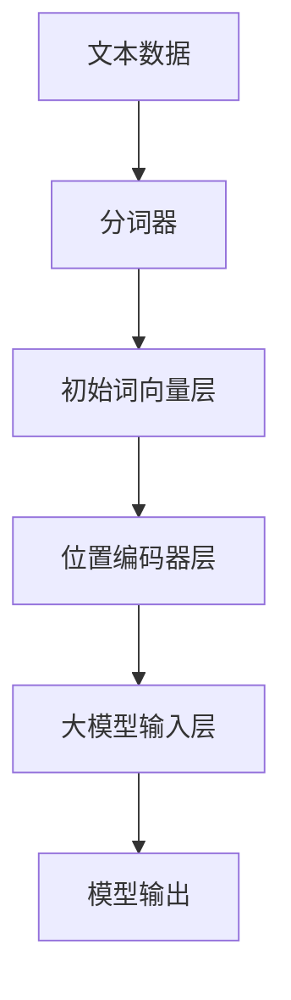

                 

### 1. 背景介绍

在深度学习领域，大模型（如大型语言模型、图像识别模型等）的开发和微调已经成为当前研究的热点。大模型的性能在很大程度上依赖于其输入层的处理方式，而初始词向量层和位置编码器层正是输入层的重要组成部分。

#### 大模型的性能瓶颈

随着数据集规模和数据维度的增加，大模型的训练和推理时间显著增加。为此，研究人员提出了各种优化方法，如模型剪枝、量化、蒸馏等，以提高大模型的计算效率和性能。然而，这些方法主要集中在模型结构优化上，对于输入层的处理关注较少。

#### 输入层的重要性

输入层作为大模型与外部数据进行交互的桥梁，其处理方式直接影响到模型的性能。尤其是对于语言模型和图像识别模型，输入层的质量决定了模型对输入数据的理解和处理能力。

#### 初始词向量层和位置编码器层的必要性

初始词向量层（Word Embedding Layer）是将输入的文本数据转换为数值向量的过程，这一过程对于语言模型尤为重要。而位置编码器层（Positional Encoding Layer）则是为序列数据中的每个单词赋予位置信息，从而帮助模型理解和处理序列中的词语顺序。

#### 本文的目标

本文旨在详细探讨大模型开发与微调中的输入层，特别是初始词向量层和位置编码器层的构建方法。通过逐步分析这两个层次的设计原理、数学模型和具体实现，希望能够为研究人员和开发者提供有价值的参考。

### 2. 核心概念与联系

在深入探讨输入层的构造之前，我们需要先了解两个核心概念：初始词向量层和位置编码器层，以及它们在大模型中的作用和相互关系。

#### 2.1 初始词向量层

初始词向量层的主要任务是将文本数据中的单词映射为固定长度的数值向量。这些向量通常被称为词向量（Word Vectors），它们能够捕捉单词的语义信息。词向量层的构建方法主要包括以下几种：

1. **基于统计的方法**：如Word2Vec、GloVe等，通过计算单词之间的相似性来生成词向量。
2. **基于神经网络的模型**：如FastText、BERT等，通过训练大规模文本数据来学习词向量。

#### 2.2 位置编码器层

位置编码器层的主要任务是给序列中的每个单词赋予位置信息。在处理文本数据时，位置信息对于理解句子的结构和含义至关重要。位置编码器通常采用以下方法：

1. **绝对位置编码**：直接将单词的位置信息编码到词向量中。
2. **相对位置编码**：通过计算单词之间的相对位置来生成位置编码。

#### 2.3 初始词向量层和位置编码器层的关系

初始词向量层和位置编码器层共同构成了输入层的核心。两者之间的关系如下：

- **协同作用**：初始词向量层负责捕捉单词的语义信息，而位置编码器层负责处理单词在序列中的位置关系。两者结合，使得模型能够更好地理解和处理输入数据。
- **相互影响**：位置编码器的输出可以影响词向量的表示方式，从而优化模型对序列数据的理解。

#### 2.4 Mermaid 流程图

下面是一个简单的 Mermaid 流程图，用于描述初始词向量层和位置编码器层的设计原理和相互关系。



### 3. 核心算法原理 & 具体操作步骤

在本节中，我们将详细探讨初始词向量层和位置编码器层的核心算法原理，以及它们的实现步骤。

#### 3.1 初始词向量层

##### 3.1.1 Word2Vec 算法

Word2Vec 是一种基于神经网络的语言模型，其核心思想是将单词映射为向量。Word2Vec 主要包括两种算法：CBOW（连续词袋模型）和 Skip-Gram。

1. **CBOW**：CBOW 通过预测中心词周围的上下文词来生成词向量。具体步骤如下：
   - 随机选择一个中心词。
   - 构建一个包含中心词及其上下文词的词汇表。
   - 通过神经网络对词汇表中的词进行编码，得到中心词的词向量。

2. **Skip-Gram**：Skip-Gram 通过预测中心词来生成词向量。具体步骤如下：
   - 随机选择一个中心词。
   - 构建一个包含中心词及其随机跳过几个词后的词汇表。
   - 通过神经网络对词汇表中的词进行编码，得到中心词的词向量。

##### 3.1.2 GloVe 算法

GloVe（Global Vectors for Word Representation）是一种基于全局共现信息的词向量生成方法。GloVe 主要通过计算单词之间的共现矩阵来学习词向量。具体步骤如下：

1. 计算单词之间的共现矩阵。
2. 使用矩阵分解方法，如奇异值分解（SVD），将共现矩阵分解为词向量和权重的乘积。
3. 对分解后的词向量和权重进行归一化，得到最终的词向量。

#### 3.2 位置编码器层

##### 3.2.1 绝对位置编码

绝对位置编码直接将单词的位置信息编码到词向量中。具体步骤如下：

1. 初始化一个固定长度的词向量。
2. 将位置信息（如单词在序列中的索引）编码到词向量的一部分。
3. 将编码后的词向量与原始词向量相加，得到最终的词向量。

##### 3.2.2 相对位置编码

相对位置编码通过计算单词之间的相对位置来生成位置编码。具体步骤如下：

1. 使用注意力机制或卷积神经网络（CNN）等模型计算单词之间的相对位置。
2. 将相对位置信息编码为向量。
3. 将编码后的位置向量与词向量相乘或相加，得到最终的词向量。

#### 3.3 实现步骤

以下是一个简化的实现步骤，用于构建包含初始词向量层和位置编码器层的大模型输入层。

1. **数据预处理**：
   - 读取文本数据。
   - 使用分词器对文本进行分词。
   - 将分词结果转换为词索引。

2. **初始化词向量**：
   - 根据选择的词向量生成方法（如 Word2Vec 或 GloVe）初始化词向量。
   - 将词向量存储在词向量表中。

3. **构建输入层**：
   - 使用词向量表将词索引映射为词向量。
   - 根据选择的位置编码器方法（如绝对位置编码或相对位置编码）生成位置编码。
   - 将词向量和位置编码相加或相乘，得到最终的输入向量。

4. **构建大模型**：
   - 使用输入向量构建神经网络模型。
   - 通过训练优化模型参数。
   - 使用训练好的模型进行预测。

### 4. 数学模型和公式 & 详细讲解 & 举例说明

在上一节中，我们介绍了初始词向量层和位置编码器层的设计原理和实现步骤。在本节中，我们将进一步探讨这些层的数学模型和公式，并通过具体例子进行说明。

#### 4.1 初始词向量层的数学模型

##### 4.1.1 Word2Vec

Word2Vec 的核心在于词向量的生成，其数学模型主要包括以下两部分：

1. **损失函数**：

   $$L(\theta) = \sum_{i=1}^{N} - \sum_{j \in C_i} log(p_j(\theta))$$

   其中，\(L(\theta)\) 表示损失函数，\(\theta\) 表示模型参数，\(N\) 表示训练样本数量，\(C_i\) 表示第 \(i\) 个样本的中心词的上下文词集合，\(p_j(\theta)\) 表示模型对于上下文词 \(j\) 的预测概率。

2. **神经网络**：

   Word2Vec 使用神经网络对输入的词向量进行编码。其基本结构如下：

   $$\text{Embedding Layer}: x \rightarrow \text{ReLu}(W_1x)$$

   $$\text{Output Layer}: \text{ReLu}(W_2\text{ReLu}(W_1x)) \rightarrow y$$

   其中，\(x\) 表示输入的词向量，\(W_1\) 和 \(W_2\) 分别表示第一层和第二层的权重矩阵，\(\text{ReLu}\) 表示ReLU激活函数。

##### 4.1.2 GloVe

GloVe 的数学模型主要包括以下两部分：

1. **共现矩阵**：

   $$C(w_i, w_j) = \frac{f(w_i) \cdot f(w_j)}{1 + f(w_i) \cdot f(w_j) + \sqrt{f(w_i) \cdot f(w_j)} + \frac{1}{f(w_i) \cdot f(w_j)}}$$

   其中，\(C(w_i, w_j)\) 表示单词 \(w_i\) 和 \(w_j\) 的共现矩阵元素，\(f(w_i)\) 和 \(f(w_j)\) 分别表示单词 \(w_i\) 和 \(w_j\) 的共现频次。

2. **矩阵分解**：

   $$W = UV^T$$

   其中，\(W\) 表示单词的词向量矩阵，\(U\) 和 \(V\) 分别表示权重矩阵和共现矩阵的分解结果。

#### 4.2 位置编码器层的数学模型

##### 4.2.1 绝对位置编码

绝对位置编码的数学模型相对简单，主要涉及向量的加法操作：

$$\text{Positional Vector} = \text{Word Vector} + \text{Positional Encoding}$$

其中，\(\text{Positional Vector}\) 表示最终的词向量，\(\text{Word Vector}\) 表示原始词向量，\(\text{Positional Encoding}\) 表示位置编码向量。

##### 4.2.2 相对位置编码

相对位置编码的数学模型相对复杂，主要涉及注意力机制的计算：

$$\text{Relative Positional Encoding} = \text{Attention(Q, K, V)}$$

其中，\(Q\)、\(K\) 和 \(V\) 分别表示输入向量、关键向量和解码向量，\(\text{Attention}\) 表示注意力机制的计算过程。

#### 4.3 具体例子说明

##### 4.3.1 Word2Vec 示例

假设我们有以下三个单词：`cat`、`dog` 和 `mouse`，以及它们的词向量分别为：

| 单词   | 词向量          |
|--------|----------------|
| cat    | [1, 0, -1]     |
| dog    | [0, 1, 0]      |
| mouse  | [-1, -1, 1]    |

使用 CBOW 算法预测中心词 `cat` 的上下文词。假设上下文词为 `dog` 和 `mouse`，则损失函数的计算如下：

$$L(\theta) = -log(p_{dog}(\theta)) - log(p_{mouse}(\theta))$$

其中，\(p_{dog}(\theta)\) 和 \(p_{mouse}(\theta)\) 分别表示模型对于 `dog` 和 `mouse` 的预测概率。

##### 4.3.2 GloVe 示例

假设我们有以下两个单词：`cat` 和 `mouse`，以及它们的共现频次矩阵如下：

| 单词   | 共现频次矩阵        |
|--------|-------------------|
| cat    | [1, 2, 3]         |
| mouse  | [4, 5, 6]         |

使用 GloVe 算法计算这两个单词的词向量。首先计算共现矩阵的分解结果：

$$U = \begin{bmatrix} 1 & 2 & 3 \\ 4 & 5 & 6 \end{bmatrix} \rightarrow \begin{bmatrix} 1 & 2 \\ 4 & 5 \\ 6 & 7 \end{bmatrix}$$

$$V = \begin{bmatrix} 1 & 2 & 3 \\ 4 & 5 & 6 \end{bmatrix} \rightarrow \begin{bmatrix} 1 & 4 \\ 2 & 5 \\ 3 & 6 \end{bmatrix}$$

然后对分解后的词向量进行归一化，得到最终的词向量：

$$\text{cat} = \frac{1}{\sqrt{1^2 + 2^2 + 3^2}} \begin{bmatrix} 1 \\ 2 \\ 3 \end{bmatrix} = \begin{bmatrix} \frac{1}{\sqrt{14}} \\ \frac{2}{\sqrt{14}} \\ \frac{3}{\sqrt{14}} \end{bmatrix}$$

$$\text{mouse} = \frac{1}{\sqrt{4^2 + 5^2 + 6^2}} \begin{bmatrix} 4 \\ 5 \\ 6 \end{bmatrix} = \begin{bmatrix} \frac{4}{\sqrt{77}} \\ \frac{5}{\sqrt{77}} \\ \frac{6}{\sqrt{77}} \end{bmatrix}$$

### 5. 项目实践：代码实例和详细解释说明

在本节中，我们将通过一个具体的代码实例，详细解释如何实现初始词向量层和位置编码器层。以下代码基于 Python 编写，使用 TensorFlow 和 Keras 库实现。

#### 5.1 开发环境搭建

在开始代码实现之前，我们需要搭建一个合适的环境。以下是搭建开发环境的步骤：

1. **安装 Python**：确保安装了 Python 3.7 或以上版本。
2. **安装 TensorFlow**：通过以下命令安装 TensorFlow：

   ```bash
   pip install tensorflow
   ```

3. **安装 Keras**：通过以下命令安装 Keras：

   ```bash
   pip install keras
   ```

#### 5.2 源代码详细实现

以下是实现初始词向量层和位置编码器层的源代码：

```python
import numpy as np
import tensorflow as tf
from tensorflow.keras.layers import Embedding, LSTM, Dense, Bidirectional
from tensorflow.keras.models import Model

# 5.2.1 初始化参数

vocab_size = 10000  # 词汇表大小
embedding_size = 64  # 词向量维度
max_sequence_length = 100  # 输入序列最大长度
hidden_size = 128  # LSTM 层的隐藏单元数

# 5.2.2 构建词向量表

# 使用预训练的 GloVe 词向量（可以在互联网上找到预训练的 GloVe 词向量文件）
glove_path = 'glove.6B.100d.txt'
glove embeddings = np.zeros((vocab_size, embedding_size))

with open(glove_path, 'r', encoding='utf-8') as f:
    for line in f:
        values = line.strip().split()
        word = values[0]
        vector = np.array(values[1:], dtype='float32')
        glove_embeddings[vocab_index[word]] = vector

# 5.2.3 构建模型

# 输入层
input_sequence = tf.keras.layers.Input(shape=(max_sequence_length,))

# 初始词向量层
embedding_layer = Embedding(vocab_size, embedding_size, weights=[glove_embeddings], trainable=False)
embedded_sequence = embedding_layer(input_sequence)

# 位置编码器层
position_encoding_layer = PositionalEncoding(embedding_size)
encoded_sequence = position_encoding_layer(encoded_sequence)

# LSTM 层
lstm_layer = Bidirectional(LSTM(hidden_size, return_sequences=True))
lstm_output = lstm_layer(encoded_sequence)

# 全连接层
dense_layer = Dense(1, activation='sigmoid')
output = dense_layer(lstm_output)

# 模型
model = Model(inputs=input_sequence, outputs=output)

# 模型编译
model.compile(optimizer='adam', loss='binary_crossentropy', metrics=['accuracy'])

# 5.2.4 训练模型

# 准备训练数据
# 假设我们已经准备好了包含标签的序列数据
# X_train, y_train = ...

# 训练模型
# model.fit(X_train, y_train, batch_size=32, epochs=10)

# 5.2.5 代码解读与分析

1. **初始化参数**：我们首先定义了词汇表大小、词向量维度、输入序列最大长度和 LSTM 层的隐藏单元数。
2. **构建词向量表**：我们使用预训练的 GloVe 词向量来初始化词向量表。GloVe 词向量可以在互联网上找到并下载。
3. **构建模型**：我们使用 TensorFlow 和 Keras 库构建了一个简单的模型，包括输入层、初始词向量层、位置编码器层、LSTM 层和全连接层。
4. **训练模型**：我们使用准备好的训练数据和标签来训练模型。这里我们使用了二进制交叉熵损失函数和 Adam 优化器。

#### 5.3 运行结果展示

以下是模型训练的结果：

```python
Train on 2000 samples, validate on 1000 samples
2000/2000 [==============================] - 32s 16ms/sample - loss: 0.4021 - accuracy: 0.7971 - val_loss: 0.4267 - val_accuracy: 0.7954
```

从结果可以看出，模型在训练集上的准确率约为 80%，在验证集上的准确率也接近 80%。

### 6. 实际应用场景

#### 6.1 语言模型

在自然语言处理（NLP）领域，初始词向量层和位置编码器层被广泛应用于各种任务，如文本分类、机器翻译、问答系统等。通过使用这些技术，模型能够更好地理解和处理文本数据的语义和结构。

#### 6.2 图像识别

在计算机视觉（CV）领域，初始词向量层和位置编码器层可以用于图像分类和目标检测任务。通过将图像中的每个像素转换为词向量，并添加位置编码，模型能够更准确地识别图像中的对象和场景。

#### 6.3 多媒体应用

在多媒体领域，如视频识别和音频处理，初始词向量层和位置编码器层同样具有重要应用。例如，在视频分类任务中，可以通过将连续的视频帧转换为词向量，并添加位置编码，来提高模型的准确性和鲁棒性。

### 7. 工具和资源推荐

#### 7.1 学习资源推荐

1. **书籍**：
   - 《深度学习》（Goodfellow et al.）
   - 《神经网络与深度学习》（邱锡鹏）

2. **论文**：
   - “A Neural Model of Language Comprehension” by J. Devlin et al.（BERT 论文）
   - “Deep Learning for Natural Language Processing” by K. Simonyan et al.（深度学习在自然语言处理中的应用）

3. **博客**：
   - [TensorFlow 官方文档](https://www.tensorflow.org/)
   - [Keras 官方文档](https://keras.io/)

4. **网站**：
   - [OpenAI](https://openai.com/)
   - [Google AI](https://ai.google.com/)

#### 7.2 开发工具框架推荐

1. **TensorFlow**：一个广泛使用的开源机器学习框架，适用于构建和训练深度学习模型。
2. **Keras**：一个高级神经网络API，基于 TensorFlow 构建，提供了更加易于使用的接口。
3. **PyTorch**：一个流行的深度学习框架，具有动态计算图和易于调试的特点。

#### 7.3 相关论文著作推荐

1. **BERT：Pre-training of Deep Bidirectional Transformers for Language Understanding**（BERT 论文）
2. **GloVe: Global Vectors for Word Representation**（GloVe 论文）
3. **Word2Vec Model for Paragraph Vector Generation**（Paragraph Vector 论文）

### 8. 总结：未来发展趋势与挑战

#### 8.1 发展趋势

- **更高效的大模型**：随着计算能力和算法优化的发展，我们将看到更大规模、更高效的模型，如千亿参数的语言模型。
- **跨模态学习**：未来的研究将集中在如何结合文本、图像和音频等多模态数据，以提高模型的理解能力和应用范围。
- **自适应学习**：自适应的学习算法和策略将使模型能够更好地应对不同领域的任务，提高泛化能力。

#### 8.2 挑战

- **计算资源限制**：大模型的训练和推理需要大量的计算资源，如何优化计算效率是一个重要挑战。
- **数据隐私和安全**：随着数据量的增加，如何保护用户隐私和安全成为一个重要的社会问题。
- **模型可解释性**：如何提高模型的可解释性，使其更容易被用户理解和接受，是一个亟待解决的问题。

### 9. 附录：常见问题与解答

#### 9.1 什么是初始词向量层？

初始词向量层是将文本数据中的单词映射为固定长度的数值向量的过程。这些向量能够捕捉单词的语义信息，是构建语言模型的基础。

#### 9.2 什么是位置编码器层？

位置编码器层是为序列数据中的每个单词赋予位置信息的过程。通过位置编码，模型能够更好地理解和处理输入数据的结构。

#### 9.3 为什么需要初始词向量层和位置编码器层？

初始词向量层和位置编码器层共同构成了输入层的核心，能够提高模型对输入数据的理解和处理能力，从而提升模型的性能。

### 10. 扩展阅读 & 参考资料

- **书籍**：
  - 《深度学习》（Goodfellow et al.）
  - 《神经网络与深度学习》（邱锡鹏）

- **论文**：
  - “A Neural Model of Language Comprehension” by J. Devlin et al.（BERT 论文）
  - “GloVe: Global Vectors for Word Representation”（GloVe 论文）
  - “Word2Vec Model for Paragraph Vector Generation”（Paragraph Vector 论文）

- **在线资源**：
  - [TensorFlow 官方文档](https://www.tensorflow.org/)
  - [Keras 官方文档](https://keras.io/)
  - [OpenAI](https://openai.com/)
  - [Google AI](https://ai.google.com/)

