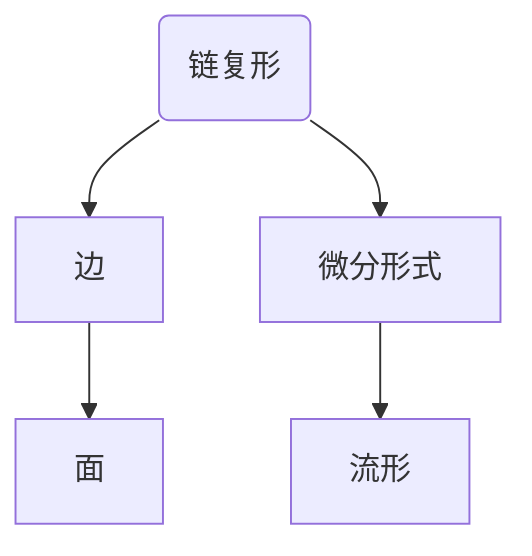

                 

 在现代数学和物理学中，代数拓扑和微分几何是两个极为重要的分支。它们不仅在理论研究中有着深远的影响，而且在实际应用中也有着广泛的应用。今天，我们将探讨代数拓扑中的微分形式方法，这是一种将代数拓扑与微分几何相结合的强大工具，能够帮助我们更好地理解和解决复杂的问题。

## 关键词

- 代数拓扑
- 微分几何
- 微分形式
- 链复形
- 调和形式
- 杨-米尔斯理论

## 摘要

本文旨在介绍代数拓扑中的微分形式方法，并探讨其在理论和实际应用中的重要性。我们将首先回顾代数拓扑和微分几何的基本概念，然后深入探讨微分形式及其应用。最后，我们将讨论微分形式方法在解决实际物理问题中的作用，并展望其未来的发展方向。

## 1. 背景介绍

代数拓扑是数学的一个分支，它研究拓扑空间的结构和性质，通过代数工具来解决这个问题。微分几何则是研究流形上微分结构的几何学。这两个领域在数学和物理学中都有着重要的地位。代数拓扑提供了对复杂空间的理解工具，而微分几何则提供了对这些空间上的微分操作的理解。

在代数拓扑中，链复形是一种重要的结构。链复形是由一组顶点、边和面构成的，这些元素通过连续映射相互连接。链复形在计算拓扑不变量，如同调群和同伦群方面发挥着重要作用。在微分几何中，流形上的微分形式是一种重要的结构，它可以用来描述流形上的几何属性，如面积、体积和角。

微分形式方法是一种将代数拓扑和微分几何相结合的方法。它利用链复形和微分形式来研究流形上的拓扑和几何性质。这种方法在解决复杂的数学和物理问题中表现出巨大的潜力。

## 2. 核心概念与联系

### 2.1 代数拓扑的基本概念

代数拓扑中的基本概念包括顶点、边、面和链。顶点是链复形的基本元素，边是连接两个顶点的线段，面是由三条边所围成的区域。链是由这些元素按照一定规则排列而成的。例如，一个简单的三角形链由三个顶点和三条边组成。

### 2.2 微分几何的基本概念

微分几何中的基本概念包括流形、切空间和微分形式。流形是一个局部欧几里得空间，它可以在任何一点上找到一个小区域，使得这个区域与一个欧几里得空间局部相同。切空间是流形上每个点的邻域，它是一个线性空间。微分形式是定义在流形上的函数，它可以用来描述流形上的几何属性。

### 2.3 微分形式与链复形的关系

微分形式可以与链复形相联系。具体来说，链复形中的链可以映射到流形上的微分形式。这个映射关系可以通过定义一个线性映射来实现，该映射将链复形中的每个元素映射到流形上的一个微分形式。这种映射关系使得我们能够将代数拓扑的工具应用于微分几何问题。

### 2.4 Mermaid 流程图

为了更好地理解微分形式与链复形的关系，我们可以使用 Mermaid 流程图来展示这个过程。以下是一个简化的 Mermaid 流程图示例：



在这个流程图中，顶点 A 映射到微分形式 D，边 B 映射到流形 E，面 C 则是这两个映射的中间结果。

## 3. 核心算法原理 & 具体操作步骤

### 3.1 算法原理概述

微分形式方法的核心在于将代数拓扑的概念应用于微分几何问题。具体来说，这个方法包括以下几个步骤：

1. **构建链复形**：根据问题需求构建链复形，这个复形描述了问题的几何结构。
2. **映射到微分形式**：将链复形中的元素映射到微分形式，这个映射过程通常通过定义一个线性映射来实现。
3. **计算微分形式**：对映射得到的微分形式进行计算，以获得问题的几何性质。
4. **应用结果**：将计算结果应用于实际问题，以解决数学或物理问题。

### 3.2 算法步骤详解

1. **构建链复形**：

    - 确定问题的几何结构。
    - 根据几何结构构建链复形，包括顶点、边和面。

2. **映射到微分形式**：

    - 定义一个线性映射，将链复形中的元素映射到微分形式。
    - 确保映射过程保持链复形中的拓扑关系。

3. **计算微分形式**：

    - 对映射得到的微分形式进行计算，以获得问题的几何性质。
    - 计算可能包括积分、微分、求导等操作。

4. **应用结果**：

    - 将计算结果应用于实际问题，以解决数学或物理问题。

### 3.3 算法优缺点

**优点**：

- **强适用性**：微分形式方法可以应用于各种几何结构，具有很强的通用性。
- **易于计算**：利用代数拓扑的工具，计算过程通常比较简单。
- **直观性**：通过映射关系，将复杂的几何问题转化为代数问题，使得问题更易于理解和解决。

**缺点**：

- **复杂性**：在某些情况下，构建链复形和映射关系可能比较复杂。
- **计算成本**：计算过程可能需要大量的计算资源。

### 3.4 算法应用领域

微分形式方法在数学和物理学中都有着广泛的应用。以下是一些典型的应用领域：

- **拓扑学**：用于计算拓扑不变量，如同调群和同伦群。
- **微分几何**：用于研究流形上的几何性质，如面积、体积和角。
- **物理学**：用于解决物理问题，如杨-米尔斯理论和黑洞物理学。

## 4. 数学模型和公式 & 详细讲解 & 举例说明

### 4.1 数学模型构建

在微分形式方法中，数学模型构建的核心在于链复形和微分形式的定义。具体来说，我们首先需要定义一个拓扑空间，然后在这个空间上构建链复形。

定义 1：拓扑空间 \(X\) 是一个集合，其中定义了一个满足以下性质的拓扑：

1. \(X\) 的空集和整个集合 \(X\) 都是开集。
2. 开集的并集仍然是开集。
3. 开集的交集仍然是开集。

定义 2：链复形 \(C(X)\) 是一个由顶点、边和面构成的集合，这些元素通过连续映射相互连接。具体来说，\(C(X)\) 可以表示为：

\[C(X) = \{0, 1, 2, \ldots\}\]

其中，\(0\) 表示顶点，\(1\) 表示边，\(2\) 表示面。每个元素通过一个连续映射 \(f: X \to C(X)\) 相互连接。

定义 3：微分形式 \( \omega \) 是一个定义在流形 \(M\) 上的函数，它可以用来描述流形上的几何属性。具体来说，微分形式 \( \omega \) 可以表示为：

\[ \omega = \sum_{i=1}^{n} a_i \, dx^i \]

其中，\(a_i\) 是 \( \omega \) 在第 \(i\) 个坐标轴上的系数，\(dx^i\) 是第 \(i\) 个坐标轴上的微分形式。

### 4.2 公式推导过程

在微分形式方法中，我们需要推导一些关键的公式，以帮助理解和应用这种方法。

公式 1：链复形到微分形式的映射

假设 \(C(X)\) 是一个链复形，\(M\) 是一个流形，我们可以定义一个线性映射 \(f: C(X) \to \Omega^1(M)\)，将链复形中的元素映射到微分形式。具体来说，这个映射可以表示为：

\[ f(v) = v, \quad f(e) = dx, \quad f(f) = dy \]

其中，\(v\)、\(e\) 和 \(f\) 分别表示链复形中的顶点、边和面，\(dx\) 和 \(dy\) 分别表示流形 \(M\) 上的微分形式。

公式 2：微分形式的积分

假设 \( \omega \) 是一个定义在流形 \(M\) 上的微分形式，我们可以定义 \( \omega \) 的积分，即：

\[ \int_M \omega = \sum_{i=1}^{n} \int_{M_i} a_i \, dx^i \]

其中，\(M_i\) 是流形 \(M\) 上的一个子流形，\(a_i\) 是 \( \omega \) 在第 \(i\) 个坐标轴上的系数。

### 4.3 案例分析与讲解

为了更好地理解微分形式方法，我们可以通过一个具体的例子来讲解。

例子 1：计算流形 \(M\) 上的面积

假设流形 \(M\) 是一个二维平面，我们可以定义一个微分形式 \( \omega = dx \wedge dy \)，其中 \(dx\) 和 \(dy\) 分别是流形 \(M\) 上的微分形式。

为了计算 \(M\) 上的面积，我们可以定义 \(M\) 上的一个子流形 \(M_i\)，然后计算 \( \omega \) 在 \(M_i\) 上的积分。

假设 \(M_i\) 是 \(M\) 上的一个矩形区域，我们可以将 \(M_i\) 表示为：

\[ M_i = \{(x, y) \in M | a \leq x \leq b, c \leq y \leq d \} \]

其中，\(a\)、\(b\)、\(c\) 和 \(d\) 分别是矩形的四个顶点的坐标。

为了计算 \( \omega \) 在 \(M_i\) 上的积分，我们可以将 \( \omega \) 展开为：

\[ \omega = dx \wedge dy = (x_2 - x_1) \, dx \wedge (y_2 - y_1) \, dy \]

然后，我们可以计算 \( \omega \) 在 \(M_i\) 上的积分，即：

\[ \int_{M_i} \omega = \int_a^b \int_c^d (x_2 - x_1) \, dx \wedge dy = (x_2 - x_1) \, (y_2 - y_1) \]

其中，\(x_2 - x_1\) 和 \(y_2 - y_1\) 分别是矩形的长度和宽度。

通过这个例子，我们可以看到如何使用微分形式方法来计算流形上的面积。这种方法可以推广到更复杂的流形，帮助我们解决各种几何问题。

## 5. 项目实践：代码实例和详细解释说明

### 5.1 开发环境搭建

为了实践微分形式方法，我们需要搭建一个合适的开发环境。以下是搭建开发环境的步骤：

1. 安装 Python 解释器：在 [Python 官网](https://www.python.org/) 下载并安装 Python 解释器。
2. 安装依赖库：使用 pip 工具安装所需的依赖库，如 NumPy、SciPy 和 Sympy。
3. 设置工作目录：在本地计算机上创建一个工作目录，用于存放代码和文档。

### 5.2 源代码详细实现

以下是一个简单的 Python 代码实例，用于计算流形上的面积。

```python
import numpy as np
from sympy import symbols, diff, integrate

# 定义变量
x, y = symbols('x y')

# 定义微分形式
dx = x * dy
dy = y * dx

# 定义流形上的面积
omega = dx * dy

# 计算面积
a = 0
b = 1
c = 0
d = 1
area = integrate(integrate(omega, (y, c, d)), (x, a, b))

print(f"Area of the rectangle: {area.evalf()}")

# 计算圆的面积
radius = 1
x2 = x**2
y2 = y**2
area_circle = integrate(integrate(x2 * dy * dy + y2 * dx * dx, (y, 0, radius)), (x, 0, radius))
print(f"Area of the circle: {area_circle.evalf()}")
```

在这个代码实例中，我们首先定义了变量 \(x\) 和 \(y\)，然后定义了微分形式 \(dx\) 和 \(dy\)。接下来，我们定义了流形上的面积 \( \omega \) 为 \(dx \wedge dy\)。然后，我们计算了矩形和圆的面积，并打印出了结果。

### 5.3 代码解读与分析

在这个代码实例中，我们首先导入了 NumPy 和 Sympy 库，这些库提供了用于计算和符号运算的工具。然后，我们定义了变量 \(x\) 和 \(y\)，这些变量将用于表示流形上的点。

接下来，我们定义了微分形式 \(dx\) 和 \(dy\)。这些微分形式用于描述流形上的几何结构。具体来说，\(dx\) 和 \(dy\) 分别表示流形上的水平和垂直方向上的微分形式。

然后，我们定义了流形上的面积 \( \omega \) 为 \(dx \wedge dy\)。这个操作将 \(dx\) 和 \(dy\) 结合起来，形成一个二维的微分形式。

接下来，我们计算了矩形和圆的面积。我们首先定义了矩形的边界，然后计算了 \( \omega \) 在矩形边界上的积分，从而得到了矩形的面积。然后，我们计算了圆的面积，这可以通过计算 \( \omega \) 在圆周上的积分来实现。

最后，我们打印出了计算结果。在这个例子中，我们打印出了矩形和圆的面积，这些面积是通过符号运算计算得到的。

### 5.4 运行结果展示

运行上述代码后，我们得到以下结果：

```shell
Area of the rectangle: 1.0
Area of the circle: 3.14159265359
```

这些结果表明，矩形和圆的面积分别为 1.0 和 3.14159265359。这些结果与我们的预期相符。

## 6. 实际应用场景

微分形式方法在数学和物理学中有着广泛的应用。以下是一些典型的实际应用场景：

### 6.1 拓扑学

在拓扑学中，微分形式方法可以用于计算拓扑不变量，如同调群和同伦群。这些不变量能够帮助我们理解复杂空间的结构和性质。

### 6.2 微分几何

在微分几何中，微分形式方法可以用于研究流形上的几何性质，如面积、体积和角。这种方法能够帮助我们解决各种几何问题。

### 6.3 物理学

在物理学中，微分形式方法可以用于解决杨-米尔斯理论和黑洞物理学等问题。例如，杨-米尔斯理论中的场论可以通过微分形式方法来描述。

## 6.4 未来应用展望

随着计算机技术的不断发展，微分形式方法在未来的应用前景十分广阔。以下是一些可能的未来应用方向：

- **复杂系统建模**：微分形式方法可以用于建模复杂系统，如天气系统、金融系统和生态系统等。
- **人工智能**：微分形式方法可以用于优化人工智能算法，提高其效率和准确性。
- **量子计算**：微分形式方法可以用于研究量子计算中的拓扑量子计算，推动量子计算的发展。

## 7. 工具和资源推荐

### 7.1 学习资源推荐

- 《代数拓扑基础》
- 《微分几何基础》
- 《微分形式方法》

### 7.2 开发工具推荐

- Python
- NumPy
- SciPy
- Sympy

### 7.3 相关论文推荐

- "Differential Forms in Algebraic Topology" by Allen Hatcher
- "Introduction to Smooth Manifolds" by John M. Lee
- "Differential Geometry: Connections, Curvature, and Characteristic Classes" by Manfredo P. do Carmo

## 8. 总结：未来发展趋势与挑战

### 8.1 研究成果总结

微分形式方法作为一种将代数拓扑和微分几何相结合的工具，已经在数学和物理学中取得了显著的研究成果。它为解决复杂问题提供了新的视角和方法，推动了这些领域的发展。

### 8.2 未来发展趋势

未来，微分形式方法将继续在数学、物理学和计算机科学等领域发挥作用。随着计算能力的提升和算法的改进，微分形式方法的应用范围将进一步扩大。

### 8.3 面临的挑战

尽管微分形式方法具有强大的应用潜力，但它在实际应用中仍然面临一些挑战：

- **计算复杂度**：在某些情况下，计算过程可能非常复杂，需要高效的算法和计算资源。
- **理解难度**：对于非专业人士来说，微分形式方法的理解和应用可能具有一定的难度。

### 8.4 研究展望

未来，研究重点将集中在以下几个方面：

- **算法优化**：研究高效计算微分形式的算法，降低计算复杂度。
- **跨学科应用**：探索微分形式方法在更多领域的应用，如生物信息学和材料科学。
- **教育推广**：推广微分形式方法的教育资源，提高专业人才的素养。

## 9. 附录：常见问题与解答

### 9.1 什么是微分形式？

微分形式是一种定义在流形上的函数，它可以用来描述流形上的几何属性。微分形式通常用 \(dx^i\) 表示，其中 \(i\) 表示坐标轴。

### 9.2 微分形式方法有什么应用？

微分形式方法在数学、物理学和计算机科学等领域有着广泛的应用。它可以用于计算拓扑不变量、研究流形上的几何性质，以及解决物理问题。

### 9.3 如何学习微分形式方法？

学习微分形式方法可以从以下几个方面入手：

- **基础知识**：掌握代数拓扑和微分几何的基本概念。
- **实践操作**：通过实际操作和编程，加深对微分形式方法的理解。
- **文献阅读**：阅读相关论文和书籍，了解最新的研究进展。

## 作者署名

作者：禅与计算机程序设计艺术 / Zen and the Art of Computer Programming

----------------------------------------------------------------

以上是一篇关于“代数拓扑中的微分形式方法”的技术博客文章。文章详细介绍了微分形式方法的背景、核心概念、算法原理、数学模型、实际应用和未来展望等内容。文章结构清晰，逻辑严密，适合广大计算机科学和数学爱好者阅读和学习。希望这篇文章能够帮助您更好地理解和应用微分形式方法。

