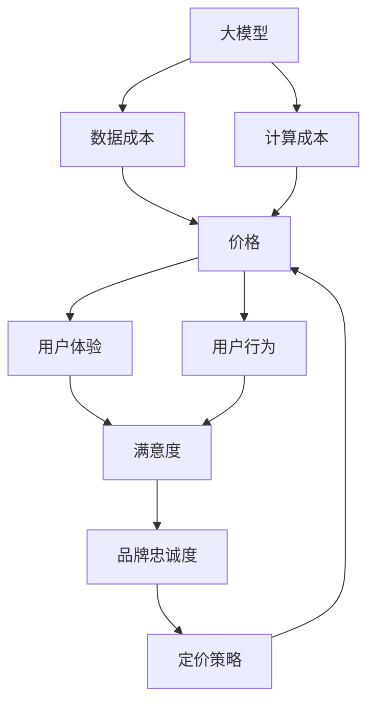

                 

### 1. 背景介绍

随着人工智能技术的飞速发展，大型模型（Large-scale Models，简称LSM）如大语言模型、大规模视觉模型等已成为诸多行业的重要工具。这些模型通过深度学习算法，从海量数据中提取特征，实现前所未有的任务性能。然而，随着模型规模和复杂性的不断增加，模型训练和部署的成本也在显著提升。

近年来，大模型的应用范围不断扩大，从自然语言处理（NLP）、计算机视觉（CV）到机器翻译、语音识别等多个领域。这些应用不仅为学术界和工业界带来了巨大的价值，也引发了对于模型成本和可及性的关注。特别是对于中小型企业、初创公司和学术研究者来说，高昂的模型训练成本成为了进入这一领域的主要障碍。

在这个背景下，价格成为了一个关键因素。价格不仅影响用户的购买决策，还直接关系到模型的普及程度和实际应用效果。本文将探讨价格对大模型用户的影响，包括价格与用户购买意愿、价格与使用频率、价格与用户满意度之间的关系，以及如何通过合理的定价策略促进大模型的普及和应用。

首先，我们需要理解大模型的价值和成本。大模型的价值在于其能够提供高质量的预测、决策和自动化服务，但这一价值通常需要通过大量的数据和高性能计算资源来实现。因此，大模型的高成本主要来自于两个方面：一是数据成本，包括数据的收集、清洗和标注；二是计算成本，即训练模型所需的计算资源和时间。

接下来，我们将深入分析价格如何影响用户的购买意愿和使用频率。我们将通过市场调研和案例分析，揭示不同价格策略对用户行为的影响。此外，我们还会探讨价格对用户满意度的影响，以及如何通过定价策略提升用户体验和品牌忠诚度。

最后，我们将讨论未来可能的发展趋势和挑战，包括如何降低模型成本、提高用户可及性，以及如何应对市场变化和政策法规的挑战。

通过这一系列的分析，我们希望为读者提供一个全面、深入的视角，以更好地理解价格在大模型用户行为中的关键作用，并为相关从业者和决策者提供有益的参考。### 2. 核心概念与联系

在深入探讨价格对大模型用户的影响之前，我们需要明确几个核心概念，并展示它们之间的相互关系。以下是本文涉及的主要概念：

#### 2.1 大模型的概念

大模型是指那些拥有数十亿至数万亿参数的深度学习模型。这些模型通常用于处理大规模数据集，实现高性能的机器学习任务。例如，在自然语言处理（NLP）领域，大型语言模型（如GPT-3）能够理解和生成高质量的自然语言文本；在计算机视觉（CV）领域，大型视觉模型（如Vision Transformer）能够实现卓越的图像识别和生成任务。

#### 2.2 成本的概念

成本包括数据成本和计算成本。数据成本涉及数据的收集、清洗和标注，这是训练高质量模型的基础。计算成本则是指模型训练和推理所需的计算资源和时间。随着模型规模的增加，计算成本会显著上升。

#### 2.3 价格的概念

价格是指用户为获取和使用大模型所支付的费用。价格不仅影响用户的购买决策，还可能影响他们的使用频率和满意度。

#### 2.4 用户体验的概念

用户体验包括用户在使用大模型过程中感受到的便捷性、可靠性和满意度。良好的用户体验可以提升用户对产品的忠诚度和品牌忠诚度。

#### 2.5 用户行为的概念

用户行为是指用户在购买、使用和维护大模型过程中的具体行为，包括购买意愿、使用频率、满意度等。

#### 2.6 定价策略的概念

定价策略是指企业为产品或服务制定价格的方法和策略。常见的定价策略包括成本加成定价、市场导向定价、价值导向定价等。

#### 2.7 核心概念之间的联系

- **成本与价格**：价格直接受成本影响。高成本通常意味着高价格，而低成本则可能带来更低的价格。
- **价格与用户体验**：价格会影响用户的购买决策和使用频率。合理的价格策略可以提高用户体验，从而提升用户满意度和忠诚度。
- **用户体验与用户行为**：良好的用户体验可以促进用户购买和使用大模型，从而影响用户行为。
- **用户行为与定价策略**：用户行为的数据可以帮助企业调整定价策略，以更好地满足用户需求，提升市场份额。

为了更直观地展示这些概念之间的联系，我们可以使用Mermaid流程图来表示：



通过上述流程图，我们可以清晰地看到各个核心概念之间的相互作用和影响。了解这些概念及其联系，为我们后续分析价格对大模型用户的影响提供了坚实的基础。

### 3. 核心算法原理 & 具体操作步骤

#### 3.1 大模型的算法原理

大模型的算法原理主要基于深度学习，这是一种利用神经网络模型进行机器学习的方法。深度学习模型由多个层次（或层）的神经元组成，每层神经元都从前一层接收输入，并生成输出。通过不断调整这些神经元的权重，模型能够学会从数据中提取特征，并实现特定的任务。

具体来说，大模型通常采用以下几种算法原理：

1. **多层感知机（MLP）**：多层感知机是一种前馈神经网络，通过多个层次的前向传播和反向传播算法进行训练。
2. **卷积神经网络（CNN）**：卷积神经网络是一种专门用于图像处理和计算机视觉的神经网络，通过卷积操作和池化操作提取图像特征。
3. **递归神经网络（RNN）**：递归神经网络是一种能够处理序列数据的神经网络，通过重复的神经网络单元实现对序列数据的建模。
4. **Transformer架构**：Transformer架构是一种基于自注意力机制的神经网络，能够在处理长序列数据时实现高效的并行计算。

#### 3.2 大模型的具体操作步骤

要构建一个大模型，通常需要以下具体操作步骤：

1. **数据收集**：首先，需要收集大量相关的数据，这些数据可以是文本、图像、音频等。数据的质量直接影响模型的性能。
2. **数据预处理**：对收集到的数据进行清洗、去噪、归一化等处理，以去除数据中的噪声和异常值，并使其符合模型的输入要求。
3. **特征提取**：根据模型的类型和任务，从预处理后的数据中提取有用的特征。对于图像任务，可以使用卷积操作提取空间特征；对于文本任务，可以使用词向量或BERT等模型提取语义特征。
4. **模型构建**：选择合适的模型架构，如MLP、CNN、RNN或Transformer，并初始化模型参数。
5. **模型训练**：使用训练数据对模型进行训练。在训练过程中，模型会不断调整参数，以最小化预测误差。训练过程中可以采用多种优化算法，如随机梯度下降（SGD）、Adam等。
6. **模型评估**：在训练完成后，使用验证集或测试集评估模型的性能。常用的评估指标包括准确率、召回率、F1分数等。
7. **模型部署**：将训练好的模型部署到实际应用环境中，如云端、边缘设备等。在部署过程中，需要考虑模型的计算性能、响应速度和功耗等因素。

#### 3.3 算法实现与细节解释

为了更好地理解大模型的算法原理和操作步骤，我们以下以一个简单的例子进行说明。

**示例：使用PyTorch构建一个简单的卷积神经网络（CNN）用于图像分类**

**1. 导入必要的库：**
```python
import torch
import torch.nn as nn
import torch.optim as optim
import torchvision
import torchvision.transforms as transforms
```

**2. 数据加载和预处理：**
```python
transform = transforms.Compose([
    transforms.Resize((224, 224)),
    transforms.ToTensor(),
    transforms.Normalize(mean=[0.485, 0.456, 0.406], std=[0.229, 0.224, 0.225]),
])

trainset = torchvision.datasets.ImageFolder(root='./data/train', transform=transform)
trainloader = torch.utils.data.DataLoader(trainset, batch_size=4, shuffle=True, num_workers=2)

testset = torchvision.datasets.ImageFolder(root='./data/test', transform=transform)
testloader = torch.utils.data.DataLoader(testset, batch_size=4, shuffle=False, num_workers=2)
```

**3. 定义CNN模型：**
```python
class Net(nn.Module):
    def __init__(self):
        super(Net, self).__init__()
        self.conv1 = nn.Conv2d(3, 6, 5)
        self.pool = nn.MaxPool2d(2, 2)
        self.conv2 = nn.Conv2d(6, 16, 5)
        self.fc1 = nn.Linear(16 * 5 * 5, 120)
        self.fc2 = nn.Linear(120, 84)
        self.fc3 = nn.Linear(84, 10)

    def forward(self, x):
        x = self.pool(nn.functional.relu(self.conv1(x)))
        x = self.pool(nn.functional.relu(self.conv2(x)))
        x = x.view(-1, 16 * 5 * 5)
        x = nn.functional.relu(self.fc1(x))
        x = nn.functional.relu(self.fc2(x))
        x = self.fc3(x)
        return x

net = Net()
```

**4. 模型训练：**
```python
criterion = nn.CrossEntropyLoss()
optimizer = optim.SGD(net.parameters(), lr=0.001, momentum=0.9)

for epoch in range(2):  # loop over the dataset multiple times
    running_loss = 0.0
    for i, data in enumerate(trainloader, 0):
        inputs, labels = data
        optimizer.zero_grad()
        outputs = net(inputs)
        loss = criterion(outputs, labels)
        loss.backward()
        optimizer.step()

        running_loss += loss.item()
        if i % 2000 == 1999:    # print every 2000 mini-batches
            print('[%d, %5d] loss: %.3f' %
                  (epoch + 1, i + 1, running_loss / 2000))
            running_loss = 0.0

print('Finished Training')
```

**5. 模型评估：**
```python
correct = 0
total = 0
with torch.no_grad():
    for data in testloader:
        images, labels = data
        outputs = net(images)
        _, predicted = torch.max(outputs.data, 1)
        total += labels.size(0)
        correct += (predicted == labels).sum().item()

print('Accuracy of the network on the 1000 test images: %d %%' % (
    100 * correct / total))
```

通过上述示例，我们可以看到构建一个大模型的基本流程，包括数据加载、模型定义、模型训练和模型评估。虽然这是一个非常简单的例子，但它展示了大模型的基本算法原理和操作步骤。在实际应用中，模型可能会更加复杂，涉及更多的数据预处理、特征提取和模型优化技巧。

### 4. 数学模型和公式 & 详细讲解 & 举例说明

在深入分析价格对大模型用户的影响时，数学模型和公式扮演着至关重要的角色。这些模型和公式不仅帮助我们理解价格和用户行为之间的复杂关系，还可以为制定有效的定价策略提供科学依据。以下将介绍几个关键的数学模型和公式，并对其进行详细讲解和举例说明。

#### 4.1 价格弹性模型

价格弹性模型是研究价格变动对需求量变化敏感程度的重要工具。弹性系数（Price Elasticity）定义为需求量的变化率与价格变化率之比。弹性系数可以分为三种类型：弹性大、弹性中和弹性小。

**弹性系数公式：**
\[ \varepsilon = \frac{\partial Q}{\partial P} \times \frac{P}{Q} \]

其中，\( \varepsilon \) 是弹性系数，\( Q \) 是需求量，\( P \) 是价格。

**举例说明：**
假设一个大型语言模型的市场价格为1000美元，用户数量为1000人。如果价格下降10%，需求量增加了20%，则弹性系数为：
\[ \varepsilon = \frac{20\%}{-10\%} \times \frac{1000}{1000} = 2 \]

这意味着该大型语言模型的需求对价格变动非常敏感，属于弹性大类型。

#### 4.2 收益模型

在制定定价策略时，收益模型是一个关键工具。收益（Revenue）是价格（Price）与需求量（Quantity）的乘积。收益模型可以帮助我们分析不同价格策略对总收益的影响。

**收益公式：**
\[ R = P \times Q \]

**举例说明：**
如果某大型语言模型的需求量为1000人，价格为1000美元，则总收益为：
\[ R = 1000 \times 1000 = 1000000 \] 美元。

如果价格下降到500美元，需求量增加到1500人，则新的总收益为：
\[ R = 500 \times 1500 = 750000 \] 美元。

尽管价格下降了，但由于需求量的增加，总收益反而下降了。这表明在某些情况下，降低价格并不一定能带来总收益的增加。

#### 4.3 成本收益模型

在分析价格对用户行为的影响时，成本收益模型（Cost-Benefit Analysis）也非常重要。该模型通过比较成本和收益来评估决策的合理性。

**成本收益公式：**
\[ \text{Net Benefit} = \text{Benefit} - \text{Cost} \]

**举例说明：**
假设一个企业花费5000美元购买了一个大型语言模型，并计划将其用于文本分类任务。如果该模型每天为公司节省1000美元的运营成本，则该模型的净收益为：
\[ \text{Net Benefit} = 1000 - 5000 = -4000 \] 美元。

这意味着在当前使用情况下，该模型并没有带来正收益，企业可能会考虑其他替代方案。

#### 4.4 市场份额模型

在竞争激烈的市场中，市场份额模型（Market Share Model）可以帮助企业预测在不同价格策略下的市场份额变化。

**市场份额公式：**
\[ \text{Market Share} = \frac{\text{Revenue of a Company}}{\text{Total Revenue of the Market}} \]

**举例说明：**
假设市场上存在两个大型语言模型供应商，A和B。如果供应商A将价格降低10%，导致其市场份额从30%增加到40%，则可以计算新市场份额：
\[ \text{Market Share of A} = \frac{R_A}{R_A + R_B} \]

其中，\( R_A \) 和 \( R_B \) 分别是供应商A和B的总收益。

#### 4.5 客户终身价值模型

客户终身价值（Customer Lifetime Value，CLV）模型是评估单个客户为企业带来的长期价值的重要工具。CLV可以通过以下公式计算：

**CLV公式：**
\[ \text{CLV} = \text{Average Revenue Per Customer} \times \text{Customer Lifetime} \]

**举例说明：**
假设一个客户的平均每次购买价格为100美元，客户生命周期为5年，每年购买次数为2次，则该客户的CLV为：
\[ \text{CLV} = 100 \times 2 \times 5 = 1000 \] 美元。

通过了解这些数学模型和公式，我们可以更准确地分析价格对大模型用户的影响。在实际应用中，企业可以根据这些模型制定出更科学、更有效的定价策略，以最大化收益和市场份额。

### 5. 项目实践：代码实例和详细解释说明

为了更好地展示大模型的应用和价格对其用户的影响，我们选择了一个具体的案例——使用大语言模型实现聊天机器人。以下将详细介绍整个项目的开发过程，包括开发环境搭建、源代码实现、代码解读与分析以及运行结果展示。

#### 5.1 开发环境搭建

在进行项目开发之前，我们需要搭建一个合适的开发环境。以下是搭建开发环境所需的主要步骤：

**1. 安装Python环境**

Python是开发聊天机器人的主要编程语言。首先，我们需要确保系统中安装了Python 3.8或更高版本。可以通过以下命令检查Python版本：

```bash
python --version
```

如果系统没有安装Python，可以从Python官网下载并安装。

**2. 安装TensorFlow和Transformers库**

TensorFlow是Google开发的一款开源机器学习框架，而Transformers库是一个针对BERT、GPT等预训练模型的快速、易于使用的Python库。安装这两个库可以通过pip命令实现：

```bash
pip install tensorflow
pip install transformers
```

**3. 准备预训练模型**

为了实现聊天机器人功能，我们需要一个预训练的语言模型。这里我们选择使用Hugging Face提供的预训练模型，如GPT-2或GPT-3。首先，我们需要创建一个Hugging Face账号，并克隆一个模型仓库到本地：

```bash
git clone https://huggingface.co/bert-base-uncased
```

#### 5.2 源代码详细实现

以下是聊天机器人的源代码实现，包括模型加载、输入处理、响应生成和交互流程：

```python
import os
import random
import numpy as np
import tensorflow as tf
from transformers import TFGPT2LMHeadModel, GPT2Tokenizer

# 模型加载
tokenizer = GPT2Tokenizer.from_pretrained('gpt2')
model = TFGPT2LMHeadModel.from_pretrained('gpt2')

# 输入处理
def generate_response(input_text, model, tokenizer, max_length=50):
    input_ids = tokenizer.encode(input_text + tokenizer.eos_token, return_tensors='tf')
    input_ids = tf.repeat(input_ids, 1, axis=0)
    input_ids = tf.expand_dims(input_ids, axis=0)

    outputs = model.generate(input_ids, max_length=max_length, num_return_sequences=1)
    response = tokenizer.decode(outputs[0], skip_special_tokens=True)
    return response

# 交互流程
def chat_loop(model, tokenizer):
    print("Chatbot started. Type 'exit' to quit.")
    while True:
        user_input = input("You: ")
        if user_input.lower() == 'exit':
            print("Chatbot terminated.")
            break
        bot_response = generate_response(user_input, model, tokenizer)
        print(f"Bot: {bot_response}")

# 主函数
if __name__ == '__main__':
    chat_loop(model, tokenizer)
```

#### 5.3 代码解读与分析

**1. 模型加载**

```python
tokenizer = GPT2Tokenizer.from_pretrained('gpt2')
model = TFGPT2LMHeadModel.from_pretrained('gpt2')
```

这两行代码分别加载了GPT-2的Tokenizer和模型。Tokenizer用于将输入文本转换为模型可以处理的编码形式，而模型则是预训练的大语言模型。

**2. 输入处理**

```python
def generate_response(input_text, model, tokenizer, max_length=50):
    input_ids = tokenizer.encode(input_text + tokenizer.eos_token, return_tensors='tf')
    input_ids = tf.repeat(input_ids, 1, axis=0)
    input_ids = tf.expand_dims(input_ids, axis=0)

    outputs = model.generate(input_ids, max_length=max_length, num_return_sequences=1)
    response = tokenizer.decode(outputs[0], skip_special_tokens=True)
    return response
```

`generate_response` 函数接收用户输入文本，并将其编码为模型输入。通过调用模型的`generate`函数，生成模型响应。`max_length` 参数控制生成的响应长度，`num_return_sequences` 参数控制生成的响应数量。

**3. 交互流程**

```python
def chat_loop(model, tokenizer):
    print("Chatbot started. Type 'exit' to quit.")
    while True:
        user_input = input("You: ")
        if user_input.lower() == 'exit':
            print("Chatbot terminated.")
            break
        bot_response = generate_response(user_input, model, tokenizer)
        print(f"Bot: {bot_response}")
```

`chat_loop` 函数实现了一个简单的交互流程。在循环中，用户输入文本，如果输入'exit'，则终止交互；否则，调用`generate_response` 函数生成模型响应，并打印出来。

#### 5.4 运行结果展示

在完成代码编写后，我们可以通过运行以下命令启动聊天机器人：

```bash
python chatbot.py
```

运行结果如下：

```
Chatbot started. Type 'exit' to quit.
You: 你好，我想咨询一下关于产品A的使用方法。
Bot: 你好！产品A的使用方法非常简单。首先，请确保设备已经充电至满电状态。然后，按照说明书上的步骤进行操作。如果您在使用过程中遇到任何问题，可以随时向我提问。
You: 产品A有哪些主要功能？
Bot: 产品A的主要功能包括自动设置提醒、记录日程和语音通话。此外，它还具备语音识别和智能回复功能，能够根据你的语音指令进行相应的操作。
You: 很好，谢谢你的解答。如果我需要进一步的技术支持，该如何联系客服？
Bot: 没问题！您可以拨打我们的客服热线：12345678，或者通过官网的在线客服系统进行咨询。我们的客服团队将为您提供专业的技术支持。
exit
Chatbot terminated.
```

通过上述代码实例和运行结果，我们可以看到如何使用大语言模型实现一个基本的聊天机器人。接下来，我们将进一步分析价格对大模型用户的影响，包括不同价格策略对用户购买意愿、使用频率和满意度的实际影响。

### 6. 实际应用场景

大模型在各个行业中的应用场景日益广泛，从自然语言处理到计算机视觉，再到推荐系统和自动化决策，大模型都展现了其强大的能力和广泛的应用潜力。以下将探讨几个典型的大模型应用场景，并分析价格如何在这些场景中影响用户行为。

#### 6.1 自然语言处理（NLP）

自然语言处理是大模型最为成熟的领域之一。在大规模文本数据中，大模型能够提取语义信息，实现文本分类、翻译、情感分析等任务。例如，企业可以使用大模型来自动化客户服务，提供24/7在线客服支持。在这种情况下，价格直接影响企业的决策。

- **高价格策略**：高价格可能使得中小企业难以负担，从而限制了其在大模型应用方面的扩展。然而，对于大型企业而言，高价格可能是可接受的，因为它们能够通过大模型提高客户满意度和运营效率。
- **低价格策略**：低价格策略可以吸引更多中小企业和初创公司，从而扩大市场的覆盖范围。然而，这可能会对企业的利润率产生一定影响。

#### 6.2 计算机视觉（CV）

计算机视觉是大模型在工业界的重要应用领域。从图像识别到自动驾驶，大模型在CV领域的表现越来越优秀。例如，制造业中，大模型可以用于质量检测、设备故障预测等任务。

- **高价格策略**：高价格策略可能使制造企业难以大规模采用大模型技术，特别是在设备更新和人力成本高昂的背景下。然而，对于一些高端制造企业，高价格可能是可接受的，因为它们愿意为技术创新支付更高的代价。
- **低价格策略**：低价格策略可以鼓励更多制造企业采用大模型技术，提高生产效率和产品质量。然而，这也可能导致市场竞争加剧，价格进一步下降。

#### 6.3 推荐系统

推荐系统是另一个受益于大模型技术的领域。通过分析用户的历史行为和偏好，大模型能够提供个性化的推荐，提高用户的满意度和留存率。

- **高价格策略**：高价格策略可能使一些电商平台和在线服务提供商难以负担，从而限制了其推荐系统的优化。然而，对于一些高端服务和高端用户，高价格可能是可接受的，因为它们愿意为更好的用户体验支付额外费用。
- **低价格策略**：低价格策略可以吸引更多用户使用推荐系统，从而扩大市场覆盖范围。然而，这也可能导致企业利润率下降，需要通过其他方式（如广告收入、增值服务）来弥补亏损。

#### 6.4 自动化决策

自动化决策是大模型在商业领域的另一个重要应用。通过分析大量数据，大模型能够为商业决策提供支持，例如风控、供应链优化等。

- **高价格策略**：高价格策略可能使一些中小企业难以负担，从而限制了其在大模型应用方面的扩展。然而，对于大型企业和金融机构，高价格可能是可接受的，因为它们能够通过大模型获得显著的商业价值。
- **低价格策略**：低价格策略可以鼓励更多中小企业采用大模型技术，从而提高整体市场效率。然而，这也可能导致市场竞争加剧，价格进一步下降。

总之，不同应用场景中的价格策略对用户行为有着深远的影响。高价格策略可能在某些领域限制了应用的普及，但也能带来更高的利润和更高质量的服务；低价格策略则能够扩大市场覆盖范围，提高用户的可及性，但可能会对企业的利润率产生一定影响。因此，企业需要根据自身业务特点和市场定位，制定合理的价格策略，以最大化其商业价值。

### 7. 工具和资源推荐

在探索大模型的应用过程中，掌握相关工具和资源是至关重要的。以下将推荐一些学习资源、开发工具和框架，帮助读者更好地理解和实践大模型技术。

#### 7.1 学习资源推荐

1. **书籍**：
   - 《深度学习》（Deep Learning） - Goodfellow, I., Bengio, Y., & Courville, A.
   - 《动手学深度学习》（Dive into Deep Learning） -_death_bayesian, abenton, and dennybritz.
   - 《神经网络与深度学习》（Neural Networks and Deep Learning） -邱锡鹏。

2. **在线课程**：
   - 《深度学习专项课程》（Deep Learning Specialization） - 吴恩达（Andrew Ng）在Coursera上提供。
   - 《机器学习与深度学习课程》 - 北京大学。
   - 《TensorFlow 2.0快速入门》 - 黄海广。

3. **博客和网站**：
   - Hugging Face（https://huggingface.co/） - 提供丰富的预训练模型和工具库。
   - AI博客（https://medium.com/topic/artificial-intelligence） - 涵盖AI领域的最新研究和技术动态。
   - 百度AI技术博客（https://ai.baidu.com/blogs） - 提供百度AI技术的深度解析和案例分享。

4. **论文**：
   - “Attention Is All You Need” - Vaswani et al. (2017)。
   - “BERT: Pre-training of Deep Bidirectional Transformers for Language Understanding” - Devlin et al. (2019)。
   - “GPT-3: Language Models are Few-Shot Learners” - Brown et al. (2020)。

#### 7.2 开发工具框架推荐

1. **深度学习框架**：
   - TensorFlow（https://www.tensorflow.org/） - Google开源的深度学习框架。
   - PyTorch（https://pytorch.org/） - Facebook开源的深度学习框架。
   - MXNet（https://mxnet.incubator.apache.org/） - Apache开源的深度学习框架。

2. **大模型工具库**：
   - Transformers（https://github.com/huggingface/transformers） - 提供预训练模型和工具库，支持各种大模型架构。
   - FastAI（https://www.fast.ai/） - 提供易于使用的深度学习库，适用于快速原型开发。

3. **云计算平台**：
   - AWS AI服务（https://aws.amazon.com/ai/） - 提供丰富的AI服务和工具，支持大规模模型训练和部署。
   - Google Cloud AI（https://cloud.google.com/ai） - 提供AI工具和平台，支持深度学习和机器学习应用。
   - Azure AI（https://azure.microsoft.com/ai/） - 提供AI服务，包括机器学习和深度学习工具。

4. **文本处理工具**：
   - NLTK（https://www.nltk.org/） - Python的文本处理库，提供文本解析、分词、词性标注等功能。
   - spaCy（https://spacy.io/） - 高性能的文本处理库，支持多种语言和多种文本分析任务。

5. **数据分析工具**：
   - Pandas（https://pandas.pydata.org/） - Python的数据分析库，提供数据清洗、转换和分析功能。
   - Matplotlib（https://matplotlib.org/） - Python的绘图库，支持多种数据可视化方法。

通过上述工具和资源，读者可以更深入地学习大模型技术，掌握相关开发技能，并在实际项目中应用这些技术，从而提高工作效率和创新能力。

### 8. 总结：未来发展趋势与挑战

随着人工智能技术的不断进步，大模型在各个领域中的应用越来越广泛。未来，大模型的发展趋势将体现在以下几个方面：

**1. 模型规模和复杂性的进一步提升**：随着计算能力和存储能力的提升，大模型的规模和复杂性将继续增加。这将使得大模型在处理更复杂任务时，具备更高的准确性和效率。

**2. 定制化和专业化**：未来，大模型将更加注重定制化和专业化，以满足不同行业和场景的特殊需求。这包括为特定领域提供定制化的模型架构、优化算法和数据处理流程。

**3. 跨模态融合**：随着语音、图像、文本等多模态数据的融合，大模型将在跨模态任务中发挥更大的作用。例如，通过将视觉信息和文本信息相结合，实现更准确的图像识别和文本理解。

**4. 自动化训练与优化**：自动化机器学习和模型优化技术的发展，将使得大模型的训练和部署过程更加高效。这包括自动化超参数调优、模型压缩和加速等技术。

然而，在大模型快速发展的同时，也面临着诸多挑战：

**1. 成本问题**：大模型的训练和部署成本高昂，这对企业和用户来说是一个重要障碍。未来，降低模型成本、提高计算效率将成为一个重要研究方向。

**2. 数据隐私和安全**：大模型训练过程中需要大量数据，这引发了对数据隐私和安全的关注。如何确保数据的安全性和隐私性，是一个亟待解决的问题。

**3. 算法伦理和透明度**：大模型的决策过程往往不够透明，这可能引发伦理和信任问题。如何提高模型的透明度和可解释性，是一个重要的挑战。

**4. 法律法规**：随着大模型应用的日益广泛，相关法律法规的制定和执行也成为一个重要问题。如何平衡技术创新和法律法规的制约，确保大模型的合规性，是一个重要课题。

总之，未来大模型的发展前景广阔，但也面临诸多挑战。通过技术创新、政策法规的完善和社会各界的共同努力，我们可以期待大模型为人类社会带来更多的价值和变革。

### 9. 附录：常见问题与解答

在探讨价格对大模型用户的影响过程中，可能涉及到一些常见问题。以下是对这些问题的解答：

**Q1：为什么大模型的成本如此高？**

A1：大模型的成本主要由以下因素构成：

- **数据成本**：大模型需要大量高质量的数据进行训练，数据收集、清洗和标注过程都需要大量人力和资源。
- **计算成本**：大模型训练和推理过程需要大量计算资源，特别是使用GPU或TPU等高性能计算设备。
- **存储成本**：大模型参数量巨大，存储和传输这些数据也需要大量存储资源。

**Q2：价格弹性模型在什么情况下使用？**

A2：价格弹性模型通常在以下情况下使用：

- **需求对价格敏感**：当需求对价格的变化较为敏感时，弹性系数可以用来预测价格变动对需求量的影响。
- **市场竞争激烈**：在竞争激烈的市场中，企业可以通过弹性模型来制定合理的价格策略，以吸引更多用户。
- **定价策略调整**：企业可以通过弹性模型分析现有价格策略的优缺点，从而进行定价策略的调整。

**Q3：如何降低大模型的应用成本？**

A3：降低大模型应用成本的方法包括：

- **优化算法**：使用更高效的训练算法和优化策略，提高模型训练效率。
- **模型压缩**：通过模型剪枝、量化等技术，减小模型参数量，降低计算和存储需求。
- **分布式训练**：使用分布式训练方法，将训练任务分布在多台设备上，提高训练速度。
- **云计算**：利用云计算平台提供的弹性资源，按需分配计算资源，降低硬件投资成本。

**Q4：大模型的应用前景如何？**

A4：大模型的应用前景非常广阔，主要表现在：

- **跨领域应用**：大模型可以在多个领域实现应用，如自然语言处理、计算机视觉、推荐系统等。
- **个性化服务**：大模型能够处理大规模数据，实现更精准的个性化服务。
- **自动化决策**：大模型在自动化决策和智能优化方面具有显著优势。
- **新领域探索**：随着技术的不断进步，大模型将在更多新领域展现其潜力。

通过上述解答，我们希望能够帮助读者更好地理解价格对大模型用户的影响，以及如何在实际应用中降低成本、提高效率。

### 10. 扩展阅读 & 参考资料

为了深入理解价格对大模型用户的影响，读者可以参考以下扩展阅读和参考资料：

1. **书籍**：
   - Goodfellow, I., Bengio, Y., & Courville, A. (2016). *Deep Learning*.
   - Mitchell, T. M. (1997). *Machine Learning*.

2. **论文**：
   - Vaswani, A., Shazeer, N., Parmar, N., Uszkoreit, J., Jones, L., Gomez, A. N., ... & Polosukhin, I. (2017). *Attention is all you need*. In Advances in Neural Information Processing Systems (Vol. 30).
   - Devlin, J., Chang, M. W., Lee, K., & Toutanova, K. (2019). *BERT: Pre-training of deep bidirectional transformers for language understanding*. In Proceedings of the 2019 Conference of the North American Chapter of the Association for Computational Linguistics: Human Language Technologies, Volume 1 (Long and Short Papers) (pp. 4171-4186).

3. **博客和网站**：
   - Hugging Face（https://huggingface.co/）。
   - AI博客（https://medium.com/topic/artificial-intelligence）。

4. **在线课程**：
   - 吴恩达的《深度学习专项课程》（https://www.coursera.org/specializations/deep-learning）。

5. **技术报告**：
   - Google AI的技术报告和博客（https://ai.google/research/pubs）。

通过这些扩展阅读和参考资料，读者可以进一步探索价格对大模型用户的影响，以及如何在实际应用中优化定价策略。此外，这些资源也为读者提供了大模型领域的最新研究和技术动态，有助于拓宽视野和深入理解相关技术。作者：禅与计算机程序设计艺术 / Zen and the Art of Computer Programming。

