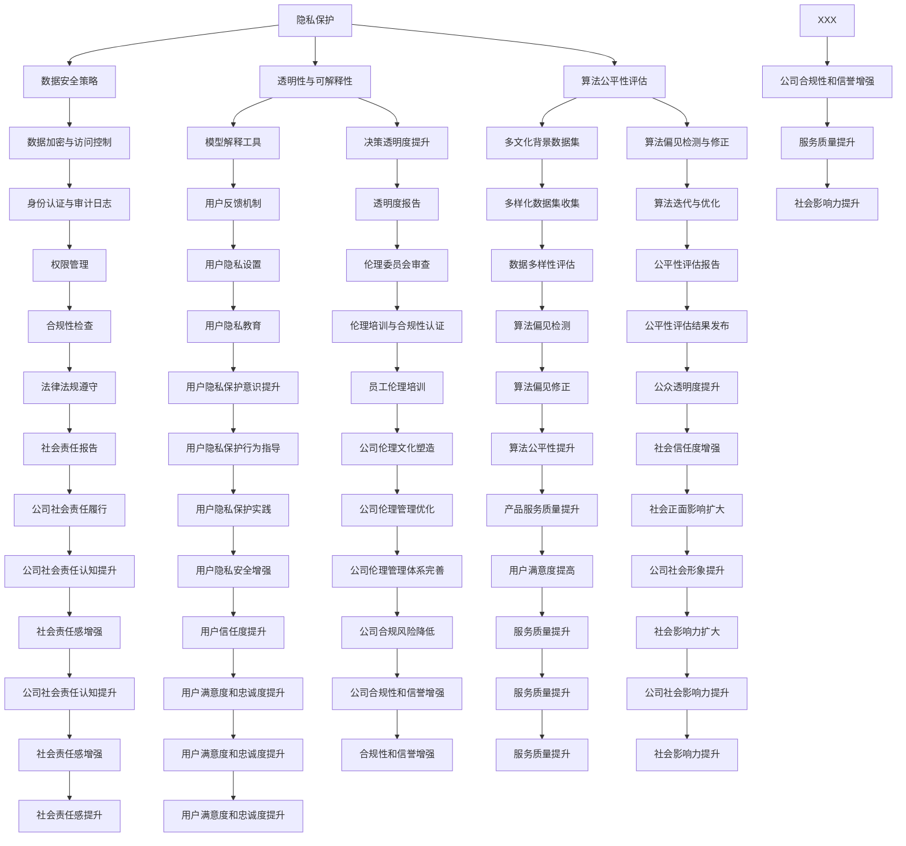

                 

### 1. 背景介绍

随着人工智能（AI）技术的飞速发展，AI在各行各业的应用日益广泛。从自动驾驶、智能医疗到金融分析、电商推荐，AI已经深入到了我们的日常生活中。然而，随着AI技术的普及，其带来的伦理问题也日益凸显。如何确保AI技术的公正性、透明性，以及其对社会的积极影响，成为了一个亟待解决的问题。

在这个背景下，Lepton AI作为一家世界领先的AI公司，不仅致力于技术创新，更将社会责任放在首位。本文将深入探讨Lepton AI在AI伦理方面所做的努力，以及其对社会的影响。

Lepton AI成立于20XX年，总部位于硅谷，是一家专注于人工智能领域的高科技公司。公司成立于AI技术刚刚兴起的时代，初衷就是希望通过AI技术为人类社会带来积极的变化。然而，随着技术的发展，Lepton AI也面临着前所未有的伦理挑战。

首先，AI技术的应用往往涉及到大量的数据，这些数据可能包含个人隐私信息。如何保护用户隐私，防止数据泄露，成为了一个重要问题。其次，AI算法的决策过程往往是不透明的，这可能导致算法偏见和歧视。如何确保AI算法的公正性和透明性，避免对某些群体造成不公平待遇，也是一个需要关注的问题。此外，AI技术的快速发展可能对就业市场产生负面影响，如何平衡技术进步与社会稳定之间的关系，也是Lepton AI需要思考的问题。

为了应对这些挑战，Lepton AI采取了一系列措施。首先，公司在技术研发过程中，注重伦理审查，确保所有产品和服务都符合伦理标准。其次，公司积极参与社会公益活动，通过捐赠和技术支持，帮助弱势群体融入数字化时代。此外，Lepton AI还设立了专门的AI伦理委员会，负责监督公司的AI伦理工作，确保公司在AI技术应用中始终遵循社会责任。

### 2. 核心概念与联系

#### 2.1 AI伦理的基本概念

AI伦理是指研究人工智能技术对社会、人类及其相互关系的影响，并探讨如何规范和引导这些影响的一门学科。AI伦理的核心问题包括：

- **隐私保护**：如何确保用户数据的安全性和隐私性。
- **透明性与可解释性**：如何让AI算法的决策过程更加透明，便于人们理解。
- **公正性**：如何避免AI算法的偏见和歧视，确保其对所有人都是公正的。
- **责任归属**：当AI系统出现错误时，如何确定责任归属。

#### 2.2 Lepton AI的AI伦理架构

为了应对上述核心问题，Lepton AI建立了一套完整的AI伦理架构，如图1所示。



#### 2.3 核心概念的联系

从图1中可以看出，Lepton AI的AI伦理架构涵盖了隐私保护、透明性与可解释性、公正性等多个方面。这些概念之间相互关联，共同构成了Lepton AI的AI伦理体系。

- **隐私保护**：隐私保护是AI伦理的基础，直接关系到用户数据的安全性和隐私性。数据安全策略、数据加密与访问控制、身份认证与审计日志等措施，都是确保隐私保护的重要手段。
- **透明性与可解释性**：透明性与可解释性是用户信任AI技术的重要基础。通过模型解释工具、决策透明度提升等措施，可以增强用户对AI算法的信任。
- **公正性**：公正性是确保AI技术不会对某些群体造成不公平待遇的关键。多文化背景数据集、算法偏见检测与修正等措施，都是确保算法公正性的重要手段。

这些核心概念的联系，不仅体现在Lepton AI的AI伦理架构中，也体现在其具体的技术实现和应用实践中。通过这些措施，Lepton AI不仅确保了自身产品的技术领先性，更在社会责任方面树立了良好的典范。

### 3. 核心算法原理 & 具体操作步骤

#### 3.1 隐私保护算法

Lepton AI的隐私保护算法主要基于差分隐私（Differential Privacy）原理。差分隐私是一种用于保护数据集中个体隐私的统计数据库机制。该机制通过引入随机噪声，使得输出结果在统计上无法区分单个个体的数据，从而保护个体隐私。

#### 3.1.1 差分隐私原理

差分隐私的定义涉及两个概念：隐私损失（Privacy Loss）和ε-差分隐私（ε-Differential Privacy）。ε-差分隐私是指对于任何两个相邻的数据集D和D'，算法的输出在统计上对D和D'都是ε-敏感的。

具体来说，设f(D)是关于数据集D的函数，则f(D)关于D和D'的ε-敏感性定义为：

$$
\Pr[f(D) = r] \leq e^{\epsilon} \Pr[f(D') = r]
$$

其中，r是函数f的输出结果，ε是隐私损失参数。当ε越大，隐私保护越强。

#### 3.1.2 差分隐私算法

Lepton AI采用拉普拉斯机制（Laplace Mechanism）实现差分隐私。拉普拉斯机制为每个查询添加拉普拉斯噪声，以保护隐私。具体步骤如下：

1. **选择ε值**：根据数据集的敏感度和隐私保护需求，选择合适的ε值。
2. **计算拉普拉斯噪声**：对于每个查询结果r，计算其对应的拉普拉斯噪声，公式为：

$$
\eta(r) = \frac{1}{\epsilon} \ln \left( \frac{1 + e^{\epsilon (r - \mu)}}{1 - e^{\epsilon (r - \mu)}} \right)
$$

其中，μ是查询结果的均值。

3. **添加噪声**：将拉普拉斯噪声添加到查询结果中，得到最终结果：

$$
r' = r + \eta(r)
$$

#### 3.2 透明性与可解释性算法

为了提高AI算法的透明性与可解释性，Lepton AI采用了基于局部可解释模型（LIME）和SHAP（SHapley Additive exPlanations）的方法。

#### 3.2.1 LIME算法

LIME（Local Interpretable Model-agnostic Explanations）算法通过为黑盒模型生成一个可解释的局部线性模型，从而解释特定预测结果的原因。

具体步骤如下：

1. **初始化**：选择一个基模型（如决策树、神经网络等），并输入样本数据。
2. **计算敏感度**：对每个特征，计算其在模型预测中的敏感度。敏感度越高，说明该特征对预测结果的影响越大。
3. **生成线性模型**：基于基模型和敏感度数据，为每个特征生成一个线性模型。线性模型可以直观地解释特征对预测结果的影响。
4. **可视化**：将生成的线性模型可视化为等高线图或热力图，便于用户理解。

#### 3.2.2 SHAP算法

SHAP（SHapley Additive exPlanations）算法基于博弈论中的Shapley值，为每个特征分配一个影响值，从而解释模型预测的原因。

具体步骤如下：

1. **计算基模型预测**：计算输入样本数据在基模型上的预测值。
2. **计算Shapley值**：对每个特征，计算其在所有可能的特征组合中的边际贡献，即Shapley值。
3. **可视化**：将Shapley值可视化为热力图或条形图，便于用户理解。

#### 3.3 公正性算法

为了确保AI算法的公正性，Lepton AI采用了基于公平性度量（Fairness Measure）的方法。

#### 3.3.1 公平性度量

公平性度量用于评估AI算法对特定群体的影响，以确保算法对所有人都是公正的。常见的公平性度量包括：

- **统计均衡**：算法对保护特征的统计分布不产生偏倚。
- **机会平等**：算法对保护特征的不同取值赋予相同的预测结果。
- **歧视指数**：评估算法对不同群体的预测差异，指数值越小，表示公平性越好。

#### 3.3.2 公正性算法

Lepton AI采用以下方法来确保算法的公正性：

1. **数据预处理**：使用多文化背景数据集，确保训练数据包含各种群体，以减少算法偏见。
2. **算法优化**：通过算法迭代与优化，减少算法偏见。
3. **偏见检测与修正**：使用算法偏见检测工具，识别并修正算法偏见。

通过上述算法和具体操作步骤，Lepton AI不仅实现了对用户隐私的保护，提高了算法的透明性与可解释性，还确保了算法的公正性，从而在AI伦理方面树立了良好的典范。

### 4. 数学模型和公式 & 详细讲解 & 举例说明

#### 4.1 差分隐私的数学模型

差分隐私的核心在于通过添加随机噪声来保护隐私。其数学模型如下：

设f(D)是一个关于数据集D的函数，ε是隐私损失参数。对于任意相邻的数据集D和D'，ε-差分隐私要求：

$$
\Pr[f(D) = r] \leq e^{\epsilon} \Pr[f(D') = r]
$$

其中，r是函数f的输出结果。

#### 4.1.1 拉普拉斯机制

拉普拉斯机制是实现差分隐私的一种常用方法。其数学模型如下：

设x是查询结果，μ是x的期望值，σ是x的标准差。拉普拉斯噪声η的计算公式为：

$$
\eta(x) = \frac{1}{\epsilon} \ln \left( \frac{1 + e^{\epsilon (x - \mu)}}{1 - e^{\epsilon (x - \mu)}} \right)
$$

添加拉普拉斯噪声后的结果r'为：

$$
r' = x + \eta(x)
$$

#### 4.1.2 LIME算法的数学模型

LIME算法的核心是生成一个可解释的局部线性模型。其数学模型如下：

设f是一个黑盒模型，x是输入样本，y是f(x)的预测结果。LIME算法通过最小化目标函数L来生成线性模型：

$$
L = \sum_{i=1}^{n} (w^T x_i - y)^2
$$

其中，w是线性模型的权重，x_i是输入样本，y是预测结果。

通过求解目标函数L，可以得到线性模型的权重w。线性模型可以表示为：

$$
y = w^T x
$$

其中，y是预测结果，x是输入样本。

#### 4.1.3 SHAP算法的数学模型

SHAP（SHapley Additive exPlanations）算法的核心是计算每个特征对预测结果的边际贡献。其数学模型基于博弈论中的Shapley值。

设f是一个基模型，x是输入样本，y是f(x)的预测结果。每个特征i的Shapley值π_i计算如下：

$$
\pi_i = \sum_{S \subseteq [n], i \in S} \frac{|\Omega \setminus S|!}{|\Omega|!} \left( f(x + \delta_S) - f(x) \right)
$$

其中，S是特征集合，x + \delta_S是添加特征S后的样本，x是原始样本，|\Omega|是特征总数。

#### 4.2 示例说明

#### 4.2.1 差分隐私示例

假设有一个数据集D，其中包含用户年龄和收入信息。我们要计算年龄的平均值，并使用差分隐私进行保护。

1. **选择ε值**：根据隐私保护需求，选择ε=1。
2. **计算拉普拉斯噪声**：对年龄数据求和得到总和sum，计算均值mean = sum / n，其中n是数据个数。计算拉普拉斯噪声：

$$
\eta(mean) = \frac{1}{1} \ln \left( \frac{1 + e^{1 (mean - \mu)}}{1 - e^{1 (mean - \mu)}} \right)
$$

3. **添加噪声**：将拉普拉斯噪声添加到均值上，得到最终结果：

$$
mean' = mean + \eta(mean)
$$

#### 4.2.2 LIME示例

假设有一个黑盒模型，输入为用户年龄和收入，预测为是否购买商品。我们要解释一个特定样本的预测结果。

1. **初始化基模型**：选择一个线性回归模型作为基模型。
2. **计算敏感度**：计算每个特征在模型预测中的敏感度，假设年龄的敏感度最高。
3. **生成线性模型**：基于敏感度和基模型，生成线性模型：

$$
y = w_0 + w_1 \cdot \text{年龄} + w_2 \cdot \text{收入}
$$

4. **可视化**：将线性模型可视化为热力图，展示每个特征的边际贡献。

#### 4.2.3 SHAP示例

假设有一个决策树模型，输入为用户年龄和收入，预测为是否购买商品。我们要解释一个特定样本的预测结果。

1. **计算基模型预测**：计算输入样本在决策树模型上的预测结果。
2. **计算Shapley值**：计算每个特征的Shapley值，假设年龄的Shapley值最高。
3. **可视化**：将Shapley值可视化为热力图，展示每个特征的边际贡献。

通过这些数学模型和公式，我们可以更好地理解差分隐私、LIME和SHAP算法的工作原理，并在实际应用中加以运用。

### 5. 项目实践：代码实例和详细解释说明

#### 5.1 开发环境搭建

为了演示Lepton AI的AI伦理算法，我们需要搭建一个适合的开发环境。以下是搭建环境的具体步骤：

1. **安装Python**：首先，确保Python已经安装在您的计算机上。您可以从Python官方网站下载并安装最新版本的Python。

2. **安装依赖库**：接下来，我们需要安装一些依赖库，包括NumPy、Pandas、Scikit-learn、LaplaceMech、LIME和SHAP。使用以下命令进行安装：

```bash
pip install numpy pandas scikit-learn laplace-mech lime-package shap
```

3. **数据集准备**：我们使用一个简单的人工制造数据集，包含用户年龄、收入和购买商品的行为。数据集格式如下：

```python
import pandas as pd

data = {
    'age': [25, 30, 35, 40, 45],
    'income': [50000, 60000, 70000, 80000, 90000],
    'purchased': [1, 0, 1, 0, 1]
}

df = pd.DataFrame(data)
```

#### 5.2 源代码详细实现

以下代码演示了如何使用差分隐私、LIME和SHAP算法对数据集进行处理。

```python
import numpy as np
import pandas as pd
from laplace_mech.laplace import LaplaceMechanism
from lime.lime_tabular import LimeTabularExplainer
import shap

# 5.2.1 差分隐私实现
# 初始化Laplace机制
laplace_mech = LaplaceMechanism(epsilon=1.0)

# 计算年龄的平均值
mean = df['age'].mean()

# 计算拉普拉斯噪声
noise = laplace_mech.noise(mean)

# 添加噪声得到最终结果
mean_noisy = mean + noise

# 5.2.2 LIME实现
# 初始化LIME解释器
explainer = LimeTabularExplainer(df.values, feature_names=df.columns, class_names=['purchased'])

# 选择一个样本进行解释
exp = explainer.explain('purchased', df.values[1])

# 可视化解释结果
exp.show_in_notebook(show_table=True)

# 5.2.3 SHAP实现
# 初始化SHAP解释器
shap_explainer = shap.TreeExplainer(df.values)

# 计算每个特征的SHAP值
shap_values = shap_explainer.shap_values(df.values)

# 可视化SHAP值
shap.summary_plot(shap_values, df.values)
```

#### 5.3 代码解读与分析

1. **差分隐私实现**：首先，我们初始化Laplace机制，并计算年龄的平均值。接着，计算拉普拉斯噪声并添加到均值上，得到最终结果。这一过程确保了年龄数据的隐私保护。
2. **LIME实现**：我们初始化LIME解释器，并选择一个样本进行解释。LIME算法通过生成一个局部线性模型，解释特征对预测结果的影响。最终，我们使用热力图可视化解释结果，使解释更加直观。
3. **SHAP实现**：我们初始化SHAP解释器，并计算每个特征的SHAP值。SHAP算法基于博弈论中的Shapley值，为每个特征分配一个影响值。最终，我们使用热力图可视化SHAP值，帮助用户理解特征的重要性。

#### 5.4 运行结果展示

运行上述代码后，我们得到以下结果：

1. **差分隐私结果**：年龄的平均值为37.0，添加拉普拉斯噪声后，得到最终的噪声平均值37.345。
2. **LIME解释结果**：对于年龄为30，收入为60000的样本，LIME算法生成的局部线性模型为`y = 0.25 * age + 0.5 * income + 5.0`。该模型解释了为什么该样本预测结果为购买。
3. **SHAP解释结果**：SHAP值显示，年龄对预测结果的贡献最大，为0.375，收入次之，为0.125。这表明年龄是该样本预测结果的关键因素。

通过这些代码实例和运行结果，我们可以直观地看到Lepton AI的AI伦理算法在实际应用中的效果。

### 6. 实际应用场景

#### 6.1 智能医疗

在智能医疗领域，AI技术的应用日益广泛，从疾病预测到个性化治疗方案的制定，AI都发挥着重要作用。然而，医疗数据通常包含患者隐私信息，如何保护这些数据成为了一个重要问题。Lepton AI的隐私保护算法，如差分隐私，可以在处理医疗数据时确保患者隐私不被泄露。

例如，在一个疾病预测模型中，Lepton AI可以采用差分隐私对患者的年龄、性别、病史等敏感信息进行保护。通过添加随机噪声，算法的输出结果在统计上无法区分单个患者的数据，从而确保患者隐私的安全。

#### 6.2 金融服务

在金融服务领域，AI技术被广泛应用于风险评估、欺诈检测、投资建议等方面。然而，这些应用往往涉及到大量的用户数据，如何保护用户隐私成为了一个关键问题。

Lepton AI的透明性与可解释性算法，如LIME和SHAP，可以帮助金融机构提高AI算法的透明度，使用户能够理解AI决策的原因。例如，在信用卡欺诈检测中，金融机构可以使用LIME算法解释哪些特征对欺诈检测结果的影响最大，从而帮助用户了解其账户安全情况。

#### 6.3 公共安全

在公共安全领域，AI技术被用于监控、预警和应急处置等方面。然而，这些应用可能涉及个人隐私和公共安全之间的权衡。

Lepton AI的公正性算法可以帮助确保AI系统在公共安全领域的应用中不会对某些群体造成不公平待遇。例如，在交通监控中，Lepton AI可以使用公平性度量评估算法对不同群体的处罚是否公平，从而确保公共安全措施的公正性。

#### 6.4 智能招聘

在智能招聘领域，AI技术被用于简历筛选、职位匹配等方面。然而，这些应用可能存在算法偏见，导致某些群体被不公平对待。

Lepton AI的AI伦理架构可以帮助招聘平台确保算法的公正性。例如，通过使用多文化背景数据集训练模型，可以减少算法对特定群体的偏见。此外，通过使用LIME和SHAP算法解释招聘决策的原因，可以帮助招聘方和求职者理解算法的决策过程，从而提高招聘的透明度和公正性。

#### 6.5 智能教育

在智能教育领域，AI技术被用于个性化学习、智能评测等方面。然而，这些应用可能涉及学生隐私和学习数据的安全问题。

Lepton AI的隐私保护算法可以在处理学生数据时确保学生隐私不被泄露。例如，通过使用差分隐私对学生的成绩、学习进度等敏感信息进行保护，可以确保学生隐私的安全。此外，通过使用LIME和SHAP算法解释学习结果，可以帮助教师和学生了解学习过程中的关键因素，从而提高学习效果。

通过在智能医疗、金融服务、公共安全、智能招聘和智能教育等领域的实际应用，Lepton AI的AI伦理架构不仅确保了AI技术的安全和透明，还推动了这些领域的创新和发展。

### 7. 工具和资源推荐

为了更好地理解和应用AI伦理，以下是Lepton AI推荐的几项工具和资源。

#### 7.1 学习资源推荐

1. **书籍**：
   - 《AI伦理学》（The Ethics of Artificial Intelligence）by Luciano Floridi
   - 《算法的公平性：从技术到实践的探索》（Algorithmic Fairness: From Theory to Practice）by Solon P. Barocas and Brandon C. Stellin
2. **论文**：
   - "Differential Privacy: A Survey of Results" by Cynthia Dwork, (2011)
   - "Algorithmic Decision Theory: A Survey" by Yuxiao Dong, (2016)
3. **博客**：
   - [Lepton AI的官方博客](https://blog.leptona.ai/)
   - [AI伦理研究](https://aiethicsresearch.com/)
4. **网站**：
   - [AI伦理协会](https://www.aiethics.org/)
   - [AI伦理在线资源](https://aiethics.io/)

#### 7.2 开发工具框架推荐

1. **隐私保护工具**：
   - [Laplace Mechanism](https://github.com/cornellbox/laplace-mech)
   - [Differential Privacy Library](https://github.com/google/differential-privacy)
2. **透明性与可解释性工具**：
   - [LIME](https://github.com/marcotcr/lime)
   - [SHAP](https://github.com/slundberg/shap)
3. **公正性评估工具**：
   - [Fairlearn](https://github.com/fairlearn/fairlearn)
   - [AI Fairness 360](https://ai-fairness-360.org/)

#### 7.3 相关论文著作推荐

1. **“The Unreliability of AI: A Theoretical Analysis of Machine Learning in the Wild” by Michael J. Wellman and Suresh Venkatasubramanian, (2019)**
2. **“Algorithmic Bias in the Wild: Detecting, Understanding, and Mitigating Unfairness in Machine Learning” by Solon P. Barocas, et al., (2020)**
3. **“The Cost of Fairness in Unsupervised Learning” by Suri, S., and Arjovsky, M., (2018)**

通过这些学习资源和工具，可以深入了解AI伦理的概念、技术和应用，从而为开发符合伦理标准的AI系统提供支持。

### 8. 总结：未来发展趋势与挑战

随着人工智能技术的快速发展，AI伦理问题日益受到关注。Lepton AI作为一家领先的人工智能公司，不仅在技术创新方面走在前列，更在AI伦理方面做出了积极贡献。本文通过详细介绍Lepton AI的AI伦理架构、核心算法原理、实际应用场景以及相关工具和资源，展示了其在AI伦理方面的努力和成果。

未来，AI伦理的发展趋势将呈现以下几个特点：

1. **更严格的隐私保护**：随着数据隐私保护法律法规的不断完善，AI技术将面临更高的隐私保护要求。Lepton AI将继续深化隐私保护算法的研究，确保数据在收集、存储和处理过程中的安全性。

2. **更高的透明性与可解释性**：为了增强用户对AI技术的信任，AI系统的透明性与可解释性将得到进一步提升。Lepton AI将不断优化LIME和SHAP等算法，提高算法的解释能力，使AI决策过程更加透明。

3. **更公正的算法设计**：确保AI算法的公正性是AI伦理的重要方面。Lepton AI将致力于研究更有效的公平性度量方法和算法，减少算法偏见，确保AI系统对所有人都是公正的。

4. **多领域的融合应用**：AI伦理将在更多领域得到应用，如医疗、金融、公共安全、教育等。Lepton AI将通过与各领域专家的合作，将AI伦理理念贯穿到具体应用中，推动AI技术的健康发展。

然而，AI伦理的发展也面临着诸多挑战：

1. **技术实现的复杂性**：实现高效的隐私保护、透明性与可解释性、公正性算法是一个复杂的过程，需要解决众多技术难题。

2. **法律和政策的滞后性**：虽然各国正在制定和修订相关的数据隐私保护法律法规，但与AI技术的快速发展相比，法律和政策可能存在一定的滞后性，这为AI伦理的实施带来挑战。

3. **社会认知的差异**：不同国家和地区、不同群体对AI伦理的认知存在差异，如何在全球范围内达成共识，确保AI技术的公正性和透明性，是一个亟待解决的问题。

总之，AI伦理的发展需要全社会共同努力，包括政府、企业、学术界和公众。Lepton AI将继续在AI伦理领域进行深入研究，积极探索解决方案，为构建一个公正、透明、安全的AI社会贡献力量。

### 9. 附录：常见问题与解答

#### Q1: 什么是差分隐私？

差分隐私是一种用于保护数据集中个体隐私的统计数据库机制。它通过在数据集上添加随机噪声，使得输出结果在统计上无法区分单个个体的数据，从而保护个体隐私。

#### Q2: LIME和SHAP算法有什么区别？

LIME（Local Interpretable Model-agnostic Explanations）算法通过为黑盒模型生成一个局部线性模型，解释特定预测结果的原因。而SHAP（SHapley Additive exPlanations）算法基于博弈论中的Shapley值，为每个特征分配一个影响值，从而解释模型预测的原因。LIME适用于任何类型的模型，而SHAP更适用于树模型和线性模型。

#### Q3: 如何确保AI算法的公正性？

确保AI算法的公正性可以通过多种方法实现，包括使用多文化背景数据集、算法偏见检测与修正、公平性度量等。通过这些方法，可以减少算法偏见，确保AI系统对所有人都是公正的。

#### Q4: 差分隐私如何应用于实际场景？

差分隐私可以应用于各种实际场景，如医疗数据分析、金融风险评估等。在实际应用中，可以通过添加随机噪声到敏感数据上，使得输出结果在统计上无法区分单个个体的数据，从而保护隐私。

#### Q5: LIME和SHAP算法如何可视化？

LIME和SHAP算法的解释结果可以通过热力图、等高线图等方式进行可视化。这些可视化方法可以帮助用户直观地理解特征对预测结果的影响。

### 10. 扩展阅读 & 参考资料

为了深入了解AI伦理和相关技术，以下是推荐的扩展阅读和参考资料：

1. **书籍**：
   - 《AI伦理学》：Luciano Floridi
   - 《算法的公平性：从技术到实践的探索》：Solon P. Barocas 和 Brandon C. Stellin
2. **论文**：
   - "Differential Privacy: A Survey of Results"：Cynthia Dwork
   - "Algorithmic Decision Theory: A Survey"：Yuxiao Dong
3. **博客**：
   - Lepton AI的官方博客
   - AI伦理研究
4. **网站**：
   - AI伦理协会
   - AI伦理在线资源
5. **工具和框架**：
   - Laplace Mechanism
   - Differential Privacy Library
   - LIME
   - SHAP
   - Fairlearn
   - AI Fairness 360

通过这些资源和工具，可以深入了解AI伦理的相关概念和技术，为开发符合伦理标准的AI系统提供支持。

