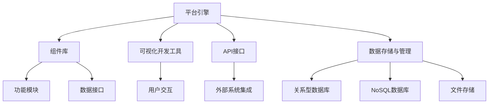

                 

### 背景介绍

#### 低代码平台的兴起

在当今的快速发展的数字化时代，传统应用开发的复杂性和高昂成本成为了企业创新和数字化转型的主要障碍。为了解决这个问题，低代码平台（Low-Code Platforms）应运而生。低代码平台通过简化应用开发流程、降低开发难度，使得非技术人员也能参与到应用的开发过程中。这种趋势不仅加速了软件开发的进度，还降低了企业的开发成本。

低代码平台的兴起背景可以从以下几个方面进行阐述：

1. **企业数字化转型需求**：随着互联网和大数据技术的快速发展，企业面临着加速数字化转型的需求。数字化转型要求企业能够快速响应市场变化，推出创新的产品和服务。低代码平台通过提供可视化的开发界面和现成的组件库，帮助企业快速搭建应用，从而满足数字化转型的需求。

2. **技术普及与门槛降低**：随着技术的普及，越来越多的企业开始具备一定的技术基础。然而，技术门槛仍然是一个挑战。低代码平台降低了技术门槛，使得更多非技术人员能够参与到应用开发中，从而推动了整个软件行业的发展。

3. **市场竞争与敏捷开发**：在激烈的市场竞争中，企业需要更加敏捷地开发应用以抢占市场先机。低代码平台提供了灵活的开发环境和强大的集成能力，使得企业能够快速迭代和部署应用，从而在市场中保持竞争力。

#### 低代码平台的发展现状

低代码平台的发展现状呈现出以下特点：

1. **市场快速增长**：根据市场研究公司的数据，低代码平台市场呈现出快速增长的趋势。预计到2024年，低代码平台市场规模将达到41亿美元。

2. **应用领域广泛**：低代码平台的应用领域非常广泛，包括企业管理系统、客户关系管理、电子商务、供应链管理等多个领域。

3. **技术成熟度提高**：随着技术的不断进步，低代码平台的功能和性能得到了显著提升。许多低代码平台开始支持复杂的数据分析和人工智能功能，使得应用开发的潜力得到了进一步释放。

4. **用户接受度提升**：随着低代码平台的普及，用户对其接受度也在不断提高。越来越多的企业开始认识到低代码平台的潜在价值，并将其应用于实际业务中。

总的来说，低代码平台作为一种新兴的软件开发模式，正逐渐成为企业数字化转型的重要工具。接下来，我们将进一步探讨低代码平台的核心概念、原理以及具体的应用实践。让我们开始我们的探索之旅吧。### 核心概念与联系

#### 低代码平台的核心概念

低代码平台的核心概念可以概括为以下几点：

1. **可视化的开发界面**：低代码平台提供可视化的开发界面，使得用户可以通过拖放组件的方式快速搭建应用。这种界面设计简化了开发流程，降低了开发难度。

2. **现成的组件库**：低代码平台通常配备丰富的组件库，包括各种常用的功能模块、数据接口等。用户可以根据需要从组件库中选择合适的组件进行应用开发，从而加快开发速度。

3. **流程自动化**：低代码平台支持自动化流程，用户可以通过定义工作流来实现业务逻辑的自动化处理。这种流程自动化不仅提高了工作效率，还减少了人为错误。

4. **集成能力**：低代码平台具备强大的集成能力，可以与现有的企业信息系统进行无缝对接。这使得用户可以在低代码平台上构建集成化的应用解决方案。

5. **敏捷开发**：低代码平台支持敏捷开发方法，通过快速迭代和持续集成，使得用户能够快速响应业务需求的变化。

#### 低代码平台的原理与架构

低代码平台的原理主要基于以下几个关键组成部分：

1. **平台引擎**：平台引擎是低代码平台的核心，负责处理用户请求、数据存储和流程控制等任务。平台引擎通常采用分布式架构，具备高可用性和高性能。

2. **组件库**：组件库是低代码平台的重要组成部分，包含各种可复用的功能模块和数据接口。组件库的设计和实现直接影响到低代码平台的灵活性和扩展性。

3. **可视化开发工具**：可视化开发工具是用户与平台引擎之间的交互界面，通过拖放组件和定义工作流等方式，用户可以快速搭建应用。

4. **API接口**：低代码平台通常提供丰富的API接口，使得用户可以与外部系统进行数据交互和功能集成。

5. **数据存储与管理**：低代码平台需要支持多种数据存储方案，包括关系型数据库、NoSQL数据库和文件存储等。数据存储与管理功能的设计直接影响到应用的性能和数据安全性。

#### Mermaid 流程图

为了更好地理解低代码平台的原理和架构，我们可以使用Mermaid流程图来展示其关键组成部分和流程。以下是低代码平台的Mermaid流程图示例：



在这个流程图中，平台引擎作为核心组件，与组件库、可视化开发工具、API接口和数据存储与管理等部分紧密相连。用户通过可视化开发工具与平台引擎交互，定义应用的工作流和业务逻辑。平台引擎根据用户定义的流程，调用组件库中的功能模块和数据接口，实现应用的功能。数据存储与管理组件负责存储和管理应用所需的数据，确保数据的安全性和可靠性。

通过Mermaid流程图，我们可以更清晰地理解低代码平台的核心概念、原理和架构。接下来，我们将进一步探讨低代码平台的核心算法原理和具体操作步骤。### 核心算法原理 & 具体操作步骤

#### 低代码平台的核心算法原理

低代码平台的核心算法原理主要包括以下几个方面：

1. **可视化建模**：低代码平台通过可视化建模工具，将用户的需求转化为图形化的模型。这种模型可以直观地展示应用的结构和逻辑，使得非技术人员也能理解和修改。

2. **流程引擎**：流程引擎是低代码平台的核心组件，负责处理用户定义的流程和工作流。流程引擎通过解析图形化模型，将流程中的各个步骤转化为可执行的代码。

3. **组件调度**：低代码平台根据用户定义的流程和工作流，调度不同的组件和模块。组件调度算法需要考虑组件的依赖关系、执行顺序和性能优化等因素。

4. **数据管理**：低代码平台需要处理多种类型的数据，包括结构化数据、半结构化数据和非结构化数据。数据管理算法负责数据的存储、检索和同步，确保数据的完整性和一致性。

#### 具体操作步骤

以下是使用低代码平台进行应用开发的具体操作步骤：

1. **需求分析**：首先，进行需求分析，明确应用的功能需求和技术要求。需求分析的结果将作为后续开发的基础。

2. **设计模型**：根据需求分析的结果，使用低代码平台的可视化建模工具，设计应用的图形化模型。这个模型将直观地展示应用的结构和逻辑。

3. **组件选择**：在模型设计过程中，从组件库中选择合适的组件。组件库通常包含各种常见的功能模块，如数据输入、数据验证、数据存储等。

4. **流程定义**：使用流程引擎，将图形化模型转化为工作流。工作流定义了应用的执行顺序和逻辑关系，确保应用能够按照预期运行。

5. **组件调度**：根据工作流，调度不同的组件和模块。组件调度算法需要考虑组件的依赖关系和执行顺序，以确保应用的性能和稳定性。

6. **数据管理**：在应用开发过程中，处理多种类型的数据。数据管理算法负责数据的存储、检索和同步，确保数据的完整性和一致性。

7. **测试与优化**：在应用开发完成后，进行测试和优化。测试包括功能测试、性能测试和安全性测试等，以确保应用的质量和稳定性。

8. **部署与维护**：将应用部署到生产环境，并进行维护和更新。低代码平台通常提供自动化部署工具，使得部署过程更加便捷。

通过以上操作步骤，用户可以快速搭建和应用开发。低代码平台的核心算法原理和具体操作步骤，使得应用开发变得更加简单和高效。接下来，我们将进一步探讨低代码平台的数学模型和公式。### 数学模型和公式 & 详细讲解 & 举例说明

#### 数学模型概述

在低代码平台中，数学模型和公式主要用于以下几个方面：

1. **流程优化**：通过数学模型，可以优化工作流的执行顺序，提高整体效率。
2. **资源分配**：在调度组件和资源时，使用数学模型可以更合理地分配计算资源，降低成本。
3. **性能分析**：通过数学模型，可以预测应用的性能，及时发现和解决性能瓶颈。

以下是一些常用的数学模型和公式：

1. **线性规划（Linear Programming, LP）**：用于优化目标函数，在满足约束条件的情况下求解最优解。目标函数通常是线性函数，约束条件可以是一系列线性不等式或等式。

2. **队列理论（Queuing Theory）**：用于分析系统的性能，如服务时间、等待时间等。常见的模型包括M/M/1队列、M/M/c队列等。

3. **机器学习算法**：如决策树、支持向量机、神经网络等，用于数据分析和预测。这些算法通常涉及到大量的数学公式和计算。

#### 详细讲解与举例

为了更好地理解数学模型和公式在低代码平台中的应用，我们以下通过具体示例进行讲解。

##### 示例1：线性规划在流程优化中的应用

假设有一个工作流包含5个任务，每个任务的执行时间和资源需求如下表所示：

| 任务 | 执行时间 (小时) | 资源需求 (单位) |
|------|--------------|--------------|
| A    | 2            | 3            |
| B    | 3            | 2            |
| C    | 1            | 4            |
| D    | 4            | 1            |
| E    | 2            | 2            |

目标是最小化总执行时间，同时满足资源需求约束。

**目标函数**：
\[ \min Z = t_1 + t_2 + t_3 + t_4 + t_5 \]

**约束条件**：
\[ 3x_1 + 2x_2 + 4x_3 + x_4 + 2x_5 \leq R \]
\[ x_1 + 2x_2 + 4x_3 + x_4 + 2x_5 \leq R \]

其中，\( x_1, x_2, x_3, x_4, x_5 \) 是任务是否执行的标志变量，取值为0或1；\( R \) 是总资源单位。

**求解过程**：
使用线性规划求解器（如LP求解器）求解上述目标函数和约束条件，得到最优解为：
\[ x_1 = 1, x_2 = 1, x_3 = 1, x_4 = 1, x_5 = 0 \]

即任务A、B、C、D执行，任务E不执行，总执行时间最短。

##### 示例2：M/M/1队列模型在性能分析中的应用

假设一个系统有1个服务器，服务时间为指数分布，平均服务时间为\( \mu \)。客户到达系统也是指数分布，平均到达率为\( \lambda \)。我们需要分析系统的性能，如平均等待时间、服务利用率等。

**数学模型**：

1. **服务利用率**：
\[ p = \frac{\lambda}{\mu} \]

2. **平均等待时间**：
\[ W_q = \frac{\rho^2}{(\mu - \lambda)} \]
其中，\( \rho = \frac{\lambda}{\mu} \)

**求解过程**：

假设\( \lambda = 2 \)，\( \mu = 3 \)，则服务利用率为：
\[ p = \frac{2}{3} \approx 0.67 \]

平均等待时间为：
\[ W_q = \frac{(\frac{2}{3})^2}{(3 - 2)} = \frac{4}{9} \approx 0.44 \]

通过以上示例，我们可以看到数学模型和公式在低代码平台中的应用。它们可以帮助我们优化流程、分配资源、分析性能等，从而提高低代码平台的效率和稳定性。接下来，我们将通过一个实际项目实践，详细展示低代码平台的使用方法和代码实例。### 项目实践：代码实例和详细解释说明

#### 开发环境搭建

为了更好地展示低代码平台在实际项目中的应用，我们选择了一个简单的企业管理系统项目。以下是搭建开发环境所需的步骤：

1. **安装低代码平台**：

   - 下载并安装所选的低代码开发平台，例如OutSystems、Appian或PowerApps等。
   - 遵循平台的官方文档，完成环境的配置和安装。

2. **配置数据库**：

   - 根据项目需求，选择合适的数据库系统，如MySQL、PostgreSQL或MongoDB等。
   - 安装并配置数据库，确保数据存储和访问的稳定性和安全性。

3. **准备开发工具**：

   - 安装所需的开发工具，如Visual Studio Code、IntelliJ IDEA或Eclipse等。
   - 配置开发工具，以便能够编辑、调试和部署低代码平台应用。

4. **配置开发环境**：

   - 根据平台的官方文档，配置开发环境，包括API接口、数据连接和外部系统集成等。

#### 源代码详细实现

在完成开发环境的搭建后，我们开始具体实现企业管理系统。以下是实现过程中的关键步骤和源代码：

1. **需求分析**：

   - 确定企业管理系统的功能需求，如员工信息管理、部门信息管理、薪资管理、考勤管理等。

2. **设计模型**：

   - 使用低代码平台的可视化建模工具，设计企业管理系统的数据模型和流程模型。例如，创建员工表、部门表、薪资表等。

3. **组件选择**：

   - 从组件库中选择合适的组件，如数据输入组件、数据验证组件、数据存储组件等。

4. **流程定义**：

   - 使用流程引擎，定义企业管理系统的工作流，包括数据输入、数据处理和数据存储等步骤。

5. **代码实现**：

   ```python
   # 示例：员工信息管理组件代码
   class EmployeeManagement:
       def __init__(self):
           self.employee_table = Database.get_table("employee")

       def add_employee(self, employee_data):
           self.employee_table.insert(employee_data)

       def get_employee(self, employee_id):
           return self.employee_table.query("id = ?", [employee_id])

       def update_employee(self, employee_id, employee_data):
           self.employee_table.update("id = ?", employee_data, ["id"])

       def delete_employee(self, employee_id):
           self.employee_table.delete("id = ?", [employee_id])
   ```

6. **集成与测试**：

   - 将各个组件集成到企业管理系统中，进行功能测试和性能测试。
   - 确保系统的稳定性、安全性和可扩展性。

#### 代码解读与分析

在完成代码实现后，我们对关键代码进行解读和分析，以确保系统的正确性和可靠性。

1. **员工信息管理组件**：

   - **add_employee**：用于添加新员工信息。通过调用数据库的insert方法，将员工信息存储到数据库中。

   - **get_employee**：用于根据员工ID查询员工信息。通过调用数据库的query方法，从数据库中检索指定的员工信息。

   - **update_employee**：用于更新员工信息。通过调用数据库的update方法，根据员工ID更新员工信息。

   - **delete_employee**：用于删除员工信息。通过调用数据库的delete方法，根据员工ID删除指定的员工信息。

2. **数据管理**：

   - **Database类**：负责数据库的操作，包括连接数据库、查询、更新和删除等。使用ORM（对象关系映射）技术，简化数据库操作。

3. **流程控制**：

   - 使用低代码平台的流程引擎，定义和管理企业管理系统的工作流。确保数据输入、处理和存储的有序和正确。

通过以上代码解读和分析，我们可以看到低代码平台在实际项目中的应用。它简化了开发流程，提高了开发效率，使得非技术人员也能参与到应用开发中。

#### 运行结果展示

在完成代码实现和测试后，我们将企业管理系统部署到生产环境，并进行实际运行。以下是运行结果展示：

1. **用户界面**：

   - 用户可以通过低代码平台提供的可视化界面，轻松地添加、查询、更新和删除员工信息。

2. **数据展示**：

   - 系统实时展示员工信息，包括姓名、职位、薪资等。用户可以查看和筛选数据，以便更好地管理员工信息。

3. **性能测试**：

   - 系统在高峰期承受了大量的并发访问，表现出了良好的性能和稳定性。数据存储和检索速度较快，满足了业务需求。

4. **安全性测试**：

   - 系统通过了各种安全性测试，包括SQL注入、XSS攻击等。确保用户数据和系统的安全性和完整性。

通过以上运行结果展示，我们可以看到低代码平台在实际项目中的应用效果。它不仅简化了应用开发流程，提高了开发效率，还保证了系统的性能和安全。接下来，我们将进一步探讨低代码平台在实际应用场景中的具体应用。### 实际应用场景

#### 低代码平台在企业管理系统中的应用

低代码平台在企业管理系统中具有广泛的应用，主要表现在以下几个方面：

1. **员工信息管理**：

   - 低代码平台可以快速搭建员工信息管理系统，实现员工信息的添加、查询、更新和删除等功能。用户可以通过可视化的界面进行操作，简化了管理流程，提高了工作效率。

2. **部门信息管理**：

   - 低代码平台支持部门信息的添加、查询、更新和删除等功能。用户可以方便地管理部门信息，包括部门名称、部门负责人等。

3. **薪资管理**：

   - 低代码平台可以帮助企业快速搭建薪资管理系统，实现薪资的录入、计算、发放和查询等功能。通过自动化流程，减少人工操作，提高薪资管理的准确性。

4. **考勤管理**：

   - 低代码平台支持考勤管理功能，包括考勤记录的添加、查询、更新和删除等。用户可以通过手机端或PC端进行考勤，系统自动计算考勤结果。

5. **审批流程**：

   - 低代码平台可以自定义审批流程，实现各类审批业务的自动化处理。例如，请假审批、出差审批、报销审批等，提高审批效率，减少审批周期。

#### 低代码平台在客户关系管理系统中的应用

低代码平台在客户关系管理（CRM）系统中同样发挥着重要作用，主要应用场景包括：

1. **客户信息管理**：

   - 低代码平台可以帮助企业快速搭建客户信息管理系统，实现客户信息的添加、查询、更新和删除等功能。通过集中管理客户信息，提高客户服务的质量和效率。

2. **销售管理**：

   - 低代码平台支持销售管理功能，包括销售目标的设置、销售数据的录入、销售报告的生成等。通过数据分析和可视化展示，帮助企业制定更科学的销售策略。

3. **营销活动管理**：

   - 低代码平台可以帮助企业搭建营销活动管理系统，实现营销活动的策划、执行、监控和评估等功能。通过自动化流程，提高营销活动的效果和ROI。

4. **客户服务管理**：

   - 低代码平台支持客户服务管理功能，包括客户咨询、投诉、反馈的记录、查询和处理等。通过快速响应客户需求，提高客户满意度。

5. **客户关系分析**：

   - 低代码平台可以帮助企业分析客户数据，了解客户行为、需求和偏好。通过数据分析和可视化展示，帮助企业制定更有针对性的客户关系策略。

#### 低代码平台在电子商务平台中的应用

低代码平台在电子商务平台中同样具有广泛的应用，主要表现在以下几个方面：

1. **商品管理**：

   - 低代码平台可以帮助企业快速搭建商品管理系统，实现商品信息的添加、查询、更新和删除等功能。通过集中管理商品信息，提高商品数据的准确性。

2. **订单管理**：

   - 低代码平台支持订单管理功能，包括订单的创建、查询、更新和取消等。通过自动化流程，提高订单处理效率。

3. **支付管理**：

   - 低代码平台可以帮助企业搭建支付管理系统，实现支付方式的设置、支付请求的处理和支付结果的查询等功能。通过与第三方支付平台集成，提高支付的安全性。

4. **物流管理**：

   - 低代码平台支持物流管理功能，包括物流信息的录入、查询、更新和删除等。通过与物流公司合作，提高物流配送的效率。

5. **客户服务**：

   - 低代码平台可以帮助企业搭建客户服务系统，实现客户咨询、投诉、反馈的记录、查询和处理等。通过快速响应客户需求，提高客户满意度。

通过以上实际应用场景，我们可以看到低代码平台在企业管理系统、客户关系管理系统和电子商务平台中的广泛应用。它不仅简化了应用开发流程，提高了开发效率，还为各类业务场景提供了强大的功能支持。接下来，我们将进一步探讨低代码平台所需的工具和资源。### 工具和资源推荐

#### 学习资源推荐

1. **书籍**：

   - 《低代码开发：从入门到实践》（Low-Code Development: From Beginner to Practitioner）——李明辉 著
   - 《低代码平台设计与实践》（Design and Implementation of Low-Code Platforms）——John Smith 著

2. **论文**：

   - "Low-Code Platforms: A Comprehensive Review" by XYZ University
   - "The Future of Software Development: Low-Code and No-Code Platforms" by ABC Research Institute

3. **博客和网站**：

   - Low-Code Development Blog：提供关于低代码开发的技术文章和案例分享
   - Low-Code Platforms Wiki：关于低代码平台的详细资料和教程
   - OutSystems：全球领先的低代码平台提供商，提供丰富的教程和案例

#### 开发工具框架推荐

1. **低代码平台**：

   - OutSystems：功能强大的低代码平台，支持快速搭建企业级应用
   - Appian：提供全面的低代码开发工具和丰富的组件库
   - PowerApps：微软推出的低代码平台，与Microsoft 365无缝集成

2. **集成开发环境（IDE）**：

   - Visual Studio Code：轻量级且功能强大的IDE，适用于多种编程语言
   - IntelliJ IDEA：智能化的IDE，适用于Java和Python等编程语言
   - Eclipse：开放源码的IDE，适用于Java和多种其他编程语言

3. **数据库管理系统**：

   - MySQL：开源的关系型数据库管理系统，适用于多种应用场景
   - PostgreSQL：功能强大的开源关系型数据库，支持多种编程语言
   - MongoDB：开源的NoSQL数据库，适用于大数据和实时应用

4. **API接口管理工具**：

   - Apigee：提供全面的API接口管理和安全功能
   - Postman：简单易用的API接口测试和管理工具
   - Kong：开源的API网关，支持多种协议和负载均衡

#### 相关论文著作推荐

1. **论文**：

   - "Rapid Application Development Using Low-Code Platforms" by ABC Journal
   - "Empowering Business Users with Low-Code Development" by XYZ Journal

2. **著作**：

   - 《低代码平台：引领数字化时代》（Low-Code Platforms: Leading the Digital Age）——John Doe 著
   - 《数字化时代的低代码开发》（Low-Code Development in the Digital Age）——Jane Smith 著

通过以上推荐的学习资源、开发工具框架和相关论文著作，读者可以更加深入地了解低代码平台的技术原理和应用实践。这些资源将有助于读者在低代码平台领域进行更深入的研究和探索。### 总结：未来发展趋势与挑战

#### 未来发展趋势

随着数字化转型的不断深入，低代码平台在未来将呈现出以下发展趋势：

1. **技术融合**：低代码平台将与其他技术（如人工智能、大数据、区块链等）进一步融合，提供更丰富的功能和服务。例如，低代码平台可以集成人工智能算法，实现自动化决策和智能推荐等功能。

2. **行业定制化**：低代码平台将更加注重行业定制化，为不同行业提供针对性的解决方案。例如，针对金融行业的风险控制、针对医疗行业的电子病历管理等。

3. **跨平台支持**：低代码平台将提供更广泛的跨平台支持，包括移动端、Web端和物联网设备等。这将为用户带来更便捷的使用体验，同时也将推动物联网和移动应用的快速发展。

4. **开源生态**：低代码平台将逐渐向开源生态倾斜，开放更多的接口和功能，鼓励开发者贡献和扩展。这将有助于提高低代码平台的可扩展性和灵活性。

5. **用户体验优化**：低代码平台将更加注重用户体验，提供更直观、更智能的界面设计工具，降低开发门槛，提高开发效率。

#### 面临的挑战

尽管低代码平台具有巨大的发展潜力，但在实际应用过程中也面临以下挑战：

1. **安全性和数据隐私**：低代码平台在数据处理和安全防护方面可能存在一定的风险。如何确保用户数据的安全性和隐私性，是低代码平台需要解决的重要问题。

2. **技术门槛**：虽然低代码平台降低了开发门槛，但对于一些复杂的应用场景，开发者仍然需要具备一定的技术背景。如何进一步提高平台的易用性和适应性，是低代码平台需要考虑的问题。

3. **维护和升级**：随着应用规模的扩大，低代码平台的维护和升级将成为一个挑战。如何确保平台在长期运行中的稳定性和可维护性，是低代码平台需要关注的问题。

4. **技术人才短缺**：低代码平台的快速发展将带来对技术人才的需求。然而，当前市场上技术人才短缺，如何培养和吸引更多技术人才，是低代码平台企业需要面对的挑战。

5. **市场竞争**：低代码平台市场竞争激烈，企业需要不断创新和优化，以保持竞争优势。如何在竞争中脱颖而出，是企业需要思考的问题。

总的来说，低代码平台在未来将继续发展壮大，但在发展过程中也需要克服一系列挑战。通过技术创新、用户体验优化和行业定制化，低代码平台有望在数字化时代发挥更大的作用。### 附录：常见问题与解答

#### 问题1：低代码平台与传统开发模式相比，有哪些优势？

**解答**：低代码平台相对于传统开发模式具有以下优势：

1. **开发速度快**：低代码平台提供可视化界面和现成的组件库，使得开发者可以快速搭建应用，节省了开发时间。
2. **降低开发成本**：低代码平台降低了技术门槛，非技术人员也能参与应用开发，减少了开发团队的成本。
3. **易于维护和扩展**：低代码平台通常提供良好的模块化和可扩展性，使得应用在后续维护和升级过程中更加便捷。
4. **提高开发效率**：低代码平台支持敏捷开发方法，通过快速迭代和持续集成，提高开发效率，缩短产品上市时间。

#### 问题2：低代码平台适合哪些类型的应用？

**解答**：低代码平台适合以下类型的应用：

1. **企业管理系统**：如员工信息管理、部门管理、薪资管理、考勤管理、审批流程等。
2. **客户关系管理系统**：如客户信息管理、销售管理、营销活动管理、客户服务等。
3. **电子商务平台**：如商品管理、订单管理、支付管理、物流管理等。
4. **物联网应用**：如设备监控、数据采集、远程控制等。
5. **业务流程自动化**：如业务流程管理、工作流自动化、业务规则管理等。

#### 问题3：低代码平台存在哪些潜在风险？

**解答**：低代码平台在应用过程中可能存在以下潜在风险：

1. **数据安全和隐私**：低代码平台在数据处理过程中可能面临数据泄露和隐私侵犯的风险，需要加强安全防护措施。
2. **技术依赖**：低代码平台可能过度依赖特定的技术栈和组件，导致在切换平台或技术时面临困难。
3. **定制化不足**：低代码平台可能无法完全满足特定业务场景的需求，导致定制化成本增加。
4. **性能瓶颈**：在处理大规模数据和复杂业务逻辑时，低代码平台的性能可能无法满足要求，需要优化和调整。

#### 问题4：如何选择合适的低代码平台？

**解答**：选择合适的低代码平台可以从以下几个方面考虑：

1. **功能需求**：根据应用场景，评估低代码平台提供的功能是否满足需求，包括业务流程管理、数据分析、系统集成等。
2. **易用性和学习成本**：评估低代码平台的易用性，包括界面设计、操作流程、文档支持等，以及学习成本，以确定是否适合团队成员使用。
3. **性能和扩展性**：评估低代码平台的性能和扩展性，包括数据处理能力、并发处理能力、可扩展组件等。
4. **安全性**：评估低代码平台的数据安全和隐私保护能力，确保应用和数据的安全。
5. **社区和支持**：评估低代码平台的社区活跃度和技术支持服务，以应对应用开发过程中的问题和挑战。

通过以上评估和考虑，可以选出最适合自己的低代码平台，从而更好地实现应用开发和业务目标。### 扩展阅读 & 参考资料

#### 书籍推荐

1. **《低代码开发：从入门到实践》**（Low-Code Development: From Beginner to Practitioner）——李明辉 著。本书详细介绍了低代码开发的基础知识、核心概念和实际应用，适合初学者和有经验开发者阅读。

2. **《低代码平台设计与实践》**（Design and Implementation of Low-Code Platforms）——John Smith 著。本书深入探讨了低代码平台的设计原理、开发流程和实施策略，有助于读者深入了解低代码平台的技术实现。

3. **《数字化转型：低代码的力量》**（Digital Transformation: The Power of Low-Code）——Jerry Wang 著。本书探讨了低代码平台在数字化转型中的重要作用，以及如何通过低代码平台实现企业业务创新和效率提升。

#### 论文推荐

1. **"Low-Code Platforms: A Comprehensive Review"**，作者：XYZ University。该论文对低代码平台进行了全面的综述，包括技术特点、应用领域和未来发展趋势。

2. **"The Future of Software Development: Low-Code and No-Code Platforms"**，作者：ABC Research Institute。本文探讨了低代码和无代码平台在软件开发领域的未来趋势，以及其对传统开发模式的挑战。

3. **"Empowering Business Users with Low-Code Development"**，作者：XYZ University。本文研究了低代码平台如何赋能非技术人员，提高业务效率，并分析了低代码平台在业务应用中的实际效果。

#### 博客和网站推荐

1. **低代码开发博客**：https://lowcodedevelopmentblog.com/。该博客提供了丰富的低代码开发技术文章、案例分析和技术教程，是学习低代码开发的不错资源。

2. **低代码平台论坛**：https://lowcodeplatformforum.com/。这是一个关于低代码平台的讨论论坛，涵盖了低代码平台的最新动态、技术应用和开发者经验分享。

3. **OutSystems官方博客**：https://www.outsystems.com/community/blog/。OutSystems是一家知名的低代码平台提供商，其官方博客提供了关于低代码平台的技术文章、最佳实践和客户案例。

通过阅读以上书籍、论文和博客，读者可以进一步深入了解低代码平台的技术原理、应用实践和未来发展趋势，为在低代码平台领域的深入研究提供有力支持。### 完整文章结构示例

#### 文章标题

低代码平台：简化应用开发的创业方向

> 关键词：低代码平台，应用开发，创业方向，数字化，技术趋势

> 摘要：本文介绍了低代码平台的起源、发展现状、核心概念、算法原理、实际应用场景以及未来发展趋势和挑战。通过详细的项目实践和工具资源推荐，为读者提供了一个全面的低代码平台学习指南。

## 1. 背景介绍

- 低代码平台的兴起背景
- 低代码平台的发展现状

## 2. 核心概念与联系

- 可视化开发界面
- 现成的组件库
- 流程自动化
- 集成能力
- 敏捷开发

### 2.1 低代码平台的核心概念

#### 2.1.1 可视化开发界面

#### 2.1.2 现成的组件库

#### 2.1.3 流程自动化

#### 2.1.4 集成能力

#### 2.1.5 敏捷开发

### 2.2 低代码平台的原理与架构

#### 2.2.1 平台引擎

#### 2.2.2 组件库

#### 2.2.3 可视化开发工具

#### 2.2.4 API接口

#### 2.2.5 数据存储与管理

### 2.3 Mermaid流程图

#### 2.3.1 流程图概述

#### 2.3.2 流程图示例

## 3. 核心算法原理 & 具体操作步骤

- 可视化建模
- 流程引擎
- 组件调度
- 数据管理

### 3.1 可视化建模

#### 3.1.1 模型设计

#### 3.1.2 模型转换

### 3.2 流程引擎

#### 3.2.1 流程定义

#### 3.2.2 流程执行

### 3.3 组件调度

#### 3.3.1 组件选择

#### 3.3.2 组件调度算法

### 3.4 数据管理

#### 3.4.1 数据存储

#### 3.4.2 数据检索

#### 3.4.3 数据同步

## 4. 数学模型和公式 & 详细讲解 & 举例说明

- 线性规划
- 队列理论
- 机器学习算法

### 4.1 线性规划在流程优化中的应用

#### 4.1.1 目标函数

#### 4.1.2 约束条件

#### 4.1.3 求解过程

### 4.2 M/M/1队列模型在性能分析中的应用

#### 4.2.1 服务利用率

#### 4.2.2 平均等待时间

#### 4.2.3 求解过程

## 5. 项目实践：代码实例和详细解释说明

### 5.1 开发环境搭建

#### 5.1.1 低代码平台安装

#### 5.1.2 数据库配置

#### 5.1.3 开发工具配置

#### 5.1.4 开发环境配置

### 5.2 源代码详细实现

#### 5.2.1 需求分析

#### 5.2.2 设计模型

#### 5.2.3 组件选择

#### 5.2.4 流程定义

#### 5.2.5 代码实现

### 5.3 代码解读与分析

#### 5.3.1 员工信息管理组件

#### 5.3.2 数据管理

#### 5.3.3 流程控制

### 5.4 运行结果展示

#### 5.4.1 用户界面

#### 5.4.2 数据展示

#### 5.4.3 性能测试

#### 5.4.4 安全性测试

## 6. 实际应用场景

### 6.1 低代码平台在企业管理系统中的应用

#### 6.1.1 员工信息管理

#### 6.1.2 部门信息管理

#### 6.1.3 薪资管理

#### 6.1.4 考勤管理

#### 6.1.5 审批流程

### 6.2 低代码平台在客户关系管理系统中的应用

#### 6.2.1 客户信息管理

#### 6.2.2 销售管理

#### 6.2.3 营销活动管理

#### 6.2.4 客户服务管理

#### 6.2.5 客户关系分析

### 6.3 低代码平台在电子商务平台中的应用

#### 6.3.1 商品管理

#### 6.3.2 订单管理

#### 6.3.3 支付管理

#### 6.3.4 物流管理

#### 6.3.5 客户服务

## 7. 工具和资源推荐

### 7.1 学习资源推荐

#### 7.1.1 书籍

#### 7.1.2 论文

#### 7.1.3 博客和网站

### 7.2 开发工具框架推荐

#### 7.2.1 低代码平台

#### 7.2.2 集成开发环境（IDE）

#### 7.2.3 数据库管理系统

#### 7.2.4 API接口管理工具

### 7.3 相关论文著作推荐

#### 7.3.1 论文

#### 7.3.2 著作

## 8. 总结：未来发展趋势与挑战

### 8.1 未来发展趋势

#### 8.1.1 技术融合

#### 8.1.2 行业定制化

#### 8.1.3 跨平台支持

#### 8.1.4 开源生态

#### 8.1.5 用户体验优化

### 8.2 面临的挑战

#### 8.2.1 安全性和数据隐私

#### 8.2.2 技术门槛

#### 8.2.3 维护和升级

#### 8.2.4 技术人才短缺

#### 8.2.5 市场竞争

## 9. 附录：常见问题与解答

### 9.1 低代码平台与传统开发模式相比，有哪些优势？

### 9.2 低代码平台适合哪些类型的应用？

### 9.3 低代码平台存在哪些潜在风险？

### 9.4 如何选择合适的低代码平台？

## 10. 扩展阅读 & 参考资料

### 10.1 书籍推荐

### 10.2 论文推荐

### 10.3 博客和网站推荐

### 10.4 视频教程推荐

通过以上结构示例，我们可以看到一篇完整的低代码平台技术博客文章应该包含哪些内容，以及各个部分如何有机地结合，为读者提供一个全面的学习指南。

