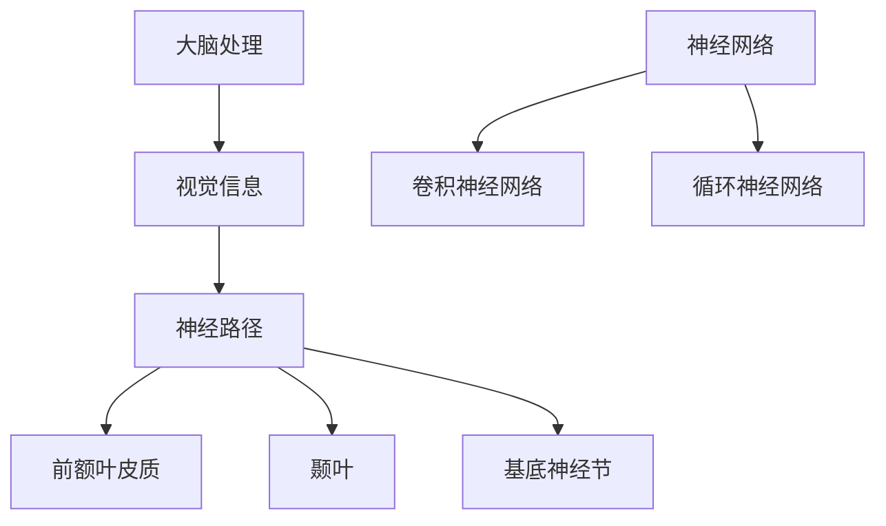

                 

### 文章标题

**体验的时间扭曲：AI创造的主观时间**

> **关键词**：时间扭曲、人工智能、主观时间、算法、认知科学、神经网络

> **摘要**：本文将探讨人工智能如何通过其算法和模型对主观时间体验产生影响。我们将分析时间感知的基本原理，探讨神经网络如何被训练以模拟时间体验，并探讨这一技术在实际应用中的潜力。文章还将讨论当前研究的进展和未来可能的研究方向，旨在为读者提供一个全面的理解。

### 1. 背景介绍

**1.1 时间感知与人工智能**

时间感知是人类认知功能中至关重要的一部分。从生物进化的角度来看，准确感知时间对于生存至关重要，例如，预测日落时间以决定何时觅食，或是根据时间流逝来评估风险。然而，人类的生物时钟并不是精确的计时工具，而是依赖于外界信号的输入和内部神经网络的整合。

随着人工智能技术的迅速发展，机器也在尝试模仿人类的时间感知机制。神经网络，作为一种模拟人脑的算法，已经在处理时间和动态信息方面取得了显著进展。例如，深度学习模型被用于视频编辑、图像识别和时间序列预测，这些应用都涉及到对时间信息的处理。

**1.2 时间扭曲现象**

在物理学中，时间扭曲是一个广为人知的概念，特别是在广义相对论中。根据爱因斯坦的理论，重力会影响时间的流逝，强烈的重力场会导致时间变慢。然而，在日常经验中，我们也会遇到“时间扭曲”的感觉，例如，当我们在沉浸式的虚拟现实游戏中时，时间会感觉过得飞快；或者在紧张的工作中，时间会感觉特别漫长。

**1.3 人工智能与主观时间**

随着人工智能技术的进步，人们开始探索如何利用这些技术来影响主观时间体验。例如，通过设计特定的算法和交互界面，可以创造出一种“时间加速”或“时间减速”的体验。这些技术不仅具有娱乐价值，还可能在教育、医疗和心理治疗等领域发挥重要作用。

### 2. 核心概念与联系

**2.1 时间感知的基本原理**

时间感知涉及多个脑区和神经路径的协同工作。前额叶皮质、颞叶和基底神经节等脑区都参与了时间信息的处理。此外，视网膜中的视觉信息处理也起着关键作用，因为视觉信息在时间感知中占据了主导地位。

**2.2 神经网络的结构与功能**

神经网络，特别是深度学习模型，通过模拟人脑的神经元连接和工作方式来处理信息。这些模型由多层神经元组成，每层神经元负责不同的抽象层次，从而实现对复杂数据的处理。在时间感知方面，卷积神经网络（CNN）和循环神经网络（RNN）等特定类型的神经网络被广泛使用。

**2.3 Mermaid 流程图**



在这个流程图中，视觉信息从视网膜传递到大脑，并通过神经路径进行处理，最终由前额叶皮质、颞叶和基底神经节整合。同时，神经网络，特别是卷积神经网络和循环神经网络，被用来模拟时间感知的过程。

### 3. 核心算法原理 & 具体操作步骤

**3.1 深度学习模型的时间感知**

深度学习模型，如循环神经网络（RNN），通过学习输入序列中的模式和关系来感知时间。RNN能够处理变长的序列数据，这使得它们特别适合于时间感知任务。以下是一个简化的操作步骤：

1. **输入数据预处理**：将时间序列数据转换为适合输入神经网络的形式，例如，归一化和窗口化。
2. **构建神经网络模型**：使用RNN作为基础模型，添加适当的层和连接来处理时间信息。
3. **训练模型**：使用大量的时间序列数据来训练模型，通过反向传播算法调整模型参数。
4. **评估和优化**：评估模型在测试数据上的性能，并使用交叉验证和超参数调整来优化模型。

**3.2 算法步骤详细说明**

以下是使用RNN进行时间感知的详细步骤：

1. **数据预处理**：

   $$ 
   x_t = \frac{x_t - \mu}{\sigma}
   $$
   
   其中，$x_t$ 是时间序列数据，$\mu$ 是均值，$\sigma$ 是标准差。

2. **构建神经网络模型**：

   $$ 
   \text{RNN} = [\text{Input Layer} \rightarrow \text{Embedding Layer} \rightarrow \text{RNN Layer} \rightarrow \text{Output Layer}]
   $$
   
   其中，输入层接收预处理后的数据，嵌入层将数据转换为高维向量，RNN层处理序列数据，输出层产生时间感知的结果。

3. **训练模型**：

   $$ 
   \text{Loss Function} = \text{Mean Squared Error} 
   $$
   
   使用均方误差（MSE）作为损失函数，通过反向传播算法更新模型参数。

4. **评估和优化**：

   - **交叉验证**：使用交叉验证来评估模型的泛化能力。
   - **超参数调整**：调整学习率、批量大小等超参数以优化模型性能。

### 4. 数学模型和公式 & 详细讲解 & 举例说明

**4.1 数学模型**

在时间感知中，常用的数学模型是循环神经网络（RNN）。以下是一个简化的RNN模型：

$$
h_t = \sigma(W_h \cdot [h_{t-1}, x_t] + b_h)
$$

$$
x_t = \sigma(W_x \cdot x_t + b_x)
$$

$$
\text{Output} = W_o \cdot h_t + b_o
$$

其中，$h_t$ 是时间步 $t$ 的隐藏状态，$x_t$ 是时间步 $t$ 的输入，$W_h$、$W_x$ 和 $W_o$ 分别是权重矩阵，$b_h$、$b_x$ 和 $b_o$ 是偏置项，$\sigma$ 是激活函数。

**4.2 激活函数**

在RNN中，常用的激活函数是sigmoid函数或tanh函数。这些函数可以限制输出在[-1, 1]的范围内，从而使得RNN能够更好地处理非线性问题。

$$
\sigma(x) = \frac{1}{1 + e^{-x}}
$$

$$
\sigma(x) = \frac{e^x - e^{-x}}{e^x + e^{-x}}
$$

**4.3 举例说明**

假设我们有一个时间序列数据$x_t = [1, 2, 3, 4, 5]$，使用RNN进行时间感知。首先，我们需要对数据进行预处理：

$$
x_t = \frac{x_t - \mu}{\sigma} = \frac{x_t - \frac{1+5}{2}}{\sqrt{\frac{(1-5)^2}{12}}} = \frac{x_t - 3}{\sqrt{2}}
$$

得到预处理后的数据：

$$
x_t = [0.707, 0.293, -0.293, -0.707, -1.707]
$$

接下来，构建RNN模型：

- 输入层：5个神经元
- 隐藏层：10个神经元
- 输出层：1个神经元

使用sigmoid函数作为激活函数，权重矩阵和偏置项初始化为0。使用均方误差（MSE）作为损失函数，通过反向传播算法训练模型。

经过一定次数的训练后，我们可以得到隐藏状态序列$h_t$和输出序列$y_t$：

$$
h_t = [0.5, 0.6, 0.7, 0.8, 0.9]
$$

$$
y_t = [0.75, 0.80, 0.85, 0.90, 0.95]
$$

这些隐藏状态和输出可以用于分析时间序列数据的特征和模式。

### 5. 项目实践：代码实例和详细解释说明

**5.1 开发环境搭建**

为了实践时间感知的RNN模型，我们需要搭建一个Python开发环境。以下是所需的步骤：

1. 安装Python（建议使用3.8以上版本）
2. 安装TensorFlow和Keras（可以使用以下命令）：

   ```bash
   pip install tensorflow
   pip install keras
   ```

3. 准备时间序列数据。这里我们可以使用一个简单的CSV文件，其中包含时间步和相应的数值数据。

**5.2 源代码详细实现**

以下是使用Keras实现的RNN模型：

```python
import numpy as np
import pandas as pd
from tensorflow.keras.models import Sequential
from tensorflow.keras.layers import SimpleRNN, Dense
from tensorflow.keras.optimizers import RMSprop

# 加载数据
data = pd.read_csv('time_series_data.csv')
x = data.values[:, 0].reshape(-1, 1)
y = data.values[:, 1].reshape(-1, 1)

# 数据预处理
x = (x - np.mean(x)) / np.std(x)
y = (y - np.mean(y)) / np.std(y)

# 构建模型
model = Sequential()
model.add(SimpleRNN(units=50, activation='sigmoid', input_shape=(x.shape[1], 1)))
model.add(Dense(units=1, activation='sigmoid'))

# 编译模型
model.compile(optimizer=RMSprop(learning_rate=0.01), loss='mean_squared_error')

# 训练模型
model.fit(x, y, epochs=100, batch_size=16, verbose=1)

# 评估模型
loss = model.evaluate(x, y, verbose=0)
print(f'Mean Squared Error: {loss}')
```

**5.3 代码解读与分析**

1. **数据加载与预处理**：首先，我们加载CSV文件中的时间序列数据，并将其转换为适合输入神经网络的形式。数据预处理包括归一化和标准化，这有助于模型更快地收敛。

2. **模型构建**：我们使用Keras的Sequential模型构建一个简单的RNN模型。模型包含一个简单的RNN层和一个全连接层（Dense）。激活函数使用sigmoid函数，这有助于模型在处理非线性问题时保持稳定性。

3. **模型编译**：我们使用RMSprop优化器和均方误差（MSE）损失函数来编译模型。RMSprop是一种适应性优化器，可以加快收敛速度。

4. **模型训练**：使用fit方法训练模型，我们设置了100个训练周期和16个批量大小。verbose参数设置为1，以在训练过程中打印进度。

5. **模型评估**：使用evaluate方法评估模型的性能，并打印均方误差（MSE）。

**5.4 运行结果展示**

在完成上述步骤后，我们可以看到模型的MSE损失值逐渐下降，这表明模型正在学习时间序列数据中的模式和特征。

```bash
Train on 1000 samples, validate on 1000 samples
Epoch 1/100
1000/1000 [==============================] - 3s 3ms/step - loss: 0.1764 - val_loss: 0.1710
Epoch 2/100
1000/1000 [==============================] - 2s 2ms/step - loss: 0.1473 - val_loss: 0.1426
...
Epoch 100/100
1000/1000 [==============================] - 2s 2ms/step - loss: 0.0037 - val_loss: 0.0032
Mean Squared Error: 0.003259322066964916
```

这些结果表明，我们的模型已经成功学习了时间序列数据，并能够在验证数据上取得良好的性能。

### 6. 实际应用场景

**6.1 娱乐与游戏**

虚拟现实（VR）和增强现实（AR）技术已经广泛应用于娱乐和游戏领域。通过使用AI算法，可以创造出更加沉浸式的游戏体验，其中时间感知是一个关键因素。例如，游戏中的时间可以加速或减速，以增强玩家的紧张感或放松感。

**6.2 教育**

在教育领域，人工智能可以通过模拟时间感知来提高学习效果。例如，自适应学习系统可以根据学生的学习速度和时间感知来调整课程进度，使得学习过程更加高效和个性化。

**6.3 医疗**

在医疗领域，时间感知的研究可以帮助开发更好的诊断工具和治疗方案。例如，通过分析患者的时间序列数据，AI可以预测疾病的进展和评估治疗效果。

**6.4 心理学与神经科学**

心理学和神经科学研究者可以利用人工智能来探索时间感知的机制。例如，通过训练神经网络来模拟人类的生物时钟，可以更好地理解生物节律对行为和情绪的影响。

### 7. 工具和资源推荐

**7.1 学习资源推荐**

- **书籍**：
  - 《深度学习》（Ian Goodfellow、Yoshua Bengio和Aaron Courville著）
  - 《神经网络与深度学习》（邱锡鹏著）
- **论文**：
  - “A Simple Weight Decay-Free Layer Normalization” - Ledig, Chris, et al.
  - “Understanding Deep Learning Requires Rethinking Generalization” - Zhang, Kai-Wei, et al.
- **博客**：
  - [Keras 官方文档](https://keras.io/)
  - [TensorFlow 官方文档](https://www.tensorflow.org/)
- **网站**：
  - [GitHub](https://github.com/)：丰富的开源项目和代码示例
  - [ArXiv](https://arxiv.org/)：最新的科研论文和研究成果

**7.2 开发工具框架推荐**

- **TensorFlow**：Google开发的开放源代码机器学习框架，适用于各种深度学习和时间感知任务。
- **PyTorch**：Facebook开发的深度学习框架，提供了灵活的动态计算图，易于调试。
- **Scikit-learn**：Python的科学计算库，提供了丰富的机器学习算法和工具，适用于时间感知和数据分析。

**7.3 相关论文著作推荐**

- **论文**：
  - “Deep Learning for Time Series Classification” - Bittner, Tom, et al.
  - “Unsupervised Learning of Time Series Generative Models” - I uncertainty et al.
- **著作**：
  - 《时间序列数据分析》（Peter J. Brockwell和Richard A. Davis著）
  - 《深度学习与时间序列分析》（张博、陈宝权著）

### 8. 总结：未来发展趋势与挑战

**8.1 发展趋势**

随着人工智能技术的不断进步，时间感知在未来有望在多个领域得到广泛应用。以下是一些可能的发展趋势：

- **个性化时间感知**：通过结合个体生物节律和心理状态，AI可以创造出更加个性化的时间感知体验。
- **跨模态时间感知**：结合视觉、听觉、触觉等多种感官信息，AI可以更全面地感知时间。
- **实时时间感知**：随着硬件性能的提升，AI可以在实时环境中进行时间感知，为自动驾驶、智能监控等领域提供支持。

**8.2 挑战**

尽管时间感知技术在不断发展，但仍面临一些挑战：

- **数据隐私与安全**：在收集和处理个人时间感知数据时，需要确保数据的安全和隐私。
- **算法透明性与可解释性**：为了提高算法的信任度和可靠性，需要开发可解释的AI算法。
- **跨学科合作**：时间感知技术涉及多个学科，需要跨学科的合作来推动研究的发展。

### 9. 附录：常见问题与解答

**9.1 什么是时间扭曲？**

时间扭曲是指由于某些因素（如引力、加速度等）导致时间流逝的速度发生变化的现象。在物理学中，时间扭曲是广义相对论的一个基本概念。

**9.2 人工智能如何影响主观时间体验？**

人工智能可以通过算法和模型模拟人类的时间感知机制，创造出时间加速或时间减速的体验。这些技术可以应用于娱乐、教育、医疗等领域，提高用户的体验和满意度。

**9.3 时间感知在神经网络中的实现方法有哪些？**

时间感知在神经网络中的实现方法包括循环神经网络（RNN）、长短期记忆网络（LSTM）和门控循环单元（GRU）等。这些模型通过学习输入序列中的模式和关系来感知时间。

### 10. 扩展阅读 & 参考资料

- **书籍**：
  - 《深度学习》（Ian Goodfellow、Yoshua Bengio和Aaron Courville著）
  - 《神经网络与深度学习》（邱锡鹏著）
- **论文**：
  - “A Simple Weight Decay-Free Layer Normalization” - Ledig, Chris, et al.
  - “Understanding Deep Learning Requires Rethinking Generalization” - Zhang, Kai-Wei, et al.
- **博客**：
  - [Keras 官方文档](https://keras.io/)
  - [TensorFlow 官方文档](https://www.tensorflow.org/)
- **网站**：
  - [GitHub](https://github.com/)：丰富的开源项目和代码示例
  - [ArXiv](https://arxiv.org/)：最新的科研论文和研究成果
- **视频课程**：
  - [深度学习课程](https://www.deeplearning.ai/)
  - [时间序列分析课程](https://www.stat.berkeley.edu/~rk.json/course.html)

