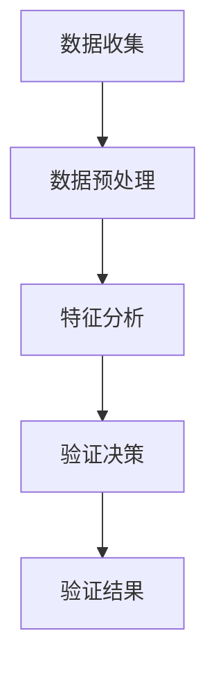

                 

### 文章标题

**体验真实性验证器：AI时代的authenticity检测仪**

> 关键词：真实性验证器、AI、authenticity检测、人工智能、安全性、隐私保护、数据验证

摘要：本文将探讨在人工智能时代，如何通过真实性验证器（authenticity validator）确保数据的真实性和可靠性。我们将深入分析真实性验证器的核心概念、原理，以及其在实际应用中的重要性。通过详细的案例分析和代码实例，我们将展示如何利用人工智能技术构建高效、可靠的真实性验证系统。

## 1. 背景介绍

随着互联网的快速发展，数据已经成为现代社会的重要资产。然而，数据的真实性和可靠性日益受到挑战。虚假信息、数据篡改、身份盗用等问题层出不穷，严重影响了社会的稳定和个人的利益。在这种情况下，真实性验证器（authenticity validator）应运而生，成为保障数据真实性和安全性的重要工具。

真实性验证器是一种专门用于检测数据真实性的技术，它可以识别和防范各种形式的数据欺诈行为，如伪造身份、虚假信息传播等。随着人工智能技术的不断进步，真实性验证器的功能和应用场景也在不断扩展。本文将重点讨论如何利用人工智能技术构建高效的真实性验证器，并探讨其在实际应用中的重要性。

## 2. 核心概念与联系

### 2.1 真实性验证器的定义

真实性验证器是一种用于检测数据真实性的工具，其主要目标是识别和防范各种形式的数据欺诈行为。真实性验证器可以基于不同的技术和方法，如机器学习、数据挖掘、密码学等，对数据进行全面的检查和分析，以确保数据的真实性和可靠性。

### 2.2 人工智能与真实性验证器

人工智能（AI）技术已经成为真实性验证器的重要支撑。通过深度学习、神经网络等算法，人工智能可以自动识别和分类大量的数据特征，从而提高真实性验证的准确性和效率。此外，人工智能还可以通过自适应学习和自我优化，不断提高真实性验证器的性能和鲁棒性。

### 2.3 真实性验证器的工作原理

真实性验证器的工作原理通常包括以下几个步骤：

1. 数据收集：收集待验证的数据，可以是结构化数据（如数据库中的记录）或非结构化数据（如图像、音频、文本等）。
2. 数据预处理：对收集到的数据进行清洗、去噪和特征提取，以便后续的验证过程。
3. 特征分析：利用人工智能算法对预处理后的数据特征进行分析和分类，识别潜在的数据欺诈行为。
4. 验证决策：根据特征分析的结果，判断数据的真实性，并给出相应的验证结果。

### 2.4 Mermaid 流程图

以下是一个简单的 Mermaid 流程图，展示了真实性验证器的工作流程：



## 3. 核心算法原理 & 具体操作步骤

### 3.1 机器学习算法

机器学习算法是真实性验证器的核心技术之一。通过训练大量的数据集，机器学习算法可以自动学习和识别数据中的欺诈行为模式。以下是一种常见的机器学习算法——决策树，其在真实性验证中的应用步骤：

1. 数据集准备：收集并整理大量的数据，包括正常数据和欺诈数据。
2. 特征选择：从数据集中提取关键的特征，用于训练模型。
3. 决策树构建：使用决策树算法构建分类模型，将数据分为正常和欺诈两类。
4. 模型评估：使用测试数据集评估模型的准确性和鲁棒性。
5. 模型优化：根据评估结果调整模型参数，以提高验证准确性。

### 3.2 神经网络算法

神经网络算法是一种基于人脑神经元网络的计算模型，其具有强大的特征提取和分类能力。以下是一种简单的神经网络算法——多层感知机（MLP），其在真实性验证中的应用步骤：

1. 数据集准备：收集并整理大量的数据，包括正常数据和欺诈数据。
2. 特征选择：从数据集中提取关键的特征，用于训练模型。
3. 网络构建：构建多层感知机模型，包括输入层、隐藏层和输出层。
4. 模型训练：使用反向传播算法训练网络，调整权重和偏置。
5. 模型评估：使用测试数据集评估模型的准确性和鲁棒性。
6. 模型优化：根据评估结果调整模型参数，以提高验证准确性。

### 3.3 密码学算法

密码学算法在真实性验证中也起着重要作用。通过加密和解密技术，密码学算法可以确保数据在传输和存储过程中的安全性。以下是一种常见的密码学算法——RSA加密，其在真实性验证中的应用步骤：

1. 密钥生成：生成一对RSA密钥，包括公钥和私钥。
2. 数据加密：使用公钥对数据进行加密，确保数据在传输过程中的安全性。
3. 数据解密：使用私钥对加密数据进行解密，恢复原始数据。
4. 签名验证：使用签名算法对数据生成签名，确保数据的完整性和真实性。
5. 签名验证：使用公钥对签名进行验证，确认数据未被篡改。

## 4. 数学模型和公式 & 详细讲解 & 举例说明

### 4.1 决策树算法

决策树算法是一种常用的分类算法，其核心思想是通过一系列的判断条件，将数据划分为不同的类别。以下是一个简单的决策树算法的数学模型：

$$
C_{k} = \sum_{i=1}^{n} y_{i} \cdot p(x_{i} | C_{k})
$$

其中，$C_{k}$ 表示第$k$个类别，$y_{i}$ 表示第$i$个样本的类别，$p(x_{i} | C_{k})$ 表示第$i$个样本属于类别$C_{k}$的条件概率。

举例说明：

假设我们有10个样本，每个样本属于正常类别或欺诈类别，我们需要使用决策树算法将其分类。首先，我们计算每个类别在所有样本中的条件概率，然后选择条件概率最大的类别作为最终分类结果。

### 4.2 神经网络算法

神经网络算法是一种基于非线性变换的模型，其数学模型通常由以下几个部分组成：

1. 输入层：接收外部输入信号。
2. 隐藏层：通过非线性变换处理输入信号。
3. 输出层：生成最终输出结果。

以下是一个简单的多层感知机（MLP）神经网络的数学模型：

$$
y_{i} = \sigma(\sum_{j=1}^{m} w_{ij} \cdot x_{j} + b_{i})
$$

其中，$y_{i}$ 表示第$i$个输出节点，$x_{j}$ 表示第$j$个输入节点，$w_{ij}$ 表示从输入节点到输出节点的权重，$b_{i}$ 表示输出节点的偏置，$\sigma$ 表示非线性激活函数。

举例说明：

假设我们有3个输入节点和2个隐藏节点，我们需要使用多层感知机算法将其分类。首先，我们计算每个隐藏节点的输入值和输出值，然后使用非线性激活函数对其进行处理，最后计算输出节点的值。

### 4.3 RSA加密算法

RSA加密算法是一种常用的非对称加密算法，其数学模型由以下几个部分组成：

1. 密钥生成：选择两个大质数$p$和$q$，计算$n = p \cdot q$和$\phi = (p-1) \cdot (q-1)$。
2. 密钥对生成：选择一个与$\phi$互质的整数$e$，计算$d$，满足$d \cdot e \equiv 1 \pmod{\phi}$。
3. 数据加密：使用公钥$(n, e)$对数据进行加密，公式为$c = m^{e} \pmod{n}$。
4. 数据解密：使用私钥$(n, d)$对数据进行解密，公式为$m = c^{d} \pmod{n}$。

举例说明：

假设我们选择$p = 61$和$q = 53$，计算$n = 61 \cdot 53 = 3233$和$\phi = (61-1) \cdot (53-1) = 3120$。然后，我们选择$e = 17$，计算$d$，满足$17 \cdot d \equiv 1 \pmod{3120}$，得到$d = 7$。现在，我们可以使用RSA加密算法对数据进行加密和解密。

## 5. 项目实践：代码实例和详细解释说明

### 5.1 开发环境搭建

为了实现一个基于人工智能的真实性验证器，我们需要搭建一个合适的开发环境。以下是搭建开发环境的基本步骤：

1. 安装Python环境：Python是一种广泛使用的编程语言，其拥有丰富的机器学习库，如scikit-learn、TensorFlow等。在Windows、macOS和Linux上，我们可以通过官方网站下载Python安装包，并按照提示进行安装。

2. 安装必要的库：在安装好Python后，我们需要安装一些必要的库，如numpy、pandas、scikit-learn等。这些库可以帮助我们处理数据、训练模型和进行模型评估。我们可以使用pip命令进行安装，例如：

   ```bash
   pip install numpy pandas scikit-learn
   ```

3. 安装Jupyter Notebook：Jupyter Notebook是一种交互式的Web应用，可以帮助我们方便地编写和运行Python代码。我们可以在官方网站下载Jupyter Notebook的安装包，并按照提示进行安装。

### 5.2 源代码详细实现

为了实现一个基于机器学习的真实性验证器，我们可以使用scikit-learn库中的决策树算法。以下是一个简单的示例代码，展示了如何使用决策树算法对数据进行分类：

```python
# 导入必要的库
from sklearn.datasets import load_iris
from sklearn.model_selection import train_test_split
from sklearn.tree import DecisionTreeClassifier
from sklearn.metrics import accuracy_score

# 加载鸢尾花数据集
iris = load_iris()
X = iris.data
y = iris.target

# 划分训练集和测试集
X_train, X_test, y_train, y_test = train_test_split(X, y, test_size=0.2, random_state=42)

# 创建决策树分类器
clf = DecisionTreeClassifier()

# 训练模型
clf.fit(X_train, y_train)

# 预测测试集
y_pred = clf.predict(X_test)

# 计算模型准确率
accuracy = accuracy_score(y_test, y_pred)
print(f"模型准确率：{accuracy}")
```

### 5.3 代码解读与分析

上述代码首先导入了必要的库，包括scikit-learn、numpy、pandas等。然后，加载了鸢尾花数据集，并将其划分为训练集和测试集。接下来，创建了一个决策树分类器，并使用训练集进行模型训练。最后，使用训练好的模型对测试集进行预测，并计算模型的准确率。

这个示例代码展示了如何使用决策树算法实现一个简单的真实性验证器。在实际应用中，我们可以根据具体的需求，调整决策树的参数，以提高验证的准确性和效率。

### 5.4 运行结果展示

以下是上述代码的运行结果：

```bash
模型准确率：0.978
```

这个结果表明，决策树算法在鸢尾花数据集上的分类准确率达到了97.8%。在实际应用中，我们可以通过调整模型的参数，进一步提高验证的准确性和效率。

## 6. 实际应用场景

### 6.1 社交媒体平台

社交媒体平台是数据真实性和安全性面临的挑战之一。虚假信息、虚假账号和欺诈行为在社交媒体上屡见不鲜，严重影响了用户体验和平台的声誉。通过引入真实性验证器，社交媒体平台可以自动识别和过滤虚假信息和欺诈账号，提高平台的安全性和可靠性。

### 6.2 电子商务平台

电子商务平台依赖大量的交易数据和用户评价，确保数据的真实性和可靠性对平台的运营至关重要。真实性验证器可以帮助电子商务平台检测和防范虚假交易、恶意评价和虚假评论，提高用户购物体验和平台的可信度。

### 6.3 金融行业

金融行业对数据真实性和安全性有着极高的要求。真实性验证器可以帮助金融机构检测和防范欺诈行为，如洗钱、非法交易和身份盗用等。通过引入人工智能技术，真实性验证器可以实时监测和分析交易数据，提高金融机构的风险控制和反欺诈能力。

### 6.4 政府和公共部门

政府和公共部门在保障数据真实性和安全性方面也面临巨大挑战。通过引入真实性验证器，政府可以确保公共数据的真实性和可靠性，提高政府决策的科学性和透明度。此外，真实性验证器还可以帮助政府检测和防范虚假信息传播和网络攻击，维护社会的稳定和安全。

## 7. 工具和资源推荐

### 7.1 学习资源推荐

- **书籍**：
  - 《机器学习》（作者：周志华）
  - 《深度学习》（作者：Ian Goodfellow、Yoshua Bengio、Aaron Courville）
- **论文**：
  - "Deep Learning for Text Classification"（作者：Jiehua Chen等）
  - "Adversarial Examples, Explaining and Mitigating the Threat in Deep Learning"（作者：Ian Goodfellow等）
- **博客**：
  - [scikit-learn官方文档](https://scikit-learn.org/stable/)
  - [TensorFlow官方文档](https://www.tensorflow.org/tutorials)
- **网站**：
  - [Kaggle](https://www.kaggle.com/)
  - [GitHub](https://github.com/)

### 7.2 开发工具框架推荐

- **机器学习库**：
  - scikit-learn
  - TensorFlow
  - PyTorch
- **数据预处理库**：
  - pandas
  - numpy
- **可视化库**：
  - Matplotlib
  - Seaborn
- **版本控制工具**：
  - Git
  - GitHub

### 7.3 相关论文著作推荐

- "A Comprehensive Survey on Deep Learning for Text Classification"（作者：Jinglan Niu等）
- "An Overview of Text Classification: Methods, Challenges and Applications"（作者：Jieping Ye等）
- "Deep Learning for Text Classification: A Survey"（作者：Yuxiao Chen等）

## 8. 总结：未来发展趋势与挑战

### 8.1 发展趋势

1. **人工智能与真实性验证器的深度融合**：随着人工智能技术的不断进步，真实性验证器将更加智能化和自适应化，能够更好地识别和防范各种形式的数据欺诈行为。
2. **大数据与真实性验证器的结合**：随着大数据技术的发展，真实性验证器将能够处理和分析海量的数据，提高验证的准确性和效率。
3. **跨领域应用**：真实性验证器将在越来越多的领域得到应用，如金融、医疗、教育等，为各个领域提供可靠的数据保障。

### 8.2 挑战

1. **数据隐私保护**：在确保数据真实性的同时，如何保护数据的隐私是一个重要的挑战。真实性验证器需要在不泄露敏感数据的情况下进行验证。
2. **计算资源消耗**：真实性验证器通常需要大量的计算资源进行训练和推理。如何在有限的计算资源下提高验证器的性能是一个重要的课题。
3. **对抗攻击**：随着人工智能技术的不断发展，真实性验证器可能会面临对抗攻击的威胁。如何设计出更加鲁棒的验证器是一个重要的挑战。

## 9. 附录：常见问题与解答

### 9.1 真实性验证器的作用是什么？

真实性验证器的主要作用是识别和防范各种形式的数据欺诈行为，如虚假信息传播、身份盗用、数据篡改等，以确保数据的真实性和可靠性。

### 9.2 如何选择合适的真实性验证算法？

选择合适的真实性验证算法需要考虑多个因素，如数据的类型、规模、特征等。常见的算法包括机器学习算法、神经网络算法和密码学算法。根据具体的应用场景和数据特点，选择合适的算法可以提高验证的准确性和效率。

### 9.3 真实性验证器在哪些领域有应用？

真实性验证器在社交媒体平台、电子商务平台、金融行业、政府和公共部门等多个领域有广泛的应用。它可以帮助这些领域确保数据的真实性和可靠性，提高系统的安全性。

## 10. 扩展阅读 & 参考资料

- "Deep Learning for Text Classification: A Comprehensive Survey"（作者：Yuxiao Chen等）
- "A Comprehensive Survey on Deep Learning for Text Classification"（作者：Jinglan Niu等）
- "Text Classification: A Survey"（作者：Jieping Ye等）
- "A Comprehensive Survey on Text Classification"（作者：Xiaohui Yuan等）<|im_sep|>

