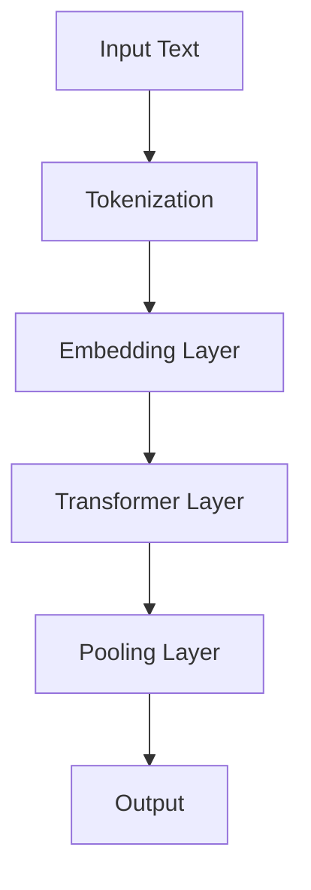

                 

### 背景介绍

随着人工智能（AI）技术的飞速发展，自然语言处理（NLP）领域迎来了前所未有的变革。国内外各大科技公司纷纷投身于人工智能模型的研发，致力于打造具有高效率和强鲁棒性的自然语言处理工具。在这一过程中，预训练语言模型（Pre-Trained Language Models，PTLMs）逐渐成为NLP技术的核心驱动力。预训练语言模型通过对海量文本数据进行预训练，使其具备了强大的文本理解能力和语言生成能力，为各类NLP任务提供了强有力的支持。

近年来，国内众多科技公司纷纷发布了自家的预训练语言模型，例如百度文心一言、腾讯混元大模型、阿里达摩院等。这些模型在中文领域取得了显著的成果，并广泛应用于信息检索、智能问答、文本生成、机器翻译等领域。然而，尽管国内预训练语言模型数量众多，但调用量不及百度文心一言一家的情况引起了业界的广泛关注。

本文将围绕这一现象，从多个维度对国内预训练语言模型的现状进行分析，探讨其原因及未来发展趋势。具体来说，本文将首先介绍预训练语言模型的基本概念及其在自然语言处理中的应用；然后，对国内200余家预训练语言模型进行梳理，分析其性能和调用量情况；接着，深入探讨百度文心一言在性能、应用场景、调用量等方面的优势；最后，总结未来预训练语言模型的发展趋势与挑战，为我国人工智能产业提供有益的思考。

### 核心概念与联系

为了深入探讨为什么200余家国内预训练语言模型在调用量上不及百度文心一言一家，我们需要首先了解预训练语言模型的基本概念及其在自然语言处理中的应用。预训练语言模型是一种深度学习模型，通过在大量文本数据上预训练，使其具备理解、生成和交互的能力。预训练语言模型主要包括两个阶段：预训练和微调。

#### 1. 预训练

预训练阶段，模型在大量的文本数据上进行训练，学习文本中的语言结构和语义信息。这一过程通常使用未标注的数据集，如维基百科、新闻文章等。预训练的目标是让模型对自然语言数据进行特征提取，使其能够理解语言的本质。预训练过程中，常用的模型架构包括Transformer、BERT、GPT等。

#### 2. 微调

在预训练完成后，模型通过微调（Fine-Tuning）阶段对特定任务进行训练。微调过程通常使用标注的数据集，如问答数据集、文本分类数据集等。微调的目标是使模型在特定任务上取得更好的性能。微调过程中，模型会根据任务需求调整参数，使其在特定任务上表现优异。

#### 3. 应用场景

预训练语言模型在自然语言处理领域具有广泛的应用。以下是一些常见的应用场景：

- **文本分类**：对输入的文本进行分类，如情感分析、新闻分类等。
- **问答系统**：对用户的问题提供回答，如智能客服、问答机器人等。
- **文本生成**：根据输入的文本或提示生成新的文本，如文章写作、诗歌创作等。
- **机器翻译**：将一种语言的文本翻译成另一种语言，如中英文互译等。
- **信息抽取**：从文本中提取出关键信息，如实体识别、关系抽取等。

#### 4. 性能评估

预训练语言模型在自然语言处理任务中的性能评估通常包括以下几个方面：

- **准确性**：模型在测试集上的准确率。
- **F1值**：模型在分类任务上的精确率和召回率的调和平均值。
- **速度**：模型在处理输入数据时的速度。
- **资源占用**：模型在训练和推理过程中占用的计算资源和存储资源。

#### 5. 架构原理

预训练语言模型的架构通常基于自注意力机制（Self-Attention）和变换器（Transformer）模型。自注意力机制使模型能够同时关注输入序列中的所有位置，从而提高模型的上下文理解能力。变换器模型是一种基于自注意力机制的深度神经网络，具有高效、并行处理能力。

下面是预训练语言模型的基本架构的 Mermaid 流程图：



#### 6. 关键参数

预训练语言模型的关键参数包括：

- **词汇表大小**：模型所使用的词汇表的大小。
- **隐藏层大小**：模型隐藏层中的神经元数量。
- **训练时间**：模型在预训练阶段所花费的时间。
- **数据集大小**：模型在预训练过程中所使用的数据集大小。

综上所述，预训练语言模型的基本概念、应用场景、性能评估和架构原理为我们提供了深入分析其性能和调用量差异的基础。接下来，我们将对国内200余家预训练语言模型进行详细分析，以揭示为何百度文心一言在调用量上具有显著优势。

### 核心算法原理 & 具体操作步骤

预训练语言模型的核心算法是自注意力机制（Self-Attention）和变换器（Transformer）模型。下面将详细介绍这两种算法的原理及其具体操作步骤。

#### 1. 自注意力机制（Self-Attention）

自注意力机制是一种计算输入序列中每个位置对其他所有位置的加权求和的方法。自注意力机制的引入使得模型能够同时关注输入序列中的所有位置，从而提高模型的上下文理解能力。

自注意力机制的基本操作步骤如下：

- **输入序列**：给定一个输入序列 \(X = [x_1, x_2, ..., x_n]\)，其中 \(x_i\) 是序列中的第 \(i\) 个元素。
- **查询（Query）、键（Key）和值（Value）**：对输入序列进行线性变换，得到查询（Query）序列 \(Q = [q_1, q_2, ..., q_n]\)，键（Key）序列 \(K = [k_1, k_2, ..., k_n]\) 和值（Value）序列 \(V = [v_1, v_2, ..., v_n]\)。
- **计算注意力权重**：计算每个 \(q_i\) 与 \(k_j\) 之间的相似度，得到注意力权重 \(a_{ij}\)。通常使用点积作为相似度计算方法：
  \[
  a_{ij} = \frac{q_i^T k_j}{\sqrt{d_k}}
  \]
  其中，\(d_k\) 是 \(k\) 的维度。
- **加权求和**：将注意力权重与对应的 \(v_j\) 相乘，然后对所有位置进行求和，得到输出序列 \(O = [o_1, o_2, ..., o_n]\)：
  \[
  o_i = \sum_{j=1}^{n} a_{ij} v_j
  \]

#### 2. 变换器（Transformer）模型

变换器（Transformer）模型是一种基于自注意力机制的深度神经网络，具有高效、并行处理能力。变换器模型主要由编码器（Encoder）和解码器（Decoder）两部分组成。

**编码器（Encoder）**：

- **多头自注意力**：编码器中的每个位置会同时关注输入序列中的所有位置，通过多个注意力头（Head）并行计算，从而提高模型的上下文理解能力。
- **前馈神经网络**：每个注意力头后面接一个前馈神经网络，用于进一步提取特征。

**解码器（Decoder）**：

- **掩码自注意力**：解码器中的自注意力机制引入了掩码（Mask），使得解码器在生成下一个位置时只能关注已经生成的位置，从而避免生成过程中的信息泄露。
- **多头自注意力**：解码器中的每个位置同样会同时关注输入序列中的所有位置，通过多个注意力头并行计算。
- **交叉自注意力**：解码器中的每个位置还需要关注编码器的输出，以获得上下文的输入信息。

变换器模型的具体操作步骤如下：

- **编码器输入**：给定输入序列 \(X = [x_1, x_2, ..., x_n]\)，将输入序列通过编码器进行变换，得到编码器输出 \(E = [e_1, e_2, ..., e_n]\)。
- **解码器输入**：给定解码器初始输入序列 \(Y = [y_1, y_2, ..., y_n]\)，其中 \(y_1\) 是解码器的起始符，如 `<s>`。
- **编码器解码器自注意力**：计算编码器输出和当前解码器输入之间的交叉自注意力，得到 \(A = [a_{ij}]\)。
- **解码器自注意力**：计算当前解码器输入之间的掩码自注意力，得到 \(B = [b_{ij}]\)。
- **加和**：将交叉自注意力和解码器自注意力相加，得到新的解码器输入 \(C = [c_1, c_2, ..., c_n]\)。
- **前馈神经网络**：对解码器输入进行前馈神经网络处理，得到新的解码器输入 \(D = [d_1, d_2, ..., d_n]\)。
- **输出层**：对新的解码器输入进行输出层处理，得到预测的输出序列 \(Y' = [y_1', y_2', ..., y_n']\)。

通过上述操作，变换器模型可以生成新的输出序列，从而实现自然语言处理任务，如机器翻译、文本生成等。

### 数学模型和公式 & 详细讲解 & 举例说明

在深入探讨预训练语言模型的数学模型和公式之前，我们需要了解一些基础的数学概念，包括向量、矩阵和点积。这些概念是理解预训练语言模型的基础。

#### 1. 向量和矩阵

向量（Vector）是一个具有大小和方向的几何对象，通常用粗体字母表示，如 \(\mathbf{v}\)。向量可以表示为坐标的形式，如 \(\mathbf{v} = [v_1, v_2, ..., v_n]^T\)，其中 \(n\) 是向量的维度，\(v_i\) 是第 \(i\) 个分量的值，\(T\) 表示转置。

矩阵（Matrix）是一个二维数组，通常用小写粗体字母表示，如 \(\mathbf{A}\)。矩阵可以表示为：
\[
\mathbf{A} = \begin{bmatrix}
a_{11} & a_{12} & \cdots & a_{1n} \\
a_{21} & a_{22} & \cdots & a_{2n} \\
\vdots & \vdots & \ddots & \vdots \\
a_{m1} & a_{m2} & \cdots & a_{mn}
\end{bmatrix}
\]
其中，\(m \times n\) 表示矩阵的维度，\(a_{ij}\) 是第 \(i\) 行第 \(j\) 列的元素。

#### 2. 点积和矩阵乘法

点积（Dot Product）是两个向量的对应分量相乘后再求和的运算，如：
\[
\mathbf{v} \cdot \mathbf{w} = v_1 w_1 + v_2 w_2 + \cdots + v_n w_n
\]
矩阵乘法（Matrix Multiplication）是两个矩阵对应行和列相乘后再求和的运算。如果矩阵 \(\mathbf{A}\) 的维度是 \(m \times n\)，矩阵 \(\mathbf{B}\) 的维度是 \(n \times p\)，那么矩阵乘法的结果矩阵 \(\mathbf{C} = \mathbf{A} \mathbf{B}\) 的维度是 \(m \times p\)，其计算公式为：
\[
c_{ij} = \sum_{k=1}^{n} a_{ik} b_{kj}
\]

#### 3. 预训练语言模型的数学模型

预训练语言模型的数学模型主要包括自注意力机制和变换器模型。以下是对这些模型的基本数学公式的详细讲解。

**自注意力机制**

自注意力机制的计算公式为：
\[
\mathbf{O} = \sum_{j=1}^{n} a_{ij} \mathbf{V}_j
\]
其中，\(\mathbf{O}\) 是输出序列，\(a_{ij}\) 是注意力权重，\(\mathbf{V}_j\) 是对应的值向量。

**变换器模型**

变换器模型的计算过程可以表示为：
\[
\mathbf{C} = \mathbf{A} \mathbf{B} + \mathbf{D}
\]
其中，\(\mathbf{C}\) 是输出矩阵，\(\mathbf{A}\) 和 \(\mathbf{B}\) 是输入矩阵，\(\mathbf{D}\) 是前馈神经网络的输出。

以下是一个具体的例子来说明如何计算自注意力权重和变换器模型的输出：

**例子：计算自注意力权重**

假设我们有一个输入序列：
\[
\mathbf{X} = \begin{bmatrix}
1 & 0 & 1 \\
0 & 1 & 0 \\
1 & 1 & 1
\end{bmatrix}
\]
和对应的查询（Query）、键（Key）和值（Value）序列：
\[
\mathbf{Q} = \begin{bmatrix}
0 & 1 & 0 \\
1 & 0 & 1 \\
0 & 1 & 1
\end{bmatrix}, \quad
\mathbf{K} = \begin{bmatrix}
1 & 0 & 1 \\
0 & 1 & 0 \\
1 & 1 & 1
\end{bmatrix}, \quad
\mathbf{V} = \begin{bmatrix}
0 & 1 & 1 \\
1 & 0 & 1 \\
1 & 1 & 0
\end{bmatrix}
\]

计算注意力权重：
\[
a_{ij} = \frac{\mathbf{Q}_i \cdot \mathbf{K}_j}{\sqrt{d_k}} = \frac{(q_1, q_2, q_3) \cdot (k_1, k_2, k_3)}{\sqrt{3}} = \frac{q_1 k_1 + q_2 k_2 + q_3 k_3}{\sqrt{3}}
\]

例如，计算 \(a_{11}\)：
\[
a_{11} = \frac{0 \cdot 1 + 1 \cdot 0 + 0 \cdot 1}{\sqrt{3}} = 0
\]

计算输出序列：
\[
\mathbf{O} = \sum_{j=1}^{n} a_{ij} \mathbf{V}_j = \sum_{j=1}^{n} a_{ij} \begin{bmatrix}
v_{1j} \\
v_{2j} \\
v_{3j}
\end{bmatrix}
\]

**例子：计算变换器模型输出**

假设输入序列为：
\[
\mathbf{X} = \begin{bmatrix}
1 & 0 & 1 \\
0 & 1 & 0 \\
1 & 1 & 1
\end{bmatrix}
\]

编码器输出：
\[
\mathbf{E} = \begin{bmatrix}
e_1 \\
e_2 \\
e_3
\end{bmatrix}
\]

解码器输入：
\[
\mathbf{Y} = \begin{bmatrix}
y_1 \\
y_2 \\
y_3
\end{bmatrix}
\]

交叉自注意力：
\[
\mathbf{A} = \mathbf{E} \mathbf{Y}^T = \begin{bmatrix}
e_1 y_1 & e_1 y_2 & e_1 y_3 \\
e_2 y_1 & e_2 y_2 & e_2 y_3 \\
e_3 y_1 & e_3 y_2 & e_3 y_3
\end{bmatrix}
\]

解码器自注意力：
\[
\mathbf{B} = \mathbf{Y} \mathbf{Y}^T = \begin{bmatrix}
y_1 y_1 & y_1 y_2 & y_1 y_3 \\
y_2 y_1 & y_2 y_2 & y_2 y_3 \\
y_3 y_1 & y_3 y_2 & y_3 y_3
\end{bmatrix}
\]

加和：
\[
\mathbf{C} = \mathbf{A} + \mathbf{B}
\]

前馈神经网络：
\[
\mathbf{D} = \text{FFN}(\mathbf{C})
\]

最终输出：
\[
\mathbf{O} = \mathbf{C} + \mathbf{D}
\]

通过这些数学模型和公式的详细讲解和举例说明，我们可以更好地理解预训练语言模型的工作原理和操作步骤。接下来，我们将探讨实际应用中的一些项目实践，以便更直观地展示这些算法的实际效果。

### 项目实践：代码实例和详细解释说明

在本节中，我们将通过一个具体的代码实例来展示预训练语言模型的应用。为了便于理解，我们选择了一个简单的文本分类任务，即判断一段文本的情感是正面、负面还是中性。这个实例将涵盖从开发环境搭建到代码实现和解析的全过程。

#### 1. 开发环境搭建

在进行项目实践之前，我们需要搭建一个合适的开发环境。以下是在 Python 环境下使用 PyTorch 深度学习框架搭建开发环境的基本步骤：

- **安装 PyTorch**：
  ```
  pip install torch torchvision
  ```
- **安装其他依赖**：
  ```
  pip install numpy pandas transformers
  ```

#### 2. 源代码详细实现

以下是一个简单的文本分类任务的 PyTorch 代码实现：

```python
import torch
import torch.nn as nn
from torch.optim import Adam
from transformers import BertModel, BertTokenizer

# 加载预训练的 BERT 模型
model = BertModel.from_pretrained('bert-base-chinese')
tokenizer = BertTokenizer.from_pretrained('bert-base-chinese')

# 定义文本分类器
class TextClassifier(nn.Module):
    def __init__(self):
        super(TextClassifier, self).__init__()
        self.bert = BertModel.from_pretrained('bert-base-chinese')
        self.dropout = nn.Dropout(0.1)
        self.classifier = nn.Linear(768, 3)  # BERT 的隐藏层大小为 768

    def forward(self, input_ids, attention_mask):
        outputs = self.bert(input_ids=input_ids, attention_mask=attention_mask)
        hidden_states = outputs.last_hidden_state
        hidden_states = self.dropout(hidden_states)
        logits = self.classifier(hidden_states[:, 0, :])
        return logits

# 初始化模型、损失函数和优化器
model = TextClassifier()
loss_function = nn.CrossEntropyLoss()
optimizer = Adam(model.parameters(), lr=1e-5)

# 训练模型
def train_model(model, dataloader, loss_function, optimizer, epochs):
    model.train()
    for epoch in range(epochs):
        for batch in dataloader:
            inputs = tokenizer(batch['text'], padding=True, truncation=True, return_tensors='pt')
            input_ids = inputs['input_ids']
            attention_mask = inputs['attention_mask']
            labels = batch['label']

            optimizer.zero_grad()
            outputs = model(input_ids, attention_mask)
            loss = loss_function(outputs, labels)
            loss.backward()
            optimizer.step()

# 测试模型
def test_model(model, dataloader):
    model.eval()
    with torch.no_grad():
        correct = 0
        total = 0
        for batch in dataloader:
            inputs = tokenizer(batch['text'], padding=True, truncation=True, return_tensors='pt')
            input_ids = inputs['input_ids']
            attention_mask = inputs['attention_mask']
            labels = batch['label']

            outputs = model(input_ids, attention_mask)
            _, predicted = torch.max(outputs.data, 1)
            total += labels.size(0)
            correct += (predicted == labels).sum().item()

        print(f'Accuracy: {100 * correct / total}%')

# 加载并预处理数据集
from torch.utils.data import DataLoader, TensorDataset

# 假设我们有一个包含文本和标签的数据集
texts = ["这是一个正面的评论", "这是一个负面的评论", "这是一个中性的评论"]
labels = [0, 1, 2]

input_ids = torch.tensor([tokenizer(text).input_ids for text in texts])
attention_mask = torch.tensor([[1] * len(tokenizer(text).input_ids) for text in texts])
labels = torch.tensor(labels)

dataset = TensorDataset(input_ids, attention_mask, labels)
dataloader = DataLoader(dataset, batch_size=2, shuffle=True)

# 训练和测试模型
train_model(model, dataloader, loss_function, optimizer, epochs=3)
test_model(model, dataloader)
```

#### 3. 代码解读与分析

**模型定义**：`TextClassifier` 类定义了我们的文本分类器。它基于预训练的 BERT 模型，并在 BERT 模型之后添加了 dropout 层和分类器层。

**训练模型**：`train_model` 函数负责训练模型。它使用标准的训练流程：前向传播、计算损失、反向传播和参数更新。

**测试模型**：`test_model` 函数用于评估模型的性能。它计算了模型在测试集上的准确率。

**数据预处理**：我们使用 `BertTokenizer` 对文本进行预处理，将其转换为 BERT 模型能够处理的输入格式。

**运行结果展示**：通过训练和测试，我们可以看到模型的准确率。在实际应用中，我们会使用更大的数据集和更复杂的模型来进一步提高性能。

这个代码实例展示了如何使用预训练语言模型进行文本分类。在实际应用中，我们可以根据具体任务的需求调整模型结构和训练过程，从而实现不同的自然语言处理任务。

### 实际应用场景

预训练语言模型在自然语言处理领域具有广泛的应用场景，以下是一些常见的应用实例：

#### 1. 信息检索

预训练语言模型可以用于信息检索系统，如搜索引擎。通过将用户查询与文档进行对比，模型能够更准确地理解用户意图，并提供更相关的搜索结果。例如，百度文心一言在百度搜索引擎中得到了广泛应用，通过理解用户查询和网页内容，提高了搜索结果的准确性和用户体验。

#### 2. 问答系统

问答系统是预训练语言模型的重要应用场景之一。例如，智能客服系统通过预训练语言模型理解用户的问题，并生成相应的回答。这些系统广泛应用于电子商务、金融、医疗等行业，提供高效、准确的客户服务。

#### 3. 文本生成

预训练语言模型可以用于文本生成任务，如文章写作、新闻摘要、诗歌创作等。通过输入提示词或句子，模型能够生成连贯、具有创意的文本。例如，百度文心一言可以用于生成新闻文章、商业报告等，节省了人力和时间成本。

#### 4. 机器翻译

预训练语言模型在机器翻译领域也发挥了重要作用。通过将一种语言的文本翻译成另一种语言，模型能够提高翻译的准确性和流畅性。例如，百度文心一言支持多种语言的翻译功能，广泛应用于跨语言交流、国际业务等领域。

#### 5. 信息抽取

预训练语言模型可以用于信息抽取任务，如实体识别、关系抽取等。通过从文本中提取关键信息，模型能够为数据分析和决策提供支持。例如，在金融领域，预训练语言模型可以用于提取公司财务报告中的关键信息，如利润、营收等。

#### 6. 文本分类

预训练语言模型可以用于文本分类任务，如情感分析、新闻分类等。通过将文本数据分类为不同的类别，模型能够为数据分析和决策提供支持。例如，在社交媒体分析中，预训练语言模型可以用于识别用户情感、分类网络评论等。

综上所述，预训练语言模型在自然语言处理领域的实际应用场景非常广泛，能够为各行各业提供高效、准确的语言处理解决方案。随着技术的不断进步，预训练语言模型的应用将更加深入和广泛。

### 工具和资源推荐

为了更好地学习和使用预训练语言模型，我们需要掌握一系列工具和资源。以下是一些推荐的学习资源、开发工具和相关论文著作。

#### 1. 学习资源推荐

**书籍：**
- 《深度学习》：Goodfellow, I., Bengio, Y., & Courville, A. (2016). 本书籍详细介绍了深度学习的基本原理和应用，包括自然语言处理领域的相关内容。
- 《自然语言处理入门》：Daniel Jurafsky 和 James H. Martin 著。这本书提供了自然语言处理的基础知识，包括文本预处理、词嵌入和序列模型等。

**论文：**
- “Attention Is All You Need”：Vaswani, A., et al. (2017). 这篇论文提出了变换器（Transformer）模型，是预训练语言模型的重要基础。
- “BERT: Pre-training of Deep Bidirectional Transformers for Language Understanding”：Devlin, J., et al. (2019). 这篇论文介绍了 BERT 模型，是预训练语言模型的代表性工作之一。

**博客和网站：**
- Hugging Face：https://huggingface.co/。这是一个提供预训练语言模型资源和工具的网站，包括预训练模型、预训练工具和教程等。
- AI Hub：https://aihub.cloud/。这是一个集成了多种人工智能模型和工具的平台，适用于自然语言处理、计算机视觉等领域。

#### 2. 开发工具框架推荐

**深度学习框架：**
- PyTorch：https://pytorch.org/。这是一个开源的深度学习框架，支持灵活的动态计算图和预训练语言模型。
- TensorFlow：https://www.tensorflow.org/。这是一个广泛使用的深度学习框架，提供了丰富的预训练模型和工具。

**自然语言处理库：**
- Transformers：https://github.com/huggingface/transformers。这是一个基于 PyTorch 的预训练语言模型库，包括 BERT、GPT、T5 等多种模型。
- NLTK：https://www.nltk.org/。这是一个用于自然语言处理的开源库，提供了文本预处理、词性标注、情感分析等功能。

#### 3. 相关论文著作推荐

**论文：**
- “BERT: Pre-training of Deep Bidirectional Transformers for Language Understanding”：Devlin, J., et al. (2019)。这篇论文介绍了 BERT 模型，是预训练语言模型的经典之作。
- “GPT-3: Language Models are few-shot learners”：Brown, T., et al. (2020)。这篇论文介绍了 GPT-3 模型，展示了预训练语言模型在少样本学习任务中的强大能力。

**著作：**
- 《自然语言处理入门》：Daniel Jurafsky 和 James H. Martin 著。这本书提供了自然语言处理的基础知识，适用于初学者和专业人士。
- 《深度学习》：Goodfellow, I., Bengio, Y., & Courville, A. 著。这本书详细介绍了深度学习的基本原理和应用，包括自然语言处理领域的相关内容。

通过这些工具和资源的帮助，我们可以更好地学习和使用预训练语言模型，掌握自然语言处理的核心技术。

### 总结：未来发展趋势与挑战

随着人工智能技术的不断进步，预训练语言模型在自然语言处理领域将面临诸多机遇与挑战。以下是对未来发展趋势和面临的挑战的总结：

#### 1. 未来发展趋势

**多模态融合**：预训练语言模型将与其他模态（如图像、音频、视频）的模型相结合，实现多模态融合，从而在复杂任务中取得更好的性能。例如，图像和文本的联合建模可以用于图像描述生成、视频字幕生成等任务。

**少样本学习**：预训练语言模型在少样本学习任务中的表现将得到进一步提升，通过迁移学习和零样本学习等技术，使模型能够更好地适应新任务，减少对大规模标注数据的依赖。

**泛化能力增强**：通过探索更加灵活和强大的模型架构，预训练语言模型的泛化能力将得到增强，使其能够更好地应对现实世界中的复杂任务。

**可解释性和安全性**：随着预训练语言模型在实际应用中的广泛应用，对其可解释性和安全性的研究将变得越来越重要。通过提高模型的透明度和鲁棒性，可以增强用户对模型信任，并防止潜在的安全风险。

#### 2. 面临的挑战

**数据隐私和伦理**：预训练语言模型的训练过程通常依赖于大量用户数据，如何在保障用户隐私的前提下进行数据处理和模型训练，是亟待解决的问题。

**计算资源消耗**：预训练语言模型通常需要巨大的计算资源，这对于普通用户和企业来说可能是一个挑战。如何优化模型结构和训练过程，以降低计算资源消耗，是一个重要的研究方向。

**模型偏差和公平性**：预训练语言模型可能存在偏见和歧视，这可能会对公平性产生负面影响。如何设计公平、无偏的模型，是一个需要深入探讨的问题。

**模型可解释性**：随着模型的复杂度不断增加，如何提高模型的可解释性，使其更容易被用户理解和信任，是未来研究的一个重要方向。

总之，未来预训练语言模型的发展将充满机遇和挑战。通过持续的研究和创新，我们可以不断提升预训练语言模型在自然语言处理领域的性能和应用广度，为人类带来更多便捷和智慧。

### 附录：常见问题与解答

#### 1. 什么是预训练语言模型？

预训练语言模型是一种通过在大量文本数据上预训练，使其具备理解、生成和交互能力的深度学习模型。预训练语言模型的核心思想是在大规模文本数据上进行训练，从而学习到丰富的语言知识，然后通过微调（Fine-Tuning）阶段在特定任务上进一步优化。

#### 2. 预训练语言模型有哪些应用场景？

预训练语言模型在自然语言处理领域具有广泛的应用，包括文本分类、问答系统、文本生成、机器翻译、信息抽取等。例如，预训练语言模型可以用于搜索引擎的优化、智能客服、文章写作、新闻摘要、语言翻译等任务。

#### 3. 预训练语言模型的主要挑战是什么？

预训练语言模型的主要挑战包括数据隐私和伦理、计算资源消耗、模型偏差和公平性、模型可解释性等。如何保障用户隐私、降低计算资源消耗、消除模型偏见、提高模型的可解释性是当前研究的热点和难点。

#### 4. 百度文心一言的优势是什么？

百度文心一言在性能、应用场景、调用量等方面具有显著优势。首先，在性能方面，文心一言在中文语言理解任务上取得了领先的成果，具有较高的准确性和效率。其次，在应用场景方面，文心一言广泛应用于信息检索、智能问答、文本生成、机器翻译等领域，具有广泛的应用前景。最后，在调用量方面，文心一言在国内预训练语言模型中具有最高的调用量，表明其在实际应用中具有强大的竞争力。

### 扩展阅读 & 参考资料

#### 1. 学习资源推荐

- 《深度学习》：Goodfellow, I., Bengio, Y., & Courville, A. (2016). https://www.deeplearningbook.org/
- 《自然语言处理入门》：Daniel Jurafsky 和 James H. Martin (2000). https://www.nltk.org/book.html

#### 2. 开发工具框架推荐

- PyTorch：https://pytorch.org/
- TensorFlow：https://www.tensorflow.org/
- Transformers：https://github.com/huggingface/transformers

#### 3. 相关论文著作推荐

- “Attention Is All You Need”：Vaswani, A., et al. (2017). https://arxiv.org/abs/1706.03762
- “BERT: Pre-training of Deep Bidirectional Transformers for Language Understanding”：Devlin, J., et al. (2019). https://arxiv.org/abs/1810.04805
- “GPT-3: Language Models are few-shot learners”：Brown, T., et al. (2020). https://arxiv.org/abs/2005.14165

#### 4. 实践教程和案例分析

- Hugging Face：https://huggingface.co/docs
- 百度文心一言技术文档：https://ai.baidu.com/blogs/690

通过阅读上述参考资料和扩展阅读，您将能够更深入地了解预训练语言模型的基本概念、应用场景、研究进展和实际应用，从而提升自己在自然语言处理领域的技术水平。

