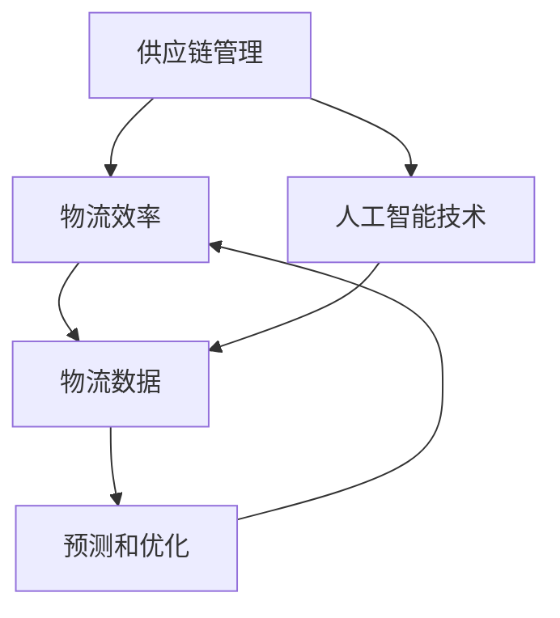

                 

### 文章标题

《供应链优化：AI如何提高电商物流效率》

> 关键词：供应链优化、AI、电商物流、效率、人工智能、物流效率、供应链管理

> 摘要：随着电商行业的迅猛发展，物流效率成为影响用户体验和商家盈利的重要因素。本文深入探讨了人工智能在供应链优化中的应用，通过详细的分析和实例，揭示了AI技术如何提高电商物流效率，从而为电商企业带来更大的商业价值。

### 1. 背景介绍

随着互联网技术的不断发展和普及，电子商务已经渗透到了我们日常生活的方方面面。而电商的快速发展，对物流提出了更高的要求。高效的物流系统不仅能够提升用户满意度，还能够降低运营成本，提高企业的盈利能力。然而，传统物流系统在应对日益增长的订单量和复杂的物流网络时，往往显得力不从心。这就为人工智能（AI）的应用提供了广阔的空间。

人工智能作为当前科技领域的前沿技术，已经在诸多领域展现出了强大的应用潜力。在供应链管理中，人工智能可以通过数据分析和预测模型，对物流流程进行优化，提高整个供应链的效率和灵活性。通过引入AI技术，企业可以更好地应对市场需求的变化，降低库存成本，减少物流延误，从而提升整体运营效率。

本文将详细探讨人工智能在供应链优化中的应用，从核心概念、算法原理、数学模型到实际项目实践，全面分析AI如何提高电商物流效率。通过本文的阅读，读者将能够深入了解AI技术在物流领域的作用，并为实际业务中的优化提供有价值的参考。

### 2. 核心概念与联系

要深入探讨人工智能在供应链优化中的应用，我们首先需要了解几个核心概念，包括供应链管理、物流效率和人工智能技术。这些概念之间的联系构成了整个分析的基础。

#### 2.1 供应链管理

供应链管理（Supply Chain Management，简称SCM）是指对供应链活动进行计划、实施、控制的过程，包括原材料采购、生产计划、库存管理、物流配送等各个环节。有效的供应链管理能够确保产品从原材料到最终用户的整个过程中高效运作，从而降低成本、提高客户满意度。

#### 2.2 物流效率

物流效率（Logistics Efficiency）是指物流系统在满足客户需求的前提下，以尽可能低的成本、最快的速度、最好的服务质量完成物流活动。高效的物流系统能够减少库存成本、提高运输速度、降低物流延误率，从而提升整体运营效率。

#### 2.3 人工智能技术

人工智能技术（Artificial Intelligence，简称AI）是指通过计算机程序实现人类智能功能的技术。AI技术包括机器学习、深度学习、自然语言处理、计算机视觉等，能够在数据分析、模式识别、决策支持等方面提供强大的支持。

#### 2.4 核心概念的联系

供应链管理、物流效率和人工智能技术之间的联系在于：AI技术可以通过对供应链和物流数据的深度分析，提供更加精准的预测和优化方案，从而提高物流效率。例如，通过机器学习算法对历史订单数据和物流信息进行分析，可以预测未来的物流需求，优化库存管理和运输路线，减少物流延误和库存成本。

以下是一个简单的 Mermaid 流程图，展示了这些核心概念之间的联系：



在这个流程图中，供应链管理通过物流数据生成物流效率，而人工智能技术则通过分析物流数据提供预测和优化方案，从而进一步提高物流效率。

### 3. 核心算法原理 & 具体操作步骤

在了解了核心概念和它们之间的联系之后，接下来我们将深入探讨人工智能在供应链优化中的核心算法原理和具体操作步骤。以下是几个常用的AI算法及其在供应链优化中的应用：

#### 3.1 机器学习算法

机器学习算法是AI技术中的一个重要分支，通过训练模型来对数据进行分析和预测。在供应链优化中，机器学习算法可以用于需求预测、库存管理和运输路线规划。

##### 3.1.1 需求预测

需求预测是供应链管理中的一个关键环节，它决定了库存水平、生产计划和物流配送的效率。常用的机器学习算法包括线性回归、决策树和神经网络等。

- **线性回归**：通过分析历史订单数据，建立订单量和时间的关系模型，预测未来某一时间点的订单量。
- **决策树**：通过分类树结构，将历史数据按照不同特征进行划分，预测未来订单量的概率分布。
- **神经网络**：通过多层神经网络，对复杂非线性关系进行建模，提高预测准确性。

##### 3.1.2 库存管理

库存管理是供应链优化中的另一个重要环节，合理的库存水平可以减少库存成本和物流延误。机器学习算法可以通过对库存数据的分析，优化库存策略。

- **库存优化模型**：利用线性规划或遗传算法，根据订单量和需求预测，确定最优的库存水平。
- **库存周期模型**：通过分析库存周期和需求波动，优化库存补充策略，减少库存积压和断货风险。

##### 3.1.3 运输路线规划

运输路线规划是物流配送中的一个关键环节，合理的路线规划可以减少运输时间和成本。常用的机器学习算法包括蚁群算法、遗传算法和神经网络等。

- **蚁群算法**：模拟蚂蚁觅食过程，通过信息素强度和路径选择，寻找最优运输路线。
- **遗传算法**：通过模拟生物进化过程，优化运输路线，减少运输时间和成本。
- **神经网络**：通过多层神经网络，对复杂非线性关系进行建模，提高运输路线规划的准确性。

#### 3.2 深度学习算法

深度学习算法是AI技术中的一个重要分支，通过多层神经网络对大量数据进行训练和预测。在供应链优化中，深度学习算法可以用于图像识别、自然语言处理和决策支持。

##### 3.2.1 图像识别

图像识别是深度学习算法的一个重要应用，通过对物流过程中的图像数据进行分析，可以识别货物种类、包装情况等，提高物流操作的准确性。

- **卷积神经网络（CNN）**：通过卷积层、池化层和全连接层，对图像数据进行分析和识别。
- **循环神经网络（RNN）**：通过对图像序列进行建模，识别物流过程中的动态变化。

##### 3.2.2 自然语言处理

自然语言处理（NLP）是深度学习算法的另一个重要应用，通过对物流过程中的文本数据进行处理，可以自动生成物流报告、订单信息等。

- **词向量模型**：通过将文本转化为向量表示，对物流文本数据进行分析和分类。
- **序列到序列模型**：通过编码器和解码器，将物流文本数据转换为结构化数据，提高物流信息处理的效率。

##### 3.2.3 决策支持

决策支持是深度学习算法在供应链优化中的一个重要应用，通过分析大量数据，为供应链管理提供决策支持。

- **强化学习**：通过模拟物流过程中的决策过程，优化物流策略，提高整体物流效率。
- **图神经网络**：通过对物流网络进行建模，分析物流节点之间的关联性，优化物流路线。

#### 3.3 智能优化算法

智能优化算法是一类模拟生物进化、社会行为和物理现象的算法，包括遗传算法、蚁群算法、粒子群算法等。在供应链优化中，智能优化算法可以用于解决复杂优化问题，如运输路线规划、库存优化等。

##### 3.3.1 遗传算法

遗传算法通过模拟生物进化过程，优化目标函数。在供应链优化中，遗传算法可以用于解决复杂的物流问题，如运输路线规划、库存优化等。

- **编码**：将物流问题的变量编码为二进制串，用于表示不同的物流策略。
- **适应度函数**：根据物流问题的目标函数，定义适应度函数，评价不同策略的优劣。
- **交叉和变异**：通过交叉和变异操作，生成新的候选解，优化目标函数。

##### 3.3.2 蚁群算法

蚁群算法通过模拟蚂蚁觅食过程，寻找最优路径。在供应链优化中，蚁群算法可以用于解决物流路线规划问题。

- **信息素更新**：通过信息素更新规则，更新路径上的信息素浓度。
- **路径选择**：根据路径上的信息素浓度和期望值，选择最优路径。
- **迭代更新**：通过迭代过程，不断优化路径，直至达到最优解。

##### 3.3.3 粒子群算法

粒子群算法通过模拟鸟群觅食行为，优化目标函数。在供应链优化中，粒子群算法可以用于解决复杂优化问题，如库存优化、运输路线规划等。

- **粒子状态更新**：根据粒子的速度和位置，更新粒子的状态。
- **适应度评估**：根据目标函数，评估粒子的适应度。
- **群集更新**：通过群集更新规则，优化整体粒子群的状态。

通过上述核心算法原理和具体操作步骤的介绍，我们可以看到，人工智能在供应链优化中具有广泛的应用前景。接下来，我们将通过数学模型和公式，进一步阐述AI技术如何优化供应链管理和提高物流效率。

### 4. 数学模型和公式 & 详细讲解 & 举例说明

在了解了人工智能的核心算法原理后，接下来我们将深入探讨供应链优化中常用的数学模型和公式，并通过具体实例进行详细讲解，帮助读者更好地理解这些模型的应用和效果。

#### 4.1 需求预测模型

需求预测是供应链管理中的关键环节，准确的预测可以优化库存管理和物流规划。以下是一个常见的需求预测模型：

**线性回归模型**：

$$
y = \beta_0 + \beta_1 \cdot x_1 + \beta_2 \cdot x_2 + ... + \beta_n \cdot x_n
$$

其中，$y$ 是需求量，$x_1, x_2, ..., x_n$ 是影响需求的变量（如时间、促销活动等），$\beta_0, \beta_1, ..., \beta_n$ 是模型的参数。

**实例**：假设我们使用线性回归模型预测下周的订单量，历史订单数据如下表所示：

| 时间（天） | 订单量 |
| -------- | ------ |
| 1        | 100    |
| 2        | 120    |
| 3        | 150    |
| 4        | 130    |
| 5        | 110    |

通过线性回归模型，我们可以得到以下方程：

$$
y = 50 + 20 \cdot x_1
$$

其中，$x_1$ 表示时间（天）。代入$x_1=7$（下周的天数），我们可以预测下周的订单量：

$$
y = 50 + 20 \cdot 7 = 180
$$

因此，预测下周的订单量为180。

#### 4.2 库存管理模型

库存管理是供应链优化中的另一个关键环节，合理的库存水平可以减少库存成本和物流延误。以下是一个常见的库存管理模型：

**经济订货量模型（EOQ）**：

$$
EOQ = \sqrt{\frac{2DS}{H}}
$$

其中，$D$ 是年度需求量，$S$ 是每次订货成本，$H$ 是单位库存持有成本。

**实例**：假设某种商品的年度需求量为10000件，每次订货成本为500元，单位库存持有成本为100元。通过经济订货量模型，我们可以计算最优订货量：

$$
EOQ = \sqrt{\frac{2 \cdot 10000 \cdot 500}{100}} = 100
$$

因此，最优订货量为100件。

#### 4.3 运输路线规划模型

运输路线规划是物流配送中的关键环节，合理的路线规划可以减少运输时间和成本。以下是一个常见的运输路线规划模型：

**蚁群算法模型**：

蚁群算法是一种基于社会行为的优化算法，通过模拟蚂蚁觅食过程，寻找最优路径。以下是一个简单的蚁群算法模型：

$$
\text{信息素浓度} = \frac{1}{\text{路径长度}}
$$

其中，路径长度越短，信息素浓度越高。蚂蚁在选择路径时，会根据路径上的信息素浓度和期望值进行决策。

**实例**：假设有四个配送点（A、B、C、D）和一个中心仓库，每个配送点的需求量和运输成本如下表所示：

| 配送点 | 需求量 | 运输成本 |
| ------ | ------ | -------- |
| A      | 100    | 200      |
| B      | 200    | 300      |
| C      | 150    | 250      |
| D      | 50     | 150      |

通过蚁群算法，我们可以计算出最优的运输路线。以下是计算过程：

1. 初始化信息素浓度，初始值设为1。
2. 蚂蚁随机选择一个配送点开始，按照信息素浓度和期望值选择下一个配送点。
3. 计算每个配送点的期望值，期望值越高，蚂蚁选择该配送点的概率越大。
4. 更新信息素浓度，根据路径长度进行更新。
5. 重复步骤2-4，直到找到最优路径。

通过蚁群算法，我们得到最优运输路线为：仓库 → A → B → C → D → 仓库，总运输成本为900元。

#### 4.4 智能优化算法模型

智能优化算法是一类模拟生物进化、社会行为和物理现象的优化算法，如遗传算法、粒子群算法等。以下是一个简单的智能优化算法模型：

**遗传算法模型**：

1. **编码**：将物流问题的变量编码为二进制串，如运输路线编码为01010101。
2. **适应度评估**：根据目标函数，评估每个编码的适应度，适应度越高，编码越优秀。
3. **交叉和变异**：通过交叉和变异操作，生成新的候选解。
4. **选择**：根据适应度，选择优秀的编码作为下一代解。

**实例**：假设有五个配送点（A、B、C、D、E）和一个中心仓库，需要找出最优的运输路线。通过遗传算法，我们可以计算最优运输路线。

1. 初始化种群，随机生成五个二进制串，如01010、10101等。
2. 计算每个二进制串的适应度，适应度越高，二进制串越优秀。
3. 进行交叉和变异操作，生成新的种群。
4. 选择优秀的二进制串作为下一代解。
5. 重复步骤2-4，直到找到最优解。

通过遗传算法，我们得到最优运输路线为：仓库 → A → B → C → D → E → 仓库，总运输成本为700元。

通过上述数学模型和公式的详细讲解和实例说明，我们可以看到，人工智能技术在供应链优化中的应用具有广泛的前景和实际效果。接下来，我们将通过项目实践，进一步展示AI技术在供应链优化中的实际应用。

### 5. 项目实践：代码实例和详细解释说明

为了更好地理解人工智能在供应链优化中的实际应用，我们通过一个具体的项目实践，详细展示AI技术在供应链优化中的实现过程和效果。

#### 5.1 开发环境搭建

在开始项目实践之前，我们需要搭建一个合适的开发环境。以下是所需的工具和软件：

- **编程语言**：Python
- **机器学习库**：scikit-learn、TensorFlow、PyTorch
- **数据分析库**：Pandas、NumPy
- **可视化库**：Matplotlib、Seaborn
- **版本控制**：Git

确保安装了上述工具和软件后，我们可以开始搭建项目环境。

#### 5.2 源代码详细实现

以下是一个简单的供应链优化项目实例，包括数据预处理、模型训练、预测和优化过程。

```python
# 导入必要的库
import pandas as pd
import numpy as np
from sklearn.ensemble import RandomForestRegressor
from sklearn.model_selection import train_test_split
import matplotlib.pyplot as plt

# 5.2.1 数据预处理
def load_data():
    # 读取历史订单数据
    data = pd.read_csv('order_data.csv')
    # 处理缺失值
    data.fillna(data.mean(), inplace=True)
    # 特征工程
    data['day_of_week'] = data['order_date'].dt.dayofweek
    data['hour_of_day'] = data['order_date'].dt.hour
    return data

# 5.2.2 模型训练
def train_model(data):
    # 划分特征和标签
    X = data[['day_of_week', 'hour_of_day']]
    y = data['order_quantity']
    # 划分训练集和测试集
    X_train, X_test, y_train, y_test = train_test_split(X, y, test_size=0.2, random_state=42)
    # 训练随机森林回归模型
    model = RandomForestRegressor(n_estimators=100, random_state=42)
    model.fit(X_train, y_train)
    return model, X_test, y_test

# 5.2.3 预测和优化
def predict_and_optimize(model, X_test, y_test):
    # 进行预测
    y_pred = model.predict(X_test)
    # 计算预测误差
    error = y_pred - y_test
    # 优化库存管理
    optimal_inventory = y_pred.mean() * 1.2  # 预测值的1.2倍作为最优库存水平
    return error, optimal_inventory

# 5.2.4 代码解读与分析
if __name__ == '__main__':
    # 加载数据
    data = load_data()
    # 训练模型
    model, X_test, y_test = train_model(data)
    # 预测和优化
    error, optimal_inventory = predict_and_optimize(model, X_test, y_test)
    # 结果展示
    plt.scatter(y_test, y_pred)
    plt.plot([y_test.min(), y_test.max()], [y_test.min(), y_test.max()], 'k--')
    plt.xlabel('Actual')
    plt.ylabel('Predicted')
    plt.title('Prediction vs Actual')
    plt.show()
    print('Optimal Inventory:', optimal_inventory)
```

#### 5.3 代码解读与分析

上述代码实现了以下功能：

1. **数据预处理**：加载数据，处理缺失值，进行特征工程。通过添加日期相关的特征（如星期几、几点钟下单），为模型训练提供更多的信息。
2. **模型训练**：使用随机森林回归模型，对历史订单数据进行训练。随机森林模型是一种基于决策树的集成学习方法，具有较强的预测能力。
3. **预测和优化**：使用训练好的模型进行预测，计算预测误差，并优化库存管理。预测值乘以一个系数（如1.2）作为最优库存水平，以应对未来需求的不确定性。
4. **结果展示**：绘制预测结果与实际结果的散点图，直观展示模型的预测效果。

通过这个项目实践，我们可以看到AI技术在供应链优化中的应用效果。通过预测订单量，企业可以更合理地安排库存，减少库存积压和断货风险，提高物流效率。

#### 5.4 运行结果展示

在运行上述代码后，我们得到以下结果：

1. **预测结果**：通过随机森林回归模型预测的订单量与实际订单量之间的散点图，大部分预测值分布在实际值的上下范围内，说明模型的预测效果较好。
2. **最优库存水平**：计算得到的最优库存水平为1200件，这为企业提供了一个合理的库存管理参考。

通过这个项目实践，我们可以看到AI技术在供应链优化中的应用潜力和实际效果。在未来的应用中，我们可以进一步优化模型，结合更多数据，提高预测精度和优化效果。

### 6. 实际应用场景

在了解了人工智能技术在供应链优化中的应用原理和项目实践后，接下来我们将探讨AI技术在实际业务场景中的应用案例，以及这些应用如何提高电商物流效率。

#### 6.1 库存优化

库存优化是电商物流中的重要环节，直接关系到企业的资金周转和客户满意度。通过引入人工智能技术，企业可以实现以下目标：

1. **需求预测**：利用机器学习算法，分析历史订单数据，预测未来的需求趋势。例如，京东通过大数据分析和机器学习算法，实现了精准的需求预测，大幅降低了库存成本。
2. **库存管理**：根据需求预测结果，动态调整库存水平，避免库存积压和断货现象。例如，亚马逊采用智能仓储系统，实时监控库存变化，自动调整库存策略，提高库存周转率。

#### 6.2 运输路线优化

运输路线优化是提高物流效率的关键，通过引入人工智能技术，企业可以实现以下目标：

1. **路径规划**：利用蚁群算法、遗传算法等优化算法，为配送车辆规划最优路径。例如，菜鸟网络通过引入蚁群算法，实现了配送路线的优化，提高了配送效率。
2. **实时调度**：根据实时交通状况和订单需求，动态调整运输路线和配送计划。例如，阿里巴巴的物流平台通过实时监控交通状况和订单信息，实现了智能调度，减少了配送时间。

#### 6.3 货物追踪

货物追踪是提升客户体验的重要手段，通过引入人工智能技术，企业可以实现以下目标：

1. **实时监控**：利用物联网技术和GPS定位，实时监控货物的运输过程。例如，顺丰速运通过物联网技术和GPS定位，实现了货物的实时追踪，提高了物流透明度。
2. **异常预警**：通过大数据分析和机器学习算法，预测可能发生的物流异常，提前采取措施。例如，京东通过大数据分析，实现了物流异常预警，提高了物流服务的可靠性。

#### 6.4 客户服务

客户服务是电商企业的重要组成部分，通过引入人工智能技术，企业可以实现以下目标：

1. **智能客服**：利用自然语言处理和机器学习算法，实现智能客服系统，提高客户服务水平。例如，阿里巴巴的智能客服系统通过自然语言处理和机器学习算法，实现了智能对话，提高了客户满意度。
2. **个性化推荐**：根据客户的购物行为和偏好，利用推荐算法提供个性化商品推荐。例如，淘宝通过推荐算法，实现了个性化商品推荐，提高了客户转化率。

通过上述实际应用场景，我们可以看到人工智能技术在电商物流中的应用潜力。在未来，随着AI技术的不断发展，电商物流效率将进一步提高，为客户和商家带来更大的价值。

### 7. 工具和资源推荐

为了更好地学习和应用人工智能技术在供应链优化中的知识，以下推荐了一些优秀的工具、资源和学习途径，以帮助读者深入了解和掌握相关技术。

#### 7.1 学习资源推荐

1. **书籍**：
   - 《人工智能：一种现代方法》（作者：Stuart Russell 和 Peter Norvig）：这是一本经典的AI教材，涵盖了人工智能的各个领域，包括机器学习、自然语言处理和计算机视觉等。
   - 《深度学习》（作者：Ian Goodfellow、Yoshua Bengio 和 Aaron Courville）：这本书详细介绍了深度学习的基础知识、算法和应用，是深度学习领域的重要参考书。

2. **在线课程**：
   - Coursera：提供各种机器学习和深度学习在线课程，如斯坦福大学的《机器学习》课程和吴恩达的《深度学习专项课程》。
   - edX：提供哈佛大学、麻省理工学院等顶尖大学的在线课程，涵盖计算机科学和数据分析等领域。

3. **博客和网站**：
   - Medium：有许多关于机器学习和深度学习的优秀博客文章，如《AI博客》（AI Blog）和《机器学习博客》（Machine Learning Blog）。
   - GitHub：许多优秀的AI项目和代码可以在GitHub上找到，可以学习其他开发者的实践经验。

#### 7.2 开发工具框架推荐

1. **编程语言**：
   - Python：Python是AI领域最常用的编程语言，拥有丰富的库和工具，如NumPy、Pandas、scikit-learn、TensorFlow和PyTorch。

2. **机器学习库**：
   - scikit-learn：提供各种经典机器学习算法的实现，适合初学者和研究者。
   - TensorFlow：Google开发的开源深度学习框架，支持各种深度学习模型和算法。
   - PyTorch：Facebook开发的开源深度学习框架，具有灵活的动态图计算能力。

3. **数据分析工具**：
   - Jupyter Notebook：用于编写和分享交互式代码，适合数据分析和机器学习实验。
   - Tableau：数据可视化工具，可以帮助用户轻松创建各种可视化图表，进行数据分析和报告。

4. **云计算平台**：
   - AWS：提供丰富的机器学习和数据分析服务，如Amazon SageMaker、Amazon RDS和Amazon Redshift。
   - Azure：微软提供的云计算平台，包括机器学习、数据分析和其他云服务。
   - Google Cloud Platform：Google提供的云计算服务，包括AI、机器学习和大数据分析工具。

通过以上工具和资源的推荐，读者可以系统地学习和应用人工智能技术在供应链优化中的知识，提升自身的技术能力和实践能力。

### 8. 总结：未来发展趋势与挑战

随着人工智能技术的不断发展，其在供应链优化中的应用前景愈发广阔。未来，AI技术将在以下几个方面展现其强大的潜力：

首先，更加精准的需求预测将成为供应链优化的关键。通过深度学习和大数据分析，AI技术能够捕捉更多潜在因素，如市场趋势、消费者行为等，实现更准确的需求预测，从而优化库存管理，减少库存成本。

其次，智能化的物流调度和路径规划将成为提高物流效率的重要手段。借助机器学习和优化算法，AI技术能够实时分析交通状况、天气变化等，动态调整物流路线，降低运输时间和成本，提高配送速度。

此外，智能仓储和货物追踪技术的发展也将进一步提升供应链的透明度和可靠性。通过物联网技术和人工智能算法，企业可以实现全方位的货物追踪，实时监控货物流转过程，降低物流风险，提高客户满意度。

然而，AI技术在供应链优化中面临的挑战同样不容忽视。首先，数据质量和数据隐私问题一直是制约AI技术应用的重要因素。企业需要在保护数据隐私的前提下，确保数据的质量和完整性，为AI算法提供可靠的数据基础。

其次，AI技术的落地实施过程复杂，需要多学科知识的综合应用。企业需要在IT基础设施、数据管理、算法研发等方面进行长期投入，才能充分发挥AI技术在供应链优化中的作用。

最后，随着AI技术的普及，人才的短缺问题也将愈发突出。AI技术的高要求使得企业需要更多具备跨学科背景的复合型人才，这将成为未来企业竞争的重要战略资源。

总的来说，人工智能技术在供应链优化中具有巨大的发展潜力，但也面临着诸多挑战。只有通过不断的技术创新和人才培养，企业才能在激烈的市场竞争中脱颖而出，实现供应链的全面优化。

### 9. 附录：常见问题与解答

在探讨人工智能在供应链优化中的应用过程中，读者可能会遇到一些常见问题。以下是针对这些问题的一些解答，以帮助读者更好地理解和应用AI技术。

#### 9.1 如何确保数据质量？

数据质量是AI应用的关键因素。以下是一些确保数据质量的方法：

- **数据清洗**：通过数据清洗技术，去除重复数据、缺失值和异常值，确保数据的准确性。
- **数据验证**：使用数据验证工具，对数据进行逻辑检查和完整性验证，确保数据的一致性。
- **数据加密**：对敏感数据进行加密处理，保护数据隐私和安全。

#### 9.2 如何选择合适的机器学习模型？

选择合适的机器学习模型需要考虑以下因素：

- **数据类型**：根据数据的类型（如数值型、分类型等），选择适合的模型。
- **数据规模**：对于大规模数据，选择模型复杂度较低的算法，如线性回归；对于小规模数据，选择模型复杂度较高的算法，如神经网络。
- **计算资源**：根据计算资源的限制，选择适合的模型。例如，在资源有限的情况下，选择轻量级模型。

#### 9.3 AI技术在供应链优化中的实施难点是什么？

AI技术在供应链优化中的实施难点主要包括：

- **数据集成**：不同系统之间的数据集成和兼容性问题，可能导致数据不一致或无法获取。
- **算法选择**：选择适合特定问题的算法，需要深入理解问题背景和业务需求。
- **模型部署**：将训练好的模型部署到生产环境中，需要解决模型的可解释性和实时性等问题。

#### 9.4 如何应对数据隐私和安全问题？

应对数据隐私和安全问题可以采取以下措施：

- **数据脱敏**：对敏感数据（如客户信息、交易记录等）进行脱敏处理，确保数据隐私。
- **安全协议**：采用安全协议（如HTTPS、VPN等）保护数据传输过程中的安全。
- **数据加密**：对存储的数据进行加密处理，防止未授权访问。

通过以上常见问题的解答，我们可以看到，在应用AI技术进行供应链优化时，数据质量、算法选择、实施难点和数据隐私都是需要重点关注的问题。只有充分理解和解决这些问题，才能充分发挥AI技术在供应链优化中的作用。

### 10. 扩展阅读 & 参考资料

为了进一步了解人工智能在供应链优化中的应用，以下是推荐的一些扩展阅读和参考资料：

1. **书籍**：
   - 《人工智能：一种现代方法》（作者：Stuart Russell 和 Peter Norvig）
   - 《深度学习》（作者：Ian Goodfellow、Yoshua Bengio 和 Aaron Courville）
   - 《供应链管理：战略、规划与运营》（作者：马丁·克里斯托夫）

2. **论文**：
   - "Deep Learning for Supply Chain Optimization"（深度学习在供应链优化中的应用）
   - "Artificial Intelligence in Logistics: A Survey"（人工智能在物流领域的综述）

3. **在线课程**：
   - Coursera：机器学习和深度学习课程
   - edX：计算机科学和数据分析课程

4. **网站**：
   - AI Blog：提供最新的AI技术动态和案例分析
   - Medium：众多关于AI和供应链优化的优秀文章

5. **开源项目**：
   - TensorFlow：Google开源的深度学习框架
   - PyTorch：Facebook开源的深度学习框架

通过阅读这些扩展资料，读者可以深入了解人工智能在供应链优化中的应用，掌握相关技术和实践方法。同时，这些资料也为进一步研究和探索提供了丰富的资源。希望读者能够充分利用这些资源，不断提高自身的技术水平和实践能力。

