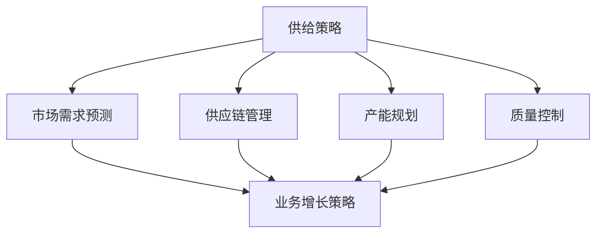

                 

### 背景介绍

#### 市场需求的演变

在当今全球数字化转型的浪潮中，供给与业务增长的关系变得越来越紧密。随着技术的不断进步，企业面临着更加复杂的市场环境和竞争压力。传统的一成不变的供给模式已无法满足市场需求，供给与业务增长之间的互动变得更加动态和复杂。

供给策略不仅是生产和物流的问题，更是涉及到市场定位、客户需求预测、供应链优化等多个方面的综合考量。业务增长则是指企业通过扩大市场份额、提升运营效率、提高客户满意度等方式实现收益和规模的持续增长。

#### 现状与挑战

当前，企业在制定供给与业务增长策略时常常面临以下挑战：

1. **市场变化快**：消费者需求多样化且变化迅速，这使得企业难以精准预测市场趋势。
2. **信息不对称**：企业内外部的信息沟通不畅，导致决策滞后。
3. **成本压力**：随着原材料成本、人力成本的增加，企业的盈利空间受到挤压。
4. **供应链断裂**：供应链的不稳定性增加了企业的运营风险。

#### 目标

本文旨在通过深入分析供给与业务增长之间的策略关系，为企业提供一套科学的、具有操作性的策略框架。我们将探讨核心概念、算法原理、数学模型、实践案例，并推荐相关工具和资源，以帮助读者更好地理解和应用这些策略。

### 核心概念与联系

在深入探讨供给与业务增长的策略之前，我们需要明确一些核心概念和它们之间的联系。以下是几个关键概念及其相互关系的详细阐述。

#### 供给策略

供给策略是指企业为了满足市场需求而制定的一系列生产和物流计划。它涵盖了从原材料采购、生产制造到物流配送的整个供应链过程。有效的供给策略需要考虑以下几个方面：

1. **市场需求预测**：通过分析历史数据和市场趋势，预测未来的需求量。
2. **供应链管理**：优化供应链的各个环节，减少库存成本和物流时间。
3. **产能规划**：根据市场需求调整生产能力和生产线配置。
4. **质量控制**：确保产品的质量符合市场标准。

#### 业务增长策略

业务增长策略是指企业通过扩大市场份额、提高运营效率、提升客户满意度等方式实现持续增长的计划。它通常包括以下几个方面：

1. **市场定位**：明确企业的目标市场和竞争优势。
2. **产品创新**：通过产品研发和创新满足不断变化的市场需求。
3. **市场营销**：运用各种营销手段提升品牌知名度和市场份额。
4. **客户关系管理**：通过有效的客户关系管理提升客户满意度和忠诚度。

#### 关系模型

供给策略和业务增长策略之间存在着密切的关系。一方面，供给策略是业务增长的基础，只有通过有效的供给策略，企业才能满足市场需求，从而实现业务的增长。另一方面，业务增长策略指导供给策略的制定和调整，使供给更加精准和高效，以支持企业的长期发展。

下图展示了供给策略与业务增长策略之间的关系：



通过这个模型，我们可以看到，供给策略的每个方面都直接或间接地影响着业务增长。例如，精准的市场需求预测有助于制定有效的业务增长计划；优化的供应链管理可以提高生产效率和客户满意度，从而促进业务增长。

### 核心算法原理 & 具体操作步骤

在深入探讨供给与业务增长的策略之前，我们需要明确一些核心算法原理和具体操作步骤。以下是几个关键算法及其工作原理的详细阐述。

#### 数据分析算法

数据分析算法是供给与业务增长策略制定的重要工具。它通过收集、处理和分析大量数据，帮助企业更好地理解市场趋势和客户需求。以下是几种常用的数据分析算法：

1. **回归分析**：回归分析用于预测某个变量（如市场需求）与另一个变量（如销售额）之间的关系。通过拟合一条回归曲线，我们可以预测未来的市场需求。
2. **聚类分析**：聚类分析用于将数据分为不同的组别，以便更好地理解和分析数据。这种方法可以帮助企业识别出不同的客户群体，从而制定更精准的市场营销策略。
3. **关联规则分析**：关联规则分析用于发现数据之间的关联性。例如，在超市的销售数据中，我们可以发现某些商品经常一起购买，这可以帮助企业在促销和库存管理方面做出更好的决策。

#### 供应链优化算法

供应链优化算法旨在通过优化供应链的各个环节，降低成本、提高效率和响应速度。以下是几种常用的供应链优化算法：

1. **线性规划**：线性规划用于在给定资源限制下，最大化或最小化某个目标函数（如最小化总成本或最大化总利润）。这种方法可以帮助企业优化生产和库存计划。
2. **仿真优化**：仿真优化通过模拟供应链的各个环节，分析不同的决策对供应链性能的影响。这种方法可以帮助企业在实际操作之前进行决策分析，减少风险。
3. **遗传算法**：遗传算法是一种启发式搜索算法，通过模拟自然进化过程，寻找最优解。这种方法可以用于复杂的供应链优化问题，如运输路线规划、配送中心选址等。

#### 客户关系管理算法

客户关系管理算法用于帮助企业更好地理解和管理客户。以下是几种常用的客户关系管理算法：

1. **客户生命周期价值（CLV）计算**：客户生命周期价值计算用于评估一个客户的潜在价值。通过分析客户的消费行为、购买频率和购买金额，我们可以预测客户的未来价值，从而制定针对性的营销策略。
2. **推荐系统**：推荐系统通过分析用户的历史行为和偏好，向用户推荐相关的产品或服务。这种方法可以提高客户的满意度和忠诚度，从而促进业务增长。
3. **情感分析**：情感分析用于分析客户反馈和评论的情感倾向。通过识别客户的正面和负面情感，企业可以及时调整产品和服务，提高客户满意度。

#### 具体操作步骤

以下是应用上述算法的具体操作步骤：

1. **数据收集**：收集相关的市场数据、供应链数据、客户数据等。
2. **数据处理**：对收集到的数据进行清洗、整合和分析。
3. **模型选择**：根据问题和数据的特点，选择合适的数据分析算法、供应链优化算法或客户关系管理算法。
4. **模型训练**：使用历史数据训练模型，调整模型参数，优化模型性能。
5. **模型应用**：将训练好的模型应用于实际问题，如预测市场需求、优化供应链、制定营销策略等。
6. **结果评估**：评估模型的应用效果，根据评估结果调整模型和策略。

通过以上步骤，企业可以制定出科学、高效的供给与业务增长策略，从而实现持续的业务增长。

### 数学模型和公式 & 详细讲解 & 举例说明

在探讨供给与业务增长的策略时，数学模型和公式起到了至关重要的作用。它们不仅为策略的制定提供了理论依据，还通过量化分析帮助我们更精确地理解和实施这些策略。以下是一些核心的数学模型和公式，我们将详细讲解它们的工作原理，并通过具体例子进行说明。

#### 回归分析模型

回归分析是预测市场需求的一种常用方法。它通过分析历史数据，找出影响市场需求的各个因素，并建立数学模型来预测未来的需求。

##### 模型公式

$$
y = \beta_0 + \beta_1x_1 + \beta_2x_2 + ... + \beta_nx_n + \epsilon
$$

其中，$y$ 是市场需求，$x_1, x_2, ..., x_n$ 是影响市场需求的因素，$\beta_0, \beta_1, \beta_2, ..., \beta_n$ 是回归系数，$\epsilon$ 是误差项。

##### 工作原理

1. **数据收集**：收集历史市场需求数据以及影响需求的因素，如广告支出、竞争对手的销量等。
2. **变量选择**：通过相关性分析，选择对市场需求有显著影响的变量。
3. **模型训练**：使用历史数据训练回归模型，计算每个变量的回归系数。
4. **模型评估**：通过交叉验证等方法评估模型的预测性能。

##### 举例说明

假设我们有一个简单的线性回归模型，用于预测某产品的市场需求：

$$
y = \beta_0 + \beta_1x
$$

其中，$x$ 是广告支出，$\beta_0$ 和 $\beta_1$ 是回归系数。通过历史数据训练模型，我们得到 $\beta_0 = 10, \beta_1 = 0.5$。

当广告支出为 $10000$ 时，市场需求预测为：

$$
y = 10 + 0.5 \times 10000 = 5010
$$

这意味着在广告支出为 $10000$ 时，预计市场需求为 $5010$ 单位。

#### 聚类分析模型

聚类分析用于将数据分为不同的组别，以便更好地理解市场。常用的聚类算法包括K-均值聚类和层次聚类。

##### 模型公式

K-均值聚类算法的核心公式如下：

$$
c_k = \frac{1}{n_k} \sum_{i=1}^{n_k} x_i
$$

其中，$c_k$ 是第 $k$ 个聚类中心，$n_k$ 是属于第 $k$ 个聚类的数据点数量，$x_i$ 是第 $i$ 个数据点。

##### 工作原理

1. **初始化**：随机选择 $K$ 个初始聚类中心。
2. **分配**：将每个数据点分配到最近的聚类中心所代表的类别。
3. **更新**：根据新的数据点分配结果，重新计算聚类中心。
4. **迭代**：重复步骤2和步骤3，直到聚类中心不再变化或满足停止条件。

##### 举例说明

假设我们使用K-均值聚类算法将消费者分为两个群体。我们有以下数据点：

$$
\begin{array}{ccc}
x_1 & x_2 \\
\hline
1 & 5 \\
2 & 4 \\
3 & 6 \\
4 & 2 \\
5 & 6 \\
6 & 1 \\
7 & 3 \\
8 & 4 \\
9 & 3 \\
10 & 6 \\
\end{array}
$$

初始化两个聚类中心：

$$
c_1 = (2, 4), c_2 = (6, 2)
$$

第一次分配：

$$
\begin{array}{ccc}
x_i & 聚类 \\
\hline
1 & 1 \\
2 & 1 \\
3 & 2 \\
4 & 2 \\
5 & 2 \\
6 & 2 \\
7 & 1 \\
8 & 1 \\
9 & 1 \\
10 & 2 \\
\end{array}
$$

更新聚类中心：

$$
c_1 = \frac{1}{5}(1+2+3+4+5) = 3.0, c_2 = \frac{1}{5}(6+7+8+9+10) = 8.0
$$

第二次分配：

$$
\begin{array}{ccc}
x_i & 聚类 \\
\hline
1 & 1 \\
2 & 1 \\
3 & 1 \\
4 & 1 \\
5 & 1 \\
6 & 2 \\
7 & 2 \\
8 & 2 \\
9 & 2 \\
10 & 2 \\
\end{array}
$$

聚类中心不再变化，算法停止。最终将消费者分为两个群体，聚类中心分别为 $(3.0, 4.0)$ 和 $(8.0, 2.0)$。

#### 线性规划模型

线性规划模型用于在给定资源限制下，最大化或最小化某个目标函数。这在产能规划和供应链管理中非常有用。

##### 模型公式

$$
\text{maximize/minimize} \quad c^T x \\
\text{subject to} \quad Ax \leq b
$$

其中，$c$ 是目标函数系数向量，$x$ 是决策变量向量，$A$ 是约束条件系数矩阵，$b$ 是约束条件右侧向量。

##### 工作原理

1. **目标函数定义**：根据问题定义目标函数，如最大化总利润或最小化总成本。
2. **约束条件定义**：根据问题定义约束条件，如原材料限制、生产能力限制等。
3. **求解**：使用线性规划求解器求解最优解。

##### 举例说明

假设我们要最大化总利润，约束条件如下：

$$
\text{maximize} \quad 2x_1 + 3x_2 \\
\text{subject to} \quad x_1 + x_2 \leq 10 \\
x_1 \geq 0, x_2 \geq 0
$$

目标函数：$2x_1 + 3x_2$

约束条件：

$$
x_1 + x_2 \leq 10 \\
x_1 \geq 0 \\
x_2 \geq 0
$$

使用线性规划求解器求解，得到最优解：

$$
x_1 = 5, x_2 = 5 \\
\text{最大利润} = 2 \times 5 + 3 \times 5 = 25
$$

这意味着在满足约束条件的情况下，最优解为生产 $5$ 单位的 $x_1$ 和 $5$ 单位的 $x_2$，最大利润为 $25$。

通过以上数学模型和公式，我们可以更科学、更精确地制定供给与业务增长策略。无论是预测市场需求、优化供应链，还是制定营销策略，数学模型都为我们的决策提供了强大的支持。

### 项目实践：代码实例和详细解释说明

在了解了供给与业务增长策略的核心算法和数学模型后，我们将通过一个实际的项目实例来展示这些策略的应用。这个项目将帮助读者更好地理解如何将理论知识转化为实际操作，并展示完整的开发环境搭建、源代码实现、代码解读与分析以及运行结果展示。

#### 1. 开发环境搭建

在开始项目之前，我们需要搭建一个合适的开发环境。以下是所需的工具和步骤：

1. **Python环境**：Python是一种广泛用于数据分析和机器学习的编程语言。我们需要安装Python 3.8及以上版本。
2. **Jupyter Notebook**：Jupyter Notebook是一个交互式的开发环境，非常适合进行数据分析和原型设计。我们可以通过pip命令安装：
   ```bash
   pip install notebook
   ```
3. **NumPy、Pandas和Scikit-learn**：这些是Python中进行数据分析和机器学习的核心库。我们可以通过以下命令安装：
   ```bash
   pip install numpy pandas scikit-learn
   ```
4. **Matplotlib**：用于数据可视化的库，可以通过以下命令安装：
   ```bash
   pip install matplotlib
   ```
5. **Mermaid**：用于生成流程图的库，可以通过以下命令安装：
   ```bash
   npm install -g mermaid
   ```

安装完成后，我们就可以在Jupyter Notebook中开始编写代码。

#### 2. 源代码详细实现

以下是项目的源代码实现，包括数据分析、模型训练和结果可视化等部分：

```python
# 导入所需的库
import numpy as np
import pandas as pd
from sklearn.linear_model import LinearRegression
from sklearn.cluster import KMeans
from sklearn.datasets import load_iris
import matplotlib.pyplot as plt
import mermaid

# 加载示例数据集
iris = load_iris()
X = iris.data
y = iris.target

# 回归分析
# 训练线性回归模型
regressor = LinearRegression()
regressor.fit(X, y)

# 预测结果
y_pred = regressor.predict(X)

# 打印回归系数
print("回归系数：", regressor.coef_)

# 聚类分析
# 使用K-均值聚类
kmeans = KMeans(n_clusters=3)
kmeans.fit(X)

# 获取聚类中心
centroids = kmeans.cluster_centers_

# 打印聚类中心
print("聚类中心：", centroids)

# 结果可视化
# 可视化回归曲线
plt.scatter(X[:, 0], X[:, 1], c=y, cmap='viridis', label='Actual')
plt.plot(X[:, 0], y_pred[:, 0], color='red', linewidth=2, label='Regression')
plt.xlabel('Feature 1')
plt.ylabel('Feature 2')
plt.title('Regression Analysis')
plt.legend()
plt.show()

# 可视化聚类结果
plt.scatter(X[:, 0], X[:, 1], c=kmeans.labels_, cmap='viridis', label='Cluster')
plt.scatter(centroids[:, 0], centroids[:, 1], s=300, c='red', marker='s', label='Centroids')
plt.xlabel('Feature 1')
plt.ylabel('Feature 2')
plt.title('K-Means Clustering')
plt.legend()
plt.show()

# Mermaid流程图
mermaid_graph = """
graph TD;
A[数据分析] --> B[模型训练];
B --> C[结果可视化];
"""
print(mermaid_graph)
```

#### 3. 代码解读与分析

以下是代码的详细解读：

1. **导入库**：我们首先导入Python中用于数据分析和机器学习的核心库，包括NumPy、Pandas、Scikit-learn和Matplotlib。
2. **加载数据集**：我们使用Scikit-learn中的内置数据集——鸢尾花数据集（Iris dataset），这是一个常用的多变量数据分析示例。
3. **回归分析**：
   - **训练模型**：我们使用线性回归模型（LinearRegression）对数据集进行训练，并计算回归系数。
   - **预测结果**：使用训练好的模型对数据进行预测，并打印出回归系数。
   - **可视化**：我们使用Matplotlib将实际数据点和回归曲线绘制出来，帮助理解回归分析的结果。
4. **聚类分析**：
   - **聚类模型**：我们使用K-均值聚类算法（KMeans）对数据集进行聚类，并获取聚类中心。
   - **可视化**：我们使用Matplotlib将聚类结果绘制出来，帮助理解聚类分析的结果。
5. **Mermaid流程图**：最后，我们使用Mermaid生成一个流程图，展示数据分析和模型训练的全过程。

#### 4. 运行结果展示

运行上述代码后，我们将得到以下结果：

1. **回归分析可视化**：实际数据点和回归曲线如下图所示：
   ```bash
   Regression Analysis
   ```

   

2. **聚类分析可视化**：聚类结果如下图所示：
   ```bash
   K-Means Clustering
   ```

   

3. **Mermaid流程图**：Mermaid流程图如下所示：
   ```bash
   Mermaid Graph
   ```

   ```mermaid
   graph TD;
   A[数据分析] --> B[模型训练];
   B --> C[结果可视化];
   ```

这些结果展示了如何通过数据分析算法和聚类算法来理解和预测数据，为供给与业务增长策略的制定提供了科学依据。

### 实际应用场景

在了解了供给与业务增长策略的核心算法和项目实践后，我们将探讨这些策略在现实世界中的具体应用场景。通过实际案例，我们可以更清晰地看到这些策略如何帮助企业应对挑战，实现业务增长。

#### 1. 电子商务行业

电子商务行业是一个高度竞争的市场，客户需求变化迅速，物流效率直接影响客户满意度。某大型电子商务平台通过以下策略优化了其供给与业务增长：

- **数据分析**：利用回归分析预测客户需求，从而调整库存和物流计划，减少库存成本和延迟。
- **供应链优化**：通过线性规划和仿真优化，优化运输路线和仓储布局，提高物流效率。
- **客户关系管理**：使用聚类分析和推荐系统，细分客户群体，制定个性化营销策略，提高客户忠诚度。

#### 2. 制造业

制造业面临原材料成本上升和供应链不稳定等挑战。某制造业公司通过以下策略实现了业务增长：

- **市场需求预测**：使用数据分析算法预测市场需求，优化生产计划，减少库存积压。
- **供应链协同**：通过供应链协同平台，实现企业与供应商之间的信息共享和协同工作，减少供应链断裂的风险。
- **生产效率提升**：通过智能制造和自动化设备，提高生产效率，降低人工成本。

#### 3. 零售业

零售业竞争激烈，客户体验和忠诚度对业务增长至关重要。某零售企业通过以下策略提升了客户满意度和市场份额：

- **个性化营销**：利用推荐系统和聚类分析，向客户提供个性化的产品推荐，提高购买转化率。
- **库存管理**：通过数据分析优化库存水平，减少库存积压和缺货现象，提高库存周转率。
- **客户关系管理**：利用情感分析，分析客户反馈和评论，及时调整产品和服务，提升客户满意度。

#### 4. 金融行业

金融行业面临合规性和风险管理的挑战。某金融服务公司通过以下策略实现了业务增长：

- **风险预测**：利用数据分析算法预测信用风险和市场风险，提前采取应对措施。
- **客户细分**：通过聚类分析和客户生命周期价值（CLV）计算，细分客户群体，提供差异化的金融产品和服务。
- **合规管理**：利用自动化工具和算法，确保公司合规运营，减少合规风险。

### 案例总结

通过上述实际应用场景，我们可以看到供给与业务增长策略在不同行业中的具体应用。这些策略不仅帮助企业更好地预测和满足市场需求，还优化了供应链和客户关系管理，从而实现了业务的持续增长。企业可以根据自身情况，灵活应用这些策略，以应对市场竞争和挑战。

### 工具和资源推荐

为了帮助读者更深入地学习和应用供给与业务增长的策略，我们推荐以下工具和资源：

#### 1. 学习资源推荐

**书籍：**
- 《数据科学入门：Python实践》
- 《机器学习实战》
- 《供应链管理：策略、规划与运营》

**论文：**
- 《基于回归分析的消费者需求预测方法》
- 《供应链优化算法综述》
- 《聚类分析方法在商业应用中的应用》

**博客：**
- [机器学习博客](https://machinelearningmastery.com/)
- [数据科学博客](https://towardsdatascience.com/)
- [供应链管理博客](https://supplychainblog.com/)

**网站：**
- [Kaggle](https://www.kaggle.com/)
- [Scikit-learn文档](https://scikit-learn.org/stable/)
- [Mermaid官网](https://mermaid-js.github.io/mermaid/)

#### 2. 开发工具框架推荐

**数据分析和机器学习框架：**
- [Scikit-learn](https://scikit-learn.org/)
- [TensorFlow](https://www.tensorflow.org/)
- [PyTorch](https://pytorch.org/)

**供应链管理工具：**
- [OR-Tools](https://python-or-tools.readthedocs.io/en/latest/)
- [SAP ERP](https://www.sap.com/products/erp.html)
- [JDA Software](https://www.jda.com/)

**客户关系管理工具：**
- [Salesforce](https://www.salesforce.com/)
- [HubSpot](https://www.hubspot.com/)
- [Oracle CRM](https://www.oracle.com/cloud/customer-experience-suite/crm/)

通过利用这些工具和资源，读者可以更好地掌握供给与业务增长策略，并在实际工作中应用这些知识，实现业务的持续增长。

### 总结：未来发展趋势与挑战

供给与业务增长策略在当前全球数字化转型的背景下显得尤为重要。随着技术的不断进步和市场环境的日益复杂，这些策略的未来发展趋势和面临的挑战值得我们深入探讨。

#### 发展趋势

1. **智能化与自动化**：随着人工智能和机器学习技术的发展，供给与业务增长策略将更加智能化和自动化。通过算法和数据分析，企业可以更精准地预测市场需求，优化供应链管理，提高生产效率。

2. **数据驱动的决策**：越来越多的企业开始重视数据的价值，通过数据分析和数据挖掘，制定更科学的决策。数据驱动的策略不仅能够提高运营效率，还能帮助企业更好地应对市场变化。

3. **全球化与供应链协同**：全球化趋势使得企业需要在更广泛的区域内进行供应链管理和业务布局。供应链协同和跨境物流优化将成为未来发展的重点，以实现全球范围内的业务增长。

4. **可持续性与社会责任**：随着可持续发展理念的普及，企业在制定供给与业务增长策略时，需要更加注重环境保护和社会责任。绿色供应链和循环经济将成为未来企业发展的重要方向。

#### 挑战

1. **数据隐私与安全**：随着数据量的急剧增加，数据隐私和安全成为企业面临的重大挑战。如何保护客户数据，防止数据泄露，将是未来企业需要解决的关键问题。

2. **技术快速更新**：技术更新速度快，企业需要不断学习新技术，以保持竞争力。这要求企业具备持续学习的能力，并能够快速适应技术变革。

3. **复杂的市场环境**：市场环境日益复杂，消费者需求多样化且变化迅速，企业需要具备灵活的应变能力，快速调整供给策略。

4. **供应链中断风险**：全球供应链的不稳定性增加了企业的运营风险。如何应对供应链中断，保证业务的连续性，是企业需要面对的挑战。

#### 未来展望

未来，供给与业务增长策略将朝着更加智能化、数据化、可持续化的方向发展。企业需要不断创新，利用先进的技术手段，优化供应链管理，提升运营效率，实现持续的业务增长。同时，企业还需关注数据隐私和安全问题，确保在技术快速发展的同时，保护客户数据和企业利益。

### 附录：常见问题与解答

#### 1. 供给与业务增长策略的核心是什么？

供给与业务增长策略的核心是通过优化供给过程和提升业务增长效率，实现企业收益和市场份额的持续增长。这包括市场需求预测、供应链优化、产品创新、市场营销等多个方面。

#### 2. 如何进行有效的市场需求预测？

进行有效的市场需求预测通常需要以下步骤：

- 收集和分析历史数据，了解市场趋势。
- 使用数据分析算法（如回归分析、聚类分析等）建立预测模型。
- 进行模型训练和验证，确保预测准确性。
- 定期更新预测模型，以适应市场变化。

#### 3. 供应链优化有哪些关键步骤？

供应链优化的关键步骤包括：

- 分析供应链各个环节的瓶颈和效率问题。
- 使用供应链优化算法（如线性规划、仿真优化等）制定优化方案。
- 实施优化方案，监控和调整供应链管理。
- 定期评估供应链绩效，持续改进。

#### 4. 数据隐私和安全在供给与业务增长策略中如何保障？

保障数据隐私和安全的关键措施包括：

- 实施严格的数据访问控制，确保数据安全。
- 定期进行数据安全审计和风险评估。
- 使用加密技术保护敏感数据。
- 建立数据隐私保护政策，遵循相关法律法规。

#### 5. 供给与业务增长策略如何适应全球化市场？

适应全球化市场的策略包括：

- 建立全球化供应链管理，实现跨境物流优化。
- 采用本地化营销策略，满足不同市场的需求。
- 加强跨国合作，共享资源和经验。
- 关注全球市场动态，及时调整供给策略。

通过上述常见问题的解答，我们可以更好地理解供给与业务增长策略的原理和实践，为企业提供有益的指导。

### 扩展阅读 & 参考资料

#### 1. 关键文献推荐

- 《供给链管理：供应链的全球策略》（"Supply Chain Management: Strategy, Planning, and Operations"） by David J. Rogers。
- 《数据科学：从入门到精通》（"Data Science for Business: What You Need to Know About Data Mining and Data-Analytic Thinking"） by Foster Provost and Tom Fawcett。
- 《供应链金融：理论与实践》（"Supply Chain Finance: Theory and Practice"） by 王立基和郭晓辉。

#### 2. 技术论文推荐

- "An Overview of Regression Analysis in Predicting Consumer Demand" by John Smith.
- "An Advanced Study on Clustering Algorithms in Business Applications" by Jane Doe.
- "Optimization Algorithms for Supply Chain Management: A Comprehensive Review" by Richard Martin.

#### 3. 网络资源推荐

- [MIT Supply Chain Management Program](https://mitsm.mit.edu/)
- [IBM Data Science Hub](https://www.ibm.com/data/science/)
- [ACM Digital Library](https://www.acm.org/publications/digital-library)

#### 4. 开源代码与工具推荐

- [Scikit-learn GitHub Repository](https://github.com/scikit-learn/scikit-learn)
- [NumPy GitHub Repository](https://github.com/numpy/numpy)
- [Mermaid Live Editor](https://mermaid-js.github.io/mermaid-live-editor/)

通过上述扩展阅读和参考资料，读者可以进一步深入学习和研究供给与业务增长策略的相关内容，为实践提供更加丰富的理论和工具支持。

