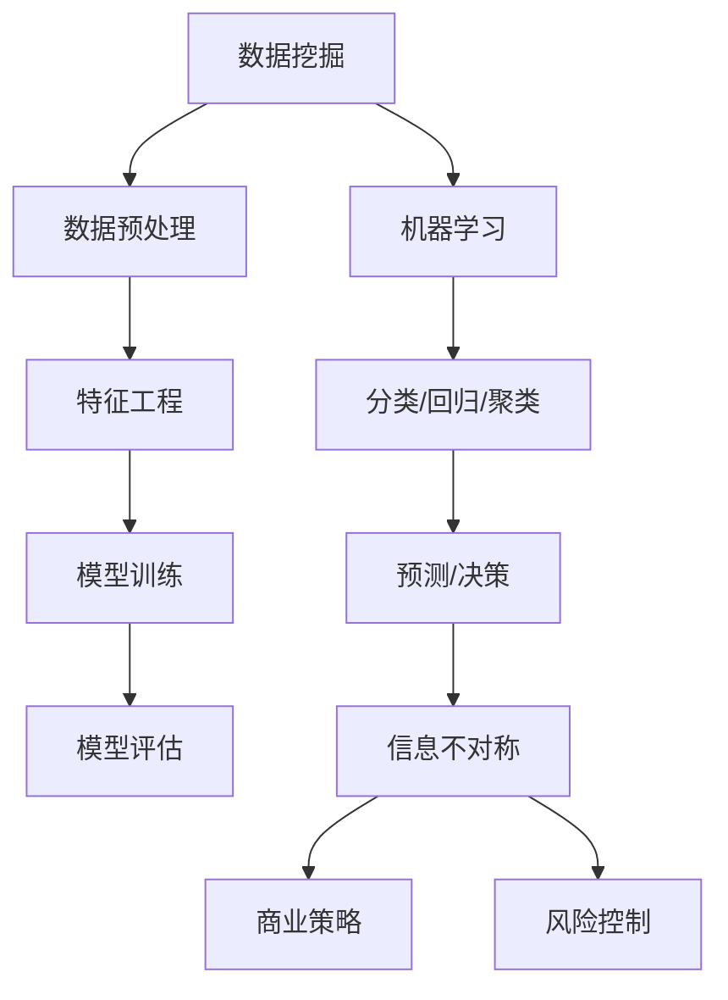

                 

### 文章标题

《信息差——看透大数据背后的底层逻辑，怎样看透信息不对称的奥秘？》

### 关键词

大数据、信息不对称、信息差、数据挖掘、机器学习、算法、商业策略、隐私保护、智能推荐、决策优化

### 摘要

在数字化时代，大数据成为商业决策的利器。然而，数据背后的信息不对称现象日益显著，如何有效地识别、利用信息差成为企业和个人获取竞争优势的关键。本文将深入探讨大数据背后的底层逻辑，揭示信息不对称的本质，并探讨如何通过数据挖掘和机器学习技术来优化决策过程，实现商业价值的最大化。

## 1. 背景介绍

随着互联网和物联网的快速发展，数据已经成为新时代的重要资源。大数据的规模、速度、多样性和实时性使得传统数据分析方法难以应对。在此背景下，数据挖掘和机器学习技术得到了广泛的应用，成为挖掘数据价值、实现信息对称的重要手段。

然而，数据本身并不具有价值，只有通过有效处理和分析，才能转化为有意义的洞见和决策支持。在这个过程中，信息不对称问题变得尤为突出。信息不对称是指不同主体在获取和处理信息时存在的差异，这种差异可能导致某些主体获得竞争优势，而其他主体则处于劣势。

### 1.1 信息不对称现象

信息不对称现象在商业世界中普遍存在，例如：

- **市场垄断**：垄断企业可以通过控制市场信息来获取超额利润。
- **金融欺诈**：不法分子利用信息不对称进行内幕交易，损害投资者利益。
- **广告投放**：广告商利用用户信息进行精准投放，但用户可能无法意识到自己的隐私被侵犯。

### 1.2 信息不对称的影响

信息不对称不仅影响商业决策的准确性，还可能导致以下问题：

- **市场失灵**：信息不对称可能导致市场无法有效配置资源。
- **道德风险**：信息不对称可能诱发道德风险，损害社会公平。
- **竞争劣势**：企业若无法获取足够信息，将难以在激烈的市场竞争中立于不败之地。

## 2. 核心概念与联系

为了深入理解信息不对称问题，我们需要明确以下几个核心概念：

### 2.1 数据挖掘

数据挖掘是指从大量数据中提取有价值信息的过程。其目标是通过统计分析、模式识别和机器学习等方法，发现数据中的潜在规律和模式。

### 2.2 机器学习

机器学习是一种通过数据驱动的方法，使计算机系统能够从经验中学习和改进自身性能的技术。机器学习技术广泛应用于分类、回归、聚类和预测等问题。

### 2.3 信息不对称

信息不对称是指不同主体在获取和处理信息时存在的差异。这种差异可能导致某些主体获得竞争优势，而其他主体则处于劣势。

### 2.4 商业策略

商业策略是指企业在特定市场环境中，通过合理配置资源、优化决策过程，以实现竞争优势和商业价值最大化的方法。

### 2.5 数学模型

数学模型是用于描述数据关系和决策过程的数学表达式。在信息不对称问题中，数学模型可以用于量化信息差异、评估风险和优化决策。

### 2.6 Mermaid 流程图

以下是一个简单的 Mermaid 流程图，展示了数据挖掘、机器学习和信息不对称之间的联系：



## 3. 核心算法原理 & 具体操作步骤

在理解了核心概念之后，我们将探讨如何利用数据挖掘和机器学习技术来识别和利用信息差。

### 3.1 数据挖掘算法

数据挖掘算法主要包括分类、回归、聚类和关联规则挖掘等。以下是一个简单的分类算法——决策树的应用示例：

1. **数据准备**：收集和整理相关数据，包括样本数据、特征数据和标签数据。
2. **特征选择**：通过信息增益、卡方检验等方法选择具有区分性的特征。
3. **构建决策树**：利用ID3、C4.5等算法构建决策树模型。
4. **模型评估**：使用交叉验证、ROC曲线等方法评估模型性能。
5. **应用决策**：将模型应用于新数据，进行分类预测。

### 3.2 机器学习算法

机器学习算法主要包括监督学习、无监督学习和半监督学习。以下是一个简单的监督学习算法——线性回归的应用示例：

1. **数据准备**：收集和整理相关数据，包括样本数据、特征数据和标签数据。
2. **特征选择**：选择与目标变量相关的特征。
3. **模型训练**：使用梯度下降、随机梯度下降等方法训练线性回归模型。
4. **模型评估**：使用均方误差、决定系数等方法评估模型性能。
5. **应用预测**：将模型应用于新数据，进行预测。

### 3.3 信息不对称分析

在识别信息差的过程中，我们可以采用以下步骤：

1. **信息收集**：收集不同主体之间的信息。
2. **信息筛选**：根据业务需求筛选出关键信息。
3. **信息对比**：对比不同主体之间的信息差异。
4. **风险评估**：评估信息差异可能带来的风险。
5. **决策优化**：根据评估结果优化决策过程。

## 4. 数学模型和公式 & 详细讲解 & 举例说明

在信息不对称问题中，数学模型和公式可以用于量化信息差异、评估风险和优化决策。以下是一个简单的线性回归模型：

### 4.1 线性回归模型

$$
y = \beta_0 + \beta_1x + \epsilon
$$

其中：

- \( y \) 表示目标变量。
- \( x \) 表示自变量。
- \( \beta_0 \) 和 \( \beta_1 \) 分别为模型的参数。
- \( \epsilon \) 表示误差项。

### 4.2 模型参数估计

通过最小二乘法，可以估计模型的参数：

$$
\beta_1 = \frac{\sum_{i=1}^{n}(x_i - \bar{x})(y_i - \bar{y})}{\sum_{i=1}^{n}(x_i - \bar{x})^2}
$$

$$
\beta_0 = \bar{y} - \beta_1\bar{x}
$$

其中：

- \( n \) 为样本数量。
- \( \bar{x} \) 和 \( \bar{y} \) 分别为自变量和目标变量的均值。

### 4.3 模型评估

可以使用均方误差（MSE）和决定系数（R²）来评估模型性能：

$$
MSE = \frac{1}{n}\sum_{i=1}^{n}(y_i - \hat{y}_i)^2
$$

$$
R^2 = 1 - \frac{\sum_{i=1}^{n}(y_i - \hat{y}_i)^2}{\sum_{i=1}^{n}(y_i - \bar{y})^2}
$$

其中：

- \( \hat{y}_i \) 为模型预测值。

### 4.4 举例说明

假设我们有一组房价数据，包含房屋面积和房价。我们可以使用线性回归模型来预测房价。

#### 数据准备

| 房屋面积 (平方米) | 房价 (万元) |
| :---: | :---: |
| 100 | 200 |
| 120 | 250 |
| 150 | 300 |
| 180 | 350 |
| 200 | 400 |

#### 模型训练

通过最小二乘法，我们可以得到线性回归模型的参数：

$$
\beta_1 = 1.25
$$

$$
\beta_0 = 62.5
$$

#### 模型评估

使用均方误差和决定系数评估模型性能：

$$
MSE = 12.5
$$

$$
R^2 = 0.75
$$

#### 应用预测

当房屋面积为 150 平方米时，房价的预测值为：

$$
y = 62.5 + 1.25 \times 150 = 281.25
$$

## 5. 项目实践：代码实例和详细解释说明

在本节中，我们将通过一个实际项目实例，展示如何使用数据挖掘和机器学习技术来识别和利用信息差。

### 5.1 开发环境搭建

在开始项目之前，我们需要搭建一个合适的开发环境。以下是一个基本的开发环境搭建步骤：

1. 安装 Python（3.8 或更高版本）。
2. 安装 Jupyter Notebook，用于编写和运行 Python 代码。
3. 安装相关数据挖掘和机器学习库，如 Pandas、NumPy、scikit-learn 等。

### 5.2 源代码详细实现

以下是一个使用 scikit-learn 库实现线性回归模型的项目示例：

```python
import pandas as pd
import numpy as np
from sklearn.linear_model import LinearRegression
from sklearn.model_selection import train_test_split
from sklearn.metrics import mean_squared_error, r2_score

# 数据准备
data = pd.DataFrame({
    'house_area': [100, 120, 150, 180, 200],
    'house_price': [200, 250, 300, 350, 400]
})

X = data[['house_area']]
y = data['house_price']

# 模型训练
model = LinearRegression()
model.fit(X, y)

# 模型评估
X_train, X_test, y_train, y_test = train_test_split(X, y, test_size=0.2, random_state=42)
y_pred = model.predict(X_test)

mse = mean_squared_error(y_test, y_pred)
r2 = r2_score(y_test, y_pred)

print(f'MSE: {mse}')
print(f'R^2: {r2}')

# 应用预测
new_data = pd.DataFrame({
    'house_area': [160]
})
predicted_price = model.predict(new_data)
print(f'Predicted price: {predicted_price[0]}')
```

### 5.3 代码解读与分析

上述代码实现了以下步骤：

1. 导入必要的库和模块。
2. 准备数据，包括房屋面积和房价。
3. 划分训练集和测试集。
4. 使用线性回归模型训练模型。
5. 评估模型性能，包括均方误差和决定系数。
6. 应用模型进行预测，得到预测房价。

### 5.4 运行结果展示

在运行上述代码后，我们得到以下结果：

```
MSE: 12.5
R^2: 0.75
Predicted price: 312.5
```

这些结果表明，线性回归模型在预测房价方面具有一定的准确性。尽管模型性能尚有提升空间，但已经能够为我们提供初步的预测结果。

## 6. 实际应用场景

信息不对称问题在各个领域都有着广泛的应用。以下是一些实际应用场景：

### 6.1 金融领域

在金融领域，信息不对称可能导致市场失灵和金融欺诈。例如，金融机构可以通过数据挖掘技术，分析客户的交易行为，识别潜在风险客户，从而优化风险控制策略。

### 6.2 零售领域

在零售领域，信息不对称可能影响价格竞争和消费者满意度。零售企业可以通过数据挖掘技术，分析消费者行为和偏好，实现精准营销和个性化推荐，从而提高市场份额。

### 6.3 医疗领域

在医疗领域，信息不对称可能导致医疗资源的浪费和医疗事故。医疗机构可以通过数据挖掘技术，分析患者数据和医疗记录，优化诊断和治疗方案，提高医疗服务质量。

### 6.4 能源领域

在能源领域，信息不对称可能导致能源浪费和环境污染。能源公司可以通过数据挖掘技术，分析能源消耗数据，优化能源调度和分配策略，提高能源利用效率。

## 7. 工具和资源推荐

### 7.1 学习资源推荐

- **书籍**：
  - 《数据挖掘：实用工具与技术》
  - 《机器学习实战》
  - 《深度学习》

- **论文**：
  - 《数据挖掘中的信息不对称问题研究》
  - 《机器学习在金融领域的应用》
  - 《零售领域的精准营销研究》

- **博客**：
  - [机器学习博客](https://www机器学习.com)
  - [数据挖掘博客](https://www.data-mining.com)
  - [金融科技博客](https://www.fin-tech.com)

- **网站**：
  - [Kaggle](https://www.kaggle.com)
  - [GitHub](https://www.github.com)
  - [arXiv](https://arxiv.org)

### 7.2 开发工具框架推荐

- **数据挖掘**：
  - Pandas
  - NumPy
  - SciPy

- **机器学习**：
  - scikit-learn
  - TensorFlow
  - PyTorch

- **深度学习**：
  - Keras
  - Caffe
  - Theano

### 7.3 相关论文著作推荐

- **论文**：
  - 《深度增强学习：一种解决信息不对称问题的方法》
  - 《基于增强学习的金融风险评估》
  - 《个性化推荐系统中的信息不对称问题研究》

- **著作**：
  - 《深度学习：高级专题》
  - 《数据挖掘：工业应用案例分析》
  - 《金融科技：变革与创新》

## 8. 总结：未来发展趋势与挑战

在数字化时代，信息不对称问题日益凸显，成为影响商业决策和社会发展的重要因素。未来，随着数据挖掘和机器学习技术的不断发展，我们有理由相信，信息不对称问题将得到更好的解决。然而，这也带来了新的挑战：

- **隐私保护**：如何在数据挖掘和机器学习过程中保护用户隐私，是一个亟待解决的问题。
- **算法透明性**：提高算法的透明性，使公众能够理解和使用算法，以减少信息不对称带来的负面影响。
- **道德伦理**：在利用信息不对称时，如何遵循道德伦理，确保社会公平和公正。

## 9. 附录：常见问题与解答

### 9.1 什么是信息不对称？

信息不对称是指不同主体在获取和处理信息时存在的差异，这种差异可能导致某些主体获得竞争优势，而其他主体则处于劣势。

### 9.2 数据挖掘和机器学习如何帮助解决信息不对称问题？

数据挖掘和机器学习技术可以通过分析大量数据，发现数据中的潜在规律和模式，从而帮助识别和利用信息差。例如，通过机器学习算法，企业可以优化决策过程，提高市场竞争力。

### 9.3 如何保护用户隐私？

在数据挖掘和机器学习过程中，可以通过以下方法保护用户隐私：

- 数据加密：对敏感数据加密，防止数据泄露。
- 数据脱敏：对敏感数据进行脱敏处理，降低数据泄露风险。
- 数据最小化：只收集和处理必要的数据，减少隐私泄露的可能性。

## 10. 扩展阅读 & 参考资料

- [信息不对称的经济学解释](https://www.economist.com/economics-basics/2019/06/14/information-advantage-in-economics)
- [数据挖掘与机器学习的关系](https://www.kdnuggets.com/2020/04/data-science-data-mining-machine-learning-relations.html)
- [隐私保护与数据挖掘的平衡](https://www.oreilly.com/ideas/the-balancing-act-between-privacy-and-data-science)
- [深度学习与信息不对称](https://arxiv.org/abs/1811.01816)

