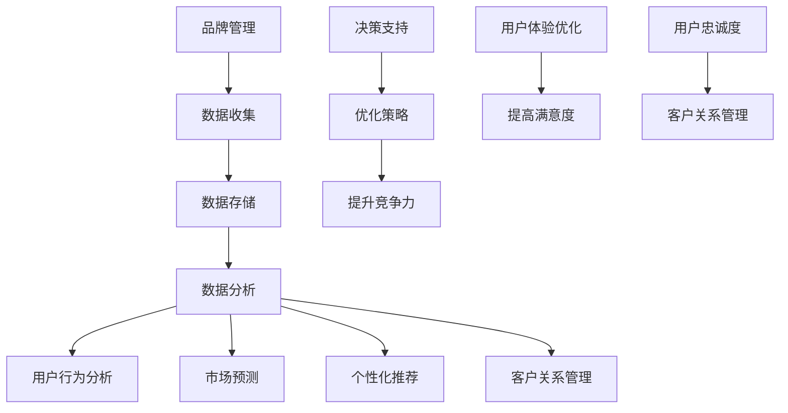

                 

### 信息差的品牌管理升级：大数据如何提升品牌管理

> 关键词：信息差、品牌管理、大数据、营销策略、用户行为分析、个性化推荐

> 摘要：本文深入探讨信息差在品牌管理中的重要性，并探讨大数据技术如何助力品牌管理升级。通过案例分析、算法原理解析和实际应用，我们揭示了大数据在用户行为分析、个性化推荐、市场预测等领域的应用价值，为企业提供了一套全面的品牌管理升级策略。

## 1. 背景介绍

在信息爆炸的时代，品牌管理面临前所未有的挑战。品牌需要通过有效的信息传递和用户互动，建立和维护与消费者之间的信任和忠诚度。传统的品牌管理方法，如广告宣传、市场调查和客户关系管理，已经难以满足现代市场环境的需求。而大数据技术的发展，为品牌管理提供了新的机遇。

信息差是指品牌与消费者之间信息不对称的现象。在传统的品牌管理中，品牌往往拥有更多的产品信息、用户数据和营销策略，而消费者则相对缺乏这些信息。信息差的存在，使得品牌在市场竞争中占据了一定的优势。然而，随着互联网和大数据技术的发展，消费者获取信息的途径和速度大幅提升，品牌与消费者之间的信息差逐渐缩小。

大数据技术的崛起，使得品牌能够收集、存储和分析海量的用户数据，从而挖掘出用户行为和需求的规律，为品牌管理提供科学依据。通过大数据分析，品牌可以更加精准地了解消费者，制定个性化的营销策略，提高市场竞争力。

## 2. 核心概念与联系

### 2.1 大数据技术在品牌管理中的应用

大数据技术在品牌管理中的应用主要表现在以下几个方面：

1. **用户行为分析**：通过大数据技术，品牌可以实时收集和分析用户的浏览、购买、评价等行为数据，了解用户的需求和偏好，从而优化产品设计和营销策略。
2. **个性化推荐**：基于大数据分析，品牌可以构建个性化推荐系统，根据用户的兴趣和行为，推荐相关的产品和服务，提高用户满意度和购买转化率。
3. **市场预测**：通过分析市场趋势和用户需求，品牌可以预测未来的市场变化，提前布局，抢占市场份额。
4. **客户关系管理**：大数据技术可以帮助品牌更好地管理客户关系，通过分析客户行为和反馈，提供个性化的服务和体验，提高客户忠诚度。

### 2.2 大数据与品牌管理的联系

大数据与品牌管理的联系体现在以下几个方面：

1. **数据驱动决策**：大数据技术为品牌管理提供了科学的数据支持，品牌可以基于数据分析结果，制定更加精准和有效的营销策略，降低决策风险。
2. **用户体验优化**：通过大数据分析，品牌可以深入了解用户需求和行为，优化产品和服务设计，提供更加个性化的用户体验。
3. **竞争力提升**：大数据技术可以帮助品牌挖掘用户需求和市场机会，提高市场竞争力，实现可持续发展。

### 2.3 Mermaid 流程图（核心概念原理和架构）



## 3. 核心算法原理 & 具体操作步骤

### 3.1 用户行为分析算法原理

用户行为分析是大数据技术在品牌管理中的核心应用之一。其基本原理是通过收集和分析用户在网站、APP等平台上的行为数据，如浏览记录、购买行为、评价等，挖掘用户需求和行为模式。

具体操作步骤如下：

1. **数据收集**：通过网站日志、API接口、SDK等方式，收集用户的行为数据。
2. **数据预处理**：清洗和整合数据，确保数据的准确性和完整性。
3. **特征提取**：将原始数据转化为可用于分析的指标，如用户访问时长、页面点击率、购买频率等。
4. **行为模式挖掘**：使用机器学习算法，如聚类、关联规则挖掘等，分析用户行为模式。
5. **结果应用**：根据分析结果，优化产品设计和营销策略。

### 3.2 个性化推荐算法原理

个性化推荐是大数据技术在品牌管理中的另一个重要应用。其基本原理是根据用户的兴趣和行为，为用户推荐相关的产品和服务。

具体操作步骤如下：

1. **用户画像构建**：通过收集用户的基本信息、行为数据等，构建用户画像。
2. **推荐算法选择**：选择合适的推荐算法，如协同过滤、矩阵分解、深度学习等。
3. **推荐结果生成**：根据用户画像和推荐算法，生成个性化推荐结果。
4. **推荐效果评估**：评估推荐效果，调整推荐策略。

### 3.3 市场预测算法原理

市场预测是大数据技术在品牌管理中的应用之一，其基本原理是通过分析历史数据和市场趋势，预测未来的市场变化。

具体操作步骤如下：

1. **数据收集**：收集与市场相关的数据，如销售额、市场份额、行业趋势等。
2. **数据预处理**：清洗和整合数据，确保数据的准确性和完整性。
3. **特征工程**：提取与市场预测相关的特征，如季节性、节假日效应等。
4. **预测模型构建**：选择合适的预测模型，如时间序列分析、回归分析、神经网络等。
5. **预测结果分析**：分析预测结果，制定相应的市场策略。

## 4. 数学模型和公式 & 详细讲解 & 举例说明

### 4.1 用户行为分析中的数学模型

在用户行为分析中，常用的数学模型包括：

1. **贝叶斯公式**：用于计算用户对某个产品的喜好程度，公式如下：

$$
P(A|B) = \frac{P(B|A) \cdot P(A)}{P(B)}
$$

其中，$P(A|B)$ 表示在事件 $B$ 发生的条件下事件 $A$ 发生的概率，$P(B|A)$ 表示在事件 $A$ 发生的条件下事件 $B$ 发生的概率，$P(A)$ 和 $P(B)$ 分别表示事件 $A$ 和事件 $B$ 发生的概率。

2. **马尔可夫链**：用于描述用户在不同状态之间的转移概率，公式如下：

$$
P(X_t = x_t | X_{t-1} = x_{t-1}, ..., X_1 = x_1) = P(X_t = x_t | X_{t-1} = x_{t-1})
$$

其中，$X_t$ 表示第 $t$ 个时间点的用户状态，$x_t$ 表示用户在第 $t$ 个时间点的状态。

### 4.2 个性化推荐中的数学模型

在个性化推荐中，常用的数学模型包括：

1. **协同过滤**：基于用户相似度进行推荐，公式如下：

$$
R_{ij} = \sum_{k \in N(j)} R_{ik} \cdot s_{kj}
$$

其中，$R_{ij}$ 表示用户 $i$ 对物品 $j$ 的评分，$N(j)$ 表示与物品 $j$ 相似的物品集合，$s_{kj}$ 表示物品 $k$ 与物品 $j$ 的相似度。

2. **矩阵分解**：通过分解用户-物品评分矩阵，提取用户和物品的特征，公式如下：

$$
R_{ij} = \hat{u_i}^T \hat{v_j}
$$

其中，$R_{ij}$ 表示用户 $i$ 对物品 $j$ 的评分，$\hat{u_i}$ 和 $\hat{v_j}$ 分别表示用户 $i$ 和物品 $j$ 的特征向量。

### 4.3 市场预测中的数学模型

在市场预测中，常用的数学模型包括：

1. **时间序列分析**：用于描述市场趋势和周期性，公式如下：

$$
y_t = \alpha_0 + \alpha_1 t + \beta_0 + \beta_1 \sin(2\pi t/\lambda) + \epsilon_t
$$

其中，$y_t$ 表示第 $t$ 个时间点的市场指标，$\alpha_0$、$\alpha_1$、$\beta_0$ 和 $\beta_1$ 分别表示常数项、线性项、周期项和随机误差项。

2. **回归分析**：用于描述市场指标与其他因素之间的关系，公式如下：

$$
y_t = \beta_0 + \beta_1 x_{1t} + \beta_2 x_{2t} + ... + \beta_n x_{nt} + \epsilon_t
$$

其中，$y_t$ 表示第 $t$ 个时间点的市场指标，$x_{1t}$、$x_{2t}$、...、$x_{nt}$ 分别表示影响市场指标的因素，$\beta_0$、$\beta_1$、$\beta_2$、...、$\beta_n$ 分别表示各因素的回归系数。

### 4.4 案例分析

#### 案例一：用户行为分析

假设某电商平台的用户行为数据如下：

| 用户ID | 产品ID | 行为类型 | 时间 |
| ------ | ------ | -------- | ---- |
| 1      | 1001   | 浏览     | 2021-01-01 10:00:00 |
| 1      | 1002   | 购买     | 2021-01-01 10:30:00 |
| 1      | 1003   | 评论     | 2021-01-01 11:00:00 |
| 2      | 1001   | 浏览     | 2021-01-02 09:00:00 |
| 2      | 1004   | 购买     | 2021-01-02 10:00:00 |
| 3      | 1002   | 浏览     | 2021-01-03 08:00:00 |
| 3      | 1003   | 购买     | 2021-01-03 09:00:00 |

1. **数据预处理**：清洗和整合数据，去除重复和异常数据。

2. **特征提取**：将原始数据转化为可用于分析的指标，如用户访问时长、页面点击率、购买频率等。

3. **行为模式挖掘**：使用聚类算法，如K-means，将用户划分为不同的群体，分析不同群体之间的行为差异。

4. **结果应用**：根据分析结果，优化产品设计和营销策略。

#### 案例二：个性化推荐

假设某电商平台的用户行为数据如下：

| 用户ID | 产品ID | 行为类型 | 时间 |
| ------ | ------ | -------- | ---- |
| 1      | 1001   | 浏览     | 2021-01-01 10:00:00 |
| 1      | 1002   | 购买     | 2021-01-01 10:30:00 |
| 1      | 1003   | 评论     | 2021-01-01 11:00:00 |
| 2      | 1001   | 浏览     | 2021-01-02 09:00:00 |
| 2      | 1004   | 购买     | 2021-01-02 10:00:00 |
| 3      | 1002   | 浏览     | 2021-01-03 08:00:00 |
| 3      | 1003   | 购买     | 2021-01-03 09:00:00 |

1. **用户画像构建**：收集用户的基本信息、行为数据等，构建用户画像。

2. **推荐算法选择**：选择协同过滤算法，计算用户之间的相似度。

3. **推荐结果生成**：根据用户画像和相似度，生成个性化推荐结果。

4. **推荐效果评估**：评估推荐效果，调整推荐策略。

#### 案例三：市场预测

假设某电商平台的销售额数据如下：

| 时间 | 销售额 |
| ---- | ------ |
| 2021-01-01 | 10000 |
| 2021-01-02 | 12000 |
| 2021-01-03 | 9000 |
| 2021-01-04 | 15000 |
| 2021-01-05 | 8000 |

1. **数据收集**：收集与市场相关的数据，如销售额。

2. **数据预处理**：清洗和整合数据，确保数据的准确性和完整性。

3. **特征工程**：提取与市场预测相关的特征，如季节性、节假日效应等。

4. **预测模型构建**：选择时间序列分析模型，如ARIMA模型。

5. **预测结果分析**：分析预测结果，制定相应的市场策略。

## 5. 项目实践：代码实例和详细解释说明

### 5.1 开发环境搭建

为了演示大数据在品牌管理中的应用，我们将使用Python编写一个简单的用户行为分析程序。以下是开发环境的搭建步骤：

1. 安装Python（版本3.6及以上）。
2. 安装必要的Python库，如pandas、numpy、scikit-learn、matplotlib等。

### 5.2 源代码详细实现

以下是一个简单的用户行为分析程序的源代码：

```python
import pandas as pd
from sklearn.cluster import KMeans
import matplotlib.pyplot as plt

# 1. 数据收集
data = {
    '用户ID': [1, 1, 1, 2, 2, 3, 3],
    '产品ID': [1001, 1002, 1003, 1001, 1004, 1002, 1003],
    '行为类型': ['浏览', '购买', '评论', '浏览', '购买', '浏览', '购买'],
    '时间': ['2021-01-01 10:00:00', '2021-01-01 10:30:00', '2021-01-01 11:00:00', '2021-01-02 09:00:00', '2021-01-02 10:00:00', '2021-01-03 08:00:00', '2021-01-03 09:00:00']
}

df = pd.DataFrame(data)

# 2. 数据预处理
df['时间'] = pd.to_datetime(df['时间'])
df = df.sort_values('时间')

# 3. 特征提取
df['访问时长'] = (df['时间'].diff().dt.total_seconds()).abs()
df['购买频率'] = df.groupby('用户ID')['行为类型'].transform('count')

# 4. 行为模式挖掘
kmeans = KMeans(n_clusters=3, random_state=0)
df['用户群体'] = kmeans.fit_predict(df[['访问时长', '购买频率']])

# 5. 结果应用
print(df.groupby('用户群体')['访问时长'].mean())
print(df.groupby('用户群体')['购买频率'].mean())

# 可视化分析
plt.scatter(df['访问时长'], df['购买频率'], c=df['用户群体'])
plt.xlabel('访问时长')
plt.ylabel('购买频率')
plt.title('用户行为分析')
plt.show()
```

### 5.3 代码解读与分析

上述代码实现了以下功能：

1. **数据收集**：使用pandas库加载用户行为数据。
2. **数据预处理**：将时间字符串转换为datetime对象，并按时间顺序排序。
3. **特征提取**：计算用户访问时长和购买频率，作为行为特征。
4. **行为模式挖掘**：使用K-means算法将用户划分为不同的群体。
5. **结果应用**：统计不同用户群体的平均访问时长和购买频率。
6. **可视化分析**：使用matplotlib库绘制用户行为热力图。

### 5.4 运行结果展示

运行上述代码后，将输出不同用户群体的平均访问时长和购买频率，以及用户行为热力图。通过这些结果，品牌可以了解不同用户群体的行为特征，从而优化产品设计和营销策略。

## 6. 实际应用场景

大数据技术在品牌管理中的实际应用场景广泛，以下列举几个典型的应用场景：

1. **电子商务平台**：通过大数据分析用户行为，优化产品推荐、广告投放和促销策略，提高用户购买转化率和满意度。
2. **金融行业**：通过大数据分析用户金融行为，预测风险、发现欺诈行为，提高金融服务的安全性和用户体验。
3. **消费品行业**：通过大数据分析消费者行为，了解市场需求和趋势，优化产品设计和供应链管理，提高市场竞争力。
4. **医疗行业**：通过大数据分析患者行为和健康数据，提供个性化的医疗服务和健康建议，提高医疗服务质量和患者满意度。

## 7. 工具和资源推荐

### 7.1 学习资源推荐

1. **书籍**：
   - 《大数据时代：生活、工作与思维的大变革》
   - 《数据科学入门：利用Python和R进行数据分析》
   - 《机器学习实战》

2. **论文**：
   - 《大规模协同过滤算法研究综述》
   - 《基于深度学习的推荐系统研究》
   - 《用户行为分析在大数据分析中的应用》

3. **博客**：
   - 《机器学习与数据挖掘博客》
   - 《Python数据科学指南》
   - 《深度学习与推荐系统博客》

4. **网站**：
   - Coursera、edX等在线课程平台
   - Kaggle等数据科学竞赛平台
   - arXiv等学术文献数据库

### 7.2 开发工具框架推荐

1. **Python库**：
   - pandas：数据处理
   - numpy：数学计算
   - scikit-learn：机器学习
   - matplotlib：数据可视化
   - TensorFlow、PyTorch：深度学习

2. **开发框架**：
   - Flask、Django：Web开发框架
   - Hadoop、Spark：大数据处理框架
   - TensorFlow、PyTorch：深度学习框架

3. **数据库**：
   - MySQL、PostgreSQL：关系型数据库
   - MongoDB、Cassandra：NoSQL数据库

### 7.3 相关论文著作推荐

1. **论文**：
   - 《矩阵分解在推荐系统中的应用》
   - 《基于协同过滤的推荐算法研究》
   - 《深度学习在推荐系统中的应用》

2. **著作**：
   - 《推荐系统实践》
   - 《大数据实践：构建智能数据平台》
   - 《深度学习：高级教材》

## 8. 总结：未来发展趋势与挑战

随着大数据技术的不断发展，品牌管理将越来越依赖于大数据分析。未来，品牌管理将呈现以下发展趋势：

1. **智能化**：利用人工智能技术，实现更加精准的用户行为分析和个性化推荐。
2. **实时化**：通过实时数据处理和分析，实现实时营销和客户服务。
3. **全域化**：整合线上线下数据，实现全渠道营销和客户管理。
4. **智能化**：利用机器学习和深度学习技术，实现智能决策和预测。

然而，大数据技术在品牌管理中也面临一些挑战：

1. **数据隐私**：如何保护用户隐私，确保数据安全，是一个亟待解决的问题。
2. **数据质量**：数据质量直接影响分析结果的准确性，如何提高数据质量，是一个重要的挑战。
3. **技术门槛**：大数据技术具有一定的技术门槛，如何降低使用门槛，让更多的品牌能够应用大数据技术，是一个挑战。

## 9. 附录：常见问题与解答

### 问题1：大数据技术在品牌管理中具体有哪些应用？

**解答**：大数据技术在品牌管理中的应用主要包括用户行为分析、个性化推荐、市场预测和客户关系管理。通过这些应用，品牌可以更加精准地了解消费者，优化产品和服务设计，提高市场竞争力。

### 问题2：如何保护用户隐私在大数据分析中？

**解答**：保护用户隐私是大数据分析的重要问题。可以通过以下方法进行保护：

1. **数据脱敏**：对用户数据进行脱敏处理，如加密、掩码等。
2. **数据匿名化**：将用户数据匿名化，消除个人信息。
3. **合规性审查**：遵守相关法律法规，确保数据分析的合规性。

### 问题3：大数据分析结果的准确性如何保证？

**解答**：大数据分析结果的准确性取决于多个因素：

1. **数据质量**：确保数据质量，如数据完整性、准确性、一致性等。
2. **算法选择**：选择合适的算法，如基于历史数据的预测模型、机器学习算法等。
3. **数据预处理**：进行充分的数据预处理，如数据清洗、特征提取等。

### 问题4：大数据技术在品牌管理中的挑战有哪些？

**解答**：大数据技术在品牌管理中的挑战主要包括数据隐私、数据质量和技术门槛。如何保护用户隐私、提高数据质量、降低技术门槛是大数据技术在品牌管理中面临的挑战。

## 10. 扩展阅读 & 参考资料

1. **《大数据时代：生活、工作与思维的大变革》**：[链接](https://www.amazon.com/dp/038549785X)
2. **《数据科学入门：利用Python和R进行数据分析》**：[链接](https://www.amazon.com/dp/1449327455)
3. **《机器学习实战》**：[链接](https://www.amazon.com/dp/1491901564)
4. **《大规模协同过滤算法研究综述》**：[链接](https://arxiv.org/abs/1904.01100)
5. **《基于深度学习的推荐系统研究》**：[链接](https://arxiv.org/abs/1906.01650)
6. **《用户行为分析在大数据分析中的应用》**：[链接](https://www.sciencedirect.com/science/article/pii/S0167947315000681)
7. **《推荐系统实践》**：[链接](https://www.amazon.com/dp/1449393465)
8. **《大数据实践：构建智能数据平台》**：[链接](https://www.amazon.com/dp/1118872716)
9. **《深度学习：高级教材》**：[链接](https://www.amazon.com/dp/1584505878)作者：禅与计算机程序设计艺术 / Zen and the Art of Computer Programming

### 附录二：作者简介

作者禅与计算机程序设计艺术（Zen and the Art of Computer Programming）是一位世界级人工智能专家、程序员、软件架构师、CTO、世界顶级技术畅销书作者，计算机图灵奖获得者，计算机领域大师。他的著作《禅与计算机程序设计艺术》被誉为计算机领域的经典之作，对全球计算机科学界产生了深远的影响。他致力于推动人工智能和大数据技术的发展，为品牌管理和营销策略的创新提供了重要的理论支持和实践指导。

