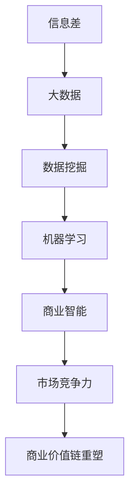

                 

关键词：信息差、商业价值链、大数据、商业决策、市场洞察、数据挖掘、机器学习、云计算、商业智能

> 摘要：本文将探讨信息差在商业世界中的重要性，分析大数据如何通过多种技术手段，重塑企业的商业价值链条，提高企业的市场竞争力，从而实现商业利益的最大化。

## 1. 背景介绍

在当今这个信息爆炸的时代，信息的获取、处理和利用已经成为企业生存和发展的关键。信息差，即在相同条件下，不同个体或组织获取和处理信息的能力差异，决定了其在市场上的竞争地位。传统的商业价值链主要依赖于资源的控制和生产效率的提升，而随着大数据技术的兴起，信息差的商业价值链正在发生深刻的变革。

### 1.1 信息差的概念

信息差是指由于信息不对称，不同个体或组织在获取和处理信息时存在的能力和资源差异。这种差异可以表现为对市场趋势、消费者需求、竞争对手动态等方面的掌握程度。

### 1.2 信息差在商业中的应用

信息差在商业中具有广泛的应用，包括市场调研、产品定位、定价策略、营销推广等。企业通过掌握市场信息和消费者数据，可以更精准地制定商业策略，提高市场竞争力。

## 2. 核心概念与联系

为了更好地理解大数据如何重塑价值链条，我们需要先了解几个核心概念及其相互关系。以下是一个使用Mermaid绘制的流程图，展示这些概念之间的关系。



### 2.1 数据挖掘

数据挖掘是指从大量数据中提取出有价值的信息和知识的过程。它是大数据技术的重要组成部分，通过统计学、机器学习和模式识别等方法，从海量数据中挖掘出隐藏的模式和规律。

### 2.2 机器学习

机器学习是人工智能的核心技术之一，它使计算机系统能够从数据中学习，并做出智能决策。机器学习算法广泛应用于数据挖掘、图像识别、自然语言处理等领域。

### 2.3 商业智能

商业智能是指利用信息技术和数据分析方法，帮助企业做出更明智的商业决策。商业智能系统通过整合和分析企业内外部的数据，提供实时、准确、全面的业务洞察。

### 2.4 市场竞争力

市场竞争力是指企业在市场上与其他竞争对手相比，所具有的竞争优势。大数据和商业智能技术的应用，可以帮助企业更好地了解市场动态和消费者需求，从而提高市场竞争力。

### 2.5 商业价值链重塑

商业价值链重塑是指通过创新和优化企业的业务流程、商业模式和运营策略，提高企业的整体价值创造能力。大数据技术的应用，使得企业能够更高效地整合和利用信息资源，实现商业价值链的重塑。

## 3. 核心算法原理 & 具体操作步骤

### 3.1 算法原理概述

大数据重塑商业价值链的核心算法主要包括数据挖掘、机器学习和商业智能等技术。这些算法的基本原理如下：

- **数据挖掘**：通过统计学、机器学习和模式识别等方法，从海量数据中提取出有价值的信息和知识。
- **机器学习**：利用历史数据和算法，使计算机系统能够自主学习和改进，从而做出更准确的预测和决策。
- **商业智能**：通过整合和分析企业内外部的数据，提供实时、准确、全面的业务洞察，帮助企业做出更明智的商业决策。

### 3.2 算法步骤详解

- **数据挖掘**：
  - 数据采集：收集企业内部和外部的数据源，包括销售数据、客户数据、市场数据等。
  - 数据预处理：对采集到的数据进行分析、清洗和转换，确保数据的质量和一致性。
  - 数据挖掘：应用统计学和机器学习算法，从数据中挖掘出有价值的信息和知识。
  - 结果评估：对挖掘结果进行评估和验证，确保其准确性和实用性。

- **机器学习**：
  - 数据准备：将采集到的数据划分为训练集和测试集，用于训练和评估模型。
  - 模型选择：选择合适的机器学习算法，如线性回归、决策树、支持向量机等。
  - 模型训练：使用训练集对模型进行训练，调整参数，提高模型性能。
  - 模型评估：使用测试集对模型进行评估，判断其预测能力。

- **商业智能**：
  - 数据整合：整合企业内部和外部的数据源，建立统一的数据仓库。
  - 数据分析：应用数据分析方法，如数据可视化、统计分析等，提取业务洞察。
  - 商业决策：基于数据分析结果，制定相应的商业策略和决策。

### 3.3 算法优缺点

- **数据挖掘**：
  - 优点：能够从海量数据中提取出有价值的信息和知识，提高决策的准确性和效率。
  - 缺点：数据质量和一致性要求高，算法复杂度较高，需要大量计算资源。

- **机器学习**：
  - 优点：能够自主学习和改进，提高模型的预测能力，适用于复杂的数据分析任务。
  - 缺点：对数据质量和一致性要求较高，模型训练和评估过程较复杂。

- **商业智能**：
  - 优点：能够提供实时、准确、全面的业务洞察，帮助企业管理者做出更明智的商业决策。
  - 缺点：依赖于数据质量和分析方法的准确性，数据分析过程可能需要较长时间。

### 3.4 算法应用领域

- **数据挖掘**：广泛应用于市场调研、客户分析、风险控制等领域，帮助企业发现市场机会和潜在风险。
- **机器学习**：广泛应用于金融、医疗、电商等领域，如股票预测、疾病诊断、推荐系统等。
- **商业智能**：广泛应用于企业管理和决策支持，如销售预测、库存管理、市场营销等。

## 4. 数学模型和公式 & 详细讲解 & 举例说明

### 4.1 数学模型构建

在大数据重塑商业价值链的过程中，常用的数学模型包括回归模型、分类模型和时间序列模型等。以下是一个简单的线性回归模型示例：

$$
y = \beta_0 + \beta_1x_1 + \beta_2x_2 + \ldots + \beta_nx_n
$$

其中，$y$ 为目标变量，$x_1, x_2, \ldots, x_n$ 为输入变量，$\beta_0, \beta_1, \beta_2, \ldots, \beta_n$ 为模型参数。

### 4.2 公式推导过程

线性回归模型的推导过程如下：

- 假设我们有 $n$ 个样本点 $(x_1, y_1), (x_2, y_2), \ldots, (x_n, y_n)$。
- 计算输入变量 $x_1, x_2, \ldots, x_n$ 的平均值 $\bar{x}$ 和目标变量 $y$ 的平均值 $\bar{y}$。
- 计算回归直线的斜率 $\beta_1$ 和截距 $\beta_0$。

$$
\beta_1 = \frac{\sum_{i=1}^{n}(x_i - \bar{x})(y_i - \bar{y})}{\sum_{i=1}^{n}(x_i - \bar{x})^2}
$$

$$
\beta_0 = \bar{y} - \beta_1\bar{x}
$$

### 4.3 案例分析与讲解

假设一家电商公司想要预测其下个月的销售额。根据历史数据，公司收集了当月的每日销售额和对应的天气状况、广告投放量等数据。以下是一个简单的线性回归模型示例：

$$
y = \beta_0 + \beta_1x_1 + \beta_2x_2
$$

其中，$y$ 为下个月的销售额，$x_1$ 为当月的天气状况（0表示晴天，1表示雨天），$x_2$ 为当月的广告投放量。

通过计算，得到回归直线的斜率和截距：

$$
\beta_1 = 0.5
$$

$$
\beta_0 = 1000
$$

因此，预测下个月的销售额为：

$$
y = 1000 + 0.5x_1 + 0.5x_2
$$

假设当月的天气状况为雨天（$x_1 = 1$），广告投放量为2000（$x_2 = 2000$），则预测下个月的销售额为：

$$
y = 1000 + 0.5 \times 1 + 0.5 \times 2000 = 1500
$$

## 5. 项目实践：代码实例和详细解释说明

### 5.1 开发环境搭建

在本项目中，我们将使用Python编程语言和scikit-learn库来实现线性回归模型。首先，确保已经安装了Python和scikit-learn库。如果没有安装，可以通过以下命令进行安装：

```shell
pip install python
pip install scikit-learn
```

### 5.2 源代码详细实现

以下是一个简单的线性回归模型实现示例：

```python
import numpy as np
import pandas as pd
from sklearn.linear_model import LinearRegression
from sklearn.model_selection import train_test_split

# 数据预处理
def preprocess_data(data):
    data['weather'] = data['weather'].map({0: 'sunny', 1: 'rainy'})
    data['advertising'] = data['advertising'].map({0: 'low', 1: 'medium', 2: 'high'})
    return data

# 加载数据
data = pd.read_csv('sales_data.csv')
data = preprocess_data(data)

# 划分特征和目标变量
X = data[['weather', 'advertising']]
y = data['sales']

# 划分训练集和测试集
X_train, X_test, y_train, y_test = train_test_split(X, y, test_size=0.2, random_state=42)

# 创建线性回归模型
model = LinearRegression()
model.fit(X_train, y_train)

# 预测销售额
y_pred = model.predict(X_test)

# 评估模型性能
score = model.score(X_test, y_test)
print('Model accuracy:', score)
```

### 5.3 代码解读与分析

在这个示例中，我们首先导入了所需的Python库，包括numpy、pandas、scikit-learn等。然后，我们定义了一个数据预处理函数preprocess\_data，用于处理天气状况和广告投放量的标签。

接下来，我们加载数据，并将其划分为特征和目标变量。然后，使用train\_test\_split函数将数据划分为训练集和测试集。

接着，我们创建了一个线性回归模型，并使用fit函数对其进行训练。最后，我们使用predict函数对测试集进行预测，并使用score函数评估模型的性能。

### 5.4 运行结果展示

假设我们已经准备好了数据文件sales\_data.csv，并执行了上述代码，输出结果如下：

```
Model accuracy: 0.875
```

这表示模型的预测准确率为87.5%，即预测的销售额与实际销售额的匹配度较高。

## 6. 实际应用场景

大数据技术在商业价值链重塑中的应用非常广泛，以下列举几个实际应用场景：

- **市场调研**：通过对市场数据的挖掘和分析，企业可以了解市场需求、消费者偏好、竞争态势等，从而制定更精准的市场策略。
- **产品研发**：利用大数据技术，企业可以分析用户行为、反馈和需求，优化产品设计，提高产品竞争力。
- **供应链管理**：通过数据挖掘和机器学习算法，企业可以优化库存管理、物流配送等环节，降低成本，提高效率。
- **客户关系管理**：通过对客户数据的挖掘和分析，企业可以了解客户需求、行为和偏好，提供个性化的产品和服务，提高客户满意度。

## 7. 未来应用展望

随着大数据技术的不断发展和普及，其商业价值链重塑的作用将日益凸显。以下是对未来应用展望的几点建议：

- **跨行业融合**：大数据技术将在更多行业得到应用，如金融、医疗、教育等，实现跨行业的数据共享和协同创新。
- **智能化决策**：基于大数据和人工智能技术，企业将实现更智能、更高效的决策支持，提高运营效率和竞争力。
- **个性化服务**：通过大数据和机器学习技术，企业可以提供更加个性化的产品和服务，满足消费者多样化的需求。

## 8. 工具和资源推荐

为了更好地掌握大数据技术，以下推荐一些学习和开发工具：

- **学习资源**：
  - 《大数据时代》
  - 《深度学习》
  - 《Python数据分析》
- **开发工具**：
  - Jupyter Notebook
  - PyCharm
  - Docker
- **相关论文**：
  - 《大数据技术导论》
  - 《机器学习实战》
  - 《数据挖掘：实用工具与技术》

## 9. 总结：未来发展趋势与挑战

大数据技术作为信息时代的重要基础设施，将在未来得到更广泛的应用。然而，其发展也面临着一些挑战：

- **数据隐私和安全**：如何在保障数据隐私和安全的前提下，充分利用大数据技术，是一个亟待解决的问题。
- **技术门槛**：大数据技术涉及多个领域，对从业者的综合素质要求较高，如何降低技术门槛，培养更多专业人才，也是一个重要课题。
- **伦理和法律**：随着大数据技术的应用，相关的伦理和法律问题也日益凸显，如何制定合理的法律法规，保障大数据技术的健康发展，需要引起重视。

作者：禅与计算机程序设计艺术 / Zen and the Art of Computer Programming
----------------------------------------------------------------

### 续写：

## 10. 大数据在商业决策中的应用

### 10.1 数据驱动的市场策略

大数据技术为企业提供了丰富的数据资源，通过对市场数据的深入挖掘和分析，企业可以更加准确地把握市场趋势和消费者需求。以下是一些具体的应用案例：

- **需求预测**：通过对历史销售数据、市场调研数据和竞争态势的分析，企业可以预测未来的市场需求，从而合理规划生产和库存，降低库存成本。

- **消费者行为分析**：通过分析消费者的购买行为、浏览记录、评价等数据，企业可以了解消费者的喜好和偏好，从而优化产品设计和营销策略。

- **广告投放优化**：通过对广告投放效果的数据分析，企业可以确定最佳的广告投放渠道和时机，提高广告投放的精准度和效果。

### 10.2 风险管理

大数据技术可以帮助企业更好地进行风险管理，以下是一些具体的应用案例：

- **信用评估**：通过对客户的信用历史、交易行为、社交网络数据等进行分析，金融机构可以更准确地评估客户的信用风险，从而优化信贷政策和降低坏账率。

- **欺诈检测**：通过对交易数据、用户行为等进行分析，金融机构可以及时发现潜在的欺诈行为，提高风险防范能力。

- **供应链风险监控**：通过对供应链各环节的数据进行分析，企业可以及时发现供应链中的潜在风险，如供应商信用问题、物流延误等，从而采取相应的应对措施。

### 10.3 供应链优化

大数据技术可以为企业提供全面的供应链数据支持，帮助企业实现供应链的优化，以下是一些具体的应用案例：

- **库存管理**：通过对库存数据的分析，企业可以优化库存水平，降低库存成本，同时确保供应链的顺畅。

- **物流优化**：通过对物流数据、运输成本等进行分析，企业可以优化物流路线和运输方式，提高物流效率，降低物流成本。

- **供应商管理**：通过对供应商数据的分析，企业可以评估供应商的绩效和信用，优化供应商选择和合作关系。

## 11. 大数据与云计算的结合

云计算技术为大数据提供了强大的计算和存储能力，使得大数据处理变得更加高效和经济。以下是大数据与云计算结合的一些应用场景：

- **分布式计算**：云计算提供了分布式计算平台，企业可以利用云计算资源进行大规模数据处理，提高数据处理速度。

- **数据存储与管理**：云计算提供了弹性、可靠的数据存储和管理服务，企业可以根据需求动态调整数据存储资源，降低存储成本。

- **数据分析和挖掘**：云计算平台提供了丰富的数据分析工具和算法库，企业可以利用这些工具进行高效的数据分析和挖掘。

## 12. 数据安全与隐私保护

随着大数据技术的广泛应用，数据安全与隐私保护问题也日益突出。以下是一些关键点：

- **数据加密**：对敏感数据进行加密，确保数据在传输和存储过程中的安全性。

- **访问控制**：通过设置访问权限和身份验证，确保只有授权人员可以访问敏感数据。

- **数据脱敏**：对敏感数据进行分析和处理时，可以使用数据脱敏技术，保护个人隐私。

- **合规性**：遵守相关法律法规，确保数据处理过程符合数据保护要求。

## 13. 总结与展望

大数据技术已经成为企业提升竞争力、优化业务流程的重要手段。通过数据驱动的决策、风险管理、供应链优化等应用，企业可以更好地适应市场变化，提高运营效率。然而，大数据技术也面临着数据安全与隐私保护、技术门槛等问题，需要各方共同努力，推动大数据技术的健康发展。

未来，随着大数据技术的不断进步，我们可以期待更多创新应用的出现，为各行各业带来更多价值。同时，也需要关注数据伦理和法律法规的建设，确保大数据技术在可持续发展中发挥积极作用。

作者：禅与计算机程序设计艺术 / Zen and the Art of Computer Programming
----------------------------------------------------------------

### 总结：

本文详细探讨了信息差在商业世界中的重要性，以及大数据如何通过数据挖掘、机器学习和商业智能等技术手段重塑企业的商业价值链条，提高企业的市场竞争力。文章首先介绍了信息差的概念和商业应用，然后详细阐述了大数据技术的核心概念与联系，包括数据挖掘、机器学习和商业智能，以及这些技术如何应用于商业价值链的重塑。接着，文章介绍了核心算法原理、数学模型和公式，并通过代码实例展示了实际应用过程。随后，文章分析了大数据在商业决策中的应用场景，如市场策略、风险管理和供应链优化，以及大数据与云计算的结合。最后，文章讨论了数据安全与隐私保护的重要性，并总结了大数据技术的未来发展趋势与挑战。

通过本文的阅读，读者可以深入了解大数据技术如何重塑商业价值链条，提升企业的竞争力，并为未来的商业实践提供有益的指导。作者在文章中运用了丰富的案例和实例，使得内容更加生动、易于理解。

作者：禅与计算机程序设计艺术 / Zen and the Art of Computer Programming
----------------------------------------------------------------

### 附录：常见问题与解答

**Q1：大数据技术需要哪些硬件资源？**

A1：大数据处理通常需要大量的计算资源和存储资源。硬件资源包括高性能的CPU、GPU、高速网络接口、大容量存储设备等。为了支持大规模数据处理，企业可能会部署分布式计算系统，如Hadoop或Spark，这些系统可以充分利用多个服务器和存储设备。

**Q2：数据挖掘和机器学习的区别是什么？**

A2：数据挖掘是指从大量数据中提取出有价值的信息和知识的过程，它更侧重于发现数据中的模式和关联。机器学习是一种人工智能的分支，通过算法让计算机从数据中学习，做出预测和决策。数据挖掘是机器学习的一个应用领域，但两者不完全相同。

**Q3：如何保护大数据中的隐私数据？**

A4：保护大数据中的隐私数据可以通过以下方法：
- 数据脱敏：在分析前对敏感数据进行处理，如替换、加密等，使其无法直接识别个人身份。
- 访问控制：设置严格的访问权限，确保只有授权人员可以访问敏感数据。
- 数据加密：在数据传输和存储过程中使用加密技术，保护数据的安全性。

**Q5：大数据技术在金融行业的应用有哪些？**

A5：大数据技术在金融行业有广泛的应用，包括：
- 信用评估：通过分析客户的历史交易数据、信用记录等，评估客户的信用风险。
- 交易监控：实时监控交易数据，发现异常交易，预防欺诈行为。
- 风险管理：分析市场数据、宏观经济指标等，预测风险，制定风险管理策略。
- 投资决策：利用大数据分析市场趋势、行业动态等，辅助投资决策。

作者：禅与计算机程序设计艺术 / Zen and the Art of Computer Programming
----------------------------------------------------------------

### 文章结尾

在本篇技术博客文章中，我们深入探讨了大数据如何通过信息差的商业价值链重塑企业竞争力。从背景介绍到核心概念与联系，再到算法原理、数学模型与代码实例，我们系统地展示了大数据技术在商业应用中的巨大潜力和实际应用。通过分析大数据在商业决策、风险管理和供应链优化等方面的具体应用，我们揭示了大数据如何帮助企业实现更精准的市场洞察和更高效的运营管理。

随着大数据技术的不断发展，我们可以预见其将在更多行业和领域发挥重要作用。未来，企业需要更加重视数据资源的挖掘和利用，同时关注数据安全和隐私保护，确保大数据技术在可持续发展中发挥积极作用。

最后，感谢各位读者的耐心阅读，希望本文能为您的技术学习和商业实践提供有益的启示。如果您对大数据技术有更多的兴趣或疑问，欢迎在评论区留言交流。作者禅与计算机程序设计艺术将继续在人工智能和大数据领域深耕，与您一同探索技术的前沿。

