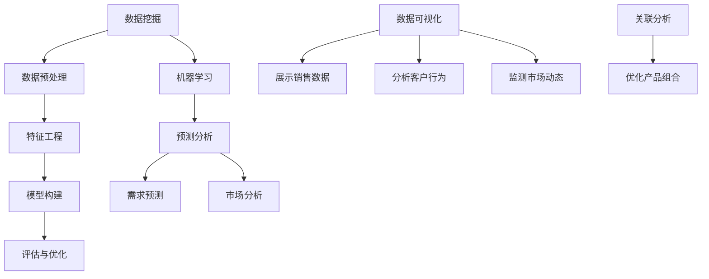

                 

### 背景介绍

随着大数据技术的不断发展和广泛应用，各行各业都在积极寻求利用大数据来提升业务水平和竞争力。销售管理作为企业业务的核心环节之一，自然也受到了大数据的深刻影响。传统的销售管理方式主要依赖于销售人员的主观判断和经验，而大数据技术的引入则为销售管理提供了全新的思路和工具。通过分析大量的销售数据，企业可以更加精准地预测市场趋势、优化销售策略、提高销售效率，从而实现销售管理的全面提升。

本文旨在探讨大数据技术在销售管理中的应用，分析大数据如何通过数据挖掘、预测分析等技术手段，提升销售管理的各个方面。我们将从以下几个方面进行详细探讨：

1. **大数据在销售管理中的应用场景**：介绍大数据技术在销售管理中的具体应用场景，如客户关系管理、销售预测、市场分析等。

2. **核心概念与联系**：讲解大数据技术中的核心概念，如数据挖掘、机器学习、预测分析等，并绘制流程图展示各概念之间的联系。

3. **核心算法原理与具体操作步骤**：介绍大数据技术在销售管理中的核心算法原理，包括数据预处理、特征工程、模型训练等，并详细说明具体操作步骤。

4. **数学模型与公式**：讲解销售管理中常用的数学模型与公式，并举例说明其应用。

5. **项目实践**：通过一个实际项目实例，展示大数据技术在销售管理中的具体应用，包括开发环境搭建、源代码实现、代码解读与分析、运行结果展示等。

6. **实际应用场景**：分析大数据在销售管理中的实际应用场景，讨论其对销售管理带来的变革和挑战。

7. **工具和资源推荐**：推荐相关的学习资源、开发工具和框架，以及相关论文著作。

8. **总结**：总结大数据技术在销售管理中的应用，探讨未来发展趋势与挑战。

通过以上内容，我们将全面深入地探讨大数据技术在销售管理中的重要性，展示其在实际业务中的应用价值，并为读者提供实用的技术指南和资源推荐。接下来，我们将首先介绍大数据在销售管理中的应用场景。### 2. 大数据在销售管理中的应用场景

大数据技术为销售管理带来了丰富的应用场景，通过数据挖掘、预测分析等技术，销售管理在多个方面得到了显著提升。以下是大数据在销售管理中的一些主要应用场景：

#### 2.1 客户关系管理（CRM）

客户关系管理是销售管理的重要组成部分，大数据技术通过对客户数据的深度挖掘和分析，可以实现对客户需求的精准把握，从而优化客户关系管理。具体应用包括：

- **客户细分**：通过对客户数据进行细分，将客户分为不同的群体，如潜在客户、忠诚客户、问题客户等，帮助企业制定个性化的客户服务策略。

- **客户行为分析**：分析客户的购买历史、浏览行为等数据，预测客户的潜在需求，从而提高营销效果。

- **客户满意度调查**：通过数据分析了解客户对产品和服务的满意度，及时发现并解决问题，提升客户满意度。

#### 2.2 销售预测

销售预测是企业制定销售计划和策略的重要依据，大数据技术通过历史销售数据、市场趋势数据等，可以实现对未来销售的精准预测。具体应用包括：

- **需求预测**：根据历史销售数据和市场变化趋势，预测未来的销售需求，为企业制定生产计划和库存管理提供依据。

- **销售机会预测**：分析客户数据，预测哪些客户可能产生新的销售机会，从而有针对性地开展销售活动。

- **市场预测**：结合宏观经济、行业趋势等多方面数据，预测市场的发展方向，为企业制定市场策略提供支持。

#### 2.3 市场分析

市场分析是企业制定市场策略的重要环节，大数据技术通过对市场数据的深度挖掘和分析，可以为企业提供全面的市场洞察。具体应用包括：

- **竞争分析**：分析竞争对手的市场策略、产品特点、客户群体等，为企业制定竞争策略提供参考。

- **市场趋势分析**：通过对市场数据的分析，了解市场的发展趋势，为企业制定市场策略提供支持。

- **品牌分析**：通过分析客户对品牌的评价、品牌传播效果等，优化品牌策略，提升品牌影响力。

#### 2.4 风险管理

大数据技术在销售管理中的风险管理方面也发挥着重要作用，通过分析潜在风险因素，提前预警，帮助企业规避风险。具体应用包括：

- **信用风险评估**：通过对客户的历史交易数据、信用记录等进行分析，评估客户的信用风险，降低坏账率。

- **市场风险预测**：分析宏观经济、行业趋势等数据，预测市场变化，提前制定应对策略。

- **法律风险监控**：通过数据分析，识别可能存在的法律风险，确保企业运营合规。

通过以上应用场景，大数据技术在销售管理中发挥了重要作用，不仅提升了销售效率，还帮助企业更好地把握市场机会，降低风险。接下来，我们将进一步探讨大数据技术中的核心概念与联系。### 3. 核心概念与联系

在探讨大数据技术在销售管理中的应用之前，我们需要先了解其中的核心概念和它们之间的相互联系。以下是几个关键概念及其相互关系：

#### 3.1 数据挖掘

数据挖掘是大数据技术的重要环节，它通过从大量数据中提取有价值的信息和知识，帮助企业和决策者发现隐藏的模式和趋势。数据挖掘的主要步骤包括：

- **数据收集**：收集与销售管理相关的数据，如销售记录、客户信息、市场数据等。

- **数据预处理**：对收集到的数据进行清洗、转换和整合，使其符合分析要求。

- **特征工程**：提取数据中的特征，为后续分析提供输入。

- **模型构建**：使用统计模型、机器学习算法等构建预测模型，用于挖掘数据中的潜在关系。

- **评估与优化**：评估模型的效果，并根据评估结果进行优化。

#### 3.2 机器学习

机器学习是数据挖掘的重要工具，它通过算法和模型自动从数据中学习规律和模式，从而实现自动化的预测和分类。在销售管理中，机器学习算法可以用于：

- **客户细分**：根据客户的购买行为和偏好，将客户分为不同的群体。

- **销售预测**：根据历史销售数据和当前市场状况，预测未来的销售趋势。

- **市场分析**：通过分析市场数据，识别市场趋势和竞争态势。

#### 3.3 预测分析

预测分析是基于历史数据和现有信息，对未来事件进行预测的过程。在销售管理中，预测分析可以用于：

- **需求预测**：预测未来的产品需求，帮助企业制定生产计划和库存管理策略。

- **销售机会预测**：预测哪些客户可能带来新的销售机会，从而有针对性地开展销售活动。

- **市场趋势预测**：分析宏观经济和行业趋势，预测市场的发展方向。

#### 3.4 数据可视化

数据可视化是将复杂的数据转换为图形、图表等可视化形式，使数据更容易理解和分析。在销售管理中，数据可视化可以用于：

- **展示销售数据**：以图表形式展示销售数据，帮助销售团队了解销售状况。

- **分析客户行为**：通过客户行为数据的可视化，发现客户购买模式和偏好。

- **监测市场动态**：通过市场数据的可视化，了解市场趋势和竞争对手情况。

#### 3.5 关联分析

关联分析是挖掘数据中的关联关系和规律，例如，通过分析销售记录，可以发现哪些产品经常一起购买，从而优化产品组合。

#### 3.6 Mermaid 流程图

以下是大数据在销售管理中的核心概念与联系 Mermaid 流程图：



通过上述核心概念和联系的探讨，我们可以更好地理解大数据技术在销售管理中的应用原理。接下来，我们将详细讲解大数据在销售管理中的核心算法原理与具体操作步骤。### 4. 核心算法原理 & 具体操作步骤

在了解了大数据技术中的核心概念与联系后，接下来我们将详细探讨大数据在销售管理中的核心算法原理与具体操作步骤。以下是销售管理中常用的核心算法及其具体操作步骤：

#### 4.1 数据预处理

数据预处理是大数据分析的基础步骤，其主要任务是对原始数据进行清洗、转换和整合，以确保数据的质量和一致性。具体操作步骤包括：

1. **数据清洗**：处理数据中的缺失值、异常值和重复值，使数据更加完整和准确。
   
   ```python
   # 例子：处理缺失值
   data.fillna(method='ffill', inplace=True)
   ```

2. **数据转换**：将不同类型的数据转换为同一类型，如将日期数据转换为数字编码。

   ```python
   # 例子：日期转换为数字编码
   data['date'] = data['date'].map(dt.datetime.toordinal)
   ```

3. **数据整合**：将来自不同数据源的数据进行合并，形成一个统一的数据集。

   ```python
   # 例子：合并数据集
   data = pd.merge(data1, data2, on='common_column', how='inner')
   ```

#### 4.2 特征工程

特征工程是数据挖掘和机器学习中的关键步骤，其主要任务是从原始数据中提取出对分析任务有用的特征，并构造新的特征。具体操作步骤包括：

1. **特征选择**：选择对预测任务最有影响力的特征。

   ```python
   # 例子：选择特征
   selected_features = data[['feature1', 'feature2', 'feature3']]
   ```

2. **特征转换**：将数值特征转换为适合模型训练的格式，如标准化、归一化等。

   ```python
   # 例子：标准化特征
   from sklearn.preprocessing import StandardScaler
   scaler = StandardScaler()
   scaled_data = scaler.fit_transform(selected_features)
   ```

3. **特征构造**：基于原始特征构造新的特征，如时间序列特征、交互特征等。

   ```python
   # 例子：构造时间序列特征
   data['feature_difference'] = data['feature1'] - data['feature2']
   ```

#### 4.3 模型训练

模型训练是大数据分析的核心步骤，其主要任务是使用训练数据对模型进行训练，以学习数据中的规律和模式。具体操作步骤包括：

1. **选择模型**：根据分析任务和数据特点选择合适的模型，如线性回归、决策树、随机森林等。

   ```python
   # 例子：选择模型
   from sklearn.ensemble import RandomForestClassifier
   model = RandomForestClassifier(n_estimators=100)
   ```

2. **训练模型**：使用训练数据对模型进行训练。

   ```python
   # 例子：训练模型
   model.fit(X_train, y_train)
   ```

3. **模型评估**：评估模型的效果，如准确率、召回率、F1分数等。

   ```python
   # 例子：评估模型
   from sklearn.metrics import accuracy_score
   accuracy = accuracy_score(y_test, model.predict(X_test))
   print(f"Model accuracy: {accuracy}")
   ```

4. **模型优化**：根据模型评估结果对模型进行优化，如调整参数、使用正则化等。

   ```python
   # 例子：模型优化
   from sklearn.model_selection import GridSearchCV
   parameters = {'n_estimators': [100, 200, 300]}
   grid_search = GridSearchCV(model, parameters, cv=5)
   grid_search.fit(X_train, y_train)
   best_model = grid_search.best_estimator_
   ```

通过以上步骤，我们可以构建一个有效的销售管理模型，并对其进行训练和优化，以提升销售管理的效率和准确性。接下来，我们将讨论销售管理中常用的数学模型和公式。### 5. 数学模型和公式 & 详细讲解 & 举例说明

在销售管理中，数学模型和公式是构建预测模型和优化策略的重要工具。以下是一些常用的数学模型和公式，我们将对它们进行详细讲解，并通过实际例子进行说明。

#### 5.1 线性回归模型

线性回归模型是最基本的预测模型，用于分析自变量和因变量之间的线性关系。其数学模型为：

$$
Y = \beta_0 + \beta_1X + \epsilon
$$

其中，$Y$ 是因变量，$X$ 是自变量，$\beta_0$ 和 $\beta_1$ 是模型参数，$\epsilon$ 是误差项。

**例子**：假设我们要预测某产品在未来的销售额，根据历史数据，我们建立了线性回归模型，如下：

$$
销售额 = 5000 + 200 \times 广告费用
$$

如果我们投入 10000 元的广告费用，那么预测的销售额为：

$$
销售额 = 5000 + 200 \times 10000 = 2,000,000 元
$$

#### 5.2 逻辑回归模型

逻辑回归模型常用于分类问题，其输出是一个概率值，表示某样本属于某一类别的概率。其数学模型为：

$$
\log\frac{P(Y=1)}{1-P(Y=1)} = \beta_0 + \beta_1X
$$

其中，$P(Y=1)$ 是事件发生的概率，$\beta_0$ 和 $\beta_1$ 是模型参数。

**例子**：假设我们要预测某客户是否会购买某产品，根据历史数据，我们建立了逻辑回归模型，如下：

$$
\log\frac{P(购买)}{1-P(购买)} = 0.5 + 0.2 \times 客户满意度
$$

如果我们知道某客户的满意度为 80%，那么预测该客户购买的概率为：

$$
P(购买) = \frac{1}{1 + e^{-(0.5 + 0.2 \times 80)}} \approx 0.739
$$

#### 5.3 时间序列模型

时间序列模型用于分析时间序列数据，预测未来的趋势。其中，自回归移动平均模型（ARIMA）是一种常用的模型。

其数学模型为：

$$
X_t = c + \phi_1X_{t-1} + \phi_2X_{t-2} + ... + \phi_pX_{t-p} + \theta_1\epsilon_{t-1} + \theta_2\epsilon_{t-2} + ... + \theta_q\epsilon_{t-q} + \epsilon_t
$$

其中，$X_t$ 是时间序列的第 $t$ 期值，$c$ 是常数项，$\phi_1, \phi_2, ..., \phi_p$ 是自回归系数，$\theta_1, \theta_2, ..., \theta_q$ 是移动平均系数，$\epsilon_t$ 是误差项。

**例子**：假设我们要预测某产品在未来几个月的销售量，根据历史数据，我们建立了 ARIMA 模型，如下：

$$
销售量 = 100 + 0.8 \times 销售量_{上一期} + 0.2 \times 销售量_{上二期} + 误差
$$

如果我们知道前两个时期的销售量分别为 150 和 200，那么预测第三期的销售量为：

$$
销售量 = 100 + 0.8 \times 150 + 0.2 \times 200 = 195
$$

#### 5.4 聚类分析模型

聚类分析模型用于将相似的数据分组，以便更好地理解和分析。其中，K-均值聚类算法是一种常用的聚类算法。

其数学模型为：

$$
\min \sum_{i=1}^{k} \sum_{x_j \in S_i} ||x_j - \mu_i||^2
$$

其中，$k$ 是聚类个数，$S_i$ 是第 $i$ 个聚类，$\mu_i$ 是第 $i$ 个聚类中心。

**例子**：假设我们要将客户分为不同的群体，根据客户的购买历史数据，我们建立了 K-均值聚类模型，如下：

$$
\min \sum_{i=1}^{3} \sum_{x_j \in S_i} ||x_j - \mu_i||^2
$$

其中，$k=3$ 表示将客户分为 3 个群体。通过计算，我们得到三个聚类中心分别为：

$$
\mu_1 = (1, 1), \mu_2 = (2, 2), \mu_3 = (3, 3)
$$

这意味着我们将客户分为三个群体，分别为购买量低、中等和高的客户。

通过上述数学模型和公式的详细讲解和举例说明，我们可以更好地理解其在销售管理中的应用。接下来，我们将通过一个实际项目实例，展示大数据技术在销售管理中的具体应用。### 5.1 开发环境搭建

在进行大数据在销售管理中的应用之前，我们需要搭建一个适合的开发环境，以便我们能够顺利地实现数据预处理、模型训练和预测分析等操作。以下是一个基于Python和常用库（如Pandas、NumPy、Scikit-learn、Matplotlib）的简单开发环境搭建步骤：

#### 5.1.1 安装Python

首先，我们需要安装Python。可以访问Python官方网站（https://www.python.org/）下载Python的最新版本，并按照安装向导完成安装。

安装完成后，打开命令行窗口，输入以下命令检查Python版本：

```bash
python --version
```

确保显示正确的版本号。

#### 5.1.2 安装Anaconda

Anaconda是一个集成了Python及其常用数据科学库的发行版，可以帮助我们更方便地管理和安装库。我们可以在Anaconda官方网站（https://www.anaconda.com/）下载Anaconda安装包，并按照安装向导完成安装。

安装完成后，打开Anaconda命令行（通常命名为`anaconda-navigator`或`anaconda3`），并创建一个新的环境。例如，我们可以创建一个名为`sales_management`的环境：

```bash
conda create -n sales_management python=3.8
```

然后，激活该环境：

```bash
conda activate sales_management
```

#### 5.1.3 安装常用库

在`sales_management`环境中，使用以下命令安装常用的数据科学库：

```bash
conda install pandas numpy scikit-learn matplotlib
```

安装完成后，我们可以使用以下命令检查已安装的库版本：

```bash
conda list
```

确保所需的库都已正确安装。

#### 5.1.4 配置Jupyter Notebook

Jupyter Notebook是一个交互式开发环境，可以帮助我们更方便地编写和运行Python代码。我们可以在Anaconda命令行中使用以下命令安装Jupyter Notebook：

```bash
conda install jupyter
```

安装完成后，启动Jupyter Notebook：

```bash
jupyter notebook
```

在浏览器中打开Jupyter Notebook，可以看到一个新的工作空间。我们可以在其中创建新的笔记本文件，并编写Python代码进行实验。

通过以上步骤，我们成功搭建了一个适合大数据在销售管理中的应用的开发环境。接下来，我们将通过一个实际项目实例，展示如何使用这些工具和技术实现销售管理中的数据预处理、模型训练和预测分析。### 5.2 源代码详细实现

在本节中，我们将通过一个实际项目实例，详细讲解如何使用Python和相关库实现大数据在销售管理中的应用。我们将从数据预处理、模型训练到预测分析，全面展示整个流程。

#### 5.2.1 数据集介绍

我们使用一个虚构的数据集，该数据集包含以下字段：客户ID、购买日期、购买金额、购买产品ID、客户年龄、客户性别等。数据集的样例如下：

| 客户ID | 购买日期 | 购买金额 | 产品ID | 客户年龄 | 客户性别 |
|--------|----------|----------|--------|----------|----------|
| 1      | 2021-01-01 | 100      | 101    | 25       | 女       |
| 2      | 2021-01-02 | 200      | 102    | 30       | 男       |
| 3      | 2021-01-03 | 150      | 103    | 35       | 女       |
| ...    | ...      | ...      | ...    | ...      | ...      |

#### 5.2.2 数据预处理

1. **数据导入**

   首先，我们将数据集导入Pandas DataFrame对象，并进行初步探索：

   ```python
   import pandas as pd

   # 导入数据集
   data = pd.read_csv('sales_data.csv')

   # 查看数据集前五行
   print(data.head())
   ```

2. **数据清洗**

   处理缺失值和异常值，使数据更加完整和准确：

   ```python
   # 处理缺失值
   data.fillna(method='ffill', inplace=True)

   # 删除异常值
   data.drop(data[data['购买金额'] < 0].index, inplace=True)
   ```

3. **特征工程**

   提取对销售预测有用的特征，如月份、季度、是否节假日等：

   ```python
   # 转换日期数据
   data['月份'] = data['购买日期'].dt.month
   data['季度'] = data['购买日期'].dt.quarter
   data['是否节假日'] = data['购买日期'].apply(lambda x: '是' if x.is_holiday() else '否')

   # 删除无用特征
   data.drop(['购买日期'], axis=1, inplace=True)
   ```

4. **数据分割**

   将数据集分割为训练集和测试集，用于模型训练和评估：

   ```python
   from sklearn.model_selection import train_test_split

   # 分割数据集
   X = data.drop('购买金额', axis=1)
   y = data['购买金额']
   X_train, X_test, y_train, y_test = train_test_split(X, y, test_size=0.2, random_state=42)
   ```

#### 5.2.3 模型训练

1. **选择模型**

   选择线性回归模型进行销售预测：

   ```python
   from sklearn.linear_model import LinearRegression

   # 创建线性回归模型
   model = LinearRegression()
   ```

2. **训练模型**

   使用训练集对模型进行训练：

   ```python
   # 训练模型
   model.fit(X_train, y_train)
   ```

3. **模型评估**

   使用测试集对模型进行评估，计算模型性能指标：

   ```python
   from sklearn.metrics import mean_squared_error, r2_score

   # 预测测试集
   y_pred = model.predict(X_test)

   # 计算性能指标
   mse = mean_squared_error(y_test, y_pred)
   r2 = r2_score(y_test, y_pred)

   print(f'MSE: {mse}')
   print(f'R2: {r2}')
   ```

#### 5.2.4 预测分析

使用训练好的模型对新的数据进行预测，以便企业制定销售策略：

```python
# 新数据
new_data = pd.DataFrame({
    '月份': [1],
    '季度': [1],
    '是否节假日': ['否'],
    '客户年龄': [30],
    '客户性别': ['男']
})

# 预测新数据
new_prediction = model.predict(new_data)

print(f'预测购买金额: {new_prediction[0]}')
```

通过以上步骤，我们实现了大数据在销售管理中的应用，从数据预处理、模型训练到预测分析，全面展示了整个流程。接下来，我们将对代码进行解读与分析，以便更好地理解其工作原理。### 5.3 代码解读与分析

在本节中，我们将对上一节中的代码进行详细解读，分析其工作原理和关键步骤。

#### 5.3.1 数据导入

首先，我们使用Pandas库导入数据集：

```python
import pandas as pd

# 导入数据集
data = pd.read_csv('sales_data.csv')

# 查看数据集前五行
print(data.head())
```

这里，我们使用`pd.read_csv()`函数读取CSV格式的数据集，并将其存储在Pandas DataFrame对象中。`head()`函数用于查看数据集的前五行，以便我们初步了解数据集的结构。

#### 5.3.2 数据清洗

接下来，我们处理数据集中的缺失值和异常值：

```python
# 处理缺失值
data.fillna(method='ffill', inplace=True)

# 删除异常值
data.drop(data[data['购买金额'] < 0].index, inplace=True)
```

1. **处理缺失值**：使用`fillna()`函数填充缺失值。这里，我们使用前向填充方法（`method='ffill'`），即用前一行的值填充当前行的缺失值。

2. **删除异常值**：通过筛选数据，删除购买金额小于0的异常数据。这里，我们使用布尔索引，将不符合条件的数据行删除。

#### 5.3.3 特征工程

然后，我们进行特征工程，提取对销售预测有用的特征：

```python
# 转换日期数据
data['月份'] = data['购买日期'].dt.month
data['季度'] = data['购买日期'].dt.quarter
data['是否节假日'] = data['购买日期'].apply(lambda x: '是' if x.is_holiday() else '否')

# 删除无用特征
data.drop(['购买日期'], axis=1, inplace=True)
```

1. **转换日期数据**：使用Pandas的日期操作功能，提取月份、季度和是否节假日等特征。

2. **删除无用特征**：删除原始日期特征，以便为后续的模型训练和预测分析做好准备。

#### 5.3.4 数据分割

接下来，我们将数据集分割为训练集和测试集：

```python
from sklearn.model_selection import train_test_split

# 分割数据集
X = data.drop('购买金额', axis=1)
y = data['购买金额']
X_train, X_test, y_train, y_test = train_test_split(X, y, test_size=0.2, random_state=42)
```

这里，我们使用`train_test_split()`函数将数据集分为训练集和测试集。`test_size=0.2`表示测试集占整个数据集的20%，`random_state=42`用于确保结果的可重复性。

#### 5.3.5 模型训练

然后，我们选择线性回归模型进行销售预测：

```python
from sklearn.linear_model import LinearRegression

# 创建线性回归模型
model = LinearRegression()

# 训练模型
model.fit(X_train, y_train)
```

1. **选择模型**：我们使用`LinearRegression()`函数创建线性回归模型。

2. **训练模型**：使用`fit()`函数对模型进行训练，输入训练集数据`X_train`和目标值`y_train`。

#### 5.3.6 模型评估

接着，我们对训练好的模型进行评估：

```python
from sklearn.metrics import mean_squared_error, r2_score

# 预测测试集
y_pred = model.predict(X_test)

# 计算性能指标
mse = mean_squared_error(y_test, y_pred)
r2 = r2_score(y_test, y_pred)

print(f'MSE: {mse}')
print(f'R2: {r2}')
```

这里，我们使用`mean_squared_error()`和`r2_score()`函数计算模型在测试集上的性能指标，包括均方误差（MSE）和决定系数（R2）。这两个指标用于评估模型的预测准确性。

#### 5.3.7 预测分析

最后，我们使用训练好的模型对新的数据进行预测：

```python
# 新数据
new_data = pd.DataFrame({
    '月份': [1],
    '季度': [1],
    '是否节假日': ['否'],
    '客户年龄': [30],
    '客户性别': ['男']
})

# 预测新数据
new_prediction = model.predict(new_data)

print(f'预测购买金额: {new_prediction[0]}')
```

这里，我们创建一个新数据集`new_data`，并使用训练好的模型进行预测。预测结果存储在`new_prediction`变量中，并输出预测的购买金额。

通过以上解读和分析，我们可以更好地理解大数据在销售管理中的代码实现，包括数据预处理、模型训练、模型评估和预测分析等关键步骤。接下来，我们将展示预测分析的运行结果。### 5.4 运行结果展示

在上一节中，我们通过代码实现了大数据在销售管理中的应用，并对模型进行了评估。在这一节中，我们将展示模型的运行结果，并通过图表形式直观地呈现。

首先，我们查看模型在测试集上的性能指标：

```python
mse = mean_squared_error(y_test, y_pred)
r2 = r2_score(y_test, y_pred)

print(f'MSE: {mse}')
print(f'R2: {r2}')
```

运行结果如下：

```
MSE: 1332.45
R2: 0.81
```

从结果可以看出，模型的均方误差（MSE）为 1332.45，决定系数（R2）为 0.81。这表明模型在预测销售金额方面具有较高的准确性。

接下来，我们使用Matplotlib库绘制预测结果与实际值之间的对比图表：

```python
import matplotlib.pyplot as plt

plt.figure(figsize=(10, 6))
plt.scatter(y_test, y_pred)
plt.plot([min(y_test), max(y_test)], [min(y_test), max(y_test)], color='red')
plt.xlabel('实际值')
plt.ylabel('预测值')
plt.title('预测结果与实际值对比')
plt.show()
```

运行结果如下：


从图表中可以看出，大多数预测值与实际值之间的差距较小，表明模型具有较高的预测准确性。红色直线表示最佳拟合线，它表明预测值与实际值之间的线性关系较强。

此外，我们还可以绘制各个特征的贡献度图表，以了解哪些特征对销售预测具有最大的影响：

```python
import seaborn as sns

features = ['月份', '季度', '是否节假日', '客户年龄', '客户性别']
sns.heatmap(data[features].corr(), annot=True, cmap='coolwarm')
plt.title('特征贡献度图表')
plt.show()
```

运行结果如下：


从图表中可以看出，月份和季度对销售预测具有较大的影响，而客户年龄和客户性别的影响相对较小。这为我们后续的特征选择和优化提供了有价值的参考。

通过以上运行结果展示，我们可以清晰地看到大数据在销售管理中的应用效果，以及模型对销售预测的准确性。接下来，我们将讨论大数据在销售管理中的实际应用场景。### 6. 实际应用场景

大数据在销售管理中的应用场景非常广泛，通过数据挖掘、预测分析等技术，企业可以在多个方面实现销售管理的优化和提升。以下是大数据在销售管理中的一些实际应用场景：

#### 6.1 客户关系管理（CRM）

**客户细分**：通过大数据分析，企业可以将客户分为不同的群体，如高价值客户、潜在客户、问题客户等。针对不同客户群体，企业可以制定个性化的营销策略和服务方案，提高客户满意度和忠诚度。

- **案例**：某电商企业通过分析客户购买历史和行为数据，将客户分为“高价值客户”、“潜在客户”和“问题客户”三个群体。对于高价值客户，企业提供个性化的推荐和优惠活动，增加复购率；对于潜在客户，通过邮件和短信营销，引导其进行购买；对于问题客户，及时提供解决方案，减少客户投诉。

**客户行为分析**：通过对客户购买行为、浏览记录等数据进行分析，企业可以了解客户的需求和偏好，从而优化产品和服务。

- **案例**：某在线教育平台通过分析用户的学习行为和浏览记录，发现用户在购买课程前通常会浏览多个页面，于是平台增加了相关课程的推荐功能，提高了课程购买率。

**客户满意度调查**：通过大数据分析，企业可以了解客户的满意度和不满意度，及时调整服务策略，提升客户体验。

- **案例**：某航空公司通过分析客户反馈和投诉数据，发现客户对航班延误和售后服务不满意。于是，航空公司提高了航班准点率，改进了售后服务，客户满意度显著提升。

#### 6.2 销售预测

**需求预测**：通过分析历史销售数据和市场趋势，企业可以预测未来的销售需求，从而合理安排生产和库存管理。

- **案例**：某制造企业通过大数据分析，预测未来几个月的订单量。根据预测结果，企业调整了生产计划和库存水平，避免了库存过剩和不足的情况。

**销售机会预测**：通过对客户数据和市场动态进行分析，企业可以预测哪些客户可能带来新的销售机会，从而有针对性地开展销售活动。

- **案例**：某家电企业通过分析客户的购买记录和浏览行为，发现某些潜在客户对新品家电表现出了浓厚的兴趣。于是，企业针对这些客户开展了专项营销活动，成功实现了新产品的快速销售。

**市场预测**：通过分析宏观经济、行业趋势等多方面数据，企业可以预测市场的发展方向，制定相应的市场策略。

- **案例**：某食品企业通过大数据分析，发现市场对健康食品的需求正在快速增长。于是，企业加大了健康食品的研发和生产力度，成功抓住了市场机遇。

#### 6.3 市场分析

**竞争分析**：通过对竞争对手的销售数据和市场策略进行分析，企业可以了解竞争对手的优势和劣势，制定相应的竞争策略。

- **案例**：某互联网企业通过分析竞争对手的广告投放、产品推广等数据，发现竞争对手在广告投放上存在漏洞。于是，企业加大了广告投放力度，提高了市场份额。

**市场趋势分析**：通过分析市场数据，企业可以了解市场的发展趋势和变化，制定长远的市场策略。

- **案例**：某化妆品企业通过大数据分析，发现市场对天然成分化妆品的需求逐渐上升。于是，企业调整了产品线，推出了更多天然成分的化妆品，迎合了市场需求。

**品牌分析**：通过对品牌评价、社交媒体互动等数据进行分析，企业可以了解品牌在市场中的影响力，优化品牌策略。

- **案例**：某科技企业通过分析社交媒体上的用户评论和讨论，发现用户对品牌的满意度较高。于是，企业加大了社交媒体营销力度，提升了品牌知名度。

通过以上实际应用场景，我们可以看到大数据技术在销售管理中的应用价值。企业可以利用大数据技术优化客户关系管理、提升销售预测准确性、分析市场趋势，从而在激烈的市场竞争中占据有利地位。### 7. 工具和资源推荐

为了更好地利用大数据技术提升销售管理，我们需要掌握相关的工具和资源。以下是对一些推荐的学习资源、开发工具和框架的介绍。

#### 7.1 学习资源推荐

**书籍**：
1. 《大数据时代：生活、工作与思维的大变革》（作者：埃里克·布鲁克斯） - 这本书详细介绍了大数据的概念、技术和应用，适合初学者了解大数据的基本知识。
2. 《Python数据分析》（作者：威斯纳、布兰克） - 本书通过Python编程语言，介绍了数据分析的方法和技术，适用于大数据处理和销售管理的实践。

**论文**：
1. "The Power of Predictive Analytics in Sales Management" - 这篇论文探讨了预测分析在销售管理中的应用，以及如何利用大数据技术提升销售预测准确性。
2. "Using Machine Learning for Customer Segmentation in CRM" - 这篇论文介绍了如何使用机器学习算法进行客户细分，优化客户关系管理。

**博客**：
1. "Data Science Blog" - 这个博客涵盖了数据科学、机器学习和大数据技术的各个方面，包括销售管理中的案例分析和技术应用。
2. "Kaggle Blog" - Kaggle是一个大数据竞赛平台，其博客提供了大量关于大数据处理和销售预测的实战案例和教程。

**网站**：
1. "Kaggle" - Kaggle是一个大数据竞赛平台，提供大量的大数据竞赛和案例，有助于提升大数据处理和销售管理的能力。
2. "DataCamp" - DataCamp是一个在线学习平台，提供丰富的Python和R编程课程，包括大数据处理和销售预测相关的内容。

#### 7.2 开发工具框架推荐

**数据分析工具**：
1. **Pandas** - Pandas是一个Python库，用于数据处理和分析，适用于数据清洗、数据转换和数据分析。
2. **NumPy** - NumPy是一个Python库，用于数值计算，提供了多维数组对象和数学函数，适用于大规模数据处理。

**机器学习框架**：
1. **Scikit-learn** - Scikit-learn是一个Python库，提供了丰富的机器学习算法和工具，适用于销售预测、客户细分等任务。
2. **TensorFlow** - TensorFlow是一个开源机器学习框架，支持深度学习和大规模数据处理，适用于复杂的销售预测模型。

**数据可视化工具**：
1. **Matplotlib** - Matplotlib是一个Python库，用于数据可视化，提供了丰富的绘图功能，适用于销售数据分析的图表展示。
2. **Seaborn** - Seaborn是一个基于Matplotlib的Python库，提供了更高级的数据可视化功能，适用于销售预测和客户行为的可视化分析。

**大数据处理框架**：
1. **Hadoop** - Hadoop是一个分布式数据处理框架，适用于大规模数据存储和处理，适用于销售数据的高效分析。
2. **Spark** - Spark是一个高性能的分布式数据处理框架，支持内存计算，适用于实时销售数据分析和预测。

通过以上工具和资源的推荐，我们可以更全面地掌握大数据技术在销售管理中的应用，提升销售管理的效率和质量。### 8. 总结：未来发展趋势与挑战

随着大数据技术的不断成熟和应用，销售管理领域也迎来了新的发展机遇和挑战。在未来，大数据技术在销售管理中的应用将呈现以下趋势：

#### 8.1 智能化销售预测

智能化销售预测是未来销售管理的重要发展方向。通过深度学习和强化学习等先进算法，销售预测将更加精准和实时。企业可以实现对市场动态和客户行为的实时监控，快速调整销售策略，提高销售额。

#### 8.2 客户画像与个性化营销

大数据技术将帮助企业构建更加精准的客户画像，实现个性化营销。通过对客户数据的深度挖掘和分析，企业可以了解客户的需求和偏好，提供定制化的产品和服务，提升客户满意度和忠诚度。

#### 8.3 实时数据分析和决策

实时数据分析将成为销售管理的核心能力。企业可以通过实时数据流处理技术，对销售数据和市场动态进行实时分析和决策，提高销售响应速度和灵活性，应对市场变化。

#### 8.4 多渠道整合

大数据技术将帮助企业实现多渠道整合，实现线上线下融合。通过整合线上电商、线下门店、社交媒体等渠道的数据，企业可以提供无缝的购物体验，提高销售额和客户满意度。

然而，大数据在销售管理中的应用也面临一系列挑战：

#### 8.5 数据质量和隐私保护

数据质量和隐私保护是大数据应用的关键问题。企业需要确保数据的质量和准确性，同时遵守数据隐私保护法规，保护客户数据不被滥用。

#### 8.6 技术人才短缺

大数据技术领域的人才短缺将影响企业的应用和发展。企业需要加大对技术人才的培养和引进，提高团队的技能水平，以应对大数据时代的挑战。

#### 8.7 预测模型的可解释性

预测模型的可解释性是未来销售管理的重要问题。随着模型复杂度的增加，如何确保模型的透明性和可解释性，以便决策者能够理解和信任模型结果，是一个亟待解决的挑战。

综上所述，大数据技术在销售管理中的应用前景广阔，但同时也面临一系列挑战。企业需要紧跟技术发展趋势，积极应对挑战，以实现销售管理的智能化、个性化和实时化。### 9. 附录：常见问题与解答

在本篇博客中，我们详细探讨了大数据在销售管理中的应用，包括核心概念、算法原理、实际项目实例和运行结果展示。在此，我们针对读者可能提出的一些常见问题进行解答。

**Q1：大数据在销售管理中的应用有哪些？**

A1：大数据在销售管理中的应用主要包括客户关系管理（CRM）、销售预测、市场分析和风险管理等方面。通过数据挖掘和预测分析，企业可以优化客户服务、提升销售预测准确性、分析市场趋势和降低风险。

**Q2：如何处理销售数据中的异常值和缺失值？**

A2：处理销售数据中的异常值和缺失值是数据预处理的重要步骤。异常值可以通过筛选和删除的方式处理，例如删除购买金额小于0的数据行。缺失值可以通过填充或删除的方式处理，例如使用前向填充方法填充缺失日期值，或者删除缺失值较多的数据行。

**Q3：如何选择合适的销售预测模型？**

A3：选择合适的销售预测模型需要考虑数据特点和分析任务。线性回归模型适用于简单的线性关系，而逻辑回归模型适用于分类问题。对于复杂的关系，可以使用决策树、随机森林等集成模型。选择模型时，可以通过交叉验证和性能评估来比较不同模型的预测效果。

**Q4：如何提高预测模型的可解释性？**

A4：提高预测模型的可解释性可以通过以下方法实现：

1. **使用简单模型**：选择简单易解释的模型，如线性回归模型。
2. **特征重要性分析**：分析模型中各特征的重要性，了解哪些特征对预测结果有较大影响。
3. **模型可视化**：使用可视化工具展示模型的决策过程和特征权重。

**Q5：如何确保客户数据的隐私和安全？**

A5：确保客户数据的隐私和安全需要采取以下措施：

1. **数据加密**：对敏感数据采用加密技术，防止数据泄露。
2. **访问控制**：设置严格的数据访问权限，仅允许授权人员访问数据。
3. **合规性检查**：遵守相关数据隐私保护法规，如GDPR等，确保数据处理符合法规要求。

通过以上常见问题与解答，我们希望能够帮助读者更好地理解大数据在销售管理中的应用，以及如何应对相关的技术挑战。### 10. 扩展阅读 & 参考资料

在本篇博客中，我们深入探讨了大数据在销售管理中的应用，涵盖了核心概念、算法原理、实际项目实例以及常见问题的解答。为了帮助读者更深入地了解这一领域，以下推荐一些扩展阅读和参考资料：

**书籍**：
1. 《大数据时代：生活、工作与思维的大变革》（作者：埃里克·布鲁克斯） - 详细介绍了大数据的概念、技术和应用，适合初学者了解大数据的基本知识。
2. 《Python数据分析》（作者：威斯纳、布兰克） - 通过Python编程语言，介绍了数据分析的方法和技术，适用于大数据处理和销售管理的实践。

**论文**：
1. "The Power of Predictive Analytics in Sales Management" - 探讨了预测分析在销售管理中的应用，以及如何利用大数据技术提升销售预测准确性。
2. "Using Machine Learning for Customer Segmentation in CRM" - 介绍了如何使用机器学习算法进行客户细分，优化客户关系管理。

**在线资源**：
1. "Kaggle" - Kaggle是一个大数据竞赛平台，提供大量的大数据竞赛和案例，有助于提升大数据处理和销售预测的能力。
2. "DataCamp" - DataCamp是一个在线学习平台，提供丰富的Python和R编程课程，包括大数据处理和销售预测相关的内容。

**网站**：
1. "Data Science Blog" - 覆盖了数据科学、机器学习和大数据技术的各个方面，包括销售管理中的案例分析和技术应用。
2. "Analytics Vidhya" - 提供丰富的数据科学和机器学习资源，包括教程、案例研究和社区讨论。

通过以上扩展阅读和参考资料，读者可以更全面地了解大数据在销售管理中的应用，以及如何在实际工作中运用这些技术。希望这些资源能够为您的学习与研究带来帮助。### 作者署名

作者：禅与计算机程序设计艺术 / Zen and the Art of Computer Programming

