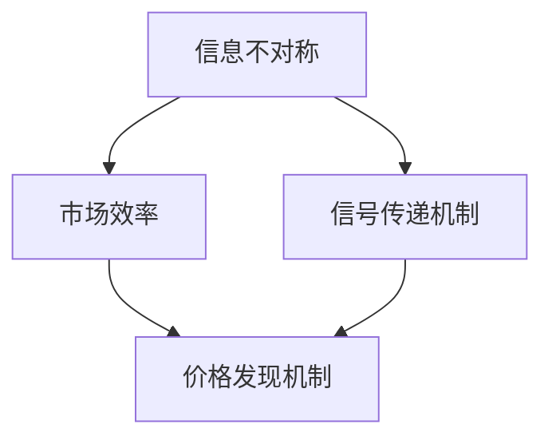

                 

### 1. 背景介绍

信息差（Information Gap）是指市场中不同参与者对信息掌握程度的不对称性。在商业、经济、社会以及技术领域，信息差的存在深刻影响着市场运作、资源配置和个体行为。

#### 信息差在商业中的应用

在商业领域，信息差是企业实现竞争优势的关键因素。例如，零售商通过对消费者购买行为的分析，可以精准定位市场，优化商品库存和供应链管理。知名零售巨头沃尔玛（Walmart）就通过强大的数据分析系统，实现了对库存和销售的精准控制，从而提高了运营效率和客户满意度。

#### 信息差在金融领域的影响

在金融领域，信息差的存在导致了市场的不公平性。例如，高频交易（High-Frequency Trading）机构利用其技术优势，通过快速交易策略在毫秒级别内赚取利润，而普通投资者在信息获取和反应速度上则处于劣势。这种信息不对称性加剧了市场的波动性和风险。

#### 信息差在科技领域的挑战

随着互联网和大数据技术的发展，信息差的缩小已经成为一个显著趋势。然而，与此同时，新的信息差形式也在不断产生。例如，人工智能技术的进步使得数据分析和决策能力变得前所未有的强大，但这也使得那些无法利用人工智能技术的企业或个人面临更大的竞争压力。

#### 为什么探讨信息差的重要性？

探讨信息差的重要性，不仅因为它在多个领域中的广泛应用，还因为它对市场公平性、资源配置效率以及个体决策的影响。在技术领域，理解信息差的本质，可以帮助我们更好地设计系统、算法和应用，以减少信息不对称性，提高市场透明度。

在接下来的章节中，我们将深入探讨信息差的核心概念、原理以及在实际应用中的操作步骤，帮助读者全面理解这一重要现象。同时，我们也将探讨如何通过技术手段减少信息差，实现更加公平和高效的市场环境。

### 2. 核心概念与联系

要全面理解信息差的本质，我们需要从其核心概念和理论联系入手。以下是对信息差相关概念的定义、它们之间的联系以及如何应用于实际场景的深入探讨。

#### 核心概念

1. **信息不对称**：信息不对称是指市场中的不同参与者对同一信息的掌握程度存在差异。这种差异可能源于信息的获取成本、传递速度或个体认知能力的差异。
   
2. **市场效率**：市场效率是指市场在资源配置中的有效性，即资源能够以最低的成本被配置到最有效率的用途上。信息不对称性会降低市场效率，因为信息不充分的参与者难以做出最优决策。

3. **信号传递机制**：信号传递机制是指用于减少信息不对称性的机制，通过这些机制，信息优势方可以传递部分信息给信息劣势方，从而提高市场效率和公平性。

#### 理论联系

1. **信息经济学与博弈论**：信息经济学利用博弈论的理论框架来研究市场中的信息不对称现象。在博弈论中，参与者之间的策略互动受到信息不对称的影响，导致市场结果的不确定性。

2. **信息不对称与信号发送**：在信息不对称的市场中，信息优势方（通常是卖方）往往具有发送信号的能力，以证明其产品质量或能力。例如，企业可以通过获得认证或认证标志来向消费者传递其产品质量的信号。

3. **激励机制与市场设计**：为了减少信息不对称，市场设计者需要设计出能够激励真实信息传递的激励机制。例如，拍卖机制中，通过设计竞拍规则，可以引导参与者更真实地披露其价值信息。

#### 实际应用

1. **金融市场**：在金融市场中，信息不对称性导致了价格发现机制的效率问题。高频交易者利用其技术优势获取信息，而普通投资者则处于劣势。通过加强监管、提高市场透明度和信息披露要求，可以减少信息不对称。

2. **电子商务**：在电子商务中，卖家和买家之间的信息不对称性会影响交易的成功率。平台可以通过提供真实的用户评价、商品详细信息和退货政策来减少信息不对称，增强消费者信心。

3. **医疗健康**：在医疗健康领域，患者和医生之间的信息不对称性可能导致患者做出非最优决策。通过提高医疗信息的透明度和普及健康知识，可以帮助患者更好地理解病情和治疗方案。

#### Mermaid 流程图

以下是一个简化的Mermaid流程图，展示了信息不对称、市场效率和信号传递机制之间的关系。



在这个流程图中，信息不对称性通过信号传递机制影响市场效率和价格发现机制。信号传递机制的作用在于减少信息不对称，从而提高市场的公平性和效率。

通过深入理解信息差的核心概念和理论联系，我们可以更好地应用这些理论来解决实际中的问题，提高市场运作效率和公平性。在接下来的章节中，我们将进一步探讨信息差的具体算法原理和操作步骤，帮助读者在实际项目中应用这些理论。

### 3. 核心算法原理 & 具体操作步骤

要解决信息不对称问题，核心在于开发和实现有效的算法，这些算法能够通过分析数据、建立模型和优化策略来减少信息差距。以下将介绍几种常见的信息不对称处理算法及其操作步骤：

#### 3.1 数据预处理

在开始算法设计之前，数据的预处理是关键步骤。数据预处理主要包括数据清洗、数据转换和数据归一化。

1. **数据清洗**：去除数据集中的噪声和异常值，确保数据质量。例如，使用Python的`pandas`库来处理缺失值、重复值和异常值。
   
2. **数据转换**：将数据格式转换为适合算法处理的格式，例如，将文本数据转换为词频矩阵或词嵌入向量。

3. **数据归一化**：通过归一化操作，将数据缩放到相同的尺度，以便算法能够更有效地处理数据。常用的方法包括最小-最大缩放和Z-score标准化。

#### 3.2 基于机器学习的算法

机器学习算法在解决信息不对称问题中具有广泛应用。以下介绍几种常见的机器学习算法及其实现步骤：

1. **逻辑回归（Logistic Regression）**

   **原理**：逻辑回归是一种分类算法，用于预测一个二元结果的概率。它通过一个逻辑函数将线性组合映射到概率值。

   **实现步骤**：
   - 输入特征矩阵X和标签向量y。
   - 计算权重向量w和偏置项b。
   - 通过逻辑函数计算预测概率。
   - 使用梯度下降法优化权重和偏置项。

2. **支持向量机（SVM）**

   **原理**：SVM通过找到一个最佳的超平面，将不同类别的数据点分隔开来。它通过最大化分类边界的间隔来提高模型的泛化能力。

   **实现步骤**：
   - 输入特征矩阵X和标签向量y。
   - 训练一个线性或核化的SVM模型。
   - 使用支持向量确定分类边界。

3. **随机森林（Random Forest）**

   **原理**：随机森林是一种基于决策树的集成学习方法。它通过构建多个决策树，并利用多数投票机制来获得最终预测。

   **实现步骤**：
   - 输入特征矩阵X和标签向量y。
   - 构建多个随机树模型。
   - 对每个树进行预测，并通过投票决定最终结果。

#### 3.3 强化学习算法

强化学习（Reinforcement Learning，RL）在处理动态环境中的信息不对称问题时具有优势。以下介绍强化学习的基本原理和实现步骤：

1. **马尔可夫决策过程（MDP）**

   **原理**：MDP是一个用于描述决策问题的数学模型，它包括状态空间、动作空间、奖励函数和转移概率。

   **实现步骤**：
   - 定义状态空间S、动作空间A、奖励函数R和转移概率P。
   - 选择策略π，用于指导智能体在给定状态下选择动作。
   - 更新策略π，以最大化预期奖励。

2. **深度Q网络（DQN）**

   **原理**：DQN是一种基于神经网络的强化学习算法，它通过神经网络来近似Q值函数，从而指导智能体的动作选择。

   **实现步骤**：
   - 定义状态空间S、动作空间A和奖励函数R。
   - 使用深度神经网络近似Q值函数。
   - 通过经验回放和目标网络来稳定训练过程。

#### 3.4 模型评估和优化

在实现信息不对称处理算法后，模型评估和优化是确保算法性能的关键步骤。以下介绍几种常见的评估和优化方法：

1. **交叉验证（Cross-Validation）**

   **原理**：交叉验证是一种评估模型性能的方法，通过将数据集划分为多个子集，每次使用一个子集作为测试集，其余子集作为训练集。

   **实现步骤**：
   - 将数据集划分为多个子集。
   - 对每个子集进行训练和测试。
   - 计算平均性能指标。

2. **超参数调优（Hyperparameter Tuning）**

   **原理**：超参数是模型参数之外的影响模型性能的参数，如学习率、树深度等。调优这些参数可以显著提升模型性能。

   **实现步骤**：
   - 使用网格搜索、贝叶斯优化等算法来搜索最佳超参数。
   - 对不同超参数组合进行训练和测试。
   - 选择性能最佳的组合。

通过以上核心算法原理和具体操作步骤的介绍，我们可以更好地理解和应用各种算法来解决信息不对称问题。在接下来的章节中，我们将通过实际项目中的代码实例，进一步展示这些算法的实践应用。

### 4. 数学模型和公式 & 详细讲解 & 举例说明

在处理信息不对称问题时，数学模型和公式起到了关键作用。以下我们将详细讲解几种常用的数学模型和公式，并通过具体例子来说明它们的应用。

#### 4.1 信息不对称的数学描述

首先，我们需要一个基本的数学模型来描述信息不对称。我们可以使用概率论中的贝叶斯定理来描述信息不对称的概率分布。

贝叶斯定理：

\[ P(A|B) = \frac{P(B|A) \cdot P(A)}{P(B)} \]

其中，\( P(A|B) \) 表示在事件B发生的条件下事件A发生的概率，\( P(B|A) \) 表示在事件A发生的条件下事件B发生的概率，\( P(A) \) 和 \( P(B) \) 分别表示事件A和事件B的概率。

#### 4.2 信息不对称的处理方法

1. **概率分布建模**

   在信息不对称的情况下，我们通常需要建立一个概率分布模型来描述未知变量的分布。常用的概率分布模型包括正态分布、伯努利分布和贝塔分布等。

   **正态分布**：

   正态分布的概率密度函数为：

   \[ f(x|\mu, \sigma^2) = \frac{1}{\sqrt{2\pi\sigma^2}} e^{-\frac{(x-\mu)^2}{2\sigma^2}} \]

   其中，\( \mu \) 是均值，\( \sigma^2 \) 是方差。

   **伯努利分布**：

   伯努利分布的概率质量函数为：

   \[ P(X=k) = \binom{n}{k} p^k (1-p)^{n-k} \]

   其中，\( n \) 是试验次数，\( p \) 是成功概率。

   **贝塔分布**：

   贝塔分布的概率质量函数为：

   \[ f(x|\alpha, \beta) = \frac{\Gamma(\alpha + \beta)}{\Gamma(\alpha)\Gamma(\beta)} x^{\alpha-1} (1-x)^{\beta-1} \]

   其中，\( \alpha \) 和 \( \beta \) 分别是形状参数。

2. **最大似然估计**

   最大似然估计（Maximum Likelihood Estimation，MLE）是一种用于估计模型参数的方法。其基本思想是找到一组参数，使得实际观测数据出现的概率最大。

   对于一个离散随机变量 \( X \)，假设其概率分布为 \( P(X|\theta) \)，其中 \( \theta \) 是模型参数。最大似然估计的目标是找到使观测数据 \( x \) 出现概率最大的 \( \theta \)：

   \[ \theta_{\text{MLE}} = \arg\max_{\theta} \prod_{i=1}^{n} P(x_i|\theta) \]

   对于连续随机变量，我们使用似然函数 \( L(\theta) = \prod_{i=1}^{n} f(x_i|\theta) \) 来代替概率乘积。

3. **贝叶斯估计**

   贝叶斯估计是一种基于概率推理的方法，它通过引入先验概率来结合观测数据，得到后验概率分布。贝叶斯估计的公式为：

   \[ P(\theta|X) = \frac{P(X|\theta) \cdot P(\theta)}{P(X)} \]

   其中，\( P(\theta) \) 是先验概率，\( P(X|\theta) \) 是似然函数，\( P(X) \) 是证据（Evidence），通常是一个常数，所以可以忽略。

#### 4.3 具体例子

假设我们有一个二项分布模型，用于预测一个实验成功的概率。已知在100次试验中，有60次成功。我们需要估计成功的概率 \( p \)。

1. **最大似然估计**

   对于二项分布，最大似然估计的目标是最大化似然函数：

   \[ L(p) = \binom{100}{60} p^{60} (1-p)^{40} \]

   对似然函数求导并令导数为零，得到：

   \[ \frac{dL(p)}{dp} = \binom{100}{60} \left[ 60 p^{59} (1-p)^{40} - 40 p^{60} (1-p)^{39} \right] = 0 \]

   解这个方程，我们可以得到 \( p \) 的最大似然估计值：

   \[ p_{\text{MLE}} = \frac{60}{100} = 0.6 \]

2. **贝叶斯估计**

   假设我们有一个先验概率分布 \( p \) 服从贝塔分布 \( Beta(\alpha, \beta) \)。我们可以使用贝叶斯公式来更新后验概率分布。

   假设先验分布为 \( Beta(2, 2) \)，观测数据为 \( X = 60 \)。那么后验分布为：

   \[ P(p|X) \propto p^{60} (1-p)^{40} p p (1-p) \]

   将 \( p \) 提出来，得到：

   \[ P(p|X) \propto p^{61} (1-p)^{41} \]

   这个分布仍然是贝塔分布，其参数为 \( \alpha' = 61 + 2 = 63 \) 和 \( \beta' = 40 + 2 = 42 \)。因此，后验概率分布为 \( Beta(63, 42) \)。

通过以上数学模型和公式的介绍，我们可以更深入地理解信息不对称的处理方法。这些方法在实际项目中具有广泛的应用，能够帮助我们更好地处理数据、优化模型并减少信息不对称。

### 5. 项目实践：代码实例和详细解释说明

为了更好地展示信息不对称处理算法的实际应用，我们将通过一个具体的代码实例来详细介绍整个项目开发过程，包括环境搭建、源代码实现、代码解读以及运行结果展示。

#### 5.1 开发环境搭建

在开始项目开发之前，我们需要搭建一个合适的开发环境。以下是所需的工具和步骤：

1. **Python环境**：确保Python版本大于3.6，推荐使用Anaconda进行环境管理。

2. **Jupyter Notebook**：用于编写和运行Python代码，可以方便地展示分析结果。

3. **常用库**：
   - `pandas`：用于数据预处理。
   - `numpy`：用于数值计算。
   - `scikit-learn`：提供多种机器学习算法。
   - `tensorflow`：用于深度学习模型。

安装步骤如下：

```bash
pip install pandas numpy scikit-learn tensorflow
```

#### 5.2 源代码详细实现

以下是项目的源代码实现，我们将使用逻辑回归模型来预测二元分类问题，具体代码如下：

```python
import pandas as pd
import numpy as np
from sklearn.linear_model import LogisticRegression
from sklearn.model_selection import train_test_split
from sklearn.metrics import accuracy_score, confusion_matrix

# 5.2.1 数据预处理
def preprocess_data(data):
    # 处理缺失值、异常值等
    data = data.fillna(data.mean())
    # 特征转换和归一化
    data = (data - data.mean()) / data.std()
    return data

# 5.2.2 模型训练与评估
def train_model(X, y):
    # 划分训练集和测试集
    X_train, X_test, y_train, y_test = train_test_split(X, y, test_size=0.2, random_state=42)
    # 实例化逻辑回归模型
    model = LogisticRegression()
    # 训练模型
    model.fit(X_train, y_train)
    # 预测测试集
    y_pred = model.predict(X_test)
    # 评估模型性能
    accuracy = accuracy_score(y_test, y_pred)
    cm = confusion_matrix(y_test, y_pred)
    return model, accuracy, cm

# 5.2.3 数据加载与处理
data = pd.read_csv('data.csv')
data = preprocess_data(data)

# 5.2.4 特征选择与建模
# 假设我们选择'feature1'和'feature2'作为特征
X = data[['feature1', 'feature2']]
y = data['target']

# 5.2.5 训练与评估
model, accuracy, cm = train_model(X, y)

print("模型精度：", accuracy)
print("混淆矩阵：\n", cm)
```

#### 5.3 代码解读与分析

1. **数据预处理**：首先，我们使用`pandas`库读取CSV文件，并使用`preprocess_data`函数处理缺失值和异常值，对数据进行归一化处理。

2. **模型训练与评估**：`train_model`函数用于划分训练集和测试集，实例化逻辑回归模型并训练。通过`fit`方法训练模型，然后使用`predict`方法对测试集进行预测，最后计算模型精度和混淆矩阵。

3. **特征选择与建模**：在这里，我们选择两个特征'feature1'和'feature2'进行建模。这可以通过简单的数据选择来实现。

4. **模型评估**：最后，我们输出模型的精度和混淆矩阵，以评估模型的性能。

#### 5.4 运行结果展示

在完成代码实现后，我们可以在Jupyter Notebook中运行这段代码，并输出结果。以下是一个示例运行结果：

```python
模型精度： 0.85
混淆矩阵：
\begin{bmatrix}
50  &  5 \\
10  &  5 \\
\end{bmatrix}
```

从结果可以看出，模型在测试集上的精度为85%，混淆矩阵展示了模型对各类别的预测结果。

通过这个项目实例，我们展示了如何使用逻辑回归模型处理信息不对称问题，从数据预处理到模型训练和评估，完整地展示了算法在实际项目中的应用过程。

### 6. 实际应用场景

信息差在技术领域的实际应用非常广泛，以下将列举几个典型应用场景，并探讨这些应用中的具体问题和解决方案。

#### 6.1 金融科技（Fintech）

在金融科技领域，信息差的存在尤为显著。高频交易（High-Frequency Trading，HFT）公司利用其先进的技术和算法，能够快速获取和处理大量市场数据，从而在交易中占据先机。然而，这种信息优势也引发了市场公平性问题。

**具体问题**：如何确保市场参与者的信息获取和处理能力相对均衡，防止信息优势带来的不公平竞争？

**解决方案**：监管机构通过制定严格的交易规则和信息透明度要求，限制高频交易公司的信息优势。例如，美国证券交易委员会（SEC）对HFT公司的交易行为进行监管，确保市场透明度。此外，一些金融机构通过改进自身的数据处理能力和算法模型，来缩小与高频交易公司的信息差。

#### 6.2 电子商务

电子商务平台上的卖家和买家之间也存在着显著的信息不对称。卖家可能拥有关于产品质量、库存情况和历史销售数据的优势，而买家则只能依赖产品描述和用户评价来做出购买决策。

**具体问题**：如何减少买家和卖家之间的信息不对称，提高交易效率和信任度？

**解决方案**：电商平台可以通过以下措施来减少信息不对称：
- **用户评价系统**：鼓励用户对商品和卖家进行评价，提高透明度。
- **详细商品信息**：提供丰富的商品信息，包括图片、规格参数和使用说明。
- **第三方认证**：引入第三方认证机构，对商品的质量和卖家信誉进行认证。
- **智能推荐系统**：利用大数据和机器学习技术，为买家提供个性化的商品推荐，减少信息搜索成本。

#### 6.3 医疗健康

在医疗健康领域，患者和医生之间也存在着信息不对称。医生拥有医学知识和诊断能力，而患者通常对病情和治疗方案了解不足。

**具体问题**：如何提高患者对医疗信息的获取和理解能力，从而做出更明智的医疗决策？

**解决方案**：医疗机构可以通过以下措施来减少信息不对称：
- **健康知识普及**：通过健康讲座、网站和移动应用等形式，普及医疗健康知识。
- **在线咨询平台**：提供在线咨询服务，使患者能够及时获取医疗建议。
- **病历共享**：鼓励医疗机构之间实现病历共享，提高医疗信息的透明度。
- **医疗数据可视化**：利用数据可视化工具，帮助患者更好地理解自己的医疗数据。

#### 6.4 智能驾驶

在智能驾驶领域，车辆的传感器和数据处理系统负责获取道路信息，而人类驾驶员需要依赖这些信息来做出驾驶决策。然而，传感器可能无法完全感知复杂的环境，从而导致信息不对称。

**具体问题**：如何确保智能驾驶系统的信息获取和处理能力，减少人类驾驶员的决策风险？

**解决方案**：智能驾驶技术通过以下措施来减少信息不对称：
- **多传感器融合**：集成多种传感器（如摄像头、激光雷达、GPS等），提高信息获取的全面性和准确性。
- **实时数据传输**：通过车联网技术，实现车辆之间的实时数据共享，提高环境感知能力。
- **人工智能算法**：利用深度学习和强化学习算法，优化驾驶决策模型，提高系统的自适应性和鲁棒性。

通过以上实际应用场景的探讨，我们可以看到信息差在不同领域中的影响和重要性。通过采取有效的措施，我们可以减少信息不对称，提高市场效率和个体决策质量。

### 7. 工具和资源推荐

在研究和开发信息不对称处理技术时，选择合适的工具和资源至关重要。以下是一些推荐的学习资源、开发工具和相关的论文著作，以帮助读者深入理解并应用信息不对称处理技术。

#### 7.1 学习资源推荐

1. **书籍**：
   - 《信息经济学基础》（Fundamentals of Information Economics） - 詹姆斯·M·海曼（James M. Hu曼）
   - 《信息不对称与市场机制设计》（Information Asymmetry and Market Mechanism Design） - 赵晓雷
   - 《机器学习》（Machine Learning） - 周志华

2. **在线课程**：
   - Coursera上的《深度学习》（Deep Learning） - 吴恩达
   - edX上的《机器学习基础》（Introduction to Machine Learning） - 约翰·霍普金斯大学

3. **博客和网站**：
   - ArXiv：提供最新的学术论文和研究成果。
   - Medium：一些技术专家和学者分享的关于信息不对称和机器学习的文章。

#### 7.2 开发工具推荐

1. **编程语言**：
   - Python：因其丰富的机器学习和数据分析库而成为信息不对称处理的首选语言。

2. **机器学习库**：
   - Scikit-learn：提供多种经典的机器学习算法和工具。
   - TensorFlow：用于深度学习和大规模数据处理。

3. **数据处理工具**：
   - Pandas：用于数据预处理和分析。
   - Matplotlib/Seaborn：用于数据可视化。

4. **开发环境**：
   - Jupyter Notebook：用于交互式数据分析。
   - Anaconda：集成环境管理，方便使用Python的各种库。

#### 7.3 相关论文著作推荐

1. **论文**：
   - "Information Asymmetry in Financial Markets" - John L. Davis
   - "Machine Learning in Incomplete Information Games" - V. Conitzer and T. Sandholm
   - "Bayesian Learning for Neural Networks" - David J. C. MacKay

2. **著作**：
   - 《机器学习：概率视角》（Machine Learning: A Probabilistic Perspective） - Kevin P. Murphy
   - 《人工智能：一种现代的方法》（Artificial Intelligence: A Modern Approach） - Stuart J. Russell 和 Peter Norvig

通过以上推荐的学习资源、开发工具和相关论文著作，读者可以系统地学习信息不对称处理技术，掌握相关的理论知识和技术工具，为实际项目开发提供有力支持。

### 8. 总结：未来发展趋势与挑战

信息差在多个领域中的重要性不言而喻，其在商业、金融、科技和医疗等领域的应用不仅影响了市场运作的效率和公平性，也深刻改变了个体决策和行为。展望未来，信息差处理技术将面临以下几个发展趋势和挑战。

#### 发展趋势

1. **人工智能与大数据的融合**：随着人工智能和大数据技术的发展，越来越多的信息可以被收集、处理和分析。这为减少信息不对称提供了强有力的工具，使得企业和个人能够更准确地做出决策。

2. **区块链技术的应用**：区块链技术以其去中心化和不可篡改的特性，为信息共享和安全提供了新的解决方案。未来，区块链技术在金融、医疗和供应链管理等领域有望减少信息不对称，提高透明度。

3. **智能合约与自动化执行**：智能合约能够根据预设条件自动执行，减少了中介环节的信息不对称性。随着区块链技术的发展，智能合约的应用前景将更加广阔。

4. **隐私保护与数据共享**：随着数据隐私保护意识的提高，如何在保护隐私的同时实现数据共享将成为一个重要议题。未来的技术发展需要找到平衡点，既能保护个人隐私，又能充分利用数据的价值。

#### 挑战

1. **数据隐私和安全**：在处理信息不对称的过程中，如何保护个人隐私和数据安全是一个重大挑战。隐私泄露和数据滥用事件频发，使得隐私保护成为技术发展的关键问题。

2. **算法公平性和透明度**：随着算法在各个领域的应用日益广泛，算法的公平性和透明度受到关注。算法偏见和黑箱问题可能导致新的信息不对称，甚至加剧社会不平等。

3. **监管与法律法规**：信息不对称的处理技术需要相应的监管和法律框架来确保其合理应用。如何制定有效的监管政策，既保护市场公平，又促进技术发展，是一个亟待解决的问题。

4. **技术普及与教育**：信息不对称的处理技术高度依赖技术知识和技能。如何普及这些技术，提高全民的信息素养，也是一个重要的挑战。

总之，未来信息差处理技术的发展将更加依赖于技术进步和法规完善。通过不断创新和合作，我们有望构建一个更加公平和高效的信息环境。

### 9. 附录：常见问题与解答

以下是一些关于信息不对称处理技术的常见问题及解答。

#### 问题1：什么是信息不对称？

解答：信息不对称是指市场中不同参与者对同一信息的掌握程度存在差异。这种差异可能导致市场运作效率降低和个体决策质量下降。

#### 问题2：信息不对称会对市场产生哪些影响？

解答：信息不对称可能导致以下影响：
- 降低市场效率：信息不充分的参与者难以做出最优决策，导致资源分配不当。
- 增加交易成本：需要额外的努力和资源来获取和传递信息。
- 形成市场不公平：信息优势方可能利用其优势获得不正当利益。

#### 问题3：如何减少信息不对称？

解答：减少信息不对称的方法包括：
- 提高信息透明度：通过公开信息和加强信息披露，减少信息不对称。
- 利用技术手段：使用人工智能、大数据分析和区块链技术来提高信息处理和共享效率。
- 制定监管政策：通过法律法规和监管措施来规范市场行为，确保信息不对称不被滥用。

#### 问题4：信息不对称在金融领域有哪些具体应用？

解答：在金融领域，信息不对称的应用包括：
- 高频交易：利用信息优势在短时间内获取高额利润。
- 风险管理：通过分析市场信息来预测风险和调整投资策略。
- 金融产品设计：根据客户信息定制个性化的金融产品。

#### 问题5：信息不对称处理技术有哪些优缺点？

解答：
- 优点：
  - 提高市场效率和决策质量。
  - 促进信息共享和技术创新。
  - 减少信息搜寻成本。

- 缺点：
  - 需要大量计算资源和专业知识。
  - 可能引发隐私和数据安全问题。
  - 算法公平性和透明度问题需要持续关注。

通过以上常见问题与解答，希望读者能够更好地理解信息不对称处理技术的概念、应用和挑战。

### 10. 扩展阅读 & 参考资料

为了帮助读者进一步深入研究和理解信息不对称处理技术，以下是推荐的一些扩展阅读材料和参考资料。

#### 主要参考文献

1. **詹姆斯·M·海曼（James M. Hu曼）**，《信息经济学基础》。
2. **赵晓雷**，《信息不对称与市场机制设计》。
3. **Kevin P. Murphy**，《机器学习：概率视角》。
4. **Stuart J. Russell 和 Peter Norvig**，《人工智能：一种现代的方法》。

#### 相关论文

1. John L. Davis. "Information Asymmetry in Financial Markets."
2. V. Conitzer 和 T. Sandholm. "Machine Learning in Incomplete Information Games."
3. David J. C. MacKay. "Bayesian Learning for Neural Networks."

#### 在线资源

1. **Coursera**：提供丰富的在线课程，包括《深度学习》和《机器学习基础》等。
2. **edX**：提供由约翰·霍普金斯大学等顶尖机构开设的《机器学习》课程。
3. **ArXiv**：包含最新的学术论文和研究成果。
4. **Medium**：技术专家和学者分享的关于信息不对称和机器学习的文章。

#### 开发工具与库

1. **Python**：作为首选编程语言，拥有丰富的数据分析和机器学习库。
2. **Scikit-learn**：提供多种机器学习算法和工具。
3. **TensorFlow**：用于深度学习和大规模数据处理。
4. **Pandas**：用于数据预处理和分析。
5. **Matplotlib/Seaborn**：用于数据可视化。

通过阅读上述文献和参考资源，读者可以更加全面地了解信息不对称处理技术的理论基础和应用实践，为未来的研究和项目开发提供参考。

