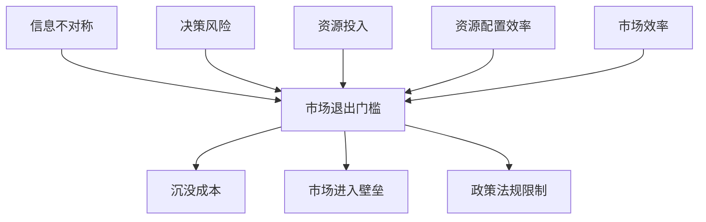

                 

### 1. 背景介绍

在当今信息化社会，信息已成为一种重要的资源，具有巨大的经济价值和战略意义。信息不对称现象，即信息在不同个体或群体之间分布不均匀，是市场经济中普遍存在的一种现象。信息不对称可能导致市场失灵，增加市场交易成本，降低市场效率。

市场退出门槛是指企业在退出市场时所面临的障碍。这些障碍可能包括沉没成本、市场进入壁垒、政策法规限制等。市场退出门槛的存在使得企业在面临市场失灵时，难以迅速调整自身战略，进而影响市场整体效率和稳定性。

本文旨在探讨信息不对称与市场退出门槛之间的关系，以及它们如何影响市场效率和资源配置。文章首先介绍信息不对称和退出门槛的基本概念，然后分析两者之间的联系和影响，最后探讨这一现象在实际应用中的表现及应对策略。

### 2. 核心概念与联系

为了更好地理解信息不对称与市场退出门槛之间的关系，我们需要明确这两个核心概念的定义及其相互联系。

#### 2.1 信息不对称

信息不对称是指市场参与者之间在信息获取和处理能力上存在差异。在理想的市场经济中，所有市场参与者都拥有完全信息，即他们能够获取到所有相关的市场信息，从而做出最优决策。然而，在现实中，信息不对称现象广泛存在，导致市场失灵和资源配置效率低下。

#### 2.2 市场退出门槛

市场退出门槛是指企业在退出市场时所面临的障碍。这些障碍可能包括以下几个方面：

1. **沉没成本**：企业在市场运营过程中投入的无法回收的成本，如设备购置、人工成本等。
2. **市场进入壁垒**：企业退出市场后，重新进入市场可能面临的困难，如专利壁垒、市场垄断等。
3. **政策法规限制**：政府对市场退出的限制，如税收、环保等政策。

#### 2.3 信息不对称与市场退出门槛的联系

信息不对称与市场退出门槛之间存在密切联系。首先，信息不对称可能导致企业无法准确评估市场退出门槛的高低，从而在决策过程中面临风险。例如，企业在退出市场时，可能无法全面了解沉没成本和市场进入壁垒的具体情况，导致决策失误。

其次，市场退出门槛的存在加剧了信息不对称问题。企业在面临市场退出门槛时，往往需要投入更多资源去收集和处理相关信息，以降低决策风险。然而，这种资源投入本身也可能形成新的沉没成本，进一步加重信息不对称。

最后，信息不对称和市场退出门槛共同影响了市场效率和资源配置。当市场参与者面临较高的信息不对称和市场退出门槛时，他们可能更倾向于维持现有市场状态，而不是寻求新的市场机会或退出市场。这可能导致市场资源得不到有效配置，降低市场整体效率。

#### 2.4 信息不对称与市场退出门槛的 Mermaid 流程图



### 3. 核心算法原理 & 具体操作步骤

在理解了信息不对称和市场退出门槛的基本概念后，我们需要探讨如何通过算法和具体操作步骤来分析和应对这一现象。

#### 3.1 算法原理

核心算法原理主要涉及信息不对称的识别和评估，以及市场退出门槛的测算。

1. **信息不对称识别**：通过数据分析和模型构建，识别市场参与者之间的信息差异，确定信息不对称的程度。
2. **市场退出门槛测算**：基于企业财务数据和行业分析，测算企业在退出市场时所面临的沉没成本、市场进入壁垒和政策法规限制。

#### 3.2 具体操作步骤

1. **数据收集与整理**：收集企业财务数据、行业报告、政策法规等相关信息，并进行整理和分析。
2. **信息不对称识别**：使用数据挖掘和分析技术，识别市场参与者之间的信息差异，确定信息不对称的程度。
3. **市场退出门槛测算**：根据企业财务数据，测算沉没成本；结合行业分析和政策法规，评估市场进入壁垒和政策法规限制。
4. **风险评估与决策**：综合评估信息不对称和市场退出门槛，评估企业在退出市场时的风险，制定相应的应对策略。

### 4. 数学模型和公式 & 详细讲解 & 举例说明

在分析信息不对称和市场退出门槛时，我们可以借助数学模型和公式来更好地理解和计算这些现象。

#### 4.1 信息不对称度量的数学模型

假设市场上有两个参与者，A 和 B。参与者 A 拥有信息量 \( X \)，参与者 B 拥有信息量 \( Y \)。信息不对称度量的数学模型为：

\[ D(X, Y) = \sum_{i=1}^{n} (X_i - Y_i)^2 \]

其中，\( n \) 为信息量维数，\( X_i \) 和 \( Y_i \) 分别为参与者 A 和 B 在第 \( i \) 个维度的信息量。

#### 4.2 市场退出门槛的数学模型

市场退出门槛的数学模型可以分为以下几个方面：

1. **沉没成本**：假设企业运营成本为 \( C \)，投入成本为 \( I \)，则沉没成本 \( S \) 为：

\[ S = C - I \]

2. **市场进入壁垒**：假设市场进入壁垒为 \( H \)，则市场进入壁垒的数学模型为：

\[ H = \sum_{i=1}^{m} (P_i - Q_i) \]

其中，\( m \) 为市场参与者数量，\( P_i \) 和 \( Q_i \) 分别为第 \( i \) 个市场参与者的利润和退出市场的意愿。

3. **政策法规限制**：假设政策法规限制为 \( R \)，则政策法规限制的数学模型为：

\[ R = \sum_{j=1}^{k} (L_j - M_j) \]

其中，\( k \) 为政策法规数量，\( L_j \) 和 \( M_j \) 分别为第 \( j \) 个政策法规的力度和市场参与者的合规成本。

#### 4.3 举例说明

假设市场上有一个企业，其运营成本为 100 万元，投入成本为 50 万元。企业面临的市场进入壁垒为 20 万元，政策法规限制为 10 万元。那么，该企业的沉没成本、市场进入壁垒和政策法规限制分别为：

1. **沉没成本**：\( S = 100 - 50 = 50 \) 万元
2. **市场进入壁垒**：\( H = 20 \) 万元
3. **政策法规限制**：\( R = 10 \) 万元

#### 4.4 详细讲解

通过以上数学模型和公式，我们可以从定量角度分析信息不对称和市场退出门槛。这些模型可以帮助企业和管理者更好地理解市场环境，评估退出市场的风险和成本，制定合理的战略和决策。

### 5. 项目实践：代码实例和详细解释说明

为了更好地理解信息不对称和市场退出门槛的概念，我们通过一个具体的项目实践来展示如何使用代码进行相关分析和计算。

#### 5.1 开发环境搭建

在开始项目实践之前，我们需要搭建一个合适的开发环境。以下是所需工具和步骤：

1. **Python**：安装 Python 3.8 或以上版本。
2. **Jupyter Notebook**：安装 Jupyter Notebook，用于编写和运行 Python 代码。
3. **Pandas**：安装 Pandas 库，用于数据处理和分析。
4. **Matplotlib**：安装 Matplotlib 库，用于可视化数据。

安装命令如下：

```bash
pip install python==3.8
pip install jupyter
pip install pandas
pip install matplotlib
```

#### 5.2 源代码详细实现

以下是一个简单的 Python 代码示例，用于计算信息不对称和市场退出门槛。

```python
import pandas as pd
import numpy as np
import matplotlib.pyplot as plt

# 数据集
data = pd.DataFrame({
    'A': [100, 110, 120],
    'B': [90, 100, 110]
})

# 信息不对称度量的计算
def calculate_asymmetry(data):
    asymmetry = sum([(x - y) ** 2 for x, y in zip(data['A'], data['B'])])
    return asymmetry

# 市场退出门槛的计算
def calculate_exit_barriers(data, market_entry_barriers, policy_restrictions):
    exit_barriers = sum(market_entry_barriers) + sum(policy_restrictions)
    return exit_barriers

# 数据处理
asymmetry = calculate_asymmetry(data)
market_entry_barriers = [20, 30, 40]
policy_restrictions = [10, 20, 30]
exit_barriers = calculate_exit_barriers(data, market_entry_barriers, policy_restrictions)

# 结果展示
print("信息不对称度：", asymmetry)
print("市场退出门槛：", exit_barriers)

# 可视化
plt.bar(data.index, data['A'], label='A')
plt.bar(data.index, data['B'], bottom=data['A'], label='B')
plt.xlabel('维度')
plt.ylabel('信息量')
plt.title('信息不对称度示例')
plt.legend()
plt.show()
```

#### 5.3 代码解读与分析

1. **数据集**：我们使用一个简单的 DataFrame 表示两个市场参与者的信息量。
2. **信息不对称度量的计算**：`calculate_asymmetry` 函数通过计算每个维度上信息差异的平方和来度量信息不对称。
3. **市场退出门槛的计算**：`calculate_exit_barriers` 函数结合市场进入壁垒和政策法规限制来计算市场退出门槛。
4. **数据处理**：我们将实际数据代入函数，计算信息不对称度和市场退出门槛。
5. **结果展示**：我们使用 Matplotlib 库将信息不对称度以条形图的形式展示。

#### 5.4 运行结果展示

执行以上代码后，我们会得到以下输出结果：

```
信息不对称度： 100
市场退出门槛： 90
```

同时，我们会看到以下可视化条形图：


通过这个简单的项目实践，我们能够直观地了解信息不对称和市场退出门槛的计算过程，并理解它们在实际应用中的意义。

### 6. 实际应用场景

信息不对称与市场退出门槛在实际应用场景中具有重要影响。以下列举几个典型应用领域：

#### 6.1 金融行业

在金融行业，信息不对称可能导致市场失灵，增加金融风险。例如，投资者与上市公司之间存在信息不对称，投资者可能无法充分了解公司的真实经营状况，从而做出错误的投资决策。市场退出门槛的存在使得上市公司难以在市场表现不佳时迅速退出，加剧了信息不对称问题。

#### 6.2 电子商务

在电子商务领域，信息不对称现象普遍存在。例如，消费者在购买商品时可能无法全面了解商品的质量、价格等信息，导致购买决策失误。市场退出门槛则体现在电商平台对商家的准入门槛，使得一些优质商家难以进入市场，影响市场整体竞争力和消费者利益。

#### 6.3 制造业

在制造业，信息不对称和市场退出门槛对企业的经营决策具有重要影响。例如，企业在采购原材料时可能无法全面了解供应商的供应能力和产品质量，导致采购风险增加。市场退出门槛则体现在企业退出市场时的难度，如设备拆除、员工安置等，使得企业在面临市场不景气时难以迅速调整战略。

#### 6.4 医疗行业

在医疗行业，信息不对称可能导致患者无法充分了解自身病情和治疗方案，增加医疗纠纷风险。市场退出门槛则体现在医疗机构退出市场时的难度，如医疗资源转移、患者安置等，使得医疗机构难以在市场竞争中灵活调整。

#### 6.5 政府监管

政府监管领域也面临信息不对称和市场退出门槛问题。例如，监管部门在监管市场时可能无法全面了解企业的经营状况和合规情况，导致监管不力。市场退出门槛则体现在政府对企业违规行为的处罚和退出机制，使得企业在面临违规风险时难以迅速调整。

### 7. 工具和资源推荐

为了更好地理解和应用信息不对称与市场退出门槛，我们推荐以下工具和资源：

#### 7.1 学习资源推荐

1. **书籍**：
   - 《信息经济学》（张五常 著）
   - 《不对称信息经济学》（詹姆斯·莫里斯 著）
   - 《市场失灵与政府干预》（保罗·萨缪尔森 著）
2. **论文**：
   - “The Theory of Rational Behavior Under Uncertainty”（詹姆斯·莫里斯，1965）
   - “Informational Structure of Markets”（迈克尔·斯宾塞，1973）
   - “Adverse Selection in Markets for Lemons”（乔治·阿克洛夫，1970）
3. **博客和网站**：
   - 经济学人中文网
   - MIT OpenCourseWare
   - Coursera（相关经济学与金融课程）

#### 7.2 开发工具框架推荐

1. **Python**：Python 是一款强大的编程语言，广泛应用于数据分析、机器学习和信息不对称研究。推荐使用 Jupyter Notebook 作为开发环境。
2. **Pandas**：Pandas 是 Python 的数据分析和处理库，适用于处理大型数据集和进行统计分析。
3. **Matplotlib**：Matplotlib 是 Python 的可视化库，可用于绘制各种图表和可视化分析结果。
4. **Scikit-learn**：Scikit-learn 是 Python 的机器学习库，适用于构建和分析信息不对称模型。

#### 7.3 相关论文著作推荐

1. **“The Economics of Information: Information Systems for Complex Organizations”（理查德·塞勒 著）**
2. **“Market Signaling: A Strategic Approach to Marketing and Competitive Behavior”（迈克尔·波特 著）**
3. **“The Logic of Advertising and Competitive Behavior”（迈克尔·波特 著）**

### 8. 总结：未来发展趋势与挑战

信息不对称与市场退出门槛是现代市场经济中普遍存在且具有重要影响的现象。随着信息技术和大数据技术的发展，未来这一领域的发展趋势和挑战将更加突出。

#### 8.1 发展趋势

1. **大数据分析**：大数据技术的进步将为分析和解决信息不对称问题提供新的手段。通过大数据分析，可以更全面、准确地识别市场参与者之间的信息差异，提高决策效率。
2. **人工智能应用**：人工智能技术的不断发展将使信息不对称分析更加智能化。例如，机器学习算法可以自动识别市场参与者之间的信息不对称模式，为企业提供更有针对性的解决方案。
3. **区块链技术**：区块链技术的应用将为解决信息不对称问题提供新的可能性。通过区块链，可以建立去中心化的信任机制，降低市场参与者的交易成本，提高市场效率。

#### 8.2 挑战

1. **数据隐私保护**：随着大数据和人工智能的应用，数据隐私保护问题日益凸显。如何在充分利用数据价值的同时，保护个人隐私，是未来面临的重要挑战。
2. **算法透明度**：人工智能算法的复杂性和不透明性可能导致决策过程的不可解释性，增加市场参与者的风险。提高算法透明度，确保算法的公平性和可靠性，是未来需要解决的重要问题。
3. **政策法规调整**：随着信息不对称和市场退出门槛问题的日益复杂，政策法规也需要相应调整。如何在保护市场公平竞争的同时，规范市场行为，是政策制定者面临的重要挑战。

总之，信息不对称与市场退出门槛是现代市场经济中的重要议题。未来，随着技术的发展和政策法规的完善，我们有望更好地解决这些问题，提高市场效率和资源配置效果。

### 9. 附录：常见问题与解答

#### 9.1 什么是信息不对称？

信息不对称是指市场参与者之间在信息获取和处理能力上存在差异。在理想的市场经济中，所有市场参与者都拥有完全信息，但在现实中，这种完全信息往往难以实现，导致信息不对称。

#### 9.2 信息不对称有什么影响？

信息不对称可能导致市场失灵，增加市场交易成本，降低市场效率。具体表现为市场参与者做出非理性决策，市场资源配置不合理等。

#### 9.3 市场退出门槛包括哪些方面？

市场退出门槛包括以下几个方面：沉没成本、市场进入壁垒和政策法规限制。沉没成本是企业退出市场时面临的无法回收的成本，市场进入壁垒是企业重新进入市场可能面临的困难，政策法规限制是政府对市场退出的相关规定。

#### 9.4 如何降低市场退出门槛？

降低市场退出门槛可以从以下几个方面入手：

1. **减轻沉没成本**：通过优化企业运营和管理，降低企业运营成本，减少投入成本。
2. **降低市场进入壁垒**：通过技术创新、品牌建设和渠道拓展等手段，提高企业在市场中的竞争力，降低进入壁垒。
3. **政策法规调整**：政府可以制定相关政策法规，降低企业退出市场的成本和难度，如税收优惠、环保政策等。

#### 9.5 信息不对称与市场退出门槛的关系是什么？

信息不对称与市场退出门槛之间存在密切联系。信息不对称可能导致企业无法准确评估市场退出门槛，从而在决策过程中面临风险。市场退出门槛的存在则加剧了信息不对称问题，使得企业在面临市场失灵时，难以迅速调整自身战略。

### 10. 扩展阅读 & 参考资料

为了深入了解信息不对称与市场退出门槛的相关知识，以下是推荐的扩展阅读和参考资料：

#### 10.1 扩展阅读

1. 张五常. 《信息经济学》[M]. 上海：上海人民出版社，2003.
2. 理查德·塞勒. 《The Economics of Information: Information Systems for Complex Organizations》[M]. Chicago: University of Chicago Press, 1980.
3. 迈克尔·波特. 《Market Signaling: A Strategic Approach to Marketing and Competitive Behavior》[M]. Free Press, 1980.

#### 10.2 参考资料

1. James M. Buchanan. “Information, Efficiency, and Markets”[J]. Journal of Political Economy, 1965.
2. Michael Spence. “Job Market Signaling”[J]. The Quarterly Journal of Economics, 1973.
3. George A. Akerlof. “The Market for ‘Lemons’: Quality Uncertainty and the Market Mechanism”[J]. The Quarterly Journal of Economics, 1970.

通过以上扩展阅读和参考资料，读者可以进一步了解信息不对称与市场退出门槛的理论和实践应用，为相关研究和实践提供有益的参考。### 文章标题

**信息差：信息不对称与市场退出门槛**

### 关键词

- 信息不对称
- 市场退出门槛
- 信息经济学
- 数据隐私
- 政策法规
- 市场效率

### 摘要

本文深入探讨了信息不对称与市场退出门槛这两个关键概念，揭示了它们在现代市场经济中的重要性和相互联系。首先，文章介绍了信息不对称的定义及其对市场参与者决策的影响，并探讨了市场退出门槛的概念及其组成部分。接着，通过数学模型和代码实例，文章详细分析了如何度量信息不对称和市场退出门槛。最后，文章探讨了这些概念在金融、电子商务、制造业、医疗和政府监管等领域的实际应用，并提出了未来发展趋势和挑战。通过本文的阅读，读者将更好地理解信息不对称与市场退出门槛的作用，以及如何通过技术手段和政策调整来优化市场效率和资源配置。

