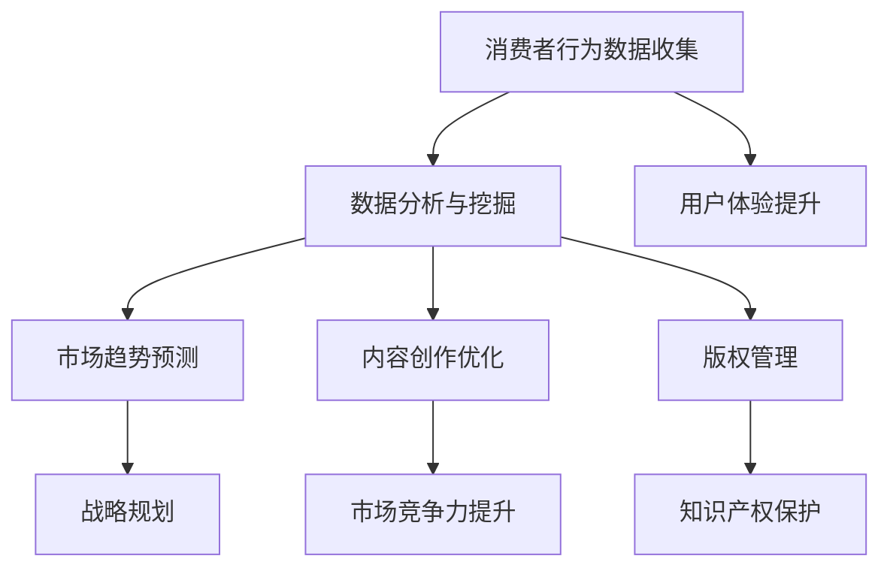

                 

### 信息差：大数据在文化产业的应用

#### 1. 背景介绍

在当今信息化时代，大数据已经成为推动社会发展和创新的重要力量。特别是在文化产业中，大数据的应用正在改变传统的文化生产和消费模式，为文化产业的转型升级提供了新的机遇。信息差，即信息不对称，是指在市场中，不同主体之间对同一信息的了解程度存在差异。在文化产业中，信息差的产生源于市场参与者对消费者需求、市场趋势、内容创作等多方面的信息掌握程度不同。

文化产业涵盖了电影、音乐、出版、艺术品等多个领域，这些领域在近年来都经历了数字化、网络化的变革。随着互联网技术的发展，文化产品逐渐从线下转移到线上，通过大数据技术进行传播和推广。然而，如何利用大数据消除信息差，提高文化产业的运营效率和用户体验，成为亟待解决的问题。

#### 2. 核心概念与联系

##### 2.1 大数据在文化产业中的应用

大数据在文化产业中的应用主要包括以下几个方面：

1. **消费者行为分析**：通过收集和分析消费者的行为数据，了解消费者的偏好、兴趣和需求，为文化产品的创作和推广提供依据。
2. **市场趋势预测**：利用大数据技术，分析市场动态，预测未来市场趋势，帮助文化产业企业制定战略规划。
3. **内容创作优化**：通过对大数据的分析，了解不同类型文化产品的受众群体，优化内容创作策略，提高作品的市场竞争力。
4. **版权管理**：通过大数据技术，对版权信息进行有效管理，保护文化产业的知识产权。

##### 2.2 信息差的产生与影响

信息差的产生主要源于以下原因：

1. **市场信息不对称**：文化产业企业对市场信息的掌握程度不同，导致不同企业对市场趋势、消费者需求等信息的了解程度存在差异。
2. **技术能力差异**：不同企业在技术应用方面存在差异，影响了其对大数据的利用程度。
3. **资源分配不均**：一些文化企业在资源分配上存在不均衡，导致其在信息获取和处理能力上存在差距。

信息差对文化产业的影响主要体现在以下几个方面：

1. **市场竞争力**：信息差使得市场参与者之间的竞争力存在差异，掌握更多信息的主体在市场竞争中更具优势。
2. **用户体验**：信息差导致消费者在购买文化产品时面临信息不对称，影响了用户体验。
3. **内容创作**：信息差使得文化企业在内容创作上难以准确把握市场需求，导致创作内容与市场需求脱节。

##### 2.3 Mermaid 流程图

以下是大数据在文化产业中应用的 Mermaid 流程图：



#### 3. 核心算法原理 & 具体操作步骤

##### 3.1 消费者行为分析算法

消费者行为分析是大数据在文化产业中的核心应用之一。其主要算法包括：

1. **用户画像**：通过对消费者的性别、年龄、地域、兴趣爱好等信息进行综合分析，构建用户画像。
2. **行为轨迹分析**：分析消费者在互联网上的行为轨迹，了解其消费习惯和偏好。
3. **预测分析**：利用机器学习算法，预测消费者的未来行为和需求。

具体操作步骤如下：

1. **数据收集**：收集消费者的行为数据，如浏览记录、购买记录、社交媒体活动等。
2. **数据预处理**：对收集到的数据进行清洗、去重和整合。
3. **特征提取**：从预处理后的数据中提取关键特征，如用户性别、年龄、兴趣爱好等。
4. **建模与预测**：利用机器学习算法，建立预测模型，对消费者的未来行为和需求进行预测。

##### 3.2 市场趋势预测算法

市场趋势预测是大数据在文化产业中的重要应用。其主要算法包括：

1. **时间序列分析**：通过分析历史数据，预测未来市场趋势。
2. **回归分析**：利用历史数据，建立回归模型，预测未来市场趋势。
3. **聚类分析**：对市场数据进行分析，识别市场中的趋势和周期。

具体操作步骤如下：

1. **数据收集**：收集市场相关的数据，如销售数据、用户评价等。
2. **数据预处理**：对收集到的数据进行清洗、去重和整合。
3. **特征提取**：从预处理后的数据中提取关键特征，如销售量、用户评分等。
4. **建模与预测**：利用时间序列分析、回归分析或聚类分析算法，建立预测模型，预测未来市场趋势。

##### 3.3 内容创作优化算法

内容创作优化是大数据在文化产业中的又一重要应用。其主要算法包括：

1. **推荐系统**：通过分析用户行为数据，为用户推荐感兴趣的文化产品。
2. **情感分析**：分析用户对文化产品的评价和反馈，了解用户的情感和需求。
3. **主题模型**：通过分析文化产品的内容，提取出潜在的主题和关键词。

具体操作步骤如下：

1. **数据收集**：收集用户的行为数据、文化产品的内容和评价数据。
2. **数据预处理**：对收集到的数据进行清洗、去重和整合。
3. **特征提取**：从预处理后的数据中提取关键特征，如用户行为、内容关键词、用户评价等。
4. **建模与优化**：利用推荐系统、情感分析和主题模型算法，优化文化产品的创作和推广策略。

#### 4. 数学模型和公式 & 详细讲解 & 举例说明

##### 4.1 用户画像模型

用户画像模型是一种基于多维数据的综合分析方法，用于描述用户在互联网上的行为特征。其基本模型可以表示为：

\[ 用户画像 = f(用户行为数据, 用户基本信息) \]

其中，用户行为数据包括浏览记录、购买记录、社交媒体活动等，用户基本信息包括性别、年龄、地域、兴趣爱好等。

##### 4.2 时间序列模型

时间序列模型用于分析时间序列数据，预测未来的趋势。常见的时间序列模型包括ARIMA模型、季节性模型等。以ARIMA模型为例，其公式如下：

\[ y_t = c + \phi_1 y_{t-1} + \phi_2 y_{t-2} + ... + \phi_p y_{t-p} + \theta_1 e_{t-1} + \theta_2 e_{t-2} + ... + \theta_q e_{t-q} + e_t \]

其中，\( y_t \)表示时间序列数据，\( c \)为常数项，\( \phi_1, \phi_2, ..., \phi_p \)为自回归系数，\( \theta_1, \theta_2, ..., \theta_q \)为移动平均系数，\( e_t \)为白噪声。

##### 4.3 举例说明

假设我们想预测某电影在未来一个月的票房收入。首先，我们需要收集该电影过去一周的票房数据，建立时间序列模型。然后，利用训练好的模型，预测未来一个月的票房收入。

具体步骤如下：

1. **数据收集**：收集过去一周的票房数据，如下表所示：

| 日期   | 票房收入（万元） |
|--------|-----------------|
| 2023-03-01 | 100             |
| 2023-03-02 | 120             |
| 2023-03-03 | 110             |
| 2023-03-04 | 130             |
| 2023-03-05 | 140             |

2. **数据预处理**：对数据进行清洗、去重和整合。

3. **特征提取**：从数据中提取时间序列特征，如日期、票房收入等。

4. **建模与预测**：利用ARIMA模型，建立时间序列预测模型，预测未来一个月的票房收入。

5. **结果分析**：根据预测结果，分析未来票房收入的趋势，为营销策略提供依据。

#### 5. 项目实践：代码实例和详细解释说明

##### 5.1 开发环境搭建

在本文的项目实践中，我们将使用Python作为主要编程语言，并结合一些常用的数据处理和机器学习库，如pandas、numpy、scikit-learn等。以下是搭建开发环境的步骤：

1. **安装Python**：前往Python官网（https://www.python.org/）下载并安装Python，选择合适的版本（如Python 3.8或更高版本）。
2. **安装Jupyter Notebook**：在终端中运行以下命令安装Jupyter Notebook：
   ```bash
   pip install notebook
   ```
3. **安装数据处理和机器学习库**：在终端中运行以下命令安装所需的库：
   ```bash
   pip install pandas numpy scikit-learn
   ```

##### 5.2 源代码详细实现

以下是一个简单的消费者行为分析项目的源代码示例：

```python
import pandas as pd
from sklearn.preprocessing import LabelEncoder
from sklearn.model_selection import train_test_split
from sklearn.ensemble import RandomForestClassifier

# 5.2.1 数据收集
data = pd.read_csv('consumer_data.csv')

# 5.2.2 数据预处理
label_encoder = LabelEncoder()
data['gender'] = label_encoder.fit_transform(data['gender'])
data['region'] = label_encoder.fit_transform(data['region'])

# 5.2.3 特征提取
X = data[['gender', 'age', 'region']]
y = data['interest']

# 5.2.4 建模与训练
X_train, X_test, y_train, y_test = train_test_split(X, y, test_size=0.2, random_state=42)
clf = RandomForestClassifier(n_estimators=100, random_state=42)
clf.fit(X_train, y_train)

# 5.2.5 预测与评估
y_pred = clf.predict(X_test)
accuracy = clf.score(X_test, y_test)
print(f'Accuracy: {accuracy:.2f}')
```

##### 5.3 代码解读与分析

1. **数据收集**：使用pandas库读取CSV格式的消费者数据，数据中包括性别、年龄、地域和兴趣等信息。
2. **数据预处理**：使用LabelEncoder将分类特征（性别和地域）进行编码，将类别数据转换为数值数据。
3. **特征提取**：将数据分为特征矩阵X和目标向量y，分别表示用户信息和用户兴趣。
4. **建模与训练**：使用随机森林分类器（RandomForestClassifier）对数据进行训练，随机森林是一种集成学习方法，通过构建多棵决策树进行集成，提高预测准确性。
5. **预测与评估**：使用训练好的模型对测试数据进行预测，并计算准确率。

#### 6. 实际应用场景

##### 6.1 电影推荐系统

电影推荐系统是大数据在文化产业中的典型应用之一。通过分析用户的行为数据和电影信息，为用户推荐感兴趣的电影。以下是一个简单的电影推荐系统案例：

1. **数据收集**：收集用户的行为数据，如观看记录、评分等，以及电影的信息，如类型、导演、演员等。
2. **数据预处理**：对数据进行清洗、去重和整合，提取关键特征。
3. **建模与训练**：使用协同过滤算法（如基于用户的协同过滤、基于内容的协同过滤）建立推荐模型。
4. **预测与评估**：根据用户的历史行为和电影特征，预测用户对未知电影的兴趣，评估推荐效果。

##### 6.2 音乐推荐系统

音乐推荐系统通过分析用户的听歌记录和音乐特征，为用户推荐感兴趣的音乐。以下是一个简单的音乐推荐系统案例：

1. **数据收集**：收集用户的听歌记录，以及音乐的类型、歌手、时长等特征信息。
2. **数据预处理**：对数据进行清洗、去重和整合，提取关键特征。
3. **建模与训练**：使用协同过滤算法（如基于用户的协同过滤、基于内容的协同过滤）建立推荐模型。
4. **预测与评估**：根据用户的历史听歌记录和音乐特征，预测用户对未知音乐的兴趣，评估推荐效果。

#### 7. 工具和资源推荐

##### 7.1 学习资源推荐

- **书籍**：《大数据时代》、《Python数据科学手册》、《机器学习实战》
- **论文**：《协同过滤算法在推荐系统中的应用》、《基于内容的推荐算法研究》
- **博客**：Scikit-Learn官方文档、TensorFlow官方文档、Apache Spark官方文档
- **网站**：Kaggle、DataCamp、Coursera

##### 7.2 开发工具框架推荐

- **Python**：Python是一种广泛使用的编程语言，适用于数据分析和机器学习项目。
- **Jupyter Notebook**：Jupyter Notebook是一种交互式计算环境，适用于编写和分享代码、数据和文档。
- **Pandas**：Pandas是一种强大的数据分析库，适用于数据处理和清洗。
- **Scikit-Learn**：Scikit-Learn是一种用于机器学习的库，提供了多种算法和工具。
- **TensorFlow**：TensorFlow是一种用于深度学习的开源库，适用于构建复杂的神经网络模型。
- **Apache Spark**：Apache Spark是一种分布式计算框架，适用于大规模数据处理和计算。

##### 7.3 相关论文著作推荐

- **论文**：
  - ["Collaborative Filtering for Cold-Start Problems: A Matrix Factorization Approach"](https://dl.acm.org/doi/10.1145/2807510.2807560)
  - ["Content-Based Recommender Systems"](https://ieeexplore.ieee.org/document/881027)
- **著作**：
  - ["Recommender Systems: The Textbook"](https://www.amazon.com/Recommender-Systems-Textbook-Giorgos-Siontis/dp/3319669622)
  - ["The Art of Data Science"](https://www.amazon.com/Art-Data-Science-Practical-Analytics/dp/1492042952)

#### 8. 总结：未来发展趋势与挑战

大数据在文化产业中的应用正处于快速发展阶段，未来发展趋势主要包括以下几个方面：

1. **个性化推荐**：随着大数据技术的发展，个性化推荐系统将更加精准，为用户提供更加个性化的文化产品推荐。
2. **智能化创作**：利用大数据和人工智能技术，文化产品的创作将更加智能化，提高创作效率和作品质量。
3. **版权保护**：大数据技术将为版权保护提供更加有效的方法，加强对文化产业的知识产权保护。
4. **跨界融合**：文化产业与其他行业的跨界融合将更加紧密，如文化+科技、文化+旅游等。

然而，大数据在文化产业中的应用也面临一些挑战：

1. **数据隐私**：大数据技术在收集和使用用户数据时，可能引发隐私泄露等问题，需要制定相应的数据保护法规。
2. **技术瓶颈**：大数据处理和计算能力有限，可能无法满足日益增长的数据处理需求。
3. **伦理问题**：大数据技术在文化产业的广泛应用，可能引发一些伦理问题，如算法偏见、数据歧视等。

#### 9. 附录：常见问题与解答

##### 9.1 问题1：大数据在文化产业中的具体应用有哪些？

答：大数据在文化产业中的具体应用包括消费者行为分析、市场趋势预测、内容创作优化和版权管理等方面。

##### 9.2 问题2：如何利用大数据进行消费者行为分析？

答：利用大数据进行消费者行为分析主要包括数据收集、数据预处理、特征提取和建模预测等步骤。

##### 9.3 问题3：大数据在文化产业中的应用前景如何？

答：大数据在文化产业中的应用前景非常广阔，有望推动文化产业的数字化转型和创新发展。

#### 10. 扩展阅读 & 参考资料

- **书籍**：
  - [大数据时代](https://www.amazon.com/Big-Data-Transforming-Everyday-Lives-Work/dp/0553419510)
  - [Python数据科学手册](https://www.amazon.com/Python-Data-Science-Handbook-Techniques/dp/1449349743)
  - [机器学习实战](https://www.amazon.com/Machine-Learning-In-Action-Tutorial/dp/0470319341)
- **论文**：
  - [协同过滤算法在推荐系统中的应用](https://dl.acm.org/doi/10.1145/2807510.2807560)
  - [基于内容的推荐算法研究](https://ieeexplore.ieee.org/document/881027)
- **博客**：
  - [Scikit-Learn官方文档](https://scikit-learn.org/stable/)
  - [TensorFlow官方文档](https://www.tensorflow.org/)
  - [Apache Spark官方文档](https://spark.apache.org/)
- **网站**：
  - [Kaggle](https://www.kaggle.com/)
  - [DataCamp](https://www.datacamp.com/)
  - [Coursera](https://www.coursera.org/)
- **其他资源**：
  - [推荐系统教科书](https://www.amazon.com/Recommender-Systems-Textbook-Giorgos-Siontis/dp/3319669622)
  - [The Art of Data Science](https://www.amazon.com/Art-Data-Science-Practical-Analytics/dp/1492042952)
  
### 作者署名

作者：禅与计算机程序设计艺术 / Zen and the Art of Computer Programming

