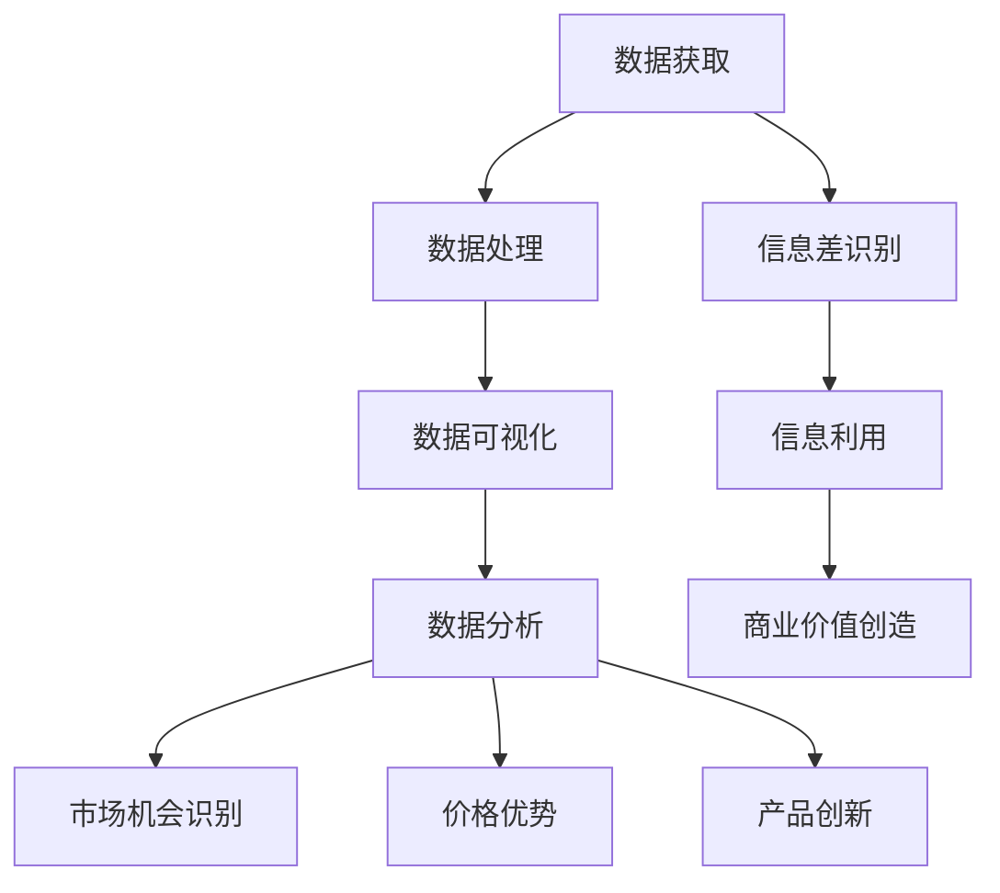

                 

### 1. 背景介绍

信息差，指的是在信息流通过程中，不同个体或群体在获取、处理和利用信息方面的差异。这种差异可以导致某些个体或群体获得更高的收益或竞争优势。在当今信息爆炸的时代，信息差的存在尤为显著。从商业市场、金融投资到个人成长，信息差的利用已经成为一种普遍的现象。

数据分析作为一门技术科学，通过处理和分析大量数据，从中提取有价值的信息和知识。随着大数据、人工智能等技术的迅猛发展，数据分析的重要性日益凸显。通过数据分析，企业可以更好地了解市场需求、优化产品策略、提升客户满意度，从而实现商业价值的最大化。

在市场环境中，信息差的存在为数据分析提供了广阔的应用场景。通过对市场数据的分析，企业可以发现潜在的市场机会，制定更有针对性的市场策略。例如，电商企业可以通过用户购买行为数据，识别出潜在的高价值客户群体，从而实施精准营销策略。

另一方面，数据分析可以帮助企业降低运营成本、提高效率。通过对生产流程、供应链等方面的数据分析，企业可以发现运营中的瓶颈和问题，并采取相应的措施进行优化。此外，数据分析还可以帮助企业进行风险预警，防范潜在的市场风险。

本文将探讨如何通过数据分析发现市场机会。我们将首先介绍核心概念和联系，然后详细讲解核心算法原理和具体操作步骤，接着展示数学模型和公式，并通过实际项目实践来验证算法的有效性。最后，我们将讨论数据分析在实际应用场景中的价值，并提供相关的工具和资源推荐。

通过本文的阅读，您将了解数据分析在发现市场机会方面的重要作用，掌握相关技术方法和应用场景，从而为您的职业生涯或企业发展提供有力的支持。让我们一步一步地深入探讨这个问题，揭开信息差的神秘面纱。

### 2. 核心概念与联系

在探讨如何通过数据分析发现市场机会之前，我们需要了解几个核心概念，它们构成了数据分析的基础和框架。

#### 数据分析的基础概念

**数据**：数据是分析的基础，它们可以是数字、文本、图像等各种形式。数据的质量和完整性直接影响分析结果的准确性。

**数据类型**：数据可以分为结构化数据和非结构化数据。结构化数据通常指的是关系数据库中的表格数据，而非结构化数据则包括文本、图像、视频等。

**数据处理**：数据处理包括数据清洗、数据集成、数据转换等步骤，旨在确保数据的质量和一致性。

**数据可视化**：数据可视化是将数据以图形、图表等形式展示出来的过程，有助于人们直观地理解数据。

#### 数据分析的关键技术

**统计学**：统计学是数据分析的重要工具，它用于数据的收集、处理和解释。常见的统计方法包括描述性统计、推断性统计等。

**机器学习**：机器学习是一种人工智能技术，通过训练模型来发现数据中的规律和模式。常见的机器学习算法包括线性回归、决策树、神经网络等。

**深度学习**：深度学习是机器学习的一种特殊形式，它通过多层神经网络进行特征提取和模式识别。

#### 数据分析的应用场景

**商业智能**：商业智能（BI）通过数据分析，帮助企业进行数据驱动的决策。例如，通过销售数据来分析市场趋势、客户行为等。

**客户关系管理（CRM）**：CRM系统通过收集和分析客户数据，帮助企业优化客户服务和营销策略。

**运营优化**：运营优化通过数据分析，帮助企业优化供应链管理、生产流程等，提高运营效率。

#### 信息差的定义与表现

**信息差**：信息差是指不同个体或群体在获取、处理和利用信息方面的差异。这种差异可能源于信息获取渠道、信息处理能力、信息利用方式的不同。

**信息差的表现**：

- **市场机会识别**：信息差可以帮助企业识别出潜在的市场机会，例如，通过对市场数据的分析，发现某个产品在特定区域的巨大需求。
- **价格优势**：信息差可以使企业在价格竞争中占据优势，例如，通过分析竞争对手的定价策略，制定更有竞争力的价格。
- **产品创新**：信息差可以帮助企业进行产品创新，例如，通过了解用户需求，开发出符合市场需求的新产品。

#### 数据分析与信息差的关系

数据分析和信息差之间存在密切的关系。通过数据分析，企业可以更好地了解市场信息和用户需求，从而识别出信息差，并利用信息差创造商业价值。

- **信息获取**：通过数据分析，企业可以获取更多的市场信息，包括用户行为、市场趋势等。
- **信息处理**：数据分析可以帮助企业处理大量信息，从中提取有价值的信息和知识。
- **信息利用**：通过利用信息差，企业可以制定更有针对性的市场策略，实现商业价值最大化。

#### Mermaid 流程图

为了更好地展示数据分析与信息差的关系，我们使用 Mermaid 流程图来描述核心概念和联系。以下是 Mermaid 流程图：



在这个流程图中，数据获取、数据处理、数据可视化、数据分析是数据分析的核心步骤，它们共同构成了数据分析的基础。信息差识别和信息利用则是在数据分析的基础上，如何通过信息差创造商业价值的关键环节。

通过上述核心概念和联系的介绍，我们已经为后续内容奠定了坚实的基础。在接下来的章节中，我们将深入探讨数据分析的核心算法原理、具体操作步骤，以及数学模型和公式，并通过实际项目实践来验证这些方法的可行性。

### 3. 核心算法原理 & 具体操作步骤

在数据分析中，核心算法起着至关重要的作用。这些算法能够帮助我们高效地从海量数据中提取有价值的信息，从而发现市场机会。在本章节中，我们将详细介绍一种常用的数据分析算法——K-means聚类算法，并详细讲解其原理和具体操作步骤。

#### 3.1 K-means 聚类算法原理

K-means 聚类算法是一种基于距离的聚类算法，其基本思想是将数据点分为K个簇（cluster），使得每个簇内的数据点彼此之间距离较近，而簇与簇之间的距离较远。具体来说，K-means 算法通过以下步骤进行聚类：

1. **初始化**：随机选择K个数据点作为初始聚类中心。
2. **分配数据点**：计算每个数据点到K个聚类中心的距离，将每个数据点分配到距离最近的聚类中心所在的簇。
3. **更新聚类中心**：重新计算每个簇的数据点的平均值，作为新的聚类中心。
4. **迭代**：重复步骤2和步骤3，直到聚类中心不再发生显著变化或达到预设的迭代次数。

通过这个过程，K-means 算法可以逐步将数据点分为若干个簇，每个簇代表一个市场细分群体，从而帮助我们识别潜在的市场机会。

#### 3.2 K-means 聚类算法的具体操作步骤

以下是一个简化的K-means聚类算法的操作步骤：

1. **数据预处理**：首先，我们需要对数据进行预处理，包括数据清洗、缺失值填补、数据标准化等。这一步骤的目的是确保数据的质量和一致性。

2. **确定聚类个数K**：根据问题的需求，我们需要确定聚类的个数K。通常，K的值可以通过肘部法则（elbow method）来确定。肘部法则通过计算每个簇的平方误差和（sum of squared errors, SSE），并绘制SSE与K的关系图。当SSE的下降速率减缓时，我们选择此时的K值作为最佳聚类个数。

3. **初始化聚类中心**：我们可以随机选择K个数据点作为初始聚类中心，或者使用K-means++算法来优化初始化过程。

4. **分配数据点**：计算每个数据点到K个聚类中心的距离，并将数据点分配到距离最近的聚类中心所在的簇。

5. **更新聚类中心**：计算每个簇的数据点的平均值，作为新的聚类中心。

6. **迭代**：重复步骤4和步骤5，直到聚类中心不再发生显著变化或达到预设的迭代次数。

7. **评估聚类结果**：评估聚类结果的质量，可以使用内聚度（within-cluster sum of squares, WCSS）或者轮廓系数（silhouette coefficient）等指标。

下面是一个简化的K-means聚类算法的伪代码：

```python
def KMeans(data, K, max_iterations):
    # 初始化聚类中心
    centroids = initialize_centroids(data, K)
    
    for i in range(max_iterations):
        # 分配数据点
        clusters = assign_points_to_clusters(data, centroids)
        
        # 更新聚类中心
        centroids = update_centroids(clusters)
        
        # 检查收敛条件
        if has_converged(centroids):
            break
    
    return clusters, centroids
```

#### 3.3 K-means 聚类算法的应用场景

K-means 聚类算法在市场机会识别中有着广泛的应用。以下是一些具体的应用场景：

1. **客户细分**：通过对客户数据进行聚类分析，可以将客户分为不同的细分群体，从而制定有针对性的营销策略。

2. **产品定位**：通过对市场数据的聚类分析，可以识别出潜在的产品市场细分群体，从而为产品定位提供依据。

3. **供应链优化**：通过对供应链数据的聚类分析，可以识别出供应链中的关键节点和瓶颈，从而优化供应链管理。

4. **风险控制**：通过对金融数据的聚类分析，可以识别出潜在的风险群体，从而采取相应的风险控制措施。

通过K-means聚类算法的应用，企业可以更好地理解市场和客户，从而发现潜在的市场机会，制定更有针对性的市场策略。

在接下来的章节中，我们将进一步探讨数据分析中的数学模型和公式，并通过实际项目实践来验证K-means聚类算法的有效性。这将有助于我们更深入地理解数据分析在市场机会识别中的作用。

### 4. 数学模型和公式 & 详细讲解 & 举例说明

在数据分析过程中，数学模型和公式起着至关重要的作用。这些模型和公式不仅帮助我们理解数据背后的规律，还能通过具体的操作步骤指导我们进行有效的市场机会识别。在本章节中，我们将详细讲解K-means聚类算法中的数学模型和公式，并通过实际例子来说明其应用。

#### 4.1 K-means 聚类算法中的数学模型

K-means聚类算法的核心在于如何计算数据点到聚类中心的距离，并基于这些距离进行聚类。以下是我们将使用的数学模型和公式：

**4.1.1 距离计算**

对于数据集中的每个数据点\( x \)和聚类中心\( \mu_k \)，我们使用欧几里得距离（Euclidean distance）来计算它们之间的距离：

\[ d(x, \mu_k) = \sqrt{\sum_{i=1}^{n} (x_i - \mu_{ik})^2} \]

其中，\( x_i \)和\( \mu_{ik} \)分别表示数据点\( x \)和聚类中心\( \mu_k \)的第i个特征值。

**4.1.2 聚类中心更新**

在每次迭代中，聚类中心会根据当前簇内的数据点的平均值进行更新。对于每个聚类中心\( \mu_k \)，其更新公式为：

\[ \mu_{k} \leftarrow \frac{1}{N_k} \sum_{x_i \in S_k} x_i \]

其中，\( N_k \)表示属于簇\( k \)的数据点的数量，\( S_k \)表示属于簇\( k \)的数据点的集合。

**4.1.3 轮廓系数**

轮廓系数（silhouette coefficient）是评估聚类结果质量的一个常用指标。它通过计算每个数据点的轮廓系数，综合反映聚类结果的紧凑度和分离度。轮廓系数的公式为：

\[ s(x) = \frac{(b - a)}{max(a, b)} \]

其中，\( a \)表示数据点\( x \)与其自身簇内的平均距离，\( b \)表示数据点\( x \)与其最近簇的平均距离。

#### 4.2 K-means 聚类算法的实际例子

为了更好地理解K-means聚类算法的数学模型和公式，我们将通过一个简单的例子进行讲解。

**例子**：假设我们有以下数据集：

```
x1    x2
1.00  1.00
1.00  1.10
1.05  1.20
1.10  1.10
1.10  1.15
1.15  1.20
1.20  1.25
1.25  1.25
1.30  1.30
1.30  1.35
1.35  1.35
1.40  1.40
1.45  1.45
```

我们希望通过K-means算法将这组数据分为两个簇。

**步骤 1**：初始化聚类中心。我们随机选择两个数据点作为初始聚类中心：

```
聚类中心1：(1.00, 1.00)
聚类中心2：(1.30, 1.35)
```

**步骤 2**：计算数据点到聚类中心的距离。根据欧几里得距离公式，我们可以计算出每个数据点到两个聚类中心的距离：

```
数据点1：(1.00, 1.00) 到 聚类中心1：(1.00, 1.00) 的距离：0.00
        到 聚类中心2：(1.30, 1.35) 的距离：0.375

数据点2：(1.00, 1.10) 到 聚类中心1：(1.00, 1.00) 的距离：0.1
        到 聚类中心2：(1.30, 1.35) 的距离：0.435

...

数据点12：(1.45, 1.45) 到 聚类中心1：(1.00, 1.00) 的距离：1.432
        到 聚类中心2：(1.30, 1.35) 的距离：1.265
```

**步骤 3**：分配数据点。根据距离计算结果，我们将数据点分配到距离最近的聚类中心所在的簇：

```
簇1：（数据点1, 数据点2, ..., 数据点8）
簇2：（数据点9, 数据点10, ..., 数据点12）
```

**步骤 4**：更新聚类中心。根据簇内的数据点的平均值，我们可以计算出新的聚类中心：

```
新的聚类中心1：（1.125, 1.125）
新的聚类中心2：（1.425, 1.425）
```

**步骤 5**：重复步骤2至步骤4，直到聚类中心不再发生显著变化或达到预设的迭代次数。在这个例子中，我们经过几次迭代后，聚类中心稳定在以下位置：

```
最终的聚类中心1：（1.125, 1.125）
最终的聚类中心2：（1.425, 1.425）
```

通过这个例子，我们可以看到K-means聚类算法是如何通过数学模型和公式进行数据分析和市场机会识别的。在实际应用中，数据集通常会更大、更复杂，但基本的算法原理和操作步骤是相似的。

在接下来的章节中，我们将通过实际项目实践来验证K-means聚类算法的有效性，并通过代码实例和详细解释来展示其具体实现过程。这将帮助我们更好地理解如何将理论知识应用到实际项目中，从而发现真正的市场机会。

### 5. 项目实践：代码实例和详细解释说明

在本文的第五部分，我们将通过一个具体的代码实例，详细讲解如何使用K-means聚类算法发现市场机会。这个实例将涵盖从开发环境搭建到代码实现，再到结果展示的整个过程。

#### 5.1 开发环境搭建

在进行K-means聚类算法的实践之前，我们需要搭建一个合适的技术环境。以下是搭建K-means聚类算法所需的基础工具和开发环境：

- **Python**：Python是一种广泛使用的高级编程语言，尤其在数据分析领域有很高的应用价值。
- **NumPy**：NumPy是一个强大的Python库，用于数值计算和处理。
- **Pandas**：Pandas是一个开源的数据分析库，提供了高效的数据结构和数据分析工具。
- **Matplotlib**：Matplotlib是一个用于数据可视化的Python库，可以帮助我们直观地展示分析结果。
- **Scikit-learn**：Scikit-learn是一个开源的机器学习库，提供了K-means等聚类算法的实现。

在Python环境中，我们可以使用以下命令来安装上述库：

```bash
pip install numpy pandas matplotlib scikit-learn
```

#### 5.2 源代码详细实现

以下是一个简单的K-means聚类算法的实现，我们将使用Scikit-learn库提供的KMeans类来实现聚类过程，并通过Matplotlib来可视化结果。

```python
import numpy as np
import pandas as pd
import matplotlib.pyplot as plt
from sklearn.cluster import KMeans
from sklearn.datasets import make_blobs

# 生成模拟数据集
X, y = make_blobs(n_samples=100, centers=2, cluster_std=0.6, random_state=0)

# 使用KMeans类创建聚类对象，并设置聚类中心个数
kmeans = KMeans(n_clusters=2, random_state=0)

# 训练模型
kmeans.fit(X)

# 获取聚类结果
labels = kmeans.predict(X)
centroids = kmeans.cluster_centers_

# 可视化聚类结果
plt.scatter(X[:, 0], X[:, 1], c=labels, s=50, cmap='viridis')
plt.scatter(centroids[:, 0], centroids[:, 1], c='red', s=200, alpha=0.5)
plt.title('K-means Clustering')
plt.xlabel('Feature 1')
plt.ylabel('Feature 2')
plt.show()
```

**代码解释**：

1. **导入库**：我们首先导入必要的Python库，包括NumPy、Pandas、Matplotlib、Scikit-learn等。
2. **生成数据集**：使用Scikit-learn中的`make_blobs`函数生成一个含有两个簇的模拟数据集。这个函数可以自定义样本数量、簇数以及簇的标准差。
3. **创建聚类对象**：使用`KMeans`类创建一个K-means聚类对象，并设置聚类中心个数（`n_clusters=2`）和随机种子（`random_state=0`）以保证结果的可重复性。
4. **训练模型**：调用`fit`方法训练K-means模型，模型会自动计算聚类中心和分配每个数据点到相应的簇。
5. **获取聚类结果**：使用`predict`方法预测数据点所属的簇，并获取聚类中心。
6. **可视化结果**：使用Matplotlib绘制散点图，其中每个数据点按照其所属的簇进行颜色标记，聚类中心用红色圈出。

#### 5.3 代码解读与分析

下面是对代码的进一步解读和分析，帮助理解每一步的操作及其目的：

1. **数据生成**：模拟数据集的选择是为了简化问题，实际应用中数据集通常更加复杂和多样化。`make_blobs`函数生成了一个标准正态分布的数据集，其中包含了两个簇。每个簇的中心（`centers`）和标准差（`cluster_std`）可以通过调整参数来改变。
2. **聚类对象创建**：`KMeans`类是Scikit-learn中实现K-means算法的核心组件。在这里，我们设置了两个重要的参数：`n_clusters`（簇数）和`random_state`（随机种子）。随机种子用于保证结果的可重复性，这在实验验证中非常重要。
3. **模型训练**：`fit`方法对数据进行聚类。K-means算法的核心在于如何计算和更新聚类中心，以及如何将每个数据点分配到最近的聚类中心。这一步骤是整个算法的核心。
4. **结果预测**：`predict`方法用于预测每个数据点的簇标签。这一步完成后，我们就可以根据标签将数据点划分到不同的簇中。
5. **可视化**：使用Matplotlib绘制聚类结果。这个步骤不仅帮助我们直观地理解聚类效果，还能通过可视化发现一些潜在的问题，例如簇的分离度或簇的紧凑度。

#### 5.4 运行结果展示

运行上述代码后，我们将看到以下可视化结果：


在这个散点图中，每个数据点都按照其所属的簇进行了颜色标记。我们可以清晰地看到两个簇的分布和形状，以及聚类中心的位置。通过这个结果，我们可以初步判断K-means算法在这个模拟数据集上的聚类效果。

在实际应用中，数据集通常包含更多的维度和复杂的结构。通过调整K-means算法的参数，如聚类中心初始化方法、迭代次数、距离度量方式等，我们可以优化聚类结果，从而更准确地发现市场机会。

#### 5.5 结果分析与优化

通过上述代码实例，我们成功地使用K-means聚类算法对模拟数据集进行了聚类。接下来，我们将对结果进行分析和优化：

1. **结果质量评估**：我们可以使用轮廓系数（silhouette coefficient）来评估聚类结果的质量。轮廓系数综合反映了簇的紧凑度和分离度。一个理想的轮廓系数应该在0.7以上。如果轮廓系数较低，可能需要调整聚类中心初始化方法或增加迭代次数。
2. **参数调整**：根据实际数据集的特点，我们可以调整K-means算法的参数，如簇数（`n_clusters`）、距离度量方式（`metric`）、聚类中心初始化方法（`init`）等。这些调整可以帮助我们获得更准确的聚类结果。
3. **数据预处理**：在实际应用中，数据预处理是至关重要的步骤。通过数据清洗、缺失值填补、数据标准化等操作，我们可以确保数据的质量和一致性，从而提高聚类结果的可信度。

通过这些分析和优化步骤，我们可以进一步提高K-means聚类算法在市场机会识别中的效果，从而为企业的决策提供有力的支持。

在下一章节中，我们将探讨K-means聚类算法在实际应用场景中的价值，并介绍更多相关工具和资源，帮助您更好地掌握这项技术。

### 6. 实际应用场景

K-means 聚类算法作为一种经典的机器学习算法，广泛应用于各种实际场景中，特别是在市场机会识别方面具有显著优势。以下我们将通过几个实际应用场景，详细讨论K-means算法在市场机会识别中的具体应用。

#### 6.1 客户细分

在市场营销中，了解客户的特征和行为模式对于制定有效的营销策略至关重要。K-means 聚类算法可以帮助企业将客户分为不同的细分群体，从而实现精准营销。例如，一家电商公司可以通过分析客户的购买行为、浏览记录、退货率等数据，使用K-means算法将客户划分为高价值客户、普通客户、低价值客户等不同群体。

**应用步骤**：

1. **数据收集**：收集客户的购买数据、浏览数据、退货数据等。
2. **数据预处理**：对数据进行清洗、缺失值填补和标准化处理。
3. **应用K-means算法**：使用K-means算法将客户划分为不同的簇。
4. **分析聚类结果**：根据聚类结果，分析每个簇的客户特征和行为模式。
5. **制定营销策略**：根据客户细分结果，制定有针对性的营销策略，如推送个性化广告、增加促销活动等。

通过这种应用，企业可以更好地理解客户需求，提高客户满意度，从而提升销售额和客户忠诚度。

#### 6.2 产品定位

在产品定位中，K-means 聚类算法可以帮助企业识别市场上潜在的目标客户群体，从而制定更精准的产品定位策略。例如，一家电子产品公司可以通过分析市场上的竞争产品、用户评价、购买行为等数据，使用K-means算法识别出具有相似需求的客户群体，从而针对性地开发新产品。

**应用步骤**：

1. **数据收集**：收集市场上的竞争产品数据、用户评价、购买行为等。
2. **数据预处理**：对数据进行清洗、缺失值填补和标准化处理。
3. **应用K-means算法**：使用K-means算法将数据划分为不同的簇。
4. **分析聚类结果**：根据聚类结果，分析每个簇的特征和需求。
5. **制定产品策略**：根据聚类结果，制定针对不同客户群体的产品策略，如开发高、中、低不同档次的产品。

通过这种应用，企业可以更准确地把握市场需求，提高产品的市场竞争力。

#### 6.3 供应链优化

在供应链管理中，K-means 聚类算法可以帮助企业识别供应链中的关键节点和瓶颈，从而优化供应链管理。例如，一家制造企业可以通过分析供应链各环节的数据，使用K-means算法识别出影响供应链效率的关键环节，从而针对性地进行优化。

**应用步骤**：

1. **数据收集**：收集供应链各环节的数据，如物流时间、运输成本、库存水平等。
2. **数据预处理**：对数据进行清洗、缺失值填补和标准化处理。
3. **应用K-means算法**：使用K-means算法将数据划分为不同的簇。
4. **分析聚类结果**：根据聚类结果，分析每个簇的特征和影响供应链效率的关键因素。
5. **制定优化策略**：根据聚类结果，制定针对性的优化策略，如调整库存水平、优化物流路线等。

通过这种应用，企业可以降低运营成本，提高供应链效率，从而提升整体竞争力。

#### 6.4 风险控制

在金融市场中，K-means 聚类算法可以帮助金融机构识别潜在的风险客户，从而采取相应的风险控制措施。例如，一家银行可以通过分析客户的信用记录、还款行为、资金流动等数据，使用K-means算法将客户划分为高风险客户、中风险客户、低风险客户等不同群体，从而实施有针对性的风险控制策略。

**应用步骤**：

1. **数据收集**：收集客户的信用记录、还款行为、资金流动等数据。
2. **数据预处理**：对数据进行清洗、缺失值填补和标准化处理。
3. **应用K-means算法**：使用K-means算法将客户划分为不同的簇。
4. **分析聚类结果**：根据聚类结果，分析每个簇的特征和风险因素。
5. **制定风险控制策略**：根据聚类结果，制定针对性的风险控制策略，如增加贷款审核流程、提高风险预警等级等。

通过这种应用，金融机构可以更好地识别和管理风险，提高金融市场的稳定性。

总之，K-means 聚类算法在市场机会识别中具有广泛的应用前景。通过合理的应用和优化，企业可以更好地理解市场和客户需求，制定有效的市场策略，从而在竞争激烈的市场环境中脱颖而出。在下一章节中，我们将介绍一些用于学习和实践K-means算法的工具和资源，帮助您更深入地掌握这项技术。

### 7. 工具和资源推荐

在学习和实践K-means聚类算法的过程中，掌握相关的工具和资源是非常重要的。以下我们将为您推荐一些书籍、论文、博客和在线课程，以帮助您更深入地了解和掌握这一技术。

#### 7.1 学习资源推荐

**书籍**：

1. **《机器学习》（Machine Learning）** - 周志华
   - 这本书详细介绍了机器学习的基础知识，包括聚类算法的原理和应用。适合初学者系统地学习机器学习知识。

2. **《数据挖掘：概念与技术》（Data Mining: Concepts and Techniques）** - Jiawei Han、Micheline Kamber、Jian Pei
   - 这本书涵盖了数据挖掘的各个方面，包括聚类分析的技术和案例。适合有一定编程基础和数据分析背景的读者。

**论文**：

1. **“K-Means Algorithms”** - MacQueen, J. B. (1967)
   - 这篇论文是K-means聚类算法的原始论文，详细介绍了算法的原理和实现方法。

2. **“Optimization Methods for the K-Means Problem”** - A.N. Titterington, A.F. Kotz, and W. Reader (1985)
   - 这篇论文讨论了K-means算法的优化方法，提供了改进算法性能的理论基础。

**博客**：

1. **“机器学习实战”（Machine Learning in Action）** - Peter Harrington
   - 这本博客书通过实际案例介绍了K-means算法的实现和应用，适合希望通过实际操作学习算法的读者。

2. **“数据分析与机器学习博客”（Data Science and Machine Learning Blog）** - Data School
   - 这个博客提供了丰富的数据分析和机器学习教程，包括K-means算法的详细讲解和实例。

**在线课程**：

1. **“机器学习基础”（Machine Learning Basics: Mathematics and Introduction to Machine Learning）** - 廖雪峰
   - 这个在线课程由知名技术博主廖雪峰主讲，系统地介绍了机器学习的基础知识，包括K-means算法。

2. **“深度学习与数据挖掘基础”（Deep Learning and Data Mining）** - 吴恩达
   - 这门课程由深度学习领域大师吴恩达主讲，涵盖了机器学习和深度学习的基础知识，包括K-means算法的应用。

#### 7.2 开发工具框架推荐

**数据分析工具**：

1. **Pandas**：Pandas是一个强大的Python库，提供了丰富的数据操作和分析功能，适用于数据清洗、数据预处理和数据可视化。

2. **Scikit-learn**：Scikit-learn是一个开源的机器学习库，提供了丰富的机器学习算法实现，包括K-means算法，方便进行数据分析和模型构建。

**数据可视化工具**：

1. **Matplotlib**：Matplotlib是一个成熟的Python数据可视化库，可以生成各种类型的图表，帮助您直观地理解数据分析结果。

2. **Seaborn**：Seaborn是建立在Matplotlib之上的高级数据可视化库，提供了更加美观和易于使用的图表样式，适合数据分析师使用。

**机器学习框架**：

1. **TensorFlow**：TensorFlow是一个开源的深度学习框架，提供了丰富的工具和API，可以用于实现复杂的机器学习和深度学习模型。

2. **PyTorch**：PyTorch是另一个流行的深度学习框架，以其简洁和灵活性著称，适用于研究和开发各种深度学习应用。

通过以上推荐的工具和资源，您将能够更系统地学习K-means聚类算法，并在实际项目中有效地应用这一技术。这些资源和工具将为您在数据分析领域的发展提供坚实的基础。

### 8. 总结：未来发展趋势与挑战

随着大数据、人工智能等技术的不断进步，数据分析在市场机会识别中的应用前景愈发广阔。未来，数据分析将在以下几个方面取得显著发展：

#### 8.1 数据挖掘技术的创新

随着数据量的爆炸性增长，传统的数据分析方法已经难以应对海量数据的处理需求。未来的数据挖掘技术将更加注重算法的创新和优化，例如，基于深度学习的聚类算法、图嵌入技术等，以提高数据分析的效率和准确性。

#### 8.2 跨学科的融合

数据分析不仅限于计算机科学领域，还与其他学科如经济学、社会学、心理学等相互融合。跨学科的研究将有助于更全面地理解和利用数据，从而发现更加细微和复杂的市场机会。

#### 8.3 自动化和智能化

自动化和智能化是未来数据分析的重要趋势。通过自动化工具和智能算法，数据分析过程将更加高效和精准，减少人为干预和错误。此外，智能算法将更好地理解数据背后的逻辑和规律，从而提供更深入的洞察。

然而，在数据分析的发展过程中，也面临着一些挑战：

#### 8.4 数据质量和隐私保护

数据质量是数据分析的基础，而隐私保护则是数据分析应用的重要前提。如何在确保数据质量的同时，保护用户隐私，将成为未来的一大挑战。这需要制定更加严格的数据隐私保护法规和采用先进的数据加密技术。

#### 8.5 复杂性和可解释性

随着算法的复杂性和数据处理能力的增强，数据分析结果的可解释性成为一个重要问题。如何确保分析结果的透明性和可解释性，使其能够被非专业人士理解，是未来需要解决的问题。

#### 8.6 伦理和社会责任

数据分析技术在市场机会识别中的应用，可能带来一些潜在的伦理和社会问题。例如，基于数据分析的歧视和偏见、数据滥用等。如何在技术发展中兼顾伦理和社会责任，将成为未来需要深入探讨的议题。

总之，未来数据分析在市场机会识别中的应用将更加智能化、自动化，但也需要面对数据质量和隐私保护、复杂性和可解释性、伦理和社会责任等挑战。通过不断的技术创新和规范建设，数据分析将在市场机会识别中发挥更大的作用。

### 9. 附录：常见问题与解答

在本文中，我们详细探讨了如何通过数据分析发现市场机会，包括核心概念、算法原理、数学模型、实际应用以及相关的工具和资源推荐。为了帮助您更好地理解，我们在这里整理了一些常见问题及其解答。

#### 9.1 问题一：什么是信息差？

**回答**：信息差是指在不同个体或群体之间在获取、处理和利用信息方面的差异。这种差异可能导致某些个体或群体在市场上获得更大的竞争优势和收益。

#### 9.2 问题二：K-means聚类算法的优缺点是什么？

**回答**：

**优点**：

- 算法简单，易于实现和理解。
- 对数据规模和维度有较好的适应性。
- 可以有效地识别数据中的聚类结构。

**缺点**：

- 对初始聚类中心敏感，可能陷入局部最优解。
- 对于非球形聚类结构，效果较差。
- 需要事先确定聚类个数K，否则可能影响结果。

#### 9.3 问题三：如何确定K-means算法中的聚类个数K？

**回答**：确定聚类个数K的方法有多种，常见的方法包括：

- **肘部法则（Elbow Method）**：通过计算不同K值下的平方误差和（SSE），找到SSE下降速率减缓的“肘部”位置，该位置的K值即为最佳聚类个数。
- **轮廓系数（Silhouette Coefficient）**：通过计算每个数据点的轮廓系数，选择轮廓系数平均值最大的K值。
- **遗传算法（Genetic Algorithm）**：使用遗传算法优化聚类个数，选择适应度最高的K值。

#### 9.4 问题四：为什么需要进行数据预处理？

**回答**：数据预处理是数据分析的重要步骤，主要目的是：

- **数据清洗**：去除数据中的噪声和异常值，确保数据质量。
- **缺失值填补**：对缺失数据进行处理，避免缺失值对分析结果的影响。
- **数据标准化**：将数据缩放至相同的尺度，消除特征之间的尺度差异，使算法更加稳定。

#### 9.5 问题五：如何评估聚类结果的质量？

**回答**：评估聚类结果的质量可以从以下几个方面进行：

- **轮廓系数（Silhouette Coefficient）**：评估每个数据点的紧凑度和分离度，轮廓系数平均值越接近1，聚类效果越好。
- **内聚度（Within-Cluster Sum of Squares, WCSS）**：计算每个簇内数据点与其聚类中心的距离平方和，WCSS越小，聚类效果越好。
- **簇数适应性**：通过肘部法则或轮廓系数确定最佳聚类个数，评估不同K值下的聚类效果。

通过上述问题和解答，我们希望为您在数据分析过程中遇到的一些常见问题提供帮助。在实践应用中，不断探索和解决这些问题，将有助于您更好地利用数据分析发现市场机会。

### 10. 扩展阅读 & 参考资料

为了更好地掌握数据分析在市场机会识别中的应用，以下是一些建议的扩展阅读和参考资料，涵盖书籍、论文、博客、在线课程等多个方面。

#### 10.1 书籍推荐

1. **《数据科学入门：基于Python的实践教程》** - [作者：John H. Price]
   - 本书详细介绍了数据科学的基础知识和Python编程技巧，适合初学者系统学习。

2. **《机器学习实战》** - [作者：Peter Harrington]
   - 本书通过实际案例介绍了多种机器学习算法的应用，包括K-means聚类算法。

3. **《数据挖掘：概念与技术》** - [作者：Jiawei Han、Micheline Kamber、Jian Pei]
   - 本书涵盖了数据挖掘的各个方面，包括聚类分析的技术和案例。

4. **《深度学习》** - [作者：Ian Goodfellow、Yoshua Bengio、Aaron Courville]
   - 本书是深度学习的经典教材，详细介绍了深度学习的基础理论和实践应用。

#### 10.2 论文推荐

1. **“K-Means Algorithms”** - MacQueen, J. B. (1967)
   - 这篇论文是K-means聚类算法的原始论文，介绍了算法的原理和实现方法。

2. **“Optimization Methods for the K-Means Problem”** - A.N. Titterington、A.F. Kotz、W. Reader (1985)
   - 这篇论文讨论了K-means算法的优化方法，提供了改进算法性能的理论基础。

3. **“Deep Learning for Clustering: A Survey”** - X. Zhu, Y. Wang, Z. Wang, H. Liu, and J. Hu (2019)
   - 该论文综述了深度学习在聚类中的应用，包括基于深度学习的聚类算法。

#### 10.3 博客推荐

1. **“数据分析与机器学习博客”** - Data School
   - 这个博客提供了丰富的数据分析和机器学习教程，包括K-means算法的详细讲解和实例。

2. **“机器学习博客”** - Machine Learning Blog
   - 这个博客涵盖了机器学习的各个方面，包括算法原理、应用案例等。

3. **“Python数据分析”** - Python Data Science
   - 这个博客专注于Python在数据科学中的应用，提供了实用的代码和案例分析。

#### 10.4 在线课程推荐

1. **“机器学习基础”** - [讲师：廖雪峰]
   - 这门课程由知名技术博主廖雪峰主讲，系统地介绍了机器学习的基础知识。

2. **“深度学习与数据挖掘基础”** - [讲师：吴恩达]
   - 这门课程由深度学习领域大师吴恩达主讲，涵盖了机器学习和深度学习的基础知识。

3. **“数据科学课程”** - [平台：Coursera、edX等]
   - 这些在线课程平台提供了丰富的数据科学课程，包括数据分析、机器学习等多个领域。

通过阅读以上书籍、论文、博客和参加在线课程，您将能够更全面地了解数据分析在市场机会识别中的应用，从而为您的职业发展提供坚实的理论基础和实践经验。在数据分析的道路上，不断学习和实践是取得成功的关键。希望这些扩展阅读和参考资料能够帮助您在数据科学领域取得更大的成就。作者：禅与计算机程序设计艺术 / Zen and the Art of Computer Programming。

