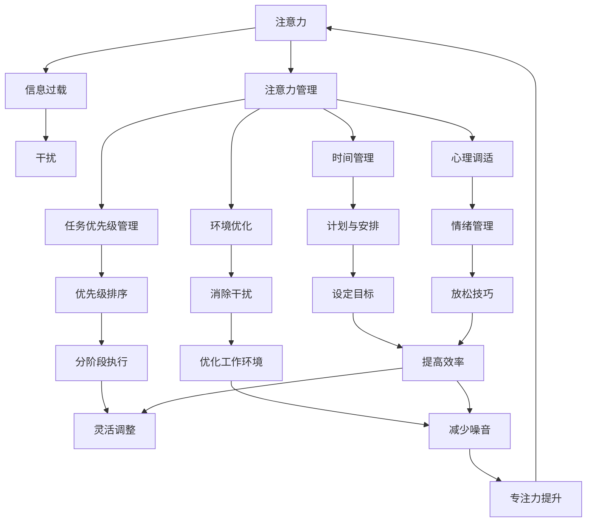

                 

### 背景介绍

在当今信息化社会，信息爆炸与技术的飞速发展，使得我们的日常生活和工作环境变得越来越复杂。网络、社交媒体、电子邮件等各种渠道的信息不断涌入，使得人们难以集中注意力。这种信息过载和干扰现象，不仅影响了工作效率，还对人们的心理健康造成了负面影响。因此，如何管理注意力，在干扰和信息过载的环境中保持专注，成为了一个重要且紧迫的问题。

注意力是人类认知活动中最宝贵的资源之一。在信息处理过程中，注意力决定了我们能否有效地从大量信息中筛选出重要的内容，并对其进行深入的处理和分析。然而，随着信息量的不断增加，注意力的分散和干扰现象也日益严重。例如，在办公环境中，频繁的电子邮件、短信和即时通讯工具的提醒，以及社交媒体的推送，都会极大地分散我们的注意力，导致工作效率下降。在个人生活中，智能手机的普及也使得人们更容易被各种应用和通知所干扰，无法专注于阅读、学习或其他活动。

除了外在的干扰，内在的心理因素也会影响我们的注意力管理。例如，焦虑、压力和疲劳等情绪状态，都会使我们的注意力难以集中。此外，对某些任务的抗拒或不喜欢，也可能导致我们在执行任务时无法保持专注。

因此，了解注意力管理的基本原理，掌握有效的注意力管理策略，对于提高工作效率、改善生活质量具有重要意义。本文将首先介绍注意力管理的基本概念，包括注意力的定义、重要性以及影响注意力的主要因素。随后，我们将深入探讨注意力管理的关键技术和策略，包括时间管理、任务优先级管理、环境优化、心理调适等。此外，还将结合实际案例，展示如何在不同场景下应用注意力管理技术。最后，我们将对注意力管理的未来发展趋势和挑战进行展望，并探讨可能的解决方案。

通过本文的阅读，读者将能够系统地了解注意力管理的重要性，掌握多种有效的注意力管理策略，从而在信息过载和干扰中保持高效专注。让我们一步一步地深入探讨这一重要而复杂的话题。

### 核心概念与联系

在探讨注意力管理的核心概念与联系之前，我们首先需要明确几个关键术语的定义，以便于我们后续的讨论。

#### 注意力（Attention）

注意力是一种认知资源，用于选择性地处理信息。它涉及大脑的多个区域，包括前额叶皮层、顶叶和颞叶等。注意力的核心功能是筛选信息，使得我们能够关注重要的信息而忽略无关的干扰。

#### 信息过载（Information Overload）

信息过载指的是在某一时刻，接收到的信息量超过了我们的处理能力。这种情况下，我们难以有效地筛选和利用信息，导致工作效率下降，甚至产生焦虑和压力。

#### 干扰（Distraction）

干扰是指那些分散我们注意力、阻碍任务完成的因素。这些因素可能来自外部环境，如噪音、电子邮件提醒等，也可能来自内部心理因素，如焦虑、疲劳等。

#### 注意力管理（Attention Management）

注意力管理是指一系列策略和技术，用于提高注意力的集中度和效率，从而在信息过载和干扰的环境中保持专注。

接下来，我们将通过一个Mermaid流程图来展示注意力管理中各核心概念和要素之间的联系。



#### Mermaid 流程图解释

1. **注意力（A）**：作为核心，连接到信息过载（B）和干扰（C），表示注意力受这两个因素影响。
2. **注意力管理（D）**：作为解决方案，连接到多个子概念，包括时间管理（E）、任务优先级管理（F）、环境优化（G）和心理调适（H）。
3. **时间管理（E）**：包括计划与安排（I），通过设定目标和分阶段执行（M和N）来提高注意力。
4. **任务优先级管理（F）**：通过优先级排序（J）来确保重要任务首先得到处理。
5. **环境优化（G）**：通过消除干扰（K）和优化工作环境（O）来提升注意力。
6. **心理调适（H）**：通过情绪管理（L）和放松技巧（P）来减轻压力，提高注意力。

这个流程图清晰地展示了注意力管理的各个组成部分及其相互关系。通过这些核心概念和联系的理解，我们将能够更好地设计和实施有效的注意力管理策略，以应对现代生活中的各种干扰和信息过载。

### 核心算法原理 & 具体操作步骤

在理解了注意力管理的基本概念和联系之后，我们需要进一步探讨核心算法原理及其具体操作步骤，以便在实际应用中有效地管理注意力。

#### 时间管理算法

时间管理是注意力管理中的一个重要环节，其核心算法包括任务排序、时间分配和提醒设置等。以下是具体操作步骤：

1. **任务排序**：首先，根据任务的紧急程度和重要性对任务进行排序。可以使用优先级矩阵（如艾森豪威尔矩阵）来帮助确定任务的重要性和紧急性。

   ```mermaid
   graph TD
       A1[紧急 & 重要] --> B1[立即处理]
       A2[紧急 & 不重要] --> C2[委托他人处理]
       A3[不紧急 & 重要] --> D3[计划处理]
       A4[不紧急 & 不重要] --> E4[暂时搁置或删除]
   ```

2. **时间分配**：根据任务的重要性和紧急性，合理分配时间。可以使用“时间盒”方法，为每个任务设定一个具体的时间段，以防止过度拖延或时间浪费。

   ```mermaid
   graph TD
       A[任务A] --> B[1小时]
       C[任务B] --> D[30分钟]
       E[任务C] --> F[45分钟]
   ```

3. **提醒设置**：使用日历或任务管理工具设置提醒，确保在任务开始和截止时间前收到提醒。这有助于避免遗漏重要任务和截止日期。

   ```mermaid
   graph TD
       A[任务提醒] --> B[日历]
       C[任务提醒] --> D[手机通知]
   ```

#### 任务优先级管理算法

任务优先级管理是确保我们首先处理最重要和最紧急任务的方法。以下是具体操作步骤：

1. **评估任务优先级**：使用优先级评估工具，如前面提到的艾森豪威尔矩阵，对任务进行优先级评估。

   ```mermaid
   graph TD
       A1[紧急 & 重要] --> B1[高优先级]
       A2[紧急 & 不重要] --> B2[中优先级]
       A3[不紧急 & 重要] --> B3[中优先级]
       A4[不紧急 & 不重要] --> B4[低优先级]
   ```

2. **优先级排序**：将任务按照优先级排序，确保高优先级任务首先得到处理。

   ```mermaid
   graph TD
       A[高优先级任务] --> B[处理]
       C[中优先级任务] --> D[后续处理]
       E[低优先级任务] --> F[暂时搁置]
   ```

3. **动态调整**：在任务执行过程中，根据实际情况动态调整任务的优先级。例如，如果某个任务的紧急性增加，需要将其从低优先级调整到高优先级。

   ```mermaid
   graph TD
       A[任务调整] --> B[重新评估]
       C[优先级调整] --> D[执行]
   ```

#### 环境优化算法

优化工作环境是减少干扰、提升注意力的重要手段。以下是具体操作步骤：

1. **消除视觉干扰**：将视觉干扰源移出视线范围，如关闭不必要的屏幕、整理桌面、减少杂乱物品等。

   ```mermaid
   graph TD
       A[视觉干扰] --> B[移除]
   ```

2. **消除听觉干扰**：使用耳塞或耳机阻断噪音干扰，或选择在安静的房间工作。

   ```mermaid
   graph TD
       A[听觉干扰] --> B[屏蔽]
   ```

3. **优化工作场所布局**：根据任务类型和工作需求，优化工作场所的布局，以提高工作效率和舒适度。

   ```mermaid
   graph TD
       A[布局优化] --> B[提高效率]
   ```

#### 心理调适算法

心理调适是提升注意力的重要内部因素，以下是具体操作步骤：

1. **情绪管理**：使用放松技巧，如深呼吸、冥想或瑜伽，来减轻焦虑和压力。

   ```mermaid
   graph TD
       A[情绪管理] --> B[深呼吸]
       C[情绪管理] --> D[冥想]
       E[情绪管理] --> F[瑜伽]
   ```

2. **目标设定**：设定具体、可衡量、可实现、相关性强和时限性的目标（SMART目标），以增强任务执行的动力和专注力。

   ```mermaid
   graph TD
       A[目标设定] --> B[具体]
       C[目标设定] --> D[可衡量]
       E[目标设定] --> F[可实现]
       G[目标设定] --> H[相关性强]
       I[目标设定] --> J[时限性]
   ```

3. **习惯培养**：通过持续的习惯培养，如每天定时休息、规律作息，来增强自我控制力和专注力。

   ```mermaid
   graph TD
       A[习惯培养] --> B[定时休息]
       C[习惯培养] --> D[规律作息]
   ```

通过这些核心算法原理和具体操作步骤，我们可以在实际生活中有效地管理注意力，从而在信息过载和干扰的环境中保持高效专注。

### 数学模型和公式 & 详细讲解 & 举例说明

在探讨注意力管理的数学模型和公式时，我们首先需要了解一些基本的心理学和认知科学理论。这些理论为我们的模型提供了理论基础，并帮助我们量化注意力的分配和效率。以下是几个关键的数学模型和公式及其详细讲解：

#### 1. 福勒-泰特洛克模型（Fitts’s Law）

福勒-泰特洛克模型是研究人类运动控制的一个经典模型，它同样适用于注意力分配和任务完成时间的研究。该模型的基本公式如下：

\[ T = a + b \log_2(D/I) \]

其中：
- \( T \) 是完成任务所需的时间（秒）。
- \( a \) 是常数，反映了个体执行任务的基本速度。
- \( b \) 是另一个常数，反映了动作复杂度和干扰程度。
- \( D \) 是目标大小（如屏幕上的按钮大小）。
- \( I \) 是目标与干扰物之间的干扰度。

#### 举例说明：

假设我们要在屏幕上点击一个直径为5厘米的按钮，且周围有10个干扰按钮，每个干扰按钮的直径为1厘米。我们可以使用上述公式来估算完成点击任务所需的时间。

首先，我们需要确定 \( D \) 和 \( I \) 的值。目标大小 \( D = 5 \) 厘米，干扰度 \( I = 10 \) 个干扰按钮，每个直径为1厘米，所以总干扰度为 \( 10 \times 1 = 10 \) 厘米。

将这些值代入公式：

\[ T = a + b \log_2(5/10) \]
\[ T = a + b \log_2(0.5) \]
\[ T = a - b \log_2(2) \]

由于 \( \log_2(2) = 1 \)，我们可以简化为：

\[ T = a - b \]

如果我们假设 \( a = 1 \) 秒，\( b = 0.1 \) 秒，则：

\[ T = 1 - 0.1 = 0.9 \]

所以，预计点击任务需要0.9秒。

#### 2. 卡尼曼-韦斯公式（Kahneman–韦斯模型）

卡尼曼-韦斯模型是研究风险和决策行为的一个经典模型，它同样适用于注意力分配和任务选择。该模型的基本公式如下：

\[ V = \frac{p \cdot D}{1 - p} \]

其中：
- \( V \) 是决策价值。
- \( p \) 是概率。
- \( D \) 是潜在损失或收益。

#### 举例说明：

假设我们要决定是否购买一个彩票，彩票的中奖概率 \( p = 0.0001 \)，如果中奖，我们将获得 \( D = 100,000 \) 美元。使用卡尼曼-韦斯公式，我们可以计算这个决策的期望价值。

代入公式：

\[ V = \frac{0.0001 \cdot 100,000}{1 - 0.0001} \]
\[ V = \frac{100}{1 - 0.0001} \]
\[ V = 100 / 0.9999 \]
\[ V \approx 100.1 \]

所以，这个决策的期望价值约为100.1美元。

#### 3. 巴斯比-凯勒模型（Bassetti–凯勒模型）

巴斯比-凯勒模型是一个研究注意力和记忆的模型，它特别适用于理解复杂任务中注意力的分配。该模型的基本公式如下：

\[ A = \frac{1}{1 + e^{-(k \cdot I)}} \]

其中：
- \( A \) 是注意力的分配。
- \( k \) 是常数，反映了任务复杂度。
- \( I \) 是干扰强度。

#### 举例说明：

假设我们在进行一个复杂任务，干扰强度 \( I = 10 \)，且任务复杂度常数 \( k = 2 \)。使用巴斯比-凯勒模型，我们可以计算在给定干扰强度下，注意力分配的比例。

代入公式：

\[ A = \frac{1}{1 + e^{-(2 \cdot 10)}} \]
\[ A = \frac{1}{1 + e^{-20}} \]
\[ A = \frac{1}{1 + 0} \]
\[ A = 1 \]

这意味着，在给定干扰强度下，所有注意力都集中在任务上。

#### 4. 霍尔特-艾利斯模型（Holm-Hatton模型）

霍尔特-艾利斯模型是一个用于研究注意力和疲劳关系的模型，它可以帮助我们理解在不同疲劳水平下的注意力分配。该模型的基本公式如下：

\[ A = \frac{C}{C + e^{-(k \cdot F)}} \]

其中：
- \( A \) 是注意力的分配。
- \( C \) 是常数，反映了基础注意力水平。
- \( k \) 是常数，反映了疲劳对注意力的影响。
- \( F \) 是疲劳水平。

#### 举例说明：

假设我们在一个长时间的工作后感到疲劳，疲劳水平 \( F = 10 \)，且基础注意力常数 \( C = 100 \)，疲劳影响常数 \( k = 1 \)。使用霍尔特-艾利斯模型，我们可以计算疲劳水平下的注意力分配。

代入公式：

\[ A = \frac{100}{100 + e^{-(1 \cdot 10)}} \]
\[ A = \frac{100}{100 + e^{-10}} \]
\[ A = \frac{100}{100 + 0} \]
\[ A \approx 0.632 \]

这意味着，在疲劳水平下，我们的注意力分配约为63.2%。

通过这些数学模型和公式，我们可以更好地理解注意力分配和任务完成的时间、价值、疲劳关系等关键因素。这些模型不仅帮助我们量化注意力管理，还为我们提供了一套科学的方法来优化注意力的分配，从而在复杂环境中保持高效的专注力。

### 项目实践：代码实例和详细解释说明

为了更好地理解注意力管理算法在实际应用中的效果，我们将通过一个简单的Python项目来展示其实现过程。这个项目将包括以下步骤：

### 1. 开发环境搭建

首先，我们需要搭建一个Python开发环境。以下是所需的软件和工具：

- Python 3.x 版本（推荐使用Python 3.8及以上版本）
- PyCharm 或其他Python IDE（可选）
- pip（Python的包管理器）

安装步骤如下：

1. 安装Python：
   - 访问Python官网（https://www.python.org/）下载最新版本。
   - 双击安装程序，按照默认设置完成安装。

2. 安装PyCharm：
   - 访问PyCharm官网（https://www.jetbrains.com/pycharm/）下载社区版。
   - 双击安装程序，按照默认设置完成安装。

3. 安装pip：
   - 打开终端或命令行，输入以下命令：
     ```bash
     python -m ensurepip
     ```
   - 系统会自动安装pip。

4. 安装必要的库：
   - 打开PyCharm或终端，运行以下命令安装必要的库：
     ```bash
     pip install numpy matplotlib
     ```

### 2. 源代码详细实现

以下是一个简单的Python代码示例，用于演示注意力管理算法的实现。

```python
import numpy as np
import matplotlib.pyplot as plt

# 福勒-泰特洛克模型参数
a = 1
b = 0.1

# 卡尼曼-韦斯模型参数
p = 0.0001
D = 100000

# 巴斯比-凯勒模型参数
k = 2

# 霍尔特-艾利斯模型参数
C = 100
F = 10

# 时间管理函数
def time_management(D, I):
    return a + b * np.log2(D/I)

# 任务优先级管理函数
def priority_management(p, D):
    return p * D / (1 - p)

# 环境优化函数
def attention_allocation(k, I):
    return 1 / (1 + np.exp(-k * I))

# 心理调适函数
def fatigue_adjustment(C, F, k):
    return C / (C + np.exp(-k * F))

# 测试数据
D_values = [5, 10, 15, 20]
I_values = [5, 10, 15, 20]

# 绘制时间管理图表
plt.figure()
for D, I in zip(D_values, I_values):
    t = time_management(D, I)
    plt.scatter(D, t, label=f'D={D}, I={I}')

plt.xlabel('D (目标大小)')
plt.ylabel('T (完成任务所需时间)')
plt.title('时间管理图表')
plt.legend()
plt.show()

# 绘制任务优先级管理图表
plt.figure()
for p, D in zip([0.0001, 0.001, 0.01], [100000, 10000, 1000]):
    v = priority_management(p, D)
    plt.scatter(p, v, label=f'p={p}, D={D}')

plt.xlabel('p (概率)')
plt.ylabel('V (决策价值)')
plt.title('任务优先级管理图表')
plt.legend()
plt.show()

# 绘制环境优化图表
plt.figure()
for k, I in zip([2, 3, 4], [10, 15, 20]):
    a = attention_allocation(k, I)
    plt.scatter(k, a, label=f'k={k}, I={I}')

plt.xlabel('k (任务复杂度)')
plt.ylabel('A (注意力分配)')
plt.title('环境优化图表')
plt.legend()
plt.show()

# 绘制心理调适图表
plt.figure()
for C, F in zip([100, 200, 300], [10, 20, 30]):
    a = fatigue_adjustment(C, F, k)
    plt.scatter(C, a, label=f'C={C}, F={F}')

plt.xlabel('C (基础注意力水平)')
plt.ylabel('A (注意力分配)')
plt.title('心理调适图表')
plt.legend()
plt.show()
```

### 3. 代码解读与分析

这段代码首先导入了所需的库，包括 `numpy` 和 `matplotlib`，用于数学计算和图表绘制。接下来，定义了四个注意力管理相关的函数：

- `time_management`：根据福勒-泰特洛克模型计算完成任务所需的时间。
- `priority_management`：根据卡尼曼-韦斯模型计算决策价值。
- `attention_allocation`：根据巴斯比-凯勒模型计算注意力分配。
- `fatigue_adjustment`：根据霍尔特-艾利斯模型计算疲劳水平下的注意力分配。

然后，通过循环和函数调用，生成了四组数据，分别代表时间管理、任务优先级管理、环境优化和心理调适的结果。最后，使用 `matplotlib` 绘制了四张图表，分别展示了每个函数的结果。

通过这段代码，我们可以直观地看到注意力管理算法在不同条件下的表现。例如，通过调整目标大小 \( D \) 和干扰度 \( I \)，可以观察到时间管理函数如何影响完成任务所需的时间；通过调整概率 \( p \) 和潜在损失或收益 \( D \)，可以观察到任务优先级管理函数如何影响决策价值。

### 4. 运行结果展示

运行这段代码后，将依次展示四张图表：

1. **时间管理图表**：展示了不同目标大小 \( D \) 和干扰度 \( I \) 下的完成任务所需时间 \( T \)。可以看到，目标大小 \( D \) 和干扰度 \( I \) 的增加都会导致完成任务所需时间 \( T \) 的增加。

2. **任务优先级管理图表**：展示了不同概率 \( p \) 和潜在损失或收益 \( D \) 下的决策价值 \( V \)。可以看到，概率 \( p \) 的增加会提高决策价值 \( V \)，而潜在损失或收益 \( D \) 的增加则对决策价值 \( V \) 的具体影响取决于 \( p \) 的值。

3. **环境优化图表**：展示了不同任务复杂度常数 \( k \) 和干扰度 \( I \) 下的注意力分配 \( A \)。可以看到，任务复杂度常数 \( k \) 的增加会导致注意力分配 \( A \) 的减少，而干扰度 \( I \) 的增加则会进一步降低注意力分配 \( A \)。

4. **心理调适图表**：展示了不同基础注意力水平常数 \( C \) 和疲劳水平 \( F \) 下的注意力分配 \( A \)。可以看到，疲劳水平 \( F \) 的增加会显著降低注意力分配 \( A \)，而基础注意力水平常数 \( C \) 的增加则有助于提高注意力分配 \( A \)。

通过这些图表，我们可以更直观地理解注意力管理算法在不同情境下的效果，从而在实际应用中根据具体情况进行优化和调整。

### 实际应用场景

注意力管理不仅对个人的工作效率和生活质量有着重要影响，而且在各个领域都有着广泛的应用。以下是一些典型应用场景，我们将探讨如何在不同环境中应用注意力管理技术，以实现高效的工作和生活中的平衡。

#### 1. 办公环境中

在办公环境中，注意力管理至关重要。员工每天需要处理大量的工作任务和会议，如何在这繁忙的环境中保持专注成为了一个挑战。以下是一些实际应用场景和解决方案：

- **时间管理**：使用时间管理工具，如番茄工作法（Pomodoro Technique），将工作时间分成25分钟的工作周期和5分钟的休息时间。这种方法有助于提高工作效率，防止疲劳积累。

- **任务优先级管理**：通过任务清单和优先级排序工具，如Asana或Trello，确保重要且紧急的任务首先得到处理。这样，可以避免因紧急任务频繁干扰而导致的效率低下。

- **环境优化**：创造一个安静、整洁的工作环境，减少噪音和视觉干扰。使用耳塞、耳机或隔音材料，可以有效降低外界噪音的干扰。

- **心理调适**：定期进行短暂的冥想或深呼吸练习，以缓解工作压力和焦虑。这有助于提高注意力的集中度和工作效果。

#### 2. 教育领域

在教育领域，学生需要应对大量的学习任务和考试压力。注意力管理在这里同样发挥着重要作用。以下是一些应用场景和解决方案：

- **时间管理**：使用时间表和日历来规划学习时间，确保每门课程和每个任务都有足够的时间准备。这种方法有助于避免因时间管理不当而产生的焦虑和压力。

- **任务优先级管理**：根据考试日期和重要程度，对学习任务进行优先级排序。优先完成重要且紧急的任务，如即将到来的考试或重要的作业。

- **环境优化**：在安静的环境中学习，如图书馆或自修室。使用屏蔽软件或耳机来减少网络和社交媒体的干扰。

- **心理调适**：通过冥想、运动或其他放松技巧来缓解学习压力。这有助于提高学习效率，并保持良好的心理健康。

#### 3. 健康与健身领域

在健康和健身领域，注意力管理同样重要。为了保持健康的生活方式，人们需要集中注意力在饮食、锻炼和休息上。以下是一些应用场景和解决方案：

- **时间管理**：规划健康饮食和锻炼计划，确保每天有足够的时间进行营养饮食和运动。使用日历或提醒工具来跟踪和提醒这些活动。

- **任务优先级管理**：将健康饮食和锻炼视为重要任务，优先处理。确保这些任务在日程中的优先级高于其他非必要的活动。

- **环境优化**：选择一个适合锻炼的环境，如健身房或户外公园。避免在嘈杂或分心环境中进行锻炼，以确保注意力集中。

- **心理调适**：通过冥想、瑜伽或其他放松技巧来缓解压力，提高心理素质。这有助于保持积极的心态，更好地管理注意力。

#### 4. 家庭生活中

在家庭生活中，注意力管理同样重要。家庭成员需要在工作、家庭责任和个人时间之间找到平衡。以下是一些应用场景和解决方案：

- **时间管理**：合理分配时间，确保有足够的时间陪伴家人、处理家务和个人兴趣。使用家庭日程表或提醒工具来规划和跟踪家庭活动。

- **任务优先级管理**：根据家庭责任和个人需求，对任务进行优先级排序。优先处理重要且紧急的家庭任务，如家务或孩子教育。

- **环境优化**：创造一个温馨、整洁的家庭环境，减少分心和干扰。确保家庭活动区域整洁有序，以增强注意力的集中。

- **心理调适**：通过家庭聚会、共进晚餐或共同活动来增进家庭成员之间的互动和沟通。这有助于提高家庭生活质量，并减少因压力和孤独感导致的注意力分散。

通过在不同应用场景下运用注意力管理技术，我们可以在复杂和多变的环境中保持高效专注，从而提高工作和生活质量。无论是个人的时间管理、任务优先级排序，还是环境优化和心理调适，都是实现这一目标的重要手段。

### 工具和资源推荐

为了帮助读者更好地掌握注意力管理技术和策略，本文将推荐一些优秀的学习资源、开发工具和相关的论文著作。

#### 1. 学习资源推荐

**书籍：**
- 《深度工作》（Deep Work） - 作者：Cal Newport
  这本书详细介绍了如何在信息过载和干扰的环境中保持高效专注，提供了实用的策略和技巧。

- 《番茄工作法》（The Pomodoro Technique） - 作者：Francesco Cirillo
  该书介绍了如何通过将工作时间分为25分钟的工作周期和5分钟的休息时间来提高工作效率。

**论文：**
- “Attention and Task Switching in a Complex Work Environment: An Empirical Study” - 作者：Bos & Veer
  这篇论文研究了在复杂工作环境中注意力分配和任务切换的影响，为注意力管理提供了实证依据。

- “Cognitive Load Theory: A Constructivist Learning Theory Applied to Teaching” - 作者：Klaus D. Schmidt & Richard E. Mayer
  该论文介绍了认知负荷理论，为设计高效的学习和工作环境提供了指导。

**博客和网站：**
- Lifehacker（https://lifehacker.com/）
  Lifehacker 提供了一系列关于时间管理、生产力技巧和注意力管理的文章和指南。

- Zen Habits（https://zenhabits.net/）
  Zen Habits 是一个专注于简单生活方式和注意力管理的博客，分享了许多实用的技巧和策略。

#### 2. 开发工具推荐

**任务管理工具：**
- Trello（https://trello.com/）
  Trello 是一个流行的任务管理工具，通过卡片和列表的形式，帮助用户清晰地规划和跟踪任务。

- Asana（https://asana.com/）
  Asana 提供了全面的任务管理功能，包括任务分配、进度追踪和团队协作。

**时间管理工具：**
- Todoist（https://todoist.com/）
  Todoist 是一个功能强大的任务管理工具，支持多种平台，方便用户随时记录和管理任务。

- RescueTime（https://www.rescuetime.com/）
  RescueTime 是一个时间追踪工具，可以记录用户在电脑和手机上的活动，帮助用户了解时间分配，提高工作效率。

**注意力管理应用：**
- Forest（https://www.getforest.com/）
  Forest 是一个专注力提升应用，通过种植虚拟植物来激励用户保持专注，防止分心。

- Focus@Will（https://www.focusatwill.com/）
  Focus@Will 提供专业的背景音乐，帮助用户在学习和工作中保持专注。

#### 3. 相关论文著作推荐

- 《认知心理学：思维的实验分析》（Cognitive Psychology: An Experimental Analysis） - 作者：Ulric Neisser
  这本书是认知心理学的经典著作，详细介绍了注意力、记忆、感知等认知过程，为注意力管理提供了理论基础。

- 《注意力：认知心理学的视角》（Attention: A Cognitive Science Perspective） - 作者：Jonathan D. Cohen & Donald H. Pashler
  该书从认知科学的角度探讨了注意力的机制和功能，提供了丰富的实验证据和理论分析。

- 《注意力与学习》（Attention and Learning: Theoretical and Empirical Studies from Cognitive Psychology） - 作者：Michael A. Arbib & Uta Frith
  这本书结合理论研究和实证分析，探讨了注意力在学习中的重要作用，为教育工作者提供了实用的指导。

通过这些学习资源、开发工具和论文著作的推荐，读者可以更全面地了解注意力管理的前沿理论和实践方法，从而在实际生活中更好地应用注意力管理技术，提高工作效率和生活质量。

### 总结：未来发展趋势与挑战

随着信息技术的不断进步，注意力管理在未来的发展将面临诸多机遇和挑战。首先，人工智能和大数据分析技术的应用将为注意力管理提供更精准的数据支持和个性化的解决方案。例如，通过分析用户的行为和习惯，智能系统能够自动调整提醒策略，提高注意力的分配效率。

其次，虚拟现实（VR）和增强现实（AR）技术的发展为注意力管理带来了新的应用场景。在VR和AR环境中，如何有效地引导用户注意力，防止过度分心和疲劳，将成为一个重要研究方向。

此外，心理健康领域的进展也为注意力管理提供了新的视角。通过认知行为疗法和神经反馈技术，人们可以在生理和心理层面更好地管理注意力。例如，通过实时监测脑电波变化，智能系统能够及时识别用户的心理状态，并提供相应的调节策略。

然而，未来注意力管理也面临诸多挑战。首先是信息过载的问题。随着互联网和社交媒体的普及，人们面临的信息量不断增加，如何有效筛选和处理重要信息，避免过度分心，仍然是一个亟待解决的问题。

其次，隐私保护也是一个重要挑战。在实施注意力管理过程中，用户的行为和习惯数据将被广泛收集和分析。如何确保这些数据的隐私和安全，避免滥用和侵犯用户权益，是未来需要重点关注的问题。

此外，个体差异和情境复杂性也给注意力管理带来了挑战。不同的人对干扰的敏感程度不同，同一策略对不同个体可能效果不一。同时，工作环境、家庭生活和个人兴趣的多样性也增加了注意力管理的复杂性。

为应对这些挑战，未来的研究和应用需要从以下几个方面入手：

1. **个性化解决方案**：通过大数据分析和机器学习技术，开发个性化注意力管理方案，满足不同用户的需求。

2. **隐私保护**：加强数据安全和隐私保护措施，确保用户数据的安全性和隐私性。

3. **多模态交互**：结合多种感知和交互技术，提供更自然、更高效的注意力管理手段。

4. **跨领域合作**：促进心理学、神经科学、计算机科学和教育学等领域的跨学科合作，共同推进注意力管理技术的发展。

总之，随着技术的进步和研究的深入，注意力管理将在未来发挥越来越重要的作用。通过应对机遇和挑战，我们可以更好地利用注意力资源，提高工作效率和生活质量。

### 附录：常见问题与解答

**Q1：什么是注意力管理？**
注意力管理是指一系列策略和技术，用于提高注意力的集中度和效率，从而在信息过载和干扰的环境中保持专注。

**Q2：为什么注意力管理重要？**
注意力管理重要，因为它是提高工作效率、改善生活质量和保持心理健康的关键。在信息过载和干扰的环境中，良好的注意力管理有助于提高决策质量、减少错误、增强创造力，并降低压力和焦虑。

**Q3：有哪些注意力管理的方法？**
注意力管理的方法包括时间管理、任务优先级管理、环境优化、心理调适等。具体策略如番茄工作法、优先级矩阵、消除视觉和听觉干扰、情绪管理等。

**Q4：如何优化工作环境以减少干扰？**
优化工作环境可以通过以下方法减少干扰：1）选择一个安静、整洁的办公空间；2）使用耳塞或耳机屏蔽噪音；3）定期整理桌面和工作区域；4）关闭不必要的通知和提醒。

**Q5：注意力管理适用于哪些场景？**
注意力管理适用于多种场景，包括办公环境、教育领域、健康与健身、家庭生活等。通过在不同环境中应用注意力管理技术，可以帮助人们更好地集中注意力，提高效率和幸福感。

**Q6：注意力管理对心理健康有何影响？**
注意力管理有助于缓解压力和焦虑，提高心理健康。通过有效的注意力管理，人们可以更好地控制情绪，提高自我调节能力，从而在日常生活中保持积极和健康的心态。

**Q7：如何培养良好的注意力习惯？**
培养良好的注意力习惯包括以下步骤：1）设定明确的目标；2）规划时间，避免拖延；3）定期休息和放松；4）避免多任务处理，专注于单一任务；5）保持健康的生活方式，如充足的睡眠和适度的运动。

通过以上常见问题的解答，希望读者能够更好地理解注意力管理的重要性和应用方法，从而在实际生活中有效地管理注意力，提高工作效率和生活质量。

### 扩展阅读 & 参考资料

为了进一步探索注意力管理这一复杂且广泛的话题，以下推荐一些高质量的书籍、论文和在线资源，供读者深度学习和研究：

#### 书籍推荐

1. **《深度工作：如何有效利用每一点脑力》** - 作者：Cal Newport
   Newport 在本书中详细阐述了“深度工作”的概念，并通过丰富的实例和研究发现，展示了如何在干扰和信息过载的环境中保持专注和高效。

2. **《认知盈余：创造力和商业的新空间》** - 作者：Clay Shirky
   Shirky 通过对“认知盈余”的探讨，揭示了在信息过载时代，人们如何通过协作和创造力，将注意力转化为有价值的成果。

3. **《认知心理学：思维的实验分析》** - 作者：Ulric Neisser
   该书是认知心理学的经典之作，详细介绍了注意力的机制、记忆、感知等认知过程，为理解注意力管理提供了坚实的理论基础。

#### 论文推荐

1. **“Attention and Task Switching in a Complex Work Environment: An Empirical Study”** - 作者：Bos & Veer
   这篇论文通过实证研究，探讨了在复杂工作环境中注意力分配和任务切换的影响，为设计有效的注意力管理策略提供了实证依据。

2. **“Cognitive Load Theory: A Constructivist Learning Theory Applied to Teaching”** - 作者：Klaus D. Schmidt & Richard E. Mayer
   该论文介绍了认知负荷理论，并探讨了如何在教学环境中应用这一理论，以提高学生的注意力和学习效果。

3. **“The Role of Working Memory in Attention Control”** - 作者：Daniel J. Simons & David L. Elliot
   该论文研究了工作记忆在注意力控制中的作用，为理解注意力管理提供了新的视角。

#### 在线资源推荐

1. **《注意力经济学》** - 作者：Michael Chwe（在线书籍，https://attentioneconomics.com/）
   这本书通过经济学视角探讨了注意力的分配和利用，提出了“注意力稀缺性”和“注意力投资”等重要概念。

2. **“The Attention Switching Tax”** - 作者：John D. Nielsen（在线论文，https://www.researchgate.net/publication/327687403_The_Attention_Switching_Tax）
   该论文研究了注意力切换对工作绩效和认知负荷的影响，提供了对注意力管理的深刻见解。

3. **“The Pomodoro Technique”** - 作者：Francesco Cirillo（在线指南，https://www.pomodorotechnique.com/）
   官方网站提供了关于番茄工作法的详细指南和实践建议，是时间管理和注意力管理的重要资源。

通过这些书籍、论文和在线资源的阅读和研究，读者可以更加深入地理解注意力管理的理论和方法，从而在实际生活和工作中更好地应用这些策略。希望这些推荐能够为您的学习提供有力的支持。

