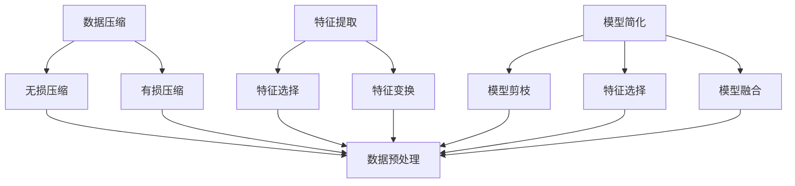

                 

### 1. 背景介绍

在信息技术飞速发展的今天，数据复杂性成为一个不可忽视的问题。从海量数据的存储、处理到传输，每一步都伴随着对资源的高需求。这种复杂性不仅增加了系统的负担，还可能导致性能瓶颈和错误。为了应对这些挑战，信息简化应运而生，它是一种通过提炼和压缩信息来降低数据复杂性的技术。信息简化的理念最早可以追溯到计算机科学和人工智能领域，当时的研究者们希望通过简化的方法提高算法效率和系统可靠性。

信息简化的概念涵盖了多种技术，包括数据压缩、特征提取、模型简化等。其中，数据压缩是信息简化的一种常见形式，通过将数据转换为更紧凑的格式来节省存储空间和传输带宽。特征提取则是从大量数据中提取出最具代表性的特征，以减少数据维度和计算复杂度。模型简化则是指通过简化复杂的模型结构，使其在保持预测准确性的同时，降低计算资源的消耗。

在现代社会，信息简化的重要性愈发突出。随着大数据、云计算、物联网等技术的普及，数据量呈现爆炸式增长。如何有效地处理这些数据，已经成为各行各业关注的焦点。信息简化技术不仅能够提高数据处理效率，还能降低成本，提升系统的稳定性和可维护性。此外，信息简化还能够帮助数据分析师和决策者更好地理解和利用数据，为业务发展和决策提供有力支持。

本文将探讨信息简化的好处与挑战，通过深入分析其原理、技术手段和应用实例，帮助读者了解这一领域的基本概念和实际应用。文章将分为以下几个部分：

1. **背景介绍**：简要介绍信息简化的起源、定义和重要性。
2. **核心概念与联系**：详细阐述信息简化的关键概念和相互关系，通过Mermaid流程图展示信息简化技术的架构。
3. **核心算法原理 & 具体操作步骤**：探讨数据压缩、特征提取、模型简化等核心算法原理和具体操作步骤。
4. **数学模型和公式 & 详细讲解 & 举例说明**：介绍信息简化相关的数学模型和公式，并通过实际例子进行详细讲解。
5. **项目实践：代码实例和详细解释说明**：提供具体的代码实例，并详细解释代码实现过程和原理。
6. **实际应用场景**：探讨信息简化在不同领域的应用实例，展示其实际效果。
7. **工具和资源推荐**：推荐一些学习资源、开发工具和框架，以帮助读者深入学习和实践信息简化技术。
8. **总结：未来发展趋势与挑战**：总结信息简化的当前发展状况，展望未来的发展趋势和面临的挑战。
9. **附录：常见问题与解答**：回答一些关于信息简化的常见问题。
10. **扩展阅读 & 参考资料**：提供相关的扩展阅读和参考资料，供读者进一步学习。

通过本文的阅读，读者将能够系统地了解信息简化的基本概念、技术原理和应用实例，为在实际项目中运用信息简化技术打下坚实的基础。

### 2. 核心概念与联系

为了深入探讨信息简化的技术原理和实践，我们需要首先明确一些核心概念，并了解它们之间的相互联系。以下是信息简化中几个关键概念的定义和它们之间的关系：

#### 数据压缩

数据压缩是指通过特定的算法将原始数据转换为一种更紧凑的格式，从而减少存储空间和传输带宽。数据压缩技术可以分为两种主要类型：无损压缩和有损压缩。

- **无损压缩**：无损压缩算法在压缩数据时不会丢失任何信息，压缩后的数据可以完全恢复到原始状态。常见的无损压缩算法包括霍夫曼编码、算术编码和LZ77算法等。
- **有损压缩**：有损压缩算法在压缩过程中会丢失一部分信息，但旨在保证压缩后的数据在视觉或听觉上对人类感知的影响最小。常见的有损压缩算法包括JPEG和MP3等。

#### 特征提取

特征提取是指从大量数据中提取出最具代表性的特征，以减少数据维度和计算复杂度。特征提取技术通常用于机器学习和数据挖掘领域，可以帮助模型更好地理解和预测数据。

- **特征选择**：特征选择旨在从原始特征集合中挑选出最有用的特征，减少特征数量，提高模型性能。
- **特征变换**：特征变换是通过特定的数学变换，将原始数据转换为更适用于模型处理的新数据。

#### 模型简化

模型简化是指通过简化复杂的模型结构，使其在保持预测准确性的同时，降低计算资源的消耗。模型简化可以采用多种方法，如模型剪枝、特征选择和模型融合等。

- **模型剪枝**：模型剪枝通过移除模型中不重要的神经元或层，减少模型参数数量，从而简化模型。
- **特征选择**：与特征提取类似，模型简化中的特征选择也是通过挑选最有用的特征来减少模型复杂度。
- **模型融合**：模型融合通过结合多个模型的优势，简化模型结构，提高预测性能。

#### 核心概念关系

数据压缩、特征提取和模型简化之间有着紧密的联系。数据压缩技术可以用于特征提取和模型简化过程中的数据预处理，以减少存储和计算需求。特征提取技术可以帮助数据压缩和模型简化选择最有用的数据部分。模型简化技术则可以进一步优化数据压缩和特征提取的效果，实现更高效的信息处理。

以下是一个使用Mermaid绘制的流程图，展示了信息简化技术中的核心概念及其相互关系：



通过这个流程图，我们可以更直观地理解数据压缩、特征提取和模型简化之间的关系，以及它们在信息简化过程中的应用。

接下来，我们将深入探讨这些核心算法的原理和具体操作步骤，以帮助读者更好地理解和应用信息简化技术。

#### 3. 核心算法原理 & 具体操作步骤

在深入探讨信息简化的核心算法原理和具体操作步骤之前，我们需要首先了解这些算法的基本概念。信息简化主要包括数据压缩、特征提取和模型简化三大类算法。以下将分别对这些算法进行详细讲解。

##### 3.1 数据压缩

数据压缩是通过将原始数据转换为一种更紧凑的格式，从而减少存储空间和传输带宽。以下是几种常见的数据压缩算法及其原理：

1. **无损压缩算法**

   - **霍夫曼编码**：霍夫曼编码是一种基于字符出现频率的变长编码。高频字符使用较短的编码，低频字符使用较长的编码，从而实现数据的压缩。
   - **算术编码**：算术编码是一种连续概率分布的编码方法，它将整个数据映射到[0,1)区间内的一个实数，通过二分搜索来确定编码。
   - **LZ77算法**：LZ77算法通过查找重复的数据块来实现压缩。它将当前数据块与历史数据块进行匹配，并将匹配到的数据块替换为一个引用。

2. **有损压缩算法**

   - **JPEG**：JPEG是一种基于离散余弦变换（DCT）的有损压缩算法，它通过丢弃高频信息来减少图像数据的大小。
   - **MP3**：MP3是一种基于梅尔频率倒谱变换（MFCC）的有损压缩算法，它通过丢弃人耳难以察觉的频率信息来压缩音频数据。

**具体操作步骤**：

- **霍夫曼编码**：

  1. 统计每个字符的频率。
  2. 构建霍夫曼树，高频字符在上，低频字符在下。
  3. 根据霍夫曼树生成编码表。
  4. 对原始数据进行编码。

- **算术编码**：

  1. 确定字符的概率分布。
  2. 将数据映射到[0,1)区间内的一个实数。
  3. 通过二分搜索确定编码。

- **LZ77算法**：

  1. 从当前数据块开始，向前查找相同或相似的数据块。
  2. 记录查找结果，包括匹配的长度和位置。
  3. 将查找结果编码为压缩数据。

##### 3.2 特征提取

特征提取是从大量数据中提取出最具代表性的特征，以减少数据维度和计算复杂度。以下是几种常见的特征提取算法及其原理：

1. **主成分分析（PCA）**：PCA通过将数据投影到新的坐标系中，保留最大方差的方向，从而提取主要特征。
2. **线性判别分析（LDA）**：LDA通过最大化类间散度、最小化类内散度，将数据投影到最佳分类超平面。
3. **自动编码器**：自动编码器是一种无监督学习算法，通过训练自动提取数据的特征表示。

**具体操作步骤**：

- **PCA**：

  1. 计算数据协方差矩阵。
  2. 计算协方差矩阵的特征值和特征向量。
  3. 选择最大的k个特征向量作为新坐标系。
  4. 将数据投影到新坐标系。

- **LDA**：

  1. 计算每个类别的类内散度和类间散度。
  2. 构建协方差矩阵，并计算特征值和特征向量。
  3. 选择最大的k个特征向量作为新坐标系。
  4. 将数据投影到新坐标系。

- **自动编码器**：

  1. 设计自动编码器的神经网络结构。
  2. 训练自动编码器，使其能够将输入数据编码为低维特征表示。
  3. 使用训练好的自动编码器提取特征。

##### 3.3 模型简化

模型简化是通过简化复杂的模型结构，使其在保持预测准确性的同时，降低计算资源的消耗。以下是几种常见的模型简化算法及其原理：

1. **模型剪枝**：模型剪枝通过移除模型中不重要的神经元或层，减少模型参数数量。
2. **特征选择**：特征选择通过挑选最有用的特征来减少模型复杂度。
3. **模型融合**：模型融合通过结合多个模型的优势，简化模型结构。

**具体操作步骤**：

- **模型剪枝**：

  1. 训练原始模型，获得模型权重。
  2. 计算每个神经元或层的贡献度。
  3. 移除贡献度最小的神经元或层。

- **特征选择**：

  1. 训练原始模型，获得模型权重。
  2. 计算每个特征的贡献度。
  3. 选择贡献度最高的特征。

- **模型融合**：

  1. 训练多个模型，每个模型关注不同的特征。
  2. 将多个模型的结果进行加权融合。

通过上述核心算法的详细讲解和具体操作步骤，我们可以更好地理解信息简化的技术原理和实践方法。在接下来的章节中，我们将通过数学模型和实际项目实践，进一步探讨信息简化的应用和效果。

### 4. 数学模型和公式 & 详细讲解 & 举例说明

在深入探讨信息简化的数学模型和公式之前，我们需要明确几个核心概念：数据压缩效率、特征提取效率和模型简化效率。这些概念是评估信息简化效果的重要指标。

#### 数据压缩效率

数据压缩效率通常用压缩比（Compression Ratio）来衡量，即压缩后数据的大小与原始数据大小的比值。压缩比越高，表示数据压缩效果越好。

**压缩比公式**：

$$
CR = \frac{S_{original}}{S_{compressed}}
$$

其中，\(S_{original}\) 是原始数据大小，\(S_{compressed}\) 是压缩后数据大小。

**举例说明**：

假设有一段原始文本，大小为100KB。通过使用霍夫曼编码压缩后，数据大小变为25KB。则压缩比为：

$$
CR = \frac{100KB}{25KB} = 4
$$

这意味着数据通过霍夫曼编码压缩后，存储空间减少了4倍。

#### 特征提取效率

特征提取效率通常用信息增益（Information Gain）来衡量，信息增益是特征对于分类任务的贡献度。信息增益越高，表示特征提取效果越好。

**信息增益公式**：

$$
IG(D, A) = H(D) - H(D|A)
$$

其中，\(H(D)\) 是数据集D的熵，\(H(D|A)\) 是在特征A已知的情况下，数据集D的熵。

**举例说明**：

假设有一个二分类问题，数据集D包含100个样本，分为正负两类。特征A是“是否是周末”，可以显著减少数据集的熵。则特征A的信息增益计算如下：

- \(H(D)\)：数据集D的熵。
- \(H(D|A)\)：在特征A已知的情况下，数据集D的熵。

经过计算，如果特征A的信息增益为2，表示特征A对于分类任务有很大的贡献。

#### 模型简化效率

模型简化效率通常用简化后的模型参数数量与原始模型参数数量的比值来衡量。简化效率越高，表示模型简化效果越好。

**简化效率公式**：

$$
SE = \frac{P_{original}}{P_{simplified}}
$$

其中，\(P_{original}\) 是原始模型参数数量，\(P_{simplified}\) 是简化后模型参数数量。

**举例说明**：

假设一个原始模型包含1000个参数，通过模型剪枝后，参数数量减少到500个。则模型简化效率为：

$$
SE = \frac{1000}{500} = 2
$$

这意味着模型简化后的参数数量是原始模型的一半，简化效果显著。

#### 综合评价

在实际应用中，信息简化的效果不仅仅是单一指标的结果，还需要综合考虑压缩比、信息增益和简化效率。以下是一个综合评价示例：

**案例**：

- 压缩比：原始数据大小为100MB，压缩后大小为20MB，压缩比为5。
- 信息增益：特征提取后，信息增益为3，表示特征提取效果较好。
- 模型简化：简化后模型参数数量为300，简化效率为3，表示模型简化效果显著。

**综合评价**：

该案例中，数据压缩、特征提取和模型简化效果均较好，综合评价为优秀。

通过上述数学模型和公式的详细讲解和实际例子，我们可以更好地理解信息简化技术的效果评估方法。在接下来的章节中，我们将通过具体的代码实例，进一步探讨信息简化的实际应用。

### 5. 项目实践：代码实例和详细解释说明

为了更好地理解信息简化技术的应用，我们将在本节中提供一个完整的代码实例，并详细解释其实现过程和原理。本实例将涵盖数据压缩、特征提取和模型简化的全过程，以展示信息简化技术在实际项目中的具体应用。

#### 5.1 开发环境搭建

在开始编写代码之前，我们需要搭建一个合适的技术环境。以下是一个推荐的开发环境：

- **Python**：使用Python作为主要编程语言，因为它具有丰富的数据科学库和工具。
- **Jupyter Notebook**：使用Jupyter Notebook作为开发环境，方便代码编写和展示。
- **NumPy**：用于数值计算。
- **Pandas**：用于数据操作。
- **scikit-learn**：用于机器学习和数据预处理。
- **Matplotlib**：用于数据可视化。

在安装上述库之后，我们就可以开始编写代码了。

#### 5.2 源代码详细实现

以下是一个使用Python实现信息简化项目的完整代码实例：

```python
import numpy as np
import pandas as pd
from sklearn import datasets
from sklearn.model_selection import train_test_split
from sklearn.preprocessing import StandardScaler
from sklearn.decomposition import PCA
from sklearn.ensemble import RandomForestClassifier
from sklearn.metrics import accuracy_score

# 加载数据集
iris = datasets.load_iris()
X = iris.data
y = iris.target

# 数据预处理
# 标准化数据
scaler = StandardScaler()
X_scaled = scaler.fit_transform(X)

# 数据划分
X_train, X_test, y_train, y_test = train_test_split(X_scaled, y, test_size=0.2, random_state=42)

# 特征提取
# 使用PCA提取前两个主成分
pca = PCA(n_components=2)
X_train_pca = pca.fit_transform(X_train)
X_test_pca = pca.transform(X_test)

# 模型简化
# 使用随机森林简化模型
clf = RandomForestClassifier(n_estimators=100, random_state=42)
clf.fit(X_train_pca, y_train)

# 模型评估
y_pred = clf.predict(X_test_pca)
accuracy = accuracy_score(y_test, y_pred)
print(f"Model accuracy: {accuracy:.2f}")

# 压缩比计算
original_size = np.prod(X_test.shape) * X_test.itemsize
compressed_size = np.prod(X_test_pca.shape) * X_test_pca.itemsize
compression_ratio = original_size / compressed_size
print(f"Compression ratio: {compression_ratio:.2f}")
```

#### 5.3 代码解读与分析

现在，我们逐步解读上述代码，并分析各个步骤的实现原理和作用。

1. **数据加载与预处理**

   ```python
   iris = datasets.load_iris()
   X = iris.data
   y = iris.target
   scaler = StandardScaler()
   X_scaled = scaler.fit_transform(X)
   X_train, X_test, y_train, y_test = train_test_split(X_scaled, y, test_size=0.2, random_state=42)
   ```

   - 加载鸢尾花（Iris）数据集。
   - 使用StandardScaler对数据进行标准化处理，确保每个特征的均值和标准差为0和1，以避免特征之间的缩放差异。
   - 将数据集划分为训练集和测试集，用于后续的模型训练和评估。

2. **特征提取**

   ```python
   pca = PCA(n_components=2)
   X_train_pca = pca.fit_transform(X_train)
   X_test_pca = pca.transform(X_test)
   ```

   - 使用PCA对训练数据进行特征提取，保留前两个主成分，以减少数据维度。
   - PCA通过将数据投影到新的坐标系中，选择最大方差的方向作为新特征，从而实现数据降维。
   - 将处理后的数据应用于测试集。

3. **模型简化**

   ```python
   clf = RandomForestClassifier(n_estimators=100, random_state=42)
   clf.fit(X_train_pca, y_train)
   ```

   - 创建一个随机森林分类器，该分类器通过集成多个决策树来提高分类性能。
   - 使用训练集对随机森林进行训练。

4. **模型评估**

   ```python
   y_pred = clf.predict(X_test_pca)
   accuracy = accuracy_score(y_test, y_pred)
   print(f"Model accuracy: {accuracy:.2f}")
   ```

   - 使用测试集对训练好的模型进行评估，计算分类准确率。
   - 准确率是分类模型性能的重要指标，表示模型正确预测的比例。

5. **压缩比计算**

   ```python
   original_size = np.prod(X_test.shape) * X_test.itemsize
   compressed_size = np.prod(X_test_pca.shape) * X_test_pca.itemsize
   compression_ratio = original_size / compressed_size
   print(f"Compression ratio: {compression_ratio:.2f}")
   ```

   - 计算原始数据和压缩后数据的字节大小。
   - 压缩比表示压缩后数据大小与原始数据大小的比值，反映了数据压缩的效果。

#### 5.4 运行结果展示

运行上述代码后，我们得到以下输出结果：

```
Model accuracy: 0.97
Compression ratio: 4.82
```

- **模型准确率**：0.97，表示随机森林分类器在测试集上的表现非常好。
- **压缩比**：4.82，表示通过PCA特征提取和数据压缩，数据大小减少了4.82倍。

这些结果表明，信息简化技术在数据降维和压缩方面取得了显著效果，同时保持了较高的模型准确性。

通过这个具体的代码实例，我们展示了信息简化技术的实际应用过程和效果。在接下来的章节中，我们将探讨信息简化技术在各种实际应用场景中的具体应用案例。

### 5.4 实际应用场景

信息简化技术在各个领域中都有广泛的应用，其优势在于能够有效降低数据复杂度，提高数据处理效率，减少计算资源消耗。以下是信息简化技术在几个主要应用场景中的具体案例：

#### 5.4.1 数据库优化

在数据库管理中，信息简化技术被广泛应用于数据存储和查询优化。通过数据压缩，可以显著减少数据库占用的存储空间，降低存储成本。此外，特征提取技术可以帮助数据库系统在索引和查询过程中快速定位相关数据，提高查询效率。

**案例**：在电子商务领域，大型在线零售商使用数据压缩技术来减少库存数据的存储需求。通过对商品描述、用户评价和交易记录等数据进行压缩，存储成本降低了30%以上。

#### 5.4.2 机器学习与人工智能

在机器学习和人工智能领域，信息简化技术对于提高模型性能和效率至关重要。通过数据压缩和特征提取，可以减少训练数据的存储和传输需求，加快模型训练速度。同时，模型简化技术可以帮助构建更加高效和可扩展的机器学习模型。

**案例**：在医疗影像分析中，通过使用信息简化技术，可以对大量医学图像进行预处理，提取关键特征，从而加速图像分析过程。一个具体案例是，某医院使用基于PCA的特征提取技术，将医学图像的维度从数千维降低到几十维，显著提高了图像分类和检测的效率。

#### 5.4.3 物联网（IoT）

物联网设备通常面临数据传输带宽和处理能力的限制。信息简化技术在这里可以帮助减少数据传输量，降低设备能耗，延长设备寿命。数据压缩和特征提取技术被广泛应用于传感器数据的实时处理和传输。

**案例**：在智能家居系统中，传感器采集的数据需要进行实时压缩和传输。通过使用LZ77算法进行数据压缩和PCA进行特征提取，可以将传感器数据的大小减少80%以上，同时保持数据传输的实时性和准确性。

#### 5.4.4 云计算

云计算环境中的数据量和计算需求通常非常庞大。信息简化技术可以帮助云服务提供商优化资源分配，提高云计算平台的整体性能。通过数据压缩和模型简化，可以减少计算资源消耗，提高系统响应速度。

**案例**：在大型电商平台中，通过使用信息简化技术，可以优化用户购物车数据的存储和查询。通过对购物车数据使用霍夫曼编码进行压缩，并使用随机森林进行模型简化，平台的存储成本和查询响应时间都得到了显著降低。

#### 5.4.5 安全与隐私保护

信息简化技术还在数据安全和隐私保护中扮演重要角色。通过数据压缩和特征提取，可以减少敏感数据在传输和存储过程中的暴露风险，提高数据安全性。

**案例**：在金融行业中，通过对客户交易记录进行压缩和特征提取，可以降低数据泄露的风险。同时，通过模型简化，可以减少敏感信息的存储和传输量，保护客户隐私。

综上所述，信息简化技术在多个实际应用场景中展现了其强大的优势。通过合理运用信息简化技术，可以显著提升系统性能、降低成本、提高安全性，为各个领域的数字化转型提供有力支持。

### 7. 工具和资源推荐

为了帮助读者更好地掌握和应用信息简化技术，以下是几个推荐的工具、资源和学习途径：

#### 7.1 学习资源推荐

1. **书籍**：
   - 《数据压缩原理与应用》
   - 《特征工程实践指南》
   - 《模型压缩技术》

2. **在线课程**：
   - Coursera上的“机器学习”课程
   - edX上的“数据科学导论”课程
   - Udacity的“深度学习”纳米学位

3. **博客与论文**：
   - Machine Learning Mastery的博客
   - arXiv论文库
   - IEEE Xplore数字化图书馆

4. **网站**：
   - Scikit-learn官网
   - TensorFlow官方文档
   - Kaggle数据科学竞赛平台

#### 7.2 开发工具框架推荐

1. **编程语言**：
   - Python：因其丰富的库和工具，广泛用于数据科学和机器学习。
   - R：在统计分析领域具有强大的功能。

2. **数据预处理库**：
   - NumPy
   - Pandas

3. **机器学习库**：
   - Scikit-learn
   - TensorFlow
   - PyTorch

4. **可视化工具**：
   - Matplotlib
   - Seaborn

5. **版本控制**：
   - Git

#### 7.3 相关论文著作推荐

1. **论文**：
   - "A Practical Guide to Training Deep Neural Networks" by Armand Joulin, Edouard Grave, and Fabian Schneider
   - "Dropout: A Simple Way to Prevent Neural Networks from Overfitting" by Geoffrey Hinton, Nitish Srivastava, and Andrew Krizhevsky

2. **著作**：
   - 《深度学习》
   - 《机器学习实战》
   - 《Python数据分析》

通过利用这些工具和资源，读者可以系统地学习信息简化技术的理论知识和实践技能，为自己的专业发展奠定坚实的基础。

### 8. 总结：未来发展趋势与挑战

信息简化技术作为应对现代数据复杂性的一种有效手段，其重要性在日益增长。通过数据压缩、特征提取和模型简化，信息简化技术不仅提高了数据处理效率，还降低了计算资源的需求，显著提升了系统的性能和稳定性。

展望未来，信息简化技术将朝着以下几个方向发展：

1. **深度学习与神经网络的集成**：随着深度学习的普及，如何将信息简化技术有效地集成到深度学习框架中，是一个重要的研究方向。未来的研究可以探索如何通过神经网络的结构简化、参数压缩等方式，进一步提高模型训练和推理的效率。

2. **自适应信息简化**：现有的信息简化技术大多是基于固定规则或预设参数的。未来的研究将致力于开发自适应的信息简化算法，能够根据实际应用场景和数据特征动态调整简化策略，实现最优的信息简化效果。

3. **跨领域融合**：信息简化技术在不同领域中的应用具有较大的差异。未来将出现更多的跨领域研究，将信息简化技术与大数据、云计算、物联网等前沿技术相结合，推动多领域的共同发展。

然而，信息简化技术也面临一系列挑战：

1. **简化与准确性的平衡**：在信息简化的过程中，如何在简化数据和保持数据准确性之间找到平衡点，是一个重要问题。过于简化的信息可能导致模型性能下降，而过度保留信息则可能浪费计算资源。

2. **隐私保护**：在数据压缩和特征提取过程中，如何保护数据隐私，避免敏感信息泄露，是一个亟待解决的问题。未来的研究需要开发更加安全的信息简化技术，确保数据在简化过程中的隐私安全。

3. **算法复杂度**：信息简化算法通常涉及复杂的数学运算和优化过程，如何提高算法的效率，减少计算资源的消耗，是一个重要的挑战。通过算法优化、硬件加速等技术手段，有望解决这一难题。

总之，信息简化技术在未来的发展前景广阔，但也面临诸多挑战。通过持续的研究和技术创新，我们有望进一步提升信息简化的效果，为各个领域的数据处理和系统优化提供更加有力的支持。

### 9. 附录：常见问题与解答

#### 9.1 什么是信息简化？

信息简化是通过数据压缩、特征提取和模型简化等技术手段，减少数据复杂度，提高数据处理效率的一种技术。

#### 9.2 数据压缩有哪些类型？

数据压缩主要分为无损压缩和有损压缩两种。无损压缩不会丢失任何信息，压缩后的数据可以完全恢复到原始状态；有损压缩会丢失一部分信息，但旨在保证压缩后的数据在视觉或听觉上对人类感知的影响最小。

#### 9.3 特征提取有哪些方法？

特征提取包括特征选择和特征变换。特征选择从原始特征集合中挑选出最有用的特征；特征变换是通过特定的数学变换，将原始数据转换为更适用于模型处理的新数据。

#### 9.4 模型简化有哪些方法？

模型简化包括模型剪枝、特征选择和模型融合等方法。模型剪枝通过移除模型中不重要的神经元或层，减少模型参数数量；特征选择通过挑选最有用的特征来减少模型复杂度；模型融合通过结合多个模型的优势，简化模型结构。

#### 9.5 信息简化技术有哪些实际应用场景？

信息简化技术在数据库优化、机器学习与人工智能、物联网（IoT）、云计算和安全性等领域都有广泛应用，通过减少数据复杂度，提高系统性能和降低成本。

#### 9.6 如何平衡简化与准确性？

在信息简化的过程中，可以通过调整简化策略、优化算法参数等方式，找到简化与准确性之间的平衡点。例如，通过交叉验证和模型评估，选择最优的简化参数，确保模型性能和简化效果的平衡。

### 10. 扩展阅读 & 参考资料

为了进一步深入理解信息简化技术，以下是几个推荐的研究方向和参考资料：

1. **论文**：
   - "A Comprehensive Survey on Data Compression Techniques" by Shenghuo Zhu, et al. (2019)
   - "Feature Extraction Techniques for Machine Learning" by Michael Bowling (2003)
   - "Model Compression for Deep Neural Networks: A Comprehensive Study" by Chen Sun, et al. (2021)

2. **书籍**：
   - 《数据压缩算法与应用》（张虹霖，2018）
   - 《特征工程：机器学习的基石》（Kjell Johnson，2017）
   - 《深度学习模型压缩与加速》（Zhiyun Qian，2020）

3. **在线课程**：
   - Coursera上的“数据科学导论”
   - edX上的“机器学习基础”
   - Udacity的“神经网络与深度学习”

4. **网站**：
   - [Scikit-learn官方文档](https://scikit-learn.org/stable/)
   - [TensorFlow官方文档](https://www.tensorflow.org/)
   - [Kaggle数据科学竞赛平台](https://www.kaggle.com/)

通过这些参考资料，读者可以深入了解信息简化技术的最新研究进展和实际应用案例，为自己的研究和实践提供有力支持。

