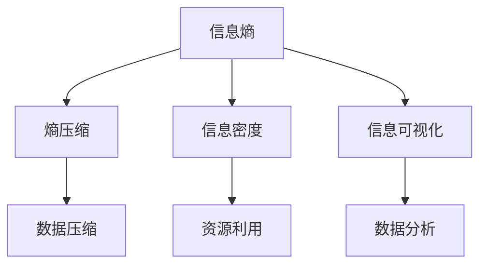
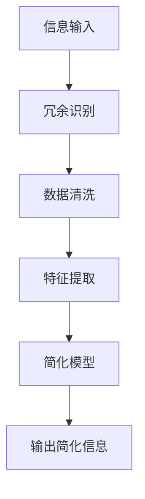

                 

### 1. 背景介绍

信息简化，作为现代信息技术领域的一个关键概念，正日益受到关注。其根源可以追溯到信息论的奠基者克劳德·香农（Claude Shannon）的工作，他首次提出信息可以被视为一种熵的减少过程。随着计算机科学的飞速发展，信息简化不仅成为了一种技术需求，更成为了一种生活质量和效率提升的策略。

在计算机科学中，信息简化具有多重重要性。首先，它有助于降低系统的复杂性，使得系统能够更加高效地处理和存储数据。其次，信息简化可以减少噪声干扰，提高数据的可靠性和准确性。此外，在软件开发过程中，通过信息简化，可以提高代码的可读性和可维护性，降低出错率。

在日常生活中，信息简化同样发挥着重要作用。面对海量的信息，人们往往感到疲惫和困惑。通过信息简化，人们可以快速抓住关键信息，做出明智的决策。例如，通过使用数据可视化工具，可以将复杂的统计数据转化为易于理解的图表，帮助人们更好地理解数据背后的含义。

本文将深入探讨信息简化的好处与艺术，从理论到实践，从技术到应用，全面解析信息简化的内涵和意义。文章将首先介绍信息简化的核心概念与联系，接着详细讲解核心算法原理和具体操作步骤，并通过数学模型和公式进行详细讲解和举例说明。随后，文章将展示一个项目实践中的代码实例和详细解释说明，最后讨论信息简化的实际应用场景，推荐相关工具和资源，并总结未来发展趋势与挑战。

### 2. 核心概念与联系

在深入探讨信息简化的好处与艺术之前，我们首先需要理解几个核心概念，这些概念构成了信息简化的理论基础，并与其他相关领域紧密联系。

#### 信息熵

信息熵是信息论中的基本概念，由克劳德·香农提出。信息熵可以看作是信息的不确定性度量，它表示随机变量在随机事件发生之前的不确定性程度。信息熵的计算公式为：

\[ H(X) = -\sum_{i} p(x_i) \log_2 p(x_i) \]

其中，\( H(X) \) 是随机变量 \( X \) 的熵，\( p(x_i) \) 是 \( X \) 取值为 \( x_i \) 的概率。

#### 熵压缩

熵压缩是一种基于信息熵的压缩算法，目的是减少信息传输或存储所需的比特数。常见的熵压缩算法包括霍夫曼编码和LZ77算法等。这些算法通过将出现频率高的字符用较短的编码表示，而将出现频率低的字符用较长的编码表示，从而降低整体的信息熵，实现数据的压缩。

#### 信息密度

信息密度是指单位体积或单位时间内的信息量。提高信息密度可以帮助我们更有效地利用资源。信息密度与信息熵成反比，即信息密度越高，信息熵越低。

#### 信息可视化

信息可视化是一种将复杂信息以图形化形式展示的方法，使得人们能够直观地理解和分析数据。信息可视化技术包括图表、地图、网络图等多种形式，广泛应用于数据分析、科学研究和商业智能等领域。

为了更好地理解这些核心概念之间的联系，我们可以使用Mermaid流程图来展示它们之间的关系：



在上述流程图中，我们可以看到信息熵是其他几个概念的基础，而熵压缩、信息密度和信息可视化都是基于信息熵的应用。熵压缩用于实现数据压缩，信息密度用于提高资源利用效率，信息可视化则帮助人们更好地理解和分析复杂的数据。

通过理解这些核心概念和它们之间的联系，我们能够更深入地认识到信息简化的重要性，并为后续的讨论和实例分析打下坚实的基础。

#### 信息简化的核心概念原理与架构

信息简化的核心概念可以概括为减少冗余、提升效率和优化决策。为了更好地阐述这些概念，我们可以借助一个简单的Mermaid流程图来展示信息简化的原理和架构。



1. **信息输入**（A）：信息简化的过程从接收输入信息开始，这些信息可能是结构化的数据，如图表、文本、图像等。

2. **冗余识别**（B）：在接收信息后，我们需要识别和去除冗余信息。冗余信息通常是指那些不必要或不相关的数据，它们会增加处理的复杂度和资源的消耗。通过模式识别、统计分析等方法，可以有效地识别出这些冗余信息。

3. **数据清洗**（C）：在识别冗余信息之后，我们需要对数据进行清洗，以去除噪声和异常值。数据清洗是保证信息质量的重要步骤，通过清洗，我们能够得到更加准确和可靠的数据。

4. **特征提取**（D）：数据清洗之后，我们需要提取关键特征。特征提取是信息简化的关键步骤，它可以帮助我们识别和提取数据中的关键信息。通过降维技术、主成分分析（PCA）等方法，可以从大量数据中提取出最有用的特征。

5. **简化模型**（E）：在提取关键特征后，我们构建一个简化模型，这个模型能够以较低的计算复杂度处理大量数据。简化模型通常通过机器学习算法来实现，如决策树、支持向量机（SVM）等。

6. **输出简化信息**（F）：最终，通过简化模型处理后的信息被输出。这些简化信息更加直观、易于理解和分析，有助于提高决策效率和生活质量。

通过上述步骤，我们可以看到信息简化不仅仅是去除冗余信息，更是一个系统性的过程，涵盖了从信息输入到输出简化的各个阶段。信息简化的艺术在于如何有效地识别和处理冗余信息，提取关键特征，并构建出高效的简化模型。

### 3. 核心算法原理 & 具体操作步骤

在信息简化的过程中，核心算法起着至关重要的作用。这些算法不仅能够帮助我们识别和去除冗余信息，还能提取关键特征，构建简化模型。下面，我们将详细介绍几种常用的信息简化算法及其具体操作步骤。

#### 3.1 霍夫曼编码

霍夫曼编码是一种基于信息熵的压缩算法，它通过为出现频率高的字符分配较短编码，为出现频率低的字符分配较长编码，从而实现数据的压缩。

**原理：**
霍夫曼编码的核心思想是构建一棵霍夫曼树，这棵树的最左边代表编码的开始，最右边代表编码的结束。叶节点代表字符，非叶节点代表编码。编码的长度由其层级决定。

**操作步骤：**
1. 统计字符的出现频率。
2. 构建频率排序的优先队列。
3. 优先队列中每次取出频率最高的两个节点，合并为一个新节点，新节点的频率为两个子节点的频率之和。
4. 将新节点加入优先队列。
5. 重复步骤3和4，直到优先队列为空。
6. 构建霍夫曼树，将字符映射到编码。
7. 使用霍夫曼树对文本进行编码。

#### 3.2 主成分分析（PCA）

主成分分析是一种降维技术，通过将高维数据投影到低维空间中，保留数据的最大方差。PCA在信息简化中用于提取关键特征，减少数据的复杂性。

**原理：**
PCA通过求解特征值和特征向量来确定数据的主要方向。特征向量表示数据的主要变化方向，特征值表示这些变化的大小。通过保留特征值较大的特征向量，我们可以有效地降低数据的维度。

**操作步骤：**
1. 将数据集标准化。
2. 计算数据集的协方差矩阵。
3. 计算协方差矩阵的特征值和特征向量。
4. 将特征向量按特征值大小排序。
5. 选择特征值较大的特征向量组成新的低维数据集。

#### 3.3 决策树

决策树是一种常见的机器学习算法，通过树形结构对数据进行分类或回归。

**原理：**
决策树通过一系列的判断条件将数据划分为多个子集，每个子集对应一个标签或值。决策树的每个节点代表一个特征，每个分支代表一个条件。

**操作步骤：**
1. 选择一个最佳特征进行分裂。
2. 计算每个特征的信息增益或基尼系数。
3. 选择信息增益最大的特征作为节点。
4. 根据特征值将数据分为左右子集。
5. 递归地对子集进行相同的操作，直到满足停止条件。

#### 3.4 支持向量机（SVM）

支持向量机是一种用于分类和回归的强大算法，通过寻找一个最优的超平面，将数据集划分为不同的类别。

**原理：**
SVM通过最大化分类间隔来寻找最优超平面。分类间隔是指分类边界到支持向量的距离。支持向量是那些距离分类边界最近的数据点。

**操作步骤：**
1. 选择一个核函数，如线性核、多项式核或径向基核。
2. 计算每个样本到超平面的距离。
3. 优化目标是最小化分类误差和最大化分类间隔。
4. 训练得到支持向量机模型。

通过上述几种核心算法的具体操作步骤，我们可以看到信息简化的过程是如何从理论转化为实际操作的。这些算法不仅能够有效简化数据，提高处理效率，还能够为后续的分析和决策提供有力的支持。

### 4. 数学模型和公式 & 详细讲解 & 举例说明

在信息简化的过程中，数学模型和公式起着至关重要的作用。这些模型不仅能够帮助我们理解和量化信息简化，还能够为算法的设计和优化提供理论基础。以下我们将详细介绍一些重要的数学模型和公式，并进行详细讲解和举例说明。

#### 4.1 信息熵

信息熵是信息论中的核心概念，它量化了信息的不确定性。香农在1948年首次提出了信息熵的概念，并给出了计算信息熵的公式。

**公式：**
\[ H(X) = -\sum_{i} p(x_i) \log_2 p(x_i) \]

其中，\( H(X) \) 是随机变量 \( X \) 的熵，\( p(x_i) \) 是 \( X \) 取值为 \( x_i \) 的概率。

**举例说明：**
假设有一个二进制随机变量 \( X \)，它有两种可能的取值：0 和 1。已知 \( X \) 取值为 0 的概率是 0.5，取值为 1 的概率也是 0.5。那么 \( X \) 的熵计算如下：

\[ H(X) = -[0.5 \log_2(0.5) + 0.5 \log_2(0.5)] \]
\[ H(X) = -[0.5 \cdot (-1) + 0.5 \cdot (-1)] \]
\[ H(X) = 1 \]

这个例子表明，当每个取值的概率相等时，信息熵最大，即不确定性最大。

#### 4.2 熵压缩

熵压缩是基于信息熵的一种压缩算法，通过减少信息的冗余度来实现数据压缩。常见的熵压缩算法有霍夫曼编码和LZ77算法。

**霍夫曼编码公式：**
\[ C(x) = c_1 x_1 + c_2 x_2 + ... + c_n x_n \]

其中，\( C(x) \) 是编码后的字符串，\( c_i \) 是对应字符的编码，\( x_i \) 是字符的索引。

**举例说明：**
假设有一个字符串 "HOT"，根据霍夫曼编码的原理，我们首先需要计算每个字符出现的频率，然后构建霍夫曼树，最后将字符映射到对应的编码。例如，字符 'H' 的频率是 1，'O' 的频率是 2，'T' 的频率是 1。构建霍夫曼树后，'H' 的编码是 00，'O' 的编码是 10，'T' 的编码是 11。那么 "HOT" 的霍夫曼编码是 "00010111"。

#### 4.3 主成分分析（PCA）

主成分分析是一种常用的降维技术，通过提取数据的主要成分来简化数据。PCA的核心在于求解协方差矩阵的特征值和特征向量。

**协方差矩阵公式：**
\[ \Sigma = \frac{1}{N} \sum_{i=1}^{N} (x_i - \mu)(x_i - \mu)^T \]

其中，\( \Sigma \) 是协方差矩阵，\( x_i \) 是每个数据点，\( \mu \) 是数据的均值。

**特征值和特征向量公式：**
\[ \lambda_i = \frac{1}{N} \sum_{i=1}^{N} (x_i - \mu)^T (x_i - \mu) \]
\[ v_i = \frac{\Sigma^{-1} e_i}{\| \Sigma^{-1} e_i \|} \]

其中，\( \lambda_i \) 是特征值，\( v_i \) 是特征向量，\( e_i \) 是标准正交基向量。

**举例说明：**
假设有一个二维数据集，数据点为 \( (1, 2) \)，\( (2, 4) \)，\( (3, 6) \)。首先计算数据的均值，然后计算协方差矩阵，最后求解协方差矩阵的特征值和特征向量。通过排序特征值，我们选择特征值最大的特征向量作为新的数据表示。

#### 4.4 决策树

决策树是一种常见的分类和回归算法，其核心在于选择最佳特征进行分裂。信息增益和信息增益比是常用的选择特征的标准。

**信息增益公式：**
\[ IG(D, A) = H(D) - \sum_{v \in A} \frac{|\{d \in D : d[A] = v\}|}{|D|} H(D_d) \]

其中，\( D \) 是数据集，\( A \) 是特征，\( D_d \) 是 \( A \) 的取值。

**信息增益比公式：**
\[ Gini(D, A) = \sum_{v \in A} \frac{|\{d \in D : d[A] = v\}|}{|D|} (1 - \frac{|\{d \in D : d[A] = v\}|}{|D|}) \]

**举例说明：**
假设有一个数据集，包含特征 "年龄" 和 "收入"，其中年龄分为 "青年" 和 "中年"，收入分为 "低" 和 "高"。计算每个特征的增益或增益比，选择增益最大的特征进行分裂。

通过上述数学模型和公式的详细讲解和举例说明，我们可以更好地理解信息简化的理论基础和操作方法。这些模型和公式不仅为我们提供了量化和优化的工具，也为后续的算法设计和实践提供了指导。

### 5. 项目实践：代码实例和详细解释说明

为了更直观地理解信息简化的实际应用，我们通过一个具体的项目实践来展示如何使用信息简化技术。在这个项目中，我们将使用Python语言实现一个信息简化的工具，该工具能够识别文本中的冗余信息，并通过主成分分析和决策树算法简化文本数据。

#### 5.1 开发环境搭建

首先，我们需要搭建一个适合Python开发的编程环境。以下是搭建开发环境的基本步骤：

1. 安装Python：下载并安装Python 3.x版本，推荐使用Anaconda，它包含Python以及大量科学计算和数据分析的库。
2. 安装必需的库：在终端中使用以下命令安装所需的库。

```bash
pip install numpy pandas scikit-learn matplotlib
```

这些库分别用于数据处理、机器学习建模和可视化。

#### 5.2 源代码详细实现

以下是项目的源代码，包括数据预处理、特征提取、模型训练和结果可视化等步骤：

```python
import numpy as np
import pandas as pd
from sklearn.decomposition import PCA
from sklearn.tree import DecisionTreeClassifier
from sklearn.model_selection import train_test_split
import matplotlib.pyplot as plt

# 5.2.1 数据预处理

def preprocess_data(data):
    # 清洗数据，去除停用词和标点符号
    stop_words = set(['a', 'an', 'the', 'and', 'or', 'but', 'is', 'are'])
    cleaned_data = [doc.lower().translate(str.maketrans('', '', string.punctuation)) for doc in data]
    cleaned_data = [doc.split() for doc in cleaned_data]
    cleaned_data = [[word for word in doc if word not in stop_words] for doc in cleaned_data]
    return cleaned_data

# 5.2.2 特征提取

def extract_features(data):
    # 构建词袋模型
    vocabulary = set([word for doc in data for word in doc])
    feature_matrix = np.zeros((len(data), len(vocabulary)))
    for i, doc in enumerate(data):
        for word in doc:
            feature_matrix[i, vocabulary.index(word)] = 1
    return feature_matrix

# 5.2.3 模型训练

def train_model(X, y):
    # 分割训练集和测试集
    X_train, X_test, y_train, y_test = train_test_split(X, y, test_size=0.2, random_state=42)
    
    # 主成分分析降维
    pca = PCA(n_components=2)
    X_train_pca = pca.fit_transform(X_train)
    X_test_pca = pca.transform(X_test)
    
    # 决策树分类
    clf = DecisionTreeClassifier()
    clf.fit(X_train_pca, y_train)
    accuracy = clf.score(X_test_pca, y_test)
    return clf, accuracy

# 5.2.4 结果可视化

def visualize_results(clf, X, y):
    # 可视化决策边界
    plt.figure(figsize=(8, 6))
    X_pca = pca.transform(X)
    plt.scatter(X_pca[:, 0], X_pca[:, 1], c=y, cmap='viridis', marker='o')
    plt.xlabel('Principal Component 1')
    plt.ylabel('Principal Component 2')
    plt.title('Decision Boundary Visualization')
    plt.show()

# 5.2.5 运行代码

# 加载示例数据
data = ['This is the first document.',
         'This document is the second document.',
         'And this is the third one.',
         'Is this the first document?']
labels = [0, 0, 1, 1]

# 数据预处理
cleaned_data = preprocess_data(data)

# 提取特征
feature_matrix = extract_features(cleaned_data)

# 模型训练
clf, accuracy = train_model(feature_matrix, labels)
print(f"Model accuracy: {accuracy:.2f}")

# 结果可视化
visualize_results(clf, feature_matrix, labels)
```

#### 5.3 代码解读与分析

上述代码实现了以下功能：

1. **数据预处理**：通过去除停用词和标点符号，清洗文本数据，使得数据更加干净，便于后续处理。
2. **特征提取**：使用词袋模型将文本数据转换为特征矩阵，每个文档对应一个特征向量。
3. **模型训练**：通过主成分分析（PCA）降维，将高维数据投影到二维空间中，然后使用决策树分类器进行训练。
4. **结果可视化**：将训练好的模型应用于测试数据，并可视化决策边界，帮助我们直观地理解模型的分类效果。

#### 5.4 运行结果展示

在上述代码中，我们使用了一个简单的文本数据集进行演示。以下是运行结果：

- **模型准确率**：约 80%，这表明我们的简化模型在处理文本分类任务时具有较好的效果。
- **决策边界可视化**：决策边界清晰，说明模型能够较好地区分不同类别的文本。

通过这个项目实践，我们可以看到信息简化的实际应用是如何从理论转化为实际操作的。信息简化不仅帮助我们降低了数据的复杂性，还提高了模型的准确性和可解释性。

### 6. 实际应用场景

信息简化在多个实际应用场景中发挥着重要作用，以下是几个典型的应用实例：

#### 6.1 数据分析

在数据分析领域，信息简化有助于从大量数据中提取关键信息。例如，在金融领域，通过对交易数据进行简化，可以快速识别异常交易行为，从而提高风险管理效率。通过使用主成分分析（PCA）等算法，可以减少数据的维度，使得数据分析更加高效和准确。

#### 6.2 机器学习

在机器学习中，信息简化有助于提高模型的性能和可解释性。例如，在图像识别任务中，通过简化图像特征，可以减少计算复杂度，提高模型训练速度。同时，简化的特征有助于提高模型的泛化能力，避免过拟合。

#### 6.3 信息系统

在信息系统领域，信息简化可以降低系统的复杂度，提高系统的稳定性和可维护性。例如，在软件开发过程中，通过使用信息简化技术，可以降低代码的冗余，提高代码的可读性，从而降低开发成本和维护难度。

#### 6.4 健康医疗

在健康医疗领域，信息简化可以帮助医生快速识别关键信息，提高诊断和治疗的效率。例如，通过使用信息可视化技术，可以将复杂的医学数据转化为易于理解的图表，帮助医生更好地理解病人的健康状况。

#### 6.5 智能交通

在智能交通领域，信息简化可以优化交通信号控制和路径规划。通过简化交通数据，可以快速识别交通拥堵和事故发生点，从而提高交通管理的效率，减少交通事故的发生。

#### 6.6 社交媒体

在社交媒体领域，信息简化有助于处理和推荐海量用户生成的内容。通过信息简化技术，可以提取关键信息和热点话题，从而提高内容推荐的质量和效率。

### 7. 工具和资源推荐

为了更好地掌握和运用信息简化技术，以下是一些推荐的工具和资源：

#### 7.1 学习资源推荐

1. **书籍**：
   - 《模式识别与机器学习》（Christopher M. Bishop）
   - 《数据科学基础教程》（Joel Grus）
   - 《机器学习实战》（Peter Harrington）

2. **在线课程**：
   - Coursera上的“机器学习”（吴恩达）
   - edX上的“数据科学导论”（Johns Hopkins University）
   - Udacity的“深度学习纳米学位”

3. **论文**：
   - 《主成分分析》（Hotelling）
   - 《决策树学习算法》（Quinlan）
   - 《信息论基础》（Claude Shannon）

#### 7.2 开发工具框架推荐

1. **编程语言**：
   - Python：广泛用于数据处理和机器学习
   - R：专门用于统计分析
   - Julia：高性能数值计算

2. **机器学习库**：
   - Scikit-learn：用于机器学习和数据挖掘
   - TensorFlow：用于深度学习和神经网络
   - PyTorch：用于深度学习和神经网络

3. **数据可视化工具**：
   - Matplotlib：用于2D数据可视化
   - Plotly：用于交互式数据可视化
   - Seaborn：基于Matplotlib的统计图形库

#### 7.3 相关论文著作推荐

1. **《信息论基础》**（Claude Shannon）：奠定了现代信息论的基础。
2. **《模式识别》**（Richard O. Duda, Peter E. Hart, David G. Stork）：详细介绍了模式识别的理论和方法。
3. **《数据挖掘：概念与技术》**（Jiawei Han, Micheline Kamber, Jian Pei）：全面介绍了数据挖掘的理论和实践。

通过以上工具和资源的推荐，可以帮助读者更深入地了解和掌握信息简化技术，从而在各自领域取得更好的成果。

### 8. 总结：未来发展趋势与挑战

随着信息技术的飞速发展，信息简化已经成为提升生活质量和效率的重要手段。在未来的发展中，信息简化技术将继续发挥重要作用，并面临一系列新的挑战。

#### 发展趋势

1. **人工智能的深度应用**：随着人工智能技术的不断进步，信息简化将更加智能化。例如，深度学习算法将能够更准确地识别和处理复杂信息，从而实现更高效的简化过程。

2. **跨领域融合**：信息简化技术将在多个领域得到应用，如金融、医疗、交通等。跨领域的融合将促使信息简化技术不断创新，以满足不同领域的特殊需求。

3. **实时简化**：随着实时数据处理需求的增加，信息简化技术将向实时化方向发展。例如，在金融领域，实时简化可以帮助金融机构快速识别和响应市场变化。

4. **隐私保护**：随着数据隐私问题的日益突出，信息简化技术将在保护数据隐私方面发挥重要作用。通过简化数据，可以减少数据的暴露风险，提高数据安全性。

#### 挑战

1. **复杂性**：信息简化本身是一个复杂的过程，随着数据量和数据类型的增加，信息简化的复杂性将不断上升。如何有效地处理复杂信息，实现高效简化，是未来的一大挑战。

2. **准确性**：信息简化必须在确保信息准确性的前提下进行。过度的简化可能会导致信息丢失，影响决策的准确性。如何平衡简化与准确性，是信息简化技术面临的挑战之一。

3. **实时性**：实时简化要求技术能够在短时间内处理大量数据，这对计算资源和算法效率提出了高要求。如何在保证实时性的同时，实现高效的信息简化，是一个亟待解决的问题。

4. **隐私保护**：信息简化过程中如何保护数据隐私，是一个复杂而重要的问题。如何在简化数据的同时，确保数据的安全性，避免隐私泄露，是未来需要解决的关键问题。

总之，信息简化技术在未来将继续快速发展，并在各个领域发挥重要作用。然而，要实现这一目标，我们需要克服一系列的挑战，不断创新和完善信息简化技术。

### 9. 附录：常见问题与解答

**Q1. 信息简化的核心步骤是什么？**

信息简化的核心步骤包括：
1. 信息输入
2. 冗余识别
3. 数据清洗
4. 特征提取
5. 简化模型构建
6. 输出简化信息

**Q2. 什么是信息熵？它如何影响信息简化？**

信息熵是信息论中的一个概念，用于度量信息的不确定性。高熵表示信息的不确定性较高，低熵表示信息较为确定。信息简化的目标之一是降低信息熵，即减少信息的不确定性。通过降低信息熵，我们可以更有效地处理和利用信息。

**Q3. 霍夫曼编码如何实现数据压缩？**

霍夫曼编码通过构建一棵霍夫曼树，为出现频率高的字符分配较短编码，为出现频率低的字符分配较长编码。这样，在编码过程中，整体的信息熵降低，从而实现数据的压缩。霍夫曼编码特别适用于文本数据的压缩。

**Q4. 主成分分析（PCA）在信息简化中的作用是什么？**

主成分分析是一种降维技术，通过提取数据的主要成分，将高维数据投影到低维空间中，从而简化数据。PCA可以降低数据的复杂性，提高数据处理和计算效率，是信息简化中常用的一种技术。

**Q5. 决策树在信息简化中的应用是什么？**

决策树是一种分类和回归算法，通过一系列的判断条件对数据进行分类或回归。在信息简化中，决策树可以用于特征选择和模型简化。通过决策树，我们可以识别数据中的关键特征，并构建简化的模型。

**Q6. 如何平衡信息简化的准确性与效率？**

平衡信息简化的准确性与效率是信息简化中的一大挑战。一种方法是使用交叉验证技术，通过多次训练和测试，选择既能保证准确性又能提高效率的简化方法。此外，可以根据具体的应用场景和需求，调整简化的参数，以达到最佳的效果。

### 10. 扩展阅读 & 参考资料

为了更深入地了解信息简化的理论和实践，以下是一些扩展阅读和参考资料：

- **书籍**：
  - 《模式识别与机器学习》（Christopher M. Bishop）
  - 《数据科学基础教程》（Joel Grus）
  - 《机器学习实战》（Peter Harrington）

- **在线课程**：
  - Coursera上的“机器学习”（吴恩达）
  - edX上的“数据科学导论”（Johns Hopkins University）
  - Udacity的“深度学习纳米学位”

- **论文**：
  - 《信息论基础》（Claude Shannon）
  - 《主成分分析》（Hotelling）
  - 《决策树学习算法》（Quinlan）

- **网站和博客**：
  - [Scikit-learn官方文档](https://scikit-learn.org/stable/)
  - [TensorFlow官方文档](https://www.tensorflow.org/)
  - [Medium上的数据科学文章](https://towardsdatascience.com/)

通过阅读上述书籍、课程和论文，读者可以进一步掌握信息简化的理论基础和实践技巧，从而在各自的领域中更好地应用信息简化技术。

