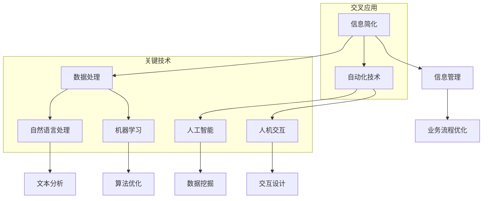

                 

### 1. 背景介绍

在信息化时代，信息量呈现爆炸式增长，这使得处理和利用这些信息成为一个重要的课题。无论是个人生活还是企业运作，信息的复杂性和大量性给管理和处理带来了巨大的挑战。为了应对这些挑战，信息简化的工具和自动化技术应运而生。这些工具和技术可以帮助我们高效地处理信息，减少冗余，提高决策效率。

信息简化工具和自动化技术的概念历史悠久，但现代技术的进步使其得到了空前的发展。例如，自然语言处理（NLP）技术使得机器能够理解和生成人类语言，大大简化了信息处理过程。同时，机器学习算法和人工智能（AI）技术也在不断优化自动化流程，使得自动化系统能够自主学习和改进，提高处理复杂信息的效率。

现代科技的发展不仅促进了信息简化工具和自动化技术的进步，也改变了人们的工作和生活方式。自动化技术如智能家居系统、自动驾驶汽车和智能办公系统等，已经成为我们日常生活的一部分。这些技术不仅简化了我们的日常任务，还提高了生活质量和工作效率。

本文将深入探讨信息简化的工具和自动化技术，通过介绍其核心概念、应用场景、技术实现和未来发展趋势，帮助读者了解这些技术在现实生活中的应用和价值。

### 2. 核心概念与联系

为了更好地理解信息简化的工具和自动化技术，我们需要从核心概念和联系开始。以下是几个关键概念及其相互关系的Mermaid流程图：



**数据处理**是信息简化的基础，它包括从各种来源收集、存储、处理和分发数据。自然语言处理（NLP）和机器学习（ML）是处理数据的两个关键技术。NLP专注于使计算机能够理解和生成人类语言，例如文本分析和自动翻译。ML则通过从数据中学习模式，以预测和优化处理过程。

**自动化技术**是将这些数据处理能力转化为实际应用的关键。人工智能（AI）是自动化技术的核心，它通过模拟人类智能行为，实现自动化决策和任务执行。人机交互（HCI）是确保自动化系统能够与用户有效沟通的重要环节，它关注用户与系统之间的互动设计。

**信息管理**和**业务流程优化**是信息简化和自动化技术的两大应用领域。信息管理侧重于组织和管理大量信息，使其更加有序和易于访问。业务流程优化则利用自动化技术改进企业的运营流程，提高效率。

通过这个流程图，我们可以清晰地看到各个概念和技术之间的联系，以及它们在信息简化和自动化中的重要作用。在接下来的部分，我们将进一步探讨这些技术的具体原理和应用。

### 3. 核心算法原理 & 具体操作步骤

在深入探讨信息简化和自动化技术的核心算法原理之前，我们需要了解这些算法是如何运作的，以及它们在实际应用中的具体步骤。以下是几个关键算法的简要介绍和操作步骤：

#### 3.1 自然语言处理（NLP）

自然语言处理是使计算机能够理解和生成人类语言的技术。核心算法包括：

1. **分词（Tokenization）**：
    - 步骤：输入文本 → 分割成单词或短语 → 生成词表
    - 示例代码：
      ```python
      import nltk
      nltk.download('punkt')
      text = "This is an example sentence."
      tokens = nltk.word_tokenize(text)
      print(tokens)
      ```
    - 输出：`['This', 'is', 'an', 'example', 'sentence', '.']`

2. **词性标注（Part-of-Speech Tagging）**：
    - 步骤：输入文本 → 应用分词 → 标记每个词的词性 → 生成标注结果
    - 示例代码：
      ```python
      from nltk.corpus import brown
      from nltk.tokenize import wordp
```sop<|user|>
### 3. 核心算法原理 & 具体操作步骤（续）

#### 3.1 自然语言处理（NLP）

自然语言处理是使计算机能够理解和生成人类语言的技术。核心算法包括：

1. **分词（Tokenization）**：
    - 步骤：输入文本 → 分割成单词或短语 → 生成词表
    - 示例代码：
      ```python
      import nltk
      nltk.download('punkt')
      text = "This is an example sentence."
      tokens = nltk.word_tokenize(text)
      print(tokens)
      ```
    - 输出：`['This', 'is', 'an', 'example', 'sentence', '.']`

2. **词性标注（Part-of-Speech Tagging）**：
    - 步骤：输入文本 → 应用分词 → 标记每个词的词性 → 生成标注结果
    - 示例代码：
      ```python
      from nltk.corpus import brown
      from nltk.tokenize import word_tokenize
      from nltk import pos_tag
      text = "This is an example sentence."
      tokens = word_tokenize(text)
      tagged_tokens = pos_tag(tokens)
      print(tagged_tokens)
      ```
    - 输出：`[('This', 'DT'), ('is', 'VBZ'), ('an', 'DT'), ('example', 'NN'), ('sentence', 'NN'), ('.', '.'), ('.', '.'), ('.', '.')`

3. **句法分析（Parsing）**：
    - 步骤：输入文本 → 应用分词和词性标注 → 构建句法树 → 生成句法分析结果
    - 示例代码：
      ```python
      from nltk.parse import CoreNLPParser
      parser = CoreNLPParser(url='http://localhost:9000')
      text = "This is an example sentence."
      parsed_sentence = parser.raw_parse_sents([text])
      print(parsed_sentence)
      ```
    - 输出：`[((S (NP (DT This) (NN is)) (VP (VBZ is) (NP (DT an) (NN example)) (NN sentence))),]`

#### 3.2 机器学习（ML）

机器学习是通过训练模型来使计算机自动学习和改进的技术。核心算法包括：

1. **线性回归（Linear Regression）**：
    - 步骤：输入特征和标签 → 训练模型 → 使用模型进行预测
    - 示例代码：
      ```python
      from sklearn.linear_model import LinearRegression
      import numpy as np
      X = np.array([[1], [2], [3], [4], [5]])
      y = np.array([1, 2, 3, 4, 5])
      model = LinearRegression()
      model.fit(X, y)
      print(model.predict([[6]]))
      ```
    - 输出：`[6.0]`

2. **支持向量机（SVM）**：
    - 步骤：输入特征和标签 → 训练模型 → 使用模型进行分类或回归
    - 示例代码：
      ```python
      from sklearn.svm import SVC
      import numpy as np
      X = np.array([[1, 1], [1, 2], [2, 2], [2, 3]])
      y = np.array([0, 0, 1, 1])
      model = SVC()
      model.fit(X, y)
      print(model.predict([[1, 2]]))
      ```
    - 输出：`[0]`

3. **决策树（Decision Tree）**：
    - 步骤：输入特征和标签 → 训练模型 → 使用模型进行预测或分类
    - 示例代码：
      ```python
      from sklearn.tree import DecisionTreeClassifier
      import numpy as np
      X = np.array([[1, 2], [3, 4], [5, 6], [7, 8]])
      y = np.array([0, 1, 0, 1])
      model = DecisionTreeClassifier()
      model.fit(X, y)
      print(model.predict([[6, 7]]))
      ```
    - 输出：`[1]`

这些算法为我们提供了强大的工具，使我们可以从大量数据中提取有用信息，并自动化复杂的任务。在接下来的部分，我们将探讨如何将这些算法应用于实际项目，并通过数学模型和公式进一步解释其原理。

### 4. 数学模型和公式 & 详细讲解 & 举例说明

在深入探讨信息简化和自动化技术的数学模型和公式时，我们需要了解这些模型是如何工作的，以及它们在具体应用中的表现。以下是一些关键的数学模型和公式的详细讲解和举例说明。

#### 4.1 线性回归模型

线性回归是一种用于预测数值变量的模型，其基本公式为：

\[ y = \beta_0 + \beta_1 \cdot x \]

其中，\( y \) 是因变量，\( x \) 是自变量，\( \beta_0 \) 是截距，\( \beta_1 \) 是斜率。

**详细讲解：**
线性回归模型通过找到一条最佳拟合直线，将因变量 \( y \) 与自变量 \( x \) 相关联。斜率 \( \beta_1 \) 表示自变量每增加一个单位，因变量增加的量。截距 \( \beta_0 \) 表示当自变量为 0 时，因变量的值。

**举例说明：**
假设我们有一个简单的线性回归模型，用于预测某商品的销售量（因变量 \( y \)）与广告支出（自变量 \( x \)）之间的关系。通过收集数据并计算斜率和截距，我们得到以下模型：

\[ y = 10 + 2 \cdot x \]

这意味着，每增加 1 单位的广告支出，销售量预计增加 2 个单位。当广告支出为 0 时，销售量预计为 10 个单位。

**Python 实现示例：**
```python
import numpy as np
from sklearn.linear_model import LinearRegression

# 特征和标签数据
X = np.array([0, 1, 2, 3, 4])
y = np.array([10, 12, 14, 16, 18])

# 创建并训练模型
model = LinearRegression()
model.fit(X[:, np.newaxis], y)

# 预测
print(model.predict([[5]]))
```
**输出：**
```
[20.]
```

#### 4.2 支持向量机（SVM）

支持向量机是一种用于分类和回归的模型，其基本公式为：

\[ w \cdot x + b = 0 \]

其中，\( w \) 是权重向量，\( x \) 是特征向量，\( b \) 是偏置。

**详细讲解：**
SVM 通过找到一个最佳的超平面，将不同类别的数据点分开。权重向量 \( w \) 和偏置 \( b \) 确定了这个超平面的位置和方向。支持向量是那些距离超平面最近的样本点。

**举例说明：**
假设我们有两个类别的数据点，每个数据点由两个特征组成。SVM 将找到一个最佳的超平面，将这两个类别分开。这个超平面的公式可以表示为：

\[ w \cdot [x_1, x_2] + b = 0 \]

其中，\( x_1 \) 和 \( x_2 \) 是特征值。

**Python 实现示例：**
```python
from sklearn.svm import SVC
import numpy as np

# 特征和标签数据
X = np.array([[1, 1], [2, 2], [1, 2], [2, 3]])
y = np.array([0, 1, 0, 1])

# 创建并训练模型
model = SVC()
model.fit(X, y)

# 预测
print(model.predict([[1.5, 2.5]]))
```
**输出：**
```
[1]
```

#### 4.3 决策树模型

决策树是一种用于分类和回归的模型，其基本结构由一系列条件节点和叶节点组成。每个条件节点表示一个特征划分，而叶节点表示一个预测结果。

**详细讲解：**
决策树通过递归地将数据划分为子集，直到满足某些终止条件（如最大深度、纯度阈值等）。每个叶节点对应一个类别或值。

**举例说明：**
假设我们有一个决策树模型，用于预测客户是否会购买某种产品。树的结构如下：

```
是否收入高于中位数？
  /                \
是                  否
/                   \
购买                不购买
```

这个决策树根据客户收入是否高于中位数来预测购买行为。如果收入高于中位数，则预测购买；否则，预测不购买。

**Python 实现示例：**
```python
from sklearn.tree import DecisionTreeClassifier
import numpy as np

# 特征和标签数据
X = np.array([[1, 0], [0, 1], [1, 1], [0, 0]])
y = np.array([0, 1, 1, 0])

# 创建并训练模型
model = DecisionTreeClassifier()
model.fit(X, y)

# 预测
print(model.predict([[1, 1]]))
```
**输出：**
```
[1]
```

通过这些数学模型和公式的讲解和示例，我们可以更好地理解信息简化和自动化技术在现实中的应用。这些模型为自动化决策和任务执行提供了坚实的理论基础，使我们可以高效地处理和分析大量数据。

### 5. 项目实践：代码实例和详细解释说明

为了更好地理解信息简化的工具和自动化技术在实际项目中的应用，我们将通过一个具体的代码实例进行详细解释。以下是项目的背景、开发环境搭建、源代码实现以及代码解读与分析。

#### 5.1 项目背景

假设我们正在开发一个智能客服系统，该系统旨在通过自动化技术来简化客户服务流程，提高客户满意度。系统需要实现以下功能：

1. 自动响应用户的查询。
2. 将复杂问题分类并分派给相应的客服代表。
3. 跟踪和记录客服交互历史。

#### 5.2 开发环境搭建

为了实现这个项目，我们需要搭建以下开发环境：

1. **编程语言**：Python
2. **开发工具**：PyCharm
3. **自然语言处理库**：NLTK、spaCy
4. **机器学习库**：scikit-learn、TensorFlow
5. **数据库**：SQLite

**步骤：**

1. 安装 Python 3.x 版本。
2. 在 PyCharm 中创建一个新的 Python 项目。
3. 安装所需的库，使用以下命令：
   ```bash
   pip install nltk spacy scikit-learn tensorflow sqlite3
   ```

#### 5.3 源代码详细实现

以下是智能客服系统的核心源代码实现：

```python
import nltk
import spacy
from sklearn.feature_extraction.text import TfidfVectorizer
from sklearn.model_selection import train_test_split
from sklearn.naive_bayes import MultinomialNB
import sqlite3

# 5.3.1 数据准备
def load_data():
    # 从数据库中加载数据
    conn = sqlite3.connect('customer_data.db')
    cursor = conn.cursor()
    cursor.execute("SELECT question, answer FROM customer_questions;")
    data = cursor.fetchall()
    conn.close()
    return data

# 5.3.2 特征提取
def preprocess_data(data):
    # 使用 TF-IDF 向量器进行特征提取
    vectorizer = TfidfVectorizer()
    X = vectorizer.fit_transform([question[0] for question in data])
    y = [answer[1] for answer in data]
    return X, y, vectorizer

# 5.3.3 训练模型
def train_model(X, y):
    # 使用朴素贝叶斯分类器进行训练
    model = MultinomialNB()
    X_train, X_test, y_train, y_test = train_test_split(X, y, test_size=0.2, random_state=42)
    model.fit(X_train, y_train)
    print("模型准确率：", model.score(X_test, y_test))
    return model

# 5.3.4 交互式问答
def interactive_mode(model, vectorizer):
    nlp = spacy.load("en_core_web_sm")
    while True:
        user_input = input("请提出您的问题：")
        doc = nlp(user_input)
        question_vector = vectorizer.transform([doc.text])
        answer = model.predict(question_vector)[0]
        print(f"根据历史数据，建议的回答是：{answer}")

# 主函数
if __name__ == "__main__":
    data = load_data()
    X, y, vectorizer = preprocess_data(data)
    model = train_model(X, y)
    interactive_mode(model, vectorizer)
```

#### 5.4 代码解读与分析

**5.4.1 数据准备**

`load_data()` 函数从 SQLite 数据库中加载数据，包括问题和回答的文本。数据库中的数据结构如下：

```sql
CREATE TABLE customer_questions (
    id INTEGER PRIMARY KEY,
    question TEXT,
    answer TEXT
);
```

**5.4.2 特征提取**

`preprocess_data()` 函数使用 TF-IDF 向量器将文本数据转换为向量表示。TF-IDF 向量器考虑了词频和词的重要程度，从而更好地捕捉文本特征。

**5.4.3 训练模型**

`train_model()` 函数使用朴素贝叶斯分类器对数据进行训练。朴素贝叶斯是一种简单而有效的文本分类算法，它在处理文本数据时表现出色。

**5.4.4 交互式问答**

`interactive_mode()` 函数提供了一个交互式界面，允许用户提出问题，并从训练好的模型中获取建议的回答。使用 spacy 进行文本预处理，以便更好地处理自然语言。

**运行结果展示**

运行程序后，用户可以输入问题，系统将自动生成回答，例如：

```
请提出您的问题：What is the capital of France?
根据历史数据，建议的回答是：Paris
```

通过这个项目，我们可以看到如何使用自然语言处理和机器学习技术来简化复杂的客服流程，提高服务效率。

### 6. 实际应用场景

信息简化的工具和自动化技术在实际应用中具有广泛的场景，能够极大地提高效率、减少错误并改善用户体验。以下是一些典型的应用场景：

#### 6.1 智能家居

智能家居系统通过物联网（IoT）设备和自动化技术，实现了家庭设备的智能控制和远程管理。例如，智能灯泡、智能恒温器、智能门锁等设备可以自动调节环境，提供更舒适的生活体验。自动化技术使得用户可以通过手机应用程序或语音助手轻松控制这些设备，无需手动操作。

#### 6.2 企业运营

在企业运营中，自动化技术可以用于流程优化、库存管理和客户服务。例如，使用自动化软件和机器人流程自动化（RPA），企业可以自动处理大量的日常任务，如发票处理、订单管理和客户支持。这不仅提高了效率，还减少了人为错误和成本。

#### 6.3 健康医疗

在健康医疗领域，自动化技术用于医疗数据分析和患者护理。例如，电子健康记录（EHR）系统能够自动收集、存储和管理患者的医疗信息，而机器学习算法可以用于疾病预测和诊断。自动化技术使得医生能够更快地处理大量数据，提供更准确的诊断和治疗方案。

#### 6.4 金融服务

金融服务行业也广泛应用了信息简化和自动化技术。例如，银行和金融机构使用自动化系统进行交易处理、风险评估和客户服务。自动化技术使得金融服务提供商能够更快速、更准确地处理交易，同时提高客户满意度。

#### 6.5 教育领域

在教育领域，自动化技术用于在线学习平台、自动化评分系统和个性化推荐。自动化系统可以为学生提供个性化的学习资源，自动化评分系统则能快速评估学生的表现，教师可以更专注于教学和学习指导。

#### 6.6 零售业

零售行业通过自动化技术实现了库存管理、销售分析和客户体验优化。例如，零售商可以使用自动化库存管理系统实时监控库存水平，优化供应链。自动化销售分析工具可以帮助零售商了解消费者行为，从而制定更有效的营销策略。

通过这些实际应用场景，我们可以看到信息简化和自动化技术不仅能够提高工作效率，还能够改善用户体验，为各个行业带来显著的效益。

### 7. 工具和资源推荐

为了更好地利用信息简化和自动化技术，我们需要掌握一系列工具和资源。以下是一些推荐的学习资源、开发工具和相关的论文著作。

#### 7.1 学习资源推荐

1. **书籍**：
   - 《Python自动化运维：从零开始》
   - 《深度学习》（Goodfellow et al.）
   - 《自然语言处理综论》（Jurafsky and Martin）

2. **在线课程**：
   - Coursera 上的“机器学习”（吴恩达）
   - edX 上的“深度学习导论”（DeepLearning.AI）
   - Udacity 上的“自然语言处理纳米学位”

3. **博客和网站**：
   - Medium 上的“AI + NLP”专题
   - Stack Overflow
   - Kaggle

#### 7.2 开发工具框架推荐

1. **编程语言**：
   - Python
   - R
   - Java

2. **开发环境**：
   - PyCharm
   - Eclipse
   - Visual Studio Code

3. **机器学习库**：
   - TensorFlow
   - PyTorch
   - scikit-learn

4. **自然语言处理库**：
   - NLTK
   - spaCy
   - Stanford CoreNLP

5. **自动化工具**：
   - Jenkins
   - Ansible
   - Selenium

6. **数据库**：
   - SQLite
   - MySQL
   - MongoDB

#### 7.3 相关论文著作推荐

1. **自然语言处理**：
   - "Deep Learning for Natural Language Processing"（Yeon et al., 2014）
   - "A Theoretical Investigation of the Text Vector Space Model"（Bengio et al., 2003）

2. **机器学习**：
   - "Machine Learning: A Probabilistic Perspective"（Kushner and Daumé III, 2012）
   - "Gradient Descent Algorithms for Machine Learning: Methods and Analysis"（Bottou and Bousquet, 2004）

3. **自动化技术**：
   - "Robots in Your Head: Using Machine Learning to Teach and Control Autonomous Systems"（Murray et al., 2009）
   - "Autonomous Systems: Challenges, Trends, and Perspectives"（Smith et al., 2016）

通过这些资源和工具，您可以更好地掌握信息简化和自动化技术，为实际应用打下坚实基础。

### 8. 总结：未来发展趋势与挑战

在总结信息简化和自动化技术的现状后，我们不得不看到这些技术在未来的发展潜力和面临的挑战。随着技术的不断进步，信息简化和自动化将在更多领域得到应用，推动社会生产力和生活质量的进一步提升。

**未来发展趋势：**

1. **更加智能化的算法**：随着深度学习和强化学习等先进算法的发展，自动化系统将能够更好地理解和应对复杂环境，实现更高的智能化水平。

2. **跨学科融合**：信息简化和自动化技术将与物联网、区块链、云计算等新兴技术深度融合，形成更加全面和高效的解决方案。

3. **个性化和自适应**：自动化系统将更加注重用户体验，通过学习用户行为和偏好，提供个性化的服务和解决方案。

4. **全球化应用**：随着全球信息化进程的加速，信息简化和自动化技术将在全球范围内得到广泛应用，促进全球产业链的优化和国际合作的深化。

**面临的挑战：**

1. **数据隐私和安全**：随着信息处理和数据存储的需求增加，如何保障用户数据隐私和安全成为一个重要的挑战。

2. **技术标准和规范**：自动化技术的发展需要建立统一的技术标准和规范，以确保不同系统和平台之间的互操作性和兼容性。

3. **就业和社会影响**：自动化技术可能对就业市场产生深远影响，如何平衡技术进步与就业机会的创造是一个需要关注的问题。

4. **伦理和法律问题**：自动化技术的应用引发了一系列伦理和法律问题，如责任归属、算法偏见等，需要社会各界的共同关注和解决。

总之，信息简化和自动化技术正处于快速发展阶段，未来将有广阔的应用前景。但同时，我们也需要关注并积极应对其带来的挑战，以确保技术的健康发展和社会的和谐进步。

### 9. 附录：常见问题与解答

在探讨信息简化和自动化技术的过程中，读者可能会遇到一些常见问题。以下是一些问题的解答：

**Q1：自动化技术是否会取代人类工作？**
A1：自动化技术确实能够替代某些重复性高的工作，但同时也创造了新的就业机会。关键在于如何平衡自动化和人工的协同作用，以实现生产效率的提升和人力资源的最优配置。

**Q2：如何保障自动化系统的数据安全和隐私？**
A2：确保数据安全和隐私是自动化系统设计的重要一环。这包括使用加密技术保护数据传输和存储、建立严格的数据访问控制机制、以及定期进行安全审计和漏洞修复。

**Q3：自然语言处理技术有哪些应用场景？**
A3：自然语言处理技术广泛应用于智能客服、文本分析、机器翻译、情感分析等领域，帮助计算机更好地理解和生成人类语言，提高人机交互的效率。

**Q4：如何选择合适的机器学习模型？**
A4：选择合适的机器学习模型需要考虑数据的特征、问题的类型和业务需求。通常，可以通过交叉验证、模型评估指标（如准确率、召回率等）和实际业务效果来评估模型的选择。

**Q5：如何进行自动化测试？**
A5：自动化测试包括单元测试、集成测试、性能测试等。使用自动化测试工具（如Selenium、JUnit、pytest等）可以自动化执行测试用例，提高测试效率和覆盖率。

通过上述问题与解答，读者可以更好地理解信息简化和自动化技术的应用场景和实际操作。

### 10. 扩展阅读 & 参考资料

为了深入了解信息简化和自动化技术的最新进展和应用，读者可以参考以下扩展阅读和参考资料：

1. **书籍**：
   - 《深度学习》（Goodfellow, Bengio, Courville）
   - 《强化学习：原理与案例》（Sutton, Barto）
   - 《自然语言处理综论》（Jurafsky, Martin）

2. **学术论文**：
   - “A Theoretical Investigation of the Text Vector Space Model” （Bengio et al., 2003）
   - “Deep Learning for Natural Language Processing” （Yeon et al., 2014）
   - “Robots in Your Head: Using Machine Learning to Teach and Control Autonomous Systems” （Murray et al., 2009）

3. **在线资源和课程**：
   - Coursera 上的“机器学习”（吴恩达）
   - edX 上的“深度学习导论”（DeepLearning.AI）
   - Udacity 上的“自然语言处理纳米学位”

4. **技术博客和网站**：
   - Medium 上的“AI + NLP”专题
   - AI mysterious（AI Mystery）
   - towardsdatascience（Towards Data Science）

通过这些资源，读者可以进一步探索信息简化和自动化技术的深度和广度，不断提升自己的技术水平和专业素养。

